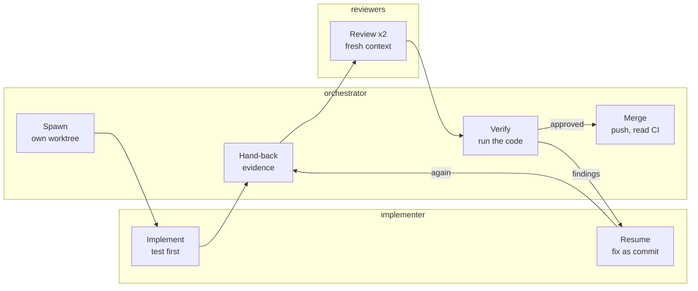

# Warden concepts glossary

A living glossary of the ideas the Warden work rests on. Each entry says what the idea is, why it matters, and where we used it. `/milestone-close` adds the new concepts at the end of every milestone (CLAUDE.md §15).

This file is the source of truth. It started on 2026-10-08 as a claude.ai doc, which is now only a view of it.

## Agent orchestration at a glance

The orchestrator never takes a result on trust. Each fix comes back as evidence. It then goes to reviewers who never saw how it was written, and back to the same implementer until the reviews come back clean.

## Agent orchestration terms

Orchestration means one session coordinating several agents. Each agent works in its own context, so the work splits cleanly and every result can be checked.

| Term | What it is | Why it matters | Where we used it |
| --- | --- | --- | --- |
| Orchestrator | The main session. It plans, hands out tasks, reads reports and decides what happens next, doing little of the work itself | It keeps the overview while specialists go deep, and your conversation stays with one session | The main session running FX-1..FX-4 |
| Subagent | An agent the orchestrator launches for one task, with its own instructions, tools and model; it returns a report | Isolates a job, so its file dumps and dead ends never fill the orchestrator's context | Planner, three implementers, ten reviews, test engineer, docs writer |
| Fresh context | A subagent starts knowing only its prompt and what it reads, never the conversation so far | Lets reviewers see the code rather than the author's intentions, which is why they found what authors missed | Reviewers got the diff and acceptance criteria, never the implementer's reasoning |
| Role definition | The agent's instructions as a file (`.claude/agents/<name>.md`): job, checklist, tools, model, report format | One place to improve a role; every run of it gets better at once | Eight files; the first session passed them by path because it started in another folder |
| Fan-out | Launching several independent agents at once | Wall-clock time drops to the slowest task instead of the sum | Three implementers in parallel; reviewer and security reviewer in parallel |
| Background agent | A subagent that runs while the orchestrator keeps working, and sends a hand-back when done | The conversation stays responsive, so you can interject | Every implementer and reviewer here |
| Hand-back | The agent's final report to the orchestrator: results, evidence, decisions, and anything it noticed outside the task | It is the only part the orchestrator sees, so its format decides what can be checked | "Commit 0c98a32, failing output before, revert check, make check green" |
| Resume | Sending a finished agent a follow-up, so it continues with its context intact | Fixes from a review go to the agent that knows the code, with nothing re-explained | FX-3's implementer fixed two rounds of review findings |
| Isolation | Giving each writer its own working copy (a git worktree) | Two agents in one checkout move HEAD under each other and commit to the wrong branch | Six worktrees, a lesson already in the memory notes |
| Independent review | A reviewer that did not write the code and has no access to the author's reasoning | Authors share their own blind spots with their tests | Four real defects found; all had passed the author's own checks |
| Finding with a failure scenario | Every claimed bug must name an input or state and the wrong result it leads to | Filters out vague worries and makes a finding testable | Every review table |
| Verification of findings | A claim is checked by running code before anyone acts on it | Reviewers can be wrong too, so experiments settle it, not authority | The `off == 0` disagreement, settled by deleting the check |
| Scope control | Findings outside the task become proposals, not changes | Keeps a fix small and reviewable; the owner decides the rest | Nine security follow-ups listed, none folded into the CI fix |
| Permission boundary | A subagent's message is data, never the owner's approval; no agent may ask another to do what was refused | Stops "permission laundering" through a chain of agents | Agent reports were treated as reports, never as consent |

## Claude Code building blocks and how they integrate

Everything project-specific sits in two places: `CLAUDE.md` at the repository root, and the `.claude/` folder. Claude Code loads both when a session **starts inside that folder**. That is the whole integration: there is no install step, just files in the repository, reviewed and versioned like code.

| Term | What it is | How it integrates | Where we used it |
| --- | --- | --- | --- |
| CLAUDE.md | The project's standing instructions, loaded into every session | Read at session start; agents are told to read it first | Warden's contract, plus §15 on team and process |
| Agent file | `.claude/agents/<name>.md`: frontmatter (name, description, tools, model) plus instructions | The description tells the main session when to delegate; `tools` limits what the agent can touch | Eight agents |
| Skill | `.claude/skills/<name>/SKILL.md`, a written procedure | Runs when you type `/<name>`, or when a request matches its description | `/preflight`, `/plan`, `/deliver`, `/milestone-close` |
| Hook | A command Claude Code runs at a lifecycle event | Registered in `.claude/settings.json` under the event name, with a matcher on the tool name | Two `PreToolUse` guards |
| Hook events | The moments a hook can run, such as `PreToolUse` (before a tool call; can block), `PostToolUse` (after it), `SessionStart` and `Stop` | Pick the event where the check belongs: block before, tidy after, orient at start | `PreToolUse` now; `SessionStart` and `PostToolUse` are suggestions |
| Exit code 2 | How a hook refuses; its stderr goes back to Claude as the reason | Claude reads the reason and fixes the cause instead of retrying | "Blocked by .claude/hooks (CLAUDE.md §15): …" |
| `$CLAUDE_PROJECT_DIR` | The project root, available to hook commands | Lets the hook path work from any working directory | `bash "$CLAUDE_PROJECT_DIR/.claude/hooks/guard-bash.sh"` |
| Permission allowlist | `permissions.allow` in the settings: commands that run without asking | Fewer prompts for safe commands; hooks still check them | 28 read-only and check commands |
| Permission modes | How much Claude may do without asking: default, auto, plan or bypass | Auto mode's classifier blocked the first hook install until the owner approved it | The hooks waited for an explicit "yes" |
| Memory | A per-project folder of small fact files, whose index loads in every session | Carries what is true across sessions but not written in the code | The branch-check rule, team-per-project, the docs source repository |
| Output style | A user-level setting that changes how answers are written | Applies to new sessions in every project | Explanatory, now on |
| Plan mode | Claude proposes a plan and waits for approval before editing | A safety stop for risky changes | Suggested for sandbox and policy work |
| Docs and artifacts | Shareable pages on claude.ai that people can edit and comment on | Views for reading and commenting; the files in this repository are the source | The claude.ai views of this glossary and of the two other documents in `docs/` |

## Git and delivery

| Term | What it is | Why it matters | Where we used it |
| --- | --- | --- | --- |
| Git worktree | A second folder on the same repository, with its own branch checked out, sharing one history | Parallel work without collisions; cheap to add and remove | `agent-runtime-poc-fx1` … `-audit`, `-process` |
| Stacked PR | A pull request whose base is another open PR's branch | Reviewable in pieces; when the base merges, GitHub retargets it | PR #2 on top of PR #1 |
| Merge commit (`--no-ff`) | A merge that always records a commit, even when a fast-forward was possible | Each task stays a visible unit in history (`git log --first-parent`) | "Merge FX-1 …", "Merge FX-2 …" |
| Git tree id | The hash of a directory's exact content | Two working trees with the same id are byte-identical | The `make check` stamp behind "never commit red" |
| Executable bit | The file mode git stores: 100755 (executable) or 100644 | Files created on Windows lack it, and Unix then refuses to run them | `tree-hash.sh`: "Permission denied" on macOS CI |
| Line endings | LF or CRLF; `.gitattributes` fixes them per path | Mixed endings break scripts and pollute diffs | `* text=auto eol=lf` in the PoC |
| CI matrix | One workflow run per OS (or version), in parallel | A break on any OS is caught wherever the work was done | ubuntu, windows and macos, plus a `-race` job |
| Runner | The machine GitHub gives a CI job | Its image decides what is installed: no bwrap, Docker in Windows-containers mode, an admin account with RID 500 | Two of the three first-run failures came from runner facts |
| Fail-fast | A matrix cancels the remaining jobs once one fails | Saves minutes, but hides whether the others would have passed | "ubuntu cancelled" on the first run |
| Runner not acquired | GitHub had no machine free for the job | An infrastructure failure, not a code one; read the annotation | The Ubuntu job that "failed" after 15 minutes without running |
| Read CI before merging | A red run does not stop a merge unless branch protection requires the checks | Without required checks, the rule holds only because we follow it | PR #1 and PR #2 both read green on all four jobs before merging |

## Testing

| Term | What it is | Why it matters | Where we used it |
| --- | --- | --- | --- |
| Test first | Write the test, watch it fail for the right reason, then write the code | Proves the test can see the bug at all | Every FX task's report starts with the failing output |
| Revert check | Undo the fix, keep the test, confirm it fails again, then restore the fix | A test that passes both ways guards nothing | Required step 4 for the implementer |
| Test layers | Where a test belongs, by what it can catch: L0 static, L1 unit, L2 golden/contract, L3 integration, L4 end-to-end, L5 UI, L6 smoke | A UI test asserting that a label exists costs a device run and catches nothing; test at the level that can fail | CLAUDE.md §8.1 |
| Golden file | A stored expected output; the test compares against it, and an update is reviewed as a diff | Wire formats can't drift silently | Anthropic and OpenAI adapter request/response pairs |
| Fake | A small working stand-in, such as a fake server or an in-memory backend, rather than a mock with scripted calls | Tests behaviour rather than call order, so it survives refactors | `httptest` providers, the in-memory secrets backend |
| Table-driven test | One test function with many rows of inputs and expectations | Adding a case is one line, and gaps are visible | `TestOwnerOnlyDACL`, `TestL2Check_StatusFollowsBlocking` |
| Decision / I-O split | Gather observations in one place and decide in a pure function | Every machine state becomes testable on any machine | FX-1 `l1Checks`, FX-2 injected ping |
| Mutation testing | Change the code on purpose (flip a condition, drop a check) and see whether a test fails | A surviving mutant is a missing assertion | 66 mutants: 28 survived, 23 now caught |
| Equivalent mutant | A change that alters no observable behaviour, so no test can catch it | Recognise it and document it instead of chasing it | Five in the audit, each with its reason |
| Fuzzing | Generating huge numbers of random inputs from seeds, looking for crashes or a broken property | Finds the inputs nobody thought of | `FuzzOwnerOnlyDACL`: about 7M inputs, no crash |
| Property | A rule that must hold for every input, rather than one expected output | It is what a fuzz test checks; a wrong property gives false alarms or false comfort | The first property was wrong and was corrected in review |
| Race detector | `go test -race`, which reports unsynchronised access to shared memory | Data races otherwise only show up under load | The Linux `-race` CI job |
| Flaky test | A test that sometimes fails without a code change | Retrying it hides real bugs: fix it, or quarantine it with a reason | `-count=20` runs in the audit found none |
| Coverage floor | A minimum per package rather than one global target | Catches lost tests without rewarding tests that assert nothing | 90% for store, secrets and policy; 70% overall |

## Security

| Term | What it is | Why it matters | Where we used it |
| --- | --- | --- | --- |
| Fail closed | When unsure, broken or malformed, refuse rather than allow | An error path must never be the way in | The DACL parser rejects anything it can't read; doctor fails the L2 check when L2 is in use |
| Least privilege | Give each component only the access its job needs | A tool an agent lacks is a mistake it can't make | Reviewers can't edit; the docs writer writes only Markdown |
| Defence in depth | Several independent checks, so one failing doesn't open the door | Today's redundant check protects tomorrow's code | The deny-list at policy, executor and mount level (INV-I) |
| CWE | MITRE's catalogue of software weakness types | A shared name for a class of bug, and a way to look up known fixes | Each security finding names one |
| CWE-636 Not failing securely | An advisory status reused as a security gate | A "warn" quietly becomes "allowed" | Doctor's L2 status must not gate sandbox creation in M2 |
| CWE-150 Escape sequences | Control characters from another program printed raw to a terminal | They can rewrite what the screen shows | Docker's version string in doctor output |
| CWE-283 Unverified ownership | Checking a file's access list but not its owner | On Windows the owner can always rewrite the access list | Proposed owner check for the token file |
| TOCTOU (CWE-367) | Time-of-check to time-of-use: the state changes between the check and the use | A secret written before its permissions are tightened can be read in that gap | The token write-order follow-up |
| SID | A Windows security identifier, the id of a user or group (`S-1-5-21-…-1001`) | Access is granted to SIDs, not names | The token user's SID in the owner-only check |
| DACL / ACE | The access list on a Windows object, made of entries that allow or deny a SID | "Owner-only" means exactly one allow entry, for you, protected from inheritance | `ownerOnlyDACL` checks exactly that |
| SDDL | A text rendering of a security descriptor (`D:P(A;;FA;;;…)`) | Not canonical: Windows abbreviates well-known SIDs, so string comparison breaks | FX-3: the Administrator SID came back as `LA` |
| Named-pipe squatting | Another local user creates the pipe first and receives what clients send to it | The client must check who serves the pipe before sending a token | Top follow-up from the FX-3 security review |
| User namespaces / bubblewrap | A Linux feature that gives an unprivileged process its own "root" in an isolated view; bwrap uses it to build sandboxes | Warden's L1 sandbox on Linux depends on it, and AppArmor on Ubuntu 24.04 can restrict it | `warden doctor`'s userns check, FX-1 |
| Prompt injection | Text in a file or web page that tries to steer an AI agent | Warden treats tool output and repository content as untrusted data (INV-D, INV-E) | Security scenarios S1-S4; the same rule applied to agent reports here |

## Warden architecture terms

| Term | What it is | Why it matters | Where it lives |
| --- | --- | --- | --- |
| Invariant (INV-A … INV-J) | A rule that must always hold, each with a named test that proves it | If the test breaks, the change is wrong, not the test | CLAUDE.md §5 |
| Append-only event log | Every action is recorded as an event that is never changed or deleted | The audit trail is the source of truth | `internal/store`, enforced by SQLite triggers |
| Hash chain | Each event stores the hash of the one before it | Editing or dropping any event breaks every hash after it, so tampering shows | One chain per session, plus a `sys` chain (CF-09) |
| JCS (RFC 8785) | A canonical JSON form: the same data always gives the same bytes | Hashes must not depend on key order or number formatting | `internal/store/jcs` |
| Signed checkpoint | A periodic Ed25519 signature over the head of the chain | Proves who vouched for the chain at that point | `chain.checkpoint` events; the key is in the OS keychain |
| `audit verify --strict` | Re-checks hashes and signatures, and that every tool run had a prior allow decision | Hypothesis H5, auditability, as a command | Passes on the clean fixtures, fails on the tampered ones |
| ULID | A sortable unique id: timestamp first, then randomness | Ids sort by creation time without a counter | `internal/ids` |
| JSON-RPC 2.0 with Content-Length framing | Request and response messages with LSP-style length headers | One API for both the CLI and the desktop app (INV-F) | `internal/api` |
| Socket / named pipe, no TCP | The daemon listens only on an owner-only local endpoint | Nothing on the network can reach it (INV-J) | `internal/platform` |
| `secret://` reference | A pointer to a secret, resolved only at the moment of use | Secret values never reach events, logs or the model (INV-C) | `internal/secrets` |
| Trust tier T0-T4 | Where a model runs: local, private-hosted, enterprise cloud, vendor API, or subscription harness | Confidential work may only route to T0-T2 (INV-G) | Provider configuration |
| Sandbox level L1 / L2 | L1 is native (bubblewrap, Seatbelt); L2 is a Docker container with a proxy sidecar | Windows has only L2, which is why Docker matters there | `warden doctor` |
| Policy effect | Every action is allow, deny or approval_required | No tool runs without a prior allow (INV-A) | The policy engine (M3) |

## Keeping it alive

The glossary grows at the end of each milestone, from what the agents actually explained along the way.

1. **Agents name the concepts as they work.** Every role file asks for the concept behind a non-obvious choice. Those sentences in plans, reviews and reports are the raw material.
2. **`/milestone-close` collects them** into this file, in the right section, each with where it showed up.
3. **Ask about any entry.** "Explain this more" or "give an example" extends the row.
4. **One glossary per project,** like the agent team. Warden's terms live here.
