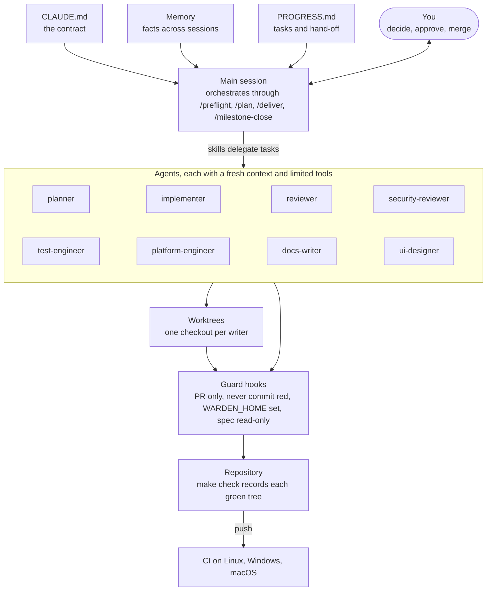

# Working with Claude Code: the Warden setup

As of 2026-10-09. This file is the source of truth; it started as a claude.ai doc, which is now a view of it. The concepts behind it are in [GLOSSARY.md](GLOSSARY.md), and the run that tested it is in [reports/2026-10-08-m1-agent-team-ci-fixes.md](reports/2026-10-08-m1-agent-team-ci-fixes.md).

## Summary

The Warden PoC has its own working environment for Claude Code. Instead of one assistant doing everything, it has three things:

- **A team:** eight specialised agents, each with a narrow job, a fresh context and limited tools.
- **A procedure:** four skills that chain those agents into plan, deliver and close.
- **Guards:** six hook rules that a machine enforces, so they can't be forgotten.

CLAUDE.md ties it together as the contract that every session and every agent reads.

The setup was tried for real on the CI fixes for PR #1:

- three fixes, implemented in parallel;
- ten reviews, which found four real defects the authors' own tests had missed;
- a test audit with 66 deliberate breakages;
- one instruction from the owner to start it, then a "yes" for the hooks.

It lives only in this repository (merged through PR #2), because each project gets a team fitted to it.

## At a glance

The session reads the contract, memory and progress before doing anything, then delegates through the skills. Every agent works in its own checkout. Every command, from any of them, passes the guards before it reaches the repository.

## CLAUDE.md: the contract

CLAUDE.md at the repository root is loaded into every Claude Code session started here, and every agent is told to read it first. It is where the project's rules live, so nobody has to repeat them in a prompt.

The Warden contract was already strong before this work. It had:

- invariants with the tests that prove them;
- fixed decisions and the allowed dependencies;
- seven testing layers;
- "ask before" and "never" lists;
- a session protocol.

We added §15, "Team and process". It lists the agents, describes the flow, and sets four rules:

1. **Reviews are independent.** Reviewers get the diff and the acceptance criteria, not the author's reasoning. A finding needs a concrete failure scenario.
2. **One checkout per writer.** Parallel tasks run in separate worktrees, and every commit is preceded by a branch check.
3. **The owner decides** what the contract reserves for the owner, conflicts marked "needs owner", and merges.
4. **Explain the why.** Plans, reviews and reports name the concept behind each non-obvious choice.

§15 also describes the guard hooks, so a blocked command is understood as "not done yet" rather than an obstacle to route around.

A CLAUDE.md works when its rules carry their reasons, invariants are tied to named tests, the "ask" and "never" lists are explicit, and stop conditions are spelled out. Aspiration without a check doesn't work, which is why the most important rules also became hooks.

## Agents

An agent is a Markdown file in `.claude/agents/`. Its frontmatter gives:

- a name;
- a description, which tells the main session when to use it;
- the tools it may use;
- the model it runs on.

The body holds its instructions. The main session hands it a task, and it works in its **own fresh context** and returns a report.

A job title doesn't make an agent useful. These four things do:

1. **Fresh context.** It hasn't seen how the code was written, so it reviews what is there, not what was meant.
2. **A narrow job**, with a checklist drawn from the project's own rules: CLAUDE.md sections, invariants, design documents.
3. **Limited tools.** Reviewers cannot edit, the test engineer may only touch tests, and the docs writer may only touch Markdown. A tool an agent doesn't have is a mistake it can't make.
4. **A report format** that makes results checkable. Every finding has a file, a line and a concrete failure scenario, and is marked CONFIRMED or PLAUSIBLE.

| Agent | Model | Tools | Use it when |
| --- | --- | --- | --- |
| planner | opus | read only | A problem is bigger than one commit |
| implementer | the session's | all | One planned task needs doing |
| reviewer | opus | read, and run tests | After every commit, and before every PR |
| security-reviewer | opus | read, and run tests | A change touches the sandbox, secrets, policy, audit or transport |
| test-engineer | the session's | tests only | After a task, or at the end of a milestone |
| platform-engineer | the session's | all | CI is red, or for scripts, Docker, WSL2 or prerequisites |
| docs-writer | sonnet | Markdown only | After tasks land, and at the end of a milestone |
| ui-designer | opus | read, and the browser pane | From M6, for the desktop app |

Every agent ends its instructions the same way: explain the concept behind a non-obvious choice in a sentence or two, because the owner is learning the theory along the way.

**One catch:** project agents only load in a session started inside this repository. The CI fixes ran from a session started in another folder, so each agent had to be given its role file by path.

## Skills

A skill is a folder `.claude/skills/<name>/` with a `SKILL.md` that holds a procedure. You start one by typing `/<name>`, and Claude also picks one up when a request matches its description. Agents are *who* does the work; skills are *how* the work moves from one agent to the next.

| Skill | Use it when | What it does |
| --- | --- | --- |
| `/preflight [M<n>]` | Starting a milestone or a session | Checks, read-only, that the toolchains, bwrap, Docker, Ollama, the Copilot CLI, keys and push access meet the milestone's needs, and reports what to install |
| `/plan <problem>` | Anything bigger than one commit | The planner splits it into tasks with tests and lists the owner's questions; once the owner agrees, the tasks are recorded in PROGRESS.md |
| `/deliver <task>` | Doing a planned task | Runs the implementer in its own worktree, the reviewer and security reviewer in parallel, fixes, the test audit and the docs, ending in a green commit |
| `/milestone-close` | The milestone's work is done | Acceptance commands, final audits, docs and glossary, push, PR to main, read CI; the owner merges |

`/preflight` exists because M1 lost hours to prerequisites found halfway through: Ollama, the Copilot CLI, Docker and push access. A one-minute check up front would have surfaced them all.

## Hooks

A hook is a command Claude Code runs automatically at a fixed moment, for example before a tool call. A `PreToolUse` hook receives the call as JSON and can block it: exit code 2 refuses the call and sends the hook's message back to Claude. An instruction in CLAUDE.md can be forgotten under pressure; a hook can't.

The hooks are registered in `.claude/settings.json`. `guard-bash.sh` runs before every Bash and PowerShell command, and `guard-edit.sh` before every file edit.

| Rule | Blocks | Why |
| --- | --- | --- |
| PR only | Pushes to main/master, bare pushes from them, force pushes | main changes only through a pull request |
| No skipped hooks | `--no-verify` | Fix what the hook reports instead |
| No commits on main | `git commit` on main/master | Branch first |
| Never commit red | A commit whose working tree has not passed `make check` | `make check` once ignored lint failures (D-025) |
| Temp home | `warden`/`wardend` without `WARDEN_HOME` | One M1 run created the owner's real Warden home |
| Read-only spec | Edits to the WRD and design documents | A "never" rule in the contract |

**How "never commit red" works.** When `make check` passes, it records the git tree id of the files exactly as they were. At commit time, the guard recomputes the id and compares. Any change since the green run, even one character, blocks the commit until `make check` runs again. Markdown-only commits are exempt.

**How the hooks are tested.** The hooks are code, so they have tests: 56 cases in `.claude/hooks/test-hooks.sh`, run inside `make check` on Linux, Windows and macOS. Each rule is tested both ways. It must block what it should, and it must let honest commands through, such as a commit message containing "push to main". Disabling any single rule turns at least one case red.

**Why the tests mattered.** The first draft hit a bash parse error on every command, so in real use it would have blocked everything. The tests caught it before it was committed.

## Worktrees, background agents and memory

**Worktrees make parallel work safe.** A git worktree is a second folder on the same repository, with its own branch checked out and one shared history. The CI fixes used six: one per fix, one for the test audit, one for the process branch, and the main checkout where merges happen. Three implementers committed at the same time without touching each other's files.

**Background agents keep the main session free.** Agents launched in the background report back when they are done, so several can run at once while the conversation stays responsive. A fix in reply to a review goes back to the *same* implementer, which still has its context.

**Memory carries what the repository can't.** Claude Code keeps a small per-project folder of fact files, and its index loads into every session. Examples: "check the branch before committing", "agent-platform-docs is the source of the specification", "the owner builds a team per project and wants the concepts explained".

**PROGRESS.md is the hand-off between sessions.** Long sessions get summarised when the context fills up. The plan, the tasks with their evidence, and the open questions all live in `docs/PROGRESS.md`, so a fresh session can pick up exactly where the last one stopped.

## What we learned running it

The process paid for itself on its first run. It also exposed gaps in its author's own work, and the same process caught them.

What worked:

- **Independent review** found four defects that had passed the authors' own revert checks: a test passing for the wrong reason, a stale comment, a wrong fuzz property, and a test pinning trivia. One of them led to a stricter production parser.
- **Parallel worktrees:** three fixes were implemented at the same time, with no conflicts and no shared-checkout accidents.
- **Scope discipline:** the security reviews raised nine real hardening items. They became proposals for the owner instead of part of the CI fix, so the fix stayed small and reviewable.
- **Running code beats arguing:** a reviewer and an implementer disagreed about one test, and a two-line experiment settled it.

What went wrong, and what changed because of it:

| What happened | Fix |
| --- | --- |
| The session ran from another folder, so the project's agents and skills were not loaded | Agents were briefed by file path; start sessions inside this repository |
| The first guard draft would have blocked every command (a bash parse error) | Tests written alongside the hooks caught it; they now run in `make check` |
| A new script was committed without its executable bit, so macOS CI failed | `make.sh` calls it through `bash`, and the exec bits are set |
| A comment-only change and a script fix were committed before running `make check` | Exactly what the commit guard now refuses |
| The planner reused ids T1-T3, which already mean demo tasks | Renamed to FX-1..FX-4; the planner now prefixes task ids |
| An agent wrote files through Python on Windows and briefly corrupted `§` (cp1252, CRLF) | Caught before the commit; the implementer now has an encoding rule |

## Suggestions

**Do now: all done on 2026-10-09**

- [x] **Merge PR #2.** Done.
- [ ] **Start Claude Code sessions inside this repository**, then test the hooks live with `git push --dry-run origin main`, which should be refused. This step is the owner's.
- [x] **Cut permission prompts:** `.claude/settings.json` now allows 28 read-only and check commands. `git branch` is narrowed to `--show-current`, so the allowlist can never delete a branch.
- [x] **A learning output style:** Explanatory is now the default for new sessions (Settings → Claude Code).
- [x] **Two one-line agent fixes:** the planner prefixes task ids, and the implementer has an encoding rule.

**Soon: an hour or two each**

- [ ] **A `SessionStart` hook** that prints the branch, the open PROGRESS checklist and the last CI result, so every session starts oriented.
- [ ] **A `PostToolUse` hook** that runs `gofmt` on every edited Go file, removing a whole class of lint round trips.
- [ ] **A status line** showing the branch and whether the working tree still matches the last green `make check`.
- [ ] **CI auto-fix on PRs** in the desktop app: a red run is diagnosed and fixed on the branch without the owner having to start it. The owner still merges.
- [ ] **One session per milestone or task,** with `docs/PROGRESS.md` as the hand-off. This avoids the context summaries that long sessions hit.
- [ ] **Plan mode for risky changes:** Claude proposes and the owner approves before any file changes. Use it on anything touching the sandbox or policy.

**Later: when the need is real**

- [ ] **A project-starter template:** the generic parts (agent skeletons, the hook library and its test harness, the four skills), copied into a new repository and then fitted to its CLAUDE.md.
- [ ] **A nightly GitHub Actions job** for what `make check` leaves out: integration tests, `-race` at `-count=20`, and a dependency audit.
- [ ] **Multi-agent workflows** for big fan-outs, such as an audit of a whole milestone across every package. Ask for one explicitly ("use a workflow"); it costs more tokens, so keep it for milestones.
- [ ] **A second opinion before a milestone merge:** the built-in `/code-review` and `/security-review` on the whole milestone diff.
- [x] **A concepts glossary per project:** [GLOSSARY.md](GLOSSARY.md).

## Recipe for the next project

The order matters: first the rules, then the people who follow them, then guards that enforce the rules that slipped.

1. **Write or tighten CLAUDE.md.** Cover the mission and scope, fixed decisions, invariants with their tests, testing layers, the "ask before" and "never" lists, stop conditions, and the commit and branch rules.
2. **Pick roles from what the project needs,** not from job titles:
   - every project needs a planner, an implementer, a reviewer and a docs writer;
   - add a security reviewer if it handles secrets, users or untrusted input;
   - add a platform engineer if it builds on several OSes or ships infrastructure;
   - add a designer once there is UI.
3. **Write each agent from the contract:** its checklist cites the CLAUDE.md sections it enforces, its tools are the minimum, and its report format demands evidence.
4. **Add the four skills,** and adjust `/preflight` to the project's prerequisites.
5. **Add hooks only for rules that have actually been broken,** each with its incident, tested both ways inside the project's check command.
6. **Add a team-and-process section to CLAUDE.md,** so every session knows the flow.
7. **Run one real task through it,** and adjust the agents from what the reviews show.
8. **Start every session inside the repository.**
