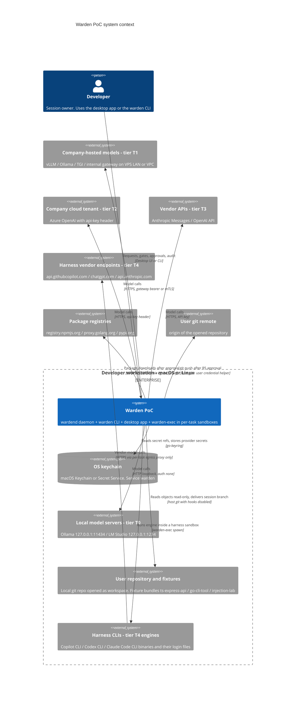
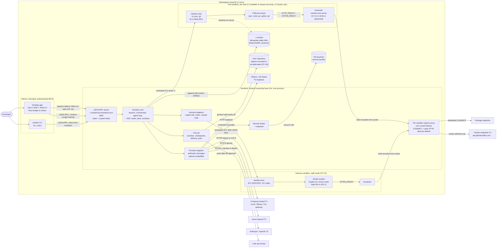
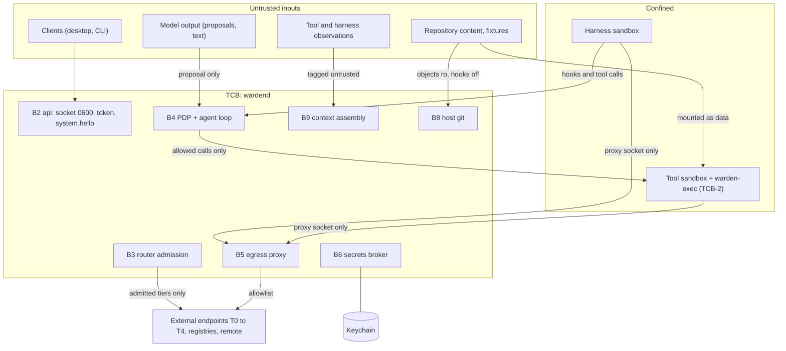

# A01 Context and container views (C4 levels 1 and 2)

Scope: the Warden PoC as defined by WRD-16 §2.1 and §5, on one macOS or Linux workstation. This file fixes which processes exist, who starts them, which channel connects them, how much each is trusted, and at which boundary each brief invariant (BI-1 to BI-7, see `00-DESIGN-CORE.md` §1) is enforced. Package-level detail is in A02; event-level behavior is in A03.

## 1. System context (C4 level 1)

The context view places the Warden PoC as a single system on the developer's workstation. The developer is the only human actor and the only approver (WRD-16 §2.3). Model access is split along the five trust tiers: T0 local servers are reached over loopback, T1 company-hosted servers and T2 tenant deployments and T3 vendor APIs are all reached host-side by the daemon with credentials injected from the keychain (WRD-16 §6.2), and T4 subscription engines are external CLIs that the runtime executes inside a harness sandbox so that their only network path to the vendor goes through the runtime's egress proxy. The two remaining external systems are package registries (reachable only through the proxy after an install approval, core §13.5) and the user's git remote (reachable only by the host-side `git.push` tool after an R5 approval with scope `once`, core §13.9).

## 2. Containers (C4 level 2)

The container view shows one trusted process (`wardend`) surrounded by three kinds of untrusted neighbors: the two clients, which reach it only over the owner-only socket with a token; the per-task sandboxes, which reach it only over the inherited socketpair (fd 3, plus fd 4 in harness sandboxes) and the bind-mounted proxy socket; and the external model and harness endpoints. All model traffic for T0 to T3 leaves from the provider adapters inside `wardend`; nothing in a sandbox knows the endpoints or holds their credentials (WRD-16 §6.2). The only network path out of any sandbox is child process → in-sandbox forwarder → bind-mounted Unix socket → per-sandbox proxy listener → allowlisted host. In split mode (CF-22, core §13.8) a Copilot task runs two sandboxes: the harness sandbox holds the vendor login file read-only and no worktree, and the tool sandbox holds the worktree and no login; every Copilot tool call crosses back into `wardend` for a policy decision and is executed by the tool sandbox's `warden-exec`. Codex and Claude Code run co-located in one sandbox that holds both (only on `public`/`internal`, where T4 is admitted). Host git (worktree manager and delivery) is the only component that touches the user's repository and remote, always with hooks and global configuration disabled.

### 2.1 Process start-up and ownership

| Process | Started by | How | Lifetime |
|---|---|---|---|
| `wardend` | Desktop (Tauri sidecar via `tauri-plugin-shell`) or CLI (when no daemon answers on the socket) | Desktop passes a 256-bit random token on stdin; a CLI-started daemon generates its own; either way the daemon writes `~/.warden/run/token` (0600) and `~/.warden/run/wardend.pid` (CF-14) | One per OS user; survives client restarts; `system.shutdown {confirm: true}` or signal stops it |
| `warden` CLI | User | Reads token file, dials socket, calls `system.hello` | Per command; `--follow` keeps an `event.subscribe` open |
| Desktop app | User | Tauri 2 bundle; `wardend` and `warden-exec` bundled as sidecars (WRD-13) | Per user session |
| Sandbox root (`sandbox-exec`, `bwrap`, or `docker run`) | `internal/sandbox` in `wardend` | Backend-specific argv (A06) with `warden-exec` as the only launched program | Per execution (tool sandbox) or per harness session (harness sandbox) |
| `warden-exec` (serve mode) | Sandbox root | Inherits fd 3 (daemon socketpair); in harness sandboxes also fd 4 (harness stdio relay, ASM-3) | Until `exec.shutdown` or parent death (`--die-with-parent`, process-group kill on macOS) |
| Forwarder (`warden-exec proxy`) | `warden-exec` before it answers `exec.hello` | `warden-exec proxy --listen 127.0.0.1:<port> --upstream <proxy socket>` (core §7) | Same as the sandbox |
| Tool child processes | `warden-exec` on `exec.proc.spawn` | argv only, cleared env plus allowlist, own process group, rlimits (A06) | Per `proc.exec` call |
| Vendor harness engine | `warden-exec` in the harness sandbox (split) or the co-located sandbox | `exec.proc.spawn` with its stdio bound to fd 4 (ASM-3) | Per harness session |
| Host `git` | `internal/worktree` | `git -c core.hooksPath=/dev/null` with `GIT_CONFIG_GLOBAL=/dev/null`, `GIT_CONFIG_SYSTEM=/dev/null`, `GIT_CONFIG_NOSYSTEM=1` (core §13.9) | Per operation |

## 3. Container catalog

Trust levels: **TCB** (trusted computing base, WRD-10 §4), **TCB-2** (second line of defense running inside confinement; never the decision point), **Client** (authenticated but untrusted; no privileged path, WRD-10 T-15), **Confined** (untrusted code inside a sandbox), **External-Tn** (outside the workstation or outside Warden, admitted by tier), **OS** (operating-system service trusted by assumption).

| Container | Technology | Responsibility | Trust | Ports and channels |
|---|---|---|---|---|
| Desktop app | Tauri 2 (Rust core), React 19 + TypeScript + Vite, TanStack Query | Seven screens and six states (WRD-16 §13); renders events; sends user decisions. No agent logic, never links the runtime (brief §2) | Client | Starts `wardend` sidecar (token via stdin). Rust bridge holds the socket connection and relays JSON-RPC frames to the webview (bridge details: B08). OS notifications for approvals |
| `warden` CLI | Go, `spf13/cobra`, `internal/api/client` only (A02) | Full parity with the desktop (WRD-16 §14, core §6); interactive prompts for gates and approvals; `--non-interactive` exit codes 0/2/3 | Client | Unix socket `~/.warden/run/wardend.sock`; token from `~/.warden/run/token`; starts `wardend` if absent |
| `wardend` JSON-RPC server | Go, `creachadair/jrpc2` (or `sourcegraph/jsonrpc2`), LSP framing | Only entry point for clients (BI-6); token check; `system.hello` first; confirmation for privileged methods; event notifications and `stream.delta` | TCB | Listens on `~/.warden/run/wardend.sock` (0600, directory 0700). No TCP listener in the PoC |
| `wardend` runtime core | Go packages of A02 | Sessions, workflow runner, agent loop, PDP, router, store, worktree, sandbox manager, audit | TCB | In-process calls only |
| Provider adapters | Go; `anthropics/anthropic-sdk-go`; hand-rolled HTTP client for `openai-compatible` | Canonical ↔ provider mapping, streaming, error normalization; host-side credential injection (A11) | TCB (code), talks to External | Outbound HTTPS 443 (T1, T2, T3), HTTP loopback (T0: 11434, 1234). mTLS client certificate for `gateway kind: mtls` |
| Harness adapters | Go; `github/copilot-sdk/go`; JSON-RPC over stdio for Codex app-server; stream-json for Claude Code | Drive vendor engines as task backends; map hooks to the PDP through `model.HarnessHost` (A02 §4.2, A12) | TCB (code); the engine it drives is Confined | Byte stream over fd 4 relay to the engine in the sandbox (ASM-3) |
| Secrets broker | Go, `zalando/go-keyring` | `secret://` resolution, keychain writes on `provider.add`, redaction regex set, deny-list source (A15) | TCB | Keychain API (macOS Security framework via `/usr/bin/security`, Linux Secret Service over D-Bus) |
| Per-sandbox egress proxy | Go `net/http` with `Hijacker` | One listener per sandbox (a split-mode harness task has two, ASM-2); allowlist per core §13.4; DNS resolved in the daemon; private-range block; `proxy.connect` / `proxy.denied` (A07) | TCB | Unix socket per sandbox, `~/.warden/run/proxy/<sandbox_id>.sock` (0600, ASM-1), bind-mounted into the sandbox (Linux target `/run/warden/proxy.sock`) |
| Host git | `git` CLI shelled out by `internal/worktree` | Session worktree and private git dir (CF-18), checkpoint commits, post-run delivery host tools `git.apply_branch`, `git.commit` (squash, then publish the session branch into the user's repository, ID-03), `git.export_patch`, and `git.push` after an R5 approval (ID-02) | TCB (invocation); git binary is OS | Local filesystem; network only for `git.push`, using the user's credential helper on the host (core §13.9) |
| SQLite store and blobs | `modernc.org/sqlite` (pure Go), WAL; files under `~/.warden` | Events (hash-chained per chain, CF-09), artifacts, approvals, sessions; blobs content-addressed (A04) | TCB data, tamper-evident only (WRD-09 §4) | `~/.warden/db/warden.sqlite`, `~/.warden/blobs/sha256/<aa>/<hex>`, all owner-only |
| `warden-exec` | Go static binary, imports only `internal/execproto` + stdlib (A02) | Executes `exec.fs.*`, `exec.proc.*`, `exec.git.run` inside the sandbox; re-checks roots, deny-list and command allowlists given as launch arguments (WRD-16 §9) | TCB-2 | fd 3 socketpair (JSON-RPC, Content-Length framing); fd 4 harness relay in harness sandboxes; starts the forwarder |
| In-sandbox forwarder | `warden-exec proxy` mode | Exposes `127.0.0.1:3128` inside the Linux network namespace, or a per-task ephemeral loopback port on macOS templated into the Seatbelt profile (CF-15); relays bytes to the proxy socket | TCB-2 | TCP loopback inside the sandbox → Unix socket |
| Tool sandbox | Linux: `bwrap --unshare-all` + seccomp; macOS: `sandbox-exec` generated profile (CF-16 order); L2: rootless Docker `--network none` | Confines agent-requested processes: worktree rw, read-only toolchain, scratch, per-workspace package cache, proxy socket; nothing from `$HOME`; env cleared (BI-2, A06) | Confined | No network interfaces except loopback (Linux netns) or Seatbelt `deny network*` except the forwarder port and proxy socket |
| Harness sandbox (split mode) | Same backends; L2 when enabled (CF-23) | Confines the vendor engine: harness login file read-only (documented exception HX-1, CF-22), scratch, engine binary read-only; no worktree | Confined | fd 3 and fd 4 to `wardend`; egress only to the vendor allowlist (`platform.harness-egress-only`) |
| Co-located harness sandbox (Codex, Claude Code) | Same backends | Engine plus worktree plus login file read-only; engine runs its own tools after PDP allow via hooks (core §13.8) | Confined | fd 3, fd 4; vendor allowlist only. Admissible only for `public`/`internal` |
| OS keychain | macOS Keychain, Secret Service (GNOME Keyring, KWallet) | Holds `providers/<id>/api_key`, `providers/<id>/token`, `providers/<id>/client_key`, `keys/checkpoint/ed25519` (core §10) | OS | Accessed only by the secrets broker |
| Local model servers | Ollama, LM Studio | T0 inference on loopback | External-T0 | `http://127.0.0.1:11434/v1`, `http://127.0.0.1:1234/v1`, auth `none` |
| Company-hosted models | vLLM, Ollama, TGI, internal gateways | T1 inference; the enterprise case (WRD-16 §6.2) | External-T1 | `https://llm.your-vps.example/v1`; `gateway` bearer token or mTLS client certificate |
| Azure OpenAI | Tenant deployment | T2 inference | External-T2 | `https://<resource>.openai.azure.com/openai/v1`, header `api-key` |
| Vendor APIs | Anthropic Messages, OpenAI | T3 inference | External-T3 | `https://api.anthropic.com` (`x-api-key`), `https://api.openai.com/v1` (Bearer) |
| Harness vendor endpoints | GitHub Copilot, OpenAI (Codex), Anthropic (Claude Code personal mode) | T4 inference performed by the vendor engine | External-T4 | Only via proxy; allowlists filled in week 5 from observed traffic (WRD-16 §10.4) |
| Package registries | npm, Go proxy, PyPI | Install-profile downloads | External | CONNECT 443 via proxy after `user.package-install` approval (core §13.5) |
| User git remote | Whatever `origin` is | Receives the session branch on approved push | External | Host git; SSH or HTTPS per the user's own configuration |
| User repository and fixtures | Git; fixtures shipped as bundles in `fixtures/` and cloned by `scripts/demo.sh` into ordinary directories (ASM-4) | Workspace source; objects shared read-only into the session git dir through alternates (CF-18) | Untrusted content (BI-5) | Filesystem only |

## 4. Trust boundaries

This view reduces the container diagram to the lines that carry authority. Anything arriving from the left (client requests, model proposals, repository files, observations) is data to the runtime: it can ask, never grant. Authority is created only inside `wardend` (PDP decisions, router admission, approvals recorded by the owner) and leaves only as concrete, narrow effects: an executor call on fd 3, a proxy CONNECT to an allowlisted host, a host-side model call to an admitted tier, or a host git operation with hooks disabled.

### 4.1 Boundary table

| Id | Boundary | Crossing mechanism | Controls at the crossing | BI enforced | Evidence (events) |
|---|---|---|---|---|---|
| B1 | Developer ↔ client | OS user session | Client shows what will happen before it happens (WRD-11 §1); approvals never auto-dismiss | (supports BI-1) | none |
| B2 | Client ↔ `wardend` | Unix socket `wardend.sock` 0600 in a 0700 directory; JSON-RPC 2.0 | Token check in `system.hello` (-32001 otherwise); privileged methods need `confirm: true` (-32005); no other listener; CLI and desktop use the same method set | BI-6 | `runtime.start` (mode), per-method events (`session.*`, `provider.configured`, …) |
| B3 | `wardend` ↔ model providers | Host-side HTTPS (or loopback HTTP for T0) from provider adapters | Router admission by tier and classification before every call (core §13.7); credentials from broker, never in context; redaction of request content (core §13.16) | BI-3, BI-7 | `routing.decision`, `routing.fallback`, `model.call.start/end`, `secret.access`, `redaction` |
| B4 | `wardend` ↔ tool sandbox | Sandbox launch (mount list, profile, env allowlist); socketpair fd 3 | PDP `allow` required before any `exec.*` that performs a tool (core §13.1); `warden-exec` re-checks roots, deny-list, profile argv; mounts limited to worktree rw, toolchain ro, scratch, cache, proxy socket (A06) | BI-1, BI-2, BI-3, BI-5 | `policy.decision`, `approval.*`, `tool.exec.start/end`, `sandbox.create` (mounts, `env_keys` names only), `sandbox.violation` |
| B5 | Sandbox ↔ network | Forwarder → proxy socket → per-sandbox listener | Deny by default; allowlist = CF-20 formula; R4 connects go to the PDP; DNS in daemon; private ranges blocked; harness sandboxes vendor-only (core §13.4) | BI-1 (egress as an action), BI-2 | `proxy.connect`, `proxy.denied`, `policy.decision` (`tool: proxy`) |
| B6 | `wardend` ↔ keychain | `go-keyring` | Only the broker reads; references only in config and events; values zeroed after injection; nothing to sandboxes | BI-3 | `secret.access` (ref, consumer, purpose; never the value) |
| B7 | `wardend` ↔ harness sandbox | fd 3 (control), fd 4 (engine stdio relay), proxy socket | Built-in engine tools excluded (Copilot); hooks mapped to PDP via `model.HarnessHost`; unmapped permission requests denied; login file ro is the only credential (HX-1); vendor-only egress | BI-1, BI-2 (with HX-1), BI-3 (runtime secrets never enter), BI-4, BI-7 (T4 not admitted for `confidential`) | `harness.session.start/hook/end`, `policy.decision`, `tool.exec.*` (`executor: sandbox` or `harness`), `proxy.*` |
| B8 | Repository content ↔ runtime configuration | Host git and file reads | No workspace policy layer (L4) is loaded in the PoC; a repository's `.warden/` is ignored as configuration and deny-listed as data (CF-17); manifests come from the binary's `agents/` directory; hooks path and global config neutralized; approvals stored under `~/.warden`, never in the repository | BI-5 | `worktree.create`, `worktree.checkpoint`, `policy.reload` (files and layers listed; no repository path can appear) |
| B9 | Observations ↔ model context | Agent loop context assembly | Every observation wrapped `{trust: "untrusted", provenance}`, redacted, truncated; instructions only from manifest system prompt and the user request (core §13.16, A10) | BI-4, BI-3 | `context.assembled` (`sources[].trust`), `redaction` |
| B10 | `wardend` ↔ user repository and remote | Host git in `internal/worktree`, invoked only by the Dispatcher | Delivery only on a `succeeded` run (after G2 approval, ID-01/ID-02); every delivery is an ActionRequest with `actor.kind: user` (`platform.user-delivery` for `apply_branch`/`export_patch`, `user.git-commit-session-branch` for `commit`); `push` is R5 with approval scope `once`; user credential helper used only by host git for push, never inside a sandbox | BI-1, BI-3 | `workflow.gate.resolved`, `policy.decision`, `approval.*`, `tool.exec.*` (`executor: host`), `workflow.delivered` |

### 4.2 Where each brief invariant is enforced

| Invariant | Primary enforcement (container / package) | Second line | Detection and proof |
|---|---|---|---|
| BI-1 decision before execution | Agent loop and `HarnessHost` accept only a `policy.Allowed` value produced by the PDP to reach the executor client (A02 §3, §4.3); host delivery tools (`git.apply_branch`, `git.commit`, `git.export_patch`, `git.push`, ID-02) use the same path | `warden-exec` refuses paths and argv outside its launch allowlists; proxy refuses unlisted hosts | `audit verify --strict` pairing check (core §13.1, A03 §7) |
| BI-2 sandbox exposure | Sandbox backends generate mounts and env from a fixed template (A06); CF-16 rule order; CF-17 matching | `warden-exec` root and deny-list checks; seccomp / Seatbelt | `sandbox.create.mounts` and `env_keys`; `scripts/escape-check.sh` (WRD-16 §10.7) |
| BI-3 secrets only in keychain | Secrets broker; adapters receive credentials in memory only; `models.yaml` holds `secret://` refs | Redaction before persistence and model calls; sandbox env allowlist excludes every `*_KEY`, `*_TOKEN`; deny-list | `secret.access`, `redaction`; escape check `env` item |
| BI-4 untrusted observations | Agent loop context assembly (A10); harness results pass through `HarnessHost.Execute` or `Observe`, which wrap them | System prompts state the rule (WRD-16 §7.3) | `context.assembled.sources[].trust` |
| BI-5 repository cannot widen | No L4 layer; manifests and policy loaded only from the binary and `~/.warden`; git config and hooks neutralized; PDP matches canonical paths | Deny-list covers repository `.warden/`, `.git/**` write-deny in coder manifest | `policy.reload.files[]` shows only L0/L1/L3 sources |
| BI-6 JSON-RPC only, CLI parity | `internal/api` is the only entry; archtest forbids `cmd/warden` importing anything but `internal/api/client` and `internal/api/wire`; `apps/desktop` has no Go (A02 §6) | Socket 0600 + token | archtest in CI; A05 parity table |
| BI-7 confidential to T0–T2 only | Router admission (and recheck before every model call, core §13.7); `provider.models.admissible` feeds `ModelPicker` greyed-out reasons | Fallback limited to same-or-lower tier; harnesses T4 inadmissible | `routing.decision.candidates[].reason_code = tier_not_admitted`; UI `RoutingLine` |

## 5. Channel summary

| Channel | From → to | Framing / protocol | Auth / confinement |
|---|---|---|---|
| Runtime API | Desktop bridge, CLI → `wardend` | JSON-RPC 2.0, `Content-Length` headers, protocol `warden.poc/1` | Socket 0600; token via `system.hello` |
| Sidecar stdin | Desktop → `wardend` | One line: token | Pipe from parent process |
| Executor control | `wardend` ↔ `warden-exec` | JSON-RPC 2.0 over socketpair fd 3 (`exec.*`, core §7) | Inherited fd; no other channel into the sandbox |
| Harness relay | Harness adapter ↔ engine stdio | Raw bytes over socketpair fd 4, carrying the engine's own protocol (Copilot SDK JSON-RPC, Codex app-server JSON-RPC, Claude Code stream-json) | Inherited fd (ASM-3) |
| Proxy | Sandbox forwarder → proxy listener | HTTP `CONNECT host:port` or absolute-URI plain HTTP | Bind-mounted Unix socket, one per sandbox |
| Model calls | Provider adapters → T0–T3 | HTTPS (loopback HTTP for T0) | Credentials injected host-side per auth mode |
| Keychain | Secrets broker → OS | `go-keyring` | OS user session |
| Store | All emitters → SQLite | In-process; single writer goroutine | File permissions 0600 |

## Traceability

| Design element | WRD source (doc §) | Requirement / invariant satisfied |
|---|---|---|
| Context view with five tiers and harness engines | WRD-16 §6, §6.1, §6.2; WRD-05 §2, §9; WRD-06 §3 | H1, BI-7 |
| Single daemon, CLI and desktop as clients | WRD-16 §2.1, §5.1; WRD-02 §1 (1), §3 | BI-6, F-parity (WRD-11 §4) |
| Token delivery and `system.hello` | WRD-02 §3; WRD-16 §5.1; CF-14; core §6 | BI-6, T-15 |
| Per-task sandboxes with `warden-exec` as the only launched program | WRD-10 §5.1; WRD-16 §5.1, §10.2, §10.3 | BI-2, INV-4, S-1 |
| Split-mode Copilot harness with two sandboxes | CF-22; core §13.8; WRD-16 §6.2; WRD-05 §9 | BI-1, BI-2 (exception HX-1), T-13, T-14 |
| Per-sandbox proxy, forwarder, port 3128 / ephemeral | WRD-16 §10.4; WRD-10 §7; CF-15, CF-20 | BI-2, INV-5, S-2 |
| Host-side model calls, keychain | WRD-16 §6.2, §10.5; WRD-05 §1 (4), §8 | BI-3, S-3 |
| Host git with neutralized hooks and config, private git dir | WRD-16 §9, §10.1; CF-18; core §13.9 | INV-3, T-01, S4 |
| Push as host tool with R5 approval; post-run deliveries through the PDP | WRD-16 §9; WRD-08 §7; core §13.9, ID-02, ID-03 | BI-1, S-7 |
| SQLite WAL, per-session chains | WRD-16 §11; WRD-09 §4, §8; CF-09 | H5, S-5 |
| Boundary table B1–B10 | WRD-02 §5; WRD-10 §4 | BI-1 to BI-7 |
| No L4 layer, repository `.warden/` ignored | WRD-16 §2.3 (two layers); WRD-08 §4; CF-17 | BI-5, T-16, S-6 |
| Router admission visible in UI | WRD-16 §6.3, §13; WRD-06 §4, §11 | BI-7 |

## Deviations and assumptions

- ASM-1: Proxy socket path `~/.warden/run/proxy/<sandbox_id>.sock` (directory 0700). Not in core §10; A07 is authoritative and may choose another path under `~/.warden/run/`.
- ASM-2: WRD-16 §10.4 says "one listener per task". A split-mode harness task has two sandboxes; this design gives each sandbox its own listener with its own allowlist (harness sandbox: vendor allowlist; tool sandbox: CF-20 task allowlist). A07 and A12 are authoritative. `platform.harness-egress-only` applies only to connections from a harness sandbox (`context.sandbox_purpose == "harness"`, core ID-12).
- ASM-3: The vendor engine's stdio is relayed over a second inherited socketpair (fd 4). The Copilot SDK must then speak to an already-running CLI over a caller-provided stream; whether the Go SDK supports this is part of the week-1 spike (WRD-16 §16.1). Fallback if not: point the SDK's CLI path at a host-side relay mode of `warden-exec` that only pipes bytes to fd 4. A06 and A12 are authoritative.
- ASM-4: Fixtures are cloned from `fixtures/*.bundle` into ordinary directories by `scripts/demo.sh`; the runtime has no fixture-specific code.
- ASM-5: The desktop's Rust bridge (not a localhost WebSocket shim) holds the socket connection; B08 is authoritative. Either choice keeps the BI-6 boundary at the socket.
- DEV-1 (from CF-22, documented exception HX-1): the harness sandbox mounts the vendor login file read-only, which is a credential inside a sandbox. It is limited to harness sandboxes, never the tool sandbox, and T4 is inadmissible for `confidential` workspaces.
- DEV-2 (from CF-15): no SOCKS5, no `ALL_PROXY`; macOS uses an ephemeral forwarder port instead of 3128.
