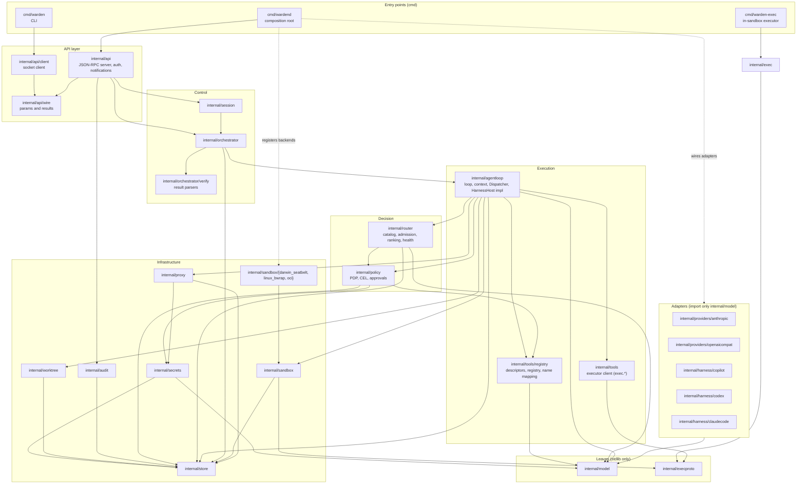

# A02 Component view of `wardend` (Go packages)

This file is authoritative for Go package boundaries (core §4). It lists every package, its responsibility, its key exported interfaces (sketches, not implementations), the events it emits (names and payload fields from core §5), the allowed import directions, and the two mechanisms that enforce them in CI: an `internal/archtest` Go test built on `golang.org/x/tools/go/packages`, and a golangci-lint `depguard` configuration. Process-level placement is in A01; the order in which these packages emit events is in A03.

Module path: `warden.dev/warden` (A17 §1).

## 1. Component diagram



The diagram shows the allowed import edges (solid) and the two places where the composition root injects implementations rather than letting packages import each other (dotted). Dependencies point downward: entry points, then the API layer, then control (session, orchestrator), then execution (agent loop and tool plumbing), then decision (policy, router), then infrastructure, then the two stdlib-only leaves. Adapters sit to the side: they import only `internal/model`, and only `cmd/wardend` imports them, so no runtime package can reach a provider or harness except through the `model.Provider` and `model.Harness` interfaces handed to the router. `internal/exec` is not reachable from any daemon package: it shares only the wire types in `internal/execproto` with the daemon's executor client. The full rule set is the matrix in §5.

## 2. Package catalog

| Package | Responsibility | Emits (core §5) |
|---|---|---|
| `cmd/wardend` | Composition root: load `config.yaml`, `models.yaml`, policies; construct store, secrets, policy, router (with adapters), sandbox manager (with backends), proxy, worktree, orchestrator, session, api; run recovery (core §13.11); bind the socket after recovery | none directly |
| `cmd/warden` | CLI (cobra); every command maps to one or more runtime API methods (A05); starts `wardend` if the socket does not answer | none (client) |
| `cmd/warden-exec` | Executor binary; `serve` mode (fd 3 control, optional fd 4 relay) and `proxy` mode (forwarder) | none (no store access) |
| `internal/api` | JSON-RPC server: framing, `system.hello` token check, method dispatch (including NEW `session.setPin` → `session.Manager.SetPin`, ID-04), confirmation checks, error mapping to -32001…-32012, `event` and `stream.delta` notifications, subscription replay | `runtime.start`, `runtime.stop`, `provider.configured` |
| `internal/api/wire` (NEW) | Go types for every method's params and results and for notifications, generated from A05 JSON Schemas | none |
| `internal/api/client` (NEW) | Dial socket, `system.hello`, typed calls, subscription stream; used by the CLI and by integration tests | none |
| `internal/session` | Workspaces, sessions, requests, budgets, session pin (`session.setPin`, which asks the orchestrator to re-route tasks waiting with `no_admissible_model` or `provider`, core ID-04), classification changes, capability summary (via `policy.Explain`) | `workspace.classification`, `session.open`, `session.resume`, `session.request`, `session.close`, `budget.changed` |
| `internal/orchestrator` | Template `poc-coding` (and `poc-readonly`, CF-43) instantiation, task state machine, gates, repair round, verify result parsers, run end at G2 approval (ID-01), post-run delivery through `agentloop.Dispatcher` (ID-02), resume, cancel, restart recovery, re-routing of paused tasks (A13) | `workflow.start`, `workflow.end`, `workflow.gate.presented`, `workflow.gate.resolved`, `task.state`, `workflow.delivered` (NEW, ID-02) |
| `internal/agentloop` | One execution: sandbox and proxy setup, routing, context assembly with trust tags, model calls, proposal handling, the tool `Dispatcher` (only caller of the executor client and of host tools), budget enforcement, compaction, `HarnessHost` implementation (A10) | `model.call.start`, `model.call.end`, `context.assembled`, `context.compacted`, `tool.exec.start`, `tool.exec.end`; on behalf of harness adapters `harness.session.start`, `harness.hook`, `harness.session.end` |
| `internal/policy` | PDP: ActionRequest normalization, capability check, L0 invariants, L1/L3 rules in CEL, obligations, approvals (request, resolve, expire, revoke, scope matching), decision cache, explain, reload; routing and budget sections of the policy bundle; L1 rule `platform.user-delivery` (allows the user-initiated host tools `git.apply_branch` and `git.export_patch`, ID-02); context field `sandbox_purpose` so that `platform.harness-egress-only` matches only harness sandboxes (ID-12) (A08) | `policy.decision`, `policy.reload`, `approval.requested`, `approval.resolved`, `approval.revoked` |
| `internal/router` | Catalog (`models.yaml`), admission by tier, filter, ranking per strategy, health and circuit breaker, pins, fallback within same-or-lower tier (A09) | `routing.decision`, `routing.fallback` |
| `internal/model` | Canonical types (WRD-05 §3, §4), error codes, `Provider`, `Harness`, `HarnessHost`, `CredentialSource` interfaces | none |
| `internal/providers/anthropic` | `anthropic-messages` adapter (A11) | none (reports through return values) |
| `internal/providers/openaicompat` | `openai-compatible` adapter for T0, T1, T2, T3 with auth modes `none`, `api_key` (Bearer or `api-key` header), `gateway` bearer or mTLS; emulated tool protocol (A11) | none |
| `internal/harness/copilot` | `copilot-sdk` harness, split mode (A12) | via `HarnessHost` only |
| `internal/harness/codex` | `codex-app-server` harness, co-located mode (optional) | via `HarnessHost` only |
| `internal/harness/claudecode` | `claude-code-cli` harness, co-located, personal mode only (CF-21) | via `HarnessHost` only |
| `internal/tools/registry` | Tool descriptors (WRD-04 §2), registry, provider-safe name mapping (`.` → `__`), rendering granted capabilities as `model.ToolDefinition` (core §8). Also holds the non-model-facing host tool descriptors used for delivery: `git.commit` (delivery squash and publish, R1), `git.apply_branch` and `git.export_patch` (NEW host tools, R1), `git.push` (R5) (ID-02) | none |
| `internal/tools` | Executor client (WRD-02 §9): typed `exec.*` calls over the fd 3 connection, `exec.proc.io` demultiplexing. Importable only by `internal/agentloop` (R7) | none |
| `internal/orchestrator/verify` | Verifier result parsers (Vitest JSON, `go test -json`, pytest JSON or JUnit XML), stdlib only (A13 §8) | none |
| `internal/buildinfo` | Version, commit and date stamped by `-ldflags` (A17 §3); stdlib only | none |
| `internal/sandbox` | Sandbox manager: spec from grants, backend selection, launch, `exec.hello`, destroy, orphan reaping, doctor checks; relays executor-reported violations | `sandbox.create`, `sandbox.destroy`, `sandbox.violation` |
| `internal/sandbox/darwin_seatbelt`, `linux_bwrap`, `oci` | Backends: generate the Seatbelt profile (CF-16 order), the `bwrap` argv and seccomp program, or the `docker run` argv (A06) | none |
| `internal/proxy` | Per-sandbox listeners, CONNECT and plain HTTP, allowlist, daemon-side DNS, private-range block, hold-and-ask hand-off to the PDP, injection hook (unused) (A07) | `proxy.connect`, `proxy.denied` |
| `internal/secrets` | Keychain broker, `secret://` resolution, redaction, deny-list source, checkpoint signer (A15) | `secret.access`, `redaction` |
| `internal/worktree` | Session git dir with alternates (CF-18), worktree, checkpoints, reset, diff, delivery (`apply_branch`, `commit`, `export_patch`, `push`) (A14) | `worktree.create`, `worktree.checkpoint`, `worktree.remove` |
| `internal/store` | SQLite schema and migrations, event append with per-chain hash chain (CF-09), blobs, artifacts, subscriptions, delta hub, checkpoints (A04) | `artifact.created`, `artifact.edited`, `chain.checkpoint`, `session.purged` |
| `internal/audit` (NEW) | `audit.export` and `audit.verify` (chain, checkpoint, strict pairing) over the store or an export file | none |
| `internal/exec` | Executor implementation: roots, canonicalization, deny-list, argv checks, process groups, rlimits, git env, forwarder (A06) | none (violations are returned on fd 3 and recorded by `internal/sandbox`) |
| `internal/execproto` (NEW) | Executor wire types, method names, error codes, Content-Length codec | none |
| `internal/archtest` (NEW) | Test-only package enforcing §5 | none |

Every event listed above is appended through `store.Emitter`; no package writes the `events` table directly. Redaction (core §13.16) happens in the emitting package before `Emit`; the store runs the same redactor again as a safety net before hashing (§4.13).

## 3. Invariant-carrying design choices

1. **Only the Dispatcher executes (BI-1).** `internal/tools` is importable only by `internal/agentloop` (archtest rule R7). Inside `agentloop`, the only function that calls it is `Dispatcher.run`, which requires a `policy.Allowed` value. `policy.Allowed` is opaque: its zero value is invalid, it is issued only by `PDP.Decide` when `effect == allow`, and `PDP.Redeem(a, callID)` rejects a token that was not issued for that `call_id` or was already used. Host delivery tools (`git.apply_branch`, `git.commit`, `git.export_patch`, `git.push`; ActionRequests with `actor.kind: user`, ID-02) and harness tool calls go through the same Dispatcher, so every `tool.exec.start` (executor `sandbox`, `host` or `harness`) carries the `decision_id` of an allow decision.
2. **Adapters cannot reach policy or sandboxes directly.** `providers/*` and `harness/*` import only `internal/model` (plus stdlib and their SDK). A harness gets policy decisions, sandboxes, tool execution and event emission only through the `model.HarnessHost` interface that `agentloop` implements and injects per task (§4.2). A harness can therefore neither emit a `policy.decision` nor execute a tool without one.
3. **Credentials flow by interface.** Adapters receive a `model.CredentialSource` (implemented by `internal/secrets`) and ask for a credential at request time; they never see `secret://` resolution, never persist a value, and wipe it after use (BI-3).
4. **The executor shares no code with the daemon beyond wire types.** `internal/exec` imports only `internal/execproto` and stdlib; the daemon's executor client lives in `internal/tools`. A bug in daemon packages cannot weaken the executor's second-line checks, and vice versa.
5. **Clients share no code with the runtime.** `cmd/warden` imports only `internal/api/client` and `internal/api/wire` (BI-6). `apps/desktop` contains no Go.

## 4. Key exported interfaces (sketches)

### 4.1 `internal/model`

```go
package model

type Tier string           // "T0" … "T4"
type Classification string // "public" | "internal" | "confidential"
type ErrorCode string      // rate_limited, auth_failed, context_too_long, provider_unavailable, content_filtered,
                           // invalid_request, tool_format_unsupported, model_not_found, timeout, cancelled
type StopReason string     // end_turn, tool_use, max_tokens, stop_sequence, content_filter
type Trust string          // "trusted" (manifest system prompt, user request) | "untrusted" (every observation)

type ModelRequest struct {
	ModelID         string
	Messages        []Message
	Tools           []ToolDefinition // provider-safe names already applied by internal/tools/registry
	ToolChoice      *ToolChoice
	ResponseFormat  *ResponseFormat
	Generation      *Generation
	Budget          *Budget
	Trace           Trace // session_id, task_id, execution_id, step
	ProviderOptions map[string]json.RawMessage
}

type Message struct {
	Role    string // system | user | assistant | tool
	Content []ContentBlock
}

type ContentBlock struct {
	Type       string // text | tool_use | tool_result | reasoning | document | image
	Text       string
	ToolUse    *ToolUse    // {ID, Name, Input}
	ToolResult *ToolResult // see below
	Reasoning  *Reasoning  // opaque, passed back verbatim to the same provider
	Trust      Trust
	Provenance *Provenance // {Source, Ref, SandboxID, CallID, ArtifactID}; required when Trust == untrusted (BI-4)
}

type ToolResult struct {
	ToolUseID string
	CallID    string
	OK        bool
	Content   []ContentBlock
	Truncated bool
	IsError   bool
}

type StreamEvent struct {
	Type          string // message_start, text_delta, reasoning_delta, tool_use_start, tool_use_delta,
	                     // tool_use_end, usage, message_end, error
	Index         int
	Text          string
	PartialJSON   string
	ToolUseID     string
	ToolName      string
	Usage         *Usage
	StopReason    StopReason
	Err           *Error // {Code ErrorCode, Message string, Retryable bool, RetryAfter time.Duration, Details json.RawMessage}
	ProviderReqID string
}

type Usage struct {
	InputTokens, OutputTokens, CachedInputTokens, ReasoningTokens int
	BillingMode   string // api_key | none | gateway | harness_subscription
	Quota         *Quota // {Kind, Units}
	EstimatedCost *Cost  // {Amount, Currency, Basis}; nil when no price is known
}

// Provider is implemented by internal/providers/*. Adapters never execute tools (WRD-02 §1 (3)).
type Provider interface {
	ID() string
	Capabilities(modelID string) (ModelCapabilities, error)
	Generate(ctx context.Context, req ModelRequest) (Stream, error) // always streaming
	CountTokens(ctx context.Context, req ModelRequest) (int, error)
	Health() ProviderHealth
	Probe(ctx context.Context) (ProbeResult, error) // provider.test capability probe
}

type Stream interface {
	Recv() (StreamEvent, error) // io.EOF after message_end
	Close() error
}

// CredentialSource is implemented by internal/secrets and injected into adapters by cmd/wardend.
// The consumer string is recorded in secret.access ("adapter:<provider>").
type CredentialSource interface {
	Credential(ctx context.Context, ref string, consumer string) (*Credential, error)
}

type Credential struct {
	Header string           // "Authorization", "x-api-key", "api-key"
	Scheme string           // "Bearer" or ""
	Value  []byte           // wiped by Wipe()
	Cert   *tls.Certificate // gateway kind mtls
}

func (c *Credential) Wipe()
```

### 4.2 Harness contract (`internal/model`)

```go
type HarnessKind string    // copilot-sdk | codex-app-server | claude-code-cli
type HarnessRunMode string // split | colocated

// Harness is implemented by internal/harness/*.
type Harness interface {
	ID() string
	Kind() HarnessKind
	RunMode() HarnessRunMode
	Launch() HarnessLaunch // engine argv, login file (HX-1), vendor egress allowlist, env allowlist
	Run(ctx context.Context, task HarnessTask, host HarnessHost) (HarnessResult, error)
}

type HarnessTask struct {
	SessionID, TaskID, ExecutionID string
	Mode         string           // plan | implement | repair
	SystemPrompt string           // manifest instructions (trusted)
	Input        []ContentBlock   // request (trusted) + artifacts and observations (untrusted, provenance-tagged)
	Tools        []ToolDefinition // granted runtime tools; engine built-ins are excluded
	Limits       Limits
}

// HarnessHost is implemented by internal/agentloop and injected per task. It is the harness
// adapter's only route to sandboxes, the PDP, the executor and the event store.
type HarnessHost interface {
	// StartEngine creates the sandbox(es) for the run mode and spawns the engine through warden-exec.
	// Split: tool sandbox (worktree, no login) + harness sandbox (login file ro, no worktree).
	// Returns the engine's stdio relayed over fd 4. Emits sandbox.create (one per sandbox).
	StartEngine(ctx context.Context, l HarnessLaunch) (io.ReadWriteCloser, error)

	SessionStarted(ctx context.Context, s HarnessSessionInfo) error // harness.session.start

	// Authorize maps a pre_tool_use or permission hook to an ActionRequest and returns the final
	// verdict. Emits harness.hook, policy.decision and, when required, approval.requested and
	// task.state transitions, then approval.resolved and the second policy.decision (core §13.1).
	// Unmapped requests are denied (capability.not_granted).
	Authorize(ctx context.Context, h HookCall) (Authorization, error)

	// Execute runs an authorized runtime tool in the tool sandbox (split mode). Emits tool.exec.start
	// and tool.exec.end (executor "sandbox"); the result is redacted, truncated, untrusted, tagged.
	Execute(ctx context.Context, a Authorization, input json.RawMessage) (ToolResult, error)

	// Observed records a tool that a co-located engine executed itself after an allow.
	// Phase start (from the pre hook) emits tool.exec.start; phase end (post hook) emits tool.exec.end;
	// both with executor "harness". The returned result is what the engine may keep in its context.
	Observed(ctx context.Context, a Authorization, o Observation) (ToolResult, error)

	PostHook(ctx context.Context, h HookCall) error // harness.hook (post_tool_use)
	Turn(ctx context.Context, t TurnUsage) error    // model.call.start / model.call.end, billing harness_subscription
	Delta(kind string, data string)                 // stream.delta, not persisted
	SessionEnded(ctx context.Context, e HarnessSessionEnd) error // harness.session.end (quota, reason)
}

// Authorization is a verdict, not a capability: only HarnessHost.Execute and Observed act on it,
// and both re-validate it with the PDP (policy.PDP.Redeem).
type Authorization struct {
	CallID, DecisionID string
	Effect             string // allow | deny
	Reason             string
	RuleIDs            []string
}
```

### 4.3 `internal/policy`

```go
package policy

type Effect string // allow | deny | approval_required

type ActionRequest struct {
	CallID        string
	Actor         Actor   // {Kind user|agent|runtime|harness, Name, Version, Digest, TaskID, ExecutionID, HarnessID}
	Action        Action  // {Tool, Operation, Resource, RiskClass, ArgsRedacted}; Resource fields per core §9
	Context       Context // worktree, workspace{id, classification, root}, task_classification,
	                      // task_egress_allow, environment, sandbox_level, sandbox_purpose (task|harness, ID-12),
	                      // taint, task{key, class, mode}, session_id
	AfterApproval string  // approval id when this is the re-evaluation after approval.resolved(approve)
}

type Decision struct {
	ID                 string // dec_…
	Effect             Effect
	Reason             string
	MatchedRules       []string // layer-qualified ids (core §9), e.g. "user.package-install", "grant.apr_9"
	Obligations        Obligations
	Approval           *PendingApproval // {ApprovalID, ScopeMax, ScopesAllowed, ExpiresAt}
	ResolvedByApproval string
	CacheHit           bool
}

// Allowed is issued only for effect == allow. Zero value is invalid.
type Allowed struct{ rec *issued }

func (d Decision) Allowed() (Allowed, bool)
func (a Allowed) DecisionID() string
func (a Allowed) CallID() string
func (a Allowed) Obligations() Obligations

type PDP interface {
	Decide(ctx context.Context, req ActionRequest) (Decision, error)          // policy.decision (+ approval.requested)
	WaitApproval(ctx context.Context, approvalID string) (ApprovalOutcome, error)
	Resolve(ctx context.Context, r Resolution) (ApprovalOutcome, error)       // approval.resolved; scope ≤ scope_max else -32004
	Revoke(ctx context.Context, approvalID, by string) error                  // approval.revoked; flushes cache
	CancelPending(ctx context.Context, executionID string, d string) error    // approval.resolved(cancel|expire)
	Redeem(a Allowed, callID string) error                                    // single use, bound to call_id
	Explain(ctx context.Context, req ActionRequest) (Explanation, error)      // no events
	Reload(ctx context.Context) (ReloadResult, error)                         // policy.reload
	Snapshot() Snapshot // routing admission and strategy, budgets, command profiles, deny-list, defaults
}
```

### 4.4 `internal/router`

```go
package router

type RouteRequest struct {
	SessionID, TaskID, ExecutionID string
	TaskClass      string // plan | implement | verify | summarize (repair routes as implement)
	Classification model.Classification
	Manifest       ModelNeeds // required_capabilities, min_context_tokens, strategy
	Pin            string     // session pin or ""
	EstInputTokens int
}

type Route struct {
	RoutingID string // rt_…
	ModelID   string
	Provider  model.Provider // nil when Harness is set
	Harness   model.Harness  // set only for a pinned harness
	Tier      model.Tier
	MaxTier   model.Tier // fallback bound (same-or-lower)
	Fallbacks int
}

type Router interface {
	Route(ctx context.Context, r RouteRequest) (Route, error)                 // routing.decision; ErrNoAdmissibleModel
	Recheck(ctx context.Context, rt Route, c model.Classification) error      // before every model call (core §13.7)
	Fallback(ctx context.Context, rt Route, cause model.ErrorCode) (Route, error) // routing.fallback; ≤ 3 per task
	Report(providerID string, outcome CallOutcome)                            // circuit breaker (5 failures / 60 s)
	Models(ctx context.Context, q ModelsQuery) ([]ModelView, error)           // provider.models (admissible + reasons)
	Catalog() Catalog
}
```

### 4.5 `internal/agentloop`

```go
package agentloop

type ExecutionSpec struct {
	SessionID, RunID, TaskID, ExecutionID, TaskKey string
	Agent          Manifest        // coder@1 or verifier@1, loaded from the binary's agents/
	Mode           string          // plan | implement | repair | summarize
	TaskClass      string
	Input          json.RawMessage // validated against the manifest input schema
	InputArtifacts []string
	Worktree       WorktreeRef
	Classification model.Classification
	Pin            string
	Attempt        int
	Note           string // context.note after an interrupted or failed attempt
}

// StateHooks is implemented by internal/orchestrator, which owns task.state.
type StateHooks interface {
	WaitingForApproval(ctx context.Context, approvalID string) error          // running → waiting_for_approval
	Resumed(ctx context.Context, reason string) error                         // → running (approved | input_provided)
	WaitingForInput(ctx context.Context, reason, detail string) (<-chan InputOutcome, error)
}

type Runner interface {
	Run(ctx context.Context, spec ExecutionSpec, hooks StateHooks) (ExecutionResult, error)
	// RunProfiles executes resolved build/test profiles deterministically (verifier, core §13.12).
	RunProfiles(ctx context.Context, spec ExecutionSpec, p []ResolvedProfile, hooks StateHooks) ([]ProfileRun, error)
}

// Dispatcher is the single execution path for sandbox, host and harness tools.
type Dispatcher interface {
	// Post-run delivery (ID-02): git.apply_branch, git.commit, git.export_patch, git.push; each runs
	// policy.decision → tool.exec.start(executor host) → tool.exec.end; the orchestrator then emits workflow.delivered.
	RunHost(ctx context.Context, call HostCall) (HostOutcome, error)
}
```

### 4.6 `internal/orchestrator`

```go
package orchestrator

type Orchestrator interface {
	Start(ctx context.Context, r StartRequest) (runID string, err error)      // workflow.start
	ResolveGate(ctx context.Context, g GateResolution) (GateResult, error)    // workflow.gate.resolved
	Deliver(ctx context.Context, d DeliverRequest) (DeliverResult, error)     // succeeded runs only; via Dispatcher; workflow.delivered
	Reroute(ctx context.Context, sessionID string) ([]string, error)          // tasks waiting with no_admissible_model or provider (ID-04)
	Resume(ctx context.Context, runID, from string) (newRunID string, err error)
	Cancel(ctx context.Context, sessionID, taskID string) (CancelResult, error) // ≤ 5 s (core §13.10)
	Get(ctx context.Context, runID string) (RunView, error)
	Recover(ctx context.Context) (RecoveryReport, error)                       // core §13.11, before socket bind
	InputAvailable(ctx context.Context, sessionID string)                      // re-route waiting_for_input(no_admissible_model)
}
```

### 4.7 `internal/session`

```go
package session

type Manager interface {
	Open(ctx context.Context, r OpenRequest) (OpenResult, error) // session.open or session.resume
	List(ctx context.Context, workspaceID string) ([]SessionView, error)
	Close(ctx context.Context, sessionID string) (CloseResult, error) // session.close + chain.checkpoint
	Request(ctx context.Context, r RequestParams) (runID string, err error)
	SetBudget(ctx context.Context, sessionID string, usd float64) (BudgetResult, error)
	SetPin(ctx context.Context, sessionID string, pin *string) (PinResult, error) // session.setPin: pin within admission, then orchestrator.Reroute (ID-04)
	SetClassification(ctx context.Context, wsp string, c model.Classification, confirm bool) (ClassResult, error)
	Workspaces(ctx context.Context) ([]WorkspaceView, error)
}
```

### 4.8 `internal/tools/registry` and `internal/tools`

```go
package registry

type Descriptor struct {
	ID, SafeName      string // "fs.read", "fs__read"
	RiskClass         string // R0 … R6 (proc.exec resolved per call: R2 profile, R3 other, R4 install)
	Executor          string // sandbox | host
	UntrustedOutput   bool
	ArgumentRedaction []string
	InputSchema       json.RawMessage
	DefaultTimeout    time.Duration
}

type Registry interface {
	Get(id string) (Descriptor, bool)
	BySafeName(name string) (Descriptor, bool) // unknown → unknown_tool (T-10)
	Render(granted []Capability, mode string) []model.ToolDefinition
}
```

```go
package tools // executor client

type Client struct{ /* conn, codec, pending calls, io handlers */ }

func New(conn net.Conn) *Client
func (c *Client) Hello(ctx context.Context) (execproto.HelloResult, error)
func (c *Client) FS(ctx context.Context, method string, p any, out any) error // exec.fs.*
func (c *Client) Spawn(ctx context.Context, p execproto.SpawnParams) (execproto.Handle, error)
func (c *Client) Wait(ctx context.Context, h execproto.Handle) (execproto.WaitResult, error)
func (c *Client) Signal(ctx context.Context, h execproto.Handle, sig string) error // TERM | KILL
func (c *Client) Git(ctx context.Context, p execproto.GitParams) (execproto.GitResult, error)
func (c *Client) Shutdown(ctx context.Context) error
func (c *Client) OnIO(func(execproto.ProcIO))
```

### 4.9 `internal/sandbox`

```go
package sandbox

type Spec struct {
	SessionID, TaskID, ExecutionID string
	Purpose        string // task | harness
	Level          string // L1 | L2
	Worktree       string // "" for a split-mode harness sandbox
	Scratch, Cache string
	Toolchain      []string
	LoginFile      string   // harness sandboxes only (HX-1), mounted read-only
	DenyGlobs      []string // from policy snapshot (CF-17 matching)
	Env            map[string]string // allowlist only; never secrets (INV-6)
	Limits         Limits
	ProxySocket    string
	ForwarderPort  int  // 3128 on Linux, ephemeral on macOS (CF-15)
	Relay          bool // allocate fd 4 for a harness engine
	ExecArgs       ExecLaunchArgs // roots, profiles argv patterns, git env for warden-exec
}

type Sandbox interface {
	ID() string
	Control() net.Conn // fd 3 peer
	Relay() net.Conn   // fd 4 peer or nil
	Wait() error
}

type Manager interface {
	Create(ctx context.Context, s Spec) (Sandbox, error)                       // sandbox.create
	Destroy(ctx context.Context, id, reason string) (DestroyReport, error)     // sandbox.destroy
	Violation(ctx context.Context, id string, v Violation) error               // sandbox.violation
	ReapOrphans(ctx context.Context) ([]DestroyReport, error)                  // reason "orphan"
	Doctor(ctx context.Context) []Check
}

type Backend interface {
	Name() string // seatbelt | bwrap | docker
	Level() string
	Check(ctx context.Context) []Check
	Command(s Spec, fds Fds) (*exec.Cmd, error)
}

func Register(b Backend) // called by cmd/wardend; sandbox never imports its backends
```

### 4.10 `internal/proxy`

```go
package proxy

type Entry struct{ Host string; Port int; Rule string; DecisionID string }

type ListenerSpec struct {
	SandboxID, SessionID, TaskID string
	SocketPath  string
	Allow       []Entry // CF-20 initial allowlist (manifest egress ∩ policy) or harness vendor list
	HarnessID   string  // set for harness sandboxes: unlisted hosts are denied without prompt
	Interactive bool
}

type Listener interface {
	Allow(entries ...Entry) // obligations and grants added during the task
	Close() error
}

// Authorizer is satisfied by an adapter in agentloop over policy.PDP (tool: proxy, operation: connect).
// It may block up to 120 s while an approval is open (core §13.4).
type Authorizer interface {
	AuthorizeConnect(ctx context.Context, r ConnectRequest) (ConnectVerdict, error)
}

type Injector interface{ Inject(r *http.Request) error } // present, unused in the PoC

type Manager interface {
	Open(ctx context.Context, s ListenerSpec, a Authorizer) (Listener, error)
}
```

### 4.11 `internal/secrets`

```go
package secrets

type Broker interface {
	model.CredentialSource                                  // secret.access on every resolution
	Put(ctx context.Context, ref string, value []byte) error // provider.add; value never echoed
	Delete(ctx context.Context, ref string) error
	Status(ctx context.Context) Status // doctor
}

type Redactor interface {
	Redact(source string, in []byte) (out []byte, count int, types []string) // emits redaction when count > 0
}

func DenyList() []string                       // WRD-16 §10.5 globs, versioned with the runtime
func NewCheckpointSigner(b Broker) store.Signer // private key keys/checkpoint/ed25519 in the keychain
```

### 4.12 `internal/worktree`

```go
package worktree

type Manager interface {
	Create(ctx context.Context, s CreateSpec) (Worktree, error)                    // worktree.create
	Checkpoint(ctx context.Context, sessionID, label, ref string) (string, error) // worktree.checkpoint
	ResetTo(ctx context.Context, sessionID, commit string) error
	Diff(ctx context.Context, sessionID, base, head string) (Diff, error)
	// Delivery operations; called only by agentloop.Dispatcher inside an allowed host tool execution (ID-02).
	Commit(ctx context.Context, s CommitSpec) (string, error)     // squash + publish branch (ID-03); worktree.checkpoint(delivery-commit)
	ApplyBranch(ctx context.Context, s ApplySpec) error           // publish branch without squash
	ExportPatch(ctx context.Context, s ExportSpec) (string, error)
	Push(ctx context.Context, s PushSpec) error                   // requires a prior commit or apply_branch (ID-03)
	Remove(ctx context.Context, sessionID, reason string) error  // worktree.remove
}
```

### 4.13 `internal/store`

```go
package store

type Event struct {
	Type           string // registry in core §5; unknown types are rejected
	Chain          string // "ses_…" or "sys"
	SessionID, RunID, TaskID, ExecutionID, WorkspaceID string
	Classification string
	Actor          Actor
	Payload        any
	Redactions     Redactions
}

type Emitter interface {
	Emit(ctx context.Context, e Event) (Envelope, error) // assigns seq, id, ts, prev_hash, hash; fails closed (-32009)
}

type Store interface {
	Emitter
	Query(ctx context.Context, q Query) ([]Envelope, int64, error)
	Subscribe(ctx context.Context, f Filter, afterSeq int64) (Subscription, error)
	PublishDelta(d Delta) // stream.delta, never persisted or hashed
	PutBlob(ctx context.Context, r io.Reader) (digest string, size int64, err error)
	OpenBlob(ctx context.Context, digest string) (io.ReadCloser, error)
	PutArtifact(ctx context.Context, a ArtifactRecord, content io.Reader) (ArtifactRecord, error) // artifact.created
	EditArtifact(ctx context.Context, a ArtifactRecord, content io.Reader) (ArtifactRecord, error) // artifact.edited
	Checkpoint(ctx context.Context, chain string) (Checkpoint, error)                              // chain.checkpoint
	Tables() Tables // sessions, workflow_runs, tasks, executions, artifacts, approvals repositories
	SetSigner(s Signer)     // injected by cmd/wardend after secrets exists
	SetRedactor(r Redactor) // same
}

type Signer interface { // implemented by secrets; injected by cmd/wardend (avoids store → secrets)
	KeyID() string
	Sign(ctx context.Context, msg []byte) ([]byte, error)
}

type Redactor interface { // safety net before hashing; implemented by secrets
	Redact(source string, in []byte) ([]byte, int, []string)
}
```

### 4.14 `internal/audit`

```go
package audit

type Source interface { // StoreSource (live DB) or FileSource (export file)
	Chains(ctx context.Context) ([]string, error)
	Events(ctx context.Context, chain string) (iter.Seq2[store.Envelope, error], error)
	PublicKey(keyID string) (ed25519.PublicKey, error)
}

type Exporter interface {
	Export(ctx context.Context, r ExportRequest) (ExportResult, error) // path, events, artifacts, sha256
}

type Verifier interface {
	Verify(ctx context.Context, src Source, sessionID string, strict bool) (Report, error)
	// Report: ok, chain_ok, strict_ok, checkpoint_ok, events, violations[{seq, kind, detail}]
}
```

### 4.15 `internal/api`, `internal/exec`, `internal/execproto`

```go
package api

type Deps struct {
	Sessions session.Manager
	Runs     orchestrator.Orchestrator
	Policy   policy.PDP
	Router   router.Router
	Secrets  secrets.Broker
	Sandbox  sandbox.Manager
	Store    store.Store
	Audit    struct{ audit.Exporter; audit.Verifier }
}

func NewServer(d Deps, token []byte) *Server
func (s *Server) Serve(ctx context.Context, ln net.Listener) error
```

```go
package exec // imports only internal/execproto and stdlib

type Config struct {
	Roots      []Root   // {HostPath, SandboxPath, Mode rw|ro}
	DenyGlobs  []string
	Profiles   []ArgvPattern
	EnvAllow   map[string]string
	Limits     Limits
	GitEnv     map[string]string // GIT_CONFIG_GLOBAL=/dev/null, GIT_CONFIG_SYSTEM=/dev/null, GIT_CONFIG_NOSYSTEM=1
	Forwarder  ForwarderConfig   // listen 127.0.0.1:<port>, upstream socket
}

func ParseArgs(args []string) (Config, error)
func Serve(ctx context.Context, control, relay *os.File, cfg Config) error // relay may be nil
func RunForwarder(ctx context.Context, listen, upstream string) error
```

```go
package execproto // stdlib only

const (
	MethodHello = "exec.hello"; MethodFSRead = "exec.fs.read"; MethodFSList = "exec.fs.list"
	MethodFSSearch = "exec.fs.search"; MethodFSWrite = "exec.fs.write"; MethodFSPatch = "exec.fs.patch"
	MethodFSStat = "exec.fs.stat"; MethodProcSpawn = "exec.proc.spawn"; NotifyProcIO = "exec.proc.io"
	MethodProcWait = "exec.proc.wait"; MethodProcSignal = "exec.proc.signal"; MethodGitRun = "exec.git.run"
	MethodShutdown = "exec.shutdown"
)

type Codec struct{ /* Content-Length framing over io.ReadWriter */ }
```

## 5. Allowed import directions

Legend: `✓` allowed; blank forbidden. Rows import columns. Abbreviations: `api` internal/api, `wire` internal/api/wire, `acl` internal/api/client, `ses` session, `orc` orchestrator, `al` agentloop, `pol` policy, `rt` router, `mdl` model, `prv` providers/*, `har` harness/*, `tool` tools/registry, `xcl` tools (executor client), `sbx` sandbox, `sbk` sandbox backends, `px` proxy, `sec` secrets, `wt` worktree, `st` store, `aud` audit, `xp` execproto, `ex` exec. Standard library is always allowed. Third-party modules are unrestricted except for the packages marked "strict" in the last column.

| Importer ↓ / Importee → | api | wire | acl | ses | orc | al | pol | rt | mdl | prv | har | tool | xcl | sbx | sbk | px | sec | wt | st | aud | xp | ex | Third-party |
|---|---|---|---|---|---|---|---|---|---|---|---|---|---|---|---|---|---|---|---|---|---|---|---|
| cmd/wardend | ✓ | | | ✓ | ✓ | ✓ | ✓ | ✓ | ✓ | ✓ | ✓ | ✓ | | ✓ | ✓ | ✓ | ✓ | ✓ | ✓ | ✓ | | | any |
| cmd/warden | | ✓ | ✓ | | | | | | | | | | | | | | | | | | | | strict: cobra, pflag |
| cmd/warden-exec | | | | | | | | | | | | | | | | | | | | | | ✓ | strict: none |
| internal/api | | ✓ | | ✓ | ✓ | | ✓ | ✓ | ✓ | | | | | ✓ | | | ✓ | | ✓ | ✓ | | | any |
| internal/api/wire | | | | | | | | | | | | | | | | | | | | | | | strict: none |
| internal/api/client | | ✓ | | | | | | | | | | | | | | | | | | | | | strict: none |
| internal/session | | | | | ✓ | | ✓ | ✓ | ✓ | | | | | ✓ | | | | ✓ | ✓ | | | | any |
| internal/orchestrator | | | | | | ✓ | ✓ | | ✓ | | | | | | | | | ✓ | ✓ | | | | any |
| internal/agentloop | | | | | | | ✓ | ✓ | ✓ | | | ✓ | ✓ | ✓ | | ✓ | ✓ | ✓ | ✓ | | | | any |
| internal/policy | | | | | | | | | ✓ | | | ✓ | | | | | ✓ | | ✓ | | | | any (cel-go, yaml) |
| internal/router | | | | | | | ✓ | | ✓ | | | | | | | | | | ✓ | | | | any |
| internal/model | | | | | | | | | | | | | | | | | | | | | | | strict: none |
| internal/providers/* | | | | | | | | | ✓ | | | | | | | | | | | | | | strict: own SDK only |
| internal/harness/* | | | | | | | | | ✓ | | | | | | | | | | | | | | strict: own SDK only |
| internal/tools/registry | | | | | | | | | ✓ | | | | | | | | | | | | | | any |
| internal/tools | | | | | | | | | | | | | | | | | | | | | ✓ | | strict: none |
| internal/sandbox | | | | | | | | | | | | | | | | | | | ✓ | | ✓ | | any |
| internal/sandbox/* | | | | | | | | | | | | | | ✓ | | | | | | | ✓ | | any (seccomp lib on Linux) |
| internal/proxy | | | | | | | | | | | | | | | | | ✓ | | ✓ | | | | any |
| internal/secrets | | | | | | | | | ✓ | | | | | | | | | | ✓ | | | | any (go-keyring) |
| internal/worktree | | | | | | | | | | | | | | | | | | | ✓ | | | | any |
| internal/store | | | | | | | | | | | | | | | | | | | | | | | any (modernc sqlite, JCS) |
| internal/audit | | | | | | | | | | | | | | | | | | | ✓ | | | | any |
| internal/execproto | | | | | | | | | | | | | | | | | | | | | | | strict: none |
| internal/exec | | | | | | | | | | | | | | | | | | | | | ✓ | | strict: none |
| internal/archtest (tests) | | | | | | | | | | | | | | | | | | | | | | | `golang.org/x/tools/go/packages` |

Additional rules not visible in the matrix:

| Rule | Statement | Why |
|---|---|---|
| R1 | `internal/providers/*` and `internal/harness/*` import only `internal/model` from the module; third-party only their own SDK (`github.com/anthropics/anthropic-sdk-go`, `github.com/github/copilot-sdk/go`); `openaicompat`, `codex`, `claudecode` are stdlib only | WRD-16 §5.2, WRD-02 §9 |
| R2 | Only `cmd/wardend` imports `internal/providers/*`, `internal/harness/*` and `internal/sandbox/*` backends | Adapters reachable only through `model` interfaces |
| R3 | `internal/exec` and `cmd/warden-exec` import only `internal/execproto` (and `internal/exec`) plus stdlib | WRD-16 §5.2 "exec imports nothing from the daemon" |
| R4 | No package outside `cmd/warden-exec` imports `internal/exec` | Executor code is not linked into the daemon |
| R5 | `cmd/warden` imports only `internal/api/client` and `internal/api/wire` from the module | BI-6 |
| R6 | `internal/model` and `internal/execproto` are stdlib-only leaves | Stable contracts |
| R7 | Only `internal/agentloop` imports `internal/tools` | BI-1 (single Dispatcher) |
| R8 | `apps/` contains no `.go` files and no `go.mod`; no Go package path contains `/apps/` | WRD-16 §5.2 |
| R9 | The module import graph is acyclic (the Go compiler enforces this; the matrix is written so that it holds) | |
| R10 | `internal/orchestrator/verify` and `internal/buildinfo` are stdlib-only leaves; `verify` is imported only by `internal/orchestrator`; `buildinfo` only by `cmd/*` and `internal/api` (`system.version`); `warden-exec` passes its version to `internal/exec` through `exec.Config` | A13 §8, A17 §3 |

## 6. Enforcement

### 6.1 `internal/archtest` (authoritative, runs in `go test ./...`)

```go
// Package archtest enforces A02 §5. It has no non-test code.
package archtest_test

import (
	"io/fs"
	"os"
	"path/filepath"
	"strings"
	"testing"

	"golang.org/x/tools/go/packages"
)

const mod = "warden.dev/warden"

// allowed maps an importer (module-relative path; "/*" matches one path segment) to the
// module-relative packages it may import. Missing importer = no module imports allowed.
var allowed = map[string][]string{
	"cmd/wardend": {"internal/api", "internal/session", "internal/orchestrator", "internal/agentloop",
		"internal/policy", "internal/router", "internal/model", "internal/providers/*", "internal/harness/*",
		"internal/tools/registry", "internal/sandbox", "internal/sandbox/*", "internal/proxy", "internal/secrets",
		"internal/worktree", "internal/store", "internal/audit", "internal/buildinfo"},
	"cmd/warden":                {"internal/api/client", "internal/api/wire", "internal/buildinfo"},
	"cmd/warden-exec":           {"internal/exec", "internal/buildinfo"},
	"internal/api":              {"internal/buildinfo", "internal/api/wire", "internal/session", "internal/orchestrator", "internal/policy", "internal/router", "internal/model", "internal/sandbox", "internal/secrets", "internal/store", "internal/audit"},
	"internal/api/client":       {"internal/api/wire"},
	"internal/session":          {"internal/orchestrator", "internal/policy", "internal/router", "internal/model", "internal/sandbox", "internal/worktree", "internal/store"},
	"internal/orchestrator":     {"internal/agentloop", "internal/orchestrator/verify", "internal/policy", "internal/model", "internal/worktree", "internal/store"},
	"internal/agentloop":        {"internal/policy", "internal/router", "internal/model", "internal/tools/registry", "internal/tools", "internal/sandbox", "internal/proxy", "internal/secrets", "internal/worktree", "internal/store"},
	"internal/policy":           {"internal/model", "internal/tools/registry", "internal/secrets", "internal/store"},
	"internal/router":           {"internal/policy", "internal/model", "internal/store"},
	"internal/providers/*":      {"internal/model"},
	"internal/harness/*":        {"internal/model"},
	"internal/tools/registry":            {"internal/model"},
	"internal/tools": {"internal/execproto"},
	"internal/sandbox":          {"internal/execproto", "internal/store"},
	"internal/sandbox/*":        {"internal/sandbox", "internal/execproto"},
	"internal/proxy":            {"internal/secrets", "internal/store"},
	"internal/secrets":          {"internal/model", "internal/store"},
	"internal/worktree":         {"internal/store"},
	"internal/audit":            {"internal/store"},
	"internal/exec":             {"internal/execproto"},
	// internal/model, internal/execproto, internal/store, internal/api/wire: no module imports.
}

// strictThirdParty lists importers whose non-stdlib, non-module imports are restricted.
var strictThirdParty = map[string][]string{
	"internal/model":                  {},
	"internal/execproto":              {},
	"internal/exec":                   {},
	"cmd/warden-exec":                 {},
	"internal/api/wire":               {},
	"internal/api/client":             {},
	"internal/tools":                  {},
	"internal/orchestrator/verify":    {},
	"internal/buildinfo":              {},
	"cmd/warden":                      {"github.com/spf13/cobra", "github.com/spf13/pflag"},
	"internal/providers/anthropic":    {"github.com/anthropics/anthropic-sdk-go"},
	"internal/providers/openaicompat": {},
	"internal/harness/copilot":        {"github.com/github/copilot-sdk/go"},
	"internal/harness/codex":          {},
	"internal/harness/claudecode":     {},
}

func TestImportRules(t *testing.T) {
	cfg := &packages.Config{Mode: packages.NeedName | packages.NeedImports, Dir: repoRoot(t)}
	pkgs, err := packages.Load(cfg, "./...")
	if err != nil {
		t.Fatal(err)
	}
	for _, p := range pkgs {
		if len(p.Errors) > 0 {
			t.Fatalf("load %s: %v", p.PkgPath, p.Errors)
		}
		rel, ok := strings.CutPrefix(p.PkgPath, mod+"/")
		if !ok || strings.HasPrefix(rel, "internal/archtest") {
			continue
		}
		if strings.Contains(rel, "/apps/") || strings.HasPrefix(rel, "apps/") {
			t.Errorf("R8: Go package under apps/: %s", rel)
		}
		for imp := range p.Imports {
			switch {
			case isStd(imp):
				continue
			case strings.HasPrefix(imp, mod+"/"):
				dep := strings.TrimPrefix(imp, mod+"/")
				if !matchAny(allowed[key(allowed, rel)], dep) {
					t.Errorf("%s must not import %s (A02 §5)", rel, dep)
				}
			default:
				if list, strict := strictThirdParty[rel]; strict && !hasPrefixAny(imp, list) {
					t.Errorf("%s must not import third-party %s (A02 §5 R1/R3/R5/R6)", rel, imp)
				}
			}
		}
	}
}

func TestNoGoInApps(t *testing.T) { // R8
	root := filepath.Join(repoRoot(t), "apps")
	_ = filepath.WalkDir(root, func(path string, d fs.DirEntry, err error) error {
		if err == nil && !d.IsDir() && (strings.HasSuffix(path, ".go") || d.Name() == "go.mod") {
			t.Errorf("R8: %s", path)
		}
		return nil
	})
}

// isStd: standard library paths have no dot in their first element ("C" counts as std here).
func isStd(path string) bool { first, _, _ := strings.Cut(path, "/"); return !strings.Contains(first, ".") }

// key returns the rule key for rel: exact match first, then "<parent>/*" for one-segment children.
func key(m map[string][]string, rel string) string {
	if _, ok := m[rel]; ok {
		return rel
	}
	if i := strings.LastIndex(rel, "/"); i > 0 {
		if _, ok := m[rel[:i]+"/*"]; ok {
			return rel[:i] + "/*"
		}
	}
	return rel
}

func matchAny(patterns []string, dep string) bool { /* exact or "/*" one-segment match */ return false }
func hasPrefixAny(s string, prefixes []string) bool { /* strings.HasPrefix over list */ return false }
func repoRoot(t *testing.T) string { d, _ := os.Getwd(); return filepath.Join(d, "..", "..") }
```

Notes: the test loads production packages only (`Tests: false`), so `_test.go` files may use test helpers; test code gets the same check in a second pass with `Tests: true` restricted to external test packages if the team wants it later. `R7` (executor client only from agentloop) and `R2`/`R4` fall out of the `allowed` map because no other importer lists those packages. A failure prints the importer, the forbidden import and the rule, which is enough to fix it without reading this document.

### 6.2 golangci-lint `depguard` (fast feedback in editors and the `lint` CI job)

`depguard` matches `files` globs and import prefixes; it expresses the strict leaves and the adapter isolation well, but not the full matrix, which is why the archtest is authoritative. Configuration for golangci-lint v2 (`.golangci.yml`; in v1 the same `rules` block sits under `linters-settings.depguard`):

```yaml
version: "2"
linters:
  enable:
    - depguard
  settings:
    depguard:
      rules:
        leaves-stdlib-only:                # R6
          list-mode: strict
          files:
            - "**/internal/model/*.go"
            - "**/internal/execproto/*.go"
            - "**/internal/api/wire/*.go"
            - "!$test"
          allow:
            - $gostd
        executor-isolation:                # R3
          list-mode: strict
          files:
            - "**/internal/exec/*.go"
            - "**/cmd/warden-exec/*.go"
            - "!$test"
          allow:
            - $gostd
            - warden.dev/warden/internal/execproto
            - warden.dev/warden/internal/exec
            - warden.dev/warden/internal/buildinfo   # cmd/warden-exec only (R10)
        provider-anthropic:                # R1
          list-mode: strict
          files: ["**/internal/providers/anthropic/*.go", "!$test"]
          allow:
            - $gostd
            - warden.dev/warden/internal/model
            - github.com/anthropics/anthropic-sdk-go
        provider-openaicompat:             # R1
          list-mode: strict
          files: ["**/internal/providers/openaicompat/*.go", "!$test"]
          allow: [$gostd, warden.dev/warden/internal/model]
        harness-copilot:                   # R1
          list-mode: strict
          files: ["**/internal/harness/copilot/*.go", "!$test"]
          allow:
            - $gostd
            - warden.dev/warden/internal/model
            - github.com/github/copilot-sdk/go
        harness-codex-claudecode:          # R1
          list-mode: strict
          files:
            - "**/internal/harness/codex/*.go"
            - "**/internal/harness/claudecode/*.go"
            - "!$test"
          allow: [$gostd, warden.dev/warden/internal/model]
        cli-api-only:                      # R5
          list-mode: strict
          files: ["**/cmd/warden/*.go", "!$test"]
          allow:
            - $gostd
            - warden.dev/warden/internal/api/client
            - warden.dev/warden/internal/api/wire
            - warden.dev/warden/internal/buildinfo
            - github.com/spf13/cobra
            - github.com/spf13/pflag
        adapters-wired-only-in-root:       # R2
          list-mode: lax
          files:
            - "$all"
            - "!**/cmd/wardend/*.go"
            - "!**/internal/providers/*/*.go"
            - "!**/internal/harness/*/*.go"
            - "!**/internal/sandbox/darwin_seatbelt/*.go"
            - "!**/internal/sandbox/linux_bwrap/*.go"
            - "!**/internal/sandbox/oci/*.go"
          deny:
            - pkg: warden.dev/warden/internal/providers
              desc: "Provider adapters are constructed only in cmd/wardend; use model.Provider (A02 R2)"
            - pkg: warden.dev/warden/internal/harness
              desc: "Harness adapters are constructed only in cmd/wardend; use model.Harness (A02 R2)"
            - pkg: warden.dev/warden/internal/sandbox/
              desc: "Sandbox backends are registered only in cmd/wardend (A02 R2)"
        exec-not-in-daemon:                # R4
          list-mode: lax
          files: ["$all", "!**/internal/exec/*.go", "!**/cmd/warden-exec/*.go"]
          deny:
            - pkg: warden.dev/warden/internal/exec$
              desc: "warden-exec code is never linked into the daemon (A02 R4)"
        executor-client-only-agentloop:    # R7
          list-mode: lax
          files: ["$all", "!**/internal/agentloop/*.go", "!**/internal/tools/*.go"]
          deny:
            - pkg: warden.dev/warden/internal/tools$
              desc: "Only agentloop.Dispatcher may call the executor (BI-1, A02 R7)"
```

The trailing `$` in `internal/exec$` and `internal/tools$` makes the match exact so that `internal/execproto` and `internal/tools/registry` are not caught; the trailing `/` in `internal/sandbox/` restricts the deny to the backend subpackages and leaves `internal/sandbox` itself importable. `R8` (no Go in `apps/`) has no depguard equivalent and is covered by the archtest and by the CI job layout (A17).

## 7. Composition root wiring (`cmd/wardend`)

```go
func main() {
	cfg := loadConfig() // config.yaml, models.yaml, policy files; runtime.mode personal|shared (CF-21)

	st := store.Open(cfg.DBPath, store.Options{})       // no signer or redactor yet
	sec := secrets.NewBroker(st)                         // go-keyring inside; emits secret.access, redaction
	st.SetSigner(secrets.NewCheckpointSigner(sec))      // chain.checkpoint signatures (A04)
	st.SetRedactor(sec.Redactor())                      // safety net before hashing

	pdp := policy.New(policy.Sources{Embedded: platformDefaults, User: cfg.UserPolicy}, registry.Builtins(), sec, st)

	provs := map[string]model.Provider{}
	for _, p := range cfg.Catalog.Providers {
		switch p.Protocol {
		case "anthropic-messages":
			provs[p.ID] = anthropic.New(p, sec) // sec satisfies model.CredentialSource
		case "openai-compatible":
			provs[p.ID] = openaicompat.New(p, sec)
		}
	}
	hars := map[string]model.Harness{
		"copilot":     copilot.New(cfg.Harness("copilot")),
		"codex":       codex.New(cfg.Harness("codex")),
		"claude-code": claudecode.New(cfg.Harness("claude-code"), cfg.Runtime.Mode), // locked in shared mode
	}
	rt := router.New(cfg.Catalog, provs, hars, pdp, st)

	sandbox.Register(darwin_seatbelt.Backend()) // build-tagged: darwin
	sandbox.Register(linux_bwrap.Backend())     // build-tagged: linux
	sandbox.Register(oci.Backend())             // L2 optional
	sbx := sandbox.NewManager(st, cfg.Sandbox)
	px := proxy.NewManager(st, sec, proxy.Options{HoldMax: 120 * time.Second})
	wt := worktree.NewManager(st, cfg.Home)

	loop := agentloop.New(agentloop.Deps{Policy: pdp, Router: rt, Tools: registry.Builtins(),
		Sandbox: sbx, Proxy: px, Secrets: sec, Worktree: wt, Store: st})
	orc := orchestrator.New(loop, pdp, wt, st)
	ses := session.New(orc, pdp, rt, sbx, wt, st)
	aud := audit.New(st)

	srv := api.NewServer(api.Deps{Sessions: ses, Runs: orc, Policy: pdp, Router: rt, Secrets: sec,
		Sandbox: sbx, Store: st, Audit: aud}, token)
	must(srv.AnnounceStart(ctx)) // runtime.start on the sys chain, so recovery events follow it
	_, err := sbx.ReapOrphans(ctx) // sandbox.destroy(reason orphan)
	must(err)
	_, err = orc.Recover(ctx) // core §13.11, before any client can connect (A03 §6)
	must(err)
	ln := listenUnix(cfg.Home+"/run/wardend.sock", 0o600)
	srv.Serve(ctx, ln)
}
```

The construction order resolves the one potential cycle (store needs a signer and a redactor; secrets needs the store's emitter) by injecting the secrets implementations into the store after both exist. Every other dependency is passed downward as an interface.

## Traceability

| Design element | WRD source (doc §) | Requirement / invariant satisfied |
|---|---|---|
| Package list and responsibilities | WRD-16 §5.1, §5.2; WRD-02 §2.2, §9; CF-34, CF-35; core §4 | Implementable package plan |
| `providers/*`, `harness/*` import only `model` (R1, R2) | WRD-16 §5.2; WRD-02 §1 (2), §9 | WRD-02 §1 (2) agents contain no provider code; §1 (3) providers cannot execute tools |
| `HarnessHost` injected by `agentloop` | WRD-05 §9 (3); CF-22; core §13.8 | BI-1, BI-4, T-13 |
| `exec` imports only `execproto` (R3, R4) | WRD-16 §5.2, §9 | Executor as independent second line (WRD-10 §4) |
| Single Dispatcher and `policy.Allowed` (R7) | WRD-02 §1 (4); WRD-16 §2.1 H2; CF-40; core §13.1 | BI-1, INV-4 |
| `CredentialSource` interface, `secret.access` | WRD-16 §10.5; WRD-05 §8; WRD-10 §7 | BI-3, INV-6, S-3 |
| Redaction before `Emit` plus store safety net | WRD-09 §1 (3); WRD-02 §10; core §13.16 | BI-3, S-9, T-18 |
| CLI imports only API client (R5); no Go in `apps/` (R8) | WRD-02 §1 (1), §9; WRD-16 §5.2 | BI-6, T-15 |
| No workspace policy layer loaded; manifests from binary | WRD-16 §2.3, §10.6; WRD-08 §4 | BI-5, T-16 |
| Router owns admission, recheck, fallback bound | WRD-06 §6, §7; WRD-16 §6.3; core §13.7 | BI-7, T-22 |
| Events-by-package table | WRD-09 §3; WRD-16 §11; CF-10; core §5 | H5, WRD-02 §1 (6) |
| archtest + depguard | WRD-16 §5.2 ("small lint test from day one"); WRD-02 §9 | Import rules enforced in CI |
| Store signer and per-chain checkpoints | WRD-09 §4; CF-08, CF-09 | H5, S-5, T-17 |
| Post-run delivery host tools via Dispatcher, `workflow.delivered`, `platform.user-delivery` | core ID-01, ID-02, ID-03 | BI-1, S-7 |
| `session.setPin` and `orchestrator.Reroute` | core ID-04, ID-16; CF-44 | BI-7 |
| `sandbox_purpose` in the policy context | core ID-12 | BI-2 |

## Deviations and assumptions

- NEW: `internal/api/wire` and `internal/api/client` (subpackages of `internal/api`) so that the CLI can depend on the API contract without linking the server (R5).
- `internal/tools` is the executor client and `internal/tools/registry` holds descriptors (WRD-04 §2 names `internal/tools/registry`; A17 §2 uses the same split). Keeping the client in its own package lets R7 restrict it to `internal/agentloop` while descriptors stay importable by `internal/policy`.
- A17 §2 annotates `internal/exec/` as "daemon-side executor client". This file (authoritative for packages per core §4) keeps WRD-16 §5.1: `internal/exec` is the in-sandbox executor linked only into `cmd/warden-exec`; the daemon-side client is `internal/tools`. A17's tree comment and its depguard block (v1 syntax, no R2/R4/R5/R7 rules) should be aligned with §6.2 here.
- NEW: `policy.Allowed` single-use token and `PDP.Redeem`; `model.HarnessHost`, `model.Authorization`, `model.CredentialSource` interface names.
- Module path `warden.dev/warden` is taken from A17 §1; archtest and depguard strings follow it.
- Delivery (core ID-01 to ID-03, binding): G2 approval ends the run; `git.apply_branch`, `git.commit`, `git.export_patch` and `git.push` are post-run host tools with `actor.kind: user`, all executed through `agentloop.Dispatcher` (`policy.decision` → `tool.exec.start(executor: host)` → `tool.exec.end`), after which `internal/orchestrator` emits `workflow.delivered`. Inside `git.commit`, `internal/worktree` squashes, publishes the branch and emits `worktree.checkpoint(label: delivery-commit)`. A13 and A14 are authoritative for delivery mechanics.
- NEW (core §15): `session.Manager.SetPin`, `orchestrator.Reroute`, policy context field `sandbox_purpose`, rule `platform.user-delivery`, host tools `git.apply_branch` and `git.export_patch`, event `workflow.delivered`.
- ASM-3: Tool execution events for harness tasks (`tool.exec.*`, and `harness.*`) are physically appended by `agentloop` through `HarnessHost`; the envelope `actor.kind` is `harness` for `harness.*` events and `agent` for `tool.exec.*` (A04 authoritative).
- ASM-4: `internal/policy` owns the routing, budget and command-profile sections of the policy bundle and exposes them via `Snapshot()`; `internal/router` reads admission and strategy from there, so routing configuration has one loader.
- ASM-5: `warden-exec` enforces profile argv patterns for R2 commands and permits non-profile argv only in the form checks it can do alone (argv array, executable resolved under allowed roots, no shell `-c`); R3 commands that the PDP approved are passed with their `decision_id`. A06 is authoritative for how the executor accepts approved non-profile commands without trusting the daemon blindly.
- DEV-1: WRD-02 §9 lists `internal/evals`; out of PoC scope (WRD-16 §2.2), `warden eval smoke` is a CLI command built on the runtime API (A17).
