# A03 Sequence diagrams

This file shows, message by message, how the PoC runtime behaves in the seven flows the brief requires, and which WRD-09 event types (registered in core §5) are appended at each step and in which order. It is the reference for implementing emit order in `internal/session`, `internal/orchestrator`, `internal/agentloop`, `internal/policy`, `internal/router`, `internal/sandbox`, `internal/proxy`, `internal/secrets`, `internal/worktree` and `internal/store` (package map in A02), and for the fixtures used by `audit verify --strict` tests (§7).

| § | Flow | Brief item |
|---|---|---|
| 1 | Full task T1 from `session.open` to delivery: G1, one inline approval (`apr_9`, scope `workspace`), failing `verify`, `repair-1`, passing `verify-2`, G2, commit, push approval rejected | (a) |
| 2 | One tool call with approval: two decisions around the approval, execution, redaction, untrusted result tagging | (b) |
| 3 | Routing on a `confidential` workspace: company-hosted model, fallback within tier, no admissible model, mid-run tightening, `session.setPin` unblock; tier-bounded fallback pause (CF-44) | (c) |
| 4 | Copilot harness session in split mode | (d) |
| 5 | Cancellation during `implement` and resume from the last gate | (e) |
| 6 | Daemon restart and resume from events | (f) |
| 7 | Audit export and `audit verify --strict` | (g) |

## 0. Conventions

- **Event notes.** Every persisted event is drawn as a note `En type(key fields)` on the lifeline of the package that emits it (core §5 "Emitted by"). All events go through `store.Emit` (A02 §4.13), which assigns `seq`, `id`, `ts`, `prev_hash`, `hash`; the store is not drawn as a participant unless it does something else (blobs, artifacts, checkpoints). `[sys]` marks an event on the system chain; every other event is on the session chain `ses_<ulid>` (CF-09).
- **Numbering.** Events are numbered in append order within each section: `E` in §1 (continuous across the seven phase diagrams), `B` in §2, `C` in §3, `D` in §4, `X`/`Y` in §5, `F` in §6, `G` in §7. The numbered table after each diagram is normative for order; a diagram may abbreviate a repeated triple, the table never does.
- **Not events.** `exec.*` lines are executor protocol messages on fd 3 (core §7); JSON-RPC calls from clients are runtime API methods (core §6); `stream.delta` notifications are never persisted or hashed. None of them has an `E` number.
- **The decision triple.** For every tool call the order is always `policy.decision` → `tool.exec.start` → `tool.exec.end` (core §13.1). With an approval it becomes `policy.decision(approval_required)` → `approval.requested` → `task.state(→waiting_for_approval)` → `approval.resolved(approve)` → `task.state(→running)` → `policy.decision(allow, resolved_by_approval)` → `tool.exec.start` → `tool.exec.end` (§2).
- **Demo values** (core §12): workspace `ts-express-api` (`wsp_TS`), classification `internal`, session `ses_A`, run `wfr_1`, request "Add a GET /users/:id endpoint returning the user or 404, with tests.", baseline 40 tests, final 43 passed. Abbreviated ids (`apr_9`, `call_31`, `dec_31a`) are allowed in examples (core §2). Gate approvals: `apr_8` (G1), `apr_10` (G2); push approval `apr_11`.
- **Participants.** `api`, `session`, `orchestrator`, `agentloop`, `router`, `policy (PDP)`, `sandbox mgr`, `proxy`, `secrets`, `worktree`, `store` are packages inside `wardend`; `warden-exec` runs inside the sandbox; provider adapters run inside `wardend` and talk to the external model server.

## 1. Full request flow, task T1 (brief item a)

The flow is split into seven phase diagrams. Event numbering continues across phases (E1 to E168). The session chain `ses_A` contains E2 to E168; E1 is on the system chain.

### 1.1 Phase A: connect and open the workspace

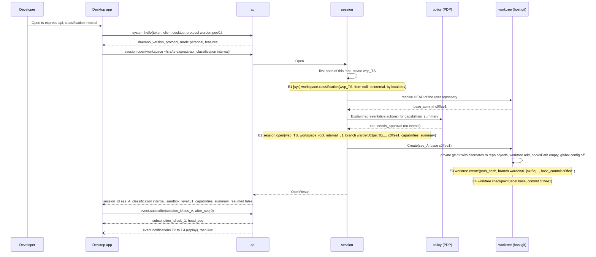

The client authenticates with `system.hello` before any other call (BI-6). Opening a directory for the first time creates the workspace and records its classification on the system chain (CF-01: the demo opens the fixture explicitly as `internal`). `session.open` is the genesis event of the session chain; the worktree manager then creates the private git directory with object alternates (CF-18) and the session worktree, with hooks and global configuration neutralized (core §13.9), and records the base checkpoint. The capability summary shown in the header ("Agents can … need approval for …") is computed with side-effect-free `policy.explain` calls, so it produces no events.

| # | Event | Chain | Emitter | Key payload fields |
|---|---|---|---|---|
| E1 | `workspace.classification` | sys | session | `workspace_id: wsp_TS`, `from: null`, `to: internal`, `by: local:dev` |
| E2 | `session.open` | ses_A | session | `workspace_id`, `workspace_root`, `classification: internal`, `sandbox_level: L1`, `branch: warden/01jaxr8q7m2v9ktc3f6yh5n0pb`, `base_commit: c0ffee1`, `capabilities_summary{text, can[], needs_approval[]}` |
| E3 | `worktree.create` | ses_A | worktree | `path_hash`, `branch`, `base_commit: c0ffee1` |
| E4 | `worktree.checkpoint` | ses_A | worktree | `label: base`, `commit: c0ffee1`, `branch`, `base_commit`, `path_hash` |

### 1.2 Phase B: request and plan task

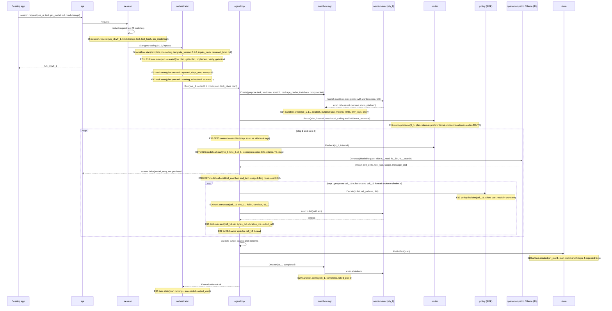

The request text is redacted before persistence (core §13.16). The orchestrator records the run and materializes the five template tasks (`task.state` with `from: null`, which A04 §6.6 projects into the `tasks` table), then schedules `plan`. The sandbox is created before routing (WRD-02 §6). In plan mode the write capability is inactive (`when: task.input.mode != "plan"`, CF-28), so only read tools are rendered. The router is re-checked before every model call (core §13.7). Each proposed call passes the decision triple; outputs are redacted, stored as blobs and wrapped as untrusted before they enter the next step's context (§2 shows the wrapper).

| # | Event | Emitter | Key payload fields |
|---|---|---|---|
| E5 | `session.request` | session | `run_id: wfr_1`, `kind: change`, `text` (redacted), `text_hash`, `pin_model: null` |
| E6 | `workflow.start` | orchestrator | `template: poc-coding`, `template_version: 0.1.0`, `inputs_hash`, `resumed_from: null` |
| E7–E11 | `task.state` ×5 | orchestrator | `task_key` ∈ {plan, gate-plan, implement, verify, gate-final}, `from: null`, `to: created`, `reason: null`, `attempt: 0` |
| E12 | `task.state` | orchestrator | `plan`, `created→queued`, `deps_met`, `attempt: 0` |
| E13 | `task.state` | orchestrator | `plan`, `queued→running`, `scheduled`, `attempt: 1` |
| E14 | `sandbox.create` | sandbox | `sandbox_id: sb_1`, `level: L1`, `backend: seatbelt`, `purpose: task`, `mounts[{kind: worktree, mode: rw}, {toolchain, ro}, {scratch, rw}, {package_cache, rw}, {proxy_socket}, {executor, ro}]`, `limits`, `env_keys[HOME, PATH, HTTP_PROXY, HTTPS_PROXY, NO_PROXY, LANG]`, `proxy{socket, port}` |
| E15 | `routing.decision` | router | `routing_id: rt_1`, `task_class: plan`, `classification: internal`, `strategy: prefer-internal`, `pin: null`, `candidates[local/qwen-coder-32b chosen 0.6; company/qwen-coder-32b admitted 0.6; anthropic/claude-sonnet admitted 0.9 est 0.04; local/qwen-coder-7b admitted 0.3 below threshold; copilot rejected harness_not_pinned]`, `chosen{local/qwen-coder-32b, ollama, T0}`, `explanation: "Chosen: local/qwen-coder-32b (prefer-internal; internal data; 4 candidates)"`, `budget_remaining_usd: 5.00` |
| E16 | `context.assembled` | agentloop | `step: 1`, `sources[{system, trusted}, {request, trusted}]`, `total_tokens`, `budget_tokens` |
| E17 | `model.call.start` | agentloop | `model_call_id: mc_1`, `routing_id: rt_1`, `model_id`, `provider_id: ollama`, `tier: T0`, `step: 1`, `request_hash`, `est_input_tokens` |
| E18 | `model.call.end` | agentloop | `mc_1`, `stop_reason: tool_use`, `usage{…, billing_mode: none, quota: null, estimated_cost{0, USD, "no price: infrastructure cost not tracked"}}`, `latency_ms`, `ttft_ms`, `error: null` |
| E19 | `policy.decision` | policy | `decision_id: dec_11`, `call_id: call_11`, `action{fs, list, resource{rel_path: src}, R0}`, `effect: allow`, `matched_rules[capability.granted, user.reads-in-worktree]`, `approval: null`, `resolved_by_approval: null`, `cache_hit: false` |
| E20 | `tool.exec.start` | agentloop | `call_id: call_11`, `decision_id: dec_11`, `tool: fs.list`, `executor: sandbox`, `sandbox_id: sb_1`, `args_redacted{path: src}` |
| E21 | `tool.exec.end` | agentloop | `call_11`, `ok: true`, `exit_code: null`, `bytes_out`, `truncated: false`, `duration_ms`, `error: null`, `output_ref: sha256:…` |
| E22–E24 | `policy.decision`, `tool.exec.start`, `tool.exec.end` | policy, agentloop | same shape for `call_12` `fs.read src/routes/index.ts` |
| E25 | `context.assembled` | agentloop | `step: 2`, sources add `{tool_result, call_11, untrusted}`, `{tool_result, call_12, untrusted}` |
| E26 | `model.call.start` | agentloop | `mc_2`, `step: 2` |
| E27 | `model.call.end` | agentloop | `mc_2`, `stop_reason: end_turn` |
| E28 | `artifact.created` | store | `artifact_id: art_plan1`, `type: plan`, `content_hash`, `size`, `partial: false`, `summary`, `supersedes: null` |
| E29 | `sandbox.destroy` | sandbox | `sb_1`, `reason: completed`, `killed_pids: 0`, `duration_ms` |
| E30 | `task.state` | orchestrator | `plan`, `running→succeeded`, `output_valid`, `attempt: 1` |

### 1.3 Phase C: gate G1

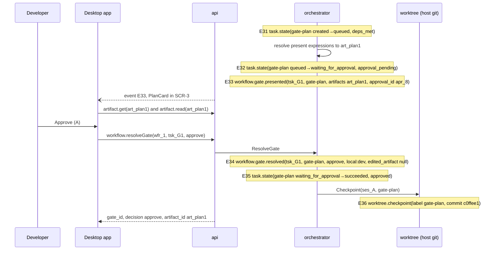

Gates never enter `running` (A13 §3). The gate is an approval record with scope `once` held in the `approvals` projection (A04 §6.6); it is resolved through `workflow.resolveGate`, not `approval.resolve`, and it produces no `approval.*` events. The checkpoint after G1 is the resume point for §5; the planning task wrote nothing, so the checkpoint commit equals the base commit (no empty commit is created, ASM-2). An edit at G1 would add `artifact.edited(edited_by: local:dev)` before E34 and set `edited_artifact` (A13 §4.2).

| # | Event | Emitter | Key payload fields |
|---|---|---|---|
| E31 | `task.state` | orchestrator | `gate-plan`, `created→queued`, `deps_met` |
| E32 | `task.state` | orchestrator | `gate-plan`, `queued→waiting_for_approval`, `approval_pending` |
| E33 | `workflow.gate.presented` | orchestrator | `gate_id: tsk_G1`, `gate_key: gate-plan`, `artifacts[art_plan1]`, `approval_id: apr_8`, `expires_at` (+86,400 s) |
| E34 | `workflow.gate.resolved` | orchestrator | `tsk_G1`, `gate-plan`, `decision: approve`, `approver: local:dev`, `edited_artifact: null`, `comment: null` |
| E35 | `task.state` | orchestrator | `gate-plan`, `waiting_for_approval→succeeded`, `approved` |
| E36 | `worktree.checkpoint` | worktree | `label: gate-plan`, `commit: c0ffee1` |

### 1.4 Phase D: implement with one inline approval

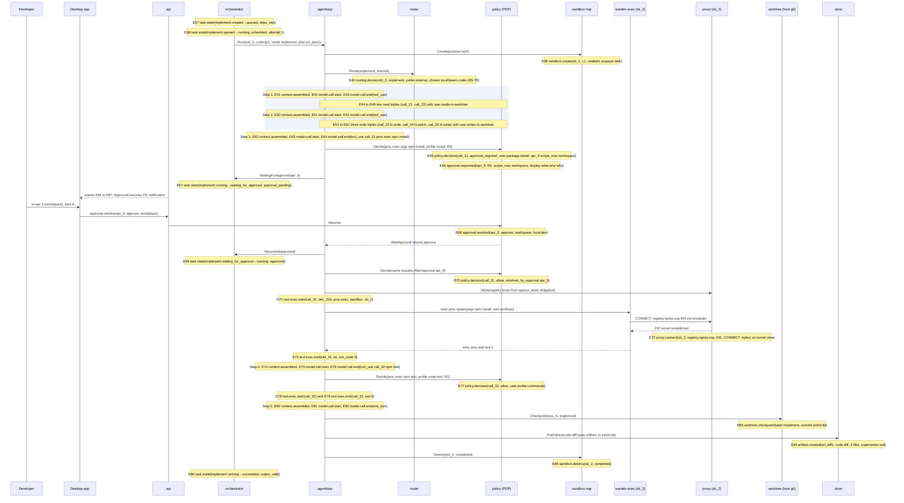

The implement task reads, writes three files and hits the only inline approval of the demo: `npm install` matches profile `install`, rule `user.package-install` requires approval with `scope_max: workspace` and carries the obligation `egress_allow` for the registry hosts (core §13.5). The approval pattern is detailed in §2. After approval, the PDP re-evaluates and emits the allow decision that the executor path requires (CF-40); the registry hosts join the task allowlist before the process starts, so the `CONNECT` succeeds without a second prompt. `npm test` runs under `node-test` without a prompt. The end-of-implement checkpoint is committed host-side, and the `code-diff` covers base to checkpoint.

| # | Event | Emitter | Key payload fields |
|---|---|---|---|
| E37 | `task.state` | orchestrator | `implement`, `created→queued`, `deps_met` |
| E38 | `task.state` | orchestrator | `implement`, `queued→running`, `scheduled`, `attempt: 1` |
| E39 | `sandbox.create` | sandbox | `sb_2`, `L1`, `seatbelt`, `purpose: task`, mounts as E14 |
| E40 | `routing.decision` | router | `rt_2`, `task_class: implement`, `internal`, `prefer-internal`, `chosen{local/qwen-coder-32b, ollama, T0}` (prior 0.55 ≥ 0.5), candidates as E15 with implement priors |
| E41 | `context.assembled` | agentloop | `step: 1`, `sources[{system, trusted}, {request, trusted}, {artifact, art_plan1, untrusted}]` |
| E42, E43 | `model.call.start`, `model.call.end` | agentloop | `mc_3`, `stop_reason: tool_use` (call_21 `fs.read src/routes/index.ts`, call_22 `fs.read src/services/userService.ts`) |
| E44–E46 | decision triple | policy, agentloop | `call_21`: `allow`, `user.reads-in-worktree`; `tool.exec.start/end` on `sb_2` |
| E47–E49 | decision triple | policy, agentloop | `call_22`: same |
| E50 | `context.assembled` | agentloop | `step: 2`, adds two untrusted tool results |
| E51, E52 | `model.call.start`, `model.call.end` | agentloop | `mc_4`, `tool_use` (call_23 `fs.write src/routes/users.ts`, call_24 `fs.patch src/services/userService.ts`, call_25 `fs.write test/users.get.test.ts`) |
| E53–E55 | decision triple | policy, agentloop | `call_23`: `allow`, `matched_rules[capability.granted, user.writes-in-worktree]`, `args_redacted.content: {sha256, bytes}` (A04 §6.4) |
| E56–E58 | decision triple | policy, agentloop | `call_24`: `fs.patch`, same rule |
| E59–E61 | decision triple | policy, agentloop | `call_25`: `fs.write`, same rule |
| E62 | `context.assembled` | agentloop | `step: 3` |
| E63, E64 | `model.call.start`, `model.call.end` | agentloop | `mc_5`, `tool_use` (call_31 `proc.exec ["npm","install"]`) |
| E65 | `policy.decision` | policy | `dec_31a`, `call_31`, `action{proc, exec, resource{argv, executable: npm, command_profile: install}, R4}`, `effect: approval_required`, `matched_rules[user.package-install]`, `obligations{egress_allow[registry.npmjs.org:443, …]}`, `approval{apr_9, scope_max: workspace, scopes_allowed[once, task, session, workspace]}` |
| E66 | `approval.requested` | policy | `apr_9`, `decision_id: dec_31a`, `call_id: call_31`, `pattern`, `risk_class: R4`, `scope_max: workspace`, `reason`, `rule_ids[user.package-install]`, `display{what, who, why}`, `expires_at` (+24 h) |
| E67 | `task.state` | orchestrator | `implement`, `running→waiting_for_approval`, `approval_pending` |
| E68 | `approval.resolved` | policy | `apr_9`, `decision: approve`, `scope: workspace`, `approver: local:dev`, `grant_expires_at: null` |
| E69 | `task.state` | orchestrator | `implement`, `waiting_for_approval→running`, `approved` |
| E70 | `policy.decision` | policy | `dec_31b`, `call_31`, `effect: allow`, `matched_rules[user.package-install, grant.apr_9]`, `resolved_by_approval: apr_9`, `cache_hit: false` |
| E71 | `tool.exec.start` | agentloop | `call_31`, `decision_id: dec_31b`, `tool: proc.exec`, `executor: sandbox`, `sb_2`, `args_redacted{argv[npm, install]}` |
| E72 | `proxy.connect` | proxy | `sb_2`, `host: registry.npmjs.org`, `port: 443`, `method: CONNECT`, `rule: obligation:user.package-install`, `decision_id: dec_31b`, `bytes_up`, `bytes_down` (one event per tunnel, appended on close) |
| E73 | `tool.exec.end` | agentloop | `call_31`, `ok: true`, `exit_code: 0`, `bytes_out`, `truncated: false`, `output_ref` |
| E74–E76 | `context.assembled`, `model.call.start`, `model.call.end` | agentloop | `step: 4`, `mc_6`, `tool_use` (call_32 `proc.exec ["npm","test","--","test/users.get.test.ts"]`) |
| E77–E79 | decision triple | policy, agentloop | `call_32`: `allow`, `user.profile-commands`, `obligations{timeout_seconds: 900, max_output_bytes: 262144}`; `exit_code: 0` |
| E80–E82 | `context.assembled`, `model.call.start`, `model.call.end` | agentloop | `step: 5`, `mc_7`, `stop_reason: end_turn`, output `{summary, changed_files[3]}` |
| E83 | `worktree.checkpoint` | worktree | `label: implement`, `commit: a1b2c3d` |
| E84 | `artifact.created` | store | `art_diff1`, `code-diff`, `partial: false`, `summary: "3 files changed, +96 -2"`, `supersedes: null` |
| E85 | `sandbox.destroy` | sandbox | `sb_2`, `completed` |
| E86 | `task.state` | orchestrator | `implement`, `running→succeeded`, `output_valid` |

### 1.5 Phase E: verify fails

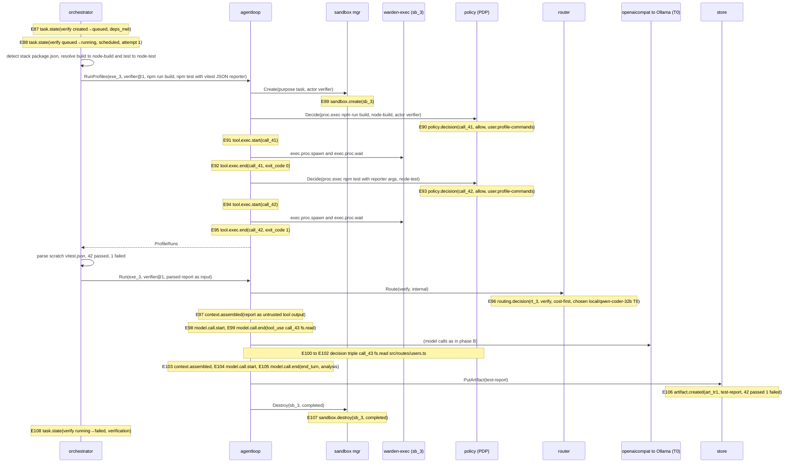

Verification is deterministic first (core §13.12, A13 §8): the runtime resolves the profile classes (CF-29), runs build and tests as ordinary policy-checked `proc.exec` calls with actor `verifier`, and parses the Vitest JSON report written to the task scratch directory. Reading the report file is a host-side read of the scratch directory, not a tool call, so it has no event. The verifier model then receives the parsed report as untrusted data and may read files to write `analysis` (CF-25). `verify` fails because `failed > 0`, which triggers the repair round rather than a retry (WRD-07 §5).

| # | Event | Emitter | Key payload fields |
|---|---|---|---|
| E87 | `task.state` | orchestrator | `verify`, `created→queued`, `deps_met` |
| E88 | `task.state` | orchestrator | `verify`, `queued→running`, `scheduled`, `attempt: 1` |
| E89 | `sandbox.create` | sandbox | `sb_3`, `purpose: task` |
| E90–E92 | decision triple | policy, agentloop | `call_41`, `proc.exec ["npm","run","build"]`, `command_profile: node-build`, `R2`, `allow`, `user.profile-commands`; actor `{agent, verifier, 1.0.0}`; `exit_code: 0` |
| E93–E95 | decision triple | policy, agentloop | `call_42`, `proc.exec ["npm","test","--","--reporter=json","--outputFile=<scratch>/vitest.json"]`, `node-test`, `allow`; `exit_code: 1` |
| E96 | `routing.decision` | router | `rt_3`, `task_class: verify`, `strategy: cost-first` (CF-06), `chosen{local/qwen-coder-32b, ollama, T0}` (known zero cost, prior 0.7; tie with `company/qwen-coder-32b` broken by lower tier, ASM-3) |
| E97 | `context.assembled` | agentloop | `step: 1`, `sources[{system, trusted}, {test_report_parsed, untrusted}]` |
| E98, E99 | `model.call.start`, `model.call.end` | agentloop | `mc_8`, `tool_use` (call_43) |
| E100–E102 | decision triple | policy, agentloop | `call_43`, `fs.read src/routes/users.ts`, `allow`, `user.reads-in-worktree` |
| E103–E105 | `context.assembled`, `model.call.start`, `model.call.end` | agentloop | `step: 2`, `mc_9`, `end_turn` |
| E106 | `artifact.created` | store | `art_tr1`, `test-report`, `summary: "42 passed, 1 failed: GET /users/:id returns 404 for unknown id"`, `supersedes: null` |
| E107 | `sandbox.destroy` | sandbox | `sb_3`, `completed` |
| E108 | `task.state` | orchestrator | `verify`, `running→failed`, `verification`, `detail: "1 failed"` |

### 1.6 Phase F: repair round and second verify

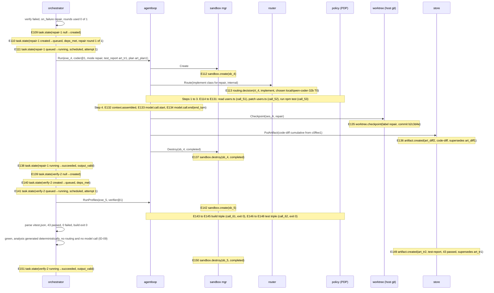

The repair task is materialized only when `verify` fails and the single round is unused (A13 §5); it runs `coder` in `repair` mode, routes as task class `implement` (core §3), and works from the failing report's `analysis` (CF-25). Its `code-diff` supersedes the implement diff and is cumulative from the session base commit (CF-26), so G2 shows one diff. `verify-2` is materialized after the repair succeeds, reruns the same profiles and passes, which is what allows G2 (H4, CF-24). Because the build exits 0 and `failed == 0`, the report's `analysis` is generated deterministically and `verify-2` emits no `routing.decision` or `model.call.*` (ID-09); the failing `verify` in phase E still routes a cost-first model, because only failures need analysis.

| # | Event | Emitter | Key payload fields |
|---|---|---|---|
| E109 | `task.state` | orchestrator | `repair-1`, `from: null`, `to: created` |
| E110 | `task.state` | orchestrator | `repair-1`, `created→queued`, `deps_met`, `detail: "repair round 1 of 1 after verify failed"` |
| E111 | `task.state` | orchestrator | `repair-1`, `queued→running`, `scheduled`, `attempt: 1` |
| E112 | `sandbox.create` | sandbox | `sb_4` |
| E113 | `routing.decision` | router | `rt_4`, `task_class: implement`, `prefer-internal`, `chosen{local/qwen-coder-32b, ollama, T0}` |
| E114 | `context.assembled` | agentloop | `step: 1`, `sources[{system}, {artifact art_tr1 untrusted}, {artifact art_plan1 untrusted}]` |
| E115, E116 | `model.call.start/end` | agentloop | `mc_10`, `tool_use` (call_51 `fs.read src/routes/users.ts`) |
| E117–E119 | decision triple | policy, agentloop | `call_51`, `allow`, `user.reads-in-worktree` |
| E120–E122 | `context.assembled`, `model.call.start/end` | agentloop | `step: 2`, `mc_11`, `tool_use` (call_52 `fs.patch src/routes/users.ts`) |
| E123–E125 | decision triple | policy, agentloop | `call_52`, `allow`, `user.writes-in-worktree` |
| E126–E128 | `context.assembled`, `model.call.start/end` | agentloop | `step: 3`, `mc_12`, `tool_use` (call_53 `proc.exec ["npm","test","--","test/users.get.test.ts"]`) |
| E129–E131 | decision triple | policy, agentloop | `call_53`, `allow`, `user.profile-commands`, `exit_code: 0` |
| E132–E134 | `context.assembled`, `model.call.start/end` | agentloop | `step: 4`, `mc_13`, `end_turn` |
| E135 | `worktree.checkpoint` | worktree | `label: repair`, `commit: b2c3d4e` |
| E136 | `artifact.created` | store | `art_diff2`, `code-diff`, `summary: "4 files changed, +104 -2"`, `supersedes: art_diff1` |
| E137 | `sandbox.destroy` | sandbox | `sb_4`, `completed` |
| E138 | `task.state` | orchestrator | `repair-1`, `running→succeeded`, `output_valid` |
| E139–E141 | `task.state` ×3 | orchestrator | `verify-2`: `null→created`; `created→queued (deps_met)`; `queued→running (scheduled, attempt 1)` |
| E142 | `sandbox.create` | sandbox | `sb_5` |
| E143–E145 | decision triple | policy, agentloop | `call_61`, `npm run build`, `exit_code: 0` |
| E146–E148 | decision triple | policy, agentloop | `call_62`, `npm test` with reporter, `exit_code: 0` |
| E149 | `artifact.created` | store | `art_tr2`, `test-report`, `summary: "43 passed, 0 failed"`, `supersedes: art_tr1`; content `analysis` generated deterministically (ID-09) |
| E150 | `sandbox.destroy` | sandbox | `sb_5`, `completed` |
| E151 | `task.state` | orchestrator | `verify-2`, `running→succeeded`, `output_valid` |

### 1.7 Phase G: gate G2 ends the run, then commit and a rejected push

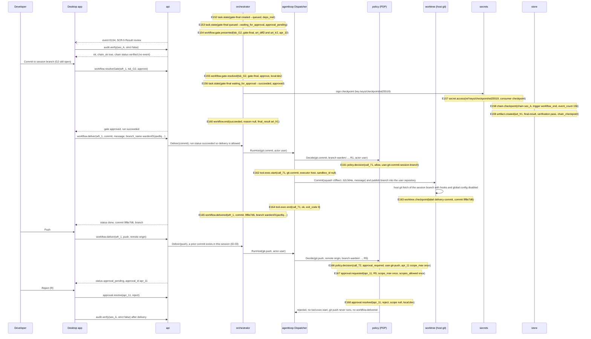

G2 presents the head of the `code-diff` chain and the passing report (CF-26). The chain status in SCR-5 comes from `audit.verify`, which the UI calls when G2 is presented and again after delivery (core §13.17); verification is read-only and emits nothing. Approving G2 ends the run immediately (ID-01): the gate succeeds, the checkpoint with trigger `workflow_end` is written, the `final-result` artifact references that checkpoint (ASM-4), and `workflow.end(succeeded)` follows. "Commit to session branch" pressed while G2 is open first resolves the gate with `approve` and then delivers. Deliveries are post-run actions on a `succeeded` run (ID-02): each is an ActionRequest with `actor.kind: user` that passes the PDP, runs as a host tool, and ends with `workflow.delivered`. The commit squashes the session diff into one commit on the session branch and publishes that branch into the user's repository (ID-03). Push is R5; the effective scope is capped at `once` (core §13.2, ID-06: `user.git-push` is the highest-layer matching approval rule, so the fallback `platform.r5-default` does not apply). The user rejects, nothing is sent, no `tool.exec.start` or `workflow.delivered` exists for `call_72`, and the run stays `succeeded`. The demo shows two inline approval prompts beyond the gates (`apr_9`, `apr_11`), within the H6 limit of three.

| # | Event | Emitter | Key payload fields |
|---|---|---|---|
| E152 | `task.state` | orchestrator | `gate-final`, `created→queued`, `deps_met`, `detail: "depends on verify-2 after repair"` |
| E153 | `task.state` | orchestrator | `gate-final`, `queued→waiting_for_approval`, `approval_pending` |
| E154 | `workflow.gate.presented` | orchestrator | `gate_id: tsk_G2`, `gate_key: gate-final`, `artifacts[art_diff2, art_tr2]`, `approval_id: apr_10`, `expires_at` |
| E155 | `workflow.gate.resolved` | orchestrator | `tsk_G2`, `gate-final`, `decision: approve`, `approver: local:dev`, `edited_artifact: null` |
| E156 | `task.state` | orchestrator | `gate-final`, `waiting_for_approval→succeeded`, `approved` |
| E157 | `secret.access` | secrets | `ref: secret://keys/checkpoint/ed25519`, `consumer: checkpoint`, `purpose: "chain checkpoint signature"` |
| E158 | `chain.checkpoint` | store | `chain: ses_A`, `trigger: workflow_end`, `last_seq` (= seq of E157), `last_hash`, `event_count: 156`, `key_id`, `signature` |
| E159 | `artifact.created` | store | `art_fr1`, `final-result`, `summary`, `supersedes: null`; content `{verification: pass, changed_files[4], cost{amount: 0.00}, chain_checkpoint{last_hash, signature}}` |
| E160 | `workflow.end` | orchestrator | `status: succeeded`, `reason: null`, `final_result: art_fr1` |
| E161 | `policy.decision` | policy | `dec_71`, `call_71`, `action{git, commit, resource{branch: warden/01jaxr8q…}, R1}`, `effect: allow`, `matched_rules[user.git-commit-session-branch]`; envelope `actor{kind: user}` |
| E162 | `tool.exec.start` | agentloop | `call_71`, `dec_71`, `tool: git.commit`, `executor: host`, `sandbox_id: null` |
| E163 | `worktree.checkpoint` | worktree | `label: delivery-commit`, `commit: 9f8e7d6` |
| E164 | `tool.exec.end` | agentloop | `call_71`, `ok: true`, `exit_code: 0`, `output_ref` (`{commit: 9f8e7d6, branch}`) |
| E165 | `workflow.delivered` | orchestrator | `run_id: wfr_1`, `action: commit`, `commit: 9f8e7d6`, `branch: warden/01jaxr8q…`, `remote: null`, `patch_path: null`, `approval_id: null` |
| E166 | `policy.decision` | policy | `dec_72`, `call_72`, `action{git, push, resource{remote: origin, branch}, R5}`, `effect: approval_required`, `matched_rules[user.git-push]`, `approval{apr_11, scope_max: once, scopes_allowed[once]}`; envelope `actor{kind: user}` |
| E167 | `approval.requested` | policy | `apr_11`, `dec_72`, `call_72`, `risk_class: R5`, `scope_max: once`, `display{what: "git push origin warden/01jaxr8q…", who: "you (delivery)", why: "Host effect R5; rule user.git-push"}` |
| E168 | `approval.resolved` | policy | `apr_11`, `decision: reject`, `scope: null`, `approver: local:dev`, `grant_expires_at: null` |

An approved push would continue with `policy.decision(allow, resolved_by_approval: apr_11)`, `tool.exec.start(git.push, executor: host)`, `tool.exec.end`, and `workflow.delivered(action: push, remote: origin, approval_id: apr_11)`; `apply_branch` and `export_patch` follow the same pattern with rule `platform.user-delivery` (ID-02).

## 2. One tool call with approval, execution and result tagging (brief item b)

This is phase D's `npm install` call (E64 to E74 in §1.4) at full resolution. B-numbers map one to one to E-numbers: B1 = E65 … B8 = E72, B9 = E73, B11 = E74.

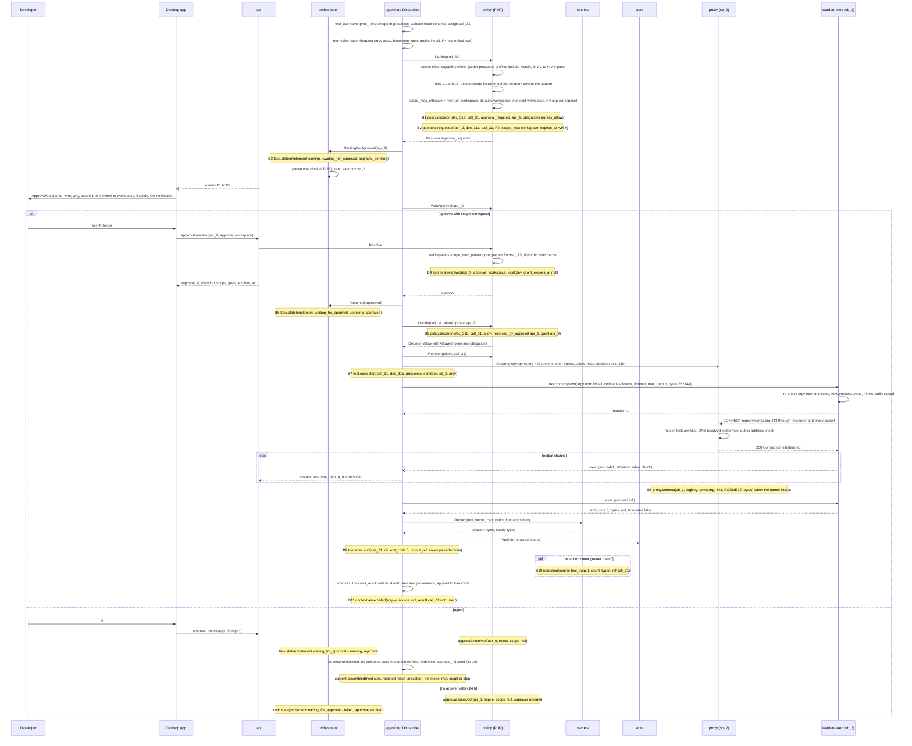

The first decision is `approval_required`, which by itself never unlocks execution. The user's scope choice is validated against the effective maximum (core §13.2) and becomes a grant for the workspace. The PDP then evaluates the same ActionRequest again, now covered by the grant, and emits the allow decision that carries both `resolved_by_approval: apr_9` and `grant.apr_9` in `matched_rules`; only this decision yields the single-use `policy.Allowed` token the Dispatcher needs (A02 §3). The `egress_allow` obligation is applied to the proxy listener before the process starts, so the install's registry traffic is allowed and every other host still follows core §13.4. Output is redacted before it is stored or shown to the model (core §13.16); the `redaction` event, emitted only when something was replaced, follows `tool.exec.end` and points back to the call with `ref`. The model receives the result wrapped as untrusted data with provenance (BI-4); the next `context.assembled` records that trust tag. If the user rejects instead, the task returns to `running` without a second decision or any execution, and the model receives `{ok: false, error: {code: "approval_rejected"}}` as the tool result; three identical rejections or denials end the step (ID-10, WRD-04 §7). Only expiry after 24 h fails the task (`approval_expired`, core §13.3).

Result as appended to the transcript (canonical form; A10 fixes how each adapter renders it):

```json
{ "type": "tool_result", "tool_use_id": "toolu_…", "call_id": "call_31", "ok": true, "trust": "untrusted",
  "output": { "exit_code": 0, "stdout": "added 12 packages in 4s …", "stderr": "", "truncated": false },
  "provenance": { "source": "proc.exec", "command": "npm install", "sandbox_id": "sb_2", "output_ref": "sha256:…" } }
```

| # | Event | Key payload fields |
|---|---|---|
| B1 | `policy.decision` | `decision_id: dec_31a`, `call_id: call_31`, `action{tool: proc, operation: exec, resource{argv[npm, install], executable: npm, command_profile: install, path: <worktree>}, risk_class: R4, args_redacted}`, `effect: approval_required`, `reason: "egress to registry.npmjs.org:443 is not in the task allowlist"`, `matched_rules[capability.granted, user.package-install]`, `obligations{egress_allow[registry.npmjs.org:443, proxy.golang.org:443, sum.golang.org:443, pypi.org:443, files.pythonhosted.org:443]}`, `approval{approval_id: apr_9, scope_max: workspace, scopes_allowed[once, task, session, workspace]}`, `resolved_by_approval: null`, `cache_hit: false` |
| B2 | `approval.requested` | `approval_id: apr_9`, `decision_id: dec_31a`, `call_id: call_31`, `pattern{tool: proc, operation: exec, resource_pattern: "profile:install"}`, `risk_class: R4`, `scope_max: workspace`, `scopes_allowed`, `reason`, `rule_ids[user.package-install]`, `display{what: "npm install (profile install); egress to registry hosts", who: "coder 1.0.0, task implement", why: "Package install needs network (R4); rule user.package-install"}`, `expires_at` |
| B3 | `task.state` | `implement`, `running→waiting_for_approval`, `approval_pending`, `attempt: 1` |
| B4 | `approval.resolved` | `approval_id: apr_9`, `decision: approve`, `scope: workspace`, `approver: local:dev`, `grant_expires_at: null` |
| B5 | `task.state` | `implement`, `waiting_for_approval→running`, `approved` |
| B6 | `policy.decision` | `dec_31b`, `call_31`, same `action`, `effect: allow`, `matched_rules[capability.granted, user.package-install, grant.apr_9]`, `obligations{egress_allow[…]}`, `approval: null`, `resolved_by_approval: apr_9`, `cache_hit: false` |
| B7 | `tool.exec.start` | `call_31`, `decision_id: dec_31b`, `tool: proc.exec`, `executor: sandbox`, `sandbox_id: sb_2`, `args_redacted{argv[npm, install], cwd}` |
| B8 | `proxy.connect` | `sandbox_id: sb_2`, `host: registry.npmjs.org`, `port: 443`, `method: CONNECT`, `rule: obligation:user.package-install`, `decision_id: dec_31b`, `bytes_up`, `bytes_down` |
| B9 | `tool.exec.end` | `call_31`, `ok: true`, `exit_code: 0`, `bytes_out`, `truncated: false`, `duration_ms`, `error: null`, `output_ref: sha256:…`; envelope `redactions{count, types}` |
| B10 | `redaction` (only if count > 0) | `source: tool_output`, `count`, `types[]`, `ref: call_31` |
| B11 | `context.assembled` | `step: 4`, `sources[…, {kind: tool_result, ref: call_31, trust: untrusted, tokens}]` |

## 3. Routing on a `confidential` workspace (brief item c)

Setup for §3.1 and §3.2: `wsp_TS` is `confidential` (the demo's classification switch, §3.3), and a new session `ses_C` is open. Configured providers: `ollama` (T0), `company-vllm` (T1, gateway bearer), `azure-openai` (T2, optional), `anthropic` (T3), harnesses `copilot` (T4, enabled), `codex` and `claude-code` (T4, disabled).

### 3.1 Company-hosted model, provider unavailable, fallback within tier

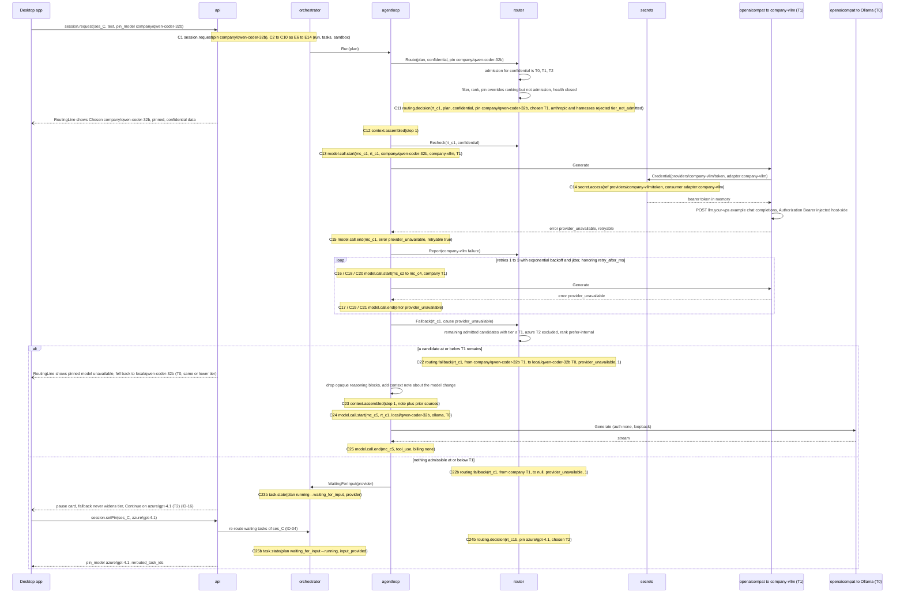

Admission runs first, so every T3 and T4 candidate is rejected with `tier_not_admitted` before any other check (core §13.7); that is also why `copilot` shows `tier_not_admitted` and not `harness_not_pinned` here. The pin selects `company/qwen-coder-32b` among the admitted candidates. Each HTTP attempt is its own `model.call.start`/`model.call.end` pair so that the audit shows every retry. After the retry budget (3, WRD-06 §7) the router falls back only to admitted candidates at the same or a lower tier than the failed one (D-19): `azure/gpt-4.1` (T2) is admitted for `confidential` but is above T1 and therefore excluded from this fallback. The routing line tells the user that the pin could not be honored. If nothing at or below T1 remains, the task pauses instead of widening the tier; the pause card offers a one-click "Continue on azure/gpt-4.1 (T2)", which calls `session.setPin` and re-routes the waiting task immediately (ID-04, ID-16). Four failures do not yet open the circuit (5 failures in 60 s, WRD-16 §5.1).

| # | Event | Key payload fields |
|---|---|---|
| C1 | `session.request` | `run_id: wfr_c`, `kind: change`, `pin_model: company/qwen-coder-32b` |
| C2–C10 | as E6–E14 | `workflow.start`, five `task.state(null→created)`, `task.state(plan created→queued)`, `task.state(plan queued→running)`, `sandbox.create`; envelope `classification: confidential` |
| C11 | `routing.decision` | `routing_id: rt_c1`, `task_class: plan`, `classification: confidential`, `strategy: prefer-internal`, `pin: company/qwen-coder-32b`, `candidates` (table below), `chosen{company/qwen-coder-32b, company-vllm, T1}`, `explanation: "Chosen: company/qwen-coder-32b (pinned; confidential data; 4 admissible, 4 not admissible)"`, `budget_remaining_usd: 5.00` |
| C12 | `context.assembled` | `step: 1` |
| C13 | `model.call.start` | `mc_c1`, `rt_c1`, `company/qwen-coder-32b`, `company-vllm`, `T1`, `step: 1` |
| C14 | `secret.access` | `ref: secret://providers/company-vllm/token`, `consumer: adapter:company-vllm`, `purpose: "model call"`, `result: ok` (once per execution and ref, ASM-8) |
| C15 | `model.call.end` | `mc_c1`, `stop_reason: null`, `usage` zeros with `billing_mode: gateway`, `error{code: provider_unavailable, retryable: true}` |
| C16–C21 | `model.call.start`/`model.call.end` ×3 | `mc_c2` to `mc_c4`, same error |
| C22 | `routing.fallback` | `routing_id: rt_c1`, `from{company/qwen-coder-32b, T1}`, `to{local/qwen-coder-32b, T0}`, `cause: provider_unavailable`, `fallback_count: 1` |
| C23 | `context.assembled` | `step: 1`, sources add `{kind: note, trust: trusted}` "conversation continues on a different model" |
| C24, C25 | `model.call.start`, `model.call.end` | `mc_c5`, `local/qwen-coder-32b`, `ollama`, `T0`; `billing_mode: none` |
| C22b | `routing.fallback` | `to: null`, `fallback_count: 1` |
| C23b | `task.state` | `plan`, `running→waiting_for_input`, `provider`, `detail: "company/qwen-coder-32b unavailable; no other T0 or T1 model available; fallback never widens the tier"` |
| C24b | `routing.decision` | `rt_c1b`, `pin: azure/gpt-4.1`, `chosen{azure/gpt-4.1, azure-openai, T2}` (still admitted for `confidential`), `explanation: "Pinned by user after fallback pause"` |
| C25b | `task.state` | `plan`, `waiting_for_input→running`, `input_provided` |

Candidates in C11:

| `model_id` | `provider_id` | `tier` | `status` | `reason_code` | `reason` | `quality_prior` (plan) | `est_cost_usd` |
|---|---|---|---|---|---|---|---|
| `company/qwen-coder-32b` | `company-vllm` | T1 | `chosen` | null | "Pinned; T1 admitted for confidential data" | 0.6 | 0.00 |
| `local/qwen-coder-32b` | `ollama` | T0 | `admitted` | null | "Would rank first without pin (prefer-internal, prior 0.6)" | 0.6 | 0.00 |
| `azure/gpt-4.1` (illustrative, ASM-14) | `azure-openai` | T2 | `admitted` | null | "T2 admitted; ranked after internal tiers" | 0.85 | 0.03 |
| `local/qwen-coder-7b` | `ollama` | T0 | `admitted` | null | "Prior 0.3 below threshold 0.5" | 0.3 | 0.00 |
| `anthropic/claude-sonnet` | `anthropic` | T3 | `rejected` | `tier_not_admitted` | "Not admissible for confidential data (T0, T1, T2 only)" | 0.9 | 0.04 |
| `copilot` | `copilot` | T4 | `rejected` | `tier_not_admitted` | same | null | null |
| `codex` | `codex` | T4 | `rejected` | `tier_not_admitted` | same | null | null |
| `claude-code` | `claude-code` | T4 | `rejected` | `tier_not_admitted` | same | null | null |

### 3.2 No admissible model, and recovery

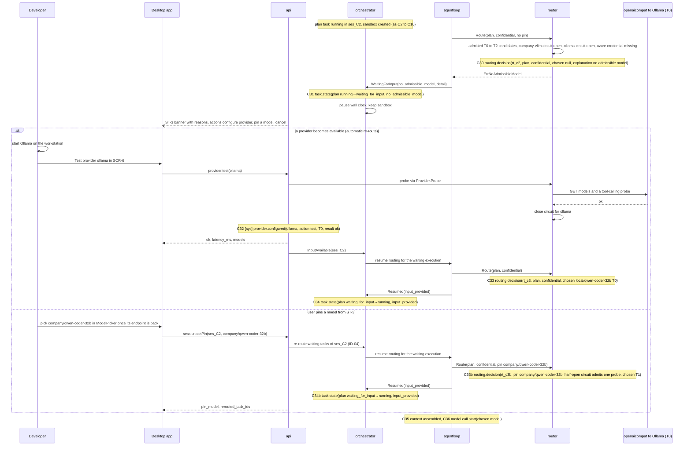

When every admissible candidate is unavailable, the router emits a decision with `chosen: null` and a one-line reason for each candidate, and the task waits for input instead of failing (WRD-06 §6 step 6, A13 row 7). The router never selects an inadmissible model to escape the dead end (BI-7). The task resumes in one of two ways (ID-04): automatically when something that could change the outcome happens (a successful `provider.test`, `provider.add` or `provider.enable`, recorded as `provider.configured` on the system chain; a classification change of the workspace; a circuit closing), or at once when the user sets a pin with `session.setPin`, which re-routes every task of the session waiting with `no_admissible_model` or `provider`. A pin never overrides admission. The pin has no event of its own; it appears in the `pin` field of the next `routing.decision`.

| # | Event | Key payload fields |
|---|---|---|
| C30 | `routing.decision` | `rt_c2`, `plan`, `confidential`, `prefer-internal`, `pin: null`, `candidates[company/qwen-coder-32b unhealthy circuit_open; local/qwen-coder-32b unhealthy circuit_open; local/qwen-coder-7b unhealthy circuit_open; azure/gpt-4.1 rejected credential_missing; anthropic/claude-sonnet rejected tier_not_admitted; copilot, codex, claude-code rejected tier_not_admitted]`, `chosen: null`, `explanation: "No admissible model for confidential data: company and local models unavailable (circuit open); azure-openai has no credential"` |
| C31 | `task.state` | `plan`, `running→waiting_for_input`, `no_admissible_model`, `detail` = explanation |
| C32 | `provider.configured` (sys) | `provider_id: ollama`, `action: test`, `tier: T0`, `protocol: openai-compatible`, `kind: null`, `auth_mode: none`, `secret_ref: null`, `result{ok: true, latency_ms, models[…]}` |
| C33 | `routing.decision` | `rt_c3`, `chosen{local/qwen-coder-32b, ollama, T0}` |
| C34 | `task.state` | `plan`, `waiting_for_input→running`, `input_provided` |
| C33b | `routing.decision` | `rt_c3b`, `pin: company/qwen-coder-32b`, `chosen{company/qwen-coder-32b, company-vllm, T1}` (half-open circuit admits one probe request, WRD-06 §8) |
| C34b | `task.state` | `plan`, `waiting_for_input→running`, `input_provided` |
| C35, C36 | `context.assembled`, `model.call.start` | normal loop continues |

### 3.3 Classification tightened while a task runs

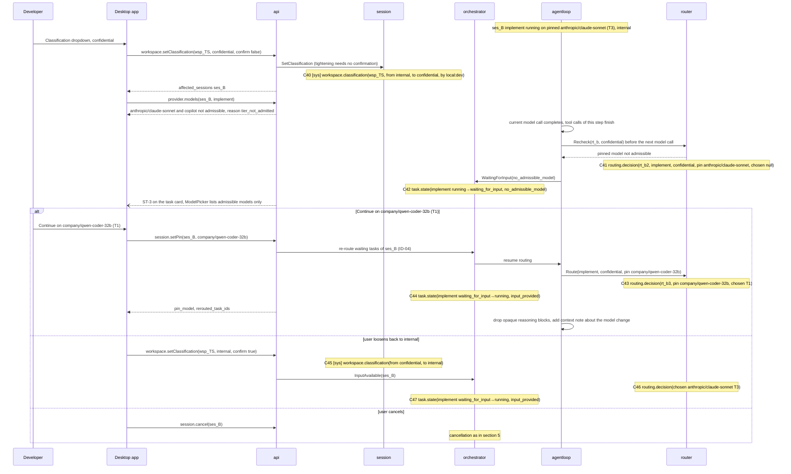

Tightening takes effect at the next model call of a running task (core §13.7): the call already in flight completes, the router's recheck finds the pinned T3 model inadmissible, and the task pauses. The router records the situation as a routing decision with `chosen: null`, which is what the UI's routing line and ModelPicker explain ("not admissible for confidential data"). The normal way out is the one-click "Continue on company/qwen-coder-32b (T1)", which calls `session.setPin` and re-routes the waiting task at once (ID-04); the transcript is kept, opaque reasoning blocks from the previous provider are dropped and a context note records the model change (WRD-06 §7). Loosening the classification requires `confirm: true` (core §13.14) and, per A13 row 8, also lets the task continue on its original pin.

| # | Event | Key payload fields |
|---|---|---|
| C40 | `workspace.classification` (sys) | `workspace_id: wsp_TS`, `from: internal`, `to: confidential`, `by: local:dev` |
| C41 | `routing.decision` | `rt_b2`, `task_class: implement`, `classification: confidential`, `pin: anthropic/claude-sonnet`, `candidates[anthropic/claude-sonnet rejected tier_not_admitted "pinned model not admissible for confidential data"; company/qwen-coder-32b admitted; local/qwen-coder-32b admitted; …]`, `chosen: null`, `explanation: "Pinned anthropic/claude-sonnet (T3) is not admissible for confidential data; choose an admissible model or change the classification"` |
| C42 | `task.state` | `implement`, `running→waiting_for_input`, `no_admissible_model` |
| C43 | `routing.decision` | `rt_b3`, `classification: confidential`, `pin: company/qwen-coder-32b`, `chosen{company/qwen-coder-32b, company-vllm, T1}` |
| C44 | `task.state` | `implement`, `waiting_for_input→running`, `input_provided` |
| C45 | `workspace.classification` (sys) | alternative: `from: confidential`, `to: internal`, `by: local:dev` |
| C46 | `routing.decision` | alternative: `chosen{anthropic/claude-sonnet, anthropic, T3}`, `pin: anthropic/claude-sonnet` |
| C47 | `task.state` | alternative: `implement`, `waiting_for_input→running`, `input_provided` |

### 3.4 Fallback never widens the tier: pause and "Continue on" (CF-44, ID-16)

Setup: session `ses_E` on an `internal` workspace with the providers of the demo setup (WRD-16 §3 step 1): `ollama` (T0), `anthropic` (T3), `copilot` (T4); no company-hosted provider. Task `implement` runs unpinned on `local/qwen-coder-32b` (T0) when the Ollama server stops.

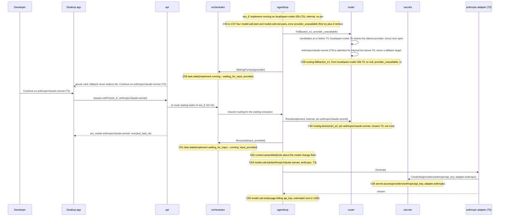

WRD-16 §6.2 calls Anthropic the "fallback target for local failures", but the brief and WRD-06 §7 forbid a fallback that widens the tier (CF-44). The router therefore stops at the tier bound and the task pauses; widening is a user decision, made with one click that calls `session.setPin` (ID-16). The pin is visible in the next `routing.decision`, and from then on the session pin applies to later tasks as well until the user clears it (`session.setPin` with `pin_model: null`). On a `confidential` workspace the same button is offered only for T0 to T2 models (BI-7; §3.1 shows the T2 case).

| # | Event | Key payload fields |
|---|---|---|
| C50–C57 | `model.call.start`/`model.call.end` ×4 | `local/qwen-coder-32b`, `ollama`, `T0`; `error{code: provider_unavailable, retryable: true}` |
| C58 | `routing.fallback` | `routing_id: rt_e1`, `from{local/qwen-coder-32b, T0}`, `to: null`, `cause: provider_unavailable`, `fallback_count: 1` |
| C59 | `task.state` | `implement`, `running→waiting_for_input`, `provider`, `detail: "local models unavailable; fallback never widens the tier; Continue on anthropic/claude-sonnet (T3) is available"` |
| C60 | `routing.decision` | `rt_e2`, `task_class: implement`, `classification: internal`, `pin: anthropic/claude-sonnet`, `candidates[anthropic/claude-sonnet chosen "pinned by user"; local/qwen-coder-32b unhealthy circuit_open; local/qwen-coder-7b unhealthy circuit_open; copilot rejected harness_not_pinned]`, `chosen{anthropic/claude-sonnet, anthropic, T3}`, `budget_remaining_usd` |
| C61 | `task.state` | `implement`, `waiting_for_input→running`, `input_provided` |
| C62 | `context.assembled` | sources start with `{kind: note, trust: trusted}` "conversation continues on a different model" |
| C63 | `model.call.start` | `anthropic/claude-sonnet`, `anthropic`, `T3` |
| C64 | `secret.access` | `ref: secret://providers/anthropic/api_key`, `consumer: adapter:anthropic`, `purpose: "model call"` |
| C65 | `model.call.end` | `usage{billing_mode: api_key, estimated_cost{amount, USD, basis}}` |

## 4. Copilot harness session in split mode (brief item d)

Setup: session `ses_D` on `wsp_TS` (`internal`), request pinned to `copilot` (harnesses are pin-only, core §13.7), task `implement` after G1. Split mode per CF-22 and core §13.8.

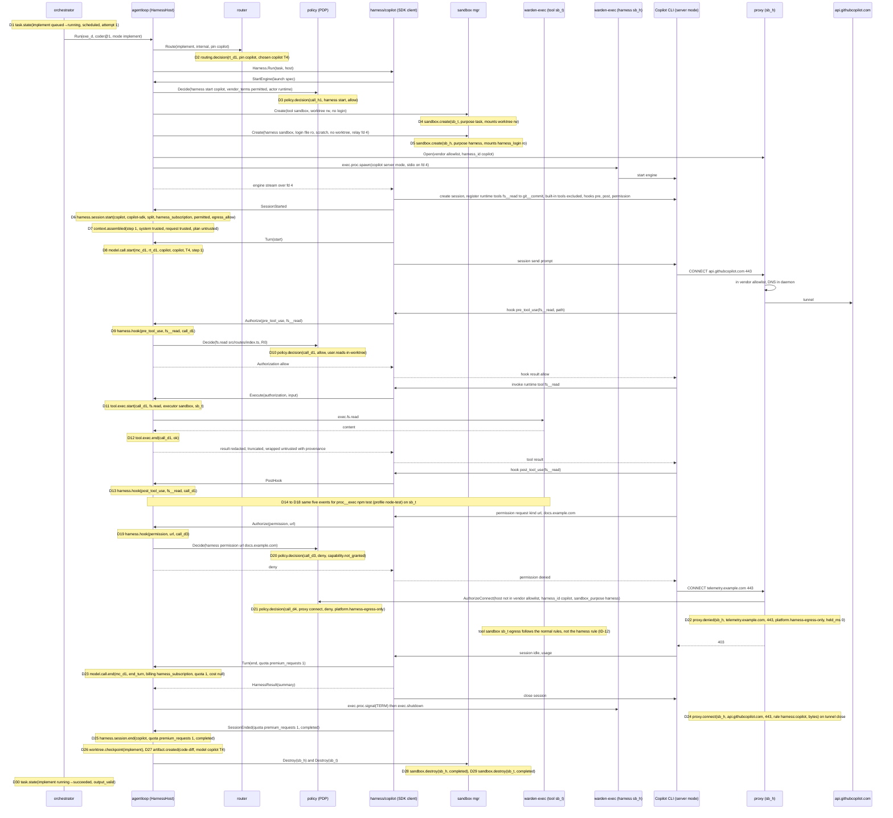

The Copilot engine runs in the harness sandbox with its own login file mounted read-only (HX-1) and no worktree; the worktree lives only in the tool sandbox, and only `warden-exec` in that sandbox touches it. The engine's built-in tools are excluded, so the only tools it can call are the runtime tools registered by the adapter; every call passes the pre-tool-use hook, which the adapter can only answer through `HarnessHost.Authorize` (A02 §4.2), and the handler then asks `HarnessHost.Execute`, which runs the allowed call in the tool sandbox. Permission requests the runtime cannot map to a granted capability are denied. The harness sandbox's proxy listener allows only the vendor endpoints; any other destination is denied without a prompt by `platform.harness-egress-only`, which matches only connections from a harness sandbox (`context.sandbox_purpose == "harness"`, ID-12). The tool sandbox `sb_t` of the same task follows the normal egress rules (CF-20, core §13.4), so an `npm install` issued through `proc__exec` there gets the usual `user.package-install` approval. The model call itself happens inside the engine, so the runtime records it as a turn with quota units instead of tokens and cost (WRD-09 §7), and the session end carries the total. The task produces the same `code-diff` artifact as a provider-backed task, computed by the runtime from the worktree.

| # | Event | Key payload fields |
|---|---|---|
| D1 | `task.state` | `implement`, `queued→running`, `scheduled`, `attempt: 1` |
| D2 | `routing.decision` | `rt_d1`, `implement`, `internal`, `prefer-internal`, `pin: copilot`, `candidates[copilot chosen "pinned harness; T4 admitted for internal; vendor terms permitted"; local/qwen-coder-32b admitted; company/qwen-coder-32b admitted; anthropic/claude-sonnet admitted; codex rejected harness_disabled; claude-code rejected harness_disabled]`, `chosen{copilot, copilot, T4}` |
| D3 | `policy.decision` | `call_h1`, `action{tool: harness, operation: start, resource{harness_id: copilot, vendor_terms: permitted}, risk_class: R0}`, `effect: allow`, `matched_rules[]` (no rule requires approval for a permitted harness; ASM-5) |
| D4 | `sandbox.create` | `sb_t`, `purpose: task`, `mounts[worktree rw, toolchain ro, scratch rw, package_cache rw, proxy_socket, executor]` |
| D5 | `sandbox.create` | `sb_h`, `purpose: harness`, `mounts[harness_login ro, toolchain ro (Copilot CLI and its runtime), scratch rw, proxy_socket, executor]`, no `worktree` mount, `env_keys[HOME, PATH, HTTP_PROXY, HTTPS_PROXY, NO_PROXY]` |
| D6 | `harness.session.start` | `harness_id: copilot`, `kind: copilot-sdk`, `run_mode: split`, `billing_mode: harness_subscription`, `vendor_terms: permitted`, `egress_allow[api.githubcopilot.com:443, github.com:443, api.github.com:443]` (final list from week-5 traffic, WRD-16 §10.4) |
| D7 | `context.assembled` | `step: 1`, `sources[{system, trusted}, {request, trusted}, {artifact art_plan, untrusted}]` |
| D8 | `model.call.start` | `mc_d1`, `rt_d1`, `model_id: copilot`, `provider_id: copilot`, `tier: T4`, `step: 1` (ASM-6) |
| D9 | `harness.hook` | `hook: pre_tool_use`, `harness_tool: fs__read`, `call_id: call_d1`; envelope `actor{kind: harness, name: copilot}` |
| D10 | `policy.decision` | `call_d1`, `fs.read`, `R0`, `allow`, `user.reads-in-worktree` |
| D11 | `tool.exec.start` | `call_d1`, `decision_id`, `tool: fs.read`, `executor: sandbox`, `sandbox_id: sb_t` |
| D12 | `tool.exec.end` | `call_d1`, `ok: true`, `output_ref` |
| D13 | `harness.hook` | `hook: post_tool_use`, `harness_tool: fs__read`, `call_id: call_d1` |
| D14–D18 | `harness.hook`, `policy.decision`, `tool.exec.start`, `tool.exec.end`, `harness.hook` | `call_d2`, `proc__exec` `["npm","test"]`, `node-test`, `allow`, `user.profile-commands`, `sandbox_id: sb_t` |
| D19 | `harness.hook` | `hook: permission`, `harness_tool: url`, `call_id: call_d3` |
| D20 | `policy.decision` | `call_d3`, `action{harness, permission, resource{kind: url, host: docs.example.com}}`, `effect: deny`, `matched_rules[capability.not_granted]` |
| D21 | `policy.decision` | `call_d4`, `action{proxy, connect, resource{host: telemetry.example.com, port: 443, harness_id: copilot}, R4}`, evaluated with `context.sandbox_purpose: harness` (ID-12), `effect: deny`, `matched_rules[platform.harness-egress-only]` |
| D22 | `proxy.denied` | `sandbox_id: sb_h`, `host: telemetry.example.com`, `port: 443`, `method: CONNECT`, `rule: platform.harness-egress-only`, `decision_id`, `reason: "harness sandboxes may reach vendor endpoints only"`, `held_ms: 0` |
| D23 | `model.call.end` | `mc_d1`, `stop_reason: end_turn`, `usage{billing_mode: harness_subscription, quota{kind: premium_requests, units: 1}, estimated_cost: null}` |
| D24 | `proxy.connect` | `sb_h`, `api.githubcopilot.com`, `443`, `CONNECT`, `rule: harness:copilot`, `decision_id: null`, `bytes_up`, `bytes_down` |
| D25 | `harness.session.end` | `harness_id: copilot`, `quota{premium_requests, 1}`, `reason: completed` |
| D26 | `worktree.checkpoint` | `label: implement` |
| D27 | `artifact.created` | `code-diff`; provenance `model{id: copilot, provider: copilot, tier: T4, routing_event}` |
| D28, D29 | `sandbox.destroy` | `sb_h` then `sb_t`, `completed` |
| D30 | `task.state` | `implement`, `running→succeeded`, `output_valid` |

Co-located variant (Codex app-server, Claude Code CLI; only on `public`/`internal`): one sandbox holds worktree and login file; `D4`/`D5` collapse into one `sandbox.create(purpose: harness)` with `worktree` and `harness_login` mounts; the pre-tool-use hook or approval callback yields `harness.hook` and `policy.decision`, then `HarnessHost.Observed` emits `tool.exec.start` with `executor: harness` before the engine runs its own tool, and the post hook yields `tool.exec.end` and `harness.hook(post_tool_use)`. The strict pairing check (§7) applies unchanged. Starting `codex` (`vendor_terms: tolerated`) additionally matches `user.harness-tolerated` (approval, scope ≤ session), which inserts `approval.requested`, `approval.resolved` and a second `policy.decision` between D3 and D4.

## 5. Cancellation during implement, then resume from the last gate (brief item e)

Alternative continuation of §1.4: the user cancels while `call_32` (`npm test`) is running, right after E78.

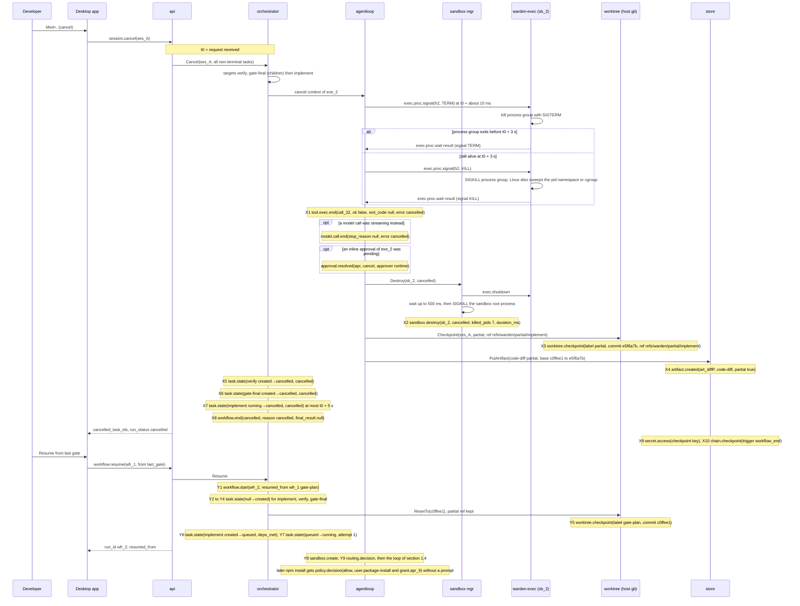

Timing (S-8, core §13.10):

| Time | What happens | Event |
|---|---|---|
| t0 | `session.cancel` arrives; targets fixed; context cancelled | none |
| t0 + ~10 ms | `exec.proc.signal TERM` to the process group | none (executor message) |
| t0 + 3 s | `exec.proc.signal KILL` if anything is still alive | none |
| ≈ t0 + 3.1 s | wait result | X1 |
| ≈ t0 + 3.4 s | `exec.shutdown`, sandbox root gone (SIGKILL after 500 ms if needed) | X2 |
| ≈ t0 + 3.9 s | partial checkpoint commit and partial `code-diff` | X3, X4 |
| ≤ t0 + 5 s | all targets `cancelled`, run ended | X5 to X8 |

Deadline guard: if X3 or X4 have not completed by t0 + 4.5 s (a very large worktree), the orchestrator emits X5 to X8 first and appends X3 and X4 when they finish; the partial artifacts are still recorded and linked by `task_id`. The session stays open, the worktree is preserved for inspection, and `refs/warden/partial/implement` keeps the partial work reachable after the resume resets the worktree to the G1 checkpoint. The resumed run does not re-present G1 and reuses the approved plan (A13 §7.1); because `apr_9` was granted with scope `workspace`, the resumed install proceeds without a new prompt, and its decision cites `grant.apr_9` in `matched_rules` (core §13.1).

| # | Event | Key payload fields |
|---|---|---|
| X1 | `tool.exec.end` | `call_32`, `ok: false`, `exit_code: null`, `error{code: cancelled, message: "terminated: SIGTERM, SIGKILL after 3 s"}`, `duration_ms`, `output_ref` (partial output) |
| X2 | `sandbox.destroy` | `sb_2`, `reason: cancelled`, `killed_pids: 7`, `duration_ms` |
| X3 | `worktree.checkpoint` | `label: partial`, `commit: e5f6a7b`, `ref: refs/warden/partial/implement` |
| X4 | `artifact.created` | `art_diffP`, `code-diff`, `partial: true`, `summary: "partial: 3 files changed"`, `supersedes: null` |
| X5 | `task.state` | `verify`, `created→cancelled`, `cancelled` |
| X6 | `task.state` | `gate-final`, `created→cancelled`, `cancelled` |
| X7 | `task.state` | `implement`, `running→cancelled`, `cancelled`, `attempt: 1` |
| X8 | `workflow.end` | `status: cancelled`, `reason: cancelled`, `final_result: null` |
| X9, X10 | `secret.access`, `chain.checkpoint` | as E157, E158 with `trigger: workflow_end` |
| Y1 | `workflow.start` | envelope `workflow_run_id: wfr_2`; `template: poc-coding`, `resumed_from{run_id: wfr_1, gate_key: gate-plan}` |
| Y2–Y4 | `task.state` ×3 | `implement`, `verify`, `gate-final`: `null→created` (ASM-10) |
| Y5 | `worktree.checkpoint` | `label: gate-plan`, `commit: c0ffee1` (records the reset) |
| Y6, Y7 | `task.state` | `implement`: `created→queued (deps_met, detail "resumed from gate-plan of wfr_1")`, `queued→running (scheduled, attempt 1)` |
| Y8, Y9 | `sandbox.create`, `routing.decision` | new sandbox and routing for the resumed execution |
| later | `policy.decision` | `effect: allow`, `matched_rules[capability.granted, user.package-install, grant.apr_9]`, `resolved_by_approval: null` |

## 6. Daemon restart and resume from events (brief item f)

Setup: alternative continuation of §1.4 at step 3. The model proposed `call_35` `proc.exec ["npx","prettier","--write","src"]` (no profile, `user.other-commands`, scope ≤ task); the last events before the crash were `policy.decision(approval_required, apr_12)`, `approval.requested(apr_12)` and `task.state(implement running→waiting_for_approval)`. Then `wardend` is killed (SIGKILL). On Linux `bwrap --die-with-parent` takes `sb_2` down with it; on macOS the `sandbox-exec` process group may survive.

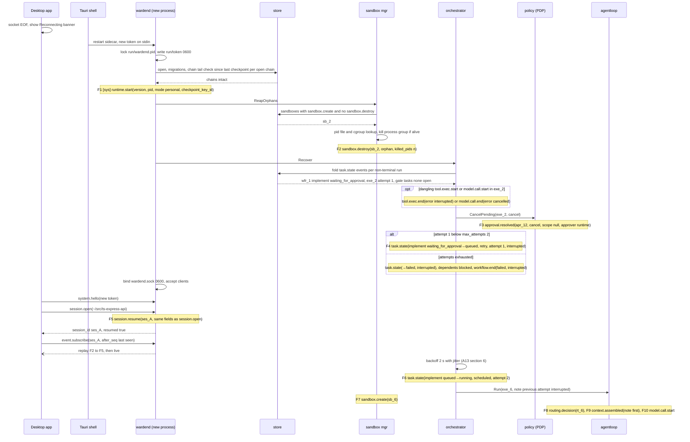

The event log is the source of truth (A13 §9): recovery rebuilds task state by folding `task.state` events, closes whatever the dead process left open, and only then accepts clients, so a reconnecting client never observes a half-recovered run. The order is fixed so that the audit reads causally: the new runtime announces itself (F1); orphan sandboxes are destroyed (F2), so no process from the old execution can act after recovery; dangling start events get their matching end events, which keeps the strict pairing check (§7) meaningful; pending inline approvals of the interrupted execution are cancelled (F3), which prevents a late approval from authorizing a call that no longer exists; and finally the task is re-queued because `implement` allows two attempts (F4). Gate tasks that were `waiting_for_approval` produce no events: the gate stays open and is shown again when the client replays events. The re-queued attempt starts from the preserved worktree with a context note, and the model must request any non-profile command again (new approval `apr_13` if it does).

| # | Event | Chain | Key payload fields |
|---|---|---|---|
| F1 | `runtime.start` | sys | `version`, `pid`, `mode: personal`, `checkpoint_key_id` |
| F2 | `sandbox.destroy` | ses_A | `sb_2`, `reason: orphan`, `killed_pids` (0 on Linux after `--die-with-parent`), `duration_ms` |
| (opt) | `tool.exec.end` / `model.call.end` | ses_A | `error{code: interrupted}` / `error{code: cancelled, retryable: false}`, `stop_reason: null` |
| F3 | `approval.resolved` | ses_A | `approval_id: apr_12`, `decision: cancel`, `scope: null`, `approver: runtime`, `grant_expires_at: null` |
| F4 | `task.state` | ses_A | `implement`, `waiting_for_approval→queued`, `reason: retry`, `attempt: 1`, `detail: "interrupted by daemon restart; attempt 1 of 2 used"` (ASM-11) |
| F5 | `session.resume` | ses_A | `workspace_id`, `workspace_root`, `classification`, `sandbox_level`, `branch`, `base_commit`, `capabilities_summary` |
| F6 | `task.state` | ses_A | `implement`, `queued→running`, `scheduled`, `attempt: 2` |
| F7 | `sandbox.create` | ses_A | `sb_6` |
| F8 | `routing.decision` | ses_A | `rt_6` |
| F9 | `context.assembled` | ses_A | `sources[{kind: note, trust: trusted, "previous attempt interrupted by daemon restart; worktree preserved"}, …]` |
| F10 | `model.call.start` | ses_A | first call of attempt 2 |

F5 is emitted when the client reattaches; it may interleave with F6 to F10, which the scheduler starts on its own. If the chain tail check fails for a session, the store marks that chain broken, refuses further appends to it (`store_unavailable`, -32009, fail closed per WRD-02 §11), and the UI shows ST-6 for that session; other sessions recover normally.

## 7. Audit export and `audit verify --strict` (brief item g)

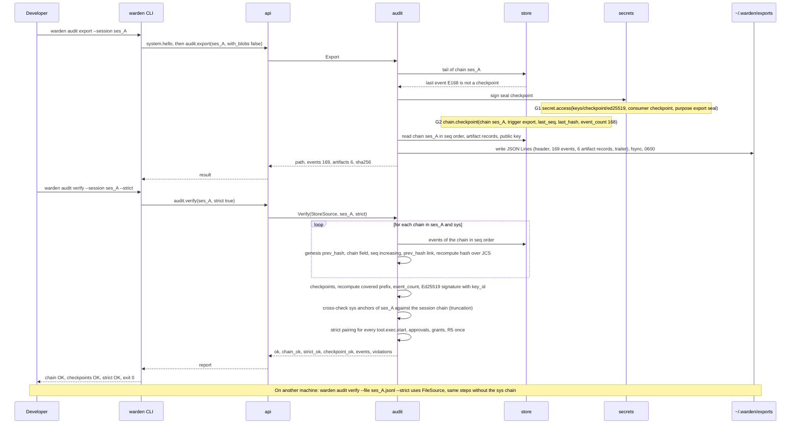

Export seals an open chain first, so that the file ends with a signed checkpoint that covers every exported event (WRD-09 §9); a closed session already ends with its close checkpoint and gets no new events. Verification is read-only and emits nothing. It runs three independent passes; a failure in one does not stop the others, so the report lists every violation.

| # | Event | Key payload fields |
|---|---|---|
| G1 | `secret.access` | `ref: secret://keys/checkpoint/ed25519`, `consumer: checkpoint`, `purpose: "export seal"` |
| G2 | `chain.checkpoint` | `chain: ses_A`, `trigger: export`, `last_seq` (= seq of G1), `last_hash` (= hash of G1), `event_count: 168`, `key_id`, `signature` |

### 7.1 Pass 1: chain recomputation per chain (CF-09)

For each chain to verify (store mode with `--session`: the session chain and the whole `sys` chain; file mode: the session chain in the file):

```go
prev := "sha256:" + hex(sha256("warden-chain-v1:" + chain)) // genesis (core §5)
var lastSeq int64
for ev := range src.Events(chain) {                         // ordered by seq
	check(ev.Chain == chain, "chain_mismatch")
	check(ev.Seq > lastSeq, "seq_order")                     // store-global seq: gaps allowed
	check(ev.PrevHash == prev, "prev_hash_mismatch")
	check(sha256(JCS(withoutHash(ev))) == ev.Hash, "hash_mismatch") // A04 §6.3 canonical form
	check(registry.Known(ev.Type), "unknown_type")
	if strict { check(schema.Valid(ev.Type, ev.Payload), "schema_invalid") }
	prev, lastSeq = ev.Hash, ev.Seq
}
```

`chain_ok` is true when no pass-1 violation exists on any verified chain.

### 7.2 Pass 2: checkpoints and truncation

1. For every `chain.checkpoint` event C on chain K whose payload `chain == K`: the event immediately before C has `seq == C.last_seq` and `hash == C.last_hash`; the number of events in K up to `last_seq` equals `C.event_count`; the Ed25519 signature verifies over `JCS({chain, last_seq, last_hash, event_count, key_id})` (core §5) with the public key whose id is `C.key_id` (store mode: `~/.warden/keys/checkpoint.pub`; file mode: the key in the export header, and the CLI prints its fingerprint for out-of-band comparison). Violations: `checkpoint_mismatch`, `checkpoint_signature_invalid`, `unknown_key`.
2. For every `sys` event that records a checkpoint of `ses_A` (the anchors A04 writes on the system chain, at least the close checkpoint per CF-09): its `last_seq`, `last_hash`, `event_count` must match the session chain; a session chain shorter than its anchor, or missing, is `truncated_chain`. A `session.purged` tombstone replaces the session chain for this check.
3. Events after the last checkpoint of an open session are reported as `unsealed_tail` (warning, does not fail); for a closed session the close checkpoint must be the last event (`events_after_close`).

`checkpoint_ok` is true when no pass-2 violation (warnings excluded) exists.

### 7.3 Pass 3: strict pairing (core §13.1, CF-40)

Indexes built in one scan of the session chain: decisions by `call_id` and by `decision_id`, `approval.requested` / `approval.resolved` / `approval.revoked` by `approval_id`, `tool.exec.end` by `call_id`, sandbox lifetimes by `sandbox_id`.

For every `tool.exec.start` T (executor `sandbox`, `host` or `harness`):

| Check | Violation kind |
|---|---|
| A `policy.decision` D exists with `D.decision_id == T.decision_id`, `D.call_id == T.call_id`, `D.seq < T.seq` | `exec_without_decision` |
| `D.effect == allow`, and no later decision for the same `call_id` with a different effect precedes T | `decision_not_allow` |
| If `D.resolved_by_approval = a`: an `approval.requested(a)` with `call_id == T.call_id` and an `approval.resolved(a, decision: approve)` exist with `seq < D.seq` | `approval_missing`, `approval_not_approved` |
| For each `grant.a` in `D.matched_rules`: `approval.resolved(a, approve, scope ∈ {task, session, workspace})` before D, no `approval.revoked(a)` between them, scope compatible (`task`: same `task_id`; `session`: same session; `workspace`: same `workspace_id`), not expired at `D.ts` | `grant_invalid`, `grant_revoked`, `grant_scope_mismatch` |
| If the grant was resolved in another session's chain (workspace scope): store mode looks it up and verifies that chain too; file mode reports it | `external_grant_unverified` (warning) |
| If `D.action.risk_class == R5`: `D.resolved_by_approval` is set, that approval's scope is `once`, and no other allow decision cites the same approval | `r5_scope_violation` |
| A `tool.exec.end` with the same `call_id` follows T | `exec_without_end` |
| If `T.executor == sandbox`: `T.sandbox_id` has a `sandbox.create` before T and no `sandbox.destroy` before T | `sandbox_mismatch` |

Also: every `approval.requested` follows a `policy.decision(approval_required)` with the same `approval_id`, and every `approval.resolved` follows its `approval.requested` (`approval_orphan`). `strict_ok` is true when no pass-3 violation (warnings excluded) exists. `ok = chain_ok && checkpoint_ok && (strict_ok || !strict)`.

Result for the demo session (store mode, after G2):

```
chain ses_A   169 events   hashes OK
chain sys      57 events   hashes OK
checkpoints   2 on ses_A (workflow_end, export), signatures OK, key 3f9a1c0d5e7b2a64
strict        18 tool executions, 18 allow decisions, 1 approval-backed (apr_9), 1 rejected approval without execution (apr_11)
result        OK
```

`audit.verify` returns `{ok: true, chain_ok: true, strict_ok: true, checkpoint_ok: true, events: 226, violations: []}`; the CLI exits 0, and 1 when `ok` is false (ASM-13). The desktop maps the same result to the chain status badge (`verified` / `failed`, ST-6).

## Traceability

| Design element | WRD source (doc §) | Requirement / invariant satisfied |
|---|---|---|
| §1 phase diagrams, E1–E168 | WRD-16 §3 steps 2–6, §8, §11; WRD-02 §6; WRD-07 §3, §4 | H1 (same flow on any model), H2, H4, H5; BI-1, BI-4, BI-6 |
| Session genesis, worktree with alternates and neutralized hooks | WRD-16 §5.1, §10.1; CF-18; core §13.9 | INV-3, T-01 |
| Task creation, gates without `running`, repair and `verify-2` | WRD-16 §8; WRD-07 §4, §6, §7; CF-24, CF-26, CF-27; A13 §3–§5 | H4 |
| Two decisions around an approval (§2) | WRD-08 §7; CF-40; core §13.1, §13.2 | BI-1, S-7 |
| Egress obligation applied before spawn; `proxy.connect` | WRD-16 §10.4; CF-20; core §13.4, §13.5 | BI-2, INV-5 |
| Redaction before persistence, `redaction` after `tool.exec.end` | WRD-09 §1 (3); WRD-16 §10.5; core §13.16 | BI-3, S-9 |
| Untrusted wrapper and `context.assembled` trust tags | WRD-04 §7; WRD-10 §9; WRD-16 §7.3 | BI-4, T-03 |
| Routing admission, pin, retries, same-or-lower-tier fallback, `chosen: null` (§3) | WRD-06 §4, §6, §7; WRD-16 §6.3; CF-03, CF-04, CF-05; core §13.7 | BI-7, T-22, WRD-16 §15 item 8 |
| Mid-run tightening pauses the task | core §13.7, §13.14; WRD-06 §2 | BI-7 |
| `session.setPin` unblock of paused tasks (§3.1 to §3.4) | core ID-04, ID-16; CF-44; WRD-06 §6 step 6, §7 | BI-7, fallback never widens the tier (D-19) |
| G2 approve ends the run; post-run deliveries with `workflow.delivered` (§1.7) | core ID-01, ID-02, ID-03; A13 §10 | BI-1 (every delivery has an allow decision), S-7 |
| Green `verify-2` without a model call (§1.6) | core ID-09; WRD-16 §7.2 | H4 |
| Rejected inline approval returns the task to `running` (§2) | core ID-10; WRD-04 §7 | BI-1, S1 behaviour |
| `platform.harness-egress-only` scoped to harness sandboxes (§4) | core ID-12; CF-20, CF-22 | BI-2 |
| Split-mode Copilot session (§4) | WRD-16 §6.2, §10.4; WRD-05 §9; CF-22; core §13.8 | BI-1, BI-2 (HX-1), BI-4, T-13, T-14 |
| Harness quota accounting | WRD-09 §7; WRD-05 §8 | cost panel data source |
| Cancellation timing and partial artifacts (§5) | WRD-16 §8, §15 item 10; WRD-07 §8; core §13.10; A13 §7 | S-8, T-20 |
| Resume from last gate with grant reuse | WRD-11 §3; WRD-16 §15 item 10; A13 §7.1 | H6 (no repeated prompt) |
| Restart recovery order (§6) | WRD-02 §11; WRD-16 §8; WRD-07 §3; core §13.11; A13 §9.1 | H5, fail-closed store |
| Export seal and three-pass verify (§7) | WRD-09 §4, §9; WRD-16 §11, §15 item 5; CF-08, CF-09, CF-40 | H2, H5, S-5, T-17 |

## Deviations and assumptions

- ASM-1: Every materialized task gets a first `task.state` with `from: null, to: created` (A04 §6.6 projects `tasks` from it; A13 §2 materializes tasks in `created`). Template tasks are created right after `workflow.start`; `repair-1` and `verify-2` when they are materialized.
- ASM-2: The `gate-plan` checkpoint records the current commit; when the plan task wrote nothing it equals the base commit and no empty commit is created (A14 authoritative).
- ASM-3: Equal-prior, equal-cost candidates are ordered by lower tier, then catalog order (A09 authoritative).
- ASM-4: When G2 is approved the run ends immediately (ID-01); the checkpoint (`trigger: workflow_end`, ID-14) is written before the `final-result` artifact so that the artifact's `chain_checkpoint` can reference it; each signing records `secret.access` with `consumer: checkpoint` (A04 and A15 authoritative on whether key reads are cached per process).
- ASM-5: A harness start is evaluated by the PDP as `{tool: harness, operation: start}` with a runtime-assigned `call_id`; for `vendor_terms: permitted` no rule requires approval, so the effect is `allow` with empty `matched_rules`; risk class shown as R0 (A08 authoritative).
- ASM-6: A harness turn is recorded as `model.call.start`/`model.call.end` with `billing_mode: harness_subscription`, quota units from the SDK when reported, else 1 per prompt sent (A12 authoritative).
- ASM-7: `proxy.connect.rule` values used here: `obligation:<rule id>` (host added by an obligation), `grant.<approval_id>`, `harness:<harness id>` (vendor allowlist), `manifest` (A07 authoritative).
- ASM-8: Provider credentials are recorded by `secret.access` once per execution and ref; retries in the same execution do not repeat it (A15 authoritative).
- ASM-9: `tool.exec.end.error.code` values `cancelled` and `interrupted` (A04 leaves the code a free string; A06 and A10 authoritative).
- ASM-10: A resumed run instantiates only `implement`, `verify` and `gate-final`; the approved plan is referenced, not copied; the reset of the worktree is recorded as `worktree.checkpoint(label: gate-plan)` so that no new label is needed (A13, A14 authoritative).
- ASM-11: On restart, an execution paused in `waiting_for_approval` is treated like a `running` one: its approvals are cancelled and the task goes `→ queued (retry)` when attempts remain (A13 §9.1 describes this for `running`). Emit order proposed here: `runtime.start`, orphan `sandbox.destroy`, closing events for dangling starts, `approval.resolved(cancel)`, then `task.state`; A13 §9.1 lists the same steps in a different order and should adopt this one.
- ASM-12 (now ID-04): A task in `waiting_for_input(provider)` is re-routed automatically after `provider.configured` with `result.ok`, after `workspace.classification`, or when a circuit closes, and immediately after `session.setPin`. This file uses reason `provider` for an exhausted, tier-bounded fallback (C23b, C59) and `no_admissible_model` when admission leaves no candidate (C31, C42), per core ID-18.
- ASM-13: `audit.export` seals an open session chain with `chain.checkpoint(trigger: export)`; `warden audit verify` exits 0 when `ok`, 1 otherwise. The export record layout is A04's; this flow relies only on header (with public key), events in `seq` order, artifact records and trailer.
- ASM-14: `azure/gpt-4.1` is an illustrative model id for the optional T2 provider; the catalog in WRD-16 §6.1 names none.
- NEW: verification violation kinds `chain_mismatch`, `seq_order`, `prev_hash_mismatch`, `hash_mismatch`, `unknown_type`, `schema_invalid`, `checkpoint_mismatch`, `checkpoint_signature_invalid`, `unknown_key`, `truncated_chain`, `unsealed_tail` (warning), `events_after_close`, `exec_without_decision`, `decision_not_allow`, `approval_missing`, `approval_not_approved`, `grant_invalid`, `grant_revoked`, `grant_scope_mismatch`, `external_grant_unverified` (warning), `r5_scope_violation`, `exec_without_end`, `sandbox_mismatch`, `approval_orphan` (A04 and A05 authoritative for the final list).
- DEV: none against WRD documents beyond those already recorded as CF-xx. The event order "tool.exec.end → redaction" follows the brief; the bytes are redacted before the output blob and `tool.exec.end` are written, so WRD-09 §1 (3) holds.
- Mermaid: participant aliases are written unquoted (`participant PDP as policy (PDP)`). The brief asks for `participant X as "Label"`, but Mermaid 11 renders the quotes literally; unquoted aliases with parentheses parse and render correctly (checked with mermaid 11 and mmdc). Message texts avoid semicolons, `#` and unbalanced quotes.
