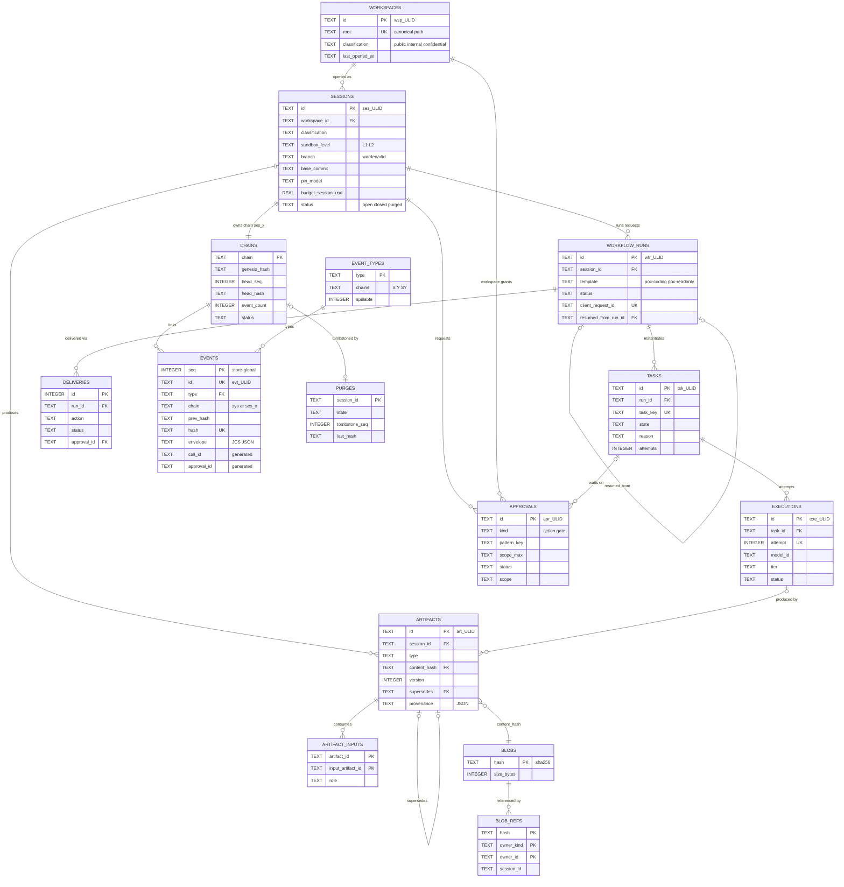
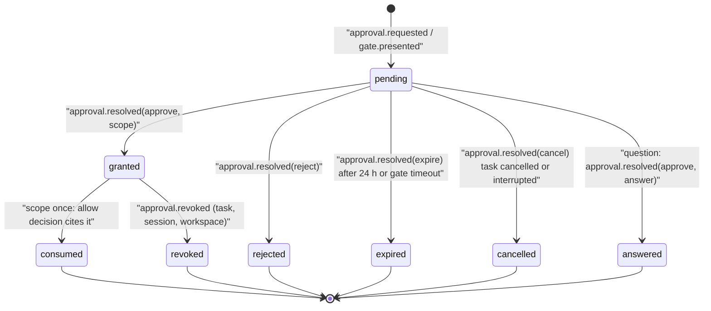
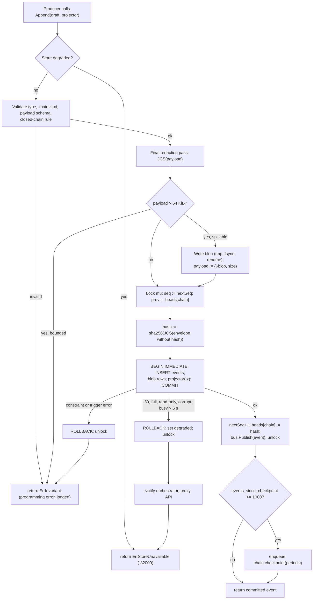

# A04 Data model

This deliverable fixes the persistent data model of the Warden PoC: the SQLite schema (complete DDL), the migration strategy, the event envelope and every event payload, the artifact record with its provenance object and the six PoC artifact content schemas, the approval record and grant matching, the blob store, the hash-chain algorithm with its writer concurrency model, the checkpoint signature, verification, export, retention and the cost aggregates. It refines WRD-16 §11 and WRD-09, applies CF-08, CF-09, CF-10, CF-25, CF-26, CF-32, CF-39 and CF-40, and uses the identifiers of `00-DESIGN-CORE.md` exactly. Package: `internal/store` (SQLite, chain, blobs) and `internal/audit` (verify, export) per core §4.

## 1. Storage overview

| Data | Where | Mutability | Source of truth for |
|---|---|---|---|
| Events | SQLite `events` (envelope stored as canonical JSON) | Append-only; delete only by purge (§14) | Everything that happened (WRD-09 §1 principle 1) |
| Chain heads | SQLite `chains` (maintained by trigger) | Updated only by the insert trigger | Fast append and restart; always derivable from `events` |
| Projections | SQLite `workspaces`, `sessions`, `workflow_runs`, `tasks`, `executions`, `approvals`, `deliveries`, `artifacts`, `artifact_inputs` | Written in the same transaction as the event that caused the change | Queries for the API and the UI; rebuildable from events |
| Artifact and payload contents | `~/.warden/blobs/sha256/<aa>/<hex>` indexed by `blobs` and `blob_refs` | Immutable, content-addressed | Artifact bodies, per-file diff patches, spilled payloads, full tool outputs |
| Schema version | `schema_migrations`, `PRAGMA user_version` | Forward-only | Migration state |
| Checkpoint key | Keychain `warden` / `keys/checkpoint/ed25519` (private seed), `~/.warden/keys/checkpoint.pub` (public) | Generated once; rotated only on loss | Checkpoint signatures (§11) |

Rule P-1: **events are the ledger; projections point at events, never the reverse.** No foreign key goes from `events` to a projection table, so an event can always be inserted first and a projection can always be rebuilt by replaying events. Rule P-2: **every projection change happens in the same SQLite transaction as the event that justifies it** (§10.3), so projections never run ahead of or behind the chain. Rule P-3: aggregates (cost, tokens, quota, UX metrics) are **computed from events**, never stored as counters in projections (WRD-09 §7); in-memory running totals are caches rebuilt at start (§15).

Schema base URIs (core §1): `https://schemas.warden.dev/poc/common.json` (shared ids and enums), `…/events/envelope.json`, `…/events/payloads.json`, `…/artifacts/record.json`, `…/artifacts/<type>.json`, `…/approval.json`. A05 references these for the API.

## 2. SQLite configuration

Driver: `modernc.org/sqlite` (pure Go, WRD-16 §5.1). Minimum embedded SQLite 3.45 (needed: `STRICT` tables 3.37, generated columns 3.31, built-in JSON 3.38). `internal/store` asserts `sqlite_version() >= '3.45.0'` at open and fails `system.doctor` check `store` otherwise.

Files: `~/.warden/db/warden.sqlite` plus `-wal` and `-shm`; directory mode 0700, files 0600 (the daemon runs with `umask 077`).

Connections:

| Pool | Count | Use | Per-connection PRAGMAs |
|---|---|---|---|
| Writer | exactly 1 (`*sql.Conn` owned by the writer goroutine, §10.3) | Every INSERT/UPDATE/DELETE, migrations, purge | `foreign_keys=ON`, `busy_timeout=5000`, `synchronous=FULL`, `temp_store=MEMORY`, `cache_size=-16384` |
| Readers | 4 (`database/sql` pool opened with `mode=ro`) | API queries, subscription replay, verify, export | `foreign_keys=ON`, `busy_timeout=5000`, `query_only=ON`, `temp_store=MEMORY` |

Database-level PRAGMAs, set once by migration bootstrap and asserted at every open:

```sql
PRAGMA journal_mode = WAL;              -- persistent; readers never block the writer
PRAGMA application_id = 1463898692;     -- 0x57415244 'WARD'; open refuses other files
PRAGMA wal_autocheckpoint = 1000;       -- pages
PRAGMA journal_size_limit = 67108864;   -- 64 MiB WAL cap after checkpoint
PRAGMA auto_vacuum = INCREMENTAL;       -- set before first table is created; purge runs incremental_vacuum
```

`synchronous=FULL` on the writer makes every committed event durable across power loss (fsync of the WAL on each commit), which is the precondition for "no tool executes without a preceding durable `policy.decision`" (BI-1). Readers do not write, so their `synchronous` setting is irrelevant. An idle task runs `PRAGMA wal_checkpoint(TRUNCATE)` on the writer connection when no event was appended for 10 minutes, and `PRAGMA incremental_vacuum` after a purge.

DSN (writer): `file:/Users/<u>/.warden/db/warden.sqlite?_pragma=foreign_keys(1)&_pragma=busy_timeout(5000)&_pragma=synchronous(FULL)&_txlock=immediate`. `_txlock=immediate` makes every `BEGIN` a `BEGIN IMMEDIATE`, so the single writer never hits a lock upgrade deadlock with readers.

At open the store runs `PRAGMA quick_check` (fails start on error: `store_unavailable`) and compares `chains.head_hash` with the last event hash of each chain (a cheap consistency check; mismatch logs an incident and fails `system.doctor` check `store`). A full `PRAGMA integrity_check` runs only from `system.doctor`.

## 3. Complete DDL

Migration `internal/store/migrations/0001_init.sql` (embedded with `//go:embed`). All tables are `STRICT`. Identifier checks use prefix and length (`<prefix>_` + 26-char ULID); the Crockford alphabet is validated in Go before insert. Timestamps are RFC 3339 UTC with milliseconds (`2026-09-26T10:14:03.214Z`), stored as TEXT so that lexical order equals time order.

```sql
-- ============================================================================
-- 0001_init.sql  Warden PoC store schema v1
-- ============================================================================

CREATE TABLE schema_migrations (
  version          INTEGER PRIMARY KEY CHECK (version > 0),
  name             TEXT    NOT NULL,
  checksum         TEXT    NOT NULL CHECK (checksum GLOB 'sha256:*' AND length(checksum) = 71),
  applied_at       TEXT    NOT NULL,
  runtime_version  TEXT    NOT NULL
) STRICT;

CREATE TABLE store_meta (
  key    TEXT PRIMARY KEY CHECK (key IN ('store_id', 'created_at', 'created_by_version', 'health_probe')),
  value  TEXT NOT NULL
) STRICT;

-- Registry of persisted event types (CF-10). New types are added by INSERT in a
-- later migration, never by rebuilding the events table.
CREATE TABLE event_types (
  type             TEXT    PRIMARY KEY CHECK (type GLOB '[a-z]*' AND type NOT GLOB '*[^a-z.]*'),
  chains           TEXT    NOT NULL CHECK (chains IN ('S', 'Y', 'SY')),
  spillable        INTEGER NOT NULL CHECK (spillable IN (0, 1)),
  since_migration  INTEGER NOT NULL
) STRICT;

-- One row per hash chain: 'sys' plus one per session (CF-09).
CREATE TABLE chains (
  chain                    TEXT    PRIMARY KEY
                           CHECK (chain = 'sys' OR (chain GLOB 'ses_*' AND length(chain) = 30)),
  genesis_hash             TEXT    NOT NULL CHECK (genesis_hash GLOB 'sha256:*' AND length(genesis_hash) = 71),
  head_seq                 INTEGER NOT NULL DEFAULT 0 CHECK (head_seq >= 0),
  head_hash                TEXT    NOT NULL CHECK (head_hash GLOB 'sha256:*' AND length(head_hash) = 71),
  event_count              INTEGER NOT NULL DEFAULT 0 CHECK (event_count >= 0),
  last_checkpoint_seq      INTEGER,
  events_since_checkpoint  INTEGER NOT NULL DEFAULT 0 CHECK (events_since_checkpoint >= 0),
  status                   TEXT    NOT NULL CHECK (status IN ('open', 'closed', 'purged')),
  created_at               TEXT    NOT NULL,
  CHECK (event_count > 0 OR head_hash = genesis_hash)
) STRICT;

-- The ledger. `envelope` holds the exact RFC 8785 canonical JSON of the full
-- envelope including "hash"; the other columns are indexed projections of it.
CREATE TABLE events (
  seq             INTEGER PRIMARY KEY CHECK (seq > 0),
  id              TEXT    NOT NULL UNIQUE CHECK (id GLOB 'evt_*' AND length(id) = 30),
  v               INTEGER NOT NULL CHECK (v = 1),
  ts              TEXT    NOT NULL CHECK (ts GLOB '[0-9][0-9][0-9][0-9]-[0-9][0-9]-[0-9][0-9]T[0-9][0-9]:[0-9][0-9]:[0-9][0-9].[0-9][0-9][0-9]Z'),
  type            TEXT    NOT NULL REFERENCES event_types(type),
  chain           TEXT    NOT NULL,
  session_id      TEXT    CHECK (session_id IS NULL OR (session_id GLOB 'ses_*' AND length(session_id) = 30)),
  workflow_run_id TEXT    CHECK (workflow_run_id IS NULL OR (workflow_run_id GLOB 'wfr_*' AND length(workflow_run_id) = 30)),
  task_id         TEXT    CHECK (task_id IS NULL OR (task_id GLOB 'tsk_*' AND length(task_id) = 30)),
  execution_id    TEXT    CHECK (execution_id IS NULL OR (execution_id GLOB 'exe_*' AND length(execution_id) = 30)),
  workspace_id    TEXT    CHECK (workspace_id IS NULL OR (workspace_id GLOB 'wsp_*' AND length(workspace_id) = 30)),
  classification  TEXT    CHECK (classification IS NULL OR classification IN ('public', 'internal', 'confidential')),
  actor_kind      TEXT    NOT NULL CHECK (actor_kind IN ('user', 'agent', 'runtime', 'harness')),
  actor_name      TEXT    NOT NULL,
  prev_hash       TEXT    NOT NULL CHECK (prev_hash GLOB 'sha256:*' AND length(prev_hash) = 71),
  hash            TEXT    NOT NULL UNIQUE CHECK (hash GLOB 'sha256:*' AND length(hash) = 71),
  envelope        TEXT    NOT NULL CHECK (json_valid(envelope)),
  payload_blob    TEXT    CHECK (payload_blob IS NULL OR (payload_blob GLOB 'sha256:*' AND length(payload_blob) = 71)),
  -- Lookup columns for audit verify --strict (CF-40) and approval joins.
  call_id         TEXT GENERATED ALWAYS AS (json_extract(envelope, '$.payload.call_id')) VIRTUAL,
  approval_id     TEXT GENERATED ALWAYS AS (json_extract(envelope, '$.payload.approval_id')) VIRTUAL,
  CHECK (chain = 'sys' OR (chain GLOB 'ses_*' AND length(chain) = 30)),
  CHECK (chain = 'sys' OR session_id = chain),
  CHECK (chain <> 'sys' OR session_id IS NULL),
  UNIQUE (chain, seq)
) STRICT;

CREATE INDEX events_session_seq  ON events (session_id, seq)       WHERE session_id IS NOT NULL;
CREATE INDEX events_session_type ON events (session_id, type, seq) WHERE session_id IS NOT NULL;
CREATE INDEX events_type_ts      ON events (type, ts);
CREATE INDEX events_task_seq     ON events (task_id, seq)          WHERE task_id IS NOT NULL;
CREATE INDEX events_call         ON events (call_id, seq)          WHERE call_id IS NOT NULL;
CREATE INDEX events_approval     ON events (approval_id, seq)      WHERE approval_id IS NOT NULL;
-- (chain, seq) is covered by the automatic index of UNIQUE (chain, seq).

-- Purge bookkeeping; also the only authorization for deleting events (§3.3).
CREATE TABLE purges (
  session_id     TEXT    PRIMARY KEY CHECK (session_id GLOB 'ses_*' AND length(session_id) = 30),
  state          TEXT    NOT NULL CHECK (state IN ('deleting', 'done')),
  tombstone_seq  INTEGER NOT NULL,
  last_hash      TEXT    NOT NULL CHECK (last_hash GLOB 'sha256:*' AND length(last_hash) = 71),
  event_count    INTEGER NOT NULL CHECK (event_count >= 0),
  started_at     TEXT    NOT NULL,
  finished_at    TEXT,
  CHECK ((state = 'done') = (finished_at IS NOT NULL))
) STRICT;

-- ---------------------------------------------------------------------------
-- Append-only enforcement and chain linkage (defense in depth behind the
-- single writer; a violation is a programming error and aborts the tx).
-- ---------------------------------------------------------------------------
CREATE TRIGGER events_link BEFORE INSERT ON events
BEGIN
  SELECT RAISE(ABORT, 'warden: unknown or purged chain')
   WHERE NOT EXISTS (SELECT 1 FROM chains WHERE chain = NEW.chain AND status <> 'purged');
  SELECT RAISE(ABORT, 'warden: prev_hash does not match chain head')
   WHERE NEW.prev_hash <> (SELECT head_hash FROM chains WHERE chain = NEW.chain);
  SELECT RAISE(ABORT, 'warden: seq must increase')
   WHERE NEW.seq <= COALESCE((SELECT max(seq) FROM events), 0);
  SELECT RAISE(ABORT, 'warden: event type not allowed on this chain')
   WHERE NOT EXISTS (
     SELECT 1 FROM event_types t
      WHERE t.type = NEW.type
        AND ((NEW.chain = 'sys' AND t.chains IN ('Y', 'SY'))
          OR (NEW.chain <> 'sys' AND t.chains IN ('S', 'SY'))));
END;

CREATE TRIGGER events_advance_chain AFTER INSERT ON events
BEGIN
  UPDATE chains
     SET head_seq    = NEW.seq,
         head_hash   = NEW.hash,
         event_count = event_count + 1,
         events_since_checkpoint = CASE
           WHEN NEW.type = 'chain.checkpoint'
            AND json_extract(NEW.envelope, '$.payload.chain') = NEW.chain THEN 0
           ELSE events_since_checkpoint + 1 END,
         last_checkpoint_seq = CASE
           WHEN NEW.type = 'chain.checkpoint'
            AND json_extract(NEW.envelope, '$.payload.chain') = NEW.chain THEN NEW.seq
           ELSE last_checkpoint_seq END
   WHERE chain = NEW.chain;
END;

CREATE TRIGGER events_no_update BEFORE UPDATE ON events
BEGIN
  SELECT RAISE(ABORT, 'warden: events are append-only');
END;

CREATE TRIGGER events_no_delete BEFORE DELETE ON events
WHEN NOT EXISTS (SELECT 1 FROM purges p WHERE p.session_id = OLD.chain AND p.state = 'deleting')
BEGIN
  SELECT RAISE(ABORT, 'warden: events are append-only (purge not authorized)');
END;

-- ---------------------------------------------------------------------------
-- Projections
-- ---------------------------------------------------------------------------
CREATE TABLE workspaces (
  id                         TEXT PRIMARY KEY CHECK (id GLOB 'wsp_*' AND length(id) = 30),
  root                       TEXT NOT NULL UNIQUE CHECK (root GLOB '/*'),   -- canonical absolute path, symlinks resolved
  name                       TEXT NOT NULL,                                 -- basename, for display
  classification             TEXT NOT NULL DEFAULT 'confidential'
                             CHECK (classification IN ('public', 'internal', 'confidential')),
  classification_changed_at  TEXT,
  created_at                 TEXT NOT NULL,
  last_opened_at             TEXT NOT NULL
) STRICT;
CREATE INDEX workspaces_recent ON workspaces (last_opened_at DESC);

CREATE TABLE sessions (
  id                   TEXT PRIMARY KEY CHECK (id GLOB 'ses_*' AND length(id) = 30),
  workspace_id         TEXT NOT NULL REFERENCES workspaces(id),
  workspace_root       TEXT NOT NULL,
  classification       TEXT NOT NULL CHECK (classification IN ('public', 'internal', 'confidential')),
  sandbox_level        TEXT NOT NULL CHECK (sandbox_level IN ('L1', 'L2')),
  sandbox_backend      TEXT NOT NULL CHECK (sandbox_backend IN ('seatbelt', 'bwrap', 'docker')),
  branch               TEXT NOT NULL CHECK (branch GLOB 'warden/*' AND length(branch) = 33),
  base_commit          TEXT NOT NULL CHECK (length(base_commit) IN (40, 64)),
  worktree_path        TEXT NOT NULL,
  gitdir_path          TEXT NOT NULL,
  pin_model            TEXT,
  budget_session_usd   REAL NOT NULL CHECK (budget_session_usd > 0),
  status               TEXT NOT NULL CHECK (status IN ('open', 'closed', 'purged')),
  close_reason         TEXT CHECK (close_reason IS NULL OR close_reason IN ('user', 'retention')),
  created_at           TEXT NOT NULL,
  last_activity_at     TEXT NOT NULL,
  closed_at            TEXT,
  worktree_removed_at  TEXT,
  purged_at            TEXT,
  CHECK ((status = 'open') = (closed_at IS NULL)),
  CHECK ((status = 'purged') = (purged_at IS NOT NULL))
) STRICT;
CREATE INDEX sessions_by_workspace ON sessions (workspace_id, status, last_activity_at DESC);
CREATE INDEX sessions_closed       ON sessions (closed_at) WHERE status = 'closed';

CREATE TABLE workflow_runs (
  id                        TEXT PRIMARY KEY CHECK (id GLOB 'wfr_*' AND length(id) = 30),
  session_id                TEXT NOT NULL REFERENCES sessions(id),
  template                  TEXT NOT NULL CHECK (template IN ('poc-coding', 'poc-readonly')),
  template_version          TEXT NOT NULL,
  kind                      TEXT NOT NULL CHECK (kind IN ('change', 'readonly')),
  status                    TEXT NOT NULL CHECK (status IN ('running', 'waiting', 'succeeded', 'failed', 'cancelled')),
  reason                    TEXT CHECK (reason IS NULL OR reason IN (
                              'deps_met','scheduled','approval_pending','approved','input_needed','input_provided',
                              'output_valid','retry','budget','policy_denied','schema','verification','interrupted',
                              'provider','tool','resource','timeout','cancelled','rejected','approval_expired',
                              'no_admissible_model','upstream_failed')),
  request_text_hash         TEXT NOT NULL CHECK (request_text_hash GLOB 'sha256:*'),
  pin_model                 TEXT,
  interactive               INTEGER NOT NULL DEFAULT 1 CHECK (interactive IN (0, 1)),
  client_request_id         TEXT CHECK (client_request_id IS NULL OR length(client_request_id) BETWEEN 1 AND 64),
  resumed_from_run_id       TEXT REFERENCES workflow_runs(id),
  resumed_from_gate         TEXT CHECK (resumed_from_gate IS NULL OR resumed_from_gate IN ('gate-plan', 'gate-final')),
  final_result_artifact_id  TEXT REFERENCES artifacts(id) DEFERRABLE INITIALLY DEFERRED,
  created_at                TEXT NOT NULL,
  ended_at                  TEXT,
  CHECK ((status IN ('running', 'waiting')) = (ended_at IS NULL)),
  CHECK ((resumed_from_run_id IS NULL) = (resumed_from_gate IS NULL)),
  UNIQUE (session_id, client_request_id)
) STRICT;
CREATE INDEX runs_by_session ON workflow_runs (session_id, created_at);
-- One worktree per session, tasks sequential: at most one active run per session.
CREATE UNIQUE INDEX runs_one_active ON workflow_runs (session_id) WHERE status IN ('running', 'waiting');

CREATE TABLE tasks (
  id                   TEXT PRIMARY KEY CHECK (id GLOB 'tsk_*' AND length(id) = 30),
  run_id               TEXT NOT NULL REFERENCES workflow_runs(id),
  task_key             TEXT NOT NULL CHECK (task_key IN
                         ('plan', 'gate-plan', 'implement', 'verify', 'repair-1', 'verify-2', 'gate-final', 'summarize')),
  kind                 TEXT NOT NULL CHECK (kind IN ('agent', 'approval_gate')),
  agent                TEXT CHECK (agent IS NULL OR agent IN ('coder', 'verifier')),
  agent_version        TEXT,
  agent_digest         TEXT CHECK (agent_digest IS NULL OR agent_digest GLOB 'sha256:*'),
  mode                 TEXT CHECK (mode IS NULL OR mode IN ('plan', 'implement', 'repair', 'summarize')),
  task_class           TEXT CHECK (task_class IS NULL OR task_class IN ('plan', 'implement', 'verify', 'summarize')),
  state                TEXT NOT NULL CHECK (state IN ('created', 'queued', 'running', 'waiting_for_approval',
                         'waiting_for_input', 'succeeded', 'failed', 'cancelled', 'timed_out', 'skipped', 'blocked')),
  reason               TEXT CHECK (reason IS NULL OR reason IN (
                         'deps_met','scheduled','approval_pending','approved','input_needed','input_provided',
                         'output_valid','retry','budget','policy_denied','schema','verification','interrupted',
                         'provider','tool','resource','timeout','cancelled','rejected','approval_expired',
                         'no_admissible_model','upstream_failed')),
  attempts             INTEGER NOT NULL DEFAULT 0 CHECK (attempts >= 0),
  max_attempts         INTEGER NOT NULL DEFAULT 1 CHECK (max_attempts >= 1),
  depends_on           TEXT NOT NULL DEFAULT '[]' CHECK (json_valid(depends_on) AND json_type(depends_on) = 'array'),
  wall_clock_used_ms   INTEGER NOT NULL DEFAULT 0 CHECK (wall_clock_used_ms >= 0),  -- excludes waiting time (CF-38)
  gate_expires_at      TEXT,
  created_at           TEXT NOT NULL,
  updated_at           TEXT NOT NULL,
  CHECK ((kind = 'agent') = (agent IS NOT NULL)),
  CHECK ((kind = 'approval_gate') = (task_key IN ('gate-plan', 'gate-final'))),
  UNIQUE (run_id, task_key)
) STRICT;
CREATE INDEX tasks_open ON tasks (state)
  WHERE state NOT IN ('succeeded', 'failed', 'cancelled', 'skipped', 'blocked');

CREATE TABLE executions (
  id             TEXT PRIMARY KEY CHECK (id GLOB 'exe_*' AND length(id) = 30),
  task_id        TEXT NOT NULL REFERENCES tasks(id),
  attempt        INTEGER NOT NULL CHECK (attempt >= 1),
  sandbox_level  TEXT NOT NULL CHECK (sandbox_level IN ('L1', 'L2')),
  sandbox_id     TEXT CHECK (sandbox_id IS NULL OR (sandbox_id GLOB 'sb_*' AND length(sandbox_id) = 29)),
  harness_id     TEXT,
  model_id       TEXT,
  provider_id    TEXT,
  tier           TEXT CHECK (tier IS NULL OR tier IN ('T0', 'T1', 'T2', 'T3', 'T4')),
  routing_id     TEXT CHECK (routing_id IS NULL OR (routing_id GLOB 'rt_*' AND length(routing_id) = 29)),
  status         TEXT NOT NULL CHECK (status IN ('running', 'succeeded', 'failed', 'cancelled', 'timed_out')),
  reason         TEXT,
  started_at     TEXT NOT NULL,
  ended_at       TEXT,
  CHECK ((status = 'running') = (ended_at IS NULL)),
  UNIQUE (task_id, attempt)
) STRICT;
CREATE INDEX executions_running ON executions (status) WHERE status = 'running';

CREATE TABLE blobs (
  hash        TEXT    PRIMARY KEY CHECK (hash GLOB 'sha256:*' AND length(hash) = 71),
  size_bytes  INTEGER NOT NULL CHECK (size_bytes >= 0),
  created_at  TEXT    NOT NULL
) STRICT, WITHOUT ROWID;

CREATE TABLE blob_refs (
  hash        TEXT NOT NULL REFERENCES blobs(hash),
  owner_kind  TEXT NOT NULL CHECK (owner_kind IN ('artifact', 'artifact_file', 'event_payload', 'tool_output')),
  owner_id    TEXT NOT NULL,             -- art_… | art_…:<path> | evt_… | call_…
  session_id  TEXT,                      -- NULL for sys-chain owners
  PRIMARY KEY (hash, owner_kind, owner_id)
) STRICT, WITHOUT ROWID;
CREATE INDEX blob_refs_session ON blob_refs (session_id);

CREATE TABLE artifacts (
  id              TEXT    PRIMARY KEY CHECK (id GLOB 'art_*' AND length(id) = 30),
  session_id      TEXT    NOT NULL REFERENCES sessions(id),
  run_id          TEXT    REFERENCES workflow_runs(id),
  task_id         TEXT    REFERENCES tasks(id),
  execution_id    TEXT    REFERENCES executions(id),
  type            TEXT    NOT NULL CHECK (type IN ('plan', 'code-diff', 'test-report', 'repo-map', 'final-result', 'checkpoint')),
  schema          TEXT    NOT NULL,
  content_hash    TEXT    NOT NULL REFERENCES blobs(hash),
  size_bytes      INTEGER NOT NULL CHECK (size_bytes >= 0),
  media_type      TEXT    NOT NULL CHECK (media_type IN ('application/json', 'text/x-diff')),
  summary         TEXT    NOT NULL CHECK (length(summary) <= 500),
  partial         INTEGER NOT NULL DEFAULT 0 CHECK (partial IN (0, 1)),
  version         INTEGER NOT NULL DEFAULT 1 CHECK (version >= 1),
  supersedes      TEXT    REFERENCES artifacts(id),
  classification  TEXT    NOT NULL CHECK (classification IN ('public', 'internal', 'confidential')),
  metadata        TEXT    CHECK (metadata IS NULL OR json_valid(metadata)),
  provenance      TEXT    NOT NULL CHECK (json_valid(provenance)),
  record          TEXT    NOT NULL CHECK (json_valid(record)),   -- full record as returned by artifact.get (§7.1)
  created_at      TEXT    NOT NULL,
  created_by      TEXT    NOT NULL CHECK (created_by IN ('agent', 'runtime', 'user')),
  edited_by       TEXT,
  event_seq       INTEGER NOT NULL UNIQUE,                        -- seq of artifact.created / artifact.edited
  CHECK ((version = 1) = (supersedes IS NULL)),
  CHECK ((type = 'code-diff') = (media_type = 'text/x-diff')),
  CHECK ((type = 'code-diff') = (metadata IS NOT NULL))
) STRICT;
CREATE INDEX artifacts_by_session ON artifacts (session_id, type, created_at);
CREATE INDEX artifacts_by_run     ON artifacts (run_id, type, version);
CREATE INDEX artifacts_by_hash    ON artifacts (content_hash);
CREATE UNIQUE INDEX artifacts_successor ON artifacts (supersedes) WHERE supersedes IS NOT NULL;  -- linear version chain

CREATE TRIGGER artifacts_immutable BEFORE UPDATE ON artifacts
BEGIN
  SELECT RAISE(ABORT, 'warden: artifact records are immutable; create a new version');
END;

-- Provenance edges (WRD-09 §5 provenance.inputs), queryable in both directions.
CREATE TABLE artifact_inputs (
  artifact_id        TEXT NOT NULL REFERENCES artifacts(id),
  input_artifact_id  TEXT NOT NULL REFERENCES artifacts(id),
  role               TEXT NOT NULL CHECK (role IN ('plan', 'test_report', 'code_diff', 'edited_from', 'previous_attempt')),
  PRIMARY KEY (artifact_id, input_artifact_id),
  CHECK (artifact_id <> input_artifact_id)
) STRICT, WITHOUT ROWID;
CREATE INDEX artifact_inputs_reverse ON artifact_inputs (input_artifact_id);

CREATE TABLE approvals (
  id                TEXT PRIMARY KEY CHECK (id GLOB 'apr_*' AND length(id) = 30),
  kind              TEXT NOT NULL CHECK (kind IN ('action', 'gate', 'question')),   -- question: model's approval.request (ID-05)
  session_id        TEXT NOT NULL REFERENCES sessions(id),
  workspace_id      TEXT NOT NULL REFERENCES workspaces(id),
  run_id            TEXT REFERENCES workflow_runs(id),
  task_id           TEXT REFERENCES tasks(id),
  execution_id      TEXT REFERENCES executions(id),
  decision_id       TEXT CHECK (decision_id IS NULL OR (decision_id GLOB 'dec_*' AND length(decision_id) = 30)),
  call_id           TEXT CHECK (call_id IS NULL OR (call_id GLOB 'call_*' AND length(call_id) = 31)),
  pattern           TEXT NOT NULL CHECK (json_valid(pattern)),
  pattern_key       TEXT NOT NULL CHECK (pattern_key GLOB 'sha256:*' AND length(pattern_key) = 71),
  pattern_tool      TEXT GENERATED ALWAYS AS (json_extract(pattern, '$.tool')) VIRTUAL,
  pattern_operation TEXT GENERATED ALWAYS AS (json_extract(pattern, '$.operation')) VIRTUAL,
  risk_class        TEXT NOT NULL CHECK (risk_class IN ('R0', 'R1', 'R2', 'R3', 'R4', 'R5', 'R6')),
  scope_max         TEXT NOT NULL CHECK (scope_max IN ('once', 'task', 'session', 'workspace')),
  scopes_allowed    TEXT NOT NULL CHECK (json_valid(scopes_allowed) AND json_type(scopes_allowed) = 'array'),
  rule_ids          TEXT NOT NULL CHECK (json_valid(rule_ids) AND json_type(rule_ids) = 'array'),
  reason            TEXT NOT NULL,
  display           TEXT NOT NULL CHECK (json_valid(display)),
  status            TEXT NOT NULL CHECK (status IN ('pending', 'granted', 'consumed', 'answered', 'rejected', 'expired', 'cancelled', 'revoked')),
  decision          TEXT CHECK (decision IS NULL OR decision IN ('approve', 'reject', 'expire', 'cancel')),
  scope             TEXT CHECK (scope IS NULL OR scope IN ('once', 'task', 'session', 'workspace')),
  approver          TEXT,
  answer            TEXT CHECK (answer IS NULL OR length(answer) <= 4000),  -- redacted before persistence (ID-05)
  requested_at      TEXT NOT NULL,
  expires_at        TEXT NOT NULL,                  -- pending expiry (24 h inline, gate timeout for gates)
  resolved_at       TEXT,
  grant_expires_at  TEXT,                           -- NULL = bounded by task/session lifetime
  revoked_at        TEXT,
  revoked_by        TEXT,
  requested_seq     INTEGER NOT NULL,
  resolved_seq      INTEGER,
  revoked_seq       INTEGER,
  CHECK ((status = 'pending') = (decision IS NULL)),
  CHECK (status NOT IN ('granted', 'consumed', 'revoked') OR (decision = 'approve' AND scope IS NOT NULL AND kind <> 'question')),
  CHECK ((status = 'answered') = (kind = 'question' AND decision = 'approve')),
  CHECK (answer IS NULL OR status = 'answered'),
  CHECK (kind <> 'question' OR scope IS NULL),
  CHECK (status <> 'rejected'  OR decision = 'reject'),
  CHECK (status <> 'expired'   OR decision = 'expire'),
  CHECK (status <> 'cancelled' OR decision = 'cancel'),
  CHECK ((status = 'revoked') = (revoked_at IS NOT NULL)),
  CHECK (kind <> 'gate' OR (scope_max = 'once' AND call_id IS NULL)),
  CHECK (kind <> 'question' OR (scope_max = 'once' AND risk_class = 'R0')),
  CHECK (risk_class <> 'R5' OR scope_max = 'once'),
  CHECK (scope IS NULL OR decision = 'approve'),
  CHECK (status <> 'revoked' OR scope IN ('task', 'session', 'workspace')),
  CHECK (status <> 'consumed' OR scope = 'once')
) STRICT;
CREATE INDEX approvals_pending ON approvals (session_id, requested_at) WHERE status = 'pending';
CREATE INDEX approvals_expiry  ON approvals (expires_at)                WHERE status = 'pending';
CREATE INDEX approvals_grants  ON approvals (workspace_id, pattern_key, scope) WHERE status = 'granted';
CREATE INDEX approvals_by_task ON approvals (task_id) WHERE task_id IS NOT NULL;

CREATE TABLE deliveries (
  id                 INTEGER PRIMARY KEY,
  run_id             TEXT NOT NULL REFERENCES workflow_runs(id),
  action             TEXT NOT NULL CHECK (action IN ('apply_branch', 'commit', 'push', 'export_patch')),
  status             TEXT NOT NULL CHECK (status IN ('approval_pending', 'running', 'done', 'failed', 'rejected')),
  delivered_seq      INTEGER,          -- seq of workflow.delivered (set when status becomes done)
  client_request_id  TEXT CHECK (client_request_id IS NULL OR length(client_request_id) BETWEEN 1 AND 64),
  approval_id        TEXT REFERENCES approvals(id),
  call_id            TEXT NOT NULL CHECK (call_id GLOB 'call_*' AND length(call_id) = 31),
  branch             TEXT,
  remote             TEXT,
  commit_id          TEXT CHECK (commit_id IS NULL OR length(commit_id) IN (40, 64)),
  patch_path         TEXT,
  error              TEXT,
  created_at         TEXT NOT NULL,
  finished_at        TEXT,
  CHECK ((action = 'push') = (approval_id IS NOT NULL)),
  CHECK ((status = 'done') = (delivered_seq IS NOT NULL)),
  UNIQUE (run_id, client_request_id)
) STRICT;
CREATE INDEX deliveries_by_run ON deliveries (run_id, created_at);
```

Migration 0001 then seeds `event_types` (the PoC registry of core §5, CF-10) and the system chain:

```sql
INSERT INTO event_types (type, chains, spillable, since_migration) VALUES
  ('runtime.start','Y',0,1), ('runtime.stop','Y',0,1), ('policy.reload','Y',1,1),
  ('provider.configured','Y',0,1), ('workspace.classification','Y',0,1), ('session.purged','Y',0,1),
  ('session.open','S',0,1), ('session.resume','S',0,1), ('session.request','S',1,1), ('session.close','S',0,1),
  ('budget.changed','S',0,1),
  ('workflow.start','S',0,1), ('workflow.end','S',0,1), ('workflow.gate.presented','S',0,1), ('workflow.gate.resolved','S',0,1),
  ('workflow.delivered','S',0,1),
  ('task.state','S',0,1),
  ('routing.decision','S',1,1), ('routing.fallback','S',0,1),
  ('model.call.start','S',0,1), ('model.call.end','S',0,1),
  ('context.assembled','S',1,1), ('context.compacted','S',0,1),
  ('policy.decision','S',0,1),
  ('approval.requested','S',0,1), ('approval.resolved','S',0,1), ('approval.revoked','S',0,1),
  ('tool.exec.start','S',0,1), ('tool.exec.end','S',0,1),
  ('sandbox.create','S',1,1), ('sandbox.destroy','S',0,1), ('sandbox.violation','S',0,1),
  ('proxy.connect','S',0,1), ('proxy.denied','S',0,1),
  ('secret.access','SY',0,1), ('redaction','SY',0,1),
  ('artifact.created','S',0,1), ('artifact.edited','S',0,1),
  ('worktree.create','S',0,1), ('worktree.checkpoint','S',0,1), ('worktree.remove','S',0,1),
  ('harness.session.start','S',0,1), ('harness.hook','S',0,1), ('harness.session.end','S',0,1),
  ('chain.checkpoint','SY',0,1);
```

The `sys` chain row and `store_meta` rows (`store_id` = new ULID, `created_at`, `created_by_version`) are inserted by the Go bootstrap in the same transaction as migration 0001, because the genesis hash is computed in Go (§10.1).

### 3.1 Table notes

| Table | Written by (package) | Written on | Notes |
|---|---|---|---|
| `workspaces` | `internal/session` | first `session.open` of a root; `workspace.classification`; every open (`last_opened_at`) | Feeds `workspace.list` (SCR-1 recent list). `root` is the canonical absolute path after `filepath.EvalSymlinks`. |
| `sessions` | `internal/session` | `session.open`, `session.close`, `budget.changed`, pin changes, retention | `classification` mirrors the workspace value while the session is open (updated in the `workspace.classification` transaction for `affected_sessions`). `status = purged` rows remain as tombstones so that foreign keys and `session.list --all` stay meaningful. |
| `workflow_runs` | `internal/orchestrator` | `workflow.start`, status changes, `workflow.end` | `client_request_id` gives `session.request` idempotency (A05). `runs_one_active` enforces one active run per session. |
| `tasks` | `internal/orchestrator` | each `task.state` | `wall_clock_used_ms` is accumulated only while `running` (CF-38). `gate_expires_at` set when a gate is presented. |
| `executions` | `internal/agentloop`, `internal/harness/*` | execution start/end, routing | Model and provider of the execution as chosen by the router (after fallback: the last one used). No usage counters (P-3). |
| `approvals` | `internal/policy` | `approval.requested`, `approval.resolved`, `approval.revoked`, once-grant consumption, expiry sweep | Gates are approvals with `kind = gate`, `scope_max = once` (WRD-07 §7); model questions are `kind = question` with a redacted `answer` (ID-05). §8 defines matching. |
| `deliveries` | `internal/orchestrator` + `internal/worktree` | `workflow.deliver` steps; `workflow.delivered` | Projection of post-run delivery actions (ID-02). A row is inserted at the action's `policy.decision`, moves to `running` at `tool.exec.start`, and becomes `done` only with the `workflow.delivered` event (`delivered_seq`); `failed` at a failed `tool.exec.end`, `rejected` at a rejected push approval. |
| `artifacts`, `artifact_inputs` | `internal/store` on behalf of producers | `artifact.created`, `artifact.edited` | `record` holds the full WRD-09 §5 record so `artifact.get` is one row read. |
| `blobs`, `blob_refs` | `internal/store` | blob write (§9) | Reference counting by rows; GC in §9.4. |
| `chains` | trigger `events_advance_chain`; Go inserts rows | chain creation (session open, bootstrap), purge, close | Never updated directly by Go except `status`. |
| `purges` | `internal/store` | purge (§14) | Authorizes deletes of one session chain while `state = deleting`. |

### 3.2 Append-only enforcement

1. `events_no_update` rejects every `UPDATE` of `events`. There is no legitimate update path; corrections are new events.
2. `events_no_delete` rejects every `DELETE` unless the event's chain has a `purges` row in state `deleting`. The purge transaction (§14) inserts that row, deletes, and flips it to `done` before commit, so the authorization never outlives the transaction. The `sys` chain can never be purged (`purges.session_id` must start with `ses_`).
3. `events_link` rejects an insert whose `prev_hash` is not the current head of its chain, whose `seq` is not above the store maximum, whose chain is unknown or purged, or whose type is not allowed on that chain kind (the `S`/`Y` column of core §5).
4. `artifacts_immutable` rejects updates of artifact records; edits create a new version (§7.4).
5. These triggers are defense in depth against bugs in `wardend`. They are not tamper-proofing against a local attacker with file access (WRD-09 §4); tamper evidence comes from the hash chain, the signed checkpoints and the `sys` anchors (§10 to §12).

### 3.3 Why these indexes

| Index | Serves |
|---|---|
| `events_session_seq` (WRD-09 §8) | `event.subscribe` replay, `event.query`, per-session export and verify |
| `events_session_type` | Cost per session (§15), `workflow.get` gate/approval lookups, UX metrics |
| `events_type_ts` (WRD-09 §8) | Daily budget (`model.call.end` by day), retention scans, `provider.list` last test |
| UNIQUE `(chain, seq)` | Chain walk in verify, head recovery at open |
| `events_call` | `audit verify --strict`: decision for a `call_id` before `tool.exec.start` (CF-40); `ToolCallRow` detail |
| `events_approval` | Strict verify: `approval.resolved` for `resolved_by_approval` and `grant.apr_…` |
| `events_task_seq` | Task card step counter and collapsed tool calls (B04 `TaskCard`) |
| `approvals_grants` | PDP grant lookup on every `approval_required` evaluation (§8.4) |
| `runs_one_active` | Invariant "one worktree per session, tasks sequential" (WRD-16 §2.1) |

## 4. Entity-relationship diagram



The diagram shows the two halves of the store. On the left, the projection tables follow the runtime hierarchy of WRD-09 Figure 1: a workspace has sessions, a session has workflow runs, a run has tasks, a task has executions, and executions produce artifacts whose contents live in content-addressed blobs; approvals hang off sessions, tasks and (for `workspace`-scoped grants) workspaces, and deliveries record the G2 actions of a run. On the right, the ledger: every event belongs to exactly one chain (`sys` or one session chain, CF-09) and one registered event type, and a purged session chain is represented by a `purges` row plus a `session.purged` tombstone on the `sys` chain. There is deliberately no relationship drawn from `EVENTS` to the projection tables (rule P-1): the event identifiers inside envelopes are plain values, which lets purge, replay and export treat the ledger independently.

## 5. Migrations

1. **Embedded, numbered, forward-only.** Files `internal/store/migrations/NNNN_<name>.sql` (`0001_init.sql`, `0002_…`), embedded with `//go:embed migrations/*.sql`. The binary knows its highest version `Vmax`. There are no down migrations; downgrade across a migration is not supported (WRD-13 §6).
2. **Checksums.** `schema_migrations.checksum` stores `sha256:` of the file bytes. At every open, each applied migration's embedded checksum must equal the stored one; a mismatch means a released migration was edited and the daemon refuses to start (`system.doctor` check `store`: fail, blocking).
3. **Version gate.** If the database's highest applied version is greater than `Vmax`, the daemon refuses to start with the message "database was created by a newer wardend (schema vN); install that version or restore a backup". No partial operation.
4. **Backup before migrate.** If at least one migration is pending and the database already holds data, the daemon first writes a consistent copy with `VACUUM INTO '~/.warden/db/backup/warden-v<from>-<UTC yyyymmddThhmmssZ>.sqlite'` (mode 0600; includes WAL contents; readers may be open). The three most recent backups are kept, older ones deleted. If the backup fails (for example disk full), migration does not start and the daemon exits with `store_unavailable`.
5. **Apply.** Each migration runs in its own `BEGIN IMMEDIATE … COMMIT` on the writer connection. Migrations that rebuild a table follow the SQLite 12-step procedure: `PRAGMA foreign_keys=OFF` outside the transaction, create `new_X`, copy, drop, rename, recreate indexes and triggers, `PRAGMA foreign_key_check` (must return no rows) before commit, `PRAGMA foreign_keys=ON` after. The `schema_migrations` row and `PRAGMA user_version = N` are written in the same transaction.
6. **Event rules for migrations.** A migration never changes an existing `envelope`, `hash`, `prev_hash` or `seq`. New event types are added with `INSERT INTO event_types`. If `events` itself must be rebuilt (new projection column), rows are copied verbatim, the four event triggers are recreated, and the migration test suite runs `audit verify` over a fixture store before and after (must be identical). `DROP TABLE` does not fire the delete trigger, so the rebuild does not need a purge authorization.
7. **Bootstrap.** On an empty file: set database-level PRAGMAs (§2), apply 0001, insert the `sys` chain row with its genesis hash and the `store_meta` rows, then append `runtime.start` as `sys` seq 1.
8. **Tests.** CI (A17) runs every migration from 0001 on an empty store and on the fixture store of the previous release, then `PRAGMA integrity_check`, `PRAGMA foreign_key_check` and `audit verify --strict` on every fixture session.

## 6. Event envelope and payloads

### 6.1 Shared definitions (`common.json`)

Examples in this design set use abbreviated ids (`apr_9`, `call_31`); real ids match the patterns below.

```json
{
  "$schema": "https://json-schema.org/draft/2020-12/schema",
  "$id": "https://schemas.warden.dev/poc/common.json",
  "title": "Warden PoC shared identifiers and enumerations",
  "$defs": {
    "ulid":            { "type": "string", "pattern": "^[0-9A-HJKMNP-TV-Z]{26}$" },
    "workspaceId":     { "type": "string", "pattern": "^wsp_[0-9A-HJKMNP-TV-Z]{26}$" },
    "sessionId":       { "type": "string", "pattern": "^ses_[0-9A-HJKMNP-TV-Z]{26}$" },
    "runId":           { "type": "string", "pattern": "^wfr_[0-9A-HJKMNP-TV-Z]{26}$" },
    "taskId":          { "type": "string", "pattern": "^tsk_[0-9A-HJKMNP-TV-Z]{26}$" },
    "executionId":     { "type": "string", "pattern": "^exe_[0-9A-HJKMNP-TV-Z]{26}$" },
    "eventId":         { "type": "string", "pattern": "^evt_[0-9A-HJKMNP-TV-Z]{26}$" },
    "artifactId":      { "type": "string", "pattern": "^art_[0-9A-HJKMNP-TV-Z]{26}$" },
    "approvalId":      { "type": "string", "pattern": "^apr_[0-9A-HJKMNP-TV-Z]{26}$" },
    "decisionId":      { "type": "string", "pattern": "^dec_[0-9A-HJKMNP-TV-Z]{26}$" },
    "callId":          { "type": "string", "pattern": "^call_[0-9A-HJKMNP-TV-Z]{26}$" },
    "modelCallId":     { "type": "string", "pattern": "^mc_[0-9A-HJKMNP-TV-Z]{26}$" },
    "routingId":       { "type": "string", "pattern": "^rt_[0-9A-HJKMNP-TV-Z]{26}$" },
    "sandboxId":       { "type": "string", "pattern": "^sb_[0-9A-HJKMNP-TV-Z]{26}$" },
    "subscriptionId":  { "type": "string", "pattern": "^sub_[0-9A-HJKMNP-TV-Z]{26}$" },
    "chain":           { "anyOf": [ { "const": "sys" }, { "$ref": "#/$defs/sessionId" } ] },
    "seq":             { "type": "integer", "minimum": 1 },
    "sha256":          { "type": "string", "pattern": "^sha256:[0-9a-f]{64}$" },
    "gitCommit":       { "type": "string", "pattern": "^[0-9a-f]{40}([0-9a-f]{24})?$" },
    "timestamp":       { "type": "string", "pattern": "^[0-9]{4}-[0-9]{2}-[0-9]{2}T[0-9]{2}:[0-9]{2}:[0-9]{2}\\.[0-9]{3}Z$" },
    "catalogId":       { "type": "string", "pattern": "^[a-z0-9][a-z0-9._-]{0,63}$" },
    "modelId":         { "type": "string", "pattern": "^[a-z0-9][a-z0-9._-]{0,63}(/[A-Za-z0-9._:-]{1,128})?$" },
    "relPath":         { "type": "string", "minLength": 1, "maxLength": 1024, "pattern": "^[^/]",
                         "not": { "pattern": "(^|/)\\.\\.(/|$)" } },
    "hostPort":        { "type": "string", "pattern": "^([A-Za-z0-9.-]+|\\[[0-9A-Fa-f:.]+\\]):[0-9]{1,5}$" },
    "secretRef":       { "type": "string", "pattern": "^secret://(providers/[a-z0-9][a-z0-9._-]{0,63}/(api_key|token|client_key|client_cert)|keys/checkpoint/ed25519)$" },
    "localUser":       { "type": "string", "pattern": "^local:[^\\s]+$" },
    "usd":             { "type": "number", "minimum": 0 },
    "classification":  { "enum": ["public", "internal", "confidential"] },
    "tier":            { "enum": ["T0", "T1", "T2", "T3", "T4"] },
    "sandboxLevel":    { "enum": ["L1", "L2"] },
    "sandboxBackend":  { "enum": ["seatbelt", "bwrap", "docker"] },
    "riskClass":       { "enum": ["R0", "R1", "R2", "R3", "R4", "R5", "R6"] },
    "effect":          { "enum": ["allow", "deny", "approval_required"] },
    "approvalScope":   { "enum": ["once", "task", "session", "workspace"] },
    "approvalDecision":{ "enum": ["approve", "reject", "expire", "cancel"] },
    "taskState":       { "enum": ["created", "queued", "running", "waiting_for_approval", "waiting_for_input",
                                  "succeeded", "failed", "cancelled", "timed_out", "skipped", "blocked"] },
    "taskReason":      { "enum": ["deps_met", "scheduled", "approval_pending", "approved", "input_needed", "input_provided",
                                  "output_valid", "retry", "budget", "policy_denied", "schema", "verification", "interrupted",
                                  "provider", "tool", "resource", "timeout", "cancelled", "rejected", "approval_expired",
                                  "no_admissible_model", "upstream_failed"] },
    "runStatus":       { "enum": ["running", "waiting", "succeeded", "failed", "cancelled"] },
    "gateDecision":    { "enum": ["approve", "reject"] },
    "gateKey":         { "enum": ["gate-plan", "gate-final"] },
    "taskKey":         { "enum": ["plan", "gate-plan", "implement", "verify", "repair-1", "verify-2", "gate-final", "summarize"] },
    "deliveryAction":  { "enum": ["apply_branch", "commit", "push", "export_patch"] },
    "taskClass":       { "enum": ["plan", "implement", "verify", "summarize"] },
    "coderMode":       { "enum": ["plan", "implement", "repair", "summarize"] },
    "strategy":        { "enum": ["prefer-internal", "quality-first", "cost-first", "latency-first"] },
    "protocol":        { "enum": ["anthropic-messages", "openai-compatible"] },
    "authMode":        { "enum": ["none", "api_key", "gateway"] },
    "gatewayKind":     { "enum": ["bearer", "mtls"] },
    "harnessKind":     { "enum": ["copilot-sdk", "codex-app-server", "claude-code-cli"] },
    "harnessRunMode":  { "enum": ["split", "colocated"] },
    "billingMode":     { "enum": ["api_key", "none", "gateway", "harness_subscription"] },
    "vendorTerms":     { "enum": ["permitted", "tolerated", "personal_use_only", "prohibited"] },
    "modelErrorCode":  { "enum": ["rate_limited", "auth_failed", "context_too_long", "provider_unavailable", "content_filtered",
                                  "invalid_request", "tool_format_unsupported", "model_not_found", "timeout", "cancelled"] },
    "stopReason":      { "enum": ["end_turn", "tool_use", "max_tokens", "stop_sequence", "content_filter"] },
    "artifactType":    { "enum": ["plan", "code-diff", "test-report", "repo-map", "final-result", "checkpoint"] },
    "candidateStatus": { "enum": ["chosen", "admitted", "rejected", "unhealthy"] },
    "rejectionCode":   { "enum": ["tier_not_admitted", "capability_missing", "context_too_small", "denied_by_policy", "over_budget",
                                  "circuit_open", "harness_not_pinned", "harness_disabled", "harness_locked_shared_mode",
                                  "provider_unconfigured", "credential_missing"] },
    "actorKind":       { "enum": ["user", "agent", "runtime", "harness"] },
    "policyTool":      { "enum": ["fs", "proc", "git", "proxy", "harness", "approval"] },
    "ruleId":          { "type": "string",
                         "pattern": "^(invariant\\.INV-[1-9]|capability\\.(not_granted|granted)|platform\\.[a-z0-9-]+|user\\.[a-z0-9-]+|grant\\.apr_[0-9A-HJKMNP-TV-Z]{26})$" },
    "approvalKind":    { "enum": ["action", "gate", "question"] },
    "toolId":          { "type": "string", "pattern": "^(fs|proc|git|approval|harness)\\.[a-z0-9_.-]{1,64}$",
                         "description": "Known values: fs.read fs.list fs.search fs.write fs.patch proc.exec git.status git.diff git.commit git.push approval.request git.apply_branch git.export_patch; harness.<name> for unmapped colocated-harness tools (A12)." }
  }
}
```

### 6.2 Envelope (`events/envelope.json`)

```json
{
  "$schema": "https://json-schema.org/draft/2020-12/schema",
  "$id": "https://schemas.warden.dev/poc/events/envelope.json",
  "title": "Warden event envelope v1",
  "type": "object",
  "required": ["v", "seq", "id", "ts", "type", "chain", "session_id", "workflow_run_id", "task_id", "execution_id",
               "actor", "user", "workspace_id", "classification", "payload", "redactions", "prev_hash", "hash"],
  "additionalProperties": false,
  "properties": {
    "v":               { "const": 1 },
    "seq":             { "$ref": "../common.json#/$defs/seq" },
    "id":              { "$ref": "../common.json#/$defs/eventId" },
    "ts":              { "$ref": "../common.json#/$defs/timestamp" },
    "type":            { "type": "string", "pattern": "^[a-z]+(\\.[a-z]+){0,3}$" },
    "chain":           { "$ref": "../common.json#/$defs/chain" },
    "session_id":      { "anyOf": [ { "$ref": "../common.json#/$defs/sessionId" }, { "type": "null" } ] },
    "workflow_run_id": { "anyOf": [ { "$ref": "../common.json#/$defs/runId" }, { "type": "null" } ] },
    "task_id":         { "anyOf": [ { "$ref": "../common.json#/$defs/taskId" }, { "type": "null" } ] },
    "execution_id":    { "anyOf": [ { "$ref": "../common.json#/$defs/executionId" }, { "type": "null" } ] },
    "actor": {
      "type": "object",
      "required": ["kind", "name", "version", "digest"],
      "additionalProperties": false,
      "properties": {
        "kind":    { "$ref": "../common.json#/$defs/actorKind" },
        "name":    { "type": "string", "minLength": 1, "maxLength": 64 },
        "version": { "type": ["string", "null"] },
        "digest":  { "anyOf": [ { "$ref": "../common.json#/$defs/sha256" }, { "type": "null" } ] }
      }
    },
    "user":            { "$ref": "../common.json#/$defs/localUser" },
    "workspace_id":    { "anyOf": [ { "$ref": "../common.json#/$defs/workspaceId" }, { "type": "null" } ] },
    "classification":  { "anyOf": [ { "$ref": "../common.json#/$defs/classification" }, { "type": "null" } ] },
    "payload":         { "type": "object" },
    "redactions": {
      "type": "object",
      "required": ["count", "types"],
      "additionalProperties": false,
      "properties": {
        "count": { "type": "integer", "minimum": 0 },
        "types": { "type": "array", "items": { "type": "string", "pattern": "^[a-z0-9_]+$" }, "uniqueItems": true }
      }
    },
    "prev_hash":       { "$ref": "../common.json#/$defs/sha256" },
    "hash":            { "$ref": "../common.json#/$defs/sha256" }
  },
  "allOf": [
    { "if": { "properties": { "chain": { "const": "sys" } } },
      "then": { "properties": { "session_id": { "type": "null" }, "workflow_run_id": { "type": "null" },
                                "task_id": { "type": "null" }, "execution_id": { "type": "null" } } } }
  ]
}
```

Field rules:

| Field | Rule |
|---|---|
| all keys | Always present (use `null`, never omit). Only `hash` is removed before hashing. |
| `seq` | Store-global, strictly increasing, allocated by the writer (§10.3). Gaps appear only through purge. |
| `ts` | Wall clock of the writer at allocation, UTC, milliseconds. Not guaranteed monotonic; `seq` is the order. |
| `chain` | `sys` or the session id; equals `session_id` for session events (CF-09, NEW field). |
| `actor` | `agent`: manifest name, version, package digest (WRD-03 §6). `runtime`: `{ "kind": "runtime", "name": "<package>", "version": "<wardend version>", "digest": null }` with name `session`, `orchestrator`, `policy`, `router`, `sandbox`, `proxy`, `secrets`, `store`, `worktree`, `api`. `user`: `{ "kind": "user", "name": "<os-user>", … }`. `harness`: harness id and CLI version. |
| `classification` | Workspace classification at append time; for session events it therefore records classification changes without a session-chain event. `null` on `sys` events. |
| `payload` | Validated against `payloads.json#/$defs/<type>` (dispatch by `type` in code; equivalent to one `if/then` per type). A spilled payload is `payloads.json#/$defs/blobRef` instead (§6.4). |
| (not an envelope field) | `sandbox_purpose` (`task`/`harness`) is a policy context field (ID-12, A08); the store records it only as `sandbox.create.purpose`. |
| `redactions` | Totals of `[REDACTED:<type>]` replacements applied to this envelope's payload before persistence (core §13.16); `types` are the redaction type names of A15. |

### 6.3 Canonical form

The envelope is serialized with RFC 8785 JSON Canonicalization Scheme (JCS): UTF-8, no insignificant whitespace, object members sorted by UTF-16 code units of their names, strings escaped minimally, numbers in ECMAScript shortest round-trip form. Constraints that keep JCS unambiguous in Go:

1. Integers stay below 2^53 (sequence numbers, sizes, token counts). Money is a JSON number (for example `0.061`); JCS serializes it deterministically. `NaN` and `±Inf` are forbidden (encoder error, treated as a programming error).
2. Library: `github.com/gowebpki/jcs` (`jcs.Transform(json.Marshal(env))`), or an equivalent RFC 8785 implementation whose test vectors run in CI. Decoding for verification uses `json.Decoder.UseNumber()` so that re-canonicalization reproduces the stored number text.
3. The stored `envelope` column is the JCS text of the full envelope including `hash`. Because JCS is idempotent, `JCS(parse(stored) minus "hash")` reproduces the hashed bytes exactly.

### 6.4 Payload size, spill and bounded payloads

- A payload whose JCS encoding exceeds 65,536 bytes is written as a blob (media `application/json`, content = the JCS bytes of the payload) and replaced in the envelope by `{ "$blob": "sha256:…", "size": n }` (core §5). `events.payload_blob` records the hash and a `blob_refs` row (`owner_kind = event_payload`, `owner_id = evt_…`) keeps the blob alive. The chain hash covers the reference, and the blob is content-addressed, so integrity is transitive.
- Only types with `event_types.spillable = 1` may spill (`policy.reload`, `session.request`, `routing.decision`, `context.assembled`, `sandbox.create`). Every other type is **bounded** and must fit in 64 KiB; the writer rejects an oversized bounded payload with an internal error, and the caller fails closed (the action is not executed). This guarantees that `audit verify --strict` never needs blobs, even on an export made without `--with-blobs`.
- Bounding rules applied by producers to `args_redacted` (in `policy.decision.action` and `tool.exec.start`): `fs.write.content` and `fs.patch.diff` are replaced by `{ "sha256": "sha256:…", "bytes": n }` (the content is in the `code-diff` artifact); any other string longer than 1,024 bytes becomes `{ "$trunc": "<first 256 bytes>", "sha256": "sha256:…", "bytes": n }`; arrays keep their first 64 items plus `{ "$more": k }`. `proc.exec.argv` is never truncated below 64 items. Full tool output is stored as a blob referenced by `tool.exec.end.output_ref` (`blob_refs.owner_kind = tool_output`).

### 6.5 Payload schemas (`events/payloads.json`)

One definition per event type of core §5. Payload definitions do not set `additionalProperties: false`, so that additive changes remain readable by older verifiers; the writer additionally validates with unknown properties forbidden in test and CI builds (build tag `strictschema`), which catches producer drift. Field names are those of core §5; fields marked NEW in §18 are additions.

```json
{
  "$schema": "https://json-schema.org/draft/2020-12/schema",
  "$id": "https://schemas.warden.dev/poc/events/payloads.json",
  "title": "Warden PoC event payloads v1",
  "$defs": {
    "blobRef": { "type": "object", "required": ["$blob", "size"], "additionalProperties": false,
      "properties": { "$blob": { "$ref": "../common.json#/$defs/sha256" }, "size": { "type": "integer", "minimum": 65537 } } },
    "nullableString": { "type": ["string", "null"] },
    "modelTier": { "type": "object", "required": ["model_id", "tier"],
      "properties": { "model_id": { "$ref": "../common.json#/$defs/modelId" }, "tier": { "$ref": "../common.json#/$defs/tier" } } },
    "chosen": { "type": "object", "required": ["model_id", "provider_id", "tier"],
      "properties": { "model_id": { "$ref": "../common.json#/$defs/modelId" }, "provider_id": { "$ref": "../common.json#/$defs/catalogId" },
                      "tier": { "$ref": "../common.json#/$defs/tier" } } },
    "quota": { "type": "object", "required": ["kind", "units"],
      "properties": { "kind": { "type": "string", "description": "premium_requests (Copilot), turns (Codex, Claude Code), or harness-reported unit" },
                      "units": { "type": "number", "minimum": 0 } } },
    "capabilitiesSummary": { "type": "object", "required": ["text", "can", "needs_approval"],
      "properties": { "text": { "type": "string", "maxLength": 400 },
                      "can": { "type": "array", "items": { "type": "string", "maxLength": 120 } },
                      "needs_approval": { "type": "array", "items": { "type": "string", "maxLength": 120 } } } },
    "boundedArgs": { "type": "object", "description": "Redacted and bounded per §6.4." },
    "obligations": { "type": "object",
      "properties": { "timeout_seconds": { "type": "integer", "minimum": 1 }, "max_output_bytes": { "type": "integer", "minimum": 1 },
                      "egress_allow": { "type": "array", "items": { "$ref": "../common.json#/$defs/hostPort" } },
                      "sandbox_level": { "$ref": "../common.json#/$defs/sandboxLevel" }, "redact_output": { "type": "boolean" } } },
    "approvalPattern": { "$ref": "../approval.json#/$defs/pattern" },

    "runtime.start": { "type": "object", "required": ["version", "pid", "mode", "checkpoint_key_id"],
      "properties": { "version": { "type": "string" }, "pid": { "type": "integer", "minimum": 1 },
                      "mode": { "enum": ["personal", "shared"] },
                      "checkpoint_key_id": { "type": ["string", "null"], "pattern": "^[0-9a-f]{16}$" } } },
    "runtime.stop": { "type": "object", "required": ["version", "pid", "mode", "reason"],
      "properties": { "version": { "type": "string" }, "pid": { "type": "integer" }, "mode": { "enum": ["personal", "shared"] },
                      "reason": { "enum": ["shutdown_request", "signal", "fatal_error"] } } },
    "policy.reload": { "type": "object", "required": ["files", "rules_count", "errors"],
      "properties": {
        "files": { "type": "array", "items": { "type": "object", "required": ["path", "layer", "digest"],
          "properties": { "path": { "type": "string" }, "layer": { "enum": ["platform", "user"] }, "digest": { "$ref": "../common.json#/$defs/sha256" } } } },
        "rules_count": { "type": "integer", "minimum": 0 },
        "errors": { "type": "array", "items": { "type": "object", "required": ["file", "message"],
          "properties": { "file": { "type": "string" }, "rule_id": { "type": ["string", "null"] }, "message": { "type": "string" } } } },
        "applied": { "type": "boolean", "description": "NEW: false when errors kept the previous policy active" } } },
    "provider.configured": { "type": "object", "required": ["provider_id", "action", "tier", "protocol", "kind", "auth_mode", "secret_ref", "result"],
      "properties": {
        "provider_id": { "$ref": "../common.json#/$defs/catalogId" },
        "action": { "enum": ["add", "remove", "enable", "disable", "test"] },
        "tier": { "$ref": "../common.json#/$defs/tier" },
        "protocol": { "anyOf": [ { "$ref": "../common.json#/$defs/protocol" }, { "type": "null" } ] },
        "kind": { "anyOf": [ { "$ref": "../common.json#/$defs/harnessKind" }, { "type": "null" } ] },
        "auth_mode": { "type": ["string", "null"], "enum": ["none", "api_key", "gateway", "harness_subscription", null] },
        "secret_ref": { "anyOf": [ { "$ref": "../common.json#/$defs/secretRef" }, { "type": "null" } ] },
        "result": { "type": "object", "required": ["ok"],
          "properties": { "ok": { "type": "boolean" }, "error_code": { "type": ["string", "null"] }, "latency_ms": { "type": ["integer", "null"] },
                          "models": { "type": "array", "description": "NEW: capability probe results for action=test",
                                      "items": { "type": "object", "required": ["model_id", "tool_calling", "structured_output", "streaming", "max_context"],
                                        "properties": { "model_id": { "$ref": "../common.json#/$defs/modelId" },
                                                        "tool_calling": { "enum": ["native", "emulated", "none"] },
                                                        "structured_output": { "type": "boolean" }, "streaming": { "type": "boolean" },
                                                        "max_context": { "type": ["integer", "null"] } } } } } } } },
    "workspace.classification": { "type": "object", "required": ["workspace_id", "from", "to", "by"],
      "properties": { "workspace_id": { "$ref": "../common.json#/$defs/workspaceId" },
                      "from": { "anyOf": [ { "$ref": "../common.json#/$defs/classification" }, { "type": "null" } ] },
                      "to": { "$ref": "../common.json#/$defs/classification" }, "by": { "$ref": "../common.json#/$defs/localUser" } } },
    "session.open": { "type": "object", "required": ["workspace_id", "workspace_root", "classification", "sandbox_level", "branch", "base_commit", "capabilities_summary"],
      "properties": { "workspace_id": { "$ref": "../common.json#/$defs/workspaceId" }, "workspace_root": { "type": "string" },
                      "classification": { "$ref": "../common.json#/$defs/classification" },
                      "sandbox_level": { "$ref": "../common.json#/$defs/sandboxLevel" }, "branch": { "type": "string", "pattern": "^warden/[0-9a-hjkmnp-tv-z]{26}$" },
                      "base_commit": { "$ref": "../common.json#/$defs/gitCommit" }, "capabilities_summary": { "$ref": "#/$defs/capabilitiesSummary" } } },
    "session.resume": { "$ref": "#/$defs/session.open" },
    "session.request": { "type": "object", "required": ["run_id", "kind", "text", "text_hash", "pin_model"],
      "properties": { "run_id": { "$ref": "../common.json#/$defs/runId" }, "kind": { "enum": ["change", "readonly"] },
                      "text": { "type": "string", "maxLength": 32768 }, "text_hash": { "$ref": "../common.json#/$defs/sha256" },
                      "pin_model": { "anyOf": [ { "$ref": "../common.json#/$defs/modelId" }, { "type": "null" } ] },
                      "interactive": { "type": "boolean", "description": "NEW: false for --non-interactive (INV-8)" } } },
    "session.close": { "type": "object", "required": ["reason"], "properties": { "reason": { "enum": ["user", "retention"] } } },
    "session.purged": { "type": "object", "required": ["session_id", "last_hash", "event_count"],
      "properties": { "session_id": { "$ref": "../common.json#/$defs/sessionId" }, "last_hash": { "$ref": "../common.json#/$defs/sha256" },
                      "event_count": { "type": "integer", "minimum": 0 }, "last_seq": { "type": "integer", "description": "NEW" } } },
    "budget.changed": { "type": "object", "required": ["scope", "from_usd", "to_usd", "by"],
      "properties": { "scope": { "const": "session" }, "from_usd": { "$ref": "../common.json#/$defs/usd" },
                      "to_usd": { "$ref": "../common.json#/$defs/usd" }, "by": { "$ref": "../common.json#/$defs/localUser" } } },
    "workflow.start": { "type": "object", "required": ["template", "template_version", "inputs_hash", "resumed_from"],
      "properties": { "template": { "enum": ["poc-coding", "poc-readonly"] }, "template_version": { "type": "string" },
                      "inputs_hash": { "$ref": "../common.json#/$defs/sha256" },
                      "resumed_from": { "anyOf": [ { "type": "null" }, { "type": "object", "required": ["run_id", "gate_key"],
                        "properties": { "run_id": { "$ref": "../common.json#/$defs/runId" }, "gate_key": { "$ref": "../common.json#/$defs/gateKey" } } } ] } } },
    "workflow.end": { "type": "object", "required": ["status", "reason", "final_result"],
      "properties": { "status": { "enum": ["succeeded", "failed", "cancelled"] },
                      "reason": { "anyOf": [ { "$ref": "../common.json#/$defs/taskReason" }, { "type": "null" } ] },
                      "final_result": { "anyOf": [ { "$ref": "../common.json#/$defs/artifactId" }, { "type": "null" } ] } } },
    "workflow.gate.presented": { "type": "object", "required": ["gate_id", "gate_key", "artifacts"],
      "properties": { "gate_id": { "$ref": "../common.json#/$defs/taskId" }, "gate_key": { "$ref": "../common.json#/$defs/gateKey" },
                      "artifacts": { "type": "array", "items": { "$ref": "../common.json#/$defs/artifactId" }, "minItems": 1 },
                      "approval_id": { "$ref": "../common.json#/$defs/approvalId", "description": "NEW: the gate's approval record" },
                      "expires_at": { "$ref": "../common.json#/$defs/timestamp", "description": "NEW" } } },
    "workflow.delivered": { "type": "object", "required": ["run_id", "action", "commit", "branch", "remote", "patch_path", "approval_id"],
      "description": "NEW (ID-02): a post-run delivery action completed successfully",
      "properties": { "run_id": { "$ref": "../common.json#/$defs/runId" }, "action": { "$ref": "../common.json#/$defs/deliveryAction" },
                      "commit": { "anyOf": [ { "$ref": "../common.json#/$defs/gitCommit" }, { "type": "null" } ] },
                      "branch": { "type": ["string", "null"] }, "remote": { "type": ["string", "null"], "description": "remote name; URL sanitized in tool events" },
                      "patch_path": { "type": ["string", "null"] },
                      "approval_id": { "anyOf": [ { "$ref": "../common.json#/$defs/approvalId" }, { "type": "null" } ] },
                      "call_id": { "$ref": "../common.json#/$defs/callId", "description": "NEW: host tool call of this delivery" } } },
    "workflow.gate.resolved": { "type": "object", "required": ["gate_id", "gate_key", "decision", "approver", "edited_artifact", "comment"],
      "properties": { "gate_id": { "$ref": "../common.json#/$defs/taskId" }, "gate_key": { "$ref": "../common.json#/$defs/gateKey" },
                      "decision": { "$ref": "../common.json#/$defs/gateDecision" }, "approver": { "$ref": "../common.json#/$defs/localUser" },
                      "edited_artifact": { "anyOf": [ { "$ref": "../common.json#/$defs/artifactId" }, { "type": "null" } ] },
                      "comment": { "type": ["string", "null"], "maxLength": 2000 } } },
    "task.state": { "type": "object", "required": ["task_key", "from", "to", "reason", "attempt", "detail"],
      "properties": { "task_key": { "$ref": "../common.json#/$defs/taskKey" },
                      "from": { "anyOf": [ { "$ref": "../common.json#/$defs/taskState" }, { "type": "null" } ] },
                      "to": { "$ref": "../common.json#/$defs/taskState" },
                      "reason": { "anyOf": [ { "$ref": "../common.json#/$defs/taskReason" }, { "type": "null" } ] },
                      "attempt": { "type": "integer", "minimum": 0 }, "detail": { "type": ["string", "null"], "maxLength": 1000 } } },
    "routing.decision": { "type": "object",
      "required": ["routing_id", "task_class", "classification", "strategy", "pin", "candidates", "chosen", "explanation", "budget_remaining_usd"],
      "properties": {
        "routing_id": { "$ref": "../common.json#/$defs/routingId" }, "task_class": { "$ref": "../common.json#/$defs/taskClass" },
        "classification": { "$ref": "../common.json#/$defs/classification" }, "strategy": { "$ref": "../common.json#/$defs/strategy" },
        "pin": { "anyOf": [ { "$ref": "../common.json#/$defs/modelId" }, { "type": "null" } ] },
        "candidates": { "type": "array", "items": { "type": "object",
          "required": ["model_id", "provider_id", "tier", "status", "reason_code", "reason", "quality_prior", "est_cost_usd"],
          "properties": { "model_id": { "$ref": "../common.json#/$defs/modelId" }, "provider_id": { "$ref": "../common.json#/$defs/catalogId" },
                          "tier": { "$ref": "../common.json#/$defs/tier" }, "status": { "$ref": "../common.json#/$defs/candidateStatus" },
                          "reason_code": { "anyOf": [ { "$ref": "../common.json#/$defs/rejectionCode" }, { "type": "null" } ] },
                          "reason": { "type": "string", "maxLength": 300 }, "quality_prior": { "type": ["number", "null"], "minimum": 0, "maximum": 1 },
                          "est_cost_usd": { "type": ["number", "null"], "minimum": 0 } } } },
        "chosen": { "anyOf": [ { "$ref": "#/$defs/chosen" }, { "type": "null" } ] },
        "explanation": { "type": "string", "maxLength": 300 }, "budget_remaining_usd": { "type": ["number", "null"] } } },
    "routing.fallback": { "type": "object", "required": ["routing_id", "from", "to", "cause", "fallback_count"],
      "properties": { "routing_id": { "$ref": "../common.json#/$defs/routingId" }, "from": { "$ref": "#/$defs/modelTier" },
                      "to": { "anyOf": [ { "$ref": "#/$defs/modelTier" }, { "type": "null" } ] },
                      "cause": { "$ref": "../common.json#/$defs/modelErrorCode" }, "fallback_count": { "type": "integer", "minimum": 1, "maximum": 3 } } },
    "model.call.start": { "type": "object", "required": ["model_call_id", "routing_id", "model_id", "provider_id", "tier", "step", "request_hash", "est_input_tokens"],
      "properties": { "purpose": { "enum": ["step", "compaction"], "description": "NEW (A10); absent means step" },
                      "model_call_id": { "$ref": "../common.json#/$defs/modelCallId" }, "routing_id": { "$ref": "../common.json#/$defs/routingId" },
                      "model_id": { "$ref": "../common.json#/$defs/modelId" }, "provider_id": { "$ref": "../common.json#/$defs/catalogId" },
                      "tier": { "$ref": "../common.json#/$defs/tier" }, "step": { "type": "integer", "minimum": 1 },
                      "request_hash": { "$ref": "../common.json#/$defs/sha256" }, "est_input_tokens": { "type": "integer", "minimum": 0 } } },
    "model.call.end": { "type": "object", "required": ["model_call_id", "stop_reason", "usage", "latency_ms", "ttft_ms", "provider_request_id", "error"],
      "properties": {
        "model_call_id": { "$ref": "../common.json#/$defs/modelCallId" },
        "stop_reason": { "anyOf": [ { "$ref": "../common.json#/$defs/stopReason" }, { "type": "null" } ] },
        "usage": { "type": "object", "required": ["input_tokens", "output_tokens", "cached_input_tokens", "reasoning_tokens", "billing_mode", "quota", "estimated_cost"],
          "properties": { "input_tokens": { "type": "integer", "minimum": 0 }, "output_tokens": { "type": "integer", "minimum": 0 },
                          "cached_input_tokens": { "type": "integer", "minimum": 0 }, "reasoning_tokens": { "type": "integer", "minimum": 0 },
                          "billing_mode": { "$ref": "../common.json#/$defs/billingMode" },
                          "estimated": { "type": "boolean", "description": "NEW (A11): token counts estimated because the provider sent no usage" },
                          "quota": { "anyOf": [ { "$ref": "#/$defs/quota" }, { "type": "null" } ] },
                          "estimated_cost": { "anyOf": [ { "type": "null" }, { "type": "object", "required": ["amount", "currency", "basis"],
                            "properties": { "amount": { "type": "number", "minimum": 0 }, "currency": { "const": "USD" }, "basis": { "type": "string" } } } ] } } },
        "latency_ms": { "type": "integer", "minimum": 0 }, "ttft_ms": { "type": ["integer", "null"], "minimum": 0 },
        "provider_request_id": { "type": ["string", "null"] },
        "error": { "anyOf": [ { "type": "null" }, { "type": "object", "required": ["code", "retryable"],
          "properties": { "code": { "$ref": "../common.json#/$defs/modelErrorCode" }, "retryable": { "type": "boolean" },
                          "details": { "type": ["string", "null"], "maxLength": 8192, "description": "NEW (A11): redacted raw provider error; never in model context" } } } ] },
        "proposals": { "type": "array", "description": "NEW (A10 §5.6): every tool proposal of the response",
          "items": { "type": "object", "required": ["index", "provider_call_id", "name", "status"],
            "properties": { "index": { "type": "integer", "minimum": 0 }, "provider_call_id": { "type": ["string", "null"] },
                            "name": { "type": "string", "maxLength": 128 },
                            "status": { "enum": ["evaluated", "skipped", "unknown_tool", "invalid_arguments", "submit", "submit_alone"] },
                            "call_id": { "$ref": "../common.json#/$defs/callId" } } } } } },
    "context.assembled": { "type": "object", "required": ["step", "sources", "total_tokens", "budget_tokens"],
      "properties": { "step": { "type": "integer", "minimum": 1 },
                      "sources": { "type": "array", "items": { "type": "object", "required": ["kind", "ref", "trust", "tokens"],
                        "properties": { "kind": { "enum": ["preamble", "instructions", "mode_contract", "tool_protocol", "tool_definitions", "request",
                                                           "task_input", "artifact", "workspace_map", "compaction_summary", "transcript", "observation",
                                                           "runtime_note", "user_guidance"] },
                                        "ref": { "type": ["string", "null"] },
                                        "trust": { "enum": ["platform", "agent", "user", "user_approved", "model", "untrusted"] },
                                        "tokens": { "type": "integer", "minimum": 0 } } } },
                      "total_tokens": { "type": "integer", "minimum": 0 }, "budget_tokens": { "type": "integer", "minimum": 0 },
                      "marker_hash": { "$ref": "../common.json#/$defs/sha256", "description": "NEW (A10): hash of the per-step untrusted-data marker; the marker itself is never persisted" } } },
    "context.compacted": { "type": "object", "required": ["before_tokens", "after_tokens", "turns_summarized"],
      "properties": { "before_tokens": { "type": "integer" }, "after_tokens": { "type": "integer" }, "turns_summarized": { "type": "integer", "minimum": 1 } } },
    "policy.decision": { "type": "object",
      "required": ["decision_id", "call_id", "action", "effect", "reason", "matched_rules", "obligations", "approval", "resolved_by_approval", "cache_hit"],
      "properties": {
        "decision_id": { "$ref": "../common.json#/$defs/decisionId" }, "call_id": { "$ref": "../common.json#/$defs/callId" },
        "action": { "type": "object", "required": ["tool", "operation", "resource", "risk_class", "args_redacted"],
          "properties": { "tool": { "$ref": "../common.json#/$defs/policyTool" }, "operation": { "type": "string" },
                          "resource": { "type": "object" }, "risk_class": { "$ref": "../common.json#/$defs/riskClass" },
                          "args_redacted": { "$ref": "#/$defs/boundedArgs" } } },
        "effect": { "$ref": "../common.json#/$defs/effect" }, "reason": { "type": "string", "maxLength": 500 },
        "matched_rules": { "type": "array", "items": { "$ref": "../common.json#/$defs/ruleId" } },
        "obligations": { "$ref": "#/$defs/obligations" },
        "approval": { "anyOf": [ { "type": "null" }, { "type": "object", "required": ["approval_id", "scope_max", "scopes_allowed"],
          "properties": { "approval_id": { "$ref": "../common.json#/$defs/approvalId" }, "scope_max": { "$ref": "../common.json#/$defs/approvalScope" },
                          "scopes_allowed": { "type": "array", "items": { "$ref": "../common.json#/$defs/approvalScope" }, "minItems": 1 } } } ] },
        "resolved_by_approval": { "anyOf": [ { "$ref": "../common.json#/$defs/approvalId" }, { "type": "null" } ] },
        "cache_hit": { "type": "boolean" } },
      "allOf": [
        { "if": { "properties": { "effect": { "const": "approval_required" } } }, "then": { "properties": { "approval": { "type": "object" } } } },
        { "if": { "properties": { "effect": { "enum": ["allow", "deny"] } } }, "then": { "properties": { "approval": { "type": "null" } } } },
        { "if": { "properties": { "resolved_by_approval": { "type": "string" } } }, "then": { "properties": { "effect": { "const": "allow" } } } } ] },
    "approval.requested": { "type": "object",
      "required": ["approval_id", "decision_id", "call_id", "pattern", "risk_class", "scope_max", "scopes_allowed", "reason", "rule_ids", "display", "expires_at"],
      "properties": { "kind": { "$ref": "../common.json#/$defs/approvalKind", "description": "NEW (ID-05); absent means action" },
                      "approval_id": { "$ref": "../common.json#/$defs/approvalId" },
                      "decision_id": { "anyOf": [ { "$ref": "../common.json#/$defs/decisionId" }, { "type": "null" } ] },
                      "call_id": { "anyOf": [ { "$ref": "../common.json#/$defs/callId" }, { "type": "null" } ] },
                      "pattern": { "$ref": "#/$defs/approvalPattern" }, "risk_class": { "$ref": "../common.json#/$defs/riskClass" },
                      "scope_max": { "$ref": "../common.json#/$defs/approvalScope" },
                      "scopes_allowed": { "type": "array", "items": { "$ref": "../common.json#/$defs/approvalScope" }, "minItems": 1 },
                      "reason": { "type": "string", "maxLength": 500 }, "rule_ids": { "type": "array", "items": { "$ref": "../common.json#/$defs/ruleId" } },
                      "display": { "type": "object", "required": ["what", "who", "why"],
                        "properties": { "what": { "type": "string", "maxLength": 500 }, "who": { "type": "string", "maxLength": 200 }, "why": { "type": "string", "maxLength": 500 },
                                        "taint_sources": { "type": "array", "items": { "type": "string", "maxLength": 300 }, "maxItems": 20,
                                                           "description": "NEW: untrusted sources that influenced the action (e.g. README.md), WRD-11 §2.3" },
                                        "question": { "type": "string", "maxLength": 4000, "description": "NEW: redacted question text for kind question" },
                                        "options": { "type": "array", "items": { "type": "string", "maxLength": 200 }, "maxItems": 10, "description": "NEW: suggested answers for kind question" } } },
                      "expires_at": { "$ref": "../common.json#/$defs/timestamp" } } },
    "approval.resolved": { "type": "object", "required": ["approval_id", "decision", "scope", "approver", "grant_expires_at"],
      "properties": { "approval_id": { "$ref": "../common.json#/$defs/approvalId" }, "decision": { "$ref": "../common.json#/$defs/approvalDecision" },
                      "scope": { "anyOf": [ { "$ref": "../common.json#/$defs/approvalScope" }, { "type": "null" } ] },
                      "approver": { "anyOf": [ { "$ref": "../common.json#/$defs/localUser" }, { "const": "runtime" } ] },
                      "grant_expires_at": { "anyOf": [ { "$ref": "../common.json#/$defs/timestamp" }, { "type": "null" } ] },
                      "answer": { "type": ["string", "null"], "maxLength": 4000, "description": "NEW (ID-05): redacted answer to a question; scope is null then" } },
      "allOf": [ { "if": { "properties": { "decision": { "not": { "const": "approve" } } } },
                   "then": { "properties": { "scope": { "type": "null" }, "answer": { "type": "null" } } } },
                 { "if": { "required": ["answer"], "properties": { "answer": { "type": "string" } } },
                   "then": { "properties": { "scope": { "type": "null" } } } } ] },
    "approval.revoked": { "type": "object", "required": ["approval_id", "by"],
      "properties": { "approval_id": { "$ref": "../common.json#/$defs/approvalId" }, "by": { "$ref": "../common.json#/$defs/localUser" } } },
    "tool.exec.start": { "type": "object", "required": ["call_id", "decision_id", "tool", "executor", "sandbox_id", "args_redacted"],
      "properties": { "call_id": { "$ref": "../common.json#/$defs/callId" }, "decision_id": { "$ref": "../common.json#/$defs/decisionId" },
                      "tool": { "$ref": "../common.json#/$defs/toolId" }, "executor": { "enum": ["sandbox", "host", "harness"] },
                      "sandbox_id": { "anyOf": [ { "$ref": "../common.json#/$defs/sandboxId" }, { "type": "null" } ] },
                      "args_redacted": { "$ref": "#/$defs/boundedArgs" } } },
    "tool.exec.end": { "type": "object", "required": ["call_id", "ok", "exit_code", "bytes_out", "truncated", "duration_ms", "error", "output_ref"],
      "properties": { "call_id": { "$ref": "../common.json#/$defs/callId" }, "ok": { "type": "boolean" },
                      "exit_code": { "type": ["integer", "null"] }, "bytes_out": { "type": "integer", "minimum": 0 },
                      "truncated": { "type": "boolean" }, "duration_ms": { "type": "integer", "minimum": 0 },
                      "error": { "anyOf": [ { "type": "null" }, { "type": "object", "required": ["code", "message"],
                        "properties": { "code": { "type": "string" }, "message": { "type": "string", "maxLength": 1000 } } } ] },
                      "output_ref": { "anyOf": [ { "$ref": "../common.json#/$defs/sha256" }, { "type": "null" } ] } } },
    "sandbox.create": { "type": "object", "required": ["sandbox_id", "level", "backend", "purpose", "mounts", "limits", "env_keys", "proxy"],
      "properties": { "sandbox_id": { "$ref": "../common.json#/$defs/sandboxId" }, "level": { "$ref": "../common.json#/$defs/sandboxLevel" },
                      "backend": { "$ref": "../common.json#/$defs/sandboxBackend" }, "purpose": { "enum": ["task", "harness"] },
                      "mounts": { "type": "array", "items": { "type": "object", "required": ["host_path_hash", "sandbox_path", "mode", "kind"],
                        "properties": { "host_path_hash": { "$ref": "../common.json#/$defs/sha256" }, "sandbox_path": { "type": "string" },
                                        "mode": { "enum": ["ro", "rw"] },
                                        "kind": { "enum": ["worktree", "scratch", "cache", "git", "git_objects", "toolchain", "system", "executor",
                                                           "generated", "mask", "proxy", "login"] } } } },
                      "limits": { "type": "object", "description": "A06 §13.2 defines the members (memory_mb, pids, cpus, fsize_mb, tmp_mb, cgroup, seccomp)" },
                      "env_keys": { "type": "array", "items": { "type": "string", "pattern": "^[A-Za-z_][A-Za-z0-9_]*$" } },
                      "proxy": { "type": "object", "required": ["socket", "port"],
                        "properties": { "socket": { "type": "string", "description": "sha256 of the host socket path" }, "port": { "type": "integer", "minimum": 1, "maximum": 65535 } } },
                      "profile_digest": { "$ref": "../common.json#/$defs/sha256", "description": "NEW (A06): sha256 of the Seatbelt profile or the bwrap argv JSON" } } },
    "sandbox.destroy": { "type": "object", "required": ["sandbox_id", "reason", "killed_pids", "duration_ms"],
      "properties": { "sandbox_id": { "$ref": "../common.json#/$defs/sandboxId" },
                      "reason": { "enum": ["task_end", "cancel", "timeout", "resource", "executor_exit", "hello_mismatch", "daemon_stop", "orphan", "store_unavailable"] },
                      "killed_pids": { "type": "integer", "minimum": 0 }, "duration_ms": { "type": "integer", "minimum": 0 } } },
    "sandbox.violation": { "type": "object", "required": ["sandbox_id", "kind", "detail"],
      "properties": { "sandbox_id": { "$ref": "../common.json#/$defs/sandboxId" },
                      "kind": { "enum": ["path_escape", "deny_list", "root_check", "seatbelt_deny", "seccomp", "hook_bypass"] },
                      "detail": { "type": "string", "maxLength": 1000 },
                      "count": { "type": "integer", "minimum": 1, "description": "NEW (A06): summary after 50 violation events" } } },
    "proxy.connect": { "type": "object", "required": ["sandbox_id", "host", "port", "method", "rule", "decision_id", "bytes_up", "bytes_down"],
      "description": "Emitted when the tunnel or request closes (A07 §3)",
      "properties": { "sandbox_id": { "$ref": "../common.json#/$defs/sandboxId" }, "host": { "type": "string" },
                      "port": { "type": "integer", "minimum": 1, "maximum": 65535 }, "method": { "type": "string", "pattern": "^[A-Z]+$" },
                      "rule": { "type": ["string", "null"] }, "decision_id": { "anyOf": [ { "$ref": "../common.json#/$defs/decisionId" }, { "type": "null" } ] },
                      "call_id": { "anyOf": [ { "$ref": "../common.json#/$defs/callId" }, { "type": "null" } ], "description": "NEW (A07)" },
                      "ip": { "type": "string", "description": "NEW (A07): address actually dialed" },
                      "bytes_up": { "type": "integer", "minimum": 0 }, "bytes_down": { "type": "integer", "minimum": 0 },
                      "duration_ms": { "type": "integer", "minimum": 0, "description": "NEW (A07)" },
                      "error": { "enum": ["dial_failed", "idle_timeout", "upstream_reset", null], "description": "NEW (A07)" } } },
    "proxy.denied": { "type": "object", "required": ["sandbox_id", "host", "port", "method", "rule", "decision_id", "reason", "held_ms"],
      "properties": { "sandbox_id": { "$ref": "../common.json#/$defs/sandboxId" }, "host": { "type": "string" },
                      "port": { "type": "integer" }, "method": { "type": "string" }, "rule": { "type": ["string", "null"] },
                      "decision_id": { "anyOf": [ { "$ref": "../common.json#/$defs/decisionId" }, { "type": "null" } ] },
                      "call_id": { "anyOf": [ { "$ref": "../common.json#/$defs/callId" }, { "type": "null" } ], "description": "NEW (A07)" },
                      "reason": { "enum": ["policy_denied", "approval_rejected", "approval_timeout", "client_closed", "sandbox_destroyed",
                                           "invalid_target", "unsupported_method", "private_address", "dns_failed", "sni_mismatch", "not_tls",
                                           "too_many_connections", "too_many_pending", "rate_limited"], "description": "A07 enumeration" },
                      "held_ms": { "type": "integer", "minimum": 0 },
                      "count": { "type": "integer", "minimum": 1, "description": "NEW (A07): >1 only on rate-limit summaries" } } },
    "secret.access": { "type": "object", "required": ["ref", "consumer", "purpose"],
      "properties": { "ref": { "$ref": "../common.json#/$defs/secretRef" },
                      "consumer": { "type": "string", "pattern": "^(adapter:[a-z0-9._-]+|proxy|checkpoint|delivery)$" },
                      "purpose": { "type": "string", "maxLength": 200, "description": "A15 values: model_call, provider_test, checkpoint_sign, provider_add_verify" },
                      "cache": { "enum": ["hit", "miss"], "description": "NEW (A15)" },
                      "result": { "enum": ["ok", "not_found", "locked", "unavailable", "timeout"], "description": "NEW (A15)" } } },
    "redaction": { "type": "object", "required": ["source", "count", "types"],
      "properties": { "source": { "enum": ["tool_output", "artifact", "context", "request_text", "log"] },
                      "count": { "type": "integer", "minimum": 1 }, "types": { "type": "array", "items": { "type": "string" }, "minItems": 1 },
                      "ref": { "type": ["string", "null"], "description": "NEW: call_id or artifact_id the redaction applied to" } } },
    "artifact.created": { "type": "object", "required": ["artifact_id", "type", "content_hash", "size", "partial", "summary", "supersedes"],
      "properties": { "artifact_id": { "$ref": "../common.json#/$defs/artifactId" }, "type": { "$ref": "../common.json#/$defs/artifactType" },
                      "content_hash": { "$ref": "../common.json#/$defs/sha256" }, "size": { "type": "integer", "minimum": 0 },
                      "partial": { "type": "boolean" }, "summary": { "type": "string", "maxLength": 500 },
                      "supersedes": { "anyOf": [ { "$ref": "../common.json#/$defs/artifactId" }, { "type": "null" } ] },
                      "record_hash": { "$ref": "../common.json#/$defs/sha256", "description": "NEW: sha256 of JCS(artifact record), binds provenance to the chain" } } },
    "artifact.edited": { "allOf": [ { "$ref": "#/$defs/artifact.created" },
      { "type": "object", "required": ["edited_by"], "properties": { "edited_by": { "$ref": "../common.json#/$defs/localUser" } } } ] },
    "uncommitted": { "type": "object", "required": ["state"], "description": "A14 §3 step 7: changes left untouched in the user's working tree",
      "properties": { "state": { "enum": ["clean", "dirty", "unknown"] }, "modified": { "type": "integer", "minimum": 0 },
                      "untracked": { "type": "integer", "minimum": 0 },
                      "sample": { "type": "array", "items": { "type": "string" }, "maxItems": 20 } } },
    "worktree.create": { "type": "object", "required": ["path_hash", "branch", "base_commit"],
      "properties": { "path_hash": { "$ref": "../common.json#/$defs/sha256" }, "branch": { "type": "string" }, "base_commit": { "$ref": "../common.json#/$defs/gitCommit" },
                      "object_format": { "enum": ["sha1", "sha256"], "description": "NEW (A14)" },
                      "object_mode": { "type": "string", "description": "NEW (A14)" },
                      "uncommitted": { "$ref": "#/$defs/uncommitted", "description": "NEW (A14, ID-13)" } } },
    "worktree.checkpoint": { "type": "object", "required": ["path_hash", "branch", "base_commit", "commit", "label"],
      "properties": { "path_hash": { "$ref": "../common.json#/$defs/sha256" }, "branch": { "type": "string" },
                      "base_commit": { "$ref": "../common.json#/$defs/gitCommit" }, "commit": { "$ref": "../common.json#/$defs/gitCommit" },
                      "label": { "enum": ["base", "gate-plan", "implement", "repair-1", "partial", "final"], "description": "A14 §7.1; final = delivery commit (squash)" },
                      "ref": { "type": ["string", "null"], "description": "NEW (A14): e.g. refs/warden/partial/<task_key>/<attempt> for label partial" },
                      "config_restored": { "type": "boolean", "description": "NEW (A14)" } } },
    "worktree.remove": { "type": "object", "required": ["path_hash", "branch", "base_commit", "reason"],
      "properties": { "path_hash": { "$ref": "../common.json#/$defs/sha256" }, "branch": { "type": "string" },
                      "base_commit": { "$ref": "../common.json#/$defs/gitCommit" }, "reason": { "enum": ["retention", "purge"] } } },
    "harness.session.start": { "type": "object", "required": ["harness_id", "kind", "run_mode", "billing_mode", "vendor_terms", "egress_allow"],
      "properties": { "harness_id": { "$ref": "../common.json#/$defs/catalogId" }, "kind": { "$ref": "../common.json#/$defs/harnessKind" },
                      "run_mode": { "$ref": "../common.json#/$defs/harnessRunMode" }, "billing_mode": { "$ref": "../common.json#/$defs/billingMode" },
                      "vendor_terms": { "$ref": "../common.json#/$defs/vendorTerms" },
                      "egress_allow": { "type": "array", "items": { "$ref": "../common.json#/$defs/hostPort" } } } },
    "harness.hook": { "type": "object", "required": ["hook", "harness_tool", "call_id"],
      "properties": { "hook": { "enum": ["pre_tool_use", "post_tool_use", "permission"] }, "harness_tool": { "type": "string", "maxLength": 128 },
                      "call_id": { "$ref": "../common.json#/$defs/callId" } } },
    "harness.session.end": { "type": "object", "required": ["quota", "reason"],
      "properties": { "harness_id": { "$ref": "../common.json#/$defs/catalogId" },
                      "quota": { "anyOf": [ { "$ref": "#/$defs/quota" }, { "type": "null" } ] },
                      "reason": { "enum": ["completed", "cancelled", "error", "timeout", "interrupted"] } } },
    "chain.checkpoint": { "type": "object", "required": ["chain", "last_seq", "last_hash", "event_count", "key_id", "signature"],
      "properties": { "chain": { "$ref": "../common.json#/$defs/chain" }, "last_seq": { "$ref": "../common.json#/$defs/seq" },
                      "last_hash": { "$ref": "../common.json#/$defs/sha256" }, "event_count": { "type": "integer", "minimum": 1 },
                      "key_id": { "type": "string", "pattern": "^[0-9a-f]{16}$" },
                      "trigger": { "enum": ["periodic", "workflow_end", "session_close", "export", "post_close", "anchor", "late_sign"], "description": "NEW; ID-14 triggers plus the mechanics of §11.1" },
                      "signature": { "type": ["string", "null"], "pattern": "^[A-Za-z0-9_-]{86}$" },
                      "unsigned_reason": { "type": ["string", "null"], "enum": ["keychain_locked", "key_missing", null], "description": "NEW" } } }
  }
}
```

### 6.6 Event registry and projection effects

The writer applies the projection change of each type in the append transaction (rule P-2). Types not listed change no projection.

| Type | Chain | Projection change in the same transaction |
|---|---|---|
| `runtime.start` / `runtime.stop` | Y | none |
| `workspace.classification` | Y | `workspaces.classification`, `classification_changed_at`; `sessions.classification` of open sessions of that workspace |
| `provider.configured` | Y | none (`models.yaml` is the catalog, written by A11/A15 before the event) |
| `session.open` | S | INSERT `sessions` (and `workspaces` on first open, preceded by `workspace.classification` with `from: null` on Y); INSERT `chains` row for `ses_…` before the event |
| `session.resume` | S | `sessions.last_activity_at` |
| `session.request` | S | none (the run row is written by `workflow.start`) |
| `workflow.start` | S | INSERT `workflow_runs` (status `running`) |
| `workflow.gate.presented` | S | INSERT `approvals` (`kind = gate`, `status = pending`); `tasks.gate_expires_at`; run status `waiting` |
| `workflow.gate.resolved` | S | gate approval `granted`/`rejected`; run status `running` |
| `workflow.end` | S | run `status`, `reason`, `ended_at`, `final_result_artifact_id` |
| `task.state` | S | `tasks.state`, `reason`, `attempts`, `updated_at`, `wall_clock_used_ms`; on `to = created` INSERT `tasks`; run status `waiting` while any task is `waiting_for_*`, `running` otherwise |
| `routing.decision` | S | `executions.model_id`, `provider_id`, `tier`, `routing_id` (INSERT execution on first routing of an attempt) |
| `approval.requested` | S | INSERT `approvals` (`kind = action` or `question`, `status = pending`) |
| `approval.resolved` | S | `approvals.status` (`granted`, `answered` for questions, `rejected`, `expired`, `cancelled`), `decision`, `scope`, `answer`, `approver`, `resolved_at`, `grant_expires_at`, `resolved_seq`; a rejected push also sets its `deliveries.status = rejected` |
| `policy.decision` with `resolved_by_approval` of a `once` grant | S | that approval `status = consumed` |
| `approval.revoked` | S | `approvals.status = revoked`, `revoked_at`, `revoked_by`, `revoked_seq` |
| `sandbox.create` | S | `executions.sandbox_id` (task sandbox of the current execution) |
| `policy.decision` for a delivery tool (actor `user`) | S | INSERT `deliveries` (`approval_pending` for push, else `running`) |
| `tool.exec.start` / `tool.exec.end` with a delivery tool | S | `deliveries.status` (`running`; `failed` when `ok: false`) |
| `workflow.delivered` (NEW, ID-02) | S | `deliveries.status = done`, `delivered_seq`, `commit_id`, `branch`, `remote`, `patch_path`, `finished_at` |
| `artifact.created` / `artifact.edited` | S | INSERT `artifacts`, `artifact_inputs`, `blob_refs` |
| `budget.changed` | S | `sessions.budget_session_usd` |
| `session.close` | S | `sessions.status = closed`, `closed_at`, `close_reason`; `chains.status = closed` (with the checkpoint and anchor in the same transaction, §10.6) |
| `worktree.remove` | S | `sessions.worktree_removed_at` |
| `session.purged` | Y | see §14 |
| `chain.checkpoint` | S, Y | `chains.last_checkpoint_seq`, `events_since_checkpoint` (by trigger) |

## 7. Artifacts

### 7.1 Artifact record (`artifacts/record.json`)

The record follows WRD-09 §5. Additions (NEW, §18): `metadata` (the JSON side of a `code-diff`, WRD-16 §7.4 "unified diff blob plus {…}"), `edited_by`, and the provenance list fields of §7.2.

```json
{
  "$schema": "https://json-schema.org/draft/2020-12/schema",
  "$id": "https://schemas.warden.dev/poc/artifacts/record.json",
  "title": "Warden artifact record v1",
  "type": "object",
  "required": ["id", "type", "schema", "content_hash", "size_bytes", "media_type", "uri", "summary", "partial",
               "version", "supersedes", "classification", "metadata", "provenance"],
  "properties": {
    "id":             { "$ref": "../common.json#/$defs/artifactId" },
    "type":           { "$ref": "../common.json#/$defs/artifactType" },
    "schema":         { "type": "string", "format": "uri", "pattern": "^https://schemas\\.warden\\.dev/poc/artifacts/[a-z-]+\\.json$" },
    "content_hash":   { "$ref": "../common.json#/$defs/sha256" },
    "size_bytes":     { "type": "integer", "minimum": 0 },
    "media_type":     { "enum": ["application/json", "text/x-diff"] },
    "uri":            { "type": "string", "pattern": "^blob://sha256/[0-9a-f]{64}$" },
    "summary":        { "type": "string", "maxLength": 500 },
    "partial":        { "type": "boolean" },
    "version":        { "type": "integer", "minimum": 1 },
    "supersedes":     { "anyOf": [ { "$ref": "../common.json#/$defs/artifactId" }, { "type": "null" } ] },
    "classification": { "$ref": "../common.json#/$defs/classification" },
    "metadata":       { "anyOf": [ { "$ref": "code-diff.json" }, { "type": "null" } ] },
    "edited_by":      { "anyOf": [ { "$ref": "../common.json#/$defs/localUser" }, { "type": "null" } ] },
    "provenance":     { "$ref": "#/$defs/provenance" }
  },
  "allOf": [
    { "if": { "properties": { "type": { "const": "code-diff" } } },
      "then": { "properties": { "media_type": { "const": "text/x-diff" }, "metadata": { "type": "object" } } },
      "else": { "properties": { "media_type": { "const": "application/json" }, "metadata": { "type": "null" } } } },
    { "if": { "properties": { "version": { "const": 1 } } },
      "then": { "properties": { "supersedes": { "type": "null" } } },
      "else": { "properties": { "supersedes": { "type": "string" } } } }
  ],
  "$defs": {
    "provenance": {
      "type": "object",
      "required": ["session_id", "workflow_run_id", "task_id", "execution_id", "agent", "runtime_version", "model", "inputs",
                   "tool_calls", "policy_decisions", "approvals", "worktree", "created_at", "created_by"],
      "properties": {
        "session_id":       { "$ref": "../common.json#/$defs/sessionId" },
        "workflow_run_id":  { "anyOf": [ { "$ref": "../common.json#/$defs/runId" }, { "type": "null" } ] },
        "task_id":          { "anyOf": [ { "$ref": "../common.json#/$defs/taskId" }, { "type": "null" } ] },
        "execution_id":     { "anyOf": [ { "$ref": "../common.json#/$defs/executionId" }, { "type": "null" } ] },
        "agent": { "anyOf": [ { "type": "null" }, { "type": "object", "required": ["name", "version", "digest"],
          "properties": { "name": { "enum": ["coder", "verifier"] }, "version": { "type": "string" },
                          "digest": { "anyOf": [ { "$ref": "../common.json#/$defs/sha256" }, { "type": "null" } ] } } } ] },
        "runtime_version":  { "type": "string" },
        "model": { "anyOf": [ { "type": "null" }, { "type": "object", "required": ["id", "provider", "tier", "routing_event"],
          "properties": { "id": { "$ref": "../common.json#/$defs/modelId" }, "provider": { "$ref": "../common.json#/$defs/catalogId" },
                          "tier": { "$ref": "../common.json#/$defs/tier" }, "routing_event": { "$ref": "../common.json#/$defs/eventId" } } } ] },
        "inputs":           { "type": "array", "items": { "$ref": "../common.json#/$defs/artifactId" }, "uniqueItems": true },
        "tool_calls":       { "type": "integer", "minimum": 0 },
        "policy_decisions": { "type": "integer", "minimum": 0 },
        "approvals":        { "type": "array", "items": { "$ref": "../common.json#/$defs/approvalId" }, "uniqueItems": true },
        "worktree": { "anyOf": [ { "type": "null" }, { "type": "object", "required": ["branch", "base", "head"],
          "properties": { "branch": { "type": "string" }, "base": { "$ref": "../common.json#/$defs/gitCommit" },
                          "head": { "anyOf": [ { "$ref": "../common.json#/$defs/gitCommit" }, { "type": "null" } ] } } } ] },
        "created_at":       { "$ref": "../common.json#/$defs/timestamp" },
        "created_by":       { "enum": ["agent", "runtime", "user"] },
        "model_call_ids":   { "type": "array", "items": { "$ref": "../common.json#/$defs/modelCallId" } },
        "routing_ids":      { "type": "array", "items": { "$ref": "../common.json#/$defs/routingId" } },
        "tool_call_ids":    { "type": "array", "items": { "$ref": "../common.json#/$defs/callId" }, "maxItems": 1000 },
        "tool_call_ids_truncated": { "type": "boolean" },
        "event_range": { "type": "object", "required": ["first_seq", "last_seq"],
          "properties": { "first_seq": { "$ref": "../common.json#/$defs/seq" }, "last_seq": { "$ref": "../common.json#/$defs/seq" } } },
        "taint": { "type": "array", "description": "NEW (A12, A08 taint): untrusted inputs that influenced this artifact",
          "items": { "type": "object", "required": ["kind", "ref"],
            "properties": { "kind": { "enum": ["untrusted_external", "harness_output", "repository_content"] },
                            "ref": { "type": "string", "maxLength": 300, "description": "call_id, path or harness id" } } } }
      }
    }
  }
}
```

Rules:

1. **Content address.** `content_hash = sha256(content bytes)`; for JSON types the content is the JCS encoding of the content object (§7.3), so equal content always gives equal hashes. `uri = blob://sha256/<hex>`.
2. **Binding to the chain.** `artifact.created.content_hash` binds the content; `artifact.created.record_hash = sha256(JCS(record))` (NEW) binds the full record including provenance, so a verifier can check that the exported record is the one the chain saw.
3. **Classification.** The record inherits the session's classification at creation (WRD-09 §10).
4. **Summary.** At most 500 characters, redacted, human-readable (injected into downstream context per WRD-07 §11).
5. **Provenance completeness (H5).** `model.routing_event` is the `evt_` id of the `routing.decision` that chose the model producing the final output; `model_call_ids` lists every model call of the producing execution (fallbacks included); `routing_ids` every routing decision; `tool_call_ids` every tool call of the execution (up to 1,000; beyond that `tool_call_ids_truncated: true` and `event_range` bounds the events that contain the rest). `tool_calls` and `policy_decisions` are counts over `event_range`. Runtime-created artifacts (`final-result`, `checkpoint`, runtime-run parts of `test-report`) have `created_by: runtime`; the user-edited plan has `created_by: user`, `agent: null`, `model: null`, and `inputs` = the original plan.

### 7.2 Provenance edges

`artifact_inputs` materializes `provenance.inputs` with a role, used by the diff viewer and by audit export:

| Produced artifact | Inputs (role) |
|---|---|
| `plan` (plan task) | none |
| `plan` v2 (edited at G1) | `plan` v1 (`edited_from`) |
| `code-diff` (implement) | `plan` (`plan`), previous partial `code-diff` of an earlier attempt (`previous_attempt`) if any |
| `test-report` (verify) | `code-diff` (`code_diff`) |
| `code-diff` (repair-1) | `plan` (`plan`), `test-report` (`test_report`), `code-diff` of implement (`code_diff`) |
| `test-report` (verify-2) | `code-diff` of repair (`code_diff`) |
| `repo-map` (summarize) | none |
| `final-result` | `plan`, latest `code-diff`, latest `test-report` (roles as named) |
| `checkpoint` | the partial artifact it accompanies (`code_diff`), if any |

### 7.3 Content schemas (PoC types)

```json
{
  "$schema": "https://json-schema.org/draft/2020-12/schema",
  "$id": "https://schemas.warden.dev/poc/artifacts/plan.json",
  "title": "plan v1 (WRD-16 §7.4; expected_files is string[] per CF-32)",
  "type": "object",
  "required": ["summary", "steps", "expected_files", "risks", "estimate"],
  "additionalProperties": false,
  "properties": {
    "summary": { "type": "string", "minLength": 1, "maxLength": 2000 },
    "steps": { "type": "array", "minItems": 1, "maxItems": 20, "items": {
      "type": "object", "required": ["title", "files", "rationale"], "additionalProperties": false,
      "properties": {
        "title":     { "type": "string", "minLength": 1, "maxLength": 200 },
        "files":     { "type": "array", "items": { "$ref": "../common.json#/$defs/relPath" }, "maxItems": 50, "uniqueItems": true },
        "rationale": { "type": "string", "maxLength": 1000 } } } },
    "expected_files": { "type": "array", "items": { "$ref": "../common.json#/$defs/relPath" }, "maxItems": 100, "uniqueItems": true },
    "risks": { "type": "array", "items": { "type": "string", "minLength": 1, "maxLength": 500 }, "maxItems": 20 },
    "estimate": { "type": "object", "required": ["steps", "cost_usd"], "additionalProperties": false,
      "properties": {
        "steps":    { "type": "integer", "minimum": 1, "maximum": 200 },
        "cost_usd": { "type": ["number", "null"], "minimum": 0 } } }
  }
}
```

Plan validation beyond the schema (in `internal/orchestrator`, also applied to `edited_artifact` at G1): every `steps[].files` entry must appear in `expected_files`; paths are worktree-relative and must not match the platform deny-list (A15); `estimate.cost_usd` is computed by the runtime from the routing estimate and overwritten if the model supplied a different value (the model's number is never trusted for cost).

```json
{
  "$schema": "https://json-schema.org/draft/2020-12/schema",
  "$id": "https://schemas.warden.dev/poc/artifacts/code-diff.json",
  "title": "code-diff metadata v1 (content blob is the unified diff, media text/x-diff)",
  "type": "object",
  "required": ["files", "stats", "base_commit", "head_commit", "summary", "cumulative"],
  "additionalProperties": false,
  "properties": {
    "files": { "type": "array", "maxItems": 500, "items": {
      "type": "object", "required": ["path", "old_path", "status", "binary", "additions", "deletions", "patch", "hunks"],
      "additionalProperties": false,
      "properties": {
        "path":      { "$ref": "../common.json#/$defs/relPath" },
        "old_path":  { "anyOf": [ { "$ref": "../common.json#/$defs/relPath" }, { "type": "null" } ] },
        "status":    { "enum": ["added", "modified", "deleted", "renamed"] },
        "binary":    { "type": "boolean" },
        "additions": { "type": "integer", "minimum": 0 },
        "deletions": { "type": "integer", "minimum": 0 },
        "patch": { "anyOf": [ { "type": "null" }, { "type": "object", "required": ["hash", "size"], "additionalProperties": false,
          "properties": { "hash": { "$ref": "../common.json#/$defs/sha256" }, "size": { "type": "integer", "minimum": 0 } } } ] },
        "hunks": { "type": "array", "items": {
          "type": "object", "required": ["index", "old_start", "old_lines", "new_start", "new_lines", "header", "provenance"],
          "additionalProperties": false,
          "properties": {
            "index":     { "type": "integer", "minimum": 0 },
            "old_start": { "type": "integer", "minimum": 0 }, "old_lines": { "type": "integer", "minimum": 0 },
            "new_start": { "type": "integer", "minimum": 0 }, "new_lines": { "type": "integer", "minimum": 0 },
            "header":    { "type": "string", "maxLength": 300 },
            "provenance": { "anyOf": [ { "type": "null" }, { "type": "object",
              "required": ["task_key", "task_id", "execution_id", "step", "call_id", "tool", "model_call_id", "attribution", "contributors"],
              "additionalProperties": false,
              "description": "ID-11 hunk provenance",
              "properties": {
                "task_key":      { "$ref": "../common.json#/$defs/taskKey" }, "task_id": { "$ref": "../common.json#/$defs/taskId" },
                "execution_id":  { "anyOf": [ { "$ref": "../common.json#/$defs/executionId" }, { "type": "null" } ] },
                "step":          { "type": ["integer", "null"], "minimum": 1 },
                "call_id":       { "anyOf": [ { "$ref": "../common.json#/$defs/callId" }, { "type": "null" } ] },
                "tool":          { "enum": ["fs.write", "fs.patch", "harness", null] },
                "model_call_id": { "anyOf": [ { "$ref": "../common.json#/$defs/modelCallId" }, { "type": "null" } ] },
                "attribution":   { "enum": ["call", "task"], "description": "call: from the attrib log; task: from checkpoint commits only" },
                "contributors":  { "type": "array", "maxItems": 20, "description": "other calls that wrote lines of this hunk, newest first",
                  "items": { "type": "object", "required": ["call_id", "step", "lines"], "additionalProperties": false,
                    "properties": { "call_id": { "$ref": "../common.json#/$defs/callId" }, "step": { "type": ["integer", "null"] },
                                    "lines": { "type": "integer", "minimum": 1 } } } } } } ] } } } } } } },
    "stats": { "type": "object", "required": ["files_changed", "additions", "deletions"], "additionalProperties": false,
      "properties": { "files_changed": { "type": "integer", "minimum": 0 }, "additions": { "type": "integer", "minimum": 0 },
                      "deletions": { "type": "integer", "minimum": 0 } } },
    "base_commit": { "$ref": "../common.json#/$defs/gitCommit" },
    "head_commit": { "$ref": "../common.json#/$defs/gitCommit" },
    "summary":     { "type": "string", "maxLength": 500 },
    "cumulative":  { "type": "boolean", "description": "true: diff from the session base commit (CF-26); always true in the PoC" }
  }
}
```

Each `files[].patch` is a separate blob holding that file's section of the unified diff (`blob_refs.owner_kind = artifact_file`, `owner_id = art_…:<path>`), which `artifact.read {file}` returns without slicing the full diff (A05).

```json
{
  "$schema": "https://json-schema.org/draft/2020-12/schema",
  "$id": "https://schemas.warden.dev/poc/artifacts/test-report.json",
  "title": "test-report v1 (WRD-16 §7.4; analysis carries the failure analysis, CF-25)",
  "type": "object",
  "required": ["profile", "exit_code", "passed", "failed", "skipped", "failures", "duration_ms", "analysis"],
  "additionalProperties": false,
  "properties": {
    "profile":     { "type": "string", "enum": ["node-test", "go-test", "python-test"] },
    "runner":      { "enum": ["vitest-json", "go-test-json", "pytest-json-report", "junit-xml"] },
    "exit_code":   { "type": "integer" },
    "passed":      { "type": "integer", "minimum": 0 },
    "failed":      { "type": "integer", "minimum": 0 },
    "skipped":     { "type": "integer", "minimum": 0 },
    "failures": { "type": "array", "maxItems": 200, "items": {
      "type": "object", "required": ["name", "message"], "additionalProperties": false,
      "properties": {
        "name":    { "type": "string", "maxLength": 500 },
        "message": { "type": "string", "maxLength": 2000 },
        "file":    { "anyOf": [ { "$ref": "../common.json#/$defs/relPath" }, { "type": "null" } ] },
        "excerpt": { "type": ["string", "null"], "maxLength": 4000 } } } },
    "duration_ms": { "type": "integer", "minimum": 0 },
    "analysis":    { "type": "string", "maxLength": 2000 },
    "build": { "anyOf": [ { "type": "null" }, { "type": "object", "required": ["profile", "exit_code", "duration_ms", "output_excerpt"],
      "additionalProperties": false,
      "properties": {
        "profile":        { "enum": ["node-build", "go-build"] },
        "exit_code":      { "type": "integer" },
        "duration_ms":    { "type": "integer", "minimum": 0 },
        "output_excerpt": { "type": "string", "maxLength": 4000 } } } ] },
    "verdict": { "enum": ["pass", "fail"], "description": "Computed by the runtime: pass iff build is null or build.exit_code == 0, and failed == 0 and exit_code == 0" }
  }
}
```

```json
{
  "$schema": "https://json-schema.org/draft/2020-12/schema",
  "$id": "https://schemas.warden.dev/poc/artifacts/repo-map.json",
  "title": "repo-map v1 (task T6)",
  "type": "object",
  "required": ["languages", "entry_points", "build_commands", "test_commands", "notes"],
  "additionalProperties": false,
  "properties": {
    "languages": { "type": "array", "maxItems": 30, "items": { "type": "object", "required": ["name", "files"], "additionalProperties": false,
      "properties": { "name": { "type": "string", "maxLength": 64 }, "files": { "type": "integer", "minimum": 0 },
                      "share": { "type": "number", "minimum": 0, "maximum": 1 } } } },
    "entry_points":   { "type": "array", "items": { "$ref": "../common.json#/$defs/relPath" }, "maxItems": 50 },
    "build_commands": { "type": "array", "items": { "type": "string", "maxLength": 300 }, "maxItems": 20 },
    "test_commands":  { "type": "array", "items": { "type": "string", "maxLength": 300 }, "maxItems": 20 },
    "notes":          { "type": "string", "maxLength": 4000 }
  }
}
```

```json
{
  "$schema": "https://json-schema.org/draft/2020-12/schema",
  "$id": "https://schemas.warden.dev/poc/artifacts/final-result.json",
  "title": "final-result v1 (WRD-16 §7.4, WRD-09 §6)",
  "type": "object",
  "required": ["summary", "changed_files", "verification", "cost", "chain_checkpoint"],
  "additionalProperties": false,
  "properties": {
    "summary":       { "type": "string", "maxLength": 2000 },
    "changed_files": { "type": "array", "items": { "$ref": "../common.json#/$defs/relPath" }, "maxItems": 500 },
    "verification":  { "enum": ["pass", "fail", "not_run"] },
    "run_status":    { "enum": ["succeeded", "failed", "cancelled"] },
    "cost": { "type": "object", "required": ["usd", "input_tokens", "output_tokens", "quota", "note"], "additionalProperties": false,
      "properties": {
        "usd":           { "type": "number", "minimum": 0 },
        "input_tokens":  { "type": "integer", "minimum": 0 },
        "output_tokens": { "type": "integer", "minimum": 0 },
        "quota":         { "type": "array", "items": { "$ref": "../events/payloads.json#/$defs/quota" } },
        "note":          { "type": ["string", "null"], "maxLength": 200 } } },
    "chain_checkpoint": { "type": "object", "required": ["event_id", "chain", "last_seq", "last_hash", "key_id", "signed"],
      "additionalProperties": false,
      "properties": {
        "event_id":  { "$ref": "../common.json#/$defs/eventId" },
        "chain":     { "$ref": "../common.json#/$defs/sessionId" },
        "last_seq":  { "$ref": "../common.json#/$defs/seq" },
        "last_hash": { "$ref": "../common.json#/$defs/sha256" },
        "key_id":    { "type": "string", "pattern": "^[0-9a-f]{16}$" },
        "signed":    { "type": "boolean" } } },
    "artifacts": { "type": "object", "additionalProperties": false,
      "properties": { "plan": { "$ref": "../common.json#/$defs/artifactId" }, "code_diff": { "$ref": "../common.json#/$defs/artifactId" },
                      "test_report": { "$ref": "../common.json#/$defs/artifactId" }, "repo_map": { "$ref": "../common.json#/$defs/artifactId" } } }
  }
}
```

```json
{
  "$schema": "https://json-schema.org/draft/2020-12/schema",
  "$id": "https://schemas.warden.dev/poc/artifacts/checkpoint.json",
  "title": "checkpoint v1 (budget exhaustion, cancel, interruption; WRD-09 §6, WRD-03 §3.6)",
  "type": "object",
  "required": ["reason", "task_key", "task_id", "execution_id", "steps_used", "tokens_used", "cost_usd", "wall_clock_ms",
               "worktree_commit", "partial_ref", "state_summary", "next_steps"],
  "additionalProperties": false,
  "properties": {
    "reason":          { "enum": ["budget", "cancel", "interrupted", "timeout"] },
    "budget_kind":     { "enum": ["steps", "tokens", "wall_clock", "task_cost", "session_cost", "daily_cost"] },
    "task_key":        { "$ref": "../common.json#/$defs/taskKey" },
    "task_id":         { "$ref": "../common.json#/$defs/taskId" },
    "execution_id":    { "$ref": "../common.json#/$defs/executionId" },
    "steps_used":      { "type": "integer", "minimum": 0 },
    "tokens_used":     { "type": "integer", "minimum": 0 },
    "cost_usd":        { "type": ["number", "null"], "minimum": 0 },
    "wall_clock_ms":   { "type": "integer", "minimum": 0 },
    "worktree_commit": { "anyOf": [ { "$ref": "../common.json#/$defs/gitCommit" }, { "type": "null" } ] },
    "partial_ref":     { "type": ["string", "null"], "pattern": "^refs/warden/partial/[a-z0-9-]+(/[0-9]+)?$", "description": "A14: refs/warden/partial/<task_key>/<attempt>" },
    "state_summary":   { "type": "string", "maxLength": 4000 },
    "next_steps":      { "type": "array", "items": { "type": "string", "maxLength": 300 }, "maxItems": 10 }
  }
}
```

### 7.4 Versions, edits and partial artifacts

- **Version chain.** A new version of an artifact (G1 plan edit; repair `code-diff` superseding implement's, CF-26) is a new row with `version = n + 1` and `supersedes = <previous id>`. `artifacts_successor` makes the chain linear. `${artifact(task.type)}` in the workflow resolves to the newest version in the run (A13).
- **G1 edit.** `workflow.resolveGate {edited_artifact}` validates the edited plan (§7.3), writes it as a new blob, and appends `artifact.edited` (with `edited_by`, `supersedes` = the presented plan) before `workflow.gate.resolved {edited_artifact: art_…}` in one transaction group.
- **Partial.** On cancel, budget exhaustion or interruption, the producing execution stores what it has with `partial: true` (a `code-diff` against the `partial` checkpoint commit) plus a `checkpoint` artifact. Partial artifacts are never presented at a gate.

### 7.5 Hunk-to-task provenance

The diff viewer's hunk link (WRD-16 §13) needs `files[].hunks[].provenance`. Two sources, in order:

1. **Task level (always available).** Checkpoint commits exist at session base, `gate-plan`, end of implement and end of repair (core §13.9). For each hunk of the cumulative diff, the runtime runs `git blame --porcelain` over the checkpoint commits restricted to the hunk's new line range; the checkpoint commit that introduced the majority of added lines names the task (`implement` or `repair-1`). Deletion-only hunks are attributed by `git log -L` over the same commits.
2. **Call level (ID-11).** After each successful `fs.write` or `fs.patch` (and each harness-reported file write, A12) the runtime appends one line to the persisted attribution log `~/.warden/sessions/<ulid>/attrib/<task_key>.jsonl` (0600, fsynced with the `tool.exec.end` commit): `{"seq": <tool.exec.end seq>, "execution_id", "step", "call_id", "tool", "model_call_id", "path", "before": "sha256:…", "after": "sha256:…", "ranges": [[new_start, new_lines], …]}`, where `ranges` are the line ranges inserted or modified by that call (line diff of before and after content). Because the log is on disk, attribution survives a daemon restart. At `code-diff` creation the runtime replays the log of the producing tasks in `seq` order, shifting earlier ranges through later edits, and assigns each added line to the last call that wrote it. The hunk's `call_id`, `step`, `tool`, `model_call_id` and `execution_id` are those of the call owning most added lines (ties: the newest), `contributors[]` lists the other calls with their line counts, and `attribution: call`. When the log cannot explain a hunk (a line written by a process such as a formatter run through `proc.exec`, or a missing log), the hunk keeps the task-level result with `attribution: task` and `call_id`, `step`, `tool`, `model_call_id` set to `null`. The log is deleted with the session directory (§14).

## 8. Approvals and grants

### 8.1 Approval record (`approval.json`)

The API returns this shape (`approval.list`, A05); the `approvals` table stores it column by column.

```json
{
  "$schema": "https://json-schema.org/draft/2020-12/schema",
  "$id": "https://schemas.warden.dev/poc/approval.json",
  "title": "Warden approval record v1 (WRD-08 §7; gates per WRD-07 §7)",
  "type": "object",
  "required": ["approval_id", "kind", "session_id", "workspace_id", "run_id", "task_id", "task_key", "decision_id", "call_id",
               "pattern", "risk_class", "scope_max", "scopes_allowed", "reason", "rule_ids", "display", "status", "decision",
               "scope", "approver", "requested_at", "expires_at", "resolved_at", "grant_expires_at", "revoked_at"],
  "properties": {
    "approval_id":      { "$ref": "common.json#/$defs/approvalId" },
    "kind":             { "$ref": "common.json#/$defs/approvalKind" },
    "session_id":       { "$ref": "common.json#/$defs/sessionId" },
    "workspace_id":     { "$ref": "common.json#/$defs/workspaceId" },
    "run_id":           { "anyOf": [ { "$ref": "common.json#/$defs/runId" }, { "type": "null" } ] },
    "task_id":          { "anyOf": [ { "$ref": "common.json#/$defs/taskId" }, { "type": "null" } ] },
    "task_key":         { "anyOf": [ { "$ref": "common.json#/$defs/taskKey" }, { "type": "null" } ] },
    "decision_id":      { "anyOf": [ { "$ref": "common.json#/$defs/decisionId" }, { "type": "null" } ] },
    "call_id":          { "anyOf": [ { "$ref": "common.json#/$defs/callId" }, { "type": "null" } ] },
    "pattern":          { "$ref": "#/$defs/pattern" },
    "risk_class":       { "$ref": "common.json#/$defs/riskClass" },
    "scope_max":        { "$ref": "common.json#/$defs/approvalScope" },
    "scopes_allowed":   { "type": "array", "items": { "$ref": "common.json#/$defs/approvalScope" }, "minItems": 1, "uniqueItems": true },
    "reason":           { "type": "string", "maxLength": 500 },
    "rule_ids":         { "type": "array", "items": { "$ref": "common.json#/$defs/ruleId" } },
    "display": { "type": "object", "required": ["what", "who", "why"],
      "properties": { "what": { "type": "string" }, "who": { "type": "string" }, "why": { "type": "string" },
                      "taint_sources": { "type": "array", "items": { "type": "string" } },
                      "question": { "type": "string" }, "options": { "type": "array", "items": { "type": "string" } } } },
    "status":           { "enum": ["pending", "granted", "consumed", "answered", "rejected", "expired", "cancelled", "revoked"] },
    "answer":           { "type": ["string", "null"], "maxLength": 4000, "description": "NEW (ID-05): redacted answer, kind question only" },
    "decision":         { "anyOf": [ { "$ref": "common.json#/$defs/approvalDecision" }, { "type": "null" } ] },
    "scope":            { "anyOf": [ { "$ref": "common.json#/$defs/approvalScope" }, { "type": "null" } ] },
    "approver":         { "anyOf": [ { "$ref": "common.json#/$defs/localUser" }, { "const": "runtime" }, { "type": "null" } ] },
    "requested_at":     { "$ref": "common.json#/$defs/timestamp" },
    "expires_at":       { "$ref": "common.json#/$defs/timestamp" },
    "resolved_at":      { "anyOf": [ { "$ref": "common.json#/$defs/timestamp" }, { "type": "null" } ] },
    "grant_expires_at": { "anyOf": [ { "$ref": "common.json#/$defs/timestamp" }, { "type": "null" } ] },
    "revoked_at":       { "anyOf": [ { "$ref": "common.json#/$defs/timestamp" }, { "type": "null" } ] }
  },
  "$defs": {
    "pattern": {
      "type": "object",
      "required": ["tool", "operation", "resource_pattern"],
      "additionalProperties": false,
      "properties": {
        "tool":      { "enum": ["fs", "proc", "git", "proxy", "harness", "approval", "workflow"] },
        "operation": { "type": "string", "pattern": "^[a-z_]+$" },
        "resource_pattern": { "type": "string", "minLength": 3, "maxLength": 8192,
          "pattern": "^(profile|argv|dest|path|branch|push|harness|gate|question):.+$",
          "description": "A08 §5.3 string forms, e.g. profile:install, dest:registry.npmjs.org:443, push:origin/warden/01jax…; gate:<gate_key>; question:<sha256 of the question>" }
      }
    }
  }
}
```

### 8.2 Approval status lifecycle



A pending approval (inline or gate) moves to exactly one terminal resolution, recorded by one `approval.resolved` event whose `decision` maps to the status (`approve` to `granted`, `reject` to `rejected`, `expire` to `expired`, `cancel` to `cancelled`; CF-39). A `once` grant is bound to its `call_id` and becomes `consumed` in the transaction of the `policy.decision(allow, resolved_by_approval)` that uses it, so it can never authorize a second call. Grants of scope `task`, `session` or `workspace` stay `granted` until revoked (`approval.revoked`, WRD-08 §7) or until their bound lifetime ends; a lifetime end needs no event because the bound (task id, session id, `grant_expires_at`) is already in the chain. Gates only ever take `pending`, `granted`, `rejected`, `expired` or `cancelled`. Questions (`kind: question`, ID-05) take `pending`, then `answered` (decision `approve` with a redacted `answer`), `rejected` (the user declined to answer), `expired` or `cancelled`; they never become grants. Late `once` grants (ID-07): if a `once` approval is granted after the requesting operation gave up (held CONNECT past 120 s, harness hook timeout), the row stays `granted` with `call_id` cleared and `grant_expires_at = resolved_at + 10 min`, and matches the next identical pattern in the same task once.

### 8.3 Pattern derivation and `pattern_key`

The PDP (A08 §5.3 is authoritative) derives the pattern from the canonicalized ActionRequest; the same function runs when storing a request and when looking up grants. `resource_pattern` is a string in A08's forms; the store adds only the gate and question forms:

| Action | `tool` / `operation` | `resource_pattern` |
|---|---|---|
| `proc.exec` matching a command profile (e.g. `install`) | `proc` / `exec` | `profile:install` |
| `proc.exec` with no profile (R3) | `proc` / `exec` | `argv:` + JCS of the argv with `argv[0]` replaced by the resolved executable |
| Proxy CONNECT or plain HTTP to a host outside the allowlist (R4) | `proxy` / `connect` | `dest:<normalized host>:<port>` |
| `fs.*` (INV-3 protected paths, R5) | `fs` / operation | `path:<rel_path>` |
| `git.commit` (user-written rules only) | `git` / `commit` | `branch:<branch>` |
| `git.push` (R5, never reused) | `git` / `push` | `push:<remote>/<local_branch>` |
| Harness start with `vendor_terms: tolerated` (R4) | `harness` / `start` | `harness:<harness_id>` |
| Gate G1 / G2 (store only) | `workflow` / `gate` | `gate:<gate_key>` |
| Model question (store only, ID-05) | `approval` / `request` | `question:<sha256 of the redacted question>` |

Grants created from prompts are exact. A08 allows glob matching for `path:` only in pre-recorded workspace grants, which the PoC does not create; the indexed `pattern_key` lookup below therefore suffices.

`pattern_key = "sha256:" + hex(sha256(JCS(pattern)))`.

### 8.4 Grant lookup and expiry

```sql
-- Executed by the PDP for an ActionRequest whose rule result is approval_required.
SELECT id, scope
  FROM approvals
 WHERE status = 'granted'
   AND kind = 'action'
   AND pattern_key = :pattern_key
   AND workspace_id = :workspace_id
   AND (  (scope = 'once'      AND call_id    = :call_id)
       OR (scope = 'once'      AND call_id IS NULL AND task_id = :task_id)   -- late once grant (ID-07)
       OR (scope = 'task'      AND task_id    = :task_id)
       OR (scope = 'session'   AND session_id = :session_id)
       OR (scope = 'workspace'))
   AND (grant_expires_at IS NULL OR grant_expires_at > :now)
 ORDER BY CASE scope WHEN 'once' THEN 0 WHEN 'task' THEN 1 WHEN 'session' THEN 2 ELSE 3 END
 LIMIT 1;
```

| Scope | `grant_expires_at` | Matches while |
|---|---|---|
| `once` | NULL; `resolved_at + 10 min` for a late grant (ID-07) | Same `call_id` (or, late grant, the next identical pattern in the same task), until consumed |
| `task` | NULL | Same `task_id` (a new attempt of the same task keeps the id) |
| `session` | NULL | Same `session_id`; a closed session starts no tasks |
| `workspace` | `resolved_at + 30 days` | Same workspace, any session, until expiry or revocation |

Pending expiry: inline approvals `expires_at = requested_at + 24 h`; gates `expires_at = presented + timeout_seconds` (86,400). A sweep in `internal/policy` runs every minute and appends `approval.resolved(expire, approver: "runtime")` for pending rows past `expires_at`. The WRD-08 §4 taint rule (ignore `session`/`workspace` grants for R5 when taint is set) is applied by the PDP after this lookup (A08).

## 9. Blob store

### 9.1 Layout

```
~/.warden/blobs/
  sha256/<aa>/<hex>        # <hex> = 64 lowercase hex chars of SHA-256(content); <aa> = first two chars
  tmp/                     # same filesystem; in-flight writes only
```

Directories 0700, files 0600, files are never modified after rename. Maximum blob size 64 MiB (larger content is rejected by the producer; the largest PoC blobs are diffs and tool outputs capped far below that).

### 9.2 Write protocol

1. Stream the content into `tmp/<random 16 hex>.part` opened with `O_CREAT|O_EXCL|O_WRONLY`, 0600, hashing while writing.
2. `fsync(file)`, `close`.
3. If `sha256/<aa>/<hex>` already exists: compare size; equal means dedupe (delete the temp file); different is store corruption (incident, `store_unavailable`).
4. Otherwise `mkdir -p sha256/<aa>` (0700), `rename(tmp, final)`, then `fsync` the `<aa>` directory (and `sha256/` when `<aa>` was created) so the rename is durable.
5. Only then does the caller append the event (and, in the same transaction, `INSERT OR IGNORE INTO blobs` and `INSERT INTO blob_refs`). A crash between steps 4 and 5 leaves an unreferenced file that GC removes.

### 9.3 Read

`artifact.read` and verification open `sha256/<aa>/<hex>` read-only. Verification recomputes the hash; `artifact.read` checks size against `blobs.size_bytes` and recomputes the hash on the first read after daemon start (cached per process), reporting `store_unavailable` on mismatch.

### 9.4 Garbage collection

Run by the janitor (§14) after purge and at start: (a) `DELETE FROM blobs WHERE created_at < now - 1 h AND hash NOT IN (SELECT hash FROM blob_refs)` returning the hashes, then unlink each file; (b) files under `sha256/` with no `blobs` row and mtime older than 1 h are unlinked; (c) `tmp/*.part` older than 1 h are unlinked. The one-hour grace protects writes in flight.

## 10. Hash chain

### 10.1 Algorithm

For an event on chain `C` (`sys` or `ses_<ulid>`):

1. `genesis(C) = "sha256:" + hex(SHA-256(UTF-8 bytes of "warden-chain-v1:" + C))`. Example: `genesis("sys") = sha256("warden-chain-v1:sys")`. Stored in `chains.genesis_hash` when the chain row is created (bootstrap for `sys`, `session.open` for a session).
2. `prev_hash = head_hash(C)`, which is the `hash` of the previous event on `C`, or `genesis(C)` for the first event.
3. Build the envelope with every field of §6.2 except `hash`; `seq` is the next store-global sequence number.
4. `canonical = JCS(envelope)` (§6.3).
5. `hash = "sha256:" + hex(SHA-256(canonical))`.
6. Store `envelope` = `JCS(envelope ∪ {hash})`, plus the projection columns.
7. The chain head becomes `hash`.

Properties: modifying any stored field changes `hash`; deleting or reordering events breaks the next `prev_hash`; removing a tail is detected by checkpoints and `sys` anchors (§11); each session chain can be verified alone (CF-09), and the `sys` chain proves that a session chain existed and how long it was.

### 10.2 Writer concurrency and sequence allocation

```go
// internal/store (sketch)
type EventDraft struct {
    Type           string
    Chain          string            // "sys" or "ses_…"
    SessionID      *string
    RunID          *string
    TaskID         *string
    ExecutionID    *string
    WorkspaceID    *string
    Classification *string
    Actor          Actor
    Payload        any               // struct with json tags; schema-validated
    Redactions     Redactions
}

// Projector applies the projection change of this event inside the append transaction (rule P-2).
type Projector func(ctx context.Context, tx *sql.Tx, ev *Event) error

type GroupItem struct {
    Draft   EventDraft
    Project Projector
}

type Store interface {
    Append(ctx context.Context, d EventDraft, p Projector) (*Event, error) // returns after COMMIT
    AppendGroup(ctx context.Context, items []GroupItem) ([]*Event, error) // one transaction (§10.6)
    Head(chain string) (seq int64, hash string)
    Subscribe(f Filter, afterSeq int64) (*Subscription, int64, error)      // A05 replay/live handoff
    Health() error                                                         // nil or ErrStoreUnavailable
}

type writer struct {
    mu       sync.Mutex           // held for the whole append: seq, heads, publish are one atomic step
    conn     *sql.Conn            // the only write connection
    reqs     chan appendReq       // FIFO; one goroutine drains it
    nextSeq  int64                // MAX(seq)+1 at open
    heads    map[string]string    // chain -> head hash (mirror of chains.head_hash)
    bus      *Bus                 // subscription fan-out (A05 §backpressure)
    degraded atomic.Bool
}
```

- **One writer goroutine per store** drains `reqs` in FIFO order; producers call `Append`, which enqueues and **blocks until the transaction commits** (or fails). Because the caller receives the committed event, "decision durable before execution" is structural: the PDP returns `allow` to the agent loop only after `policy.decision` is committed.
- **Mutex.** `mu` is held from sequence allocation through `COMMIT` and bus publish. Readers of `Head()` and `Subscribe()` take the same mutex, which gives subscriptions an exact cut between replayed and live events (A05) and prevents a head from being observed before its event is durable.
- **Sequence allocation.** `seq = nextSeq` under `mu`; `nextSeq` advances only after a successful commit, so a failed transaction consumes no number and the store never has gaps except through purge. At open `nextSeq = COALESCE(MAX(seq), 0) + 1`, and `heads` is loaded from `chains`.
- **Transaction per event.** `BEGIN IMMEDIATE; INSERT events; [INSERT blobs/blob_refs]; projector; COMMIT`. With `synchronous=FULL` each commit is durable. Expected throughput is several hundred events per second on an SSD, far above PoC needs (streaming deltas are not events).
- **Event id** is a ULID from a monotonic entropy source, generated under `mu`.
- **Final redaction pass.** Producers redact before building drafts (A15); the writer runs the redaction scanner once more on the JCS payload and, if it replaces anything, updates `redactions` and logs an incident (a producer missed a secret). The event is still written, redacted.

### 10.3 Append path



The flowchart is the complete write path of `internal/store`. A request is rejected early if the store is degraded or the draft is invalid; otherwise the payload is canonicalized and, when too large and allowed to spill, moved to a blob before the lock is taken so that disk I/O for blobs never happens under the mutex. Sequence allocation, hashing, the insert, the projection update, the commit, the head update and the publication to subscribers happen under one lock, which is what makes the chain linear and subscriptions gap-free. The two failure exits are distinct: constraint and trigger errors are programming errors (the action fails closed, the store stays healthy), while I/O-class errors put the whole store into degraded mode (§10.4).

### 10.4 Fail-closed behavior (WRD-02 §11 "disk full")

When an append fails with an I/O-class error (`SQLITE_FULL`, `SQLITE_IOERR*`, `SQLITE_READONLY`, `SQLITE_CORRUPT`, `SQLITE_NOTADB`, `SQLITE_CANTOPEN`, or `SQLITE_BUSY` beyond the 5 s timeout), or a blob write fails:

1. The store sets `degraded`; every later `Append` returns `ErrStoreUnavailable` without touching SQLite. API methods with side effects answer `-32009 store_unavailable`; read methods keep working.
2. Nothing may take effect without its event: the PDP cannot record `policy.decision`, so no tool executes (BI-1); the proxy refuses new connections and closes open tunnels (it cannot record `proxy.connect`); the router makes no model call (it cannot record `model.call.start`).
3. The orchestrator **pauses** every running execution: it cancels the agent loop context with cause `store_unavailable`, signals the sandbox process group (TERM, then KILL after 3 s, as in cancellation) and destroys the sandbox. Worktrees are untouched. The halted executions are kept in an in-memory recovery list. Pending approvals and gates stay pending.
4. A health probe runs every 5 s: `BEGIN IMMEDIATE; UPDATE store_meta SET value = :now WHERE key = 'health_probe'; COMMIT` plus a 4 KiB blob write and delete. `system.doctor` reports check `store` as failing and `disk` with the free space.
5. On the first successful probe the store leaves degraded mode and appends, for each halted execution: `sandbox.destroy(reason: store_unavailable)` and `task.state(running → failed, reason: interrupted, detail: "event store unavailable")`. The orchestrator then applies the restart rule of core §13.11 (re-queue if `attempt < max_attempts`), so from the user's point of view the task paused and resumed from its worktree state.
6. Preemption: a disk monitor checks free space on the `~/.warden` volume every 30 s. Below 512 MiB the orchestrator starts no new task (queued tasks stay `queued`, `system.doctor` warns). Below 128 MiB the store enters degraded mode proactively, before SQLite fails mid-write.
7. The daemon never exits because of a degraded store and never falls back to unaudited execution.

### 10.5 Closed chains

A closed session chain accepts only `worktree.remove`, `sandbox.destroy` (orphan cleanup at restart), `approval.revoked` (revoking a still-valid `workspace` grant that originated in that session) and `chain.checkpoint`. Every such append is made as a group (§10.6) ending with `chain.checkpoint(S, trigger: post_close)` and a new `sys` anchor, so a closed chain is always anchored at its head.

### 10.6 Transaction groups

`AppendGroup` writes several events and their projections in one transaction (heads and sequence numbers advance only on commit). Groups used by the PoC:

| Group | Events in order |
|---|---|
| First open of a workspace | `workspace.classification` (Y, `from: null`), `session.open` (S) |
| Session close | `session.close` (S), `chain.checkpoint` (S, `session_close`), `chain.checkpoint` (Y, `anchor`) |
| Post-close append | `worktree.remove`, `sandbox.destroy` or `approval.revoked` (S), `chain.checkpoint` (S, `post_close`), `chain.checkpoint` (Y, `anchor`) |
| G1 edit | `artifact.edited` (S), `workflow.gate.resolved` (S) |
| Workflow end | `chain.checkpoint` (S, `workflow_end`), `artifact.created` (S, `final-result`), `workflow.end` (S) |
| G2 accepted by a delivery action (ID-01) | `workflow.gate.resolved` (approve), gate `approval.resolved`, `task.state(gate-final → succeeded)`, then the workflow-end group |
| Delivery completed (ID-02) | `tool.exec.end` (host, ok), [`worktree.checkpoint(label: final)` for `commit`], `workflow.delivered` |
| Purge | `session.purged` (Y) followed by the deletes of §14 |

## 11. Checkpoints and signatures

### 11.1 Triggers (CF-08, ID-14)

The four triggers of ID-14:

| Trigger | Chain | When |
|---|---|---|
| `periodic` | S or Y | Every 1,000 events per chain (`chains.events_since_checkpoint` reaches 1,000, WRD-09 §4) |
| `workflow_end` | S | At workflow end, before `final-result` is created, so the result can cite a signed checkpoint (WRD-16 §7.4) |
| `session_close` | S | At `session.close` (WRD-16 §11) |
| `export` | S | `audit.export` of a session whose chain head is not already a `chain.checkpoint` |

Mechanics that follow from ID-14 and CF-09 (not independent triggers):

| Value | Chain | When |
|---|---|---|
| `post_close` | S | The new checkpoint ID-14 requires after each append to a closed chain (`worktree.remove`, `sandbox.destroy`, `approval.revoked`; §10.5) |
| `anchor` | Y | The `sys` copy written right after every `session_close` and `post_close` checkpoint, naming the session chain (CF-09) |
| `late_sign` | S or Y | A re-signed checkpoint when the key becomes available again after unsigned checkpoints (§11.3) |

### 11.2 Payload semantics and what is signed

For a checkpoint of chain `X` (payload field `chain`), written on chain `X` itself or (anchor) on `sys`:

- `last_seq`, `last_hash`: `seq` and `hash` of the newest event on `X` at the time of the checkpoint, excluding the checkpoint itself when it is written on `X`. For an anchor, this is the session's own `session_close`/`post_close` checkpoint event.
- `event_count`: number of events on `X` with `seq ≤ last_seq`.
- `key_id`: first 16 lowercase hex characters of `SHA-256(raw 32-byte Ed25519 public key)`.
- `trigger`: §11.1 (NEW).
- `signature`: Ed25519 (RFC 8032, pure, no prehash) over the bytes `JCS(payload without the "signature" member)`, which includes `chain`, `last_seq`, `last_hash`, `event_count`, `key_id`, `trigger` and `unsigned_reason` (`null` when signed). Encoded as base64url without padding (86 characters).
- `unsigned_reason` (NEW): `null`, or `keychain_locked` / `key_missing` when the private key could not be loaded; then `signature` is `null`.

The checkpoint event is itself hash-chained like any other event, so the signature authenticates the head and the chain authenticates everything before it.

### 11.3 Key management

- **Generation.** At first start `internal/secrets` generates an Ed25519 key pair (`crypto/ed25519`, `crypto/rand`), stores the 32-byte seed base64url-encoded in the keychain (service `warden`, account `keys/checkpoint/ed25519`), and writes the public key to `~/.warden/keys/checkpoint.pub` as PEM `PUBLIC KEY` (PKIX SubjectPublicKeyInfo, verifiable with `openssl pkeyutl`), mode 0644 inside the 0700 `keys/` directory.
- **Loading.** The seed is read once per daemon start (one `secret.access` event on `sys`, consumer `checkpoint`, purpose "load checkpoint signing key") and held in memory; it never appears in events, logs, artifacts or exports (BI-3). `runtime.start.checkpoint_key_id` records the key in use.
- **Mismatch or loss.** If the keychain seed does not match `checkpoint.pub`, or the seed is missing while the public key exists, the daemon archives the old public key as `keys/checkpoint-<old key_id>.pub`, generates or adopts the keychain key, and writes the new `checkpoint.pub`. Old checkpoints remain verifiable with archived keys; the change is visible through `runtime.start.checkpoint_key_id`.
- **Keychain locked.** Checkpoints are written unsigned (`unsigned_reason: keychain_locked`); `system.doctor` warns (check `checkpoint.key`); when the key becomes available, `late_sign` checkpoints are appended for every chain whose last checkpoint is unsigned.
- **Limit (WRD-09 §4).** A local attacker who can read the keychain can rewrite history and re-sign it. The PoC offers tamper evidence, not tamper proofing.

## 12. Verification

`internal/audit` implements verification for a session in the store and for an export file (A05 `audit.verify`). Violation kinds (NEW enumeration) carry a severity; `ok` is true when there is no `error`.

| Kind | Severity | Check |
|---|---|---|
| `hash_mismatch` | error | Recomputed `sha256(JCS(envelope minus hash))` differs from `hash` |
| `prev_hash_mismatch` | error | `prev_hash` differs from the previous event's `hash` (or genesis) |
| `seq_not_increasing` | error | `seq` not strictly increasing along the chain |
| `chain_mismatch` | error | Envelope `chain` differs from the chain being verified, or `session_id` rule broken |
| `unknown_event_type` | error | Type not in the registry of the verifier's schema version |
| `payload_invalid` | error | Payload fails its schema (required fields and types; unknown fields ignored) |
| `projection_mismatch` | error | Store only: an indexed column differs from the envelope |
| `blob_missing` | warning | Spilled payload or artifact blob absent (export without blobs) |
| `blob_mismatch` | error | Blob present but its hash differs |
| `artifact_record_mismatch` | error | `sha256(JCS(record))` differs from `artifact.created.record_hash` |
| `checkpoint_mismatch` | error | Checkpoint `last_hash`/`event_count` disagree with the chain |
| `checkpoint_signature_invalid` | error | Signature does not verify with the key for `key_id` |
| `checkpoint_unsigned` | warning | `signature` null (keychain locked); later `late_sign` clears it |
| `unknown_key` | error | No public key known for `key_id` (local keys dir or export header) |
| `anchor_missing` | error | Closed session with no `sys` anchor for its head |
| `anchor_mismatch` | error | Anchor `last_hash`/`event_count` disagree with the session chain (truncation or deletion) |
| `missing_decision` | error (strict) | `tool.exec.start` with no earlier `policy.decision` for its `call_id` |
| `decision_not_allow` | error (strict) | The latest earlier decision for the `call_id` is not `allow`, or its `decision_id` differs from `tool.exec.start.decision_id` |
| `missing_approval` | error (strict) | Decision cites `resolved_by_approval` or a `grant.apr_…` rule with no earlier `approval.resolved(approve)` for that id |
| `approval_scope_mismatch` | error (strict) | A `once` approval used for a different `call_id` than it was requested for, or reused |
| `orphan_exec_end` | warning (strict) | `tool.exec.end` without `tool.exec.start` |
| `external_grant` | warning (strict) | Grant originated in another session; checked against the export's `external` lines (§13) or the store |

Algorithm for one session chain `S` (store variant; the file variant reads the same records from the export):

1. Load the chain's events ordered by `seq`. For each event `e` with predecessor `p`: check `chain`, `seq > p.seq`, `e.prev_hash == (p ? p.hash : genesis(S))`, recompute the hash, validate the payload, compare projections (store only), and check blobs when present. Record `hash_by_seq`.
2. For each `chain.checkpoint` on `S` with `payload.chain == S`: `hash_by_seq[last_seq] == last_hash`, the count of events with `seq ≤ last_seq` equals `event_count`, signature valid for `key_id`.
3. If the session is closed: verify the `sys` chain fully (steps 1 and 2 on `sys`; it is small), find the newest anchor with `payload.chain == S`, and check that its `last_hash` equals the hash of the last event of `S` and its `event_count` equals the number of events of `S`. For a purged session, verify the `session.purged` tombstone against the newest anchor instead.
4. `chain_ok` = no error from steps 1 and 3 (hash, linkage, order, anchor); `checkpoint_ok` = no error from step 2 and, for closed sessions, a valid anchor.
5. Strict (`--strict`, CF-40): walk `S` once, keeping maps `decisions[call_id] → latest policy.decision`, `resolved[approval_id] → approval.resolved`, `requested[approval_id] → approval.requested`, `used_once[approval_id]`. For every `tool.exec.start` `t` (executor `sandbox`, `host` or `harness` alike): `d = decisions[t.call_id]` must exist, have `effect == allow` and `d.decision_id == t.decision_id`; if `d.resolved_by_approval = a`: `resolved[a].decision == approve`, and if `resolved[a].scope == once` then `requested[a].call_id == t.call_id` and `a ∉ used_once` (then add it); for every `grant.apr_x` in `d.matched_rules`: `resolved[apr_x].decision == approve`, or, when absent from `S`, the grant is found in the store (or in the export's `external` lines) as an `approval.resolved(approve)` with its self-hash intact, reported as `external_grant`. `strict_ok` = no strict error.
6. Result: `ok = chain_ok && checkpoint_ok && (!strict || strict_ok)`, plus `events` (count) and `violations[]`.

## 13. Export format

`audit.export` (A05) writes `~/.warden/exports/<session_id>-<UTC yyyymmddThhmmssZ>.jsonl` (or `.tar.gz` with `--with-blobs`), mode 0600. Before writing it appends an `export` checkpoint if the chain head is not a checkpoint, so the file always ends with a signed checkpoint (WRD-09 §9). One JSON object per line, discriminated by `kind`:

| Line | Content |
|---|---|
| `{"kind":"header", …}` | `format: "warden.audit-export"`, `format_version: 1`, `session_id`, `exported_at`, `runtime_version`, `store_id`, `schema_version` (migration number), `with_blobs`, `public_keys: [{key_id, algorithm: "ed25519", pem}]` for every `key_id` referenced by included checkpoints |
| `{"kind":"event","event":{…}}` | Every event of the session chain in `seq` order, exactly as stored (parsed from `envelope`) |
| `{"kind":"artifact","record":{…}}` | Every artifact record of the session (§7.1) |
| `{"kind":"external","event":{…}}` | `approval.requested` and `approval.resolved` events from other session chains that granted a `workspace` grant used in this session (§12 step 5) |
| `{"kind":"anchor","event":{…}}` | The newest `sys` anchor for this session and the `session.close` context, when the session is closed |
| `{"kind":"trailer", …}` | `events`, `artifacts`, `last_seq`, `last_hash`, `checkpoint_event_id` (the final `chain.checkpoint`) |

With `--with-blobs`, the tarball contains `export.jsonl` plus `blobs/sha256/<aa>/<hex>` for every artifact, artifact-file, event-payload and tool-output blob of the session. The API result reports `sha256` of the written file. Verification on another machine uses the header's public keys and reports each `key_id` with its source (`local` or `export`) so that the receiver can compare it with a key obtained out of band.

## 14. Retention and purge

Configuration (`~/.warden/config.yaml`, names from WRD-13 §3): `store.retention_days: 90`, `worktrees.retention_hours: 24`. The janitor in `internal/store` runs at daemon start and every hour:

1. **Idle sessions.** Open sessions whose `last_activity_at` is older than `retention_days` and that have no active run are closed with `session.close(reason: retention)` (close group of §10.6).
2. **Worktree cleanup (24 h after close).** For sessions with `closed_at ≤ now − retention_hours` and `worktree_removed_at IS NULL`: rename `~/.warden/sessions/<ulid>` to `~/.warden/sessions/<ulid>.removing` (atomic, same filesystem), append the post-close group with `worktree.remove(reason: retention)`, then delete the renamed directory (worktree, private git dir, scratch, attribution logs). A leftover `.removing` directory is deleted on the next run. Branches already delivered into the user's repository are unaffected (they hold their own objects, A14).
3. **Purge (90 days after close).** For sessions with `closed_at ≤ now − retention_days`, in one `BEGIN IMMEDIATE` transaction:
   1. Append `session.purged {session_id, last_hash, event_count, last_seq}` on `sys`, where the values are the session chain's head (always an anchored checkpoint).
   2. `INSERT INTO purges (session_id, state='deleting', tombstone_seq, last_hash, event_count, started_at)`.
   3. Delete in dependency order: `DELETE FROM events WHERE chain = :s` (authorized by trigger), `artifact_inputs`, `artifacts`, `deliveries`, `approvals` (workspace grants of this session included; they expired long before), `executions`, `tasks`, `workflow_runs`, `blob_refs WHERE session_id = :s`.
   4. `UPDATE sessions SET status = 'purged', purged_at = :now`; `UPDATE chains SET status = 'purged'`; `UPDATE purges SET state = 'done', finished_at = :now`.
   5. `COMMIT`; then blob GC (§9.4) and `PRAGMA incremental_vacuum`.
   The `sys` chain keeps the anchors and the tombstone, so the existence, length and final hash of a purged session remain verifiable (WRD-09 §9).
4. **Grants** expire by time (§8.4) and need no janitor action. Pending approvals are expired by the policy sweep (§8.4).
5. **Exports** under `~/.warden/exports/` and database backups under `~/.warden/db/backup/` are not purged by retention (backups are pruned to three by migrations, §5).

Manual purge (`warden session purge`, WRD-09 §9) is not exposed in the PoC API; retention is the only purge path.

## 15. Aggregates computed from events

Costs, tokens and quota are derived from `model.call.end` and `harness.session.end` events (WRD-09 §7). Only USD amounts from `estimated_cost` are summed; providers without a price (T0, T1) record `estimated_cost {amount: 0, currency: "USD", basis: "infrastructure_not_tracked"}` so they display 0.00 with the note "infrastructure cost not tracked" (core §13.13); harness calls record `estimated_cost: null` and quota units.

```sql
-- Session spend (USD), tokens and model calls. Uses events_session_type.
SELECT COALESCE(SUM(json_extract(envelope, '$.payload.usage.estimated_cost.amount')), 0) AS usd,
       COALESCE(SUM(json_extract(envelope, '$.payload.usage.input_tokens')), 0)           AS input_tokens,
       COALESCE(SUM(json_extract(envelope, '$.payload.usage.output_tokens')), 0)          AS output_tokens,
       COUNT(*)                                                                             AS model_calls
  FROM events
 WHERE session_id = :session_id AND type = 'model.call.end';

-- Daily spend for the daily budget. :day_start and :day_end are local midnight
-- boundaries converted to UTC by the daemon. Uses events_type_ts.
SELECT COALESCE(SUM(json_extract(envelope, '$.payload.usage.estimated_cost.amount')), 0) AS usd
  FROM events
 WHERE type = 'model.call.end' AND ts >= :day_start AND ts < :day_end;

-- Per task (task card, cost panel by task).
SELECT task_id,
       COALESCE(SUM(json_extract(envelope, '$.payload.usage.estimated_cost.amount')), 0) AS usd,
       COALESCE(SUM(json_extract(envelope, '$.payload.usage.input_tokens')), 0)           AS input_tokens,
       COALESCE(SUM(json_extract(envelope, '$.payload.usage.output_tokens')), 0)          AS output_tokens
  FROM events
 WHERE session_id = :session_id AND type = 'model.call.end'
 GROUP BY task_id;

-- Quota units per harness session (authoritative total); falls back to summing
-- model.call.end usage.quota for a harness execution that has no end event yet.
SELECT execution_id,
       json_extract(envelope, '$.payload.quota.kind')  AS kind,
       json_extract(envelope, '$.payload.quota.units') AS units
  FROM events
 WHERE session_id = :session_id AND type = 'harness.session.end';
```

Budget enforcement (core §13.13) must not scan events before every model call, so `internal/router` keeps in-memory running totals (per execution, per session, per local day) that are rebuilt with these queries at daemon start and incremented by a post-commit hook on every `model.call.end`. The totals are caches; the events are authoritative, and `workflow.get` recomputes from events. UX metrics (`metrics.get`, A05) are also computed from events (`approval.requested`, `approval.resolved`, `workflow.gate.resolved`, `workflow.end`, `task.state`, `session.request`).

## Traceability

| Design element | WRD source (doc §) | Requirement / invariant satisfied |
|---|---|---|
| Complete DDL, `STRICT` tables, CHECK enums (§3) | WRD-16 §11; WRD-09 §8; core §3 | F-AU-1, F-WS-3 (sessions persist), core enums |
| `workspaces` table (§3) | WRD-16 §13 screen 1; WRD-01 F-WS-2 | SCR-1 recent list; classification per workspace (CF-01, CF-02) |
| Events as canonical envelope + projections, rule P-1/P-2 (§1, §3.1) | WRD-09 §1, §2; WRD-02 §11 | F-AU-1; restart resumes from events (WRD-07 §3) |
| Append-only triggers, purge authorization (§3.2) | WRD-09 §1 principle 1, §9 | F-AU-1; T-17 audit tampering (defense in depth) |
| Indexes `(session_id, seq)`, `(type, ts)`, `(chain, seq)`, `call_id` (§3.3) | WRD-09 §8; WRD-16 §11 | H2 strict verify performance; timeline replay |
| PRAGMAs, single writer, `synchronous=FULL` (§2, §10.2) | WRD-16 §5.1; WRD-02 §11 | BI-1 (durable decision before execution) |
| Migrations with backup, checksums, no downgrade (§5) | WRD-13 §6 | Upgrade safety; chain unchanged by migrations |
| Envelope with `chain`, per-session and `sys` chains (§6.2, §10) | WRD-09 §2, §4; CF-09 | H5; WRD-16 §15 item 5 (export re-verifies elsewhere) |
| Payload schemas for every PoC event type (§6.5) | WRD-09 §3; core §5; CF-10, CF-39, CF-40 | Unknown types rejected (WRD-09 §3); every sequence in A03 names typed events |
| Bounded payloads and spill (§6.4) | WRD-09 §8 (64 KiB); WRD-16 §11 | H2 strict verify without blobs; BI-3 (redacted args only) |
| Redaction before persistence, `redactions` field (§6.2, §10.2) | WRD-09 §1 principle 3, §10; WRD-10 §6 | BI-3, N-4 |
| Artifact record, provenance with call and routing ids (§7.1, §7.2) | WRD-09 §5; WRD-16 H5 | H5 (provenance points to model call, routing decision, tool calls); F-AU-2 |
| Plan with `expected_files: string[]` (§7.3) | WRD-16 §7.4; CF-32 | SCR-3 plan card |
| Test report with `analysis`, `verdict` (§7.3) | WRD-16 §7.2, §7.4; CF-25, CF-24 | H4 (G2 only after verify `pass`) |
| Code-diff metadata with per-file patches and hunk provenance, persisted attribution log (§7.3, §7.5) | WRD-16 §13 screen 5; CF-26, CF-37; core ID-11 | Diff viewer hunk → task/step/call (provenance first-class), survives restart |
| `workflow.delivered` event and `deliveries` projection (§6.5, §6.6) | WRD-16 §13 screen 5; core ID-01 to ID-03 | Delivery evidence in the chain; B09 `time_to_delivered_ms` |
| Question approvals with redacted `answer` (§3, §8) | WRD-16 §9 (`approval.request`); core ID-05 | BI-3 (answer redacted), BI-4 (answer tagged untrusted user input by A10) |
| Checkpoint artifact (§7.3) | WRD-09 §6; WRD-03 §3.6; core §13.13 | Budget exhaustion and cancel never silent |
| Approval record, pattern, status lifecycle, grant lookup (§8) | WRD-08 §7; WRD-07 §7; CF-39, CF-40 | F-PL-3; BI-1; R5 never beyond `once` (brief §2) |
| Blob layout and atomic write (§9) | WRD-09 §8; WRD-16 §11 | F-AU-2 (content-addressed) |
| Hash-chain algorithm with JCS and genesis (§10.1) | WRD-09 §2, §4; core §5 | F-AU-1, T-17 |
| Fail-closed store, task pause and resume (§10.4) | WRD-02 §11 | BI-1 (no unaudited effect); `-32009 store_unavailable` |
| Checkpoints every 1,000 events and at close; Ed25519 signature; anchors (§11) | WRD-09 §4; WRD-16 §11; CF-08, CF-09 | H5; truncation detectable |
| Verification algorithm and strict rules (§12) | WRD-16 §11, H2; CF-40 | H2, H5, BI-1 |
| Export JSONL with header keys, external grants, anchor, trailer (§13) | WRD-09 §9; WRD-16 §11, §15 item 5 | F-AU-4; export re-verifies on another machine |
| Retention 90 days, worktree cleanup 24 h, tombstone (§14) | WRD-09 §9; WRD-13 §3 | N-5 (single directory); chain stays verifiable after purge |
| Aggregates from events, in-memory budget caches (§15) | WRD-09 §7; WRD-06 §8; CF-07 | F-AU-3; budgets 5/15 USD enforced |
| Session classification in envelope, classification change on `sys` (§6.2, §6.6) | WRD-09 §10; core §13.14 | BI-7 visibility in audit |

## Deviations and assumptions

- NEW `workspaces` table (not in WRD-16 §11); needed for classification per workspace and the SCR-1 recent list.
- NEW tables `chains`, `event_types`, `purges`, `blobs`, `blob_refs`, `artifact_inputs`, `deliveries`, `store_meta`, `schema_migrations` (WRD-16 §11 lists seven tables only). `grants` is not a separate table: grants are `approvals` rows in status `granted` (§8).
- DEV: WRD-16 §11 `events` columns are replaced by a canonical `envelope` column plus indexed projections; `payload` and `actor` are inside `envelope`. Reason: hashing must operate on the exact stored bytes.
- DEV (CF-09): per-session chains plus a `sys` chain, envelope field `chain` (NEW), anchors on `sys` for closed sessions.
- NEW event type `workflow.delivered` (core ID-02).
- NEW event payload fields: `runtime.start.checkpoint_key_id`, `policy.reload.applied`, `provider.configured.result.models`, `session.request.interactive`, `session.purged.last_seq`, `workflow.gate.presented.approval_id` and `expires_at`, `redaction.ref`, `artifact.created.record_hash`, `harness.session.end.harness_id`, `chain.checkpoint.trigger` and `unsigned_reason`; requested by other deliverables: `model.call.start.purpose`, `model.call.end.proposals[]`, `model.call.end.error.details`, `usage.estimated` (A10, A11), `context.assembled.marker_hash` and the A10 `kind`/`trust` enumerations, `sandbox.create.profile_digest`, `sandbox.violation.count` and kind `hook_bypass` (A06, A12), `proxy.connect.ip`, `duration_ms`, `call_id`, `error` and `proxy.denied.call_id`, `count` with A07's `reason` enumeration, `worktree.create.uncommitted`, `object_format`, `object_mode`, `worktree.checkpoint.ref`, `config_restored` with A14's labels (`final` is the delivery commit), `secret.access.cache` and `result` (A15), `approval.requested.kind` and `display.taint_sources[]`, `display.question`, `display.options`, `approval.resolved.answer` (ID-05), provenance `taint[]` (A12).
- `sandbox_purpose` is a policy context field (ID-12), not an event field.
- NEW artifact record fields: `metadata` (code-diff JSON side), `edited_by`; provenance `model_call_ids`, `routing_ids`, `tool_call_ids`, `tool_call_ids_truncated`, `event_range`. NEW content fields: `test-report.runner`, `build`, `verdict`, `failures[].file`, `failures[].excerpt`; `code-diff.cumulative`, per-file `patch` and `hunks[].provenance`; `final-result.run_status`, `artifacts`; `checkpoint.budget_kind`.
- NEW tool ids `git.apply_branch` and `git.export_patch` (host executor, actor `user`) for G2 delivery; A08 must provide the allowing rule for user-initiated delivery (see A05 `workflow.deliver`).
- NEW enumerations: approval `kind` (`action`, `gate`, `question`), approval `status` (`pending`, `granted`, `consumed`, `answered`, `rejected`, `expired`, `cancelled`, `revoked`; A08 §5.4 names the same lifecycle `approved`/`active`, and the two must be reconciled to one set of stored values), session `status` (`open`, `closed`, `purged`), execution `status`, `sandbox.destroy.reason`, `sandbox.create.mounts[].kind`, verification violation kinds (§12), approval pattern kinds (§8.1).
- Checkpoint triggers per ID-14 (`periodic`, `workflow_end`, `session_close`, `export`) plus the mechanics `post_close`, `anchor`, `late_sign` (§11.1).
- Approval patterns use A08's string `resource_pattern` forms (A08 §5.3); the store adds `gate:` and `question:`.
- DEV: `redaction` and `secret.access` may appear on the `sys` chain when no session exists (for example `provider.test`); core §5 lists `redaction` as S only.
- ASM: workspace-scoped grants expire 30 days after approval (WRD-08 §7 requires an expiry without giving a value). OQ (to be numbered in OPEN-QUESTIONS.md): recommended answer 30 days, configurable later; shorter than the 90-day retention so a purged session never holds a live grant.
- ASM: the daily budget day is the machine's local calendar day.
- ASM: `modernc.org/sqlite` embeds SQLite ≥ 3.45 (STRICT, generated columns, JSON); asserted at open.
- ASM: JCS library `github.com/gowebpki/jcs` or equivalent passing the RFC 8785 test vectors (A17 adds them to CI).
- ASM: hunk-level step attribution is best effort after a daemon restart (task-level attribution is always available from checkpoint commits, A14).
- ASM: `estimated_cost` for unpriced providers is recorded as `{amount: 0, basis: "infrastructure_not_tracked"}` rather than `null`, so that sums and the UI's 0.00 are consistent; harness calls use `null` plus quota.
- DEV: manual `warden session purge` (WRD-09 §9) is not exposed; retention is the only purge path in the PoC.
