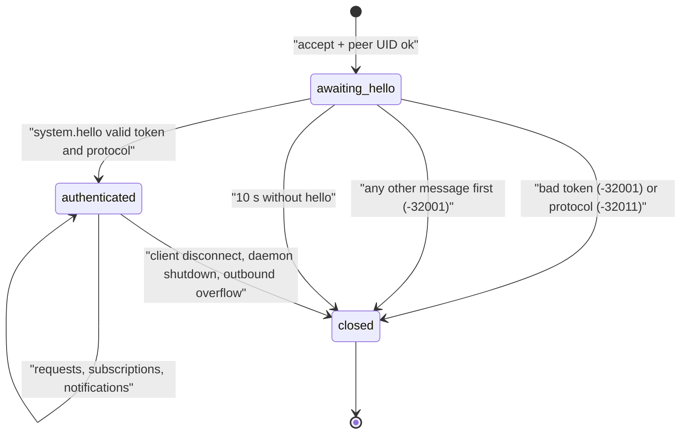
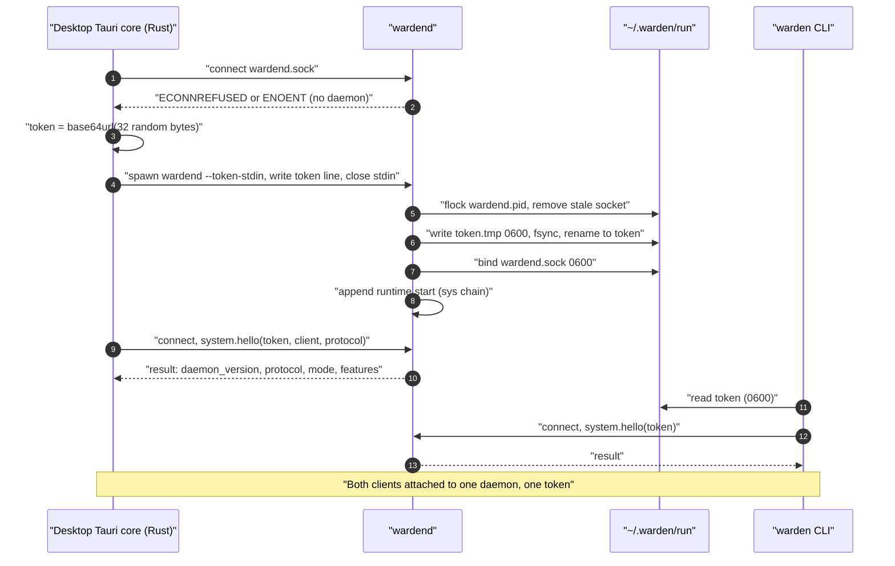
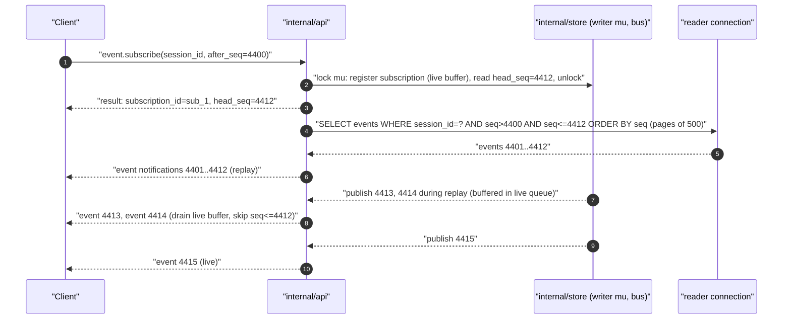

# A05 Runtime API contract

This deliverable is the authoritative contract between `wardend` and its two clients, the `warden` CLI and the desktop app (core §6). It specifies the transport (framing, limits, concurrency, cancellation), the token handshake (CF-14), versioning, errors, subscriptions with backpressure and replay, every method of the PoC with JSON Schema (draft 2020-12) for params and result, the errors it returns, its side effects and emitted events, its confirmation requirement, its CLI equivalent and an example, and finally the client obligations and the parity table that proves BI-6. Method names follow WRD-16 §12 and, where WRD-16 is silent, WRD-02 §4 (CF-12); methods marked NEW come from CF-13. Event payloads, the artifact record and the approval record are defined in A04 and referenced here.

Server package: `internal/api` (JSON-RPC server, schema validation, auth, subscriptions). Schemas are embedded in the daemon under `schemas/runtime-api/` (WRD-02 §4) and used both to validate incoming params and, in CI, to validate recorded responses of the end-to-end tests (A17).

## 1. Conventions

- **Schema ids.** Each method has one schema document `https://schemas.warden.dev/poc/api/<method>.json` with `$defs.params` and `$defs.result`. Shared API types are in `https://schemas.warden.dev/poc/api/types.json` (§7). Identifiers and enumerations come from `https://schemas.warden.dev/poc/common.json` (A04 §6.1); event, artifact and approval shapes from A04.
- **Strict params, open results.** Every `params` schema sets `additionalProperties: false`: an unknown or misspelled parameter is rejected with `-32602`. Result schemas do not forbid additional properties: clients must ignore fields they do not know (§4).
- **Omitted `params`.** For methods whose params schema is `types.json#/$defs/empty`, the request may omit `params` or send `{}`. Positional (array) params are never accepted.
- **Examples** use the canonical demo values of core §12 and abbreviated ids (`apr_9`, `ses_01JAX…`); `→` is client to daemon, `←` daemon to client. Framing headers are omitted in examples.
- **Time** is RFC 3339 UTC with milliseconds; money is USD as a JSON number; sizes are bytes.

## 2. Transport

### 2.1 Endpoint

| Property | Value |
|---|---|
| Socket | Unix domain socket `~/.warden/run/wardend.sock`, mode 0600, parent `~/.warden/run/` mode 0700, both owned by the daemon's effective UID and not symlinks (checked at bind and by `system.doctor`) |
| Other listeners | None. The daemon opens no TCP port and no WebSocket in the PoC (§3.5) |
| Peer check | On `accept`, the daemon reads the peer credentials (`SO_PEERCRED` on Linux, `getpeereid` on macOS). A peer UID different from the daemon's effective UID is disconnected immediately and logged (defense in depth behind the 0600 mode) |
| Single daemon | `~/.warden/run/wardend.pid` is held with `flock(LOCK_EX|LOCK_NB)` for the daemon's lifetime; a second `wardend` exits with code 3 ("already running"). A stale socket file is removed only after the lock is acquired |
| Connections | Up to 16 concurrent connections; the 17th is closed after accept |
| Protocol | JSON-RPC 2.0 (`"jsonrpc": "2.0"` required on every message) |

### 2.2 Framing

LSP-style base protocol (WRD-02 §3, WRD-00 D-31):

```
Content-Length: 97\r\n
\r\n
{"jsonrpc":"2.0","id":7,"method":"workflow.get","params":{"run_id":"wfr_01JAXR9B0C2D3E4F5G6H7J8K9M"}}
```

1. A header section of one or more `Name: value\r\n` lines terminated by an empty line `\r\n`. `Content-Length` (decimal byte count of the body) is required. `Content-Type` is optional; if present it must be `application/vscode-jsonrpc; charset=utf-8` or `application/json; charset=utf-8`. Unknown headers are ignored. The header section is at most 1 KiB.
2. The body is exactly `Content-Length` bytes of UTF-8 JSON (no BOM). Invalid UTF-8 is a parse error.
3. **Maximum message size is 16 MiB** (16,777,216 bytes) in both directions. A header announcing more is answered with `-32600` (`reason: message_too_large`, `id: null`) and the connection is closed, because the stream cannot be resynchronized without reading the body. The daemon never produces a larger message: methods that return bulk data are bounded (`artifact.read` ≤ 4 MiB of raw content per call; `event.query` stops adding events at 12 MiB of response).
4. A malformed header section (missing `Content-Length`, non-numeric value, header section over 1 KiB) closes the connection without a response. A well-framed body that is not valid JSON gets `-32700` with `id: null`; the connection stays open.
5. **Batching is not supported.** A body that is a JSON array gets one `-32600` response (`reason: batch_not_supported`, `id: null`).
6. **Request ids** are strings (1 to 64 characters) or integers (0 to 2^53 − 1), chosen by the client and unique among that connection's in-flight requests. `id: null` in a request is `-32600`. A reused in-flight id is `-32600` (`reason: duplicate_id`).
7. **Client notifications** (messages without `id`): only `$/cancelRequest` is defined; other client notifications are ignored and logged.
8. **Server-initiated messages** are notifications only (`event`, `stream.delta`, `event.gap`). The daemon never sends requests to clients.

### 2.3 Concurrency and ordering

- Each request runs in its own goroutine; responses may arrive in any order. A connection may have at most 64 requests in flight; the 65th is answered immediately with `-32600` (`reason: too_many_requests`).
- Mutating methods on the same session are serialized by a per-session mutex in `internal/session`, so two clients resolving the same approval or gate see a well-defined winner (the second gets `-32003` with the first result, §5).
- All outbound messages of a connection go through one writer goroutine with a bounded queue (§6.5). Ordering guarantees: (a) the response of `event.subscribe` is written before any notification of that subscription; (b) `event` notifications of one subscription are written in strictly increasing `seq` order without gaps or duplicates (except after `event.gap`, which ends the subscription); (c) a `stream.delta` carries `seq_hint`, the highest `seq` published when the delta was produced, so that clients can place it; deltas are best effort and never reordered relative to each other within one `(task_id, kind)`.
- A method returns only after its own events are committed (A04 §10.2), so a client that receives a result and then reads with `event.query` sees those events.

### 2.4 Cancellation of long calls

A client may send `$/cancelRequest {"id": <request id>}` (LSP convention). Cancellable methods stop, release resources and answer with `-32800 request_cancelled`; if the method already finished, the normal response is sent and the cancel is ignored. `$/cancelRequest` never cancels agent work: stopping a task is `session.cancel`.

| Method | Cancellable | Server deadline |
|---|---|---|
| `audit.export`, `audit.verify` | yes | none (bounded by data size) |
| `provider.test` | yes | 30 s |
| `provider.add` (with test) | yes (the test step; the provider stays added) | 45 s |
| `system.doctor` | yes | 30 s |
| `event.query` | yes | 30 s |
| `session.cancel` | no | 10 s (the cancellation itself completes within 5 s, core §13.10) |
| `session.open` | no | 30 s (worktree creation) |
| `workflow.deliver` | no | 60 s for `apply_branch`, `commit`, `export_patch`; `push` returns immediately with `approval_pending` |
| all others | no | 5 s |

A method that exceeds its deadline answers `-32603` (`reason: deadline_exceeded`); any side effects already committed stay committed and are visible as events.

### 2.5 Limits summary

| Limit | Value | On breach |
|---|---|---|
| Message size | 16 MiB | `-32600 message_too_large`, connection closed |
| Header section | 1 KiB | connection closed |
| In-flight requests per connection | 64 | `-32600 too_many_requests` |
| Connections | 16 | closed after accept |
| Subscriptions per connection | 32 | `-32003 subscription_limit` |
| Per-subscription event queue | 1,024 events | `event.gap`, subscription ended (§6.5) |
| Per-subscription delta queue | 256 deltas | oldest deltas dropped, `dropped` counter (§6.2) |
| Connection outbound queue | 32 MiB or a write blocked for 30 s | connection closed |
| `event.query.limit` | 1,000 (default 200); response ≤ 12 MiB | fewer events returned, `has_more: true` |
| `artifact.read.range.length` | 4 MiB (default 1 MiB) | `-32602` |
| Hello deadline | 10 s after accept | connection closed |

## 3. Authentication: the token handshake

### 3.1 Token

- **Generation.** 32 bytes from the OS CSPRNG (`crypto/rand` in Go, `getrandom` in the Tauri Rust core), encoded base64url without padding: 43 characters matching `^[A-Za-z0-9_-]{43}$`.
- **One token per daemon lifetime** (CF-14). The process that starts `wardend` decides the token:
  - Desktop sidecar: the Tauri core generates the token, spawns `wardend --token-stdin` through `tauri-plugin-shell`, writes the token and `\n` to the child's stdin and closes stdin. The daemon reads one line (at most 64 bytes) within 2 s; a missing or malformed token makes it exit with code 2 before binding anything.
  - CLI-started daemon (`warden` finds no daemon): the CLI spawns `wardend --detach`; the daemon generates its own token.
- **Token file.** In both cases the daemon writes the token to `~/.warden/run/token.tmp` (0600), fsyncs, renames it to `~/.warden/run/token`, and only then binds the socket, so any client that can connect can also read the token. The daemon deletes the socket, then the token file, then the pid file at shutdown.
- **Rotation.** A new token on every daemon start; no rotation within a lifetime in the PoC. Clients that reconnect after a restart re-read the file.
- **Handling.** The token is never logged, never written to events or artifacts, never passed in environment variables, and never exposed to the desktop webview (§3.5).

### 3.2 Connection state machine



Every connection starts in `awaiting_hello`. The only acceptable first message is a `system.hello` request; the daemon compares the token with `crypto/subtle.ConstantTimeCompare` against the in-memory token (equal length is guaranteed by the pattern, so the comparison leaks nothing), checks the protocol string, and moves the connection to `authenticated`. Any failure is answered with the error, the response is flushed, and the connection is closed: there are no retries on the same connection, which makes online guessing pointless on top of the 256-bit token. Authentication state, subscriptions and in-flight requests are per connection and vanish when it closes. A second `system.hello` on an authenticated connection is `-32003` (`reason: already_authenticated`) and does not close it.

### 3.3 Identity

The token proves that the client can read `~/.warden/run/token`, i.e. runs as the same OS user (reinforced by the peer UID check). The daemon records human decisions with `approver` / `by` = `local:<os-user>` (the daemon's user); the PoC has a single user (WRD-16 §2.3). `client.name` from `system.hello` is logged for diagnostics only and grants nothing.

### 3.4 Bootstrap and attach



The desktop first tries to attach; only when no daemon answers does it generate a token and spawn the sidecar, handing the token over stdin (WRD-02 §3). The daemon persists the token before it binds the socket, so the CLI can attach at any time by reading the file, and a daemon started by the CLI is attachable by the desktop the same way. If the sidecar exits with code 3 because another daemon won a race, the desktop reads the token file and attaches.

### 3.5 Desktop bridge constraint

The daemon listens only on the Unix socket. The desktop's Tauri Rust core owns the socket connection, performs `system.hello`, and exposes to the React webview a narrow command and event interface (for example `rpc_call(method, params)` and an `rpc_notification` event); the token stays in the Rust process. B08 designs the bridge; this contract requires only that (a) the webview never sees the token, (b) the bridge forwards method names from a fixed allowlist equal to the method list of §8, and (c) the bridge adds nothing to params (confirmation flags are set by UI code after a visible dialog, §9.1). The localhost WebSocket shim mentioned as an option in WRD-16 §5.1 is not used.

### 3.6 Reconnection

On a closed connection a client reconnects with exponential backoff (250 ms, doubling, capped at 5 s, with ±20 % jitter), re-reads the token file before every `system.hello` (the daemon may have restarted with a new token), then restores state: re-subscribe with `after_seq` = the last `seq` it processed per subscription, and refresh pending approvals with `approval.list`. The CLI re-reads the file on every invocation. A `-32001` after a successful earlier session means the token changed: re-read and retry once, then report "runtime restarted; token mismatch" to the user.

## 4. Versioning

- **Protocol string** `warden.poc/<major>`; the PoC daemon speaks exactly `warden.poc/1`. The client sends the protocol it implements in `system.hello`; any other value gets `-32011 protocol_mismatch` with `data.supported: ["warden.poc/1"]`. `system.hello` and its error shape never change across majors, so a mismatched client can always report the problem.
- **Additive changes (no major bump):** new methods; new optional params (announced by a feature flag, because params are strict); new result fields; new notification methods; new event types and payload fields; new values in result or event enumerations; new error `reason` strings.
- **Breaking changes (major bump):** removing or renaming a method, param or result field; changing a type or the meaning of a field; making an optional param required; changing an error code for an existing condition; changing the framing or handshake.
- **Client tolerance (required):** ignore unknown result fields and unknown notification methods; render unknown event types as a generic timeline entry; treat unknown enum values as "other"; never send a param that the daemon has not announced through `features[]` or that is not in the `warden.poc/1` schema.
- **Event envelope** has its own version (`v: 1`, A04). A future `v: 2` envelope is a verifier concern, not a protocol concern.
- **`features[]`** returned by `system.hello` (NEW). Initial values:

| Feature | Meaning |
|---|---|
| `event.gap` | The daemon sends `event.gap` on subscription overflow (§6.3) |
| `stream.delta` | Live deltas are available (`event.subscribe.deltas`) |
| `cancel_request` | `$/cancelRequest` is honored for the methods of §2.4 |
| `idempotency_keys` | `client_request_id` is accepted by `session.request` and `workflow.deliver` |
| `sandbox.l2` | L2 (rootless Docker) is available on this machine |
| `harness.copilot`, `harness.codex`, `harness.claude-code` | The harness adapter is compiled in and its catalog entry exists |
| `mode.shared` | The daemon runs in shared mode (`claude-code` subscription locked, CF-21) |
| `metrics` | `metrics.get` is available |

## 5. Errors

JSON-RPC error objects: `{"code": <int>, "message": "<English sentence>", "data": <errorData>}`. `data.code` always carries the string name; `data.reason` refines it (snake_case, NEW strings listed per method); `data.detail` is a redacted human detail; `data.errors[]` lists schema errors for `-32602`; `data.incident_id` links `-32603` to the daemon log. Clients branch on `code` and `data.reason`, never on `message`.

| Code | `data.code` | Meaning | Typical `data.reason` values |
|---|---|---|---|
| -32700 | `parse_error` | Body is not valid JSON or not UTF-8 | |
| -32600 | `invalid_request` | Not a valid JSON-RPC request | `message_too_large`, `batch_not_supported`, `duplicate_id`, `too_many_requests` |
| -32601 | `method_not_found` | Unknown method (also a method not in the bridge allowlist) | |
| -32602 | `invalid_params` | Params fail the schema or a semantic check | `schema`, `not_absolute`, `not_a_git_repository`, `tier_mismatch`, `tls_required`, `secret_required`, `edit_not_allowed`, `plan_invalid`, `path_not_allowed`, `file_exists`, `bad_branch_name`, `file_not_applicable`, `unknown_tool`, `answer_required`, `answer_not_allowed`, `side_requires_file` |
| -32603 | `internal_error` | Bug or deadline | `deadline_exceeded` |
| -32800 | `request_cancelled` | Cancelled by `$/cancelRequest` | |
| -32001 | `unauthorized` | No or bad `system.hello` | `hello_required`, `bad_token` |
| -32002 | `not_found` | Unknown id or path | |
| -32003 | `invalid_state` | Action not valid now | `already_authenticated`, `active_run`, `session_closed`, `classification_mismatch`, `gate_resolved`, `gate_not_open`, `approval_resolved`, `use_resolve_gate`, `not_revocable`, `run_not_deliverable`, `branch_exists`, `not_published`, `remote_not_allowed`, `delivery_pending`, `not_resumable`, `provider_exists`, `provider_in_use`, `harness_not_installed`, `harness_not_logged_in`, `subscription_limit` |
| -32004 | `policy_denied` | Refused by policy | `scope_not_allowed`, `above_max`, `denied` (with `rule_ids`) |
| -32005 | `confirmation_required` | Privileged method without `confirm: true` or terms acknowledgment | `confirm`, `terms_ack_required` |
| -32006 | `sandbox_unavailable` | A blocking doctor check fails | `checks` lists failing check ids |
| -32007 | `no_admissible_model` | Router has no candidate | `pin_not_admissible`, `no_candidate` (with `candidates[]` reasons) |
| -32008 | `budget_exhausted` | Budget reached | `session`, `daily` |
| -32009 | `store_unavailable` | Event store degraded; runtime fails closed (A04 §10.4) | |
| -32010 | `unsupported_in_poc` | Outside PoC scope | `restricted`, `auth_mode`, `protocol` |
| -32011 | `protocol_mismatch` | Unsupported protocol version | |
| -32012 | `vendor_terms` | Harness terms forbid it | `prohibited`, `shared_mode_lock` |

`-32003` responses caused by a concurrent winner carry the winning state in `data` (for example `data.decision` and `data.scope` for `approval_resolved`), so that a client can reconcile without another call.

## 6. Subscriptions, notifications, backpressure and replay

### 6.1 `event` notification

Sent for every persisted event matching an active subscription. `params` is the full A04 envelope plus `subscription_id`. Clients may verify `hash` locally; the envelope is exactly what the chain stores (a spilled payload arrives as `{ "$blob", "size" }`, fetchable with `event.query {resolve_blobs: true}`).

```json
{
  "$schema": "https://json-schema.org/draft/2020-12/schema",
  "$id": "https://schemas.warden.dev/poc/api/notification.event.json",
  "$defs": {
    "params": {
      "type": "object",
      "description": "All members other than subscription_id form one A04 envelope; validate them against ../events/envelope.json after removing subscription_id.",
      "required": ["subscription_id", "v", "seq", "id", "ts", "type", "chain", "payload", "prev_hash", "hash"],
      "properties": { "subscription_id": { "$ref": "../common.json#/$defs/subscriptionId" } }
    }
  }
}
```

The envelope schema forbids additional properties, so a validator removes `subscription_id` and checks the rest against `events/envelope.json`.

### 6.2 `stream.delta` notification (never persisted, never hashed)

Live output for the timeline (WRD-05 §11 `model.call.delta`, core §5). Deltas are coalesced per `(task_id, kind)` to at most one notification every 50 ms, each `data` text at most 64 KiB, and pass through the streaming redactor of A15 before they leave the daemon (line-buffered up to 4 KiB, so a secret split across chunks is still caught; BI-3). They are lossy by design: the authoritative content arrives as events and artifacts.

```json
{
  "$schema": "https://json-schema.org/draft/2020-12/schema",
  "$id": "https://schemas.warden.dev/poc/api/notification.stream.delta.json",
  "$defs": {
    "params": {
      "type": "object",
      "required": ["subscription_id", "session_id", "task_id", "kind", "seq_hint", "data"],
      "properties": {
        "subscription_id": { "$ref": "../common.json#/$defs/subscriptionId" },
        "session_id":      { "$ref": "../common.json#/$defs/sessionId" },
        "task_id":         { "$ref": "../common.json#/$defs/taskId" },
        "execution_id":    { "$ref": "../common.json#/$defs/executionId" },
        "kind":            { "enum": ["model_text", "model_tool_args", "tool_output"] },
        "seq_hint":        { "type": "integer", "minimum": 0 },
        "dropped":         { "type": "integer", "minimum": 0, "description": "NEW: deltas of this (task, kind) dropped since the previous delivered delta" },
        "data": { "oneOf": [
          { "type": "object", "required": ["model_call_id", "text"], "additionalProperties": false,
            "properties": { "model_call_id": { "$ref": "../common.json#/$defs/modelCallId" }, "text": { "type": "string" } } },
          { "type": "object", "required": ["model_call_id", "index", "tool", "partial_json"], "additionalProperties": false,
            "properties": { "model_call_id": { "$ref": "../common.json#/$defs/modelCallId" }, "index": { "type": "integer", "minimum": 0 },
                            "tool": { "type": "string", "pattern": "^[a-zA-Z0-9_-]{1,64}$" }, "partial_json": { "type": "string" } } },
          { "type": "object", "required": ["call_id", "stream", "text", "offset"], "additionalProperties": false,
            "properties": { "call_id": { "$ref": "../common.json#/$defs/callId" }, "stream": { "enum": ["stdout", "stderr"] },
                            "text": { "type": "string" }, "offset": { "type": "integer", "minimum": 0 } } }
        ] }
      },
      "allOf": [
        { "if": { "properties": { "kind": { "const": "model_text" } } },
          "then": { "properties": { "data": { "required": ["model_call_id", "text"], "not": { "required": ["index"] } } } } },
        { "if": { "properties": { "kind": { "const": "model_tool_args" } } },
          "then": { "properties": { "data": { "required": ["model_call_id", "index", "tool", "partial_json"] } } } },
        { "if": { "properties": { "kind": { "const": "tool_output" } } },
          "then": { "properties": { "data": { "required": ["call_id", "stream", "text", "offset"] } } } }
      ]
    }
  }
}
```

`model_tool_args.tool` is the provider-safe name (`fs__write`, core §8); the UI maps it back through the fixed table. `tool_output.offset` is the byte offset of `text` in that call's redacted output stream, so the UI can detect holes after drops; the complete redacted output of a finished call is read with `artifact.read {id: "<call_id>"}` (§8.6), which serves the blob named by `tool.exec.end.output_ref`.

### 6.3 `event.gap` notification (NEW)

Sent once when a subscription's event queue overflows (§6.5); the subscription is then closed by the daemon.

```json
{
  "$schema": "https://json-schema.org/draft/2020-12/schema",
  "$id": "https://schemas.warden.dev/poc/api/notification.event.gap.json",
  "$defs": {
    "params": {
      "type": "object",
      "required": ["subscription_id", "last_seq", "reason"],
      "additionalProperties": false,
      "properties": {
        "subscription_id": { "$ref": "../common.json#/$defs/subscriptionId" },
        "last_seq": { "type": "integer", "minimum": 0, "description": "seq of the last event delivered on this subscription (or its after_seq if none)" },
        "reason":   { "enum": ["overflow"] }
      }
    }
  }
}
```

Client procedure after `event.gap`: page with `event.query {session_id, after_seq: last_seq}` until `has_more` is false, then `event.subscribe {session_id, after_seq: <last seq processed>}`. Because both use `seq`, no event is lost or duplicated if the client deduplicates by `seq` (it must).

### 6.4 Replay and live handoff



The cut between history and live is exact because registration and the reading of `head_seq` happen under the store writer's mutex, which is also held while an event is committed and published (A04 §10.2). Every event with `seq ≤ head_seq` is replayed from SQLite; every event with `seq > head_seq` arrives through the live buffer; the api layer drops any buffered event with `seq ≤ head_seq` as a safety net. Without `after_seq` the subscription is live-only. Replay and live delivery share the subscription's bounded queue, so a very long replay to a slow client ends in `event.gap` rather than unbounded memory.

### 6.5 Backpressure

| Queue | Bound | Policy on overflow |
|---|---|---|
| Subscription event queue (events not yet handed to the connection writer) | 1,024 events | Send `event.gap {last_seq, reason: overflow}`, close the subscription. Events are never silently dropped |
| Subscription delta queue | 256 deltas | Drop the oldest deltas; the next delivered delta for that `(task_id, kind)` carries `dropped: n` |
| Connection outbound queue | 32 MiB, or a single socket write blocked for 30 s | Close the connection; the client reconnects and replays (§3.6) |

The store never blocks on subscribers: `bus.Publish` only enqueues (non-blocking) into each subscription's queue, so a slow client cannot slow down event appends, tool execution or policy decisions.

### 6.6 Filters

`event.subscribe.types` and `event.query.types` accept exact types (`approval.requested`) and family wildcards of the form `<family>.*` (`policy.*`, `workflow.gate.*`); at most 32 entries. A subscription on `"*"` receives events of every session chain and of the `sys` chain. `chain.checkpoint` events are delivered like others.

## 7. Shared API types (`api/types.json`)

```json
{
  "$schema": "https://json-schema.org/draft/2020-12/schema",
  "$id": "https://schemas.warden.dev/poc/api/types.json",
  "title": "Warden runtime API shared types (protocol warden.poc/1)",
  "$defs": {
    "empty": { "type": "object", "maxProperties": 0 },
    "errorData": { "type": "object", "required": ["code"],
      "properties": {
        "code": { "enum": ["parse_error", "invalid_request", "method_not_found", "invalid_params", "internal_error", "request_cancelled",
                           "unauthorized", "not_found", "invalid_state", "policy_denied", "confirmation_required", "sandbox_unavailable",
                           "no_admissible_model", "budget_exhausted", "store_unavailable", "unsupported_in_poc", "protocol_mismatch", "vendor_terms"] },
        "reason": { "type": "string", "pattern": "^[a-z_]+$" },
        "detail": { "type": "string", "maxLength": 1000 },
        "errors": { "type": "array", "items": { "type": "object", "required": ["instance_path", "message"],
          "properties": { "instance_path": { "type": "string" }, "message": { "type": "string" } } } },
        "incident_id": { "type": "string" } } },
    "capabilitiesSummary": { "$ref": "../events/payloads.json#/$defs/capabilitiesSummary" },
    "approval":       { "$ref": "../approval.json" },
    "artifactRecord": { "$ref": "../artifacts/record.json" },
    "event":          { "$ref": "../events/envelope.json" },
    "quota":          { "$ref": "../events/payloads.json#/$defs/quota" },
    "nullableTimestamp": { "anyOf": [ { "$ref": "../common.json#/$defs/timestamp" }, { "type": "null" } ] },
    "confirmTrue": { "const": true },

    "artifactSummary": { "type": "object",
      "required": ["artifact_id", "type", "version", "partial", "summary", "size_bytes", "media_type", "task_id", "task_key", "supersedes", "superseded_by", "created_at", "created_by"],
      "properties": {
        "artifact_id": { "$ref": "../common.json#/$defs/artifactId" }, "type": { "$ref": "../common.json#/$defs/artifactType" },
        "version": { "type": "integer", "minimum": 1 }, "partial": { "type": "boolean" }, "summary": { "type": "string" },
        "size_bytes": { "type": "integer", "minimum": 0 }, "media_type": { "enum": ["application/json", "text/x-diff"] },
        "task_id": { "anyOf": [ { "$ref": "../common.json#/$defs/taskId" }, { "type": "null" } ] },
        "task_key": { "anyOf": [ { "$ref": "../common.json#/$defs/taskKey" }, { "type": "null" } ] },
        "supersedes": { "anyOf": [ { "$ref": "../common.json#/$defs/artifactId" }, { "type": "null" } ] },
        "superseded_by": { "anyOf": [ { "$ref": "../common.json#/$defs/artifactId" }, { "type": "null" } ] },
        "created_at": { "$ref": "../common.json#/$defs/timestamp" }, "created_by": { "enum": ["agent", "runtime", "user"] } } },

    "execution": { "type": "object",
      "required": ["execution_id", "attempt", "status", "model_id", "provider_id", "tier", "routing_id", "harness_id", "sandbox_id", "sandbox_level", "started_at", "ended_at", "steps", "tool_calls"],
      "properties": {
        "execution_id": { "$ref": "../common.json#/$defs/executionId" }, "attempt": { "type": "integer", "minimum": 1 },
        "status": { "enum": ["running", "succeeded", "failed", "cancelled", "timed_out"] },
        "model_id": { "anyOf": [ { "$ref": "../common.json#/$defs/modelId" }, { "type": "null" } ] },
        "provider_id": { "anyOf": [ { "$ref": "../common.json#/$defs/catalogId" }, { "type": "null" } ] },
        "tier": { "anyOf": [ { "$ref": "../common.json#/$defs/tier" }, { "type": "null" } ] },
        "routing_id": { "anyOf": [ { "$ref": "../common.json#/$defs/routingId" }, { "type": "null" } ] },
        "harness_id": { "anyOf": [ { "$ref": "../common.json#/$defs/catalogId" }, { "type": "null" } ] },
        "sandbox_id": { "anyOf": [ { "$ref": "../common.json#/$defs/sandboxId" }, { "type": "null" } ] },
        "sandbox_level": { "$ref": "../common.json#/$defs/sandboxLevel" },
        "started_at": { "$ref": "../common.json#/$defs/timestamp" }, "ended_at": { "$ref": "#/$defs/nullableTimestamp" },
        "steps": { "type": "integer", "minimum": 0 }, "tool_calls": { "type": "integer", "minimum": 0 } } },

    "cost": { "type": "object",
      "required": ["usd", "usd_note", "input_tokens", "output_tokens", "cached_input_tokens", "quota", "model_calls"],
      "properties": {
        "usd": { "type": "number", "minimum": 0 },
        "usd_note": { "type": ["string", "null"], "description": "e.g. 'infrastructure cost not tracked' when T0/T1 calls contributed 0.00" },
        "input_tokens": { "type": "integer", "minimum": 0 }, "output_tokens": { "type": "integer", "minimum": 0 },
        "cached_input_tokens": { "type": "integer", "minimum": 0 },
        "quota": { "type": "array", "items": { "$ref": "#/$defs/quota" } },
        "model_calls": { "type": "integer", "minimum": 0 },
        "by_task": { "type": "array", "items": { "type": "object", "required": ["task_key", "usd", "input_tokens", "output_tokens", "quota"],
          "properties": { "task_key": { "$ref": "../common.json#/$defs/taskKey" }, "usd": { "type": "number" },
                          "input_tokens": { "type": "integer" }, "output_tokens": { "type": "integer" },
                          "quota": { "type": "array", "items": { "$ref": "#/$defs/quota" } } } } } } },

    "budget": { "type": "object",
      "required": ["session_usd", "session_spent_usd", "daily_usd", "daily_spent_usd"],
      "description": "ID-13 fields first; remaining_usd, session_usd_max and exhausted are NEW additions",
      "properties": {
        "session_usd": { "type": "number" }, "session_spent_usd": { "type": "number" }, "remaining_usd": { "type": "number" },
        "session_usd_max": { "type": "number" }, "daily_usd": { "type": "number" }, "daily_spent_usd": { "type": "number" },
        "exhausted": { "enum": [null, "session", "daily"] } } },

    "task": { "type": "object",
      "required": ["task_id", "task_key", "kind", "agent", "mode", "task_class", "state", "reason", "attempts", "max_attempts",
                   "created_at", "updated_at", "wall_clock_used_ms", "limits", "execution", "pending_approvals"],
      "properties": {
        "task_id": { "$ref": "../common.json#/$defs/taskId" }, "task_key": { "$ref": "../common.json#/$defs/taskKey" },
        "kind": { "enum": ["agent", "approval_gate"] },
        "agent": { "enum": ["coder", "verifier", null] },
        "mode": { "anyOf": [ { "$ref": "../common.json#/$defs/coderMode" }, { "type": "null" } ] },
        "task_class": { "anyOf": [ { "$ref": "../common.json#/$defs/taskClass" }, { "type": "null" } ] },
        "state": { "$ref": "../common.json#/$defs/taskState" },
        "reason": { "anyOf": [ { "$ref": "../common.json#/$defs/taskReason" }, { "type": "null" } ] },
        "attempts": { "type": "integer", "minimum": 0 }, "max_attempts": { "type": "integer", "minimum": 1 },
        "created_at": { "$ref": "../common.json#/$defs/timestamp" }, "updated_at": { "$ref": "../common.json#/$defs/timestamp" },
        "wall_clock_used_ms": { "type": "integer", "minimum": 0 },
        "limits": { "anyOf": [ { "type": "null" }, { "$ref": "#/$defs/limits" } ], "description": "ID-13: effective limits (manifest, lowered by policy; INV-9); null for gates" },
        "execution": { "anyOf": [ { "$ref": "#/$defs/execution" }, { "type": "null" } ] },
        "pending_approvals": { "type": "array", "items": { "$ref": "../common.json#/$defs/approvalId" } },
        "cost": { "$ref": "#/$defs/cost" } } },

    "gate": { "type": "object",
      "required": ["gate_id", "gate_key", "approval_id", "state", "artifacts", "presented_at", "expires_at", "resolved_at", "decision", "approver", "edited_artifact", "comment"],
      "properties": {
        "gate_id": { "$ref": "../common.json#/$defs/taskId" }, "gate_key": { "$ref": "../common.json#/$defs/gateKey" },
        "approval_id": { "anyOf": [ { "$ref": "../common.json#/$defs/approvalId" }, { "type": "null" } ] },
        "state": { "enum": ["not_reached", "pending", "approved", "rejected", "expired", "cancelled"] },
        "artifacts": { "type": "array", "items": { "$ref": "../common.json#/$defs/artifactId" } },
        "presented_at": { "$ref": "#/$defs/nullableTimestamp" }, "expires_at": { "$ref": "#/$defs/nullableTimestamp" },
        "resolved_at": { "$ref": "#/$defs/nullableTimestamp" },
        "decision": { "anyOf": [ { "$ref": "../common.json#/$defs/gateDecision" }, { "type": "null" } ] },
        "approver": { "anyOf": [ { "$ref": "../common.json#/$defs/localUser" }, { "type": "null" } ] },
        "edited_artifact": { "anyOf": [ { "$ref": "../common.json#/$defs/artifactId" }, { "type": "null" } ] },
        "comment": { "type": ["string", "null"] } } },

    "limits": { "type": "object", "required": ["max_steps", "max_tokens", "timeout_seconds", "max_cost_usd"],
      "properties": { "max_steps": { "type": "integer", "minimum": 1 }, "max_tokens": { "type": "integer", "minimum": 1 },
                      "timeout_seconds": { "type": "integer", "minimum": 1 }, "max_cost_usd": { "type": "number", "minimum": 0 },
                      "max_tool_calls": { "type": "integer", "minimum": 1 } } },

    "repository": { "type": "object", "required": ["root", "remotes"],
      "properties": { "root": { "type": "string" }, "current_branch": { "type": ["string", "null"] },
                      "remotes": { "type": "array", "items": { "type": "object", "required": ["name", "url", "push_allowed"],
                        "properties": { "name": { "type": "string" }, "url": { "type": "string", "description": "userinfo removed (A14 §8.3)" },
                                        "push_allowed": { "type": "boolean", "description": "https or ssh remote (A14 §8.3)" } } } } } },

    "delivery": { "type": "object",
      "required": ["action", "status", "approval_id", "call_id", "branch", "remote", "commit", "patch_path", "error", "created_at", "finished_at"],
      "properties": {
        "action": { "$ref": "../common.json#/$defs/deliveryAction" },
        "status": { "enum": ["approval_pending", "running", "done", "failed", "rejected"] },
        "approval_id": { "anyOf": [ { "$ref": "../common.json#/$defs/approvalId" }, { "type": "null" } ] },
        "call_id": { "$ref": "../common.json#/$defs/callId" },
        "branch": { "type": ["string", "null"] }, "remote": { "type": ["string", "null"] },
        "commit": { "anyOf": [ { "$ref": "../common.json#/$defs/gitCommit" }, { "type": "null" } ] },
        "patch_path": { "type": ["string", "null"] }, "error": { "type": ["string", "null"] },
        "created_at": { "$ref": "../common.json#/$defs/timestamp" }, "finished_at": { "$ref": "#/$defs/nullableTimestamp" } } },

    "resumedFrom": { "anyOf": [ { "type": "null" }, { "type": "object", "required": ["run_id", "gate_key"],
      "properties": { "run_id": { "$ref": "../common.json#/$defs/runId" }, "gate_key": { "$ref": "../common.json#/$defs/gateKey" } } } ] },

    "runSummary": { "type": "object", "required": ["run_id", "kind", "status", "reason", "request_excerpt", "created_at", "ended_at"],
      "properties": {
        "run_id": { "$ref": "../common.json#/$defs/runId" }, "kind": { "enum": ["change", "readonly"] },
        "status": { "$ref": "../common.json#/$defs/runStatus" },
        "reason": { "anyOf": [ { "$ref": "../common.json#/$defs/taskReason" }, { "type": "null" } ] },
        "request_excerpt": { "type": "string", "maxLength": 120 },
        "created_at": { "$ref": "../common.json#/$defs/timestamp" }, "ended_at": { "$ref": "#/$defs/nullableTimestamp" } } },

    "run": { "type": "object",
      "required": ["run_id", "session_id", "template", "template_version", "kind", "status", "reason", "request_excerpt", "pin_model",
                   "interactive", "created_at", "ended_at", "resumed_from", "final_result", "tasks", "gates", "artifacts", "deliveries",
                   "cost", "budget", "repository", "last_seq"],
      "properties": {
        "run_id": { "$ref": "../common.json#/$defs/runId" }, "session_id": { "$ref": "../common.json#/$defs/sessionId" },
        "template": { "enum": ["poc-coding", "poc-readonly"] }, "template_version": { "type": "string" },
        "kind": { "enum": ["change", "readonly"] }, "status": { "$ref": "../common.json#/$defs/runStatus" },
        "reason": { "anyOf": [ { "$ref": "../common.json#/$defs/taskReason" }, { "type": "null" } ] },
        "request_excerpt": { "type": "string", "maxLength": 120 },
        "pin_model": { "anyOf": [ { "$ref": "../common.json#/$defs/modelId" }, { "type": "null" } ] },
        "interactive": { "type": "boolean" },
        "created_at": { "$ref": "../common.json#/$defs/timestamp" }, "ended_at": { "$ref": "#/$defs/nullableTimestamp" },
        "resumed_from": { "$ref": "#/$defs/resumedFrom" },
        "final_result": { "anyOf": [ { "$ref": "../common.json#/$defs/artifactId" }, { "type": "null" } ] },
        "tasks": { "type": "array", "items": { "$ref": "#/$defs/task" } },
        "gates": { "type": "array", "items": { "$ref": "#/$defs/gate" } },
        "artifacts": { "type": "array", "items": { "$ref": "#/$defs/artifactSummary" } },
        "deliveries": { "type": "array", "items": { "$ref": "#/$defs/delivery" } },
        "cost": { "$ref": "#/$defs/cost" }, "budget": { "$ref": "#/$defs/budget" },
        "repository": { "$ref": "#/$defs/repository", "description": "ID-13: repository.remotes[] feeds the Push target selector" },
        "last_seq": { "type": "integer", "minimum": 0, "description": "highest seq reflected in this projection" } } },

    "modelCapabilities": { "type": "object", "required": ["tool_calling", "structured_output", "streaming", "max_context"],
      "properties": { "tool_calling": { "enum": ["native", "emulated", "none"] }, "structured_output": { "type": "boolean" },
                      "streaming": { "type": "boolean" }, "max_context": { "type": "integer", "minimum": 1 },
                      "max_output": { "type": "integer", "minimum": 1 } } },
    "pricing": { "anyOf": [ { "type": "null" }, { "type": "object", "required": ["input_per_mtok", "output_per_mtok", "currency"],
      "properties": { "input_per_mtok": { "type": "number", "minimum": 0 }, "output_per_mtok": { "type": "number", "minimum": 0 },
                      "cached_input_per_mtok": { "type": "number", "minimum": 0 }, "currency": { "const": "USD" } } } ] },
    "qualityPrior": { "type": "object", "required": ["plan", "implement", "verify", "summarize"],
      "properties": { "plan": { "type": "number", "minimum": 0, "maximum": 1 }, "implement": { "type": "number", "minimum": 0, "maximum": 1 },
                      "verify": { "type": "number", "minimum": 0, "maximum": 1 }, "summarize": { "type": "number", "minimum": 0, "maximum": 1 } } },

    "modelEntry": { "type": "object", "required": ["id", "provider", "model", "capabilities", "pricing", "quality_prior"],
      "additionalProperties": false,
      "properties": { "id": { "$ref": "../common.json#/$defs/modelId" }, "provider": { "$ref": "../common.json#/$defs/catalogId" },
                      "model": { "type": "string", "minLength": 1, "maxLength": 200 },
                      "capabilities": { "$ref": "#/$defs/modelCapabilities" }, "pricing": { "$ref": "#/$defs/pricing" },
                      "quality_prior": { "$ref": "#/$defs/qualityPrior" } } },

    "providerSpec": { "type": "object", "required": ["id", "protocol", "base_url", "auth", "tier"], "additionalProperties": false,
      "description": "models.yaml providers[] entry (WRD-16 §6.1)",
      "properties": {
        "id": { "$ref": "../common.json#/$defs/catalogId" }, "protocol": { "$ref": "../common.json#/$defs/protocol" },
        "base_url": { "type": "string", "pattern": "^https?://[^\\s]+$", "maxLength": 2048 },
        "auth": { "type": "object", "required": ["mode"], "additionalProperties": false,
          "properties": { "mode": { "enum": ["none", "api_key", "gateway", "cloud_iam"] }, "kind": { "enum": ["bearer", "mtls"] },
                          "header": { "const": "api-key" }, "secret": { "$ref": "../common.json#/$defs/secretRef" },
                          "cert": { "$ref": "../common.json#/$defs/secretRef" } } },
        "tier": { "enum": ["T0", "T1", "T2", "T3"] },
        "data_agreement": { "type": "object", "description": "parsed and stored, ignored by admission (CF-04)" },
        "models": { "type": "array", "items": { "$ref": "#/$defs/modelEntry" }, "maxItems": 50 } } },

    "harnessSpec": { "type": "object", "required": ["id", "kind", "billing", "vendor_terms", "tier"], "additionalProperties": false,
      "description": "models.yaml harnesses[] entry (WRD-16 §6.1)",
      "properties": {
        "id": { "$ref": "../common.json#/$defs/catalogId" }, "kind": { "$ref": "../common.json#/$defs/harnessKind" },
        "billing": { "enum": ["subscription", "chatgpt_login", "api_key", "subscription_personal"] },
        "vendor_terms": { "$ref": "../common.json#/$defs/vendorTerms" }, "tier": { "const": "T4" },
        "enabled": { "type": "boolean" } } },

    "lastTest": { "anyOf": [ { "type": "null" }, { "type": "object", "required": ["at", "ok", "latency_ms", "error_code"],
      "properties": { "at": { "$ref": "../common.json#/$defs/timestamp" }, "ok": { "type": "boolean" },
                      "latency_ms": { "type": ["integer", "null"] }, "error_code": { "type": ["string", "null"] } } } ] },

    "providerView": { "type": "object",
      "required": ["provider_id", "protocol", "base_url", "tier", "auth_mode", "auth_kind", "auth_header", "secret_ref", "secret_present",
                   "enabled", "status", "models", "last_test"],
      "properties": {
        "provider_id": { "$ref": "../common.json#/$defs/catalogId" }, "protocol": { "$ref": "../common.json#/$defs/protocol" },
        "base_url": { "type": "string" }, "tier": { "$ref": "../common.json#/$defs/tier" },
        "auth_mode": { "$ref": "../common.json#/$defs/authMode" },
        "auth_kind": { "enum": ["bearer", "mtls", null] }, "auth_header": { "enum": ["api-key", null] },
        "secret_ref": { "anyOf": [ { "$ref": "../common.json#/$defs/secretRef" }, { "type": "null" } ] },
        "secret_present": { "type": "boolean" }, "enabled": { "type": "boolean" },
        "status": { "enum": ["ok", "untested", "failing", "disabled", "credential_missing"] },
        "models": { "type": "array", "items": { "$ref": "../common.json#/$defs/modelId" } },
        "last_test": { "$ref": "#/$defs/lastTest" } } },

    "harnessView": { "type": "object",
      "required": ["harness_id", "kind", "tier", "billing", "billing_mode", "vendor_terms", "enabled", "run_mode", "status", "locked_reason", "last_test"],
      "properties": {
        "harness_id": { "$ref": "../common.json#/$defs/catalogId" }, "kind": { "$ref": "../common.json#/$defs/harnessKind" },
        "tier": { "const": "T4" }, "billing": { "type": "string" }, "billing_mode": { "$ref": "../common.json#/$defs/billingMode" },
        "vendor_terms": { "$ref": "../common.json#/$defs/vendorTerms" }, "enabled": { "type": "boolean" },
        "run_mode": { "$ref": "../common.json#/$defs/harnessRunMode" },
        "status": { "enum": ["ok", "untested", "failing", "disabled", "not_installed", "not_logged_in", "locked"] },
        "locked_reason": { "enum": ["harness_locked_shared_mode", "prohibited", null] },
        "last_test": { "$ref": "#/$defs/lastTest" } } },

    "providerTest": { "type": "object", "required": ["ok", "latency_ms", "models", "error"],
      "properties": {
        "ok": { "type": "boolean" }, "latency_ms": { "type": ["integer", "null"], "minimum": 0 },
        "models": { "type": "array", "items": { "type": "object", "required": ["model_id", "tool_calling", "structured_output", "streaming", "max_context"],
          "properties": { "model_id": { "$ref": "../common.json#/$defs/modelId" }, "tool_calling": { "enum": ["native", "emulated", "none"] },
                          "structured_output": { "type": "boolean" }, "streaming": { "type": "boolean" },
                          "max_context": { "type": ["integer", "null"] } } } },
        "error": { "anyOf": [ { "type": "null" }, { "type": "object", "required": ["code", "message"],
          "properties": { "code": { "$ref": "../common.json#/$defs/modelErrorCode" }, "message": { "type": "string", "maxLength": 500 } } } ] } } },

    "modelView": { "type": "object",
      "required": ["model_id", "provider_id", "kind", "tier", "admissible", "reason_code", "reason", "capabilities", "pricing", "quality_prior", "pinned"],
      "properties": {
        "model_id": { "$ref": "../common.json#/$defs/modelId" }, "provider_id": { "$ref": "../common.json#/$defs/catalogId" },
        "kind": { "enum": ["model", "harness"] }, "tier": { "$ref": "../common.json#/$defs/tier" },
        "admissible": { "type": ["boolean", "null"], "description": "null when no classification context was given" },
        "reason_code": { "anyOf": [ { "$ref": "../common.json#/$defs/rejectionCode" }, { "type": "null" } ] },
        "reason": { "type": ["string", "null"], "maxLength": 300 },
        "capabilities": { "anyOf": [ { "$ref": "#/$defs/modelCapabilities" }, { "type": "null" } ] },
        "pricing": { "$ref": "#/$defs/pricing" },
        "quality_prior": { "anyOf": [ { "$ref": "#/$defs/qualityPrior" }, { "type": "null" } ] },
        "pinned": { "type": "boolean" } } },

    "doctorCheck": { "type": "object", "required": ["id", "group", "status", "title", "detail", "fix_hint", "blocking"],
      "properties": {
        "id": { "type": "string", "pattern": "^[a-z0-9]+(\\.[a-z0-9_-]+)*$" },
        "group": { "enum": ["sandbox", "keychain", "store", "disk", "providers", "policy", "git", "toolchain"] },
        "status": { "enum": ["ok", "warn", "fail"] }, "title": { "type": "string", "maxLength": 120 },
        "detail": { "type": "string", "maxLength": 1000 }, "fix_hint": { "type": ["string", "null"], "maxLength": 1000 },
        "blocking": { "type": "boolean" }, "data": { "type": "object" } } },

    "violation": { "type": "object", "required": ["seq", "kind", "severity", "detail"],
      "properties": {
        "seq": { "type": ["integer", "null"] },
        "kind": { "enum": ["hash_mismatch", "prev_hash_mismatch", "seq_not_increasing", "chain_mismatch", "unknown_event_type", "payload_invalid",
                           "projection_mismatch", "blob_missing", "blob_mismatch", "artifact_record_mismatch", "checkpoint_mismatch",
                           "checkpoint_signature_invalid", "checkpoint_unsigned", "unknown_key", "anchor_missing", "anchor_mismatch",
                           "missing_decision", "decision_not_allow", "missing_approval", "approval_scope_mismatch", "orphan_exec_end", "external_grant"] },
        "severity": { "enum": ["error", "warning"] }, "detail": { "type": "string", "maxLength": 1000 } } },

    "actionResource": { "type": "object", "additionalProperties": false, "minProperties": 1,
      "properties": {
        "path": { "type": "string", "maxLength": 4096 }, "rel_path": { "$ref": "../common.json#/$defs/relPath" },
        "argv": { "type": "array", "items": { "type": "string" }, "minItems": 1, "maxItems": 64 },
        "host": { "type": "string", "maxLength": 253 }, "port": { "type": "integer", "minimum": 1, "maximum": 65535 },
        "branch": { "type": "string", "maxLength": 255 }, "remote": { "type": "string", "maxLength": 255 },
        "harness_id": { "$ref": "../common.json#/$defs/catalogId" } } },

    "decisionPreview": { "type": "object",
      "required": ["effect", "reason", "risk_class", "matched_rules", "obligations", "approval", "grant", "layers", "normalized", "context"],
      "properties": {
        "effect": { "$ref": "../common.json#/$defs/effect" }, "reason": { "type": "string" },
        "risk_class": { "$ref": "../common.json#/$defs/riskClass" },
        "matched_rules": { "type": "array", "items": { "$ref": "../common.json#/$defs/ruleId" } },
        "obligations": { "$ref": "../events/payloads.json#/$defs/obligations" },
        "approval": { "anyOf": [ { "type": "null" }, { "type": "object", "required": ["scope_max", "scopes_allowed"],
          "properties": { "scope_max": { "$ref": "../common.json#/$defs/approvalScope" },
                          "scopes_allowed": { "type": "array", "items": { "$ref": "../common.json#/$defs/approvalScope" } } } } ] },
        "grant": { "anyOf": [ { "$ref": "../common.json#/$defs/approvalId" }, { "type": "null" } ] },
        "layers": { "type": "array", "items": { "type": "object", "required": ["layer", "rule_id", "effect", "matched", "reason"],
          "properties": { "layer": { "enum": ["invariant", "capability", "platform", "user", "grant"] },
                          "rule_id": { "$ref": "../common.json#/$defs/ruleId" },
                          "effect": { "anyOf": [ { "$ref": "../common.json#/$defs/effect" }, { "type": "null" } ] },
                          "matched": { "type": "boolean" }, "reason": { "type": ["string", "null"] } } } },
        "normalized": { "type": "object", "required": ["tool", "operation", "resource"],
          "properties": { "tool": { "$ref": "../common.json#/$defs/policyTool" }, "operation": { "type": "string" }, "resource": { "type": "object" } } },
        "context": { "type": "object", "required": ["session_id", "classification", "environment", "task_key"],
          "properties": { "session_id": { "anyOf": [ { "$ref": "../common.json#/$defs/sessionId" }, { "type": "null" } ] },
                          "classification": { "anyOf": [ { "$ref": "../common.json#/$defs/classification" }, { "type": "null" } ] },
                          "environment": { "enum": ["interactive", "non_interactive"] },
                          "task_key": { "anyOf": [ { "$ref": "../common.json#/$defs/taskKey" }, { "type": "null" } ] } } } } },

    "checkpointRef": { "type": "object", "required": ["event_id", "chain", "last_seq", "last_hash", "event_count", "key_id", "signature"],
      "properties": {
        "event_id": { "$ref": "../common.json#/$defs/eventId" }, "chain": { "$ref": "../common.json#/$defs/chain" },
        "last_seq": { "$ref": "../common.json#/$defs/seq" }, "last_hash": { "$ref": "../common.json#/$defs/sha256" },
        "event_count": { "type": "integer", "minimum": 1 }, "key_id": { "type": "string", "pattern": "^[0-9a-f]{16}$" },
        "signature": { "type": ["string", "null"] } } }
  }
}
```

## 8. Methods

### 8.0 Summary

"Retry-safe" means a client may repeat the call after a lost response without a second effect (§9.2). "Confirm" lists what the params must carry after a visible user confirmation (§9.1). Screens use the ids of core §11.

| Method | Origin | Confirm | Retry-safe | Cancellable | CLI | Screens |
|---|---|---|---|---|---|---|
| `system.hello` | NEW (CF-13) | – | per connection | no | implicit | all |
| `system.version` | WRD-02 §4 | – | yes | no | `warden version` | SCR-7 |
| `system.doctor` | WRD-16 §12 | – | yes | yes | `warden doctor` | SCR-7, SCR-6, ST-1, ST-2 |
| `system.shutdown` | WRD-02 §4 | `confirm: true` | yes | no | `warden daemon stop` | SCR-7 |
| `workspace.list` | NEW | – | yes | no | `warden workspaces` | SCR-1 |
| `workspace.setClassification` | NEW | `confirm: true` when loosening | yes | no | `warden open <dir> --classification X` | SCR-1, SCR-2, ST-3 |
| `session.open` | WRD-16 §12 | – | yes, unless `new_session` | no | `warden open <dir>` | SCR-1 |
| `session.list` | WRD-02 §4 | – | yes | no | `warden status --all` | SCR-1 |
| `session.close` | WRD-02 §4 | – | yes | no | `warden close` | SCR-2 |
| `session.request` | WRD-16 §12 | – | with `client_request_id` | no | `warden run "<text>"` | SCR-2, SCR-5 (Iterate) |
| `session.cancel` | WRD-16 §12 | – | yes | no | `warden cancel [<task-id>]` | SCR-2 |
| `session.setBudget` | NEW | – | yes | no | `warden budget --session <usd>` | ST-4 |
| `session.setPin` | NEW (ID-04) | – | yes | no | `warden pin <model-id> \| --clear` | SCR-2, ST-3 |
| `workflow.get` | WRD-16 §12 | – | yes | no | `warden status` | SCR-2, SCR-3, SCR-5 |
| `workflow.resolveGate` | WRD-16 §12 | explicit user action | yes (same decision) | no | `warden approve|reject <gate-id>` | SCR-3, SCR-5 |
| `workflow.deliver` | NEW | `confirm: true` for `apply_branch`, `commit`; `push` is an R5 approval | by state; `push` with `client_request_id` | no | `warden deliver <run> --apply-branch|--commit|--push|--patch` | SCR-5 (post-run; auto-accepts a pending G2, ID-01) |
| `workflow.resume` | NEW | – | reconcile via `active_run` (§9.2) | no | `warden resume <run>` | ST-5 |
| `approval.list` | WRD-02 §4 | – | yes | no | `warden approvals` | SCR-2, SCR-4 |
| `approval.resolve` | WRD-16 §12 | explicit user action | yes (same decision) | no | `warden approve|reject <id> [--scope S]`, `warden answer <id> "<text>"` | SCR-4 |
| `approval.revoke` | NEW | – | yes | no | `warden approvals revoke <id>` | SCR-2 |
| `artifact.list` | WRD-02 §4 | – | yes | no | `warden artifacts` | SCR-2, SCR-5 |
| `artifact.get` | WRD-16 §12 | – | yes | no | `warden artifact <id>` | SCR-2, SCR-3, SCR-5 |
| `artifact.read` | WRD-16 §12 | – | yes | no | `warden diff <session>`, `warden artifact <id> --content` | SCR-3, SCR-5, SCR-2 |
| `event.subscribe` | WRD-16 §12 | – | no (new subscription) | no | `warden status --follow` | SCR-2, SCR-1 |
| `event.unsubscribe` | NEW | – | yes | no | implicit | SCR-2 |
| `event.query` | WRD-02 §4 | – | yes | yes | `warden events` | SCR-2, SCR-7 |
| `provider.list` | WRD-16 §12 | – | yes | no | `warden provider list` | SCR-1, SCR-6, ST-1 |
| `provider.add` | WRD-16 §12 | `confirm: true` | no | test step | `warden provider add …` | SCR-6, ST-1 |
| `provider.remove` | NEW | `confirm: true` | yes | no | `warden provider remove <id>` | SCR-6 |
| `provider.enable` | NEW | `acknowledge_terms` for `tolerated`, `personal_use_only` | yes | no | `warden harness enable|disable <id>` | SCR-6, ST-1 |
| `provider.test` | WRD-16 §12 | – | yes | yes | `warden provider test <id>` | SCR-6 |
| `provider.models` | WRD-02 §4 | – | yes | no | `warden models [--session]` | SCR-2, SCR-6, ST-3 |
| `policy.explain` | WRD-16 §12 | – | yes | no | `warden policy explain …` | SCR-4, SCR-6, SCR-2 |
| `policy.list` | WRD-02 §4 | – | yes | no | `warden policy list` | SCR-6 |
| `policy.reload` | WRD-02 §4 | `confirm: true` | yes | no | `warden policy reload` | SCR-6 |
| `audit.export` | WRD-16 §12 | – | yes (new file each time) | yes | `warden audit export --session <id>` | SCR-7, ST-6 |
| `audit.verify` | WRD-16 §12 | – | yes | yes | `warden audit verify --session <id> --strict` | SCR-2, SCR-5, SCR-7, ST-6 |
| `metrics.get` | NEW | – | yes | no | `warden report --ux` | B09 (local UX metrics) |

Errors that any method can return and that are not repeated per method: `-32700`, `-32600`, `-32601`, `-32602` (`reason: schema`), `-32603`, `-32001` (before hello). Every method with side effects can also return `-32009 store_unavailable`.

### 8.1 `system.*`

#### `system.hello` (NEW)

Authenticates the connection and negotiates the protocol. Must be the first message (§3.2).

```json
{
  "$schema": "https://json-schema.org/draft/2020-12/schema",
  "$id": "https://schemas.warden.dev/poc/api/system.hello.json",
  "$defs": {
    "params": { "type": "object", "required": ["token", "client", "protocol"], "additionalProperties": false,
      "properties": {
        "token":    { "type": "string", "pattern": "^[A-Za-z0-9_-]{43}$" },
        "client":   { "type": "object", "required": ["name", "version"], "additionalProperties": false,
                      "properties": { "name": { "type": "string", "pattern": "^[a-z0-9-]{1,32}$" }, "version": { "type": "string", "maxLength": 64 } } },
        "protocol": { "type": "string", "pattern": "^warden\\.poc/[0-9]+$" } } },
    "result": { "type": "object", "required": ["daemon_version", "protocol", "mode", "features"],
      "properties": {
        "daemon_version": { "type": "string" }, "protocol": { "const": "warden.poc/1" },
        "mode": { "enum": ["personal", "shared"] },
        "features": { "type": "array", "items": { "type": "string" }, "uniqueItems": true },
        "connection_id": { "type": "string", "description": "NEW, for log correlation" },
        "user": { "$ref": "../common.json#/$defs/localUser", "description": "NEW" },
        "server_time": { "$ref": "../common.json#/$defs/timestamp", "description": "NEW" },
        "limits": { "type": "object", "description": "NEW, values of §2.5",
          "properties": { "max_message_bytes": { "type": "integer" }, "max_inflight_requests": { "type": "integer" },
                          "max_subscriptions": { "type": "integer" }, "max_query_limit": { "type": "integer" } } } } }
  }
}
```

- Errors: `-32001` (`bad_token`; connection closed), `-32011` (`data.supported`; connection closed), `-32003` (`already_authenticated`).
- Side effects: none persisted (connections are logged, not evented).
- Confirmation: none. CLI: every CLI command performs it implicitly.

```text
→ {"jsonrpc":"2.0","id":1,"method":"system.hello","params":{"token":"q3Xb9wZ0nV1s2T8uYk4LmR7pCe5HdJfA6gNiOoPtQrS","client":{"name":"warden-desktop","version":"0.1.0"},"protocol":"warden.poc/1"}}
← {"jsonrpc":"2.0","id":1,"result":{"daemon_version":"0.1.0","protocol":"warden.poc/1","mode":"personal","features":["event.gap","stream.delta","cancel_request","idempotency_keys","harness.copilot","metrics"],"connection_id":"c7","user":"local:robert","server_time":"2026-09-26T10:00:00.120Z","limits":{"max_message_bytes":16777216,"max_inflight_requests":64,"max_subscriptions":32,"max_query_limit":1000}}}
```

#### `system.version`

```json
{
  "$schema": "https://json-schema.org/draft/2020-12/schema",
  "$id": "https://schemas.warden.dev/poc/api/system.version.json",
  "$defs": {
    "params": { "$ref": "types.json#/$defs/empty" },
    "result": { "type": "object", "required": ["version", "commit", "go_version"],
      "properties": { "version": { "type": "string" }, "commit": { "type": "string", "pattern": "^[0-9a-f]{7,40}$" },
                      "go_version": { "type": "string" }, "protocol": { "const": "warden.poc/1" },
                      "os": { "enum": ["darwin", "linux"] }, "arch": { "type": "string" },
                      "build_tags": { "type": "array", "items": { "type": "string" }, "description": "NEW; contains \"shared\" for shared builds (CF-21)" } } }
  }
}
```

No errors beyond the common ones; no side effects. CLI: `warden version` (also prints the CLI's own version).

```text
→ {"jsonrpc":"2.0","id":2,"method":"system.version"}
← {"jsonrpc":"2.0","id":2,"result":{"version":"0.1.0","commit":"4f2a9c1","go_version":"go1.23.2","protocol":"warden.poc/1","os":"darwin","arch":"arm64","build_tags":[]}}
```

#### `system.doctor`

Runs the prerequisite checks (WRD-13 §5, WRD-16 §15 item 1) and feeds SCR-7, ST-2 and the local-server detection of SCR-6 / ST-1.

```json
{
  "$schema": "https://json-schema.org/draft/2020-12/schema",
  "$id": "https://schemas.warden.dev/poc/api/system.doctor.json",
  "$defs": {
    "params": { "$ref": "types.json#/$defs/empty" },
    "result": { "type": "object", "required": ["checks"],
      "properties": {
        "status": { "enum": ["ok", "warn", "fail"], "description": "NEW: worst status over all checks" },
        "blocking": { "type": "boolean", "description": "NEW: true if any blocking check fails (ST-2)" },
        "checks": { "type": "array", "items": { "$ref": "types.json#/$defs/doctorCheck" } } } }
  }
}
```

Check ids (NEW; A16 maps them to failure modes, B07 to texts):

| Id | Group | Blocking on fail | Checks |
|---|---|---|---|
| `sandbox.backend` | sandbox | yes | L1 backend present: `sandbox-exec` (macOS) or `bwrap` ≥ 0.8 (Linux) |
| `sandbox.userns` | sandbox | yes (Linux) | Unprivileged user namespaces enabled |
| `sandbox.seccomp` | sandbox | yes (Linux) | Seccomp filter loads in a probe sandbox |
| `sandbox.probe` | sandbox | yes | A probe sandbox starts `warden-exec`, cannot read `$HOME`, has no network route |
| `sandbox.l2` | sandbox | no | Rootless Docker available (warn if absent) |
| `exec.binary` | sandbox | yes | `warden-exec` present, executable, same version as the daemon |
| `keychain` | keychain | yes | Keychain reachable and unlocked (a test item round-trip) |
| `checkpoint.key` | keychain | no | Checkpoint key loaded; warn if unsigned mode (A04 §11.3) |
| `store` | store | yes | Migrations current, `quick_check` ok, not degraded |
| `disk` | disk | yes below 128 MiB, warn below 512 MiB | Free space on the `~/.warden` volume |
| `policy` | policy | yes | Platform and user policy compile |
| `catalog` | providers | yes | `models.yaml` parses and validates |
| `providers` | providers | no (ST-1 when none) | At least one provider or harness enabled and credentialed |
| `providers.local` | providers | no | Probes `127.0.0.1:11434` (Ollama) and `127.0.0.1:1234` (LM Studio) `/v1/models`; `data.found: [{provider_hint, base_url, models[]}]` |
| `git` | git | yes | `git` ≥ 2.38 on the host |
| `toolchain.node`, `toolchain.go`, `toolchain.python` | toolchain | no | Toolchain paths resolvable for the sandbox profiles |

Side effects: none persisted; the probe sandbox is created and destroyed without events (it runs no agent-requested action). Cancellable. CLI: `warden doctor` (exit 0 when no blocking failure, 1 otherwise).

```text
→ {"jsonrpc":"2.0","id":3,"method":"system.doctor"}
← {"jsonrpc":"2.0","id":3,"result":{"status":"warn","blocking":false,"checks":[{"id":"sandbox.backend","group":"sandbox","status":"ok","title":"Sandbox backend","detail":"Seatbelt (sandbox-exec) available","fix_hint":null,"blocking":true},{"id":"sandbox.l2","group":"sandbox","status":"warn","title":"L2 containers","detail":"Docker not found; L2 is optional","fix_hint":"Install rootless Docker to enable L2","blocking":false},{"id":"providers.local","group":"providers","status":"ok","title":"Local model servers","detail":"Ollama found at 127.0.0.1:11434","fix_hint":null,"blocking":false,"data":{"found":[{"provider_hint":"ollama","base_url":"http://127.0.0.1:11434/v1","models":["qwen2.5-coder:32b","qwen2.5-coder:7b"]}]}}]}}
```

#### `system.shutdown`

Stops the daemon gracefully.

```json
{
  "$schema": "https://json-schema.org/draft/2020-12/schema",
  "$id": "https://schemas.warden.dev/poc/api/system.shutdown.json",
  "$defs": {
    "params": { "type": "object", "required": ["confirm"], "additionalProperties": false,
      "properties": { "confirm": { "$ref": "types.json#/$defs/confirmTrue" } } },
    "result": { "type": "object", "required": ["ok"], "properties": { "ok": { "const": true },
      "interrupted_task_ids": { "type": "array", "items": { "$ref": "../common.json#/$defs/taskId" }, "description": "NEW" } } }
  }
}
```

- Errors: `-32005` (`confirm` missing or false; the schema makes a missing `confirm` a `-32602`, so the daemon checks `confirm` before schema validation to return the more useful `-32005`).
- Side effects and events: running executions are stopped as in cancellation (TERM, 3 s, KILL) and recorded as `task.state(running → failed, reason: interrupted)` with `sandbox.destroy(reason: cancelled)`; their pending inline approvals get `approval.resolved(cancel)`; gates stay pending; then `runtime.stop(reason: shutdown_request)` on `sys`. The response is sent, then the socket, token file and pid file are removed and the process exits. On the next start, interrupted tasks are re-queued per core §13.11.
- Confirmation: required. CLI: `warden daemon stop` (asks "Stop the Warden runtime? Running tasks will be interrupted and resumed on next start." unless `--yes`).

```text
→ {"jsonrpc":"2.0","id":4,"method":"system.shutdown","params":{"confirm":true}}
← {"jsonrpc":"2.0","id":4,"result":{"ok":true,"interrupted_task_ids":[]}}
```

### 8.2 `workspace.*`

#### `workspace.list` (NEW)

Recent workspaces for SCR-1, including what each row shows (classification badge, sandbox level, capability summary, providers).

```json
{
  "$schema": "https://json-schema.org/draft/2020-12/schema",
  "$id": "https://schemas.warden.dev/poc/api/workspace.list.json",
  "$defs": {
    "params": { "type": "object", "additionalProperties": false,
      "properties": { "limit": { "type": "integer", "minimum": 1, "maximum": 200, "default": 50 } } },
    "result": { "type": "object", "required": ["workspaces"],
      "properties": { "workspaces": { "type": "array", "items": { "type": "object",
        "required": ["workspace_id", "root", "classification", "last_opened_at", "sessions_count"],
        "properties": {
          "workspace_id": { "$ref": "../common.json#/$defs/workspaceId" }, "root": { "type": "string" },
          "name": { "type": "string", "description": "NEW" },
          "classification": { "$ref": "../common.json#/$defs/classification" },
          "last_opened_at": { "$ref": "../common.json#/$defs/timestamp" },
          "sessions_count": { "type": "integer", "minimum": 0 },
          "open_sessions_count": { "type": "integer", "minimum": 0, "description": "NEW" },
          "sandbox_level": { "$ref": "../common.json#/$defs/sandboxLevel", "description": "NEW: level a new session would use" },
          "capabilities_summary": { "$ref": "types.json#/$defs/capabilitiesSummary", "description": "NEW: same text session.open returns" },
          "admissible_models": { "type": "integer", "minimum": 0, "description": "NEW: configured models admissible for this classification (BI-7)" } } } } } }
  }
}
```

No side effects. Ordered by `last_opened_at` descending. CLI: `warden workspaces`.

```text
→ {"jsonrpc":"2.0","id":5,"method":"workspace.list","params":{"limit":10}}
← {"jsonrpc":"2.0","id":5,"result":{"workspaces":[{"workspace_id":"wsp_01JAXR7ZK3M8Q2V5T9C4H6N1PD","root":"/Users/robert/src/ts-express-api","name":"ts-express-api","classification":"internal","last_opened_at":"2026-09-26T09:58:10.004Z","sessions_count":3,"open_sessions_count":1,"sandbox_level":"L1","capabilities_summary":{"text":"Agents can: read/write this repo, run build and test profiles; need approval for: installs, other commands, new network destinations, push","can":["read/write this repo","run build and test profiles"],"needs_approval":["installs","other commands","new network destinations","push"]},"admissible_models":5}]}}
```

#### `workspace.setClassification` (NEW)

Changes a workspace's data classification (SCR-1 dropdown; core §13.14). Order of strictness: `public` < `internal` < `confidential`. Loosening (moving down) requires `confirm: true`.

```json
{
  "$schema": "https://json-schema.org/draft/2020-12/schema",
  "$id": "https://schemas.warden.dev/poc/api/workspace.setClassification.json",
  "$defs": {
    "params": { "type": "object", "required": ["workspace_id", "classification"], "additionalProperties": false,
      "properties": {
        "workspace_id": { "$ref": "../common.json#/$defs/workspaceId" },
        "classification": { "enum": ["public", "internal", "confidential", "restricted"] },
        "confirm": { "type": "boolean" } } },
    "result": { "type": "object", "required": ["workspace_id", "classification", "affected_sessions"],
      "properties": {
        "workspace_id": { "$ref": "../common.json#/$defs/workspaceId" },
        "classification": { "$ref": "../common.json#/$defs/classification" },
        "previous": { "$ref": "../common.json#/$defs/classification", "description": "NEW" },
        "affected_sessions": { "type": "array", "items": { "$ref": "../common.json#/$defs/sessionId" } },
        "paused_task_ids": { "type": "array", "items": { "$ref": "../common.json#/$defs/taskId" },
                             "description": "NEW: tasks whose current model became inadmissible (tightening)" } } }
  }
}
```

- Errors: `-32002` (unknown workspace), `-32010` (`restricted`, CF-02), `-32005` (`confirm` when loosening).
- Side effects: `workspace.classification {from, to, by}` on `sys`; `sessions.classification` of open sessions updated in the same transaction (subsequent session events carry the new `classification` in their envelope). Tightening: the router re-checks admission before every model call (core §13.7), so a running task whose current model is no longer admissible stops at its next step with `task.state(running → waiting_for_input, reason: no_admissible_model)` or falls back within the new admission set per A09; `paused_task_ids` lists the tasks known to be affected at call time. Loosening takes effect at the next task. Setting the current value is a no-op without an event.
- Confirmation: required only for loosening; the UI shows "Allow data from <workspace> to be sent to <tiers newly admitted>?" (B07). CLI: `warden open <dir> --classification X` for an existing workspace calls this method after `session.open` (prompts for loosening unless `--yes`).

```text
→ {"jsonrpc":"2.0","id":6,"method":"workspace.setClassification","params":{"workspace_id":"wsp_01JAXR7ZK3M8Q2V5T9C4H6N1PD","classification":"confidential"}}
← {"jsonrpc":"2.0","id":6,"result":{"workspace_id":"wsp_01JAXR7ZK3M8Q2V5T9C4H6N1PD","classification":"confidential","previous":"internal","affected_sessions":["ses_01JAXR8Q7M2V9KTC3F6YH5N0PB"],"paused_task_ids":[]}}
```

### 8.3 `session.*`

#### `session.open`

Opens (or resumes) a session on a git repository. On first open of a root, creates the workspace with the given classification or the default `confidential` (CF-01).

```json
{
  "$schema": "https://json-schema.org/draft/2020-12/schema",
  "$id": "https://schemas.warden.dev/poc/api/session.open.json",
  "$defs": {
    "params": { "type": "object", "required": ["workspace"], "additionalProperties": false,
      "properties": {
        "workspace": { "type": "string", "pattern": "^/", "maxLength": 4096, "description": "absolute path inside a git work tree" },
        "classification": { "enum": ["public", "internal", "confidential", "restricted"], "description": "honored only when the workspace is created" },
        "new_session": { "type": "boolean", "default": false, "description": "NEW: always create a new session even if one is open" } } },
    "result": { "type": "object",
      "required": ["session_id", "workspace_id", "classification", "sandbox_level", "branch", "capabilities_summary", "resumed"],
      "properties": {
        "session_id": { "$ref": "../common.json#/$defs/sessionId" }, "workspace_id": { "$ref": "../common.json#/$defs/workspaceId" },
        "workspace_root": { "type": "string", "description": "NEW: canonical repository top level" },
        "classification": { "$ref": "../common.json#/$defs/classification" },
        "sandbox_level": { "$ref": "../common.json#/$defs/sandboxLevel" },
        "sandbox_backend": { "$ref": "../common.json#/$defs/sandboxBackend", "description": "NEW" },
        "branch": { "type": "string", "pattern": "^warden/[0-9a-hjkmnp-tv-z]{26}$" },
        "base_commit": { "$ref": "../common.json#/$defs/gitCommit", "description": "NEW" },
        "capabilities_summary": { "$ref": "types.json#/$defs/capabilitiesSummary" },
        "resumed": { "type": "boolean" },
        "pin_model": { "anyOf": [ { "$ref": "../common.json#/$defs/modelId" }, { "type": "null" } ], "description": "NEW" },
        "active_run_id": { "anyOf": [ { "$ref": "../common.json#/$defs/runId" }, { "type": "null" } ], "description": "NEW" },
        "uncommitted": { "$ref": "../events/payloads.json#/$defs/uncommitted", "description": "ID-13, A14 §3: changes left untouched in the user's working tree (counts and a sample)" },
        "warnings": { "type": "array", "items": { "enum": ["dirty_worktree", "detached_head"] }, "description": "NEW" } } }
  }
}
```

- Behavior: the path is made absolute, symlinks resolved, and mapped to `git rev-parse --show-toplevel`. If the workspace has an open session and `new_session` is false, that session is resumed (`resumed: true`, event `session.resume`). Otherwise a session is created from the repository's current `HEAD` (the user's working tree is never modified; uncommitted changes are not included; they are reported in `uncommitted` and as warning `dirty_worktree`, A14 §3).
- Errors: `-32602` (`not_absolute`, `not_a_git_repository`, `no_commits`), `-32002` (path does not exist), `-32003` (`classification_mismatch`: the workspace exists with a different classification; `data.current`; use `workspace.setClassification`), `-32010` (`restricted`), `-32006` (a blocking doctor check fails; `data.checks`).
- Side effects: host-side creation of the private git directory and worktree (A14) before any event; then one transaction group (A04 §10.6): on a new workspace `workspace.classification {from: null}` on `sys`; then `session.open`, `worktree.create`, `worktree.checkpoint(label: base)` on the new session chain. Resume: `session.resume`. No sandbox is created until a task starts.
- Confirmation: none. CLI: `warden open <dir> [--classification X] [--new]` (prints the capability summary).

```text
→ {"jsonrpc":"2.0","id":7,"method":"session.open","params":{"workspace":"/Users/robert/src/ts-express-api","classification":"internal"}}
← {"jsonrpc":"2.0","id":7,"result":{"session_id":"ses_01JAXR8Q7M2V9KTC3F6YH5N0PB","workspace_id":"wsp_01JAXR7ZK3M8Q2V5T9C4H6N1PD","workspace_root":"/Users/robert/src/ts-express-api","classification":"internal","sandbox_level":"L1","sandbox_backend":"seatbelt","branch":"warden/01jaxr8q7m2v9ktc3f6yh5n0pb","base_commit":"9c1e2f0a7b3d4c5e6f708192a3b4c5d6e7f80912","capabilities_summary":{"text":"Agents can: read/write this repo, run build and test profiles; need approval for: installs, other commands, new network destinations, push","can":["read/write this repo","run build and test profiles"],"needs_approval":["installs","other commands","new network destinations","push"]},"resumed":false,"pin_model":null,"active_run_id":null,"uncommitted":{"state":"dirty","modified":3,"untracked":1,"sample":["src/app.ts","notes.txt"]},"warnings":["dirty_worktree"]}}
```

#### `session.list`

```json
{
  "$schema": "https://json-schema.org/draft/2020-12/schema",
  "$id": "https://schemas.warden.dev/poc/api/session.list.json",
  "$defs": {
    "params": { "type": "object", "additionalProperties": false,
      "properties": {
        "workspace_id": { "$ref": "../common.json#/$defs/workspaceId" },
        "status": { "enum": ["open", "closed", "all"], "default": "all", "description": "NEW filter" },
        "limit": { "type": "integer", "minimum": 1, "maximum": 200, "default": 50 } } },
    "result": { "type": "object", "required": ["sessions"],
      "properties": { "sessions": { "type": "array", "items": { "type": "object",
        "required": ["session_id", "status", "created_at", "last_activity_at", "cost_usd", "runs"],
        "properties": {
          "session_id": { "$ref": "../common.json#/$defs/sessionId" },
          "workspace_id": { "$ref": "../common.json#/$defs/workspaceId" }, "workspace_root": { "type": "string" },
          "classification": { "$ref": "../common.json#/$defs/classification" },
          "status": { "enum": ["open", "closed", "purged"] },
          "created_at": { "$ref": "../common.json#/$defs/timestamp" }, "last_activity_at": { "$ref": "../common.json#/$defs/timestamp" },
          "closed_at": { "$ref": "types.json#/$defs/nullableTimestamp" },
          "cost_usd": { "type": "number", "minimum": 0 },
          "runs": { "type": "array", "items": { "$ref": "types.json#/$defs/runSummary" } } } } } } }
  }
}
```

No side effects; ordered by `last_activity_at` descending; `cost_usd` computed from events (A04 §15). Purged sessions appear with `status: purged` and empty `runs`. CLI: `warden status --all [--workspace <dir>]`.

```text
→ {"jsonrpc":"2.0","id":8,"method":"session.list","params":{"workspace_id":"wsp_01JAXR7ZK3M8Q2V5T9C4H6N1PD","status":"open"}}
← {"jsonrpc":"2.0","id":8,"result":{"sessions":[{"session_id":"ses_01JAXR8Q7M2V9KTC3F6YH5N0PB","workspace_id":"wsp_01JAXR7ZK3M8Q2V5T9C4H6N1PD","workspace_root":"/Users/robert/src/ts-express-api","classification":"internal","status":"open","created_at":"2026-09-26T10:00:01.002Z","last_activity_at":"2026-09-26T10:09:40.510Z","closed_at":null,"cost_usd":0.0,"runs":[{"run_id":"wfr_01JAXR9B0C2D3E4F5G6H7J8K9M","kind":"change","status":"succeeded","reason":null,"request_excerpt":"Add a GET /users/:id endpoint returning the user or 404, with tests.","created_at":"2026-09-26T10:00:20.000Z","ended_at":"2026-09-26T10:09:10.000Z"}]}]}}
```

#### `session.close`

Closes a session: seals its chain with a signed checkpoint anchored on `sys` (CF-09); the worktree stays for 24 h (A04 §14).

```json
{
  "$schema": "https://json-schema.org/draft/2020-12/schema",
  "$id": "https://schemas.warden.dev/poc/api/session.close.json",
  "$defs": {
    "params": { "type": "object", "required": ["session_id"], "additionalProperties": false,
      "properties": { "session_id": { "$ref": "../common.json#/$defs/sessionId" },
                      "cancel_active": { "type": "boolean", "default": false, "description": "NEW: cancel an active run first" } } },
    "result": { "type": "object", "required": ["session_id", "checkpoint"],
      "properties": { "session_id": { "$ref": "../common.json#/$defs/sessionId" },
                      "checkpoint": { "$ref": "types.json#/$defs/checkpointRef" },
                      "anchor_event_id": { "$ref": "../common.json#/$defs/eventId", "description": "NEW: sys-chain anchor" } } }
  }
}
```

- Errors: `-32002`, `-32003` (`active_run` unless `cancel_active: true`; `data.active_run_id`).
- Side effects: with `cancel_active`, the cancellation events of `session.cancel`; then the close group `session.close(reason: user)`, `chain.checkpoint(trigger: session_close)`, `chain.checkpoint(trigger: anchor)` on `sys`. Idempotent: closing a closed session returns the same checkpoint.
- Client obligation: run `audit.verify {strict: true}` afterwards to refresh the chain badge (§9.4).
- Confirmation: none (the UI asks only when a run is active, then sends `cancel_active`). CLI: `warden close [--cancel]`.

```text
→ {"jsonrpc":"2.0","id":9,"method":"session.close","params":{"session_id":"ses_01JAXR8Q7M2V9KTC3F6YH5N0PB"}}
← {"jsonrpc":"2.0","id":9,"result":{"session_id":"ses_01JAXR8Q7M2V9KTC3F6YH5N0PB","checkpoint":{"event_id":"evt_01JAXRF0000000000000000001","chain":"ses_01JAXR8Q7M2V9KTC3F6YH5N0PB","last_seq":5120,"last_hash":"sha256:5d41402abc4b2a76b9719d911017c592ae2f8c1d0e6b7a3f4c5d6e7f8091a2b3","event_count":702,"key_id":"3f9a1c0d7e2b4a65","signature":"kQ9m2f7Hc0pX4tV8yL1sB6nW3rZ5aD0eG2jK7uP9qT4vY6xC8bN1mE3hR5oS7iU0wA2zF4gJ6lM8nB0cV2xQ4w"},"anchor_event_id":"evt_01JAXRF0000000000000000002"}}
```

#### `session.request`

Submits a request; instantiates the `poc-coding` template (`kind: change`) or `poc-readonly` (`kind: readonly`, CF-43). Returns once the run exists; progress arrives as events.

```json
{
  "$schema": "https://json-schema.org/draft/2020-12/schema",
  "$id": "https://schemas.warden.dev/poc/api/session.request.json",
  "$defs": {
    "params": { "type": "object", "required": ["session_id", "text"], "additionalProperties": false,
      "properties": {
        "session_id": { "$ref": "../common.json#/$defs/sessionId" },
        "text": { "type": "string", "minLength": 1, "maxLength": 32768 },
        "pin_model": { "anyOf": [ { "$ref": "../common.json#/$defs/modelId" }, { "type": "null" } ],
                       "description": "omitted: keep the session pin; null: clear it; id: set it (persists for the session)" },
        "kind": { "enum": ["change", "readonly"], "default": "change" },
        "interactive": { "type": "boolean", "default": true, "description": "NEW: false = non-interactive, approval_required resolves to deny (INV-8)" },
        "client_request_id": { "type": "string", "minLength": 1, "maxLength": 64, "pattern": "^[A-Za-z0-9._:-]+$", "description": "NEW idempotency key" } } },
    "result": { "type": "object", "required": ["run_id"],
      "properties": { "run_id": { "$ref": "../common.json#/$defs/runId" },
                      "replayed": { "type": "boolean", "description": "NEW: true when client_request_id matched an existing run" },
                      "pin_model": { "anyOf": [ { "$ref": "../common.json#/$defs/modelId" }, { "type": "null" } ], "description": "NEW: effective session pin" } } }
  }
}
```

- Pre-checks, in order: session open (`-32003 session_closed`); no active run (`-32003 active_run`, `data.active_run_id`); blocking doctor checks (`-32006`); budget (`-32008`, `reason: session|daily`); pin admissible for the current classification and enabled (`-32007 pin_not_admissible` with the router's `reason_code`, for example `tier_not_admitted` for `copilot` on a `confidential` workspace); at least one admissible candidate for the first task class (`-32007 no_candidate`, `data.candidates[]` with reasons, ST-3).
- Side effects and events (one transaction, then asynchronous work): `session.request {run_id, kind, text (redacted), text_hash, pin_model, interactive}` (plus `redaction {source: request_text}` if anything was redacted), `workflow.start`, `task.state(→ created)` for each template task, then `task.state(created → queued, deps_met)` for `plan` (or `summarize`). All later events follow the workflow (A03 (a)). The pin is stored on the session in the same transaction.
- Idempotency: with `client_request_id`, a repeated call returns the same `run_id` with `replayed: true` and no new events.
- Confirmation: none. CLI: `warden run "<text>" [--pin <model-id> | --no-pin] [--readonly] [--non-interactive]`; the CLI subscribes to the session and, when interactive, prompts in the terminal for gates and approvals. `--non-interactive` exit codes (WRD-16 §14): 0 verified (run `succeeded`), 2 stopped for approval (a gate is pending; inline approvals were denied by INV-8), 3 failed or cancelled.

```text
→ {"jsonrpc":"2.0","id":10,"method":"session.request","params":{"session_id":"ses_01JAXR8Q7M2V9KTC3F6YH5N0PB","text":"Add a GET /users/:id endpoint returning the user or 404, with tests.","client_request_id":"desk-7f3a"}}
← {"jsonrpc":"2.0","id":10,"result":{"run_id":"wfr_01JAXR9B0C2D3E4F5G6H7J8K9M","replayed":false,"pin_model":null}}
```

#### `session.cancel`

Cancels the active run of a session within 5 s (F-WS-4, core §13.10).

```json
{
  "$schema": "https://json-schema.org/draft/2020-12/schema",
  "$id": "https://schemas.warden.dev/poc/api/session.cancel.json",
  "$defs": {
    "params": { "type": "object", "required": ["session_id"], "additionalProperties": false,
      "properties": { "session_id": { "$ref": "../common.json#/$defs/sessionId" }, "task_id": { "$ref": "../common.json#/$defs/taskId" } } },
    "result": { "type": "object", "required": ["cancelled_task_ids", "run_status"],
      "properties": {
        "cancelled_task_ids": { "type": "array", "items": { "$ref": "../common.json#/$defs/taskId" } },
        "run_status": { "anyOf": [ { "$ref": "../common.json#/$defs/runStatus" }, { "type": "null" } ] },
        "run_id": { "anyOf": [ { "$ref": "../common.json#/$defs/runId" }, { "type": "null" } ], "description": "NEW" },
        "partial_artifacts": { "type": "array", "items": { "$ref": "../common.json#/$defs/artifactId" }, "description": "NEW" } } }
  }
}
```

- Semantics: tasks run sequentially, so cancelling any non-terminal task of the active run (or the session without `task_id`) cancels the run: children first, then parents (WRD-07 §8). `task_id` is validated (`-32002` unknown, `-32003 invalid_state` when already terminal) and kept for CLI parity.
- Events: context cancel of the agent loop and adapter; `exec.proc.signal TERM`, `KILL` after 3 s (A06); `approval.resolved(cancel)` for pending inline approvals; `sandbox.destroy(reason: cancelled)`; `worktree.checkpoint(label: partial, ref: refs/warden/partial/<task_key>/<attempt>)`; `artifact.created` for the partial `code-diff` (`partial: true`) and the `checkpoint` artifact; `task.state(→ cancelled, reason: cancelled)` for every non-terminal task; `workflow.end(status: cancelled, reason: cancelled)`. The response is sent after `workflow.end` commits (≤ 5 s by design; server deadline 10 s).
- Idempotent: with no active run the result is `{cancelled_task_ids: [], run_status: <last run status or null>}`.
- Confirmation: none (cancel must always be reachable, WRD-11 principle 4). CLI: `warden cancel [<task-id>]`.

```text
→ {"jsonrpc":"2.0","id":11,"method":"session.cancel","params":{"session_id":"ses_01JAXR8Q7M2V9KTC3F6YH5N0PB"}}
← {"jsonrpc":"2.0","id":11,"result":{"cancelled_task_ids":["tsk_01JAXR9B1A0000000000000003","tsk_01JAXR9B1A0000000000000004","tsk_01JAXR9B1A0000000000000007"],"run_status":"cancelled","run_id":"wfr_01JAXR9B0C2D3E4F5G6H7J8K9M","partial_artifacts":["art_01JAXRD0000000000000000001","art_01JAXRD0000000000000000002"]}}
```

#### `session.setBudget` (NEW)

Raises (or lowers) the session budget within policy (WRD-11 §3 "raise limit for this session"; ST-4).

```json
{
  "$schema": "https://json-schema.org/draft/2020-12/schema",
  "$id": "https://schemas.warden.dev/poc/api/session.setBudget.json",
  "$defs": {
    "params": { "type": "object", "required": ["session_id", "session_usd"], "additionalProperties": false,
      "properties": { "session_id": { "$ref": "../common.json#/$defs/sessionId" },
                      "session_usd": { "type": "number", "exclusiveMinimum": 0, "maximum": 10000 } } },
    "result": { "type": "object", "required": ["session_usd", "max_allowed_usd"],
      "properties": { "session_usd": { "type": "number" }, "max_allowed_usd": { "type": "number" },
                      "session_spent_usd": { "type": "number", "description": "NEW" },
                      "resumed_task_ids": { "type": "array", "items": { "$ref": "../common.json#/$defs/taskId" }, "description": "NEW" } } }
  }
}
```

- Errors: `-32002`, `-32003` (`session_closed`), `-32004` (`above_max`: above `budgets.session_usd_max`, default 2 × `budgets.session_usd`; `data.max_allowed_usd`). The daily budget cannot be raised through the API (policy file only).
- Events: `budget.changed {scope: session, from_usd, to_usd, by}`. A task waiting because of the session budget moves `task.state(waiting_for_input → queued, reason: input_provided)` and starts a new execution from its checkpoint (A13). Setting the current value is a no-op without an event.
- Confirmation: none (bounded by policy). CLI: `warden budget --session <usd>`.

```text
→ {"jsonrpc":"2.0","id":12,"method":"session.setBudget","params":{"session_id":"ses_01JAXR8Q7M2V9KTC3F6YH5N0PB","session_usd":8}}
← {"jsonrpc":"2.0","id":12,"result":{"session_usd":8,"max_allowed_usd":10,"session_spent_usd":5.02,"resumed_task_ids":["tsk_01JAXR9B1A0000000000000003"]}}
```

#### `session.setPin` (NEW, ID-04)

Sets or clears the session pin and immediately re-routes any task of the session that is paused in `waiting_for_input` with reason `no_admissible_model` or `provider`. This is the one-click "Continue on <model> (<tier>)" of ST-3 and of the fallback pause (ID-16, CF-44): fallback never widens the tier, so continuing on a higher-tier model is always an explicit user pin.

```json
{
  "$schema": "https://json-schema.org/draft/2020-12/schema",
  "$id": "https://schemas.warden.dev/poc/api/session.setPin.json",
  "$defs": {
    "params": { "type": "object", "required": ["session_id", "pin_model"], "additionalProperties": false,
      "properties": { "session_id": { "$ref": "../common.json#/$defs/sessionId" },
                      "pin_model": { "anyOf": [ { "$ref": "../common.json#/$defs/modelId" }, { "type": "null" } ], "description": "null clears the pin" } } },
    "result": { "type": "object", "required": ["session_id", "pin_model", "rerouted_task_ids"],
      "properties": { "session_id": { "$ref": "../common.json#/$defs/sessionId" },
                      "pin_model": { "anyOf": [ { "$ref": "../common.json#/$defs/modelId" }, { "type": "null" } ] },
                      "previous_pin": { "anyOf": [ { "$ref": "../common.json#/$defs/modelId" }, { "type": "null" } ], "description": "NEW" },
                      "rerouted_task_ids": { "type": "array", "items": { "$ref": "../common.json#/$defs/taskId" } } } }
  }
}
```

- Checks: the session is open (`-32003 session_closed`); a non-null pin must be admissible now for the session's classification and enabled, credentialed and not locked (`-32007 pin_not_admissible`, `data.reason_code` from core §3, for example `tier_not_admitted` for `anthropic/claude-sonnet` on a `confidential` workspace, `harness_locked_shared_mode`); `-32002` for an unknown session or model.
- Side effects and events: the pin is stored on the session (projection `sessions.pin_model`) and applies to every later routing decision of the session, where `routing.decision.pin` records it. For each re-routed task: `task.state(waiting_for_input → queued, reason: input_provided)`, then a new `routing.decision {pin}` when the task resumes (A09, A13). With no paused task, nothing else happens until the next routing. The runtime also re-routes paused tasks by itself after `provider.configured` with an ok result, a classification change or a circuit closing (ID-04); `session.setPin` is the user-driven path.
- Relation to `session.request.pin_model`: both write the same session pin; `session.request` sets it when starting a run, `session.setPin` changes it during or between runs.
- Retry-safe (setting the current value returns an empty `rerouted_task_ids`). Confirmation: none (admission is enforced by the daemon; a pin never widens admission). CLI: `warden pin <model-id>`, `warden pin --clear`.

```text
→ {"jsonrpc":"2.0","id":121,"method":"session.setPin","params":{"session_id":"ses_01JAXR8Q7M2V9KTC3F6YH5N0PB","pin_model":"anthropic/claude-sonnet"}}
← {"jsonrpc":"2.0","id":121,"result":{"session_id":"ses_01JAXR8Q7M2V9KTC3F6YH5N0PB","pin_model":"anthropic/claude-sonnet","previous_pin":null,"rerouted_task_ids":["tsk_01JAXR9B1A0000000000000003"]}}
```

### 8.4 `workflow.*`

#### `workflow.get`

Returns the projection of one run: tasks with states and current execution, gates, artifacts, deliveries, cost and budget. It is the polling fallback of WRD-16 §12 and the initial load of SCR-2, SCR-3 and SCR-5 before the event stream takes over.

```json
{
  "$schema": "https://json-schema.org/draft/2020-12/schema",
  "$id": "https://schemas.warden.dev/poc/api/workflow.get.json",
  "$defs": {
    "params": { "type": "object", "required": ["run_id"], "additionalProperties": false,
      "properties": { "run_id": { "$ref": "../common.json#/$defs/runId" } } },
    "result": { "$ref": "types.json#/$defs/run" }
  }
}
```

- Errors: `-32002`. No side effects. `cost` and `budget` are computed from events (A04 §15); `last_seq` tells the client which event the projection reflects, so it can subscribe with `after_seq: last_seq` and miss nothing.
- CLI: `warden status [<run-id>]` (default: the active or latest run of the current directory's workspace); `warden report <session> --json` prints `workflow.get` for every run plus the artifacts' content.

```text
→ {"jsonrpc":"2.0","id":13,"method":"workflow.get","params":{"run_id":"wfr_01JAXR9B0C2D3E4F5G6H7J8K9M"}}
← {"jsonrpc":"2.0","id":13,"result":{"run_id":"wfr_01JAXR9B0C2D3E4F5G6H7J8K9M","session_id":"ses_01JAXR8Q7M2V9KTC3F6YH5N0PB","template":"poc-coding","template_version":"0.1.0","kind":"change","status":"waiting","reason":null,"request_excerpt":"Add a GET /users/:id endpoint returning the user or 404, with tests.","pin_model":null,"interactive":true,"created_at":"2026-09-26T10:00:20.000Z","ended_at":null,"resumed_from":null,"final_result":null,"tasks":[{"task_id":"tsk_01JAXR9B1A0000000000000001","task_key":"plan","kind":"agent","agent":"coder","mode":"plan","task_class":"plan","state":"succeeded","reason":"output_valid","attempts":1,"max_attempts":1,"created_at":"2026-09-26T10:00:20.010Z","updated_at":"2026-09-26T10:01:42.300Z","wall_clock_used_ms":82100,"limits":{"max_steps":60,"max_tokens":400000,"timeout_seconds":1200,"max_cost_usd":2.0,"max_tool_calls":200},"execution":{"execution_id":"exe_01JAXRA0000000000000000001","attempt":1,"status":"succeeded","model_id":"local/qwen-coder-32b","provider_id":"ollama","tier":"T0","routing_id":"rt_01JAXRA1000000000000000001","harness_id":null,"sandbox_id":"sb_01JAXRA2000000000000000001","sandbox_level":"L1","started_at":"2026-09-26T10:00:20.200Z","ended_at":"2026-09-26T10:01:42.290Z","steps":9,"tool_calls":8},"pending_approvals":[]},{"task_id":"tsk_01JAXR9B1A0000000000000002","task_key":"gate-plan","kind":"approval_gate","agent":null,"mode":null,"task_class":null,"state":"waiting_for_approval","reason":"approval_pending","attempts":0,"max_attempts":1,"created_at":"2026-09-26T10:00:20.010Z","updated_at":"2026-09-26T10:01:42.400Z","wall_clock_used_ms":0,"limits":null,"execution":null,"pending_approvals":["apr_01JAXRB0000000000000000001"]}],"gates":[{"gate_id":"tsk_01JAXR9B1A0000000000000002","gate_key":"gate-plan","approval_id":"apr_01JAXRB0000000000000000001","state":"pending","artifacts":["art_01JAXRA5P7K3M9N2Q4R6S8T0V1"],"presented_at":"2026-09-26T10:01:42.400Z","expires_at":"2026-09-27T10:01:42.400Z","resolved_at":null,"decision":null,"approver":null,"edited_artifact":null,"comment":null},{"gate_id":"tsk_01JAXR9B1A0000000000000007","gate_key":"gate-final","approval_id":null,"state":"not_reached","artifacts":[],"presented_at":null,"expires_at":null,"resolved_at":null,"decision":null,"approver":null,"edited_artifact":null,"comment":null}],"artifacts":[{"artifact_id":"art_01JAXRA5P7K3M9N2Q4R6S8T0V1","type":"plan","version":1,"partial":false,"summary":"2 steps, 4 expected files: route + service + tests; 404 path covered","size_bytes":1432,"media_type":"application/json","task_id":"tsk_01JAXR9B1A0000000000000001","task_key":"plan","supersedes":null,"superseded_by":null,"created_at":"2026-09-26T10:01:42.280Z","created_by":"agent"}],"deliveries":[],"cost":{"usd":0.0,"usd_note":"infrastructure cost not tracked","input_tokens":18234,"output_tokens":1210,"cached_input_tokens":0,"quota":[],"model_calls":9},"budget":{"session_usd":5,"session_spent_usd":0.0,"daily_usd":15,"daily_spent_usd":0.42,"remaining_usd":5,"session_usd_max":10,"exhausted":null},"repository":{"root":"/Users/robert/src/ts-express-api","current_branch":"main","remotes":[{"name":"origin","url":"https://github.com/example/ts-express-api.git","push_allowed":true}]},"last_seq":4388}}
```

(The example lists two of the eight tasks for brevity.)

#### `workflow.resolveGate`

Resolves gate G1 (`gate-plan`) or G2 (`gate-final`). At G1, approving with `edited_artifact` is the "Edit" action of SCR-3 (CF-12: no `workflow.editPlan`).

```json
{
  "$schema": "https://json-schema.org/draft/2020-12/schema",
  "$id": "https://schemas.warden.dev/poc/api/workflow.resolveGate.json",
  "$defs": {
    "params": { "type": "object", "required": ["run_id", "gate_id", "decision"], "additionalProperties": false,
      "properties": {
        "run_id": { "$ref": "../common.json#/$defs/runId" },
        "gate_id": { "$ref": "../common.json#/$defs/taskId" },
        "decision": { "$ref": "../common.json#/$defs/gateDecision" },
        "edited_artifact": { "$ref": "../artifacts/plan.json" },
        "comment": { "type": "string", "maxLength": 2000 } },
      "if": { "properties": { "decision": { "const": "reject" } } },
      "then": { "not": { "required": ["edited_artifact"] } } },
    "result": { "type": "object", "required": ["gate_id", "decision", "artifact_id"],
      "properties": {
        "gate_id": { "$ref": "../common.json#/$defs/taskId" }, "decision": { "$ref": "../common.json#/$defs/gateDecision" },
        "artifact_id": { "$ref": "../common.json#/$defs/artifactId", "description": "G1: the plan implement will use (edited or presented); G2: the approved code-diff" },
        "run_status": { "$ref": "../common.json#/$defs/runStatus", "description": "NEW" },
        "final_result": { "anyOf": [ { "$ref": "../common.json#/$defs/artifactId" }, { "type": "null" } ], "description": "NEW: set when G2 approval ended the run" } } }
  }
}
```

- Errors: `-32002` (run or gate), `-32003` (`gate_not_open`: not yet presented, expired or cancelled; `gate_resolved`: already resolved with a different outcome, `data.decision`), `-32602` (`edit_not_allowed`: `edited_artifact` on G2; `plan_invalid`: the edited plan fails the schema or the checks of A04 §7.3, `data.errors`).
- Idempotent: the same decision (and, for an edit, a plan with the same content hash) returns the original result.
- Events, G1 approve: [`artifact.edited` (plan v2, `edited_by`, `supersedes` v1) +] `workflow.gate.resolved {decision: approve, edited_artifact}` in one group; the gate's `approval.resolved(approve, scope: once)`; `task.state(gate-plan → succeeded, approved)`; `worktree.checkpoint(label: gate-plan)`; `task.state(implement created → queued, deps_met)`.
- Events, G2 approve: `workflow.gate.resolved`, gate `approval.resolved`, `task.state(gate-final → succeeded, approved)`, then the workflow-end group (A04 §10.6): `chain.checkpoint(trigger: workflow_end)`, `artifact.created(final-result)`, `workflow.end(status: succeeded)`. Delivery actions follow with `workflow.deliver`.
- Events, reject (G1 "Cancel" or G2 "Discard"): `workflow.gate.resolved {decision: reject}`, gate `approval.resolved(reject)`, `task.state(gate → failed, rejected)`, remaining tasks `task.state(→ cancelled, upstream_failed)`, `workflow.end(status: cancelled, reason: rejected)`.
- Confirmation: a gate decision is itself the user's confirmation; clients send it only from an explicit user action (§9.1). CLI: `warden approve <gate-id> [--edit]` (`--edit` opens the plan JSON in `$EDITOR`, NEW flag), `warden reject <gate-id> [--comment "…"]`; `<gate-id>` may be the gate's task id or its approval id (the CLI resolves either).

```text
→ {"jsonrpc":"2.0","id":14,"method":"workflow.resolveGate","params":{"run_id":"wfr_01JAXR9B0C2D3E4F5G6H7J8K9M","gate_id":"tsk_01JAXR9B1A0000000000000002","decision":"approve","edited_artifact":{"summary":"Add GET /users/:id returning the user or 404; tests for both paths.","steps":[{"title":"Route and service lookup","files":["src/routes/users.ts","src/services/userService.ts"],"rationale":"Follow the existing router/service split."},{"title":"Tests for 200 and 404","files":["test/users.test.ts","test/fixtures/users.ts"],"rationale":"Cover the not-found path explicitly."}],"expected_files":["src/routes/users.ts","src/services/userService.ts","test/users.test.ts","test/fixtures/users.ts"],"risks":["Existing error middleware may map 404 to 500"],"estimate":{"steps":24,"cost_usd":0.0}}}}
← {"jsonrpc":"2.0","id":14,"result":{"gate_id":"tsk_01JAXR9B1A0000000000000002","decision":"approve","artifact_id":"art_01JAXRA6000000000000000002","run_status":"running","final_result":null}}
```

#### `workflow.deliver` (NEW)

Performs a post-run delivery action (WRD-16 §13 screen 5, WRD-07 §10 step 5, core §13.9, ID-01 to ID-03). Delivery is valid only on a run with status `succeeded`, or `export_patch` on a run `failed` with reason `verification` (CF-24). If `gate-final` is still pending when a delivery action arrives, the daemon first resolves it with `approve` (the same events as `workflow.resolveGate`, ending the run `succeeded`, ID-01) and then delivers; the action's `confirm` covers both. Every action passes the PDP as an ActionRequest with `actor.kind: user` and ends, on success, with the NEW event `workflow.delivered {run_id, action, commit, branch, remote, patch_path, approval_id}` (ID-02). All git work is host-side in `internal/worktree`, with hooks disabled and global/system config ignored (A14 §8).

```json
{
  "$schema": "https://json-schema.org/draft/2020-12/schema",
  "$id": "https://schemas.warden.dev/poc/api/workflow.deliver.json",
  "$defs": {
    "params": { "type": "object", "required": ["run_id", "action"], "additionalProperties": false,
      "properties": {
        "run_id": { "$ref": "../common.json#/$defs/runId" },
        "action": { "$ref": "../common.json#/$defs/deliveryAction" },
        "branch_name": { "type": "string", "pattern": "^[A-Za-z0-9._/-]{1,200}$", "not": { "pattern": "(^/|/$|\\.\\.|//|\\.lock$|^-)" },
                         "description": "branch published into the user's repository by commit or apply_branch; default warden/<ulid>" },
        "message": { "type": "string", "minLength": 1, "maxLength": 5000 },
        "remote": { "type": "string", "pattern": "^[A-Za-z0-9._-]{1,100}$" },
        "path": { "type": "string", "pattern": "^/", "maxLength": 4096 },
        "confirm": { "type": "boolean", "description": "NEW: required true for apply_branch and commit" },
        "client_request_id": { "type": "string", "minLength": 1, "maxLength": 64, "pattern": "^[A-Za-z0-9._:-]+$", "description": "NEW" } } },
    "result": { "type": "object", "required": ["status"],
      "properties": {
        "status": { "enum": ["done", "approval_pending"] },
        "approval_id": { "$ref": "../common.json#/$defs/approvalId" },
        "commit": { "$ref": "../common.json#/$defs/gitCommit" },
        "branch": { "type": "string" },
        "patch_path": { "type": "string" },
        "call_id": { "$ref": "../common.json#/$defs/callId", "description": "NEW: the host tool call, for event correlation" },
        "gate_resolved": { "type": "boolean", "description": "NEW: true when this call first accepted a pending G2 (ID-01)" },
        "delivered_event_id": { "$ref": "../common.json#/$defs/eventId", "description": "NEW: the workflow.delivered event (status done)" } } }
  }
}
```

| Action | Precondition | What happens | Defaults | Events |
|---|---|---|---|---|
| `apply_branch` | Run `succeeded` (or G2 pending, auto-accepted); `confirm: true` | Publishes the session branch without squashing: host fetch of `warden/<ulid>` into the user's repository as `<branch_name>`, hooks disabled (A14 §8.1) | `branch_name` = `warden/<ulid>` | `policy.decision(allow, platform.user-delivery)`, `tool.exec.start(git.apply_branch, executor: host)`, `tool.exec.end`, `workflow.delivered {action: apply_branch, commit, branch}` |
| `commit` | Run `succeeded` (or G2 pending, auto-accepted); `confirm: true` | Squashes the cumulative session diff into one commit on the session branch (author and committer `warden <session-id>`) **and publishes the branch** into the user's repository as `<branch_name>` (ID-03, A14 §8.2) | `message` = first line of the request (≤ 72 chars) + blank line + `Warden run <run_id>`; `branch_name` = `warden/<ulid>` | `policy.decision(allow, user.git-commit-session-branch)`, `tool.exec.start(git.commit, host)`, `worktree.checkpoint(label: final)`, `tool.exec.end`, `workflow.delivered {action: commit, commit, branch}` |
| `push` | A prior successful `commit` or `apply_branch` in the same session (ID-03) | Creates an R5 approval (`scope_max: once`); after `approval.resolve(approve, once)` the daemon runs host `git push` of the published branch with the user's credential helper or SSH agent (the only process that sees user git credentials; never a sandbox; A14 §8.3) | `remote` = upstream remote of the user's current branch, else `origin`; branch = the last published branch | `policy.decision(approval_required, user.git-push)`, `approval.requested`; on approve `approval.resolved`, `policy.decision(allow, resolved_by_approval)`, `tool.exec.start(git.push, host)`, `tool.exec.end`, `workflow.delivered {action: push, branch, remote, commit, approval_id}`; on reject `approval.resolved(reject)` only |
| `export_patch` | Run `succeeded`, or `failed` with reason `verification` (CF-24) | `git format-patch` of the cumulative diff (A14 §8.4) | `path` = `~/.warden/exports/<ses_ulid>-<wfr_ulid>.patch` | `policy.decision(allow, platform.user-delivery)`, `tool.exec.start(git.export_patch, host)`, `tool.exec.end`, `workflow.delivered {action: export_patch, patch_path}` |

- Errors: `-32002`; `-32003` (`run_not_deliverable`: run not `succeeded` and not at a pending G2, except `export_patch` on `failed(verification)`; `branch_exists` when the target branch exists at a different commit; `not_published` for `push` without a prior successful `commit` or `apply_branch` in the session; `delivery_pending` when a push approval is already pending; `remote_not_allowed` for `file://`, `http://` and similar remotes, A14 §8.3); `-32004` (`denied`, for example a push to a protected branch, `data.rule_ids`); `-32005` (`confirm` for `apply_branch` or `commit`); `-32602` (`bad_branch_name`, `path_not_allowed`: `path` must be under `$HOME` and outside `~/.warden` except `~/.warden/exports`; `file_exists`).
- Idempotency: `apply_branch` to an existing branch at the same commit, `commit` when already committed, and `export_patch` return `done` with the existing values; `push` is not retry-safe without `client_request_id` (each call would create a new approval).
- Client obligation: after a delivery completes (`done`, or the `workflow.delivered` event of the push), run `audit.verify {strict: true}` and refresh the chain badge (§9.4).
- CLI: `warden deliver <run> --apply-branch [<name>] | --commit [-m "<msg>"] | --push [--remote <r>] | --patch [--out <dir>]` (asks for confirmation for `--apply-branch` and `--commit` unless `--yes`; `--push` then prompts for the approval like any other approval).

```text
→ {"jsonrpc":"2.0","id":15,"method":"workflow.deliver","params":{"run_id":"wfr_01JAXR9B0C2D3E4F5G6H7J8K9M","action":"push","client_request_id":"desk-push-1"}}
← {"jsonrpc":"2.0","id":15,"result":{"status":"approval_pending","approval_id":"apr_01JAXRE0000000000000000001","branch":"warden/01jaxr8q7m2v9ktc3f6yh5n0pb","call_id":"call_01JAXRE1000000000000000001"}}
```

#### `workflow.resume` (NEW)

Creates a new run that continues a cancelled or interrupted run from its last approved gate (WRD-11 §3 "Resume from last gate", WRD-16 §15 item 10, core §13.10). In the PoC the last approved gate of a resumable run is always `gate-plan` (approving G2 ends the run as succeeded).

```json
{
  "$schema": "https://json-schema.org/draft/2020-12/schema",
  "$id": "https://schemas.warden.dev/poc/api/workflow.resume.json",
  "$defs": {
    "params": { "type": "object", "required": ["run_id", "from"], "additionalProperties": false,
      "properties": { "run_id": { "$ref": "../common.json#/$defs/runId" }, "from": { "const": "last_gate" } } },
    "result": { "type": "object", "required": ["run_id", "resumed_from"],
      "properties": { "run_id": { "$ref": "../common.json#/$defs/runId" },
                      "resumed_from": { "type": "object", "required": ["run_id", "gate_key"],
                        "properties": { "run_id": { "$ref": "../common.json#/$defs/runId" }, "gate_key": { "$ref": "../common.json#/$defs/gateKey" } } } } }
  }
}
```

- Resumable: run status `cancelled` (reason `cancelled`), or `failed` with reason `interrupted`, `budget`, `provider`, `tool`, `resource`, `timeout`, `no_admissible_model` or `approval_expired`, **and** `gate-plan` approved in that run, **and** no other active run in the session.
- Errors: `-32002`; `-32003` (`not_resumable`, `active_run` with `data.active_run_id`); `-32006`; `-32008`.
- Events: `workflow.start {resumed_from: {run_id, gate_key: gate-plan}}`; tasks `plan` and `gate-plan` of the new run are created directly as `succeeded` (`reason: approved`, `detail: "carried over from <run_id>"`) and reference the approved plan artifact (no copy); `implement` is queued and starts from the `gate-plan` checkpoint commit (partial work of the cancelled run stays on `refs/warden/partial/<task>` for inspection). A13 is authoritative for the task bookkeeping.
- Retry: if the response is lost, a retry returns `-32003 active_run` with `data.active_run_id` = the run created by the first call; the client adopts it.
- CLI: `warden resume <run>`.

```text
→ {"jsonrpc":"2.0","id":16,"method":"workflow.resume","params":{"run_id":"wfr_01JAXR9B0C2D3E4F5G6H7J8K9M","from":"last_gate"}}
← {"jsonrpc":"2.0","id":16,"result":{"run_id":"wfr_01JAXRG0000000000000000001","resumed_from":{"run_id":"wfr_01JAXR9B0C2D3E4F5G6H7J8K9M","gate_key":"gate-plan"}}}
```

### 8.5 `approval.*`

#### `approval.list`

```json
{
  "$schema": "https://json-schema.org/draft/2020-12/schema",
  "$id": "https://schemas.warden.dev/poc/api/approval.list.json",
  "$defs": {
    "params": { "type": "object", "required": ["session_id"], "additionalProperties": false,
      "properties": {
        "session_id": { "$ref": "../common.json#/$defs/sessionId" },
        "status": { "enum": ["pending", "granted", "all"], "default": "pending" },
        "include_workspace_grants": { "type": "boolean", "default": true, "description": "NEW: with status granted/all, include workspace grants from other sessions of the same workspace" } } },
    "result": { "type": "object", "required": ["approvals"],
      "properties": { "approvals": { "type": "array", "items": { "$ref": "types.json#/$defs/approval" } } } }
  }
}
```

`pending` returns inline approvals, open questions (`kind: question`) and open gates (`kind: gate`) of the session; `granted` returns grants that can still match (status `granted`, not expired), including `workspace` grants of the session's workspace; `all` returns every record of the session. No side effects. CLI: `warden approvals [--granted | --all]`.

```text
→ {"jsonrpc":"2.0","id":17,"method":"approval.list","params":{"session_id":"ses_01JAXR8Q7M2V9KTC3F6YH5N0PB"}}
← {"jsonrpc":"2.0","id":17,"result":{"approvals":[{"approval_id":"apr_01JAXRB4Q9W2E7R5T3Y8P6M0N9","kind":"action","session_id":"ses_01JAXR8Q7M2V9KTC3F6YH5N0PB","workspace_id":"wsp_01JAXR7ZK3M8Q2V5T9C4H6N1PD","run_id":"wfr_01JAXR9B0C2D3E4F5G6H7J8K9M","task_id":"tsk_01JAXR9B1A0000000000000003","task_key":"implement","decision_id":"dec_01JAXRB4Q80000000000000001","call_id":"call_01JAXRB4Q70000000000000031","pattern":{"tool":"proc","operation":"exec","resource_pattern":"profile:install"},"risk_class":"R4","scope_max":"workspace","scopes_allowed":["once","task","session","workspace"],"reason":"egress to registry.npmjs.org:443 is not in the task allowlist","rule_ids":["user.package-install"],"display":{"what":"npm install (egress to registry.npmjs.org:443)","who":"coder 1.0.0, task implement","why":"Package installs need approval (rule user.package-install, risk R4)"},"status":"pending","decision":null,"scope":null,"approver":null,"requested_at":"2026-09-26T10:03:11.020Z","expires_at":"2026-09-27T10:03:11.020Z","resolved_at":null,"grant_expires_at":null,"revoked_at":null}]}}
```

#### `approval.resolve`

Resolves an inline approval (SCR-4) or answers a model question (`kind: question`, ID-05). Gates are resolved with `workflow.resolveGate`.

```json
{
  "$schema": "https://json-schema.org/draft/2020-12/schema",
  "$id": "https://schemas.warden.dev/poc/api/approval.resolve.json",
  "$defs": {
    "params": { "type": "object", "required": ["approval_id", "decision"], "additionalProperties": false,
      "properties": {
        "approval_id": { "$ref": "../common.json#/$defs/approvalId" },
        "decision": { "enum": ["approve", "reject"] },
        "scope": { "$ref": "../common.json#/$defs/approvalScope" },
        "answer": { "type": "string", "minLength": 1, "maxLength": 4000, "description": "NEW (ID-05): answer to a kind question approval; redacted before persistence" } },
      "allOf": [
        { "if": { "required": ["answer"] }, "then": { "properties": { "decision": { "const": "approve" } }, "not": { "required": ["scope"] } } },
        { "if": { "properties": { "decision": { "const": "reject" } } }, "then": { "not": { "anyOf": [ { "required": ["scope"] }, { "required": ["answer"] } ] } } }
      ] },
    "result": { "type": "object", "required": ["approval_id", "decision", "scope", "grant_expires_at"],
      "properties": {
        "approval_id": { "$ref": "../common.json#/$defs/approvalId" }, "decision": { "enum": ["approve", "reject"] },
        "kind": { "$ref": "../common.json#/$defs/approvalKind", "description": "NEW" },
        "scope": { "anyOf": [ { "$ref": "../common.json#/$defs/approvalScope" }, { "type": "null" } ] },
        "grant_expires_at": { "$ref": "types.json#/$defs/nullableTimestamp" } } }
  }
}
```

- Rules by kind: `action` + `approve` requires `scope` and forbids `answer`; `question` + `approve` requires `answer` and forbids `scope` (`-32602 answer_required` / `answer_not_allowed`); `reject` carries neither (for a question it means "declined to answer").
- Errors: `-32002`; `-32003` (`approval_resolved`: already resolved differently, or expired/cancelled, with `data.decision` and `data.scope`; `use_resolve_gate` for a gate approval); `-32004` (`scope_not_allowed`: scope not in `scopes_allowed` or above `scope_max`, e.g. anything but `once` for `git.push`); `-32602` (`answer_required`, `answer_not_allowed`).
- Idempotent: the same decision and scope return the original result.
- Events, approve (core §13.1, CF-40): `approval.resolved {decision: approve, scope, approver, grant_expires_at}`; the PDP re-evaluates and emits `policy.decision {effect: allow, resolved_by_approval}`; `task.state(waiting_for_approval → running, approved)`; then the action runs (`tool.exec.start` …). For an egress approval whose CONNECT is still held (≤ 120 s, core §13.4) the proxy proceeds and emits `proxy.connect`. A `once` approval granted after the requesting operation gave up (held CONNECT past 120 s, harness hook timeout) becomes a late one-shot grant for the next identical pattern in the same task within 10 minutes (ID-07; `grant_expires_at` reflects it). For a `push` delivery, the host push runs and ends with `workflow.delivered`.
- Events, question answered (ID-05): `approval.resolved {decision: approve, scope: null, answer (redacted)}`; `task.state(waiting_for_input → running, input_provided)`; `tool.exec.end` of the `approval.request` call, whose output (the answer) enters the model context tagged as user input (A10).
- Events, reject (ID-10): `approval.resolved {decision: reject, scope: null}`; `task.state(waiting_for_approval → running, rejected)` (or `waiting_for_input → running` for a question); the model receives `{ok: false, error: {code: "approval_rejected"}}` as the tool result and may adapt; three identical rejections or denials end the step (WRD-04 §7.4); a held CONNECT is answered 403 with `proxy.denied`.
- Confirmation: the resolution is the user's decision; send it only from an explicit user action (keys `A`/`R`/`1`–`4`, B05; the preselected scope follows ID-08). CLI: `warden approve <approval-id> --scope <once|task|session|workspace>`, `warden reject <approval-id>`, `warden answer <approval-id> "<text>"` (NEW, questions).

```text
→ {"jsonrpc":"2.0","id":18,"method":"approval.resolve","params":{"approval_id":"apr_01JAXRB4Q9W2E7R5T3Y8P6M0N9","decision":"approve","scope":"workspace"}}
← {"jsonrpc":"2.0","id":18,"result":{"approval_id":"apr_01JAXRB4Q9W2E7R5T3Y8P6M0N9","decision":"approve","kind":"action","scope":"workspace","grant_expires_at":"2026-10-26T10:03:40.500Z"}}
→ {"jsonrpc":"2.0","id":181,"method":"approval.resolve","params":{"approval_id":"apr_01JAXRE3000000000000000001","decision":"approve","answer":"Return 404 with body {\"error\":\"not_found\"}, matching the other routes."}}
← {"jsonrpc":"2.0","id":181,"result":{"approval_id":"apr_01JAXRE3000000000000000001","decision":"approve","kind":"question","scope":null,"grant_expires_at":null}}
```

#### `approval.revoke` (NEW)

Revokes a standing grant (`task`, `session` or `workspace` scope; WRD-08 §7).

```json
{
  "$schema": "https://json-schema.org/draft/2020-12/schema",
  "$id": "https://schemas.warden.dev/poc/api/approval.revoke.json",
  "$defs": {
    "params": { "type": "object", "required": ["approval_id"], "additionalProperties": false,
      "properties": { "approval_id": { "$ref": "../common.json#/$defs/approvalId" } } },
    "result": { "type": "object", "required": ["approval_id", "revoked_at"],
      "properties": { "approval_id": { "$ref": "../common.json#/$defs/approvalId" }, "revoked_at": { "$ref": "../common.json#/$defs/timestamp" } } }
  }
}
```

- Errors: `-32002`; `-32003` (`not_revocable`: not in status `granted`, or scope `once`).
- Events: `approval.revoked {approval_id, by}` on the chain of the session where the grant was made, so grant and revocation sit in one chain; if that session is already closed, the event is written as a post-close append followed by a new checkpoint and `sys` anchor (A04 §10.5). The PDP decision cache is flushed; the next matching action is `approval_required` again. Idempotent: revoking a revoked grant returns the original `revoked_at`.
- CLI: `warden approvals revoke <approval-id>`.

```text
→ {"jsonrpc":"2.0","id":19,"method":"approval.revoke","params":{"approval_id":"apr_01JAXRB4Q9W2E7R5T3Y8P6M0N9"}}
← {"jsonrpc":"2.0","id":19,"result":{"approval_id":"apr_01JAXRB4Q9W2E7R5T3Y8P6M0N9","revoked_at":"2026-09-26T10:30:00.000Z"}}
```

### 8.6 `artifact.*`

#### `artifact.list`

```json
{
  "$schema": "https://json-schema.org/draft/2020-12/schema",
  "$id": "https://schemas.warden.dev/poc/api/artifact.list.json",
  "$defs": {
    "params": { "type": "object", "additionalProperties": false,
      "properties": {
        "session_id": { "$ref": "../common.json#/$defs/sessionId" },
        "run_id": { "$ref": "../common.json#/$defs/runId" },
        "type": { "$ref": "../common.json#/$defs/artifactType" },
        "include_superseded": { "type": "boolean", "default": false, "description": "NEW" } },
      "oneOf": [ { "required": ["session_id"] }, { "required": ["run_id"] } ] },
    "result": { "type": "object", "required": ["artifacts"],
      "properties": { "artifacts": { "type": "array", "items": { "$ref": "types.json#/$defs/artifactSummary" } } } }
  }
}
```

Exactly one of `session_id` and `run_id`. By default only the newest version of each version chain is returned. No side effects. CLI: `warden artifacts [--run <id>] [--type <t>] [--all-versions]`.

```text
→ {"jsonrpc":"2.0","id":20,"method":"artifact.list","params":{"run_id":"wfr_01JAXR9B0C2D3E4F5G6H7J8K9M","type":"code-diff"}}
← {"jsonrpc":"2.0","id":20,"result":{"artifacts":[{"artifact_id":"art_01JAXRC0000000000000000009","type":"code-diff","version":2,"partial":false,"summary":"4 files changed, +118 -3 (repair: 404 handling in route)","size_bytes":6120,"media_type":"text/x-diff","task_id":"tsk_01JAXR9B1A0000000000000005","task_key":"repair-1","supersedes":"art_01JAXRC0000000000000000007","superseded_by":null,"created_at":"2026-09-26T10:08:12.000Z","created_by":"agent"}]}}
```

#### `artifact.get`

Returns the full artifact record (WRD-09 §5 shape, A04 §7.1), including provenance.

```json
{
  "$schema": "https://json-schema.org/draft/2020-12/schema",
  "$id": "https://schemas.warden.dev/poc/api/artifact.get.json",
  "$defs": {
    "params": { "type": "object", "required": ["id"], "additionalProperties": false,
      "properties": { "id": { "$ref": "../common.json#/$defs/artifactId" } } },
    "result": { "$ref": "types.json#/$defs/artifactRecord" }
  }
}
```

Errors: `-32002`. No side effects. CLI: `warden artifact <id>` (record), `--content` adds `artifact.read`.

```text
→ {"jsonrpc":"2.0","id":21,"method":"artifact.get","params":{"id":"art_01JAXRA5P7K3M9N2Q4R6S8T0V1"}}
← {"jsonrpc":"2.0","id":21,"result":{"id":"art_01JAXRA5P7K3M9N2Q4R6S8T0V1","type":"plan","schema":"https://schemas.warden.dev/poc/artifacts/plan.json","content_hash":"sha256:8f14e45fceea167a5a36dedd4bea2543e2b1c8d9f0a7b6c5d4e3f2a1b0c9d8e7","size_bytes":1432,"media_type":"application/json","uri":"blob://sha256/8f14e45fceea167a5a36dedd4bea2543e2b1c8d9f0a7b6c5d4e3f2a1b0c9d8e7","summary":"2 steps, 4 expected files: route + service + tests; 404 path covered","partial":false,"version":1,"supersedes":null,"classification":"internal","metadata":null,"edited_by":null,"provenance":{"session_id":"ses_01JAXR8Q7M2V9KTC3F6YH5N0PB","workflow_run_id":"wfr_01JAXR9B0C2D3E4F5G6H7J8K9M","task_id":"tsk_01JAXR9B1A0000000000000001","execution_id":"exe_01JAXRA0000000000000000001","agent":{"name":"coder","version":"1.0.0","digest":"sha256:0c1d2e3f4a5b6c7d8e9f0a1b2c3d4e5f6a7b8c9d0e1f2a3b4c5d6e7f8a9b0c1d"},"runtime_version":"0.1.0","model":{"id":"local/qwen-coder-32b","provider":"ollama","tier":"T0","routing_event":"evt_01JAXRA1000000000000000009"},"inputs":[],"tool_calls":8,"policy_decisions":8,"approvals":[],"worktree":{"branch":"warden/01jaxr8q7m2v9ktc3f6yh5n0pb","base":"9c1e2f0a7b3d4c5e6f708192a3b4c5d6e7f80912","head":null},"created_at":"2026-09-26T10:01:42.280Z","created_by":"agent","model_call_ids":["mc_01JAXRA3000000000000000001"],"routing_ids":["rt_01JAXRA1000000000000000001"],"tool_call_ids":["call_01JAXRA4000000000000000001"],"tool_call_ids_truncated":false,"event_range":{"first_seq":4301,"last_seq":4386}}}}
```

#### `artifact.read`

Reads artifact content, a single file's patch of a `code-diff`, or (NEW) the full redacted output of a finished tool call.

```json
{
  "$schema": "https://json-schema.org/draft/2020-12/schema",
  "$id": "https://schemas.warden.dev/poc/api/artifact.read.json",
  "$defs": {
    "params": { "type": "object", "required": ["id"], "additionalProperties": false,
      "properties": {
        "id": { "anyOf": [ { "$ref": "../common.json#/$defs/artifactId" }, { "$ref": "../common.json#/$defs/callId" } ],
                "description": "art_…: artifact content; call_… (NEW): the tool call's full redacted output (tool.exec.end.output_ref)" },
        "range": { "type": "object", "required": ["offset", "length"], "additionalProperties": false,
          "properties": { "offset": { "type": "integer", "minimum": 0 }, "length": { "type": "integer", "minimum": 1, "maximum": 4194304 } } },
        "file": { "$ref": "../common.json#/$defs/relPath", "description": "code-diff only: that file's patch" },
        "side": { "enum": ["base", "head"], "description": "ID-13, code-diff with file only: the full file content at the diff's base_commit or head_commit (side-by-side view)" } },
      "dependentRequired": { "side": ["file"] } },
    "result": { "type": "object", "required": ["content", "encoding", "total_size", "eof"],
      "properties": {
        "content": { "type": "string" }, "encoding": { "enum": ["utf-8", "base64"] },
        "total_size": { "type": "integer", "minimum": 0 }, "eof": { "type": "boolean" },
        "offset": { "type": "integer", "minimum": 0, "description": "NEW" },
        "next_offset": { "type": "integer", "minimum": 0, "description": "NEW: offset for the next call (adjusted to a UTF-8 boundary)" },
        "media_type": { "type": "string", "description": "NEW" },
        "file": { "type": ["string", "null"], "description": "NEW" },
        "side": { "enum": ["base", "head", null], "description": "NEW" } } }
  }
}
```

- Rules: default range `{offset: 0, length: 1048576}`. With `file` alone the result is that file's patch; with `file` and `side` it is the whole file at the base or head commit, read host-side from the session git directory (deny-listed paths are refused with `-32004`); `side` without `file` is rejected by the schema (`side_requires_file`). Text content (`application/json`, `text/x-diff`, tool output) is returned as `utf-8`, with the slice end moved back to a UTF-8 character boundary (hence `next_offset`); anything that is not valid UTF-8 is returned as `base64`. `file` is valid only for `code-diff` (`-32602 file_not_applicable` otherwise; `-32002` if the path is not in the diff).
- Errors: `-32002` (unknown id, no output recorded for the call, or blob missing), `-32602`, `-32009` when the blob hash does not verify (A04 §9.3).
- No side effects. CLI: `warden diff <session> [--run <id>] [--file <path>]` (newest `code-diff`), `warden artifact <id> --content`.

```text
→ {"jsonrpc":"2.0","id":22,"method":"artifact.read","params":{"id":"art_01JAXRC0000000000000000009","file":"src/routes/users.ts"}}
← {"jsonrpc":"2.0","id":22,"result":{"content":"diff --git a/src/routes/users.ts b/src/routes/users.ts\n--- a/src/routes/users.ts\n+++ b/src/routes/users.ts\n@@ -12,3 +12,14 @@ router.get('/users', listUsers);\n+router.get('/users/:id', async (req, res) => {\n+  const user = await userService.findById(req.params.id);\n+  if (!user) return res.status(404).json({ error: 'not_found' });\n+  res.json(user);\n+});\n","encoding":"utf-8","total_size":311,"eof":true,"offset":0,"next_offset":311,"media_type":"text/x-diff","file":"src/routes/users.ts"}}
```

### 8.7 `event.*`

#### `event.subscribe`

Starts a subscription: replays from `after_seq`, then streams live (§6.4).

```json
{
  "$schema": "https://json-schema.org/draft/2020-12/schema",
  "$id": "https://schemas.warden.dev/poc/api/event.subscribe.json",
  "$defs": {
    "params": { "type": "object", "required": ["session_id"], "additionalProperties": false,
      "properties": {
        "session_id": { "anyOf": [ { "$ref": "../common.json#/$defs/sessionId" }, { "const": "*" } ] },
        "after_seq": { "type": "integer", "minimum": 0, "description": "replay events with seq > after_seq; omit for live only" },
        "types": { "type": "array", "maxItems": 32, "items": { "type": "string", "pattern": "^[a-z]+(\\.[a-z]+){0,3}(\\.\\*)?$" } },
        "deltas": { "type": "boolean", "description": "NEW: deliver stream.delta; default true for a session, false for \"*\"" } } },
    "result": { "type": "object", "required": ["subscription_id", "head_seq"],
      "properties": { "subscription_id": { "$ref": "../common.json#/$defs/subscriptionId" }, "head_seq": { "type": "integer", "minimum": 0 } } }
  }
}
```

- Errors: `-32002` (unknown or purged session), `-32003` (`subscription_limit`).
- No persisted side effects. Notifications: `event`, `stream.delta`, `event.gap` (§6). The subscription ends on `event.unsubscribe`, `event.gap`, or connection close.
- CLI: `warden status --follow` and the interactive part of `warden run`.

```text
→ {"jsonrpc":"2.0","id":23,"method":"event.subscribe","params":{"session_id":"ses_01JAXR8Q7M2V9KTC3F6YH5N0PB","after_seq":4388}}
← {"jsonrpc":"2.0","id":23,"result":{"subscription_id":"sub_01JAXRC0000000000000000001","head_seq":4390}}
← {"jsonrpc":"2.0","method":"event","params":{"subscription_id":"sub_01JAXRC0000000000000000001","v":1,"seq":4389,"id":"evt_01JAXRB4Q60000000000000001","ts":"2026-09-26T10:03:11.012Z","type":"policy.decision","chain":"ses_01JAXR8Q7M2V9KTC3F6YH5N0PB","session_id":"ses_01JAXR8Q7M2V9KTC3F6YH5N0PB","workflow_run_id":"wfr_01JAXR9B0C2D3E4F5G6H7J8K9M","task_id":"tsk_01JAXR9B1A0000000000000003","execution_id":"exe_01JAXRA0000000000000000003","actor":{"kind":"runtime","name":"policy","version":"0.1.0","digest":null},"user":"local:robert","workspace_id":"wsp_01JAXR7ZK3M8Q2V5T9C4H6N1PD","classification":"internal","payload":{"decision_id":"dec_01JAXRB4Q80000000000000001","call_id":"call_01JAXRB4Q70000000000000031","action":{"tool":"proc","operation":"exec","resource":{"argv":["npm","install"],"executable":"npm","command_profile":"install"},"risk_class":"R4","args_redacted":{"argv":["npm","install"]}},"effect":"approval_required","reason":"egress to registry.npmjs.org:443 is not in the task allowlist","matched_rules":["user.package-install"],"obligations":{"egress_allow":["registry.npmjs.org:443"]},"approval":{"approval_id":"apr_01JAXRB4Q9W2E7R5T3Y8P6M0N9","scope_max":"workspace","scopes_allowed":["once","task","session","workspace"]},"resolved_by_approval":null,"cache_hit":false},"redactions":{"count":0,"types":[]},"prev_hash":"sha256:1b4f0e9851971998e732078544c96b36c3d01cedf7caa332359d6f1d83567014","hash":"sha256:60303ae22b998861bce3b28f33eec1be758a213c86c93c076dbe9f558c11c752"}}
← {"jsonrpc":"2.0","method":"stream.delta","params":{"subscription_id":"sub_01JAXRC0000000000000000001","session_id":"ses_01JAXR8Q7M2V9KTC3F6YH5N0PB","task_id":"tsk_01JAXR9B1A0000000000000003","execution_id":"exe_01JAXRA0000000000000000003","kind":"tool_output","seq_hint":4395,"data":{"call_id":"call_01JAXRB5000000000000000033","stream":"stdout","text":" ✓ test/users.test.ts (5 tests) 41ms\n","offset":2048}}}
```

#### `event.unsubscribe` (NEW)

```json
{
  "$schema": "https://json-schema.org/draft/2020-12/schema",
  "$id": "https://schemas.warden.dev/poc/api/event.unsubscribe.json",
  "$defs": {
    "params": { "type": "object", "required": ["subscription_id"], "additionalProperties": false,
      "properties": { "subscription_id": { "$ref": "../common.json#/$defs/subscriptionId" } } },
    "result": { "type": "object", "required": ["ok"], "properties": { "ok": { "const": true },
      "existed": { "type": "boolean", "description": "NEW: false if the subscription had already ended (gap, earlier unsubscribe)" } } }
  }
}
```

Idempotent (an unknown or ended subscription returns `ok: true, existed: false`). After the response no further notification of that subscription is sent. CLI: implicit (Ctrl-C of `--follow`).

```text
→ {"jsonrpc":"2.0","id":24,"method":"event.unsubscribe","params":{"subscription_id":"sub_01JAXRC0000000000000000001"}}
← {"jsonrpc":"2.0","id":24,"result":{"ok":true,"existed":true}}
```

#### `event.query`

Pages through stored events (timeline backfill, gap recovery, SCR-7 event log).

```json
{
  "$schema": "https://json-schema.org/draft/2020-12/schema",
  "$id": "https://schemas.warden.dev/poc/api/event.query.json",
  "$defs": {
    "params": { "type": "object", "required": ["session_id", "after_seq"], "additionalProperties": false,
      "properties": {
        "session_id": { "anyOf": [ { "$ref": "../common.json#/$defs/sessionId" }, { "enum": ["sys", "*"] } ],
                        "description": "a session chain, the system chain (NEW value \"sys\"), or all" },
        "after_seq": { "type": "integer", "minimum": 0 },
        "limit": { "type": "integer", "minimum": 1, "maximum": 1000, "default": 200 },
        "types": { "type": "array", "maxItems": 32, "items": { "type": "string", "pattern": "^[a-z]+(\\.[a-z]+){0,3}(\\.\\*)?$" } },
        "resolve_blobs": { "type": "boolean", "default": false, "description": "NEW: add payload_resolved for spilled payloads" } } },
    "result": { "type": "object", "required": ["events", "next_seq"],
      "properties": {
        "events": { "type": "array", "items": { "type": "object",
          "description": "A04 envelope; with resolve_blobs, spilled events carry an extra sibling member payload_resolved (not part of the hashed envelope)" } },
        "next_seq": { "type": "integer", "minimum": 0, "description": "seq of the last returned event, or after_seq if none" },
        "head_seq": { "type": "integer", "minimum": 0, "description": "NEW" },
        "has_more": { "type": "boolean", "description": "NEW" } } }
  }
}
```

Errors: `-32002`. Cancellable. The response stops early at 12 MiB (`has_more: true`). No side effects. CLI: `warden events [--session <id> | --sys] [--after <seq>] [--type <t>]… [--json]`.

```text
→ {"jsonrpc":"2.0","id":25,"method":"event.query","params":{"session_id":"ses_01JAXR8Q7M2V9KTC3F6YH5N0PB","after_seq":0,"limit":2,"types":["session.*"]}}
← {"jsonrpc":"2.0","id":25,"result":{"events":[{"v":1,"seq":4290,"id":"evt_01JAXR8Q800000000000000001","ts":"2026-09-26T10:00:01.002Z","type":"session.open","chain":"ses_01JAXR8Q7M2V9KTC3F6YH5N0PB","session_id":"ses_01JAXR8Q7M2V9KTC3F6YH5N0PB","workflow_run_id":null,"task_id":null,"execution_id":null,"actor":{"kind":"runtime","name":"session","version":"0.1.0","digest":null},"user":"local:robert","workspace_id":"wsp_01JAXR7ZK3M8Q2V5T9C4H6N1PD","classification":"internal","payload":{"workspace_id":"wsp_01JAXR7ZK3M8Q2V5T9C4H6N1PD","workspace_root":"/Users/robert/src/ts-express-api","classification":"internal","sandbox_level":"L1","branch":"warden/01jaxr8q7m2v9ktc3f6yh5n0pb","base_commit":"9c1e2f0a7b3d4c5e6f708192a3b4c5d6e7f80912","capabilities_summary":{"text":"Agents can: read/write this repo, run build and test profiles; need approval for: installs, other commands, new network destinations, push","can":["read/write this repo","run build and test profiles"],"needs_approval":["installs","other commands","new network destinations","push"]}},"redactions":{"count":0,"types":[]},"prev_hash":"sha256:9a3f0c2b8e7d6c5b4a39281706f5e4d3c2b1a09f8e7d6c5b4a3928170f6e5d4c","hash":"sha256:1b4f0e9851971998e732078544c96b36c3d01cedf7caa332359d6f1d83567014"}],"next_seq":4290,"head_seq":5120,"has_more":false}}
```

### 8.8 `provider.*`

#### `provider.list`

```json
{
  "$schema": "https://json-schema.org/draft/2020-12/schema",
  "$id": "https://schemas.warden.dev/poc/api/provider.list.json",
  "$defs": {
    "params": { "$ref": "types.json#/$defs/empty" },
    "result": { "type": "object", "required": ["providers", "harnesses"],
      "properties": {
        "providers": { "type": "array", "items": { "$ref": "types.json#/$defs/providerView" } },
        "harnesses": { "type": "array", "items": { "$ref": "types.json#/$defs/harnessView" } },
        "mode": { "enum": ["personal", "shared"], "description": "NEW" } } }
  }
}
```

`status` is derived: `credential_missing` when the keychain item is absent, `untested` before the first `provider.test`, then `ok`/`failing` from the latest `provider.configured(test)` event; harnesses add `not_installed`, `not_logged_in` and `locked` (shared mode, CF-21). `secret_present` is a keychain existence check; the value is never read for this call. No side effects. CLI: `warden provider list`.

```text
→ {"jsonrpc":"2.0","id":26,"method":"provider.list"}
← {"jsonrpc":"2.0","id":26,"result":{"providers":[{"provider_id":"company-vllm","protocol":"openai-compatible","base_url":"https://llm.your-vps.example/v1","tier":"T1","auth_mode":"gateway","auth_kind":"bearer","auth_header":null,"secret_ref":"secret://providers/company-vllm/token","secret_present":true,"enabled":true,"status":"ok","models":["company/qwen-coder-32b"],"last_test":{"at":"2026-09-26T09:40:00.000Z","ok":true,"latency_ms":412,"error_code":null}}],"harnesses":[{"harness_id":"copilot","kind":"copilot-sdk","tier":"T4","billing":"subscription","billing_mode":"harness_subscription","vendor_terms":"permitted","enabled":true,"run_mode":"split","status":"ok","locked_reason":null,"last_test":null}],"mode":"personal"}}
```

#### `provider.add`

Adds a provider (or a harness entry) to `models.yaml` and stores its credential in the keychain (WRD-16 §10.5); optionally tests it.

```json
{
  "$schema": "https://json-schema.org/draft/2020-12/schema",
  "$id": "https://schemas.warden.dev/poc/api/provider.add.json",
  "$defs": {
    "params": { "type": "object", "required": ["spec", "confirm"], "additionalProperties": false,
      "properties": {
        "spec": { "oneOf": [ { "$ref": "types.json#/$defs/providerSpec" }, { "$ref": "types.json#/$defs/harnessSpec" } ] },
        "secret": { "type": "object", "required": ["value"], "additionalProperties": false,
                    "properties": { "value": { "type": "string", "minLength": 1, "maxLength": 8192 } } },
        "secret_files": { "type": "object", "required": ["cert", "key"], "additionalProperties": false,
                          "properties": { "cert": { "type": "string", "pattern": "^/" }, "key": { "type": "string", "pattern": "^/" } } },
        "confirm": { "$ref": "types.json#/$defs/confirmTrue" },
        "test": { "type": "boolean", "default": true, "description": "NEW: run provider.test after adding" } },
      "not": { "required": ["secret", "secret_files"] } },
    "result": { "type": "object", "required": ["provider_id", "test"],
      "properties": { "provider_id": { "$ref": "../common.json#/$defs/catalogId" },
                      "test": { "anyOf": [ { "$ref": "types.json#/$defs/providerTest" }, { "type": "null" } ] } } }
  }
}
```

- Validation: `auth.mode: api_key` needs `secret` (or an existing keychain item); `gateway` + `bearer` needs `secret`; `gateway` + `mtls` needs `secret_files` (PEM files readable by the daemon); `none` takes neither. `tier: T0` requires a loopback `base_url` host (`127.0.0.1`, `::1`, `localhost`), per WRD-05 §10; any non-loopback `base_url` must be `https` (TLS for T1 to T3). `auth.secret` / `auth.cert`, if given, must equal the canonical references below (a spec cannot point at another provider's secret).
- Credential storage (A15): keychain service `warden`; `api_key` → account `providers/<id>/api_key`; bearer → `providers/<id>/token`; mTLS key → `providers/<id>/client_key`, certificate → `providers/<id>/client_cert` (NEW account). The value is never echoed, never logged (the api layer redacts `params.secret.value` and the file contents in debug logs), and never written to `models.yaml`, which receives only `secret://` references.
- Errors: `-32005` (`confirm`), `-32003` (`provider_exists`), `-32602` (`tier_mismatch`, `tls_required`, `secret_required`, `schema`), `-32010` (`auth_mode`: `cloud_iam` is Phase 2; `protocol`), `-32009`.
- Side effects: keychain write; `models.yaml` rewritten atomically (temp file, fsync, rename; the previous file kept as `models.yaml.bak`); router catalog reloaded. Events on `sys`: `provider.configured {action: add, secret_ref, result: {ok: true}}`; with `test`, `secret.access {consumer: adapter:<id>}` and `provider.configured {action: test, result}`.
- Confirmation: required (WRD-02 §4: provider configuration needs interactive confirmation). CLI: `warden provider add anthropic --api-key` (prompts for the key without echo), `warden provider add ollama` (uses the address found by `system.doctor` check `providers.local`), `warden provider add <id> --url <base_url> --tier T1 --auth bearer|mtls [--cert f --key f]` for a company-hosted endpoint, `warden provider add azure-openai --url … --api-key --header api-key --tier T2`. The CLI ships spec templates for the catalog ids of WRD-16 §6.1.

```text
→ {"jsonrpc":"2.0","id":27,"method":"provider.add","params":{"spec":{"id":"company-vllm","protocol":"openai-compatible","base_url":"https://llm.your-vps.example/v1","auth":{"mode":"gateway","kind":"bearer"},"tier":"T1","models":[{"id":"company/qwen-coder-32b","provider":"company-vllm","model":"Qwen/Qwen2.5-Coder-32B-Instruct","capabilities":{"tool_calling":"native","structured_output":true,"streaming":true,"max_context":32768,"max_output":8192},"pricing":null,"quality_prior":{"plan":0.6,"implement":0.55,"verify":0.7,"summarize":0.8}}]},"secret":{"value":"<bearer token entered by the user>"},"confirm":true}}
← {"jsonrpc":"2.0","id":27,"result":{"provider_id":"company-vllm","test":{"ok":true,"latency_ms":412,"models":[{"model_id":"company/qwen-coder-32b","tool_calling":"native","structured_output":true,"streaming":true,"max_context":32768}],"error":null}}}
```

#### `provider.remove` (NEW)

```json
{
  "$schema": "https://json-schema.org/draft/2020-12/schema",
  "$id": "https://schemas.warden.dev/poc/api/provider.remove.json",
  "$defs": {
    "params": { "type": "object", "required": ["provider_id", "confirm"], "additionalProperties": false,
      "properties": { "provider_id": { "$ref": "../common.json#/$defs/catalogId" }, "confirm": { "$ref": "types.json#/$defs/confirmTrue" } } },
    "result": { "type": "object", "required": ["ok"],
      "properties": { "ok": { "const": true },
                      "removed_models": { "type": "array", "items": { "$ref": "../common.json#/$defs/modelId" }, "description": "NEW" } } }
  }
}
```

- Errors: `-32005`, `-32002`, `-32003` (`provider_in_use`: a running execution uses it).
- Side effects: `models.yaml` entry and its models removed; keychain items of the provider deleted; `provider.configured {action: remove}` on `sys`. A session pin on a removed model stays recorded but routing then rejects it with `provider_unconfigured`. Retry after success yields `-32002`, which the client treats as done.
- CLI: `warden provider remove <id>` (confirmation prompt unless `--yes`).

```text
→ {"jsonrpc":"2.0","id":28,"method":"provider.remove","params":{"provider_id":"lmstudio","confirm":true}}
← {"jsonrpc":"2.0","id":28,"result":{"ok":true,"removed_models":[]}}
```

#### `provider.enable` (NEW)

Enables or disables a harness (WRD-16 §14 `warden harness enable copilot`) or a provider.

```json
{
  "$schema": "https://json-schema.org/draft/2020-12/schema",
  "$id": "https://schemas.warden.dev/poc/api/provider.enable.json",
  "$defs": {
    "params": { "type": "object", "required": ["provider_id", "enabled"], "additionalProperties": false,
      "properties": { "provider_id": { "$ref": "../common.json#/$defs/catalogId" }, "enabled": { "type": "boolean" },
                      "acknowledge_terms": { "type": "boolean" } } },
    "result": { "type": "object", "required": ["enabled", "vendor_terms"],
      "properties": { "provider_id": { "$ref": "../common.json#/$defs/catalogId", "description": "NEW" },
                      "enabled": { "type": "boolean" },
                      "vendor_terms": { "anyOf": [ { "$ref": "../common.json#/$defs/vendorTerms" }, { "type": "null" } ] },
                      "status": { "type": "string", "description": "NEW: providerView/harnessView status after the change" } } }
  }
}
```

- Rules: enabling a harness with `vendor_terms: prohibited` is refused (`-32012 prohibited`, INV-7); enabling `claude-code` with `billing: subscription_personal` in shared mode is refused (`-32012 shared_mode_lock`, CF-21, core §13.15); enabling a `tolerated` or `personal_use_only` harness requires `acknowledge_terms: true` after the vendor-terms notice (B07) is shown (`-32005 terms_ack_required` otherwise; the notice text is in `data.detail`); enabling a harness whose CLI is missing or not logged in is `-32003 harness_not_installed | harness_not_logged_in`. Enabling `codex` does not by itself allow its use: starting a `tolerated` harness task still needs the `user.harness-tolerated` approval (CF-03).
- Side effects: `models.yaml` `enabled` flag rewritten; `provider.configured {action: enable | disable}` on `sys`. Setting the current value is a no-op without an event.
- CLI: `warden harness enable <id>`, `warden harness disable <id>` (also accepts provider ids).

```text
→ {"jsonrpc":"2.0","id":29,"method":"provider.enable","params":{"provider_id":"codex","enabled":true,"acknowledge_terms":true}}
← {"jsonrpc":"2.0","id":29,"result":{"provider_id":"codex","enabled":true,"vendor_terms":"tolerated","status":"untested"}}
```

#### `provider.test`

Connectivity and capability probe (WRD-05 §2, WRD-16 §6.1). A11 defines the probe for the two adapters; for harnesses (A12) the test checks the CLI binary, its version and its login state inside a harness sandbox without making a model call (no quota spent).

```json
{
  "$schema": "https://json-schema.org/draft/2020-12/schema",
  "$id": "https://schemas.warden.dev/poc/api/provider.test.json",
  "$defs": {
    "params": { "type": "object", "required": ["provider_id"], "additionalProperties": false,
      "properties": { "provider_id": { "$ref": "../common.json#/$defs/catalogId" } } },
    "result": { "$ref": "types.json#/$defs/providerTest" }
  }
}
```

- Errors: `-32002`. A failing provider is not an error: the result has `ok: false` and `error {code, message}` with a WRD-05 §4 code (`auth_failed`, `provider_unavailable`, `timeout`, `model_not_found`, …). Cancellable; 30 s deadline.
- Events on `sys`: `secret.access {consumer: adapter:<id>, purpose: "provider.test"}` (when a credential is used), `provider.configured {action: test, result: {ok, error_code, latency_ms, models}}`. The probe results feed the router as an overlay that can only lower declared capabilities (for example `tool_calling: native` observed as `emulated`), never raise them (A09, A11).
- CLI: `warden provider test <id>`.

```text
→ {"jsonrpc":"2.0","id":30,"method":"provider.test","params":{"provider_id":"ollama"}}
← {"jsonrpc":"2.0","id":30,"result":{"ok":true,"latency_ms":38,"models":[{"model_id":"local/qwen-coder-32b","tool_calling":"native","structured_output":true,"streaming":true,"max_context":32768},{"model_id":"local/qwen-coder-7b","tool_calling":"emulated","structured_output":false,"streaming":true,"max_context":32768}],"error":null}}
```

#### `provider.models`

Lists catalog models and harnesses with admissibility for a session (or a classification) and task class. Feeds `ModelPicker` (greyed-out entries with reasons, BI-7), SCR-6 and ST-3.

```json
{
  "$schema": "https://json-schema.org/draft/2020-12/schema",
  "$id": "https://schemas.warden.dev/poc/api/provider.models.json",
  "$defs": {
    "params": { "type": "object", "additionalProperties": false,
      "properties": {
        "session_id": { "$ref": "../common.json#/$defs/sessionId" },
        "classification": { "$ref": "../common.json#/$defs/classification", "description": "NEW: evaluate without a session" },
        "task_class": { "$ref": "../common.json#/$defs/taskClass", "default": "implement" } },
      "not": { "required": ["session_id", "classification"] } },
    "result": { "type": "object", "required": ["models"],
      "properties": {
        "classification": { "anyOf": [ { "$ref": "../common.json#/$defs/classification" }, { "type": "null" } ], "description": "NEW: context used" },
        "task_class": { "$ref": "../common.json#/$defs/taskClass", "description": "NEW" },
        "admitted_tiers": { "type": "array", "items": { "$ref": "../common.json#/$defs/tier" }, "description": "NEW" },
        "models": { "type": "array", "items": { "$ref": "types.json#/$defs/modelView" } } } }
  }
}
```

- Semantics: `admissible` answers "could the user pin this model for this task class now?": admission by tier (core §3), capability and context filters for the task class's manifest, enabled state, credentials, shared-mode lock and circuit state. Harnesses appear with `kind: harness`; they are pin-only, so without a pin the router never auto-selects them, but they are `admissible: true` for pinning when their tier is admitted. With neither `session_id` nor `classification`, `admissible`, `reason_code` and `reason` are `null`.
- Errors: `-32002` (session). No side effects. CLI: `warden models [--session <id>] [--classification X] [--task-class C]`.

```text
→ {"jsonrpc":"2.0","id":31,"method":"provider.models","params":{"session_id":"ses_01JAXR8Q7M2V9KTC3F6YH5N0PB","task_class":"implement"}}
← {"jsonrpc":"2.0","id":31,"result":{"classification":"confidential","task_class":"implement","admitted_tiers":["T0","T1","T2"],"models":[{"model_id":"company/qwen-coder-32b","provider_id":"company-vllm","kind":"model","tier":"T1","admissible":true,"reason_code":null,"reason":null,"capabilities":{"tool_calling":"native","structured_output":true,"streaming":true,"max_context":32768,"max_output":8192},"pricing":null,"quality_prior":{"plan":0.6,"implement":0.55,"verify":0.7,"summarize":0.8},"pinned":false},{"model_id":"anthropic/claude-sonnet","provider_id":"anthropic","kind":"model","tier":"T3","admissible":false,"reason_code":"tier_not_admitted","reason":"Not admissible for confidential data: tier T3 (vendor API) is outside T0-T2","capabilities":{"tool_calling":"native","structured_output":true,"streaming":true,"max_context":200000,"max_output":64000},"pricing":{"input_per_mtok":3.0,"output_per_mtok":15.0,"currency":"USD"},"quality_prior":{"plan":0.9,"implement":0.9,"verify":0.9,"summarize":0.9},"pinned":false},{"model_id":"copilot","provider_id":"copilot","kind":"harness","tier":"T4","admissible":false,"reason_code":"tier_not_admitted","reason":"Not admissible for confidential data: tier T4 (subscription harness) is outside T0-T2","capabilities":null,"pricing":null,"quality_prior":null,"pinned":false}]}}
```

### 8.9 `policy.*`

#### `policy.explain`

Returns the decision that would be made, with each layer's contribution, without executing or recording anything (WRD-08 §8). Used by the Explain drawer (`E` on an approval card, SCR-4) and the policy tester (SCR-6).

```json
{
  "$schema": "https://json-schema.org/draft/2020-12/schema",
  "$id": "https://schemas.warden.dev/poc/api/policy.explain.json",
  "$defs": {
    "params": { "type": "object", "additionalProperties": false,
      "oneOf": [ { "required": ["tool", "operation", "resource"] }, { "required": ["approval_id"] } ],
      "properties": {
        "tool": { "$ref": "../common.json#/$defs/policyTool" },
        "operation": { "type": "string", "pattern": "^[a-z_]+$" },
        "resource": { "$ref": "types.json#/$defs/actionResource" },
        "session_id": { "$ref": "../common.json#/$defs/sessionId" },
        "task_key": { "$ref": "../common.json#/$defs/taskKey", "description": "NEW: evaluate in the context (capabilities, egress allowlist) of this task of the active run" },
        "approval_id": { "$ref": "../common.json#/$defs/approvalId", "description": "NEW: explain the action of this pending approval (tool, operation, resource and context are taken from it)" } } },
    "result": { "$ref": "types.json#/$defs/decisionPreview" }
  }
}
```

- Normalization is the PDP's (A08): relative paths resolve against the session worktree, `argv[0]` is resolved to its basename, the command profile is detected, `risk_class` is computed. Without `session_id` the context is a synthetic interactive one with no workspace (capability layer reported as not evaluated).
- Errors: `-32002`, `-32602` (`unknown_tool`). No side effects, no events.
- CLI: `warden policy explain --tool proc --argv "npm test" [--session <id>]` (the CLI splits `--argv` with shell-word rules into an array; the daemon never parses a shell string), `--tool fs --op read --path .env`, `--tool proxy --host collector.example.net --port 443`.

```text
→ {"jsonrpc":"2.0","id":32,"method":"policy.explain","params":{"tool":"proc","operation":"exec","resource":{"argv":["npm","test"]},"session_id":"ses_01JAXR8Q7M2V9KTC3F6YH5N0PB"}}
← {"jsonrpc":"2.0","id":32,"result":{"effect":"allow","reason":"Command matches profile node-test (rule user.profile-commands)","risk_class":"R2","matched_rules":["capability.granted","user.profile-commands"],"obligations":{"timeout_seconds":900,"max_output_bytes":262144},"approval":null,"grant":null,"layers":[{"layer":"capability","rule_id":"capability.granted","effect":"allow","matched":true,"reason":"coder may run profile node-test"},{"layer":"invariant","rule_id":"invariant.INV-4","effect":null,"matched":false,"reason":"process runs inside the sandbox"},{"layer":"platform","rule_id":"platform.no-shell-strings","effect":"deny","matched":false,"reason":null},{"layer":"user","rule_id":"user.profile-commands","effect":"allow","matched":true,"reason":null}],"normalized":{"tool":"proc","operation":"exec","resource":{"argv":["npm","test"],"executable":"npm","command_profile":"node-test"}},"context":{"session_id":"ses_01JAXR8Q7M2V9KTC3F6YH5N0PB","classification":"internal","environment":"interactive","task_key":null}}}
```

#### `policy.list`

```json
{
  "$schema": "https://json-schema.org/draft/2020-12/schema",
  "$id": "https://schemas.warden.dev/poc/api/policy.list.json",
  "$defs": {
    "params": { "$ref": "types.json#/$defs/empty" },
    "result": { "type": "object", "required": ["layers"],
      "properties": {
        "layers": { "type": "array", "items": { "type": "object", "required": ["layer", "files", "rules"],
          "properties": {
            "layer": { "enum": ["invariant", "platform", "user"] },
            "files": { "type": "array", "items": { "type": "object", "required": ["path", "digest"],
              "properties": { "path": { "type": "string" }, "digest": { "$ref": "../common.json#/$defs/sha256" } } } },
            "rules": { "type": "array", "items": { "type": "object", "required": ["id", "effect", "when", "reason"],
              "properties": { "id": { "$ref": "../common.json#/$defs/ruleId" }, "effect": { "$ref": "../common.json#/$defs/effect" },
                              "when": { "type": "string" }, "reason": { "type": ["string", "null"] },
                              "approval": { "anyOf": [ { "type": "null" }, { "type": "object", "properties": { "scope_max": { "$ref": "../common.json#/$defs/approvalScope" } } } ] },
                              "obligations": { "$ref": "../events/payloads.json#/$defs/obligations" } } } } } } },
        "defaults": { "type": "object", "description": "NEW: spec.defaults of the user layer",
          "properties": { "sandbox_level": { "$ref": "../common.json#/$defs/sandboxLevel" }, "approval_scope_max": { "$ref": "../common.json#/$defs/approvalScope" } } },
        "routing": { "type": "object", "description": "NEW: effective routing policy (WRD-16 §6.3)" },
        "budgets": { "type": "object", "description": "NEW", "properties": { "session_usd": { "type": "number" }, "daily_usd": { "type": "number" }, "session_usd_max": { "type": "number" } } },
        "deny_list": { "type": "array", "items": { "type": "string" }, "description": "NEW: platform secret deny-list globs (WRD-16 §10.5)" } } }
  }
}
```

No side effects. Invariants are listed as rules with `when` = a human description (they are code, not CEL). CLI: `warden policy list [--json]`.

```text
→ {"jsonrpc":"2.0","id":33,"method":"policy.list"}
← {"jsonrpc":"2.0","id":33,"result":{"layers":[{"layer":"user","files":[{"path":"/Users/robert/.warden/policy/user.yaml","digest":"sha256:2c26b46b68ffc68ff99b453c1d30413413422d706483bfa0f98a5e886266e7ae"}],"rules":[{"id":"user.package-install","effect":"approval_required","when":"action.tool == \"proc\" && action.resource.command_profile == \"install\"","reason":null,"approval":{"scope_max":"workspace"},"obligations":{"egress_allow":["registry.npmjs.org:443","proxy.golang.org:443","sum.golang.org:443","pypi.org:443","files.pythonhosted.org:443"]}}]}],"defaults":{"sandbox_level":"L1","approval_scope_max":"workspace"},"budgets":{"session_usd":5,"daily_usd":15,"session_usd_max":10}}}
```

#### `policy.reload`

```json
{
  "$schema": "https://json-schema.org/draft/2020-12/schema",
  "$id": "https://schemas.warden.dev/poc/api/policy.reload.json",
  "$defs": {
    "params": { "type": "object", "required": ["confirm"], "additionalProperties": false,
      "properties": { "confirm": { "$ref": "types.json#/$defs/confirmTrue" } } },
    "result": { "type": "object", "required": ["rules_count", "errors"],
      "properties": { "rules_count": { "type": "integer", "minimum": 0 },
                      "errors": { "type": "array", "items": { "type": "object", "required": ["file", "message"],
                        "properties": { "file": { "type": "string" }, "rule_id": { "type": ["string", "null"] }, "message": { "type": "string" } } } },
                      "applied": { "type": "boolean", "description": "NEW: false when errors kept the previous policy" } } }
  }
}
```

- Behavior: recompiles platform defaults and `~/.warden/policy/user.yaml`. All-or-nothing: on any error the previous compiled policy stays active (`applied: false`) and `rules_count` is the active count.
- Events: `policy.reload {files, rules_count, errors, applied}` on `sys`; on success the PDP decision cache is flushed (WRD-08 §10). Errors: `-32005`.
- CLI: `warden policy reload` (confirmation prompt unless `--yes`).

```text
→ {"jsonrpc":"2.0","id":34,"method":"policy.reload","params":{"confirm":true}}
← {"jsonrpc":"2.0","id":34,"result":{"rules_count":17,"errors":[],"applied":true}}
```

### 8.10 `audit.*`

#### `audit.export`

Writes a session's audit export (A04 §13): JSON Lines, or a `.tar.gz` including blobs.

```json
{
  "$schema": "https://json-schema.org/draft/2020-12/schema",
  "$id": "https://schemas.warden.dev/poc/api/audit.export.json",
  "$defs": {
    "params": { "type": "object", "required": ["session_id"], "additionalProperties": false,
      "properties": { "session_id": { "$ref": "../common.json#/$defs/sessionId" },
                      "with_blobs": { "type": "boolean", "default": false },
                      "path": { "type": "string", "pattern": "^/", "maxLength": 4096, "description": "target directory or file; default ~/.warden/exports/" } } },
    "result": { "type": "object", "required": ["path", "events", "artifacts", "sha256"],
      "properties": { "path": { "type": "string" }, "events": { "type": "integer", "minimum": 0 }, "artifacts": { "type": "integer", "minimum": 0 },
                      "sha256": { "$ref": "../common.json#/$defs/sha256" },
                      "bytes": { "type": "integer", "minimum": 0, "description": "NEW" },
                      "checkpoint_event_id": { "$ref": "../common.json#/$defs/eventId", "description": "NEW: final chain.checkpoint in the file" } } }
  }
}
```

- Errors: `-32002`; `-32602` (`path_not_allowed`: outside `$HOME`, or inside `~/.warden` other than `exports/`; `file_exists`: never overwrites); `-32009` (the export checkpoint could not be appended).
- Side effects: if the session chain head is not a checkpoint, appends `chain.checkpoint(trigger: export)` first (so the file ends with a signed checkpoint); writes the file 0600. Works for open and closed sessions; an open session's export has no `sys` anchor and verifies with `anchored: false`. Cancellable (a partial file is deleted).
- CLI: `warden audit export --session <id> [--with-blobs] [--out <path>]`.

```text
→ {"jsonrpc":"2.0","id":35,"method":"audit.export","params":{"session_id":"ses_01JAXR8Q7M2V9KTC3F6YH5N0PB"}}
← {"jsonrpc":"2.0","id":35,"result":{"path":"/Users/robert/.warden/exports/ses_01JAXR8Q7M2V9KTC3F6YH5N0PB-20260926T101500Z.jsonl","events":702,"artifacts":7,"sha256":"sha256:e3b0c44298fc1c149afbf4c8996fb92427ae41e4649b934ca495991b7852b855","bytes":1843320,"checkpoint_event_id":"evt_01JAXRF0000000000000000001"}}
```

#### `audit.verify`

Verifies a session in the store or an export file (A04 §12): hash chain, checkpoints and anchors, and with `strict` the decision-before-execution rule (H2, CF-40).

```json
{
  "$schema": "https://json-schema.org/draft/2020-12/schema",
  "$id": "https://schemas.warden.dev/poc/api/audit.verify.json",
  "$defs": {
    "params": { "type": "object", "additionalProperties": false,
      "properties": { "session_id": { "$ref": "../common.json#/$defs/sessionId" },
                      "file": { "type": "string", "pattern": "^/", "maxLength": 4096 },
                      "strict": { "type": "boolean", "default": false } },
      "oneOf": [ { "required": ["session_id"] }, { "required": ["file"] } ] },
    "result": { "type": "object", "required": ["ok", "chain_ok", "strict_ok", "checkpoint_ok", "events", "violations"],
      "properties": {
        "ok": { "type": "boolean" }, "chain_ok": { "type": "boolean" },
        "strict_ok": { "type": ["boolean", "null"], "description": "null when strict was false" },
        "checkpoint_ok": { "type": "boolean" }, "events": { "type": "integer", "minimum": 0 },
        "violations": { "type": "array", "items": { "$ref": "types.json#/$defs/violation" } },
        "session_id": { "$ref": "../common.json#/$defs/sessionId", "description": "NEW" },
        "anchored": { "type": "boolean", "description": "NEW: a sys-chain anchor covers the chain head (closed sessions)" },
        "tool_calls_checked": { "type": "integer", "minimum": 0, "description": "NEW: tool.exec.start events checked in strict mode" },
        "keys": { "type": "array", "description": "NEW", "items": { "type": "object", "required": ["key_id", "source", "known"],
          "properties": { "key_id": { "type": "string" }, "source": { "enum": ["local", "export"] }, "known": { "type": "boolean" } } } },
        "verified_at": { "$ref": "../common.json#/$defs/timestamp", "description": "NEW" } } }
  }
}
```

- Errors: `-32002` (unknown session or file), `-32602` (`path_not_allowed`, unreadable or malformed file: `data.detail` gives the line number). A failed verification is not an error: `ok: false` with `violations` (ST-6).
- Side effects: none; results are not persisted (the UI chain badge holds the latest result, §9.4). Cancellable.
- CLI: `warden audit verify --session <id> [--strict]` or `warden audit verify --file <path> [--strict]`; exit 0 when `ok`, 1 otherwise.

```text
→ {"jsonrpc":"2.0","id":36,"method":"audit.verify","params":{"session_id":"ses_01JAXR8Q7M2V9KTC3F6YH5N0PB","strict":true}}
← {"jsonrpc":"2.0","id":36,"result":{"ok":true,"chain_ok":true,"strict_ok":true,"checkpoint_ok":true,"events":702,"violations":[],"session_id":"ses_01JAXR8Q7M2V9KTC3F6YH5N0PB","anchored":true,"tool_calls_checked":64,"keys":[{"key_id":"3f9a1c0d7e2b4a65","source":"local","known":true}],"verified_at":"2026-09-26T10:15:02.771Z"}}
```

### 8.11 `metrics.get` (NEW)

Local UX metrics of WRD-11 §7 needed by H6, computed from events on demand; nothing leaves the machine. The result shape and every definition are those of B09 §5.2, which is authoritative; the schema below encodes that shape. Runs are counted per **origin run**: a resumed run (`workflow.start.resumed_from != null`) is attributed to its origin. Agent prompts are `approval.requested` events other than `git.push` plus `task.state(→ waiting_for_input, reason: input_needed)` (model questions); push prompts are counted separately as delivery prompts. `time_to_delivered_ms` uses the first `workflow.delivered` of action `commit`, `apply_branch` or `push` (ID-02).

```json
{
  "$schema": "https://json-schema.org/draft/2020-12/schema",
  "$id": "https://schemas.warden.dev/poc/api/metrics.get.json",
  "$defs": {
    "params": { "type": "object", "additionalProperties": false,
      "properties": { "since": { "$ref": "../common.json#/$defs/timestamp" }, "session_id": { "$ref": "../common.json#/$defs/sessionId" } } },
    "nullableInt": { "type": ["integer", "null"], "minimum": 0 },
    "nullableRate": { "type": ["number", "null"], "minimum": 0, "maximum": 1 },
    "medianP90": { "type": "object", "required": ["median", "p90"],
      "properties": { "median": { "$ref": "#/$defs/nullableInt" }, "p90": { "$ref": "#/$defs/nullableInt" } } },
    "result": { "type": "object",
      "required": ["since", "runs", "prompts_per_task", "time_to_first_approval_ms", "plan_edit_rate", "cancel_rate", "time_to_verified_ms",
                   "delivery_prompts", "approval_latency_ms", "gate_review_ms", "per_run"],
      "properties": {
        "since": { "anyOf": [ { "$ref": "../common.json#/$defs/timestamp" }, { "type": "null" } ] },
        "runs": { "type": "integer", "minimum": 0, "description": "origin runs in scope" },
        "prompts_per_task": { "type": "object", "required": ["mean", "median", "max", "per_run"],
          "properties": {
            "mean": { "type": ["number", "null"] }, "median": { "type": ["number", "null"] }, "max": { "type": ["integer", "null"] },
            "per_run": { "type": "array", "items": { "type": "object", "required": ["run_id", "agent", "delivery", "by_task"],
              "properties": { "run_id": { "$ref": "../common.json#/$defs/runId" }, "agent": { "type": "integer", "minimum": 0 },
                              "delivery": { "type": "integer", "minimum": 0 },
                              "by_task": { "type": "object", "propertyNames": { "$ref": "../common.json#/$defs/taskKey" },
                                           "additionalProperties": { "type": "integer", "minimum": 0 } } } } } } },
        "time_to_first_approval_ms": { "type": "object", "required": ["median", "p90", "per_run"],
          "properties": {
            "median": { "$ref": "#/$defs/nullableInt" }, "p90": { "$ref": "#/$defs/nullableInt" },
            "per_run": { "type": "array", "items": { "type": "object", "required": ["run_id", "requested_after_ms", "decided_in_ms"],
              "properties": { "run_id": { "$ref": "../common.json#/$defs/runId" },
                              "requested_after_ms": { "$ref": "#/$defs/nullableInt" }, "decided_in_ms": { "$ref": "#/$defs/nullableInt" } } } } } },
        "plan_edit_rate": { "type": "object", "required": ["value", "edited", "rejected", "resolved"],
          "properties": { "value": { "$ref": "#/$defs/nullableRate" }, "edited": { "type": "integer", "minimum": 0 },
                          "rejected": { "type": "integer", "minimum": 0 }, "resolved": { "type": "integer", "minimum": 0 } } },
        "cancel_rate": { "type": "object", "required": ["value", "cancelled", "started", "resumed"],
          "properties": { "value": { "$ref": "#/$defs/nullableRate" }, "cancelled": { "type": "integer", "minimum": 0 },
                          "started": { "type": "integer", "minimum": 0 }, "resumed": { "type": "integer", "minimum": 0 } } },
        "time_to_verified_ms": { "type": "object", "required": ["median", "p90", "per_run"],
          "properties": {
            "median": { "$ref": "#/$defs/nullableInt" }, "p90": { "$ref": "#/$defs/nullableInt" },
            "per_run": { "type": "array", "items": { "type": "object", "required": ["run_id", "value"],
              "properties": { "run_id": { "$ref": "../common.json#/$defs/runId" }, "value": { "$ref": "#/$defs/nullableInt" } } } } } },
        "delivery_prompts": { "type": "integer", "minimum": 0 },
        "approval_latency_ms": { "$ref": "#/$defs/medianP90" },
        "gate_review_ms": { "type": "object", "required": ["gate-plan", "gate-final"],
          "properties": { "gate-plan": { "$ref": "#/$defs/nullableInt" }, "gate-final": { "$ref": "#/$defs/nullableInt" } } },
        "per_run": { "type": "array", "items": { "type": "object",
          "required": ["run_id", "human_wait_ms", "time_to_delivered_ms", "denials", "repair_rounds", "h6"],
          "properties": {
            "run_id": { "$ref": "../common.json#/$defs/runId" },
            "human_wait_ms": { "type": "integer", "minimum": 0 },
            "time_to_delivered_ms": { "$ref": "#/$defs/nullableInt" },
            "denials": { "type": "integer", "minimum": 0 },
            "top_denial_rules": { "type": "array", "items": { "$ref": "../common.json#/$defs/ruleId" }, "maxItems": 5 },
            "repair_rounds": { "type": "integer", "minimum": 0 },
            "h6": { "type": "object", "required": ["prompts", "delivery_prompts", "pass_prompts"],
              "properties": { "prompts": { "type": "integer", "minimum": 0 }, "delivery_prompts": { "type": "integer", "minimum": 0 },
                              "pass_prompts": { "type": "boolean", "description": "prompts <= 3 (H6); the time criterion is judged on the screen capture" } } } } } } } }
  }
}
```

- Semantics: see B09 §5.2 for each field (median and p90 over runs, null when the denominator is 0). `gate_review_ms` is the median time between `workflow.gate.presented` and `workflow.gate.resolved` of the same gate. `human_wait_ms` sums approval latencies, gate review times and `waiting_for_input` intervals.
- No side effects. Errors: `-32002` (unknown session). CLI: `warden report --ux [--since <ts>] [--session <id>] [--json]` (B09 §8 consumes the JSON).

```text
→ {"jsonrpc":"2.0","id":37,"method":"metrics.get","params":{"since":"2026-10-20T09:00:00.000Z"}}
← {"jsonrpc":"2.0","id":37,"result":{"since":"2026-10-20T09:00:00.000Z","runs":1,"prompts_per_task":{"mean":1,"median":1,"max":1,"per_run":[{"run_id":"wfr_01JAXR9B0C2D3E4F5G6H7J8K9M","agent":1,"delivery":1,"by_task":{"implement":1}}]},"time_to_first_approval_ms":{"median":14200,"p90":14200,"per_run":[{"run_id":"wfr_01JAXR9B0C2D3E4F5G6H7J8K9M","requested_after_ms":212000,"decided_in_ms":14200}]},"plan_edit_rate":{"value":0,"edited":0,"rejected":0,"resolved":1},"cancel_rate":{"value":0,"cancelled":0,"started":1,"resumed":0},"time_to_verified_ms":{"median":571000,"p90":571000,"per_run":[{"run_id":"wfr_01JAXR9B0C2D3E4F5G6H7J8K9M","value":571000}]},"delivery_prompts":1,"approval_latency_ms":{"median":14200,"p90":14200},"gate_review_ms":{"gate-plan":83000,"gate-final":118000},"per_run":[{"run_id":"wfr_01JAXR9B0C2D3E4F5G6H7J8K9M","human_wait_ms":215200,"time_to_delivered_ms":702000,"denials":0,"top_denial_rules":[],"repair_rounds":1,"h6":{"prompts":1,"delivery_prompts":1,"pass_prompts":true}}]}}
```

## 9. Client obligations

These rules bind both clients. The daemon enforces what it can (confirm flags, scope limits, policy); the rest is a contract the UI (B05, B08) and the CLI must honor.

### 9.1 Confirmations and user decisions

| Method (condition) | Param | What the user must have seen before the client sets it | CLI |
|---|---|---|---|
| `system.shutdown` | `confirm: true` | "Stop the Warden runtime? Running tasks will be interrupted and resumed on next start." | prompt, `--yes` |
| `workspace.setClassification` (loosening) | `confirm: true` | Old and new classification, the tiers newly admitted (for example "T3 vendor APIs and T4 subscription harnesses will become admissible"), affected sessions | prompt, `--yes` |
| `provider.add` | `confirm: true` | Provider id, endpoint, tier, auth mode; for T3/T4 that code will leave the machine | prompt, `--yes` |
| `provider.remove` | `confirm: true` | Provider id and the models that disappear | prompt, `--yes` |
| `provider.enable` (tolerated, personal_use_only) | `acknowledge_terms: true` | The vendor-terms notice (B07), including "personal use only" for `claude-code` | prompt (no `--yes` bypass for terms) |
| `policy.reload` | `confirm: true` | Which files will be reloaded | prompt, `--yes` |
| `workflow.deliver` `apply_branch`, `commit` | `confirm: true` | Target branch or commit message, files changed (B07 confirmation texts) | prompt, `--yes` |
| `workflow.resolveGate` | the call itself | The plan card (G1) or diff, test report, cost and chain status (G2) | `warden approve|reject <gate-id>`, or the interactive prompt of `warden run` |
| `approval.resolve` | the call itself | What, who, why, rule ids, risk class, and a scope selector limited to `scopes_allowed` | `warden approve|reject <id> --scope S`, or the interactive prompt |

Rules: (1) confirmation flags and decisions are produced only by a user gesture in the confirming dialog or card; there is no "don't ask again" state in any client. (2) The desktop never resolves an approval or gate on its own (no timers, no auto-approve); prompts never auto-dismiss (WRD-11 §2.3). (3) The CLI prompts only on a TTY; without a TTY it requires `--yes` for the confirm-flag rows and refuses the others (approvals and gates are then left pending; `warden run --non-interactive` exits 2). (4) `warden eval smoke` is the one documented case where the CLI resolves gates G1 and G2 itself, because the user invoked an evaluation; its runs are `interactive: false`, so every inline `approval_required` resolves to `deny` (INV-8) and no approval is ever granted automatically.

### 9.2 Retries and idempotency

A client must not blindly retry a call whose response was lost. Per method:

| Retry class | Methods | Client behavior after a lost response |
|---|---|---|
| Safe (reads) | `system.version`, `system.doctor`, `workspace.list`, `session.list`, `workflow.get`, `approval.list`, `artifact.*`, `event.query`, `provider.list`, `provider.test`, `provider.models`, `policy.explain`, `policy.list`, `audit.verify`, `metrics.get` | Retry freely |
| Idempotent by state | `workspace.setClassification`, `session.open` (without `new_session`), `session.close`, `session.cancel`, `session.setBudget`, `session.setPin`, `workflow.resolveGate` (same decision), `approval.resolve` (same decision and scope), `approval.revoke`, `provider.enable`, `policy.reload`, `event.unsubscribe`, `system.shutdown`, `workflow.deliver` `apply_branch`/`commit`/`export_patch` | Retry; a `-32003` carrying the already-applied state means success |
| Idempotency key | `session.request`, `workflow.deliver` `push` | Always send `client_request_id` (a UUID per user action); retry with the same key |
| Reconcile | `workflow.resume` | Retry once; `-32003 active_run` with `data.active_run_id` identifies the run created by the first call |
| Not retry-safe | `provider.add`, `session.open` with `new_session`, `event.subscribe`, `audit.export` | Do not retry; re-read state (`provider.list`, `session.list`) or unsubscribe the orphan subscription; a duplicate export is harmless |

### 9.3 Event consumption

1. Deduplicate `event` notifications by `seq`; keep the highest processed `seq` per subscription for replay (§3.6, §6.3).
2. Treat `stream.delta` as provisional display data; the timeline's persistent state comes from events and artifacts only.
3. Render unknown event types generically and ignore unknown fields (§4).
4. Show every decision before its effect (WRD-11 principle 1): an `approval.requested` event must be rendered as an approval card (and OS notification on the desktop) with `display.what`, `display.who`, `display.why`, `rule_ids`, `risk_class`, and a scope selector offering only `scopes_allowed`; `routing.decision.explanation` and the candidates' `reason` feed the routing line and the ModelPicker's greyed-out reasons (BI-7).
5. Never cache the token outside the daemon's token file and the Tauri core's memory; never write secrets entered for `provider.add` to client logs, crash reports or local storage.

### 9.4 Chain status

The chain badge (`StatusBadge` variant `chain`, core §13.17) is driven only by `audit.verify {session_id, strict: true}`:

| When | Who calls |
|---|---|
| After `session.close` returns | Desktop and CLI (`warden close` prints the result) |
| After a `workflow.deliver` action completes (`done`, or `tool.exec.end` of the push) | Desktop; CLI `warden deliver` prints the result |
| On "Verify chain" (SCR-7) or `warden audit verify` | User |
| When a session view opens and no result is cached | Desktop |

Mapping: request in flight → `verifying`; `ok: true` → `verified` (the client stores `events` and `verified_at`; if newer events arrived since, the badge shows "verified up to <time>"); `ok: false` → `failed` and ST-6 with the violations; no result yet → `unverified`.

## 10. Parity: desktop actions, CLI commands and methods (BI-6)

### 10.1 Every desktop action

| Screen / state | Desktop action | Method(s) | CLI equivalent |
|---|---|---|---|
| SCR-1 | List recent workspaces with badges and capability summary | `workspace.list` | `warden workspaces` |
| SCR-1 | Sessions of a workspace (status, cost, last activity) | `session.list {workspace_id}` | `warden status --all --workspace <dir>` |
| SCR-1 | Open a directory (first open: choose classification) | `session.open {workspace, classification?}` | `warden open <dir> [--classification X]` |
| SCR-1 | Change classification (dropdown) | `workspace.setClassification` (+ `confirm` when loosening) | `warden open <dir> --classification X` |
| SCR-1 | Providers configured indicator | `provider.list` | `warden provider list` |
| SCR-1 | Live updates of the home list | `event.subscribe {session_id: "*", types: ["session.*", "workflow.end", "workspace.classification"]}` | `warden status --all --follow` |
| SCR-2 | Load run, tasks, gates, costs | `workflow.get` | `warden status` |
| SCR-2 | Live timeline and task cards | `event.subscribe {session_id, after_seq}` + `stream.delta` | `warden status --follow` |
| SCR-2 | Backfill / gap recovery | `event.query` | `warden events --session <id>` |
| SCR-2 | Submit a request | `session.request` | `warden run "<text>"` |
| SCR-2 | Read-only question toggle | `session.request {kind: readonly}` | `warden run --readonly "<text>"` |
| SCR-2 | Model picker (admissible models, greyed reasons) | `provider.models {session_id, task_class}` | `warden models --session <id>` |
| SCR-2 | Pin / unpin a model with a request | `session.request {pin_model: id | null}` | `warden run --pin <id> | --no-pin "<text>"` |
| SCR-2 | Change the pin during or between runs | `session.setPin` | `warden pin <id> | --clear` |
| SCR-2 | Answer a model question | `approval.resolve {approve, answer}` / `{reject}` | `warden answer <id> "<text>"` / `warden reject <id>` |
| SCR-2 | Cancel (`Mod+.`) | `session.cancel` | `warden cancel [<task-id>]` |
| SCR-2 | Context panel: artifact record and content | `artifact.get`, `artifact.read` | `warden artifact <id> [--content]` |
| SCR-2 | Full output of a tool call | `artifact.read {id: call_…}` | `warden artifact <call-id> --content` |
| SCR-2 | Explain a decision (`E`) | `policy.explain` | `warden policy explain …` |
| SCR-2 | List and revoke grants | `approval.list {status: granted}`, `approval.revoke` | `warden approvals --granted`, `warden approvals revoke <id>` |
| SCR-2 | Close session | `session.close` | `warden close [--cancel]` |
| SCR-2 | Chain badge | `audit.verify {strict: true}` | `warden audit verify --session <id> --strict` |
| SCR-3 | Plan card content, model used and why | `artifact.read` (plan), `routing.decision` event, `workflow.get` | `warden artifact <plan-id> --content`, `warden status` |
| SCR-3 | Approve plan | `workflow.resolveGate {decision: approve}` | `warden approve <gate-id>` |
| SCR-3 | Edit plan, then approve | `workflow.resolveGate {decision: approve, edited_artifact}` | `warden approve <gate-id> --edit` |
| SCR-3 | Cancel at G1 | `workflow.resolveGate {decision: reject}` | `warden reject <gate-id>` |
| SCR-4 | Pending approval list and badge (`G` then `A`) | `approval.list {status: pending}` | `warden approvals` |
| SCR-4 | Approve with scope (`A`, `1`–`4`) | `approval.resolve {approve, scope}` | `warden approve <id> --scope <s>` |
| SCR-4 | Reject (`R`) | `approval.resolve {reject}` | `warden reject <id>` |
| SCR-4 | Explain link | `policy.explain {approval_id}` | `warden policy explain --approval <id>` |
| SCR-5 | Diff per file, unified or side by side, hunk provenance | `artifact.list {run_id, type: code-diff}`, `artifact.get` (metadata), `artifact.read {file}`, `artifact.read {file, side: base|head}` | `warden diff <session> [--file <path>] [--side base|head]` |
| SCR-5 | Test report | `artifact.read` (test-report) | `warden report <session> --json` |
| SCR-5 | Cost panel | `workflow.get` (`cost`, `budget`) | `warden report <session> --json` |
| SCR-5 | Accept result (G2) | `workflow.resolveGate {approve}` | `warden approve <gate-id>` |
| SCR-5 | Apply to branch | `workflow.deliver {apply_branch, confirm}` (accepts a pending G2 first, ID-01) | `warden deliver <run> --apply-branch [<name>]` |
| SCR-5 | Commit (squash and publish the branch, ID-03) | `workflow.deliver {commit, message, branch_name?, confirm}` | `warden deliver <run> --commit -m "<msg>" [--branch <name>]` |
| SCR-5 | Push (approval `once`; after commit or apply) | `workflow.deliver {push, remote?}` → approval card → `approval.resolve`; remotes from `workflow.get.repository.remotes` | `warden deliver <run> --push [--remote <r>]`, then `warden approve|reject <apr-id>` |
| SCR-5 | Export patch (also after `failed(verification)`) | `workflow.deliver {export_patch}` | `warden deliver <run> --patch` |
| SCR-5 | Discard at G2 | `workflow.resolveGate {decision: reject}` | `warden reject <gate-id>` |
| SCR-5 | Iterate | `session.request` (same session) | `warden run "<text>"` |
| SCR-6 | Providers and harnesses with status, tier, billing, vendor terms | `provider.list` | `warden provider list` |
| SCR-6 | Add API key provider | `provider.add {spec, secret, confirm}` | `warden provider add anthropic --api-key` |
| SCR-6 | Detect local servers, add one | `system.doctor` (`providers.local`), `provider.add` | `warden doctor`, `warden provider add ollama` |
| SCR-6 | Add company-hosted endpoint (token or certificate) | `provider.add {auth: gateway bearer | mtls}` | `warden provider add <id> --url … --tier T1 --auth bearer|mtls` |
| SCR-6 | Test provider | `provider.test` | `warden provider test <id>` |
| SCR-6 | Remove provider | `provider.remove` | `warden provider remove <id>` |
| SCR-6 | Enable / disable harness (terms notice) | `provider.enable` | `warden harness enable|disable <id>` |
| SCR-6 | Model list with capabilities and prices | `provider.models` | `warden models` |
| SCR-6 | Policy viewer, explain tester, reload | `policy.list`, `policy.explain`, `policy.reload` | `warden policy list|explain|reload` |
| SCR-7 | Doctor checklist | `system.doctor` | `warden doctor` |
| SCR-7 | Verify chain | `audit.verify` | `warden audit verify --session <id> [--strict]` |
| SCR-7 | Export | `audit.export` | `warden audit export --session <id> [--with-blobs]` |
| SCR-7 | Event log with filters | `event.query {types}` | `warden events --type policy.* …` |
| SCR-7 | Version, stop runtime | `system.version`, `system.shutdown` | `warden version`, `warden daemon stop` |
| SCR-7 | Local UX metrics | `metrics.get` | `warden report --ux` |
| ST-1 | Guided setup: API key, local model, company endpoint, subscription harness (CF-36) | `provider.list`, `system.doctor`, `provider.add`, `provider.enable`, `provider.test` | `warden provider add …`, `warden harness enable <id>` |
| ST-2 | Blocking prerequisites with fix hints | `system.doctor` (`blocking`), `-32006` on `session.open` | `warden doctor` |
| ST-3 | No admissible model or fallback pause: explanation and "Continue on <model> (<tier>)" | `-32007` data, `routing.decision` / `task.state(no_admissible_model)`, `provider.models`, then `session.setPin` (ID-04, ID-16), `provider.add` or `workspace.setClassification` | `warden models --session <id>`, `warden pin <id>`, `warden provider add …` |
| ST-4 | Budget exhausted: raise session budget | `session.setBudget` | `warden budget --session <usd>` |
| ST-5 | Cancelled: resume from last gate | `workflow.resume {from: last_gate}` | `warden resume <run>` |
| ST-6 | Chain verification failed: details, export with warning | `audit.verify`, `audit.export` | `warden audit verify …`, `warden audit export …` |

OS notifications for pending approvals are a presentation of `approval.requested` events, not an action; the CLI equivalent is the terminal prompt of `warden run` and `warden approvals`.

### 10.2 Every CLI command

The CLI resolves implicit context as follows: the workspace is the repository containing the current directory (matched against `workspace.list` roots); the session is that workspace's most recent open session (`session.list {status: open}`); the run is the session's active run, else its latest run (`session.list` runs). Commands that need a daemon start it if absent (§3.1).

| CLI command (WRD-16 §14 first, then core §6 additions) | Methods |
|---|---|
| `warden doctor` | `system.doctor` |
| `warden provider add anthropic --api-key` / `add ollama` / `add <id> --url …` | `provider.add` (+ `system.doctor` for local detection) |
| `warden harness enable copilot` (and `disable`) | `provider.enable` |
| `warden provider test <id>` | `provider.test` |
| `warden models [--session]` | `provider.models` |
| `warden open <dir> [--classification X] [--new]` | `session.open`; for an existing workspace with a different classification, `workspace.setClassification` |
| `warden run "<request>" [--pin <id> \| --no-pin] [--readonly] [--non-interactive]` | `session.open` (resume), `session.request`, `event.subscribe`, then `approval.resolve` / `workflow.resolveGate` from terminal prompts when interactive; `workflow.get` for the exit code when non-interactive |
| `warden approve <gate-or-approval-id> [--scope S] [--edit]` | `approval.list` or `workflow.get` to classify the id, then `approval.resolve` or `workflow.resolveGate` |
| `warden reject <id>` | as above with `reject` |
| `warden status [--all] [--follow]` | `workflow.get`, `session.list`, `event.subscribe` |
| `warden cancel [<task-id>]` | `session.cancel` |
| `warden diff <session> [--file]` | `artifact.list`, `artifact.get`, `artifact.read` |
| `warden report <session> --json` / `warden report --ux` | `workflow.get`, `artifact.list`, `artifact.read` / `metrics.get` |
| `warden policy explain --tool proc --argv "npm test"` | `policy.explain` |
| `warden audit export --session <id>` | `audit.export` |
| `warden audit verify --session <id> --strict` / `--file <path>` | `audit.verify` |
| `warden eval smoke` | Client-composed: for each configured model and task T1, T2: `session.open {new_session: true}`, `session.request {pin_model, interactive: false, client_request_id}`, `event.subscribe`, `workflow.resolveGate` at G1 and G2 (§9.1 rule 4), `workflow.get`, `session.close`, `audit.verify {strict: true}` |
| `warden version`, `warden daemon stop` | `system.version`, `system.shutdown` |
| `warden workspaces` | `workspace.list` |
| `warden close [--cancel]` | `session.close` |
| `warden budget --session <usd>` | `session.setBudget` |
| `warden pin <model-id> \| --clear` | `session.setPin` |
| `warden answer <approval-id> "<text>"` | `approval.resolve {approve, answer}` |
| `warden deliver <run> --apply-branch\|--commit\|--push\|--patch` | `workflow.deliver` (+ `approval.resolve` for push; `workflow.get` for remotes) |
| `warden resume <run>` | `workflow.resume` |
| `warden approvals [--granted\|--all]`, `warden approvals revoke <id>` | `approval.list`, `approval.revoke` |
| `warden artifacts`, `warden artifact <id> [--content]` | `artifact.list`, `artifact.get`, `artifact.read` |
| `warden events [--session <id>\|--sys]` | `event.query` |
| `warden provider list`, `warden provider remove <id>` | `provider.list`, `provider.remove` |
| `warden policy list`, `warden policy reload` | `policy.list`, `policy.reload` |

### 10.3 Parity argument

Every row of §10.1 names a CLI command, and every method the desktop calls appears in §10.2, so no runtime capability is reachable only from the desktop (BI-6, WRD-11 §4, WRD-11 principle 5). Conversely, the desktop reaches the runtime only through these methods over the Tauri core's socket connection (§3.5); it links no runtime code and has no other channel (WRD-02 §1 constraint 1, T-15). The two capabilities without a desktop control, `warden eval smoke` and `--non-interactive` runs, are scripting uses of the same methods.

## Traceability

| Design element | WRD source (doc §) | Requirement / invariant satisfied |
|---|---|---|
| Unix socket 0600, peer UID check, single daemon lock (§2.1) | WRD-02 §3, §5; WRD-16 §5.1 | T-15 UI bypass; client ↔ runtime boundary |
| Content-Length framing, 16 MiB limit, no batching, UTF-8 (§2.2) | WRD-02 §3; WRD-00 D-31 | Robust IPC; bounded memory |
| Ordering guarantees, results after commit (§2.3) | WRD-09 §1; A04 §10.2 | BI-1 visible order (decision before exec) |
| `$/cancelRequest` for long calls; `session.cancel` for tasks (§2.4, §8.3) | WRD-07 §8; WRD-16 §8, §15 item 10 | F-WS-4 (cancel ≤ 5 s) |
| Token handshake, stdin and 0600 file, constant-time compare, rotation per start (§3) | WRD-02 §3; WRD-16 §5.1; CF-14 | Client authentication; BI-3 (token never in webview or logs) |
| No WebSocket shim; bridge in Tauri core (§3.5) | WRD-16 §5.1, §13; WRD-02 §1 | BI-6, T-15 |
| Protocol string, additive rules, `features[]` (§4) | WRD-05 §12 (versioning principle); WRD-02 §4 | Compatibility |
| Error table with `data.code`/`reason` (§5) | core §6; WRD-11 §5 | Explainable errors; `-32009` fail closed (WRD-02 §11) |
| `event` notification = full envelope; `stream.delta` not persisted (§6.1, §6.2) | WRD-09 §2; WRD-05 §11; WRD-16 §12 | H5 (clients can verify hashes); BI-3 (deltas redacted) |
| Replay/live handoff, `event.gap`, bounded queues (§6.3 to §6.5) | WRD-02 §11 (clients reconnect and resume) | F-WS-3; no silent event loss |
| `session.open` / `session.request` / `session.cancel` / `session.close` | WRD-16 §12; WRD-02 §4; WRD-07 §8 | F-WS-1, F-WS-3, F-WS-4; H4 flow |
| `session.request.interactive` | WRD-08 §9; WRD-16 §14 | INV-8, F-PL-5, exit codes 0/2/3 |
| `pin_model` semantics and `-32007` pre-check | WRD-06 §6, WRD-16 §6.3 | F-MD-3; BI-7 |
| `workspace.setClassification` with confirm for loosening | WRD-16 §13 screen 1; core §13.14 | BI-7; F-WS-2 |
| `workflow.resolveGate` with `edited_artifact` | WRD-16 §12, §13 screen 3; WRD-07 §7 | G1 edit recorded as new artifact version (H5) |
| `workflow.deliver` actions, push as R5 approval `once` | WRD-16 §9, §13 screen 5; WRD-07 §10 | R5 never persistable (brief §2); BI-1 (host tools also decided) |
| `workflow.resume` from last gate | WRD-11 §3; WRD-16 §15 item 10 | ST-5 |
| `approval.resolve` scope limits, CF-40 re-evaluation, `approval.revoke` | WRD-08 §7; WRD-16 §12; CF-39, CF-40 | F-PL-3; BI-1; H2 |
| `artifact.get/read`, file patches, tool output by call id | WRD-09 §5; WRD-16 §12, §13 screen 5 | F-AU-2; diff hunk provenance |
| `provider.add` credential flow to keychain, T0 loopback and TLS checks | WRD-16 §6.2, §10.5; WRD-05 §10 | BI-3; F-MD-2, F-MD-4 |
| `provider.enable` terms rules | WRD-05 §9; WRD-08 INV-7; CF-21 | INV-7; shared-mode lock |
| `provider.models` admissibility with reasons | WRD-06 §6, §11; WRD-16 §13 screen 2 | BI-7 (UI shows why a model is not admissible); F-MD-5 |
| `policy.explain` without side effects | WRD-08 §8 | F-PL-4 |
| `audit.export`, `audit.verify --strict` | WRD-16 §11, H2, H5; WRD-09 §9 | F-AU-4; H2; H5; BI-1 |
| `metrics.get` local only, B09 §5.2 shape | WRD-11 §7; WRD-16 H6; B09 §5.2 | H6 measurement |
| `session.setPin` re-routing a paused task | WRD-06 §6, §7; core ID-04, ID-16; CF-44 | BI-7 (fallback never widens the tier; higher tier only by explicit pin) |
| `approval.resolve.answer` for model questions | WRD-16 §9 (`approval.request`); core ID-05 | BI-3 (answer redacted), BI-4 (answer tagged as user input) |
| `workflow.deliver` post-run, `workflow.delivered` | WRD-16 §13 screen 5; core ID-01 to ID-03 | BI-1 (every delivery decided), R5 push `once` |
| Client obligations: confirmations, no auto-approve, retries (§9) | WRD-02 §4 ("interactive confirmation"); WRD-11 §1, §2.3 | WRD-11 principles 1 and 4; F-PL-3 |
| Parity tables (§10) | WRD-11 §4; WRD-16 §14 | BI-6 |

## Deviations and assumptions

- NEW methods (CF-13): `system.hello`, `workspace.list`, `workspace.setClassification`, `session.setBudget`, `workflow.deliver`, `workflow.resume`, `approval.revoke`, `event.unsubscribe`, `provider.remove`, `provider.enable`, `metrics.get`; `session.setPin` (core ID-04).
- NEW notification `event.gap` (§6.3); NEW client notification handling `$/cancelRequest` and error code `-32800 request_cancelled` (LSP convention, not in core §6).
- NEW params from core ID-05 and ID-13: `approval.resolve.answer`, `artifact.read.side`, `session.request.interactive` and `client_request_id`, `provider.models.classification`; other NEW params: `session.open.new_session`; `session.close.cancel_active`; `session.request.interactive` and `client_request_id`; `session.list.status` and `limit`; `workspace.list.limit`; `workflow.deliver.confirm` and `client_request_id`; `approval.list.include_workspace_grants`; `artifact.list.include_superseded`; `artifact.read` accepting a `call_…` id; `event.subscribe.deltas`; `event.query.resolve_blobs` and `session_id` values `"sys"` and `"*"`; `provider.add.test`; `provider.models.classification`; `policy.explain.task_key` and `approval_id`.
- NEW result fields from core ID-13: `workflow.get` `tasks[].limits`, `budget {session_usd, session_spent_usd, daily_usd, daily_spent_usd}`, `repository.remotes[]`; `session.open.uncommitted` (A14 object with counts rather than a bare count, so the UI can show the sample); `workspace.list` `sandbox_level` and `capabilities_summary`. `metrics.get` uses B09 §5.2's shape. Other NEW result fields (additive, listed in each schema with "NEW"): e.g. `system.hello.connection_id/user/server_time/limits`, `system.doctor.status/blocking`, `workspace.list` row extras, `session.open.workspace_root/sandbox_backend/base_commit/pin_model/active_run_id/warnings`, `session.request.replayed/pin_model`, `session.cancel.run_id/partial_artifacts`, `event.query.head_seq/has_more`, `audit.verify.anchored/keys/tool_calls_checked/verified_at`, `workflow.get.last_seq`.
- NEW enumerations: error `data.reason` strings (§5), `features[]` values (§4), doctor check ids (§8.1), provider and harness `status` values, gate `state` values in `workflow.get`.
- NEW keychain account `providers/<id>/client_cert` for mTLS certificates (A15 to confirm; alternative is a file under `~/.warden/keys/`).
- Rule `platform.user-delivery` and host tools `git.apply_branch`, `git.export_patch` are binding per core ID-02 (A08 owns the rule). NEW event `workflow.delivered` ends every successful delivery (A04).
- NEW CLI commands and flags beyond WRD-16 §14 and core §6: `warden pin`, `warden answer`, `warden harness disable`; `--no-pin`, `--new`, `--cancel`, `--edit`, `--yes`, `--json`, `--file`, `--side`, `--branch`, `--out`, `--sys`, `--granted`, `--all`, `--all-versions`, `--approval`.
- DEV (WRD-16 §5.1): the localhost WebSocket shim option is not used; the daemon listens only on the Unix socket and the desktop bridge lives in the Tauri Rust core (§3.5).
- DEV (WRD-02 §4): `session.resume(id)` is covered by `session.open` resume semantics; `system.capabilities` and `system.sandboxStatus` are covered by `system.hello.features` and `system.doctor`; `provider.models` takes a session or classification instead of a provider id; `eval.*` is out of PoC scope (`warden eval smoke` composes existing methods).
- DEV (WRD-16 §12): `session.open` honors `classification` only when creating a workspace; an existing workspace with a different classification returns `-32003 classification_mismatch` and the change goes through `workspace.setClassification` (keeps loosening behind a confirmation).
- Binding (core ID-01, ID-10): rejecting G1 or G2 ends the run `cancelled` with reason `rejected`; a rejected inline approval returns the task to `running` with `{ok: false, error: {code: "approval_rejected"}}` as the tool result (DEV from WRD-07 §4, which lists `waiting_for_approval → failed`).
- Binding (core ID-01 to ID-03): approving G2 ends the run `succeeded` and delivery happens after `workflow.end`; a delivery action on a pending G2 accepts it first; `commit` squashes and publishes the branch; `push` requires a prior `commit` or `apply_branch` in the same session (`-32003 not_published`).
- Event order at G2 approval: this design writes `chain.checkpoint(workflow_end)` before `artifact.created(final-result)` so that `final-result.chain_checkpoint` can cite a checkpoint that already exists (WRD-16 §7.4); core ID-01 lists the two in the opposite order. Flagged for the integrator.
- ASM: `session.setPin` has no dedicated event (core §5 defines none); the pin is visible in the chain through `routing.decision.pin` of every decision it affects and through `session.request.pin_model`. A pin change that affects no routing leaves no event.
- ASM: `apply_branch` and `commit` require `confirm: true` (B07 provides confirmation texts); `push` is confirmed by its R5 approval.
- ASM: the daemon's lifetime is independent of the desktop window (a desktop-started daemon keeps running when the window closes, so running tasks and CLI clients are not interrupted); B08 decides the quit behavior shown to the user.
- ASM: `budgets.session_usd_max` (core §6) defaults to 2 × `budgets.session_usd`; the daily budget is not raisable through the API.
- OQ (to be numbered in OPEN-QUESTIONS.md): should a rejected gate end the run as `cancelled` (this design) or `failed`? Recommendation: `cancelled` with reason `rejected`, because a rejection is a user decision, not a fault, and it keeps `failed` meaningful for H4 statistics.
- OQ: should the desktop ever use a localhost WebSocket (WRD-16 §5.1 option)? Recommendation: no for the PoC; the Tauri core bridge avoids a TCP listener and keeps the token out of the webview.
