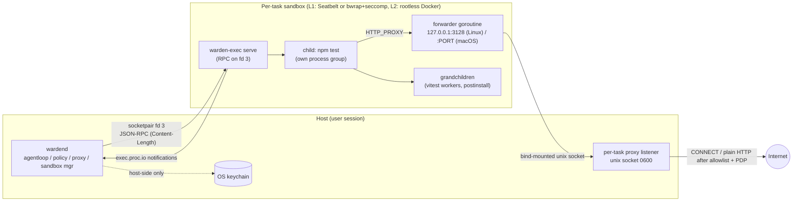
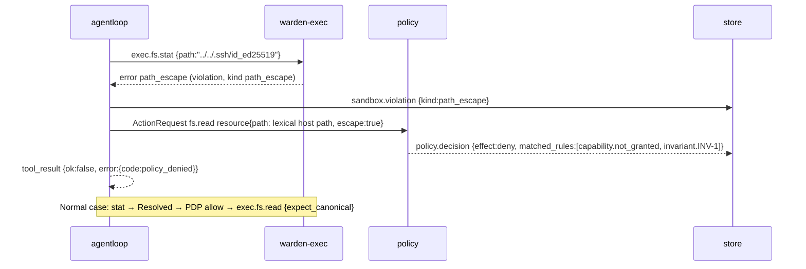
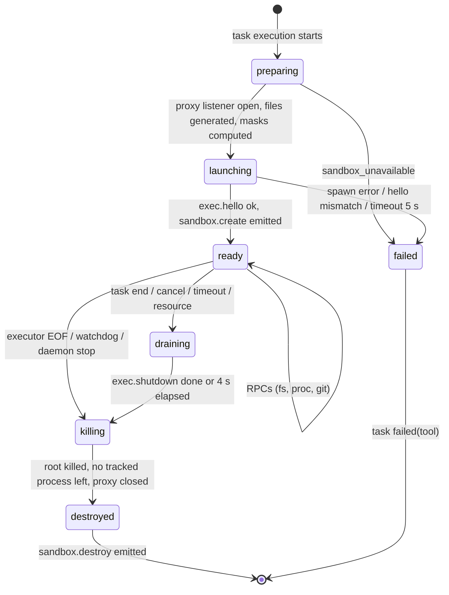

# A06 Executor protocol and sandbox launch

This deliverable specifies `warden-exec` (the only process the runtime starts inside a sandbox), its JSON-RPC protocol, the per-task sandbox on macOS (Seatbelt), Linux (bubblewrap + seccomp) and the optional L2 (rootless Docker), and how each row of the escape check (WRD-16 §10.7) is blocked. Names follow `00-DESIGN-CORE.md`; conflict resolutions CF-15, CF-16, CF-17, CF-18, CF-19, CF-20 and CF-22 are applied and cited where they bite.

Packages: `internal/sandbox` (backend-neutral manager), `internal/sandbox/darwin_seatbelt`, `internal/sandbox/linux_bwrap`, `internal/sandbox/oci` (daemon side); `cmd/warden-exec` + `internal/exec` (executor side); `internal/execproto` (leaf package with wire types, the command-profile matcher and the deny-list matcher, imported by both sides so that the daemon and the executor can never disagree on matching).

## 1. Topology



The daemon creates one sandbox per task execution and starts exactly one process in it, `warden-exec serve`, connected by an inherited socketpair (fd 3). Every agent-requested operation (file access, process, git) is an RPC to that executor; every process the agent runs is a child of the executor. The only network path out of the sandbox is the forwarder inside the executor, which relays `127.0.0.1:<port>` to the per-task proxy socket that the daemon bind-mounts (Linux, L2) or allows by path (macOS). The keychain, model credentials and model traffic stay on the host side of the boundary (BI-3).

## 2. Sandbox filesystem contract

One table defines what exists inside a sandbox. Host paths use the layout of core §10 (`S` = `~/.warden/sessions/<ulid>`).

| Logical root | Host source | Linux L1 path | macOS L1 path | L2 path | Mode | Notes |
|---|---|---|---|---|---|---|
| `worktree` | `S/worktree` | `/work` | host path | `/work` | rw | The only writable repository content (BI-2). Deny-list matches masked (§5.5) |
| `scratch` | `S/scratch/<task_key>` (emptied at each sandbox create) | `/scratch` | host path | `/scratch` | rw | Contains `home/` (`HOME`), `tmp/` (macOS `TMPDIR`), tool outputs such as `vitest.json` |
| `/tmp` | tmpfs | `/tmp` (tmpfs, 1 GiB when `--size` is supported) | not used (TMPDIR = `scratch/tmp`) | tmpfs 1 GiB | rw | Linux and L2 only |
| `cache` | `~/.warden/cache/<wsp_id>` | `/cache` | host path | `/cache` | rw | `npm/`, `go/{mod,build,path}/`, `pip/` subdirectories (WRD-10 §5.1 per-workspace cache) |
| `git` | `S/git` (private gitdir, CF-18, A14) | `/git` | host path | `/git` | rw | Config, hooks, alternates restored by the host before every host-side git operation (A14 §5) |
| `gitalt` | main repository `objects/` | `/git-alt/objects` | host path (via `S/git-alt/objects` symlink) | `/git-alt/objects` | ro | Objects only: no refs, no config, no hooks (CF-18). Absent in A14 `fetched` object mode |
| toolchains | doctor-detected dirs (§10.5, §11.4) | same path as host | same path as host | image content | ro | Language runtimes; files that look like credentials are masked |
| system | `/usr`, `/bin`, `/lib*`, selected `/etc` files | same path | Seatbelt read allowances | image content | ro | |
| executor | host `warden-exec` binary | `/warden/bin/warden-exec` | host path | `/warden/bin/warden-exec` | ro | Bound explicitly (fixes WRD-16 §10.3, which assumed `/usr/local/bin`) |
| hooks dir | empty directory | `/warden/empty` | `~/.warden/empty` (ro) | `/warden/empty` | ro | Target of `core.hooksPath` inside the sandbox |
| profiles file | `S/sandbox/<sb_id>/profiles.json` | `/warden/etc/profiles.json` | host path (ro) | `/warden/etc/profiles.json` | ro | §3.2 |
| proxy socket | `S/scratch/px-<n>.sock` (A07 §2) | `/run/warden/proxy.sock` | host path | `/run/warden/proxy.sock` | connect only | |
| hook socket (co-located harness sandbox only) | `S/scratch/hook-<n>.sock`, one per sandbox, daemon-owned (A12 §7.3) | `/run/warden/hook.sock` | host path | `/run/warden/hook.sock` | connect only | Mount kind `hook` (NEW). Carries `hook.pre_tool_use` / `hook.post_tool_use` from `warden-exec hook` to the daemon; the listener is bound to the sandbox id |
| generated `/etc` | `S/sandbox/<sb_id>/etc/{passwd,group,hosts,resolv.conf,nsswitch.conf}` | `/etc/...` | not needed | Docker-managed | ro | §11.3 |

Nothing else from the host exists in a Linux or L2 sandbox. On macOS there is no mount namespace, so the same contract is expressed as Seatbelt rules (§10): everything is denied by default, `$HOME` is denied explicitly, and only the paths above are re-allowed.

## 3. `warden-exec` launch

### 3.1 Command line

```
warden-exec serve
  --protocol warden.exec/1
  --mode tool|harness
  --rpc-fd 3                                   # inherited socketpair; L2 uses --rpc-stdio
  --roots worktree=/work:rw,scratch=/scratch:rw,cache=/cache:rw,git=/git:rw
  --allow-profiles /warden/etc/profiles.json
  --git-dir /git
  --session-branch warden/01jaxr8q7m2v9ktc3f6yh5n0pb
  --base-commit 3f9c2e…                        # full object id of the session base (A14 §3)
  --hooks-dir /warden/empty
  --proxy /run/warden/proxy.sock
  --proxy-listen 127.0.0.1:3128                # macOS: 127.0.0.1:<per-task port>
  --child-limits cpu=3600,fsize=1073741824,nofile=4096,core=0[,data=3221225472][,nproc=<n>]
  --max-procs 8
  [--harness-spec /warden/etc/harness.json --harness-stdio fd:4|unix:/run/warden/harness.sock]   # --mode harness only
```

| Flag | Meaning | Executor behavior |
|---|---|---|
| `--protocol` | Wire protocol version | Refuses to start on mismatch (exit 64) |
| `--mode` | `tool` (normal task) or `harness` (CF-22) | `harness` disables every `exec.fs.*` and `exec.git.run` method and allows `exec.proc.spawn` only for the argv in `--harness-spec` |
| `--rpc-fd` / `--rpc-stdio` | RPC channel | Executor exits (after killing all children, §7.8) when the channel reaches EOF: this is the "die with daemon" behavior on macOS, which has no parent-death signal |
| `--roots` | Named roots, sandbox-side paths and modes | Opens one `O_PATH`/`O_DIRECTORY` fd per root at start; every path operation is relative to these fds (§5). A root that is missing is fatal (exit 65) |
| `--allow-profiles` | JSON file with the command profiles granted to this task (manifest ∩ policy) | Loaded once; its sha256 is reported in `exec.hello` so the daemon can compare with the file it generated |
| `--git-dir`, `--session-branch`, `--base-commit`, `--hooks-dir` | Git environment for `exec.git.run` (A14 §6) | `exec.git.run commit` refuses unless `HEAD` is `refs/heads/<session-branch>`; `diff against: base` uses the `--base-commit` id, never the `refs/warden/base` ref (which sandboxed processes could move) |
| `--proxy`, `--proxy-listen` | Forwarder upstream socket and listen address (§9) | Forwarder starts before the RPC loop; failure to bind is fatal (exit 66) so the daemon can retry with another port (macOS) |
| `--child-limits` | rlimits applied to every child through the child shim (§7.3) | |
| `--max-procs` | Concurrent `exec.proc.spawn` handles | Further spawns fail with `busy` |
| `--harness-spec`, `--harness-stdio` | Harness argv and the channel its stdio is spliced to (§14) | |

The deny-list is not a launch argument: it is compiled into `internal/execproto` and versioned with the runtime, so no launch argument can shorten it (WRD-10 §6).

### 3.2 Profiles file

Generated by the daemon from the task's granted profiles (capability `commands.profiles` ∩ `policy/platform-defaults.yaml`, WRD-16 §9 verbatim per CF-30). Tokens are exact argv elements; `<args>` may appear only as the last token.

```json
{
  "$schema": "https://json-schema.org/draft/2020-12/schema",
  "$id": "https://schemas.warden.dev/poc/exec/profiles.json",
  "title": "warden-exec allow-profiles file",
  "type": "object",
  "required": ["version", "task_key", "profiles"],
  "additionalProperties": false,
  "properties": {
    "version": { "const": 1 },
    "task_key": { "type": "string" },
    "profiles": {
      "type": "object",
      "propertyNames": { "pattern": "^[a-z][a-z0-9-]{0,31}$" },
      "additionalProperties": {
        "type": "array",
        "minItems": 1,
        "items": {
          "type": "array",
          "minItems": 1,
          "maxItems": 16,
          "items": { "type": "string", "minLength": 1, "maxLength": 256 }
        }
      }
    }
  }
}
```

Example for `coder` in implement mode: `{"version":1,"task_key":"implement","profiles":{"node-test":[["npm","test"],["npm","test","--","<args>"],["pnpm","test"],["npx","vitest","run"],["npx","vitest","run","<args>"]],"install":[["npm","ci"],["npm","install"],["pnpm","install"],["go","mod","download"],["pip","install","-r","requirements.txt"]], "...": []}}`.

### 3.3 Harness spec file (mode `harness` only)

```json
{
  "$schema": "https://json-schema.org/draft/2020-12/schema",
  "$id": "https://schemas.warden.dev/poc/exec/harness-spec.json",
  "type": "object",
  "required": ["version", "harness_id", "run_mode", "argv"],
  "additionalProperties": false,
  "properties": {
    "version": { "const": 1 },
    "harness_id": { "enum": ["copilot", "codex", "claude-code"] },
    "run_mode": { "enum": ["split", "colocated"] },
    "argv": { "type": "array", "minItems": 1, "maxItems": 64, "items": { "type": "string", "maxLength": 4096 } },
    "argv_alternatives": {
      "type": "array", "maxItems": 2,
      "items": { "type": "array", "minItems": 1, "maxItems": 64, "items": { "type": "string", "maxLength": 4096 } },
      "description": "Other exact argv forms the engine may be started with, e.g. the Claude Code '--resume <id>' variant (A12 §7.5)"
    },
    "cwd": { "type": "string", "description": "Sandbox path; /work for colocated, /scratch for split" },
    "env": {
      "type": "object", "maxProperties": 16,
      "propertyNames": { "pattern": "^[A-Z][A-Z0-9_]{0,63}$" },
      "additionalProperties": { "type": "string", "maxLength": 1024 },
      "description": "Non-secret variables added for the engine process only (e.g. DISABLE_AUTOUPDATER, WARDEN_HOOK_SOCK); values are scanned with the A15 patterns and refused on a match"
    },
    "secret_env_keys": {
      "type": "array", "maxItems": 1,
      "items": { "type": "string", "pattern": "^[A-Z][A-Z0-9_]{0,63}$" },
      "description": "HX-1b: name of the one variable whose value arrives in exec.proc.spawn.secret_env, never on disk"
    }
  }
}
```

## 4. Executor JSON-RPC protocol

### 4.1 Transport rules

- JSON-RPC 2.0 with `Content-Length` framing (same codec as the runtime API, A05), on fd 3. Maximum frame 8 MiB; larger frames close the channel.
- Direction: the daemon sends requests; the executor sends responses and the `exec.proc.io` notification. The executor never sends requests.
- `exec.hello` must be the first request; any other method before it fails with `invalid_state`.
- Requests are processed concurrently (one goroutine each). All `exec.proc.io` notifications for a handle are written before the response to the `exec.proc.wait` that reports its exit (ordering guarantee the agent loop relies on).
- The executor holds no policy state. It enforces only: roots, the compiled deny-list, the profiles file, the shell-string rule, its limits, and the mode.

### 4.2 Methods

| Method | Direction | Purpose | Allowed in `harness` mode |
|---|---|---|---|
| `exec.hello` | request | Version, platform, roots and profile digest check | yes |
| `exec.fs.read` | request | Read a regular file (≤ 2 MiB per call, ranges) | no |
| `exec.fs.list` | request | List a directory (depth ≤ 4, ≤ 2000 entries) | no |
| `exec.fs.search` | request | Literal or RE2 search (≤ 200 matches) | no |
| `exec.fs.write` | request | Atomic write of one file | no |
| `exec.fs.patch` | request | Apply a unified diff, all or nothing | no |
| `exec.fs.stat` | request | Canonicalize and stat; used by the daemon before the PDP (§5.4) | no |
| `exec.proc.spawn` | request | Start a process (argv only) | harness argv only |
| `exec.proc.io` | notification (executor → daemon) | Output chunks | yes |
| `exec.proc.wait` | request | Long-poll for exit status (NEW in core §7) | yes |
| `exec.proc.signal` | request | TERM / INT / KILL to a handle's process group | yes |
| `exec.git.run` | request | Restricted git operations (A14 §6) | no |
| `exec.shutdown` | request | Kill everything, flush, exit | yes |

### 4.3 Schemas

Common definitions:

```json
{
  "$schema": "https://json-schema.org/draft/2020-12/schema",
  "$id": "https://schemas.warden.dev/poc/exec/common.json",
  "title": "warden-exec common definitions",
  "$defs": {
    "RootName": { "enum": ["worktree", "scratch", "cache", "git"] },
    "InputPath": {
      "type": "string", "minLength": 1, "maxLength": 4096,
      "description": "Relative to the root (preferred) or absolute in sandbox coordinates. No NUL; each segment at most 255 bytes."
    },
    "RelPath": {
      "type": "string", "maxLength": 4096,
      "description": "Root-relative, slash-separated, no leading '/', no '.' or '..' segments; '' is the root itself."
    },
    "Sha256": { "type": "string", "pattern": "^sha256:[0-9a-f]{64}$" },
    "Encoding": { "enum": ["utf-8", "base64"] },
    "Kind": { "enum": ["file", "dir", "symlink", "other"] },
    "CallId": { "type": "string", "pattern": "^call_[0-9A-Za-z]{1,40}$" },
    "Handle": { "type": "string", "pattern": "^ph_[0-9]{1,10}$" },
    "Resolved": {
      "type": "object",
      "required": ["root", "rel_path", "canonical", "deny_match"],
      "additionalProperties": false,
      "properties": {
        "root": { "$ref": "#/$defs/RootName" },
        "rel_path": { "$ref": "#/$defs/RelPath" },
        "canonical": { "type": "string", "description": "Absolute sandbox path after symlink resolution inside the roots" },
        "requested_rel_path": { "$ref": "#/$defs/RelPath", "description": "Lexically cleaned input before symlink resolution" },
        "deny_match": { "type": ["string", "null"], "description": "Deny-list glob that matched the requested or canonical path, else null" }
      }
    },
    "ErrorData": {
      "type": "object",
      "required": ["code", "violation"],
      "additionalProperties": false,
      "properties": {
        "code": { "enum": ["path_escape", "outside_roots", "deny_list", "not_found", "not_regular", "not_allowed", "shell_string", "profile_mismatch", "too_large", "timeout", "invalid_argument", "conflict", "patch_failed", "redaction_marker", "mode_forbidden", "branch_mismatch", "busy", "io_error", "invalid_state", "shutting_down"] },
        "violation": { "type": "boolean", "description": "True when the daemon must emit sandbox.violation" },
        "kind": { "enum": ["path_escape", "deny_list", "root_check", null] },
        "detail": { "type": "string", "maxLength": 1024 },
        "rel_path": { "$ref": "#/$defs/RelPath" }
      }
    }
  }
}
```

`exec.hello`:

```json
{
  "$schema": "https://json-schema.org/draft/2020-12/schema",
  "$id": "https://schemas.warden.dev/poc/exec/hello.json",
  "$defs": {
    "Params": {
      "type": "object", "required": ["protocol", "sandbox_id", "session_id", "daemon_version"], "additionalProperties": false,
      "properties": {
        "protocol": { "const": "warden.exec/1" },
        "sandbox_id": { "type": "string", "pattern": "^sb_[0-9A-Z]{26}$" },
        "session_id": { "type": "string", "pattern": "^ses_[0-9A-Z]{26}$" },
        "daemon_version": { "type": "string" }
      }
    },
    "Result": {
      "type": "object",
      "required": ["protocol", "executor_version", "os", "arch", "mode", "roots", "profiles_digest", "features", "pid", "uid"],
      "additionalProperties": false,
      "properties": {
        "protocol": { "const": "warden.exec/1" },
        "executor_version": { "type": "string" },
        "os": { "enum": ["linux", "darwin"] },
        "arch": { "enum": ["amd64", "arm64"] },
        "mode": { "enum": ["tool", "harness"] },
        "roots": { "type": "array", "items": { "type": "object", "required": ["name", "path", "mode"], "additionalProperties": false,
          "properties": { "name": { "type": "string" }, "path": { "type": "string" }, "mode": { "enum": ["rw", "ro"] } } } },
        "profiles_digest": { "$ref": "https://schemas.warden.dev/poc/exec/common.json#/$defs/Sha256" },
        "features": { "type": "object", "additionalProperties": false, "properties": {
          "openat2": { "type": "boolean" }, "o_nofollow_any": { "type": "boolean" }, "pid_namespace": { "type": "boolean" }, "cgroup": { "type": "boolean" } } },
        "pid": { "type": "integer" },
        "uid": { "type": "integer" },
        "proxy_listen": { "type": ["string", "null"] }
      }
    }
  }
}
```

The daemon compares `roots`, `mode` and `profiles_digest` with its launch spec; any mismatch destroys the sandbox with `sandbox.destroy(reason: "hello_mismatch")` and fails the task `failed(tool)`.

File methods:

```json
{
  "$schema": "https://json-schema.org/draft/2020-12/schema",
  "$id": "https://schemas.warden.dev/poc/exec/fs.json",
  "$defs": {
    "ReadParams": {
      "type": "object", "required": ["path"], "additionalProperties": false,
      "properties": {
        "path": { "$ref": "common.json#/$defs/InputPath" },
        "root": { "$ref": "common.json#/$defs/RootName", "default": "worktree" },
        "offset": { "type": "integer", "minimum": 0, "default": 0 },
        "length": { "type": "integer", "minimum": 1, "maximum": 2097152, "default": 2097152 },
        "expect_canonical": { "type": "string", "description": "Canonical path the PDP decided on; mismatch fails with conflict" }
      }
    },
    "ReadResult": {
      "type": "object", "required": ["resolved", "content", "encoding", "size", "offset", "returned", "eof", "sha256"], "additionalProperties": false,
      "properties": {
        "resolved": { "$ref": "common.json#/$defs/Resolved" },
        "content": { "type": "string" },
        "encoding": { "$ref": "common.json#/$defs/Encoding" },
        "size": { "type": "integer", "description": "Total file size" },
        "offset": { "type": "integer" },
        "returned": { "type": "integer" },
        "eof": { "type": "boolean" },
        "sha256": { "$ref": "common.json#/$defs/Sha256", "description": "Of the returned bytes" }
      }
    },
    "ListParams": {
      "type": "object", "additionalProperties": false,
      "properties": {
        "path": { "type": "string", "default": "" },
        "root": { "$ref": "common.json#/$defs/RootName", "default": "worktree" },
        "depth": { "type": "integer", "minimum": 1, "maximum": 4, "default": 1 },
        "max_entries": { "type": "integer", "minimum": 1, "maximum": 2000, "default": 500 }
      }
    },
    "ListResult": {
      "type": "object", "required": ["resolved", "entries", "truncated"], "additionalProperties": false,
      "properties": {
        "resolved": { "$ref": "common.json#/$defs/Resolved" },
        "entries": { "type": "array", "items": {
          "type": "object", "required": ["rel_path", "kind", "denied"], "additionalProperties": false,
          "properties": {
            "rel_path": { "$ref": "common.json#/$defs/RelPath" },
            "kind": { "$ref": "common.json#/$defs/Kind" },
            "size": { "type": "integer" },
            "mode": { "type": "string", "pattern": "^0[0-7]{3,4}$" },
            "mtime": { "type": "string", "format": "date-time" },
            "link_target": { "type": "string", "description": "Raw readlink value for symlinks; not followed" },
            "denied": { "type": "boolean", "description": "Name matches the deny-list; size and mtime omitted" } } } },
        "truncated": { "type": "boolean" }
      }
    },
    "SearchParams": {
      "type": "object", "required": ["query"], "additionalProperties": false,
      "properties": {
        "query": { "type": "string", "minLength": 1, "maxLength": 1024 },
        "regex": { "type": "boolean", "default": false, "description": "RE2 syntax when true; literal otherwise" },
        "case_sensitive": { "type": "boolean", "default": true },
        "path": { "type": "string", "default": "" },
        "root": { "$ref": "common.json#/$defs/RootName", "default": "worktree" },
        "include": { "type": "array", "maxItems": 32, "items": { "type": "string", "maxLength": 256 } },
        "exclude": { "type": "array", "maxItems": 32, "items": { "type": "string", "maxLength": 256 } },
        "max_matches": { "type": "integer", "minimum": 1, "maximum": 200, "default": 200 },
        "context_lines": { "type": "integer", "minimum": 0, "maximum": 3, "default": 0 },
        "max_file_bytes": { "type": "integer", "minimum": 1, "maximum": 2097152, "default": 2097152 }
      }
    },
    "SearchResult": {
      "type": "object", "required": ["matches", "files_scanned", "truncated", "skipped"], "additionalProperties": false,
      "properties": {
        "matches": { "type": "array", "maxItems": 200, "items": {
          "type": "object", "required": ["rel_path", "line", "column", "text"], "additionalProperties": false,
          "properties": {
            "rel_path": { "$ref": "common.json#/$defs/RelPath" },
            "line": { "type": "integer", "minimum": 1 },
            "column": { "type": "integer", "minimum": 1 },
            "text": { "type": "string", "maxLength": 512 },
            "before": { "type": "array", "items": { "type": "string", "maxLength": 512 } },
            "after": { "type": "array", "items": { "type": "string", "maxLength": 512 } } } } },
        "files_scanned": { "type": "integer" },
        "truncated": { "type": "boolean" },
        "skipped": { "type": "object", "additionalProperties": false, "properties": {
          "denied": { "type": "integer" }, "binary": { "type": "integer" }, "too_large": { "type": "integer" }, "unreadable": { "type": "integer" } } }
      }
    },
    "WriteParams": {
      "type": "object", "required": ["path", "content"], "additionalProperties": false,
      "properties": {
        "path": { "$ref": "common.json#/$defs/InputPath" },
        "content": { "type": "string", "maxLength": 5592406, "description": "≤ 4 MiB after decoding" },
        "encoding": { "$ref": "common.json#/$defs/Encoding", "default": "utf-8" },
        "mode": { "enum": ["create", "overwrite"], "default": "overwrite" },
        "executable": { "type": "boolean", "default": false },
        "expect_canonical": { "type": "string" }
      }
    },
    "WriteResult": {
      "type": "object", "required": ["resolved", "bytes_written", "created", "sha256"], "additionalProperties": false,
      "properties": {
        "resolved": { "$ref": "common.json#/$defs/Resolved" },
        "bytes_written": { "type": "integer" },
        "created": { "type": "boolean" },
        "sha256": { "$ref": "common.json#/$defs/Sha256" }
      }
    },
    "PatchParams": {
      "type": "object", "required": ["patch"], "additionalProperties": false,
      "properties": {
        "patch": { "type": "string", "minLength": 1, "maxLength": 4194304, "description": "Unified diff (git or plain); may touch several files" },
        "strip": { "type": "integer", "minimum": 0, "maximum": 2, "default": 1 },
        "dry_run": { "type": "boolean", "default": false }
      }
    },
    "PatchResult": {
      "type": "object", "required": ["files", "applied"], "additionalProperties": false,
      "properties": {
        "applied": { "type": "boolean" },
        "files": { "type": "array", "items": {
          "type": "object", "required": ["rel_path", "op", "hunks"], "additionalProperties": false,
          "properties": {
            "rel_path": { "$ref": "common.json#/$defs/RelPath" },
            "from_rel_path": { "$ref": "common.json#/$defs/RelPath" },
            "op": { "enum": ["modify", "create", "delete", "rename"] },
            "hunks": { "type": "integer" },
            "sha256_after": { "$ref": "common.json#/$defs/Sha256" } } } }
      }
    },
    "StatParams": {
      "type": "object", "required": ["path"], "additionalProperties": false,
      "properties": {
        "path": { "$ref": "common.json#/$defs/InputPath" },
        "root": { "$ref": "common.json#/$defs/RootName", "default": "worktree" }
      }
    },
    "StatResult": {
      "type": "object", "required": ["resolved", "exists"], "additionalProperties": false,
      "properties": {
        "resolved": { "$ref": "common.json#/$defs/Resolved" },
        "exists": { "type": "boolean" },
        "kind": { "$ref": "common.json#/$defs/Kind" },
        "size": { "type": "integer" },
        "mode": { "type": "string" },
        "mtime": { "type": "string", "format": "date-time" }
      }
    }
  }
}
```

Process methods:

```json
{
  "$schema": "https://json-schema.org/draft/2020-12/schema",
  "$id": "https://schemas.warden.dev/poc/exec/proc.json",
  "$defs": {
    "SpawnParams": {
      "type": "object", "required": ["call_id", "argv", "timeout_ms", "authz"], "additionalProperties": false,
      "properties": {
        "call_id": { "$ref": "common.json#/$defs/CallId" },
        "argv": { "type": "array", "minItems": 1, "maxItems": 1024, "items": { "type": "string", "maxLength": 32768 },
                  "description": "argv[0] is resolved through the sandbox PATH; total size ≤ 128 KiB; no NUL" },
        "cwd": { "type": "string", "default": "", "description": "Worktree-relative directory" },
        "timeout_ms": { "type": "integer", "minimum": 1000, "maximum": 3600000 },
        "max_output_bytes": { "type": "integer", "minimum": 4096, "maximum": 1048576, "default": 262144 },
        "secret_env": {
          "type": "object", "maxProperties": 1,
          "additionalProperties": { "type": "string", "maxLength": 8192 },
          "description": "Harness mode only (HX-1b, A12 §4.2, A15 §5): keys must be listed in the harness spec secret_env_keys; the value is set in the engine process environment only, never logged, never echoed in results"
        },
        "authz": {
          "type": "object", "required": ["decision_id", "profile", "approved", "kind"], "additionalProperties": false,
          "properties": {
            "decision_id": { "type": "string", "pattern": "^dec_[0-9A-Za-z]{1,40}$" },
            "profile": { "type": "string", "description": "Profile the PDP matched, '' when none" },
            "approved": { "type": "boolean", "description": "True when the allow came from an approval or grant" },
            "kind": { "enum": ["tool", "verifier", "harness"] }
          }
        }
      }
    },
    "SpawnResult": {
      "type": "object", "required": ["handle", "pid", "pgid", "executable", "profile"], "additionalProperties": false,
      "properties": {
        "handle": { "$ref": "common.json#/$defs/Handle" },
        "pid": { "type": "integer" },
        "pgid": { "type": "integer" },
        "executable": { "type": "string", "description": "Resolved absolute sandbox path of argv[0]" },
        "profile": { "type": "string", "description": "Profile the executor itself matched" }
      }
    },
    "IoNotification": {
      "type": "object", "required": ["handle", "call_id", "seq", "stream", "data", "encoding", "segment"], "additionalProperties": false,
      "properties": {
        "handle": { "$ref": "common.json#/$defs/Handle" },
        "call_id": { "$ref": "common.json#/$defs/CallId" },
        "seq": { "type": "integer", "minimum": 0 },
        "stream": { "enum": ["stdout", "stderr", "marker"] },
        "data": { "type": "string", "description": "≤ 16 KiB per chunk before encoding" },
        "encoding": { "$ref": "common.json#/$defs/Encoding" },
        "segment": { "enum": ["head", "tail"], "description": "tail chunks follow the truncation marker (§7.5)" }
      }
    },
    "WaitParams": {
      "type": "object", "required": ["handle"], "additionalProperties": false,
      "properties": {
        "handle": { "$ref": "common.json#/$defs/Handle" },
        "timeout_ms": { "type": "integer", "minimum": 0, "maximum": 600000, "default": 0, "description": "0 waits until exit" }
      }
    },
    "WaitResult": {
      "type": "object", "required": ["handle", "state"], "additionalProperties": false,
      "properties": {
        "handle": { "$ref": "common.json#/$defs/Handle" },
        "state": { "enum": ["running", "exited"] },
        "exit_code": { "type": ["integer", "null"] },
        "signal": { "type": ["string", "null"], "description": "e.g. SIGKILL, SIGSYS, SIGXFSZ" },
        "reason": { "enum": ["exit", "signal", "timeout", "cancelled", "resource", "executor_shutdown"] },
        "resource": { "type": "object", "additionalProperties": false, "properties": {
          "kind": { "enum": ["memory", "pids", "cpu", "fsize", "tmp_full", "disk"] }, "detail": { "type": "string" } } },
        "seccomp_kill": { "type": "boolean", "description": "Process died with SIGSYS (seccomp KILL class, §11.5)" },
        "duration_ms": { "type": "integer" },
        "bytes": { "type": "object", "additionalProperties": false, "properties": {
          "stdout": { "type": "integer" }, "stderr": { "type": "integer" }, "forwarded": { "type": "integer" }, "discarded": { "type": "integer" } } },
        "truncated": { "type": "boolean" },
        "strays_killed": { "type": "integer", "description": "Processes outside any live handle killed after exit (§7.7)" },
        "rusage": { "type": "object", "additionalProperties": false, "properties": {
          "user_ms": { "type": "integer" }, "sys_ms": { "type": "integer" }, "max_rss_kb": { "type": "integer" } } }
      }
    },
    "SignalParams": {
      "type": "object", "required": ["handle", "signal"], "additionalProperties": false,
      "properties": { "handle": { "$ref": "common.json#/$defs/Handle" }, "signal": { "enum": ["INT", "TERM", "KILL"] } }
    },
    "SignalResult": {
      "type": "object", "required": ["delivered", "pgid"], "additionalProperties": false,
      "properties": { "delivered": { "type": "boolean" }, "pgid": { "type": "integer" } }
    },
    "ShutdownParams": {
      "type": "object", "additionalProperties": false,
      "properties": {
        "grace_ms": { "type": "integer", "minimum": 0, "maximum": 10000, "default": 3000 },
        "reason": { "enum": ["task_end", "cancel", "timeout", "resource", "daemon_stop", "error"] }
      }
    },
    "ShutdownResult": {
      "type": "object", "required": ["killed_pids", "remaining"], "additionalProperties": false,
      "properties": { "killed_pids": { "type": "integer" }, "remaining": { "type": "integer" } }
    }
  }
}
```

Git method (argv built by the executor; A14 §6 gives the exact git commands):

```json
{
  "$schema": "https://json-schema.org/draft/2020-12/schema",
  "$id": "https://schemas.warden.dev/poc/exec/git.json",
  "$defs": {
    "RunParams": {
      "type": "object", "required": ["op"], "additionalProperties": false,
      "properties": {
        "op": { "enum": ["status", "diff", "commit", "head"] },
        "diff": { "type": "object", "additionalProperties": false, "properties": {
          "against": { "type": "string", "pattern": "^(base|HEAD|[0-9a-f]{40}|[0-9a-f]{64})$", "default": "base" },
          "paths": { "type": "array", "maxItems": 256, "items": { "type": "string", "maxLength": 4096 } },
          "stat_only": { "type": "boolean", "default": false },
          "context_lines": { "type": "integer", "minimum": 0, "maximum": 10, "default": 3 } } },
        "commit": { "type": "object", "required": ["message"], "additionalProperties": false, "properties": {
          "message": { "type": "string", "minLength": 1, "maxLength": 4096 },
          "paths": { "type": "array", "maxItems": 256, "items": { "type": "string", "maxLength": 4096 } } } },
        "timeout_ms": { "type": "integer", "minimum": 1000, "maximum": 120000, "default": 60000 }
      }
    },
    "RunResult": {
      "type": "object", "required": ["exit_code", "stdout", "stderr", "encoding", "truncated"], "additionalProperties": false,
      "properties": {
        "exit_code": { "type": "integer" },
        "stdout": { "type": "string" },
        "stderr": { "type": "string" },
        "encoding": { "$ref": "common.json#/$defs/Encoding" },
        "truncated": { "type": "boolean" },
        "head": { "type": "object", "additionalProperties": false, "properties": {
          "commit": { "type": "string" }, "branch": { "type": "string" } } }
      }
    }
  }
}
```

### 4.4 Error codes

JSON-RPC `error.code` is numeric; `error.data` follows `ErrorData`. The daemon turns errors with `violation: true` into `sandbox.violation` events (kind from the table) and into a denied tool result for the model (`{ok:false, error:{code, reason}}`, WRD-04 §7).

| Code | `data.code` | Meaning | Violation kind |
|---|---|---|---|
| -32101 | `path_escape` | `..` escapes the root, or a symlink resolves outside every root | `path_escape` |
| -32102 | `outside_roots` | Absolute input path not under any root, or the root is not allowed for this method | `root_check` |
| -32103 | `deny_list` | Requested or canonical path matches the deny-list | `deny_list` |
| -32104 | `not_found` | Path does not exist (read, list, stat of parent) | no |
| -32105 | `not_regular` | Read or write target is a FIFO, socket or device | no |
| -32106 | `not_allowed` | argv matches no granted profile and `authz.approved` is false | `root_check` |
| -32107 | `shell_string` | Shell interpreter with `-c` (CF-19) | `root_check` |
| -32108 | `profile_mismatch` | `authz.profile` differs from the executor's own match | `root_check` |
| -32109 | `too_large` | Size cap exceeded (read 2 MiB, write 4 MiB, frame 8 MiB) | no |
| -32110 | `timeout` | Method-level timeout (git, search) | no |
| -32111 | `invalid_argument` | Schema-valid but semantically wrong input | no |
| -32112 | `conflict` | `expect_canonical` mismatch or a path component changed during the operation (TOCTOU detected) | no (the daemon re-resolves and re-asks the PDP once) |
| -32113 | `patch_failed` | Hunk did not apply; nothing written | no |
| -32114 | `redaction_marker` | Write or patch content contains `[REDACTED:` (A15 §6.4) | no |
| -32115 | `mode_forbidden` | Method not available in `harness` mode | `root_check` |
| -32116 | `branch_mismatch` | `HEAD` is not the session branch on `commit` | `root_check` |
| -32117 | `busy` | `--max-procs` reached | no |
| -32118 | `io_error` | Other OS error (message sanitized) | no |
| -32119 | `invalid_state` | Method before `exec.hello`, or unknown handle | no |
| -32120 | `shutting_down` | `exec.shutdown` in progress | no |

## 5. Path canonicalization and root checks

### 5.1 Algorithm `Resolve(rootName, input) -> Resolved`

Runs inside the executor (paths are resolved inside the sandbox, WRD-04 §4 rule 1). `R` is the sandbox path of the root; `rootfd` its directory fd opened at start.

1. **Validate input.** Reject empty strings, NUL bytes, invalid UTF-8, more than 4096 bytes, or a segment longer than 255 bytes (`invalid_argument`).
2. **Choose the root.** If the input is absolute: if it equals `R` or starts with `R + "/"`, strip that prefix; else if it lies under another root that the method permits (only `exec.fs.read/stat/list` may name `scratch`; nothing may name `cache` or `git`), switch to that root; else fail `outside_roots`. Relative input is relative to the method's `root` (default `worktree`).
3. **Lexical clean.** `c := path.Clean(rel)`. If `c == ".."`, or `c` starts with `"../"`, fail `path_escape`. (Clean is not used to clamp: an attempted escape is an error, not silently the root.) `c == "."` becomes `""`.
4. **Walk with symlink resolution inside the root.** Maintain `done` (resolved components) and `todo` (remaining components), and a symlink budget of 40. For each component: `fstatat(dirfd(done), comp, AT_SYMLINK_NOFOLLOW)`.
   - Not found: append the rest of `todo` lexically and stop (valid for write/create; read/list/stat report `not_found` or `exists: false`).
   - Symlink: `readlinkat`. If the target is absolute: when it lies under `R`, replace `done` by the target's root-relative components; when it lies under another root, fail `path_escape` unless the method permits that root; otherwise fail `path_escape`. If relative: `done := Clean(join(done, target))`; if that escapes `R`, fail `path_escape`. Prepend nothing; continue with `todo`. Decrement the budget; at zero fail `path_escape` (ELOOP).
   - Directory or file: append to `done`.
5. **Result.** `rel_path = join(done)`, `canonical = R + "/" + rel_path`, `requested_rel_path = c`.
6. **Deny-list check (CF-17).** Match both `requested_rel_path` and `rel_path` against the compiled deny-list with the root-relative rule (A15 §4): for any path inside a mounted root, the glob is matched against the root-relative path, so `**/.warden/**` denies a repository's own `.warden/` directory but not the worktree itself, which lives under `~/.warden`. Any match sets `deny_match` and, for every method except `exec.fs.list` (which reports the entry as `denied: true`) and `exec.fs.stat`, fails `deny_list`.
7. **Host mapping (daemon side).** The daemon maps `(root, rel_path)` to the host path `hostRoot[root] + "/" + rel_path` and fills `action.resource.path` (canonical absolute host path) and `action.resource.rel_path` for the PDP (core §9). The PDP never sees the model's spelling.

### 5.2 Opening without races

The walk in §5.1 produces a canonical path that contains no symlinks. The operation then opens exactly that path in a way that fails if anything changed:

| Platform | Open method | Race outcome |
|---|---|---|
| Linux ≥ 5.6 (`features.openat2`) | `openat2(rootfd, rel_path, {flags \| O_NOFOLLOW, resolve: RESOLVE_BENEATH \| RESOLVE_NO_SYMLINKS \| RESOLVE_NO_MAGICLINKS \| RESOLVE_NO_XDEV})` | A symlink that appeared returns `ELOOP`; `..` or absolute tricks return `EXDEV`; crossing into a mask mount (§11.3) returns `EXDEV`. All map to `conflict` |
| macOS 11+ (`features.o_nofollow_any`) | `openat(rootfd, rel_path, flags \| O_NOFOLLOW_ANY)` | Any symlink in any component returns `ELOOP` → `conflict` |
| Fallback (Linux < 5.6, older macOS) | Component walk: `openat(dirfd, comp, O_RDONLY \| O_DIRECTORY \| O_NOFOLLOW)` per directory, final `openat(dirfd, last, flags \| O_NOFOLLOW)` | Same outcomes, slightly slower |

After opening, the executor `fstat`s the fd and requires a regular file for read/write targets (`not_regular` otherwise; files are opened `O_NONBLOCK` first so a FIFO cannot block the executor). When the daemon supplied `expect_canonical` and the fresh resolution differs, the call fails `conflict`; the daemon re-resolves with `exec.fs.stat`, asks the PDP again (a new `policy.decision`), and retries once. The window between the PDP decision and the operation therefore cannot turn an allowed path into a denied one without a second decision.

Writes: parent directories are created with `mkdirat` component by component from the deepest existing directory fd (never following links); the content goes to a temporary file created with `O_CREAT | O_EXCL | O_NOFOLLOW` in the target directory, is `fsync`ed and `renameat`ed over the target. Rename replaces a directory entry, so a target that is a symlink or a hard link to another file is replaced, never written through.

Residual TOCTOU: a process running concurrently in the same sandbox can change files between two tool calls; that is inside the sandbox and has no effect outside it. Host-side code never opens worktree files by path while any sandbox process is alive (A14 §5).

### 5.3 Per-method root permissions

| Method | Roots it may address |
|---|---|
| `exec.fs.read`, `exec.fs.stat` | `worktree` (agent tools); `scratch` (daemon-internal reads of tool outputs such as `vitest.json`, never on model request) |
| `exec.fs.list`, `exec.fs.search` | `worktree` |
| `exec.fs.write`, `exec.fs.patch` | `worktree`; additionally the relative path must not start with `.git` (the worktree's `.git` file) |
| `exec.proc.spawn` `cwd` | `worktree` |

The daemon enforces the "model may only address `worktree`" rule before it sends a request; the executor enforces the table independently.

### 5.4 Resolution before the policy decision



For every `fs.*` call the agent loop first calls `exec.fs.stat`, builds the ActionRequest from `Resolved`, obtains the decision, and only then calls the operation with `expect_canonical`. A resolution failure is itself recorded (`sandbox.violation`) and still produces a `policy.decision(deny)`, so the audit trail shows the attempt at both layers (WRD-16 §4.3 S2). Paths that the executor rejects are passed to the PDP in their lexically joined host form with `resource.escape: true` so that INV-1 and INV-2 rules match the attempt.

## 6. Command allowlist re-check

`exec.proc.spawn` performs these checks in order; the first failure ends the call.

1. **Shape.** argv non-empty, ≤ 1024 elements, total ≤ 128 KiB, no NUL.
2. **Shell strings (CF-19).** Let `b = basename(argv[0])`. Refuse (`shell_string`) when `b ∈ {sh, bash, zsh, dash, ksh, fish}` and any later element equals `-c`, `--command`, or is a short-option cluster containing `c` (`^-[A-Za-z]*c[A-Za-z]*$`, e.g. `-lc`, `-ec`). The executor also applies the rule through common exec wrappers: if `b ∈ {env, nice, nohup, timeout, stdbuf, setsid, xargs, busybox, time, command}`, the first later element whose basename is a shell is checked the same way. The PDP rule `platform.no-shell-strings` uses the same matcher (`execproto.IsShellString`), see Deviations.
3. **Executable resolution.** If `argv[0]` contains `/`, it is resolved as a path under the worktree root with §5.1 (so `./node_modules/.bin/vitest` works and `/usr/bin/curl` works) and the executor records the resolved path. Otherwise it is looked up in the sandbox `PATH` (§8), which never contains a worktree directory, so a repository cannot shadow `npm` or `git`. The resolved file must be executable and lie under the system, toolchain, worktree, scratch or cache roots.
4. **Profile match.** Using the profiles file: an entry `[t1..tn]` matches argv when `argv[0]` has no `/` and equals `t1` by string, `argv[i] == ti` for every non-`<args>` token, and either `len(argv) == n` or the last token is `<args>` (which matches zero or more remaining elements, each ≤ 4096 bytes). Matching is exact and case-sensitive; no globbing, no option reordering. `npm test -- --reporter=json --outputFile=/scratch/vitest.json` matches `["npm","test","--","<args>"]`; `npm test --silent` matches nothing (the `--` is required) and falls to R3. The first profile (in file order) that matches is the executor's profile.
5. **Authorization consistency.** `authz.profile` must equal the executor's match (`profile_mismatch` otherwise). If the executor found no profile, `authz.approved` must be true (the PDP resolved an R3 command by approval or grant); otherwise `not_allowed`. In `harness` mode, argv must equal the harness spec `argv` or one of its `argv_alternatives` exactly, and `authz.kind` must be `harness`; `secret_env` is accepted only here and only for keys in `secret_env_keys` (in `tool` mode it fails `invalid_argument`).
6. **cwd.** Resolved with §5.1 under `worktree`; must be a directory and not deny-listed.
7. **Secret scan (INV-6 backstop).** argv elements are scanned with the A15 pattern set compiled into `execproto`; a match fails `invalid_argument` ("argument looks like a credential"). The PDP performs the authoritative INV-6 check with the known-value set, which the executor does not have.

The executor check is a consistency check against daemon bugs, not a boundary against a compromised daemon (the daemon is in the TCB, WRD-10 §4).

## 7. Process spawning

### 7.1 Spawn sequence

1. Acquire a slot (`--max-procs`), allocate handle `ph_<n>`.
2. Build the environment: exactly the launch environment of the executor (which is the allowlist of §8); in `tool` mode `exec.proc.spawn` cannot add variables. In `harness` mode the engine process additionally receives the spec's `env` and, for HX-1b, the single `secret_env` variable (§14); children of the engine inherit them as ordinary environment, which is the documented HX-1 exposure (CF-22).
3. Start the **child shim**: `exec.Cmd{Path: /proc/self/exe (Linux) or os.Executable() (macOS), Args: ["warden-exec","child","--limits",<json>,"--",resolved,argv[1:]...]}` with `SysProcAttr{Setpgid: true, Pgid: 0}` (new process group; on Linux also `Pdeathsig: SIGKILL`), `Stdin` = `/dev/null` opened read-only, `Stdout`/`Stderr` = two pipes, `Dir` = resolved cwd.
4. The shim applies `setrlimit` for every entry in `--child-limits` (§7.3), then `execve(resolved, argv, environ)`. Using a re-exec shim keeps limits per child and portable (Go's `os/exec` has no rlimit hook), and the shim never outlives the `execve`.
5. Reply `{handle, pid, pgid, executable, profile}`; start the output pumps and the per-handle watchdog.

### 7.2 Streams and chunking

- Pumps read each pipe with a 16 KiB buffer and emit `exec.proc.io` chunks at most every 100 ms or when 16 KiB are buffered.
- Chunks are UTF-8 when valid; an incomplete trailing UTF-8 sequence (≤ 3 bytes) is held for the next chunk; invalid data is sent as `base64`.
- `seq` increases per handle across both streams, so the daemon can interleave stdout and stderr in order.
- The daemon runs the streaming redactor (A15 §6.2) on every chunk before it forwards anything as `stream.delta` or persists it. The executor does not redact.

### 7.3 Resource limits applied per child

| Limit | Linux with cgroup | Linux without cgroup | macOS |
|---|---|---|---|
| Memory | cgroup `memory.max` = 3 GiB, `memory.swap.max` = 0 for the whole sandbox (§11.6) | `RLIMIT_DATA` = 3 GiB per process (counts private writable mappings, not reserved address space) | Daemon RSS watchdog (§10.7): kill when the sandbox tree exceeds 3 GiB RSS |
| Processes | `pids.max` = 512 for the sandbox | `RLIMIT_NPROC` = (user's current process count) + 512 (the kernel counts per real uid; see ASM) | `RLIMIT_NPROC` = (user's current process count) + 256 |
| CPU | `cpu.max` = 200% (2 CPUs) | `RLIMIT_CPU` = 4 × call timeout, runaway guard only | `RLIMIT_CPU` = 4 × call timeout |
| File size | `RLIMIT_FSIZE` = 1 GiB (all platforms) | same | same |
| /tmp | tmpfs `--size 1073741824` | same when `--size` is supported, else kernel default | `scratch/tmp` on host disk, bounded by `RLIMIT_FSIZE` and the disk watchdog |
| Disk | Free-space watchdog: kill the sandbox when the filesystem holding `~/.warden` has less than 1 GiB free | same | same |
| Open files | `RLIMIT_NOFILE` = 4096 | same | same |
| Core dumps | `RLIMIT_CORE` = 0 | same | same |
| Wall clock | Per call: `timeout_ms` (obligation `timeout_seconds`, capped by capability `timeout_seconds`); per task: orchestrator, paused while waiting (CF-38) | same | same |

`RLIMIT_AS` is deliberately not used: Node (V8) and some Go tools reserve large virtual ranges and fail under an address-space limit long before using real memory.

### 7.4 Exit classification (`exec.proc.wait.reason`)

| Observation | `reason` | `resource.kind` |
|---|---|---|
| Normal exit | `exit` | |
| Killed by the per-call watchdog | `timeout` | |
| Killed by `exec.proc.signal` / `exec.shutdown` after a cancel | `cancelled` | |
| cgroup `memory.events` `oom_kill` increased, or macOS RSS watchdog fired | `resource` | `memory` |
| cgroup `pids.events` `max` increased, or fork failures observed with `RLIMIT_NPROC` | `resource` | `pids` |
| `SIGXCPU` / `SIGKILL` after `RLIMIT_CPU` | `resource` | `cpu` |
| `SIGXFSZ` | `resource` | `fsize` |
| `/tmp` tmpfs ≥ 99% full at exit | `resource` | `tmp_full` |
| Disk watchdog fired | `resource` | `disk` |
| `SIGSYS` | `signal` with `seccomp_kill: true` | |

The agent loop (A10) ends the execution with `failed(resource)` when `reason` is `resource`; the escape check relies on this (WRD-16 §10.7 row 5).

### 7.5 Output cap and truncation marker

`max_output_bytes` (default 262,144, obligation `max_output_bytes`) caps the combined forwarded bytes of stdout and stderr. The executor forwards the first `head = max − tail` bytes live, where `tail = min(65,536, max / 4)`, keeps the last `tail` bytes in a ring buffer, drains and counts everything else (the child never blocks on a full pipe), and at exit sends one `stream: "marker"` chunk with the text `\n[warden: output truncated: <discarded> bytes omitted]\n` followed by the tail as `segment: "tail"` chunks. Test summaries, which are printed last, therefore survive truncation. `wait.truncated` is true and `bytes.discarded` gives the count.

### 7.6 Signals and cancellation

`exec.proc.signal` sends the signal to `-pgid`. Cancellation (core §13.10) is: daemon sends `TERM`; after 3 s `KILL`; then `exec.shutdown{grace_ms: 0}`; then the sandbox root is killed (§13.3). The 5 s budget from `session.cancel` to `task.state(cancelled)` is: 0 to 3 s TERM grace, 3 s KILL, at most 1 s shutdown and teardown, 1 s margin.

### 7.7 No process survives its call

When a handle's leader exits, the executor kills every process in the sandbox that is neither the executor itself nor a member of another live handle's process tree, and reports the count as `strays_killed`. Linux: the executor is inside the PID namespace, so `/proc` lists only sandbox processes; tree membership is computed from `/proc/<pid>/stat` (ppid, pgid, sid). macOS: the daemon's process tracker (§10.7) provides the set. This catches `setsid` daemons started by build scripts and test servers left running.

### 7.8 Executor exit

On `exec.shutdown`, on RPC EOF, or on `SIGTERM`: TERM all process groups, wait `grace_ms` (3 s default, 1 s on EOF), KILL all, reap, flush pending notifications (not on EOF), exit 0.

## 8. Environment allowlist

The sandbox starts with an empty environment (`--clearenv`, `Env` set explicitly for `sandbox-exec`, `-e` only for Docker). These variables exist and nothing else:

| Variable | Linux / L2 value | macOS value | Why |
|---|---|---|---|
| `HOME` | `/scratch/home` | `<SCRATCH>/home` | WRD-10 §5.1: HOME is scratch |
| `PATH` | `<toolchain bin dirs>:/usr/local/bin:/usr/bin:/bin` | `<toolchain bin dirs>:<DEVELOPER_DIR>/usr/bin:/opt/homebrew/bin:/usr/local/bin:/usr/bin:/bin` | No worktree directory; `DEVELOPER_DIR/usr/bin` first so `git` is the real binary, not the `xcrun` shim |
| `LANG` | `C.UTF-8` | `en_US.UTF-8` | |
| `TERM` | `dumb` | `dumb` | No colors, no pagers |
| `TMPDIR` | `/tmp` | `<SCRATCH>/tmp` | |
| `HTTP_PROXY`, `HTTPS_PROXY`, `http_proxy`, `https_proxy` | `http://127.0.0.1:3128` | `http://127.0.0.1:<PROXY_PORT>` | CF-15; no `ALL_PROXY` |
| `NO_PROXY` | empty | empty | Everything goes through the proxy (see OQ candidate on loopback) |
| `npm_config_cache` | `/cache/npm` | `<CACHE>/npm` | |
| `GOPATH` | `/cache/go/path` | `<CACHE>/go/path` | |
| `GOMODCACHE` | `/cache/go/mod` | `<CACHE>/go/mod` | |
| `GOCACHE` | `/cache/go/build` | `<CACHE>/go/build` | |
| `PIP_CACHE_DIR` | `/cache/pip` | `<CACHE>/pip` | |
| `GIT_CONFIG_GLOBAL` | `/dev/null` | `/dev/null` | F-TL-7 |
| `GIT_CONFIG_SYSTEM` | `/dev/null` | `/dev/null` | F-TL-7 (also disables Apple Git's `credential.helper=osxkeychain`) |
| `GIT_CONFIG_NOSYSTEM` | `1` | `1` | Older git versions |
| `GIT_TERMINAL_PROMPT` | `0` | `0` | Never prompt |
| `GIT_CEILING_DIRECTORIES` | `/` | `<SESSION_DIR>` | Repository discovery never walks above the worktree |
| `GIT_CONFIG_COUNT` | `3` | `3` | Command-line-level config for every git process in the sandbox (git ≥ 2.31) |
| `GIT_CONFIG_KEY_0` / `GIT_CONFIG_VALUE_0` | `core.hooksPath` / `/warden/empty` | `core.hooksPath` / `~/.warden/empty` (absolute) | Overrides any repository config, including writes by package scripts |
| `GIT_CONFIG_KEY_1` / `GIT_CONFIG_VALUE_1` | `core.fsmonitor` / `false` | same | |
| `GIT_CONFIG_KEY_2` / `GIT_CONFIG_VALUE_2` | `safe.directory` / `/work` | `safe.directory` / `<WORKTREE>` | Honored only from protected (env) config |

Harness sandboxes (§14) add, for the engine process only, the harness spec `env` (for example `WARDEN_HOOK_SOCK=/run/warden/hook.sock`, telemetry and auto-update switches) and at most one HX-1b secret variable; `sandbox.create.env_keys` lists their names, never values.

`exec.git.run commit` additionally sets `GIT_AUTHOR_NAME=warden`, `GIT_AUTHOR_EMAIL=<ses_…>`, `GIT_COMMITTER_NAME=warden`, `GIT_COMMITTER_EMAIL=<ses_…>` for that git process only (A14 §6). `sandbox.create.env_keys` lists the keys (never values). No `USER`, `LOGNAME`, `SHELL`, `SSH_AUTH_SOCK`, `DBUS_SESSION_BUS_ADDRESS`, `XDG_*`, `DISPLAY`, `*_API_KEY` or `TZ` (processes see UTC; test results do not depend on the host timezone).

## 9. In-sandbox proxy forwarder

`warden-exec serve` runs the forwarder as a goroutine (the standalone `warden-exec proxy --listen 127.0.0.1:<port> --upstream <socket>` of core §7 is the same code, used by tests):

- Listens on `--proxy-listen` (TCP, loopback only). Linux and L2: `127.0.0.1:3128` inside the private network namespace. macOS: `127.0.0.1:<PROXY_PORT>`, a per-task port chosen by the daemon in 20000 to 29999 that is not listening at sandbox creation and templated into the Seatbelt profile (CF-15). If the bind fails the executor exits 66 and the daemon regenerates the profile with another port (at most 3 attempts).
- For each accepted TCP connection it dials the Unix socket `--proxy` and copies bytes in both directions (`io.Copy` pair, half-close propagated). It does not parse HTTP; the proxy in the daemon does (A07). One upstream Unix connection per TCP connection preserves per-connection accounting.
- It never dials anything else and has no configuration beyond the two flags.

On macOS the forwarder port is on the shared host loopback, so any local process could connect to it while the task runs; it only reaches that task's allowlist, and the local attacker is out of scope (WRD-10 §3, T-23).

## 10. macOS L1: Seatbelt

### 10.1 Profile template

The profile is generated per sandbox into `S/sandbox/<sb_id>/profile.sb` (its sha256 goes into `sandbox.create`). All paths are passed as `-D` parameters and referenced with `(param "…")`, which avoids quoting problems; only numeric ports and generated regular expressions are rendered into the text. Every path parameter is canonical (`filepath.EvalSymlinks`, so `/var` becomes `/private/var`) because Seatbelt matches resolved vnode paths.

SBPL evaluates every rule and the **last matching rule wins**. The sections are ordered so that the broad `$HOME` deny comes **before** the specific allows for the task roots (the fix for CF-16), and the credential-related hard denies come last.

```scheme
(version 1)
;; Warden L1 profile template v1. internal/sandbox/darwin_seatbelt/profile.sb.tmpl
;; Last matching rule wins: section order is part of the security design.

;;; 0. Default
(deny default)

;;; 1. Processes (targets outside $HOME)
(allow process-fork)
(allow signal (target same-sandbox))
(allow process-info* (target same-sandbox))
(allow process-exec*
  (subpath "/usr/bin") (subpath "/bin") (subpath "/usr/sbin") (subpath "/usr/libexec")
  (subpath "/opt/homebrew") (subpath "/usr/local")
  (subpath (param "DEVELOPER_DIR")))

;;; 2. System reads (read-only, outside $HOME)
(allow file-read* file-map-executable
  (subpath "/usr") (subpath "/bin") (subpath "/sbin") (subpath "/System")
  (subpath "/Library/Developer/CommandLineTools") (subpath (param "DEVELOPER_DIR"))
  (subpath "/opt/homebrew")
  (subpath "/private/etc/ssl")
  (literal "/private/var/db/xcode_select_link")
  (literal "/private/var/select/sh")
  (subpath "/Library/Preferences/Logging"))
(allow file-read-metadata
  (literal "/") (literal "/private") (literal "/private/var") (literal "/private/etc")
  (literal "/var") (literal "/etc") (literal "/tmp") (literal "/Library") (literal "/opt"))
(allow file-read* (literal "/dev/null") (literal "/dev/zero") (literal "/dev/random") (literal "/dev/urandom") (subpath "/dev/fd"))
(allow file-write-data (literal "/dev/null"))

;;; 3. $HOME: deny everything first (CF-16) ...
(deny file-read* file-write* file-map-executable process-exec* (subpath (param "HOME")))

;;; 4. ... then re-allow exactly the task roots (these may be under $HOME)
{{ANCESTOR_METADATA}}          ; (allow file-read-metadata (literal (param "ANC_0")) ...) for "/Users", HOME, ~/.warden, sessions, S
(allow file-read* file-write* file-map-executable process-exec*
  (subpath (param "WORKTREE"))
  (subpath (param "SCRATCH"))
  (subpath (param "CACHE")))
(allow file-read* file-write*
  (subpath (param "GITDIR")))
(allow file-read*
  (subpath (param "GIT_ALT"))            ; S/git-alt (holds the objects symlink)
  (subpath (param "MAIN_OBJECTS"))       ; main repository objects/, read-only (CF-18)
  (subpath (param "EMPTY_HOOKS"))
  (literal (param "PROFILES_FILE")))
(allow file-read* file-map-executable process-exec*
  (literal (param "EXEC_BIN")))
{{TOOLCHAINS}}                 ; (allow file-read* file-map-executable process-exec* (subpath (param "TOOLCHAIN_0")) ...)

;;; 5. Deny-list inside the roots and masked toolchain files (after the allows, so they win)
{{DENY_REGEXES}}               ; (deny file-read-data file-write* (regex #"^<WT>/(.*/)?\.[eE][nN][vV]$") ...)
{{TOOLCHAIN_MASKS}}            ; (deny file-read* (literal (param "MASK_0")) ...)

;;; 6. Network: loopback for test servers, host services denied, proxy allowed
(allow network-bind network-inbound (local ip "localhost:*"))
(allow network-outbound (remote ip "localhost:*"))
{{HOST_SERVICE_DENIES}}        ; (deny network-outbound (remote ip "localhost:11434")) ... one per port listening at creation
(allow network-bind network-inbound (local ip "localhost:{{PROXY_PORT}}"))
(allow network-outbound (remote ip "localhost:{{PROXY_PORT}}"))
(allow network-outbound (remote unix-socket (path-literal (param "PROXY_SOCKET"))))
{{HOOK_SOCKET_RULE}}           ; co-located harness only: (allow network-outbound (remote unix-socket (path-literal (param "HOOK_SOCKET"))))

;;; 7. Mach, IPC, sysctl
(allow sysctl-read)
(allow mach-lookup
  (global-name "com.apple.system.opendirectoryd.libinfo")
  (global-name "com.apple.system.notification_center")
  (global-name "com.apple.system.logger")
  (global-name "com.apple.logd")
  (global-name "com.apple.trustd")
  (global-name "com.apple.trustd.agent"))
(allow ipc-posix-sem)

;;; 8. Hard denies (last, so nothing above can re-open them)
(deny process-exec*
  (literal "/usr/bin/security") (literal "/usr/bin/sudo") (literal "/usr/bin/su") (literal "/usr/bin/login")
  (literal "/usr/bin/osascript") (literal "/usr/bin/open") (literal "/bin/launchctl")
  (literal "/usr/bin/pbcopy") (literal "/usr/bin/pbpaste") (literal "/usr/bin/ssh-add")
  (literal "/usr/bin/sandbox-exec"))
(deny mach-lookup
  (global-name "com.apple.SecurityServer") (global-name "com.apple.securityd") (global-name "com.apple.securityd.xpc")
  (global-name "com.apple.dnssd.service") (global-name "com.apple.coreservices.launchservicesd")
  (global-name "com.apple.pasteboard.1") (global-name "com.apple.cfprefsd.daemon") (global-name "com.apple.cfprefsd.agent"))
(deny file-write-setugid)
(deny file-read* file-write* (literal (param "WARDEN_SOCKET")) (literal (param "WARDEN_TOKEN")))
```

### 10.2 Parameters

| Parameter | Value |
|---|---|
| `HOME` | canonical `$HOME` |
| `WORKTREE`, `SCRATCH`, `CACHE`, `GITDIR` | `S/worktree`, `S/scratch/<task_key>`, `~/.warden/cache/<wsp_id>`, `S/git` |
| `GIT_ALT` | `S/git-alt` |
| `MAIN_OBJECTS` | canonical main repository objects directory (`git rev-parse --git-common-dir` + `/objects`, A14 §3) |
| `EMPTY_HOOKS` | `~/.warden/empty` (created 0555, empty) |
| `EXEC_BIN` | canonical path of the host `warden-exec` binary |
| `PROFILES_FILE` | `S/sandbox/<sb_id>/profiles.json` |
| `PROXY_SOCKET` | A07 §2 socket path |
| `HOOK_SOCKET` | `S/scratch/hook-<n>.sock` (co-located harness sandboxes only; defined only when the rule is rendered) |
| `DEVELOPER_DIR` | `xcode-select -p` result, detected by doctor (default `/Library/Developer/CommandLineTools`) |
| `TOOLCHAIN_n` | doctor-detected toolchain roots (§10.5) |
| `MASK_n` | toolchain files that look like credentials (§10.5) |
| `ANC_n` | every ancestor directory of the roots (for `realpath`/`getcwd`) |
| `WARDEN_SOCKET`, `WARDEN_TOKEN` | `~/.warden/run/wardend.sock`, `~/.warden/run/token` (already denied by §3; listed explicitly for audit) |

### 10.3 Generated fragments

- **Deny regexes.** For each deny glob (A15 §4.1) and each rw root (worktree, scratch, cache), one `(deny file-read-data file-write* (regex #"…"))`. Conversion: anchor `^<ROOT_RE>/`; `**/` → `(.*/)?`; trailing `/**` → `(/.*)?`; `*` → `[^/]*`; `?` → `[^/]`; each ASCII letter `x` → `[xX]` (deny-list matching is case-insensitive, because APFS is case-insensitive by default and `.ENV` opens `.env`); every other character is escaped. `<ROOT_RE>` is the canonical root path with ERE metacharacters escaped. Example: `**/.env.*` on the worktree → `^/Users/ana/\.warden/sessions/01JAX…/worktree/(.*/)?\.[eE][nN][vV]\.[^/]*$`. Only `file-read-data` (not metadata) is denied so that `git status` and directory listings still see the entry; content is unreadable and the path is unwritable, including creation.
- **Host service denies.** At sandbox creation the daemon runs `/usr/sbin/lsof -nP -iTCP -sTCP:LISTEN` and `-iUDP` and emits one deny per loopback or wildcard port that is listening (for example Ollama `11434`, LM Studio `1234`, a local database). Tests that open their own ephemeral ports still work; host services cannot be reached (for example Ollama's `/api/pull`, which would otherwise be an egress path). Services started after creation are a residual risk (R-MAC-2).
- **Ports.** `PROXY_PORT` is rendered as a decimal number.
- **Validation.** The generator refuses paths containing `"`, `\`, newline or other control characters (`sandbox_unavailable`, detail `unsupported_path`), and compiles the profile once with `sandbox-exec -f <profile> <params> /usr/bin/true` during sandbox creation when the template hash changed since the last successful compile.

### 10.4 Launch

```
sandbox-exec -f S/sandbox/<sb_id>/profile.sb \
  -D HOME=… -D WORKTREE=… -D SCRATCH=… -D CACHE=… -D GITDIR=… -D GIT_ALT=… -D MAIN_OBJECTS=… \
  -D EMPTY_HOOKS=… -D EXEC_BIN=… -D PROFILES_FILE=… -D PROXY_SOCKET=… -D DEVELOPER_DIR=… \
  -D TOOLCHAIN_0=… -D MASK_0=… -D ANC_0=… -D WARDEN_SOCKET=… -D WARDEN_TOKEN=… \
  <EXEC_BIN> serve --mode tool --rpc-fd 3 --roots worktree=<WORKTREE>:rw,scratch=<SCRATCH>:rw,cache=<CACHE>:rw,git=<GITDIR>:rw \
  --allow-profiles <PROFILES_FILE> --git-dir <GITDIR> --session-branch warden/<ulid> --base-commit <base> --hooks-dir <EMPTY_HOOKS> \
  --proxy <PROXY_SOCKET> --proxy-listen 127.0.0.1:<PROXY_PORT> --child-limits cpu=…,fsize=1073741824,nofile=4096,core=0,nproc=<n> --max-procs 8
```

`exec.Cmd`: `Env` = the §8 allowlist, `ExtraFiles` = [executor end of the socketpair] (fd 3), `SysProcAttr{Setsid: true}` (own session, no controlling terminal: the equivalent of `--new-session`), stdin `/dev/null`, stdout/stderr to a pipe the daemon reads into the redacted daemon log (the executor writes diagnostics only).

### 10.5 Toolchain detection (doctor, cached in `~/.warden/config.yaml` under `sandbox.toolchains`)

`warden doctor` resolves `node`, `npm`, `npx`, `pnpm`, `go`, `python3`, `pytest`, `git`, `golangci-lint`, `ruff` in the user's login `PATH`, follows symlinks, and records the smallest root per tool (a version directory, not the manager): `/opt/homebrew`, `/usr/local/go`, `~/.nvm/versions/node/<v>`, `~/.volta/tools/image/node/<v>`, `~/.local/share/mise/installs/<tool>/<v>`, `~/.asdf/installs/<tool>/<v>`, `~/.pyenv/versions/<v>`, `~/sdk/go<v>`, `~/go/bin` (for installed linters). Toolchains are exposed read-only at their host path (not remapped) because interpreters and console scripts embed absolute paths in shebangs. Each root is scanned (≤ 50,000 entries) for files matching the deny-list or named `npmrc`, `pip.conf`, `.pypirc`, `pip.ini`; each hit becomes a `MASK_n` (macOS) or a `/dev/null` bind (Linux). Certificate bundles (`*.pem` whose PEM blocks are all `CERTIFICATE`, for example `certifi/cacert.pem`) are exempt from masking outside the worktree (see Deviations).

### 10.6 What macOS cannot do and how the design compensates

| Gap | Compensation |
|---|---|
| No network namespace | Seatbelt `network*` deny except loopback; host-service port snapshot deny; DNS mach service denied, so names do not resolve inside the sandbox |
| No PID namespace, no cgroups | Process tracker (§10.7), stray kill (§7.7), `RLIMIT_NPROC`, RSS watchdog |
| No parent-death signal | Executor exits on RPC EOF (§7.8) |
| Deny-list files cannot be unmounted | Regex deny on content and writes (§10.3) |
| `sandbox-exec` is marked deprecated | Still functional on macOS 14 to 26; the template is tested per macOS version in CI (A17); L2 is not available on macOS in the PoC (§15) |

### 10.7 Process tracking and violation reporting (macOS)

- **Tracker.** For each sandbox the daemon keeps the set of pids descended from the `sandbox-exec` root: a `kqueue` `EVFILT_PROC` watch with `NOTE_FORK | NOTE_EXIT` on every known pid; on `NOTE_FORK` it snapshots the process table (`unix.SysctlKinfoProcSlice("kern.proc.all")`) and adds children whose parent is tracked, plus orphans (ppid 1) whose session id or process group id belongs to a tracked session. Each entry stores the process start time to avoid pid reuse. Teardown kills every tracked pid whose start time still matches, re-snapshots, and repeats until the set is empty (at most 5 rounds).
- **RSS watchdog.** Every 1 s while any handle runs, the daemon runs `/bin/ps -o pid=,rss= -p <tracked pids>`; if the sum exceeds the memory limit it kills the sandbox's process groups and marks the running handle `resource/memory`.
- **Violations.** The daemon runs one `/usr/bin/log stream --style ndjson --predicate 'eventMessage BEGINSWITH "Sandbox:"'` while any macOS sandbox exists, parses `Sandbox: <proc>(<pid>) deny(1) <operation> <path>`, and emits `sandbox.violation{kind: seatbelt_deny, detail}` when the pid is tracked. Paths are shortened (`$HOME` → `~`) and redacted; at most 50 violation events per sandbox, then one summary with `count` (NEW field). This is best effort (see ASM).

## 11. Linux L1: bubblewrap + seccomp

### 11.1 Complete argv

Rendered as an argv array (no shell). Items in `[...]` are conditional as noted.

```
[systemd-run --user --scope --quiet --collect --unit=warden-<sb_id> \
   --property=MemoryMax=3G --property=MemorySwapMax=0 --property=TasksMax=512 --property=CPUQuota=200% --]   # §11.6, when available
bwrap
  --unshare-all                                   # user, ipc, pid, net, uts, cgroup (try)
  [--disable-userns]                              # bwrap ≥ 0.8: no nested user namespaces
  --die-with-parent
  --new-session                                   # setsid: no TIOCSTI into the caller's terminal
  --cap-drop ALL
  --hostname warden
  --clearenv
  --info-fd 6                                     # bwrap reports the sandbox child pid (JSON)
  # system (read-only)
  --ro-bind /usr /usr
  --symlink usr/bin /bin      | --ro-bind-try /bin /bin          # symlink when the host /bin is a symlink (merged /usr)
  --symlink usr/sbin /sbin    | --ro-bind-try /sbin /sbin
  --symlink usr/lib /lib      | --ro-bind-try /lib /lib
  --symlink usr/lib64 /lib64  | --ro-bind-try /lib64 /lib64
  --symlink usr/lib32 /lib32  | --ro-bind-try /lib32 /lib32
  --ro-bind-try /libx32 /libx32
  --ro-bind-try /etc/ssl /etc/ssl
  --ro-bind-try /etc/pki /etc/pki
  --ro-bind-try /etc/ca-certificates /etc/ca-certificates
  --ro-bind-try /etc/crypto-policies /etc/crypto-policies
  --ro-bind-try /etc/alternatives /etc/alternatives
  --ro-bind-try /etc/ld.so.cache /etc/ld.so.cache
  --ro-bind-try /etc/ld.so.conf /etc/ld.so.conf
  --ro-bind-try /etc/ld.so.conf.d /etc/ld.so.conf.d
  --ro-bind-try /etc/os-release /etc/os-release
  --ro-bind-try /nix/store /nix/store             # only when a toolchain lives there
  --ro-bind S/sandbox/<sb_id>/etc/passwd /etc/passwd
  --ro-bind S/sandbox/<sb_id>/etc/group /etc/group
  --ro-bind S/sandbox/<sb_id>/etc/hosts /etc/hosts
  --ro-bind S/sandbox/<sb_id>/etc/resolv.conf /etc/resolv.conf
  --ro-bind S/sandbox/<sb_id>/etc/nsswitch.conf /etc/nsswitch.conf
  # toolchains (read-only, same path), then masks inside them
  --ro-bind <TOOLCHAIN_0> <TOOLCHAIN_0> ...
  --ro-bind /dev/null <TOOLCHAIN_MASK_0> ...
  # kernel filesystems
  --proc /proc
  --dev /dev
  [--size 268435456] --tmpfs /dev/shm
  [--size 1073741824] --tmpfs /tmp
  # warden files
  --ro-bind <EXEC_BIN> /warden/bin/warden-exec
  --dir /warden/empty
  --ro-bind S/sandbox/<sb_id>/profiles.json /warden/etc/profiles.json
  # task roots
  --bind S/worktree /work
  --ro-bind /dev/null /work/<masked file>   ...   # existing deny-listed files (§11.3)
  --tmpfs /work/<masked dir> --remount-ro /work/<masked dir> ...
  --bind S/scratch/<task_key> /scratch
  --bind ~/.warden/cache/<wsp_id> /cache
  --bind S/git /git
  --ro-bind <MAIN_OBJECTS> /git-alt/objects
  --bind S/scratch/px-<n>.sock /run/warden/proxy.sock
  [--bind S/scratch/hook-<n>.sock /run/warden/hook.sock]   # co-located harness sandbox only (A12 §7.3)
  # finish
  --remount-ro /                                  # the tmpfs root becomes read-only; mounts above keep their modes
  --chdir /work
  --setenv HOME /scratch/home --setenv PATH … --setenv LANG C.UTF-8 --setenv TERM dumb --setenv TMPDIR /tmp
  --setenv HTTP_PROXY http://127.0.0.1:3128 --setenv HTTPS_PROXY http://127.0.0.1:3128
  --setenv http_proxy http://127.0.0.1:3128 --setenv https_proxy http://127.0.0.1:3128 --setenv NO_PROXY ""
  --setenv npm_config_cache /cache/npm --setenv GOPATH /cache/go/path --setenv GOMODCACHE /cache/go/mod
  --setenv GOCACHE /cache/go/build --setenv PIP_CACHE_DIR /cache/pip
  --setenv GIT_CONFIG_GLOBAL /dev/null --setenv GIT_CONFIG_SYSTEM /dev/null --setenv GIT_CONFIG_NOSYSTEM 1
  --setenv GIT_TERMINAL_PROMPT 0 --setenv GIT_CEILING_DIRECTORIES /
  --setenv GIT_CONFIG_COUNT 3 --setenv GIT_CONFIG_KEY_0 core.hooksPath --setenv GIT_CONFIG_VALUE_0 /warden/empty
  --setenv GIT_CONFIG_KEY_1 core.fsmonitor --setenv GIT_CONFIG_VALUE_1 false
  --setenv GIT_CONFIG_KEY_2 safe.directory --setenv GIT_CONFIG_VALUE_2 /work
  --add-seccomp-fd 5                              # bwrap < 0.5 only: --seccomp 5
  -- /warden/bin/warden-exec serve --protocol warden.exec/1 --mode tool --rpc-fd 3
       --roots worktree=/work:rw,scratch=/scratch:rw,cache=/cache:rw,git=/git:rw
       --allow-profiles /warden/etc/profiles.json --git-dir /git --session-branch warden/<ulid>
       --base-commit <base> --hooks-dir /warden/empty --proxy /run/warden/proxy.sock --proxy-listen 127.0.0.1:3128
       --child-limits cpu=…,fsize=1073741824,nofile=4096,core=0[,data=3221225472,nproc=<n>] --max-procs 8
```

File descriptors passed with `exec.Cmd.ExtraFiles`: fd 3 = executor end of the RPC socketpair, fd 4 = harness stdio (harness mode only, otherwise `/dev/null`), fd 5 = seccomp program (a `memfd_create` file or pipe containing the raw `struct sock_filter[]`), fd 6 = write end of the info pipe. bwrap consumes fd 5 and fd 6 and passes fd 3 and fd 4 through to `warden-exec`; Go marks every other daemon fd close-on-exec.

Decisions on the flags the brief asked about:

- **`--as-pid-1`: not used.** bwrap stays PID 1 of the namespace and reaps zombies; `warden-exec` is PID 2. Killing bwrap (a direct child of the daemon) makes the kernel kill every process in the PID namespace, which is the Linux teardown guarantee (S-8). With `--as-pid-1` the executor would inherit PID-1 signal semantics and zombie reaping for no benefit.
- **`--unshare-all`** includes the network namespace; bwrap brings up `lo` in it. Abstract Unix sockets (such as a host D-Bus or X11 abstract socket) are scoped to the network namespace and therefore unreachable.
- **`--die-with-parent`** sets `PR_SET_PDEATHSIG` so a daemon crash kills the sandbox. bwrap always sets `PR_SET_NO_NEW_PRIVS`, so setuid binaries (`sudo`) do not gain privileges.
- **Feature probing.** `warden doctor` parses `bwrap --version` and `bwrap --help` for `--add-seccomp-fd`, `--size`, `--disable-userns`; minimum supported bwrap is 0.6.0 (Ubuntu 22.04 ships 0.6.1). Missing optional flags are dropped and recorded in `sandbox.create.limits`.

### 11.2 Fixes relative to WRD-16 §10.3

| WRD-16 §10.3 | Problem | This design |
|---|---|---|
| `--ro-bind /lib64 /lib64` | Fails on arm64 and on hosts without `/lib64`; on merged-/usr hosts binds through a symlink | `--symlink` when the host path is a symlink, `--ro-bind-try` otherwise |
| `/usr/local/bin/warden-exec` | The executor is not installed there (Tauri bundle or `~/go/bin`) | Explicit `--ro-bind <EXEC_BIN> /warden/bin/warden-exec` |
| `--ro-bind /etc/resolv.conf` | Leaks the host resolver address and is useless without a route | Generated `resolv.conf` with `nameserver 127.0.0.1` and `options timeout:1 attempts:1`: lookups fail fast |
| no `/etc/passwd` | `getpwuid` fails; git and npm complain | Generated minimal `passwd` and `group` (§11.3) |
| `--dir /tmp/home` as HOME | HOME on the size-limited tmpfs mixed with TMPDIR | HOME in `/scratch/home` |
| no hooks directory | `core.hooksPath=/warden/empty` pointed at a missing path | `--dir /warden/empty` under the read-only root |
| no masks | S2 requires mount-level denial of `.env` in the worktree | `/dev/null` and read-only tmpfs masks (§11.3) |
| no git mounts | CF-18 | `/git` rw, `/git-alt/objects` ro |
| `--seccomp 10` | Deprecated form, arbitrary fd | `--add-seccomp-fd 5` (fallback `--seccomp 5`) |
| no `--cap-drop`, `--remount-ro /` | Writable tmpfs root, implicit capability handling | Both explicit |

### 11.3 Generated files and masks

- `/etc/passwd`: `root:x:0:0:root:/root:/usr/sbin/nologin` and `warden:x:<uid>:<gid>:warden:/scratch/home:/usr/sbin/nologin`; `/etc/group`: `root:x:0:` and `warden:x:<gid>:`. The uid and gid are the host user's (bwrap maps them 1:1).
- `/etc/hosts`: `127.0.0.1 localhost` and `::1 localhost`. `/etc/nsswitch.conf`: `passwd: files`, `group: files`, `hosts: files dns`.
- **Worktree masks.** At sandbox creation the daemon walks the worktree (lstat only, no symlink traversal, skipping `node_modules`, `.venv`, `venv`, `__pycache__` because they are generated dependency trees, bounded to 200,000 entries and 2 s) and matches every entry with the deny-list (A15 §4). Existing regular files get `--ro-bind /dev/null <path>`; directories get `--tmpfs <path> --remount-ro <path>`; symlinks are not masked (a bind onto a symlink would follow it and mask the target; the symlink's target is checked by its own entry, and targets outside the roots do not exist in the sandbox). More than 256 masks fails sandbox creation with `sandbox_unavailable` (detail `too_many_deny_list_matches`). Files created later inside the sandbox are not masked at mount level on Linux (they cannot contain host secrets); the executor and the PDP still deny agent access to them.
- Git sees a masked tracked file as changed; every git command the runtime issues excludes deny-listed paths with pathspecs (A14 §6), so masks never appear in diffs or commits.

### 11.4 Toolchain detection (Linux)

Same procedure as §10.5. Typical roots: `/usr` (already bound), `/usr/local/go`, `/opt/<tool>`, `~/.nvm/versions/node/<v>`, `~/.local/share/mise/installs/...`, `~/.pyenv/versions/<v>`, `~/go/bin`, `/nix/store`. Home-relative toolchains are bound at their host path, which reveals the home path string but no home content.

### 11.5 Seccomp filter

Built in pure Go (no cgo, consistent with `modernc.org/sqlite`) with `golang.org/x/net/bpf` from a per-architecture table using `golang.org/x/sys/unix` syscall constants (build tags `amd64` and `arm64`). The raw program is written to fd 5. bwrap installs it just before it `exec`s `warden-exec`, after the namespaces are set up, so "unshare/setns after launch" is denied for the executor and all descendants.

Program structure:

```
ld  [4]                        ; seccomp_data.arch
jeq #AUDIT_ARCH_X86_64 (0xc000003e) | #AUDIT_ARCH_AARCH64 (0xc00000b7), ok, kill
kill: ret #SECCOMP_RET_KILL_PROCESS
ok: ld [0]                     ; syscall nr
[amd64] jge #0x40000000, kill  ; x32 ABI
jeq #nr_i, <action_i>          ; table below
clone:       ld [16]; jset #NS_FLAGS, eperm; ret ALLOW     ; args[0] low word = flags on amd64 and arm64
socket:      ld [16]; jeq #AF_UNIX|#AF_INET|#AF_INET6|#AF_NETLINK, allow; ret ERRNO(EAFNOSUPPORT)
ioctl:       ld [24]; jeq #TIOCSTI (0x5412) | #TIOCLINUX (0x541c), eperm; ret ALLOW
personality: ld [16]; jeq #0x0|#0x8|#0x20000|#0x20008|#0xffffffff, allow; ret ERRNO(EPERM)
ret #SECCOMP_RET_ALLOW
```

`NS_FLAGS` = `CLONE_NEWNS | CLONE_NEWUTS | CLONE_NEWIPC | CLONE_NEWUSER | CLONE_NEWPID | CLONE_NEWNET | CLONE_NEWCGROUP`. Offsets assume little-endian `seccomp_data` (both supported architectures).

| Syscalls | Action | Rationale | Arch notes |
|---|---|---|---|
| arch ≠ native, x32 bit set | `KILL_PROCESS` | No legitimate use; blocks i386/x32 syscall-table confusion | x32 check amd64 only |
| `kexec_load`, `kexec_file_load`, `init_module`, `finit_module`, `delete_module`, `open_by_handle_at`, `iopl`, `ioperm` | `KILL_PROCESS` | Kernel code loading or known container-escape primitives; a build never calls them | `iopl`, `ioperm` amd64 only |
| `ptrace`, `process_vm_readv`, `process_vm_writev` | `ERRNO(EPERM)` | No tracing (`strace -p 1` fails cleanly) | |
| `mount`, `umount2`, `pivot_root`, `chroot`, `move_mount`, `open_tree`, `fsopen`, `fsconfig`, `fsmount`, `fspick`, `mount_setattr` | `ERRNO(EPERM)` | No filesystem view changes | new mount API present on both (5.2+ tables) |
| `unshare`, `setns`, `clone` with `NS_FLAGS` | `ERRNO(EPERM)` | "unshare/setns after launch" (WRD-16 §10.3); `unshare -r` fails | |
| `clone3` | `ERRNO(ENOSYS)` | Flags live in a struct seccomp cannot inspect; ENOSYS makes glibc fall back to `clone`, which is filtered | |
| `keyctl`, `add_key`, `request_key` | `ERRNO(EPERM)` | No kernel keyring access | |
| `bpf`, `perf_event_open`, `userfaultfd` | `ERRNO(EPERM)` | Kernel attack surface | |
| `io_uring_setup`, `io_uring_enter`, `io_uring_register` | `ERRNO(ENOSYS)` | Kernel attack surface; libuv and others fall back on ENOSYS | |
| `reboot`, `swapon`, `swapoff`, `acct`, `quotactl`, `syslog`, `settimeofday`, `clock_settime`, `clock_adjtime`, `sethostname`, `setdomainname`, `vhangup`, `name_to_handle_at`, `fanotify_init`, `lookup_dcookie`, `uselib`, `nfsservctl` | `ERRNO(EPERM)` | Host-level operations or information leaks | `uselib`, `nfsservctl` amd64 only (absent from arm64 table; the generator skips syscalls the architecture lacks) |
| `modify_ldt`, `_sysctl` | `ERRNO(EPERM)` | Legacy attack surface | amd64 only |
| `ioctl(TIOCSTI, TIOCLINUX)` | `ERRNO(EPERM)` | Terminal injection (also prevented by `--new-session`) | |
| `socket` with other families (`AF_PACKET`, `AF_VSOCK`, `AF_ALG`, `AF_BLUETOOTH`, …) | `ERRNO(EAFNOSUPPORT)` | Only Unix, IP (private namespace) and netlink (interface enumeration) are needed | |
| `personality` with other values | `ERRNO(EPERM)` | Blocks `ADDR_NO_RANDOMIZE` and similar | |

`KILL_PROCESS` requires Linux 4.14; older kernels are below the N-1 floor. The executor reports a child that died with `SIGSYS` as `seccomp_kill: true` and the daemon emits `sandbox.violation{kind: seccomp}`; `EPERM`/`ENOSYS` denials are silent by design (tools must degrade gracefully) and are verified by outcome in the escape check. The same table generates the Docker JSON seccomp profile for L2 (§15).

Landlock (WRD-10 §5.2) is not applied in the PoC (Deviations).

### 11.6 cgroups and prerequisites

- **cgroup v2 via systemd.** When `systemctl --user` is reachable and the user manager delegates `memory pids cpu` (doctor reads `/sys/fs/cgroup/user.slice/user-<uid>.slice/user@<uid>.service/cgroup.controllers`), the launch is wrapped in `systemd-run --user --scope` (argv above). The scope unit `warden-<sb_id>.scope` holds the whole sandbox. Teardown writes `1` to its `cgroup.kill` (Linux ≥ 5.14) or runs `systemctl --user kill --signal=SIGKILL warden-<sb_id>.scope`. OOM and pid-limit events are read from `memory.events` and `pids.events` at every handle exit.
- **Without systemd delegation** the limits fall back to the rlimit column of §7.3 and `sandbox.create.limits.cgroup` is `false`; doctor shows a warning (not blocking).
- **User namespaces.** Doctor runs `bwrap --unshare-all --ro-bind / / /bin/true`. On failure it explains `kernel.unprivileged_userns_clone` (Debian), `user.max_user_namespaces`, and Ubuntu 24.04's `kernel.apparmor_restrict_unprivileged_userns` (bwrap needs its AppArmor profile). This check is blocking: no unsandboxed fallback (S-1, WRD-02 §11).

## 12. Limits summary by level

| Limit | Linux L1 | macOS L1 | L2 Docker |
|---|---|---|---|
| Memory 3 GiB | cgroup `memory.max` / `RLIMIT_DATA` | RSS watchdog | `--memory 3g --memory-swap 3g` |
| Processes | `pids.max` 512 / `RLIMIT_NPROC` | `RLIMIT_NPROC` | `--pids-limit 512` |
| CPU | `cpu.max` 2 CPUs + `RLIMIT_CPU` guard | `RLIMIT_CPU` guard | `--cpus 2` |
| File size 1 GiB | `RLIMIT_FSIZE` | `RLIMIT_FSIZE` | `--ulimit fsize=1073741824` |
| /tmp 1 GiB | tmpfs `--size` | n/a (scratch) | `--tmpfs /tmp:size=1g` |
| Disk floor 1 GiB free | watchdog | watchdog | watchdog |
| Wall clock | executor + daemon watchdogs | same | same |

Values are defaults in `config.yaml` `sandbox.limits` (`memory_mb: 3072`, `pids: 512`, `cpus: 2`, `fsize_mb: 1024`, `tmp_mb: 1024`, `disk_floor_mb: 1024`); policy may lower them, never raise them above manifest limits (INV-9).

## 13. Sandbox lifecycle

### 13.1 States



A sandbox moves from `preparing` (daemon-side generation) to `ready` only after `exec.hello` succeeds; only then is `sandbox.create` written, so a `tool.exec.start` can never reference a sandbox that does not exist. Every exit path goes through `killing`, which is where the OS-level guarantees (PID namespace teardown, `cgroup.kill`, macOS tracker sweep) are applied, and ends with exactly one `sandbox.destroy`.

### 13.2 Create (target ≤ 1.5 s, N-3)

1. Allocate `sb_<ulid>`; empty and recreate `S/scratch/<task_key>/{home,tmp}`; restore the private gitdir (A14 §5).
2. Open the proxy listener (A07 §2) with the task allowlist and `sandbox_purpose` (ID-12); for a co-located harness sandbox also open the hook listener `S/scratch/hook-<n>.sock` (0600, owned by the agent loop's harness host, A12 §7.3); on macOS pick `PROXY_PORT` and snapshot host listening ports.
3. Generate `profiles.json`, `/etc` files (Linux), masks, and the Seatbelt profile or bwrap argv; build the seccomp program (Linux).
4. Create the socketpair; start the process (with `systemd-run` when available); read bwrap's `--info-fd` child pid (Linux) or start the tracker (macOS); write `S/sandbox/<sb_id>/state.json` `{root_pid, root_start_time, child_pid, scope_unit, backend}` for orphan recovery.
5. `exec.hello` (timeout 5 s); verify roots, mode and `profiles_digest`.
6. Emit `sandbox.create`:

```json
{ "sandbox_id": "sb_01JAXS2…", "level": "L1", "backend": "bwrap", "purpose": "task",
  "mounts": [ { "host_path_hash": "sha256:9c1…", "sandbox_path": "/work", "mode": "rw", "kind": "worktree" },
              { "host_path_hash": "sha256:4e0…", "sandbox_path": "/git-alt/objects", "mode": "ro", "kind": "git_objects" },
              { "host_path_hash": "sha256:77a…", "sandbox_path": "/work/.env", "mode": "ro", "kind": "mask" } ],
  "limits": { "memory_mb": 3072, "pids": 512, "cpus": 2, "fsize_mb": 1024, "tmp_mb": 1024, "cgroup": true, "seccomp": "v1" },
  "env_keys": ["HOME","PATH","LANG","TERM","TMPDIR","HTTP_PROXY","HTTPS_PROXY","http_proxy","https_proxy","NO_PROXY","npm_config_cache","GOPATH","GOMODCACHE","GOCACHE","PIP_CACHE_DIR","GIT_CONFIG_GLOBAL","GIT_CONFIG_SYSTEM","GIT_CONFIG_NOSYSTEM","GIT_TERMINAL_PROMPT","GIT_CEILING_DIRECTORIES","GIT_CONFIG_COUNT","GIT_CONFIG_KEY_0","GIT_CONFIG_VALUE_0","GIT_CONFIG_KEY_1","GIT_CONFIG_VALUE_1","GIT_CONFIG_KEY_2","GIT_CONFIG_VALUE_2"],
  "proxy": { "socket": "sha256:…", "port": 3128 },
  "profile_digest": "sha256:…" }
```

Mount `kind` values: `worktree`, `scratch`, `cache`, `git`, `git_objects`, `toolchain`, `system`, `executor`, `generated`, `mask`, `proxy`, `login` (harness only), `hook` (co-located harness only, NEW). `profile_digest` (NEW) is the sha256 of the Seatbelt profile text or of the JSON-serialized bwrap argv.

### 13.3 Destroy

1. Stop accepting new RPCs; `exec.shutdown{grace_ms: 3000 (task end) | 0 (after cancel KILL)}`; wait for executor exit up to 4 s.
2. Kill the root: Linux `cgroup.kill` of the scope when present, then `SIGKILL` to bwrap (the PID namespace dies with its PID 1); macOS `SIGKILL` to every tracked process group and pid until the tracker is empty; L2 `docker kill --signal KILL warden-<sb_id>`.
3. Verify: Linux the scope's `cgroup.procs` is empty or bwrap's pid is gone; macOS tracker empty. If processes remain after 1 s, emit `sandbox.violation{kind: root_check, detail: "processes survived teardown"}` and keep killing.
4. Close the proxy listener (A07 §2), which flushes outstanding `proxy.connect`/`proxy.denied` events **before** step 5, and close the hook listener if one exists (pending hook requests are answered `deny`, so the engine fails closed).
5. Remove `state.json`, generated `/etc` files and the socket; keep `profile.sb` or `argv.json` until session retention.
6. Emit `sandbox.destroy{sandbox_id, reason, killed_pids, duration_ms}` with `reason` ∈ `task_end`, `cancel`, `timeout`, `resource`, `executor_exit`, `hello_mismatch`, `daemon_stop`, `orphan`.

### 13.4 Watchdogs

| Watchdog | Owner | Action |
|---|---|---|
| Per-call timeout | executor | TERM group, 3 s, KILL; `reason: timeout` |
| Per-call timeout + 5 s | daemon | Destroy the sandbox (executor unresponsive) |
| Task wall clock (paused while waiting) | orchestrator | Cancel path (§7.6) |
| Executor channel EOF | daemon | `killing` |
| RSS (macOS), free disk (all) | daemon | Kill groups; `resource` |
| Daemon death | Linux: `--die-with-parent`; macOS: executor exits on EOF and kills children | |

### 13.5 Orphan cleanup on daemon start

For every `S/sandbox/*/state.json` without a matching `sandbox.destroy`: if the recorded root pid is alive with the recorded start time (Linux `/proc/<pid>/stat` field 22, macOS `kinfo_proc.p_starttime`), kill it as in §13.3 (and the systemd scope if it still exists); on macOS additionally kill processes whose session id equals the recorded one. Then emit `sandbox.destroy{reason: "orphan"}` on the session chain and remove the file. L2: `docker ps -q --filter label=warden.sandbox` → `docker kill`. This implements core §13.11.

## 14. Harness sandbox variant (CF-22, A12 owns the harness protocol)

| Aspect | Copilot `split`: harness sandbox | Copilot `split`: tool sandbox | Codex / Claude Code `colocated` |
|---|---|---|---|
| `purpose` / `--mode` | `harness` / `harness` | `task` / `tool` | `harness` / `harness` |
| Worktree | not mounted | rw | rw |
| Private gitdir, objects | not mounted | as §2 | as §2 |
| Login material (HX-1) | HX-1a: vendor login **file** ro at the path the CLI expects under `/scratch/home` (mount kind `login`); HX-1b: one env variable of the engine process via `secret_env` (A12 §4.2, A15 §5) | none | same as split harness sandbox |
| Toolchains | the harness runtime (for example Node for the Copilot CLI) and the harness binary directory, ro | as task | as task plus harness runtime |
| Processes | executor spawns only the harness spec argv; its stdin/stdout are spliced to `--harness-stdio` (fd 4 on L1, a bind-mounted Unix socket on L2) | normal `exec.proc.spawn` | harness argv only; the harness runs its own tool subprocesses as its children (after its hook got an allow from the PDP) |
| Engine environment | §8 plus spec `env` | §8 | §8 plus spec `env` (includes `WARDEN_HOOK_SOCK=/run/warden/hook.sock` for Claude Code; on macOS the value is the host path `S/scratch/hook-<n>.sock`) |
| Hook socket `/run/warden/hook.sock` | no | no | yes, one per sandbox, daemon-owned (mount kind `hook`); the engine's hook command is `/warden/bin/warden-exec hook --event pre_tool_use\|post_tool_use` (macOS: the host path of `warden-exec`, already allowed for exec by §10.1 section 4) |
| Egress | vendor allowlist only; the proxy listener carries `sandbox_purpose: harness`, so `platform.harness-egress-only` applies (A07 §8, core ID-12) | task allowlist (empty unless install approved); `sandbox_purpose: task`, normal egress rules and prompts | vendor allowlist only; `sandbox_purpose: harness` |
| Companion sandbox | n/a | n/a | an **idle tool-mode sandbox** (`purpose: task`, `--mode tool`, same worktree, no login, no hook socket, empty task allowlist) is created with the engine sandbox, because harness mode disables `exec.fs.*` and `exec.git.run`; it serves only runtime-originated operations (the workspace map before the engine starts) and receives no engine or model requests (A12 §3 step 4). A14 checkpoints and diffs run host-side after both sandboxes are destroyed |
| Masks, seccomp, Seatbelt base | identical | identical | identical |

The harness sandbox and the tool sandbox of a split-mode task exist at the same time with different proxy listeners (and on macOS different forwarder ports), so neither can use the other's allowlist. The same holds for a co-located engine sandbox and its idle companion. Colocated harnesses are admissible only on `public`/`internal` (CF-22, core §3). A tool use observed in a co-located engine's output without a preceding hook allow is reported by A12 as `sandbox.violation{kind: hook_bypass}` (A12 NEW kind) and ends the session.

## 15. L2 rootless Docker

Same contract, same executor, same protocol. Supported on Linux with rootless Docker or rootless Podman; doctor requires `docker info --format '{{.SecurityOptions}}'` to contain `rootless` (a rootful daemon is refused). Not supported on macOS in the PoC because host Unix sockets cannot be bind-mounted across the Docker Desktop VM boundary (the proxy socket would not connect).

```
docker run --rm -i --name warden-<sb_id> \
  --label warden.sandbox=<sb_id> --label warden.session=<ses_id> \
  --network none \
  --read-only \
  --cap-drop ALL \
  --security-opt no-new-privileges \
  --security-opt seccomp=S/sandbox/<sb_id>/seccomp.json \
  --pids-limit 512 --memory 3g --memory-swap 3g --cpus 2 \
  --ulimit nofile=4096:4096 --ulimit fsize=1073741824:1073741824 --ulimit core=0:0 \
  --user 0:0 \
  --tmpfs /tmp:rw,nosuid,nodev,size=1g \
  --tmpfs /warden/empty:ro,size=1k \
  -v S/worktree:/work:rw \
  -v /dev/null:/work/<masked file>:ro ... --tmpfs /work/<masked dir>:ro ... \
  -v S/scratch/<task_key>:/scratch:rw \
  -v ~/.warden/cache/<wsp_id>:/cache:rw \
  -v S/git:/git:rw \
  -v <MAIN_OBJECTS>:/git-alt/objects:ro \
  -v S/scratch/px-<n>.sock:/run/warden/proxy.sock \
  [-v S/scratch/hook-<n>.sock:/run/warden/hook.sock] \
  -v <EXEC_BIN_LINUX>:/warden/bin/warden-exec:ro \
  -v S/sandbox/<sb_id>/profiles.json:/warden/etc/profiles.json:ro \
  -e HOME=/scratch/home -e PATH=… (all §8 variables, Linux values) \
  --workdir /work \
  --entrypoint /warden/bin/warden-exec \
  <image>@sha256:<digest> \
  serve --protocol warden.exec/1 --mode tool --rpc-stdio --roots … (as §11.1)
```

- `--user 0:0` in rootless mode is the host user (container uid 0 maps to it), so worktree ownership matches and `safe.directory` is satisfied.
- The RPC channel is the container's stdin/stdout (`--rpc-stdio`); the executor writes diagnostics only to stderr.
- `--network none` leaves only loopback; the forwarder listens on `127.0.0.1:3128` inside the container.
- Images: official `node:22-bookworm-slim`, `golang:1.23-bookworm`, `python:3.12-slim`, pinned by digest in `config.yaml` `sandbox.l2.images`; the toolchain is the image, the executor is the static Linux binary bind-mounted in. Selection by stack detection (CF-29).
- Harness mode on L2 uses `--harness-stdio unix:/run/warden/harness.sock` with a second bind-mounted socket created by the daemon.
- The Docker seccomp JSON is generated from the §11.5 table (`defaultAction: SCMP_ACT_ALLOW`, the listed syscalls with `SCMP_ACT_ERRNO`/`SCMP_ACT_KILL_PROCESS`, argument filters for `clone`, `socket`, `ioctl`, `personality`).
- Teardown and orphan cleanup use the labels (§13.3, §13.5).

## 16. Escape check: row-by-row mechanisms

A16 owns the script; this table states which mechanism must stop each row, per layer. "Policy" = PDP decision; "Exec" = executor check; "OS" = sandbox mechanism. Rows whose purpose is to test the OS layer are run by the script with every `approval_required` resolved `approve/once` through the API, and with non-shell variants where the policy would deny first (noted).

| WRD-16 §10.7 row | Policy | Exec | OS: macOS L1 | OS: Linux L1 | Expected events |
|---|---|---|---|---|---|
| `fs.read $HOME/.ssh/id_ed25519` (absolute) | deny: outside worktree (`capability.not_granted`) + `invariant.INV-1` | `outside_roots` | `$HOME` denied (§10.1 section 3) → EPERM | not mounted → ENOENT | `policy.decision(deny)`, `sandbox.violation(root_check)` |
| same via symlink inside the worktree | deny (resolution failed, `resource.escape`) | `path_escape` (absolute target outside roots) | as above | target absent | `sandbox.violation(path_escape)`, `policy.decision(deny)` |
| same via `../../` | deny | `path_escape` (lexical) | as above | as above | same |
| `fs.write $HOME/escape.txt` | deny INV-2 | `outside_roots` | `$HOME` write denied | read-only root (`--remount-ro /`) → EROFS | same |
| write to main repository path outside the worktree | deny INV-2 | `outside_roots` | main worktree not allowed (only `objects/` read) | not mounted; `/git-alt/objects` ro | same |
| `curl https://example.com` without proxy (`--noproxy '*'`) | R3 approval (script approves) | allowed | DNS mach service denied → resolve fails; IP literal → `network-outbound` deny | no route in netns; resolver 127.0.0.1 has no server | `tool.exec.end` non-zero; no `proxy.*` |
| `nc -zv 8.8.8.8 53` | R3 approval | allowed | `network-outbound` deny | ENETUNREACH | same |
| DNS lookup of an unlisted host | R3 approval | allowed | `com.apple.dnssd.service` denied | no resolver | same |
| `curl` through the proxy to an unlisted host | R3 approval | allowed | reaches forwarder only | reaches forwarder only | `policy.decision(approval_required)` for `proxy.connect` → script rejects → `proxy.denied` |
| `curl` through the proxy to `registry.npmjs.org` after approval | install approval adds obligation hosts (CF-20) | allowed | forwarder → proxy | forwarder → proxy | `proxy.connect` with byte counts |
| `sh -c ':(){ :\|:& };:'` | deny `platform.no-shell-strings` (CF-19) | `shell_string` | n/a | n/a | `policy.decision(deny)` |
| fork bomb, OS variant `node escape/forkbomb.js` | R3 approval | allowed | `RLIMIT_NPROC` | `pids.max` (or `RLIMIT_NPROC`) | `tool.exec.end`, task `failed(resource)` |
| allocate 4 GiB (`node escape/alloc.js 4096`) | R3 approval | allowed | RSS watchdog at 3 GiB | `memory.max` OOM kill (or `RLIMIT_DATA` ENOMEM) | task `failed(resource)` |
| write 2 GiB to `/tmp` (`dd if=/dev/zero of=/tmp/f bs=1M count=2048`) | R3 approval | allowed | `RLIMIT_FSIZE` 1 GiB → SIGXFSZ | tmpfs 1 GiB → ENOSPC, and `RLIMIT_FSIZE` | task `failed(resource)` |
| `sudo -n true` | R3 approval | allowed | exec of `/usr/bin/sudo` denied (§10.1 section 8) | `no_new_privs`: setuid ignored; no sudoers | non-zero exit |
| `unshare -r` | R3 approval | allowed | binary absent on macOS | seccomp `unshare` EPERM (+ `--disable-userns`) | non-zero exit |
| `strace -p 1` | R3 approval | allowed | binary absent; `task_for_pid` not permitted | seccomp `ptrace` EPERM; PID 1 is bwrap in the namespace | non-zero exit |
| commit with `pre-commit` hook; `core.hooksPath` set | `git.commit` allowed on session branch | `exec.git.run commit` | private gitdir has no hooks; env `core.hooksPath` = empty ro dir; `--no-verify`; host side `-c core.hooksPath=/dev/null` (A14 §8) | same | no marker file in real `$HOME`, scratch `HOME`, or worktree |
| `env` inside the sandbox | R3 approval (not a profile command) | allowed | env = §8 only | env = §8 only | output contains no `*_API_KEY`, no host `HOME`, no `SSH_AUTH_SOCK`, no `DBUS_SESSION_BUS_ADDRESS` |
| cancel during `sleep 1000` | n/a | TERM group, 3 s, KILL | tracker sweep | PID namespace teardown / `cgroup.kill` | `task.state(cancelled)` within 5 s; `sandbox.destroy(cancel)`; no process left |

Proposed additional rows (A16 decides): macOS `security find-generic-password -s warden -w` (exec denied and securityd lookups denied); macOS `launchctl submit`, `open -a Terminal`, `osascript -e …` (exec denied); macOS `curl http://127.0.0.1:11434/api/tags` with Ollama running (host-service port deny); a double-fork `setsid` daemon followed by task end (stray kill, tracker); Linux connect to a host abstract socket (network namespace isolation); `ps -ef` shows no host process (PID namespace; macOS `process-info` limited to the sandbox).

## 17. Go sketches

```go
// internal/execproto (leaf: stdlib only)
package execproto

const Protocol = "warden.exec/1"

type Root struct{ Name, Path, Mode string } // Mode "rw"|"ro"

type Resolved struct {
    Root, RelPath, Canonical, RequestedRelPath string
    DenyMatch *string
}

type ProfileSet struct {
    Version  int                   `json:"version"`
    TaskKey  string                `json:"task_key"`
    Profiles map[string][][]string `json:"profiles"`
    order    []string              // file order, for deterministic first match
}

func (p *ProfileSet) Match(argv []string) (profile string, ok bool)
func IsShellString(argv []string) bool
func DenyListMatch(relOrAbs string, rootRelative bool) (pattern string, ok bool) // A15 §4
func SecretPatternScan(s string) (types []string)                               // A15 §6, pattern data only

type SpawnParams struct { /* mirrors proc.json#/$defs/SpawnParams */ }
type WaitResult struct { /* mirrors proc.json#/$defs/WaitResult */ }
// ... one Go struct per schema $def; generated from the JSON Schemas in schemas/exec/.
```

```go
// internal/sandbox (daemon side)
package sandbox

type Level string   // "L1" | "L2"
type Purpose string // "task" | "harness"

type Limits struct {
    MemoryMB, Pids, CPUs, FsizeMB, TmpMB, DiskFloorMB int
    CallTimeout time.Duration
}

type Toolchain struct{ Root string; BinDirs []string; Masks []string }

type Spec struct {
    ID, SessionID, TaskKey string
    Purpose                Purpose
    Mode                   string // "tool" | "harness"
    Worktree, Scratch, Cache, GitDir, GitAlt, MainObjects string
    ExecBin, EmptyHooks    string
    Toolchains             []Toolchain
    Profiles               execproto.ProfileSet
    Proxy                  ProxyEndpoint // from internal/proxy: socket path, port
    Limits                 Limits
    SessionBranch          string
    Harness                *HarnessSpec // nil for tool sandboxes
}

type Backend interface {
    Name() string                                         // "seatbelt" | "bwrap" | "docker"
    Level() Level
    Doctor(ctx context.Context) []DoctorCheck             // feeds system.doctor
    Prepare(ctx context.Context, s *Spec) (*Plan, error)  // profile/argv, masks, files; no process yet
    Launch(ctx context.Context, p *Plan) (*Handle, error) // process + exec.hello
}

type Handle struct {
    ID       string
    Exec     *ExecClient    // typed JSON-RPC client over fd 3
    RootPID  int
    Created  time.Time
    backend  Backend
}

func (h *Handle) Destroy(ctx context.Context, reason string) (DestroyReport, error)

type DestroyReport struct{ KilledPIDs int; Duration time.Duration; Survivors int }

type Manager interface {
    Create(ctx context.Context, s *Spec) (*Handle, error) // emits sandbox.create
    Destroy(ctx context.Context, id, reason string) error // emits sandbox.destroy
    RecoverOrphans(ctx context.Context) error             // §13.5
}
```

```go
// internal/exec (executor side, imports only execproto + stdlib + x/sys)
package exec

type Server struct {
    roots    map[string]*root // name -> {path, fd, mode}
    profiles *execproto.ProfileSet
    mode     string
    procs    *procTable
    fwd      *forwarder
}

func (s *Server) Resolve(rootName, input string, forWrite bool) (execproto.Resolved, error) // §5.1
func (s *Server) openCanonical(r execproto.Resolved, flags int) (*os.File, error)             // §5.2
```

## Traceability

| Design element | WRD source (doc §) | Requirement / invariant satisfied |
|---|---|---|
| Single executor per sandbox, RPC over fd 3 | WRD-16 §5.1, §9; WRD-04 §5; WRD-02 §3 | BI-2, INV-4, F-TL-3, S-1 |
| Executor method set and schemas (§4) | WRD-16 §9; core §7 | F-TL-1, F-TL-2 (decision before `exec.*`), BI-1 |
| Path canonicalization inside the sandbox, `expect_canonical` re-decision (§5) | WRD-04 §4 rule 1; WRD-08 §2; WRD-16 §9 | INV-1, INV-2, T-06, T-07, BI-1 |
| Root-relative deny-list matching (§5.1 step 6) | WRD-10 §6; WRD-16 §10.5; CF-17 | INV-1, F-TL-5, S-4 |
| Command allowlist re-check, `<args>` semantics, shell strings (§6) | WRD-16 §9, §10.1; WRD-04 §4 rule 3, §9; CF-19, CF-30 | S1 scenario, BI-1 |
| stdin `/dev/null`, output cap with head/tail marker, streaming (§7) | WRD-16 §9; WRD-04 §5, §6 | T-20, H4 (test summaries kept) |
| Cancellation TERM/3 s/KILL, stray kill, teardown (§7.6, §7.7, §13.3) | WRD-07 §8; WRD-16 §8; core §13.10 | F-WS-4, S-8, acceptance item 10 |
| Environment allowlist (§8) | WRD-10 §5.1; WRD-16 §10.2, §10.3 | BI-2, BI-3, INV-6, F-TL-7, S-3 |
| Git env: hooksPath, global/system config, safe.directory (§8) | WRD-10 §5.1; WRD-16 §5.1; CF-18 | INV-3, F-TL-7, T-01, S4 |
| Forwarder, per-task port on macOS (§9) | WRD-16 §5.1, §10.4; WRD-10 §7; CF-15 | INV-5, F-TL-6, S-2 |
| Seatbelt template with `$HOME` deny before allows (§10) | WRD-16 §10.2; WRD-10 §5.3; CF-16 | BI-2, INV-1, INV-2, INV-5, H3 |
| Seatbelt hard denies for keychain services and `security` (§10.1 section 8) | WRD-10 §2 (credentials), §5.3; WRD-02 §5 | BI-3, S-3 |
| Host-service loopback port deny (§10.3) | WRD-10 §5.1 network row | INV-5, S-2 |
| bwrap argv with fixes (§11.1, §11.2) | WRD-16 §10.3; WRD-10 §5.2 | BI-2, INV-4, H3, S-2 |
| Worktree masks (§11.3) | WRD-16 §4.3 S2, §10.1; WRD-10 §6 | INV-1, S-4 (mount layer) |
| Seccomp table and actions (§11.5) | WRD-16 §10.3; WRD-10 §5.2 | T-08, S-1 |
| cgroups / rlimits / watchdogs (§7.3, §11.6, §12) | WRD-10 §5.1, §5.2, §5.3; WRD-16 §10.2, §10.3 | T-09, INV-9, WRD-16 §10.7 row 5 |
| Sandbox lifecycle, events, orphan recovery (§13) | WRD-02 §6, §11; WRD-09 §3; core §5, §13.11 | F-WS-3, H2 (sandbox ids in events), S-8 |
| Harness variant split/colocated (§14) | WRD-05 §9; WRD-16 §6.2; CF-22, CF-23 | BI-2 (HX-1 exception bounded), T-13, T-14 |
| Hook socket mount for co-located harnesses, companion tool sandbox (§2, §14) | A12 §3 step 4, §7.3; WRD-16 §6.2 (hooks → policy) | BI-1 (every co-located tool use passes the PDP through the hook), T-13 |
| `sandbox_purpose` on proxy listeners (§13.2, §14) | core ID-12; A07 §5.3 | INV-5, T-13 |
| L2 Docker mapping (§15) | WRD-10 §5.4; WRD-16 §2.1, §2.3 | Same contract as L1 |
| Escape-check mapping (§16) | WRD-16 §10.7; WRD-10 §11 | H3, acceptance item 6 |
| Doctor prerequisites (§10.5, §11.6) | WRD-02 §11; WRD-10 §5.2, §12 | acceptance item 1, S-1 (no unsandboxed fallback) |

## Deviations and assumptions

- DEV: Seatbelt profile does not `(import "system.sb")` and drops WRD-16 §10.2's `mach-lookup` of `com.apple.SecurityServer`: that service fronts the keychain and, together with an allowed `/usr/bin/security`, would let sandboxed code read Warden's own secrets (go-keyring stores items through the `security` CLI, A15 §2). All rules are explicit.
- DEV: macOS sandboxes may bind and connect to loopback ports (`localhost:*`) so that test suites with in-process servers work; WRD-16 §10.2 allowed only `localhost:3128`. Host services listening at creation are denied per port (§10.3). Residual risk R-MAC-2: services started later are reachable.
- DEV: `/etc/resolv.conf` is generated (`nameserver 127.0.0.1`) instead of bound from the host (WRD-16 §10.3).
- DEV: executor bound at `/warden/bin/warden-exec`; `/lib64` and friends via `--symlink`/`--ro-bind-try`; `--remount-ro /`; `--add-seccomp-fd` (fallback `--seccomp`) (fixes to WRD-16 §10.3, §11.2).
- DEV: Landlock (WRD-10 §5.2) not applied in the PoC; the mount namespace already limits the view. Recommended for the MVP (OQ candidate).
- DEV: L2 is Linux-only in the PoC (host Unix sockets do not cross the Docker Desktop VM on macOS). WRD-16 §2.3 lists L2 for macOS/Linux.
- DEV: macOS memory limit is an RSS watchdog, not an rlimit; `RLIMIT_AS` is not used anywhere (§7.3).
- DEV (CF-17 refinement): outside the task roots, the mount/profile layer does not mask certificate-only PEM bundles (all blocks `CERTIFICATE`, verified by content at doctor time), because `**/*.pem` on absolute paths would hide `/private/etc/ssl/cert.pem` and `certifi/cacert.pem` and break TLS for package managers. Inside the worktree there is no exemption. The PDP and executor layers are unchanged (agents cannot read those paths anyway).
- DEV: the executor refuses shell strings also behind common exec wrappers (`env sh -c …`). `platform.no-shell-strings` (A08) should call `execproto.IsShellString` so both layers agree; if A08 keeps the argv[0]-only rule, such calls reach R3 approval and are then refused by the executor (safe direction).
- NEW: mount kind `hook` and path `/run/warden/hook.sock` (requested by A12 §7.3); harness spec fields `argv_alternatives`, `env`, `secret_env_keys`; `exec.proc.spawn.secret_env` (harness mode only, HX-1b); idle companion tool sandbox for co-located harness tasks.
- DEV (HX-1b, following A12 §4.2 and CF-22): a harness engine process may receive one vendor token as an environment variable; this is the only case in which a secret value enters a sandbox, it never applies to tool sandboxes, and co-located harnesses are never admissible for `confidential` data.
- NEW: launch flags `--protocol`, `--base-commit`, `--rpc-stdio`, `--child-limits`, `--max-procs`, `--harness-spec`, `--harness-stdio`, `--proxy-listen`; subcommand `warden-exec child` (rlimit shim); profiles file and harness spec file schemas; executor error codes -32101 to -32120; `sandbox.create.profile_digest`; `sandbox.violation.count` (summary after 50 events); `sandbox.destroy.reason` values; mount `kind` values; `exec.proc.io.segment` and `stream: "marker"`; `exec.proc.wait` fields `reason`, `resource`, `seccomp_kill`, `strays_killed`.
- NEW: `config.yaml` keys `sandbox.limits.*`, `sandbox.toolchains`, `sandbox.l2.images`.
- ASM: `exec.fs.stat` is the pre-PDP canonicalization step for every `fs.*` call (A10 sequences it; A08 receives `resource.escape` for failed resolutions).
- ASM: `systemd-run --user --scope` registers its own pid in the scope and then execs the command, so bwrap is the daemon's direct child and `--die-with-parent` works; verify in week 2.
- ASM: bwrap feature flags (`--size`, `--disable-userns`, `--add-seccomp-fd`) are probed from `--help`; minimum bwrap 0.6.0.
- ASM: on kernels before 5.14 `RLIMIT_NPROC` counts all processes of the real uid on the host; the limit is set to current count + 512, and the escape check runs where cgroup delegation exists.
- ASM: `log stream` is readable by the user on macOS 14+ and includes kernel Sandbox denial lines; if not, `seatbelt_deny` violations are simply absent (enforcement is unaffected).
- ASM: `sysctl-read` does not expose other processes' argv or environment (those need `process-info*`, limited to the same sandbox); the proposed `ps` escape-check row verifies it.
- ASM (resolved with A12 §4.2): HX-1 login material is a single file (HX-1a) or, when the vendor CLI keeps its login in the OS keychain (which the sandbox cannot reach because securityd is denied), one env variable resolved by the host from `secret://harnesses/<id>/token` (HX-1b, A15).
- OQ candidate: set `NO_PROXY=127.0.0.1,localhost,::1` (loopback cannot leave the sandbox) because clients that proxy loopback (Python `requests`) break local test servers under `NO_PROXY=""`. Recommended: yes, after the week-2 escape check confirms no change in egress.
- OQ candidate: add `GOTOOLCHAIN=local` to the environment to stop Go from downloading toolchains through the proxy. Recommended: yes.
- OQ candidate: macOS residual risk R-MAC-1: a process that double-forks and calls `setsid` between two tracker snapshots can outlive teardown; it remains Seatbelt-confined (worktree, scratch, cache only). Recommended: accept for the PoC, document, and offer L2 on Linux for untrusted repositories.
