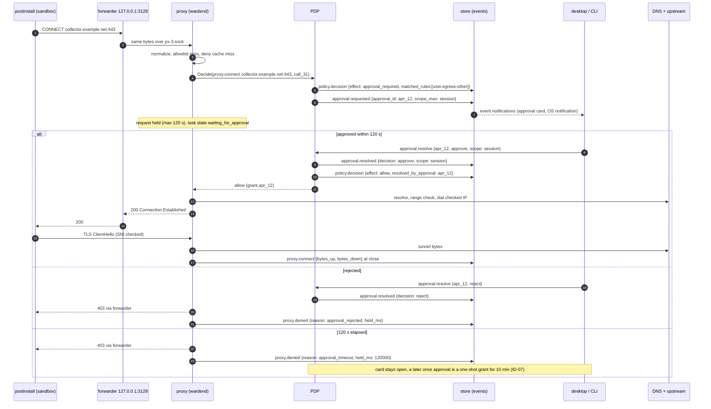

# A07 Egress proxy

`internal/proxy` is the only network exit for sandboxed processes (INV-5, F-TL-6). It runs inside `wardend`, opens one listener per sandbox, evaluates every connection against the task allowlist, hands unknown destinations to the PDP (approval or denial), resolves DNS itself with private-range protection, and records every attempt as `proxy.connect` or `proxy.denied`. It never terminates TLS in the PoC. Model provider traffic does not use this proxy: it originates in the daemon (WRD-10 §7).

Conflicts applied: CF-15 (CONNECT + plain HTTP only, no SOCKS5, no `ALL_PROXY`, macOS per-task port), CF-20 (allowlist formula), CF-19 (S1 flow), CF-22 (harness sandboxes get their own listener). Core §13.4 is the binding behavior.

## 1. Responsibilities and boundaries

| In scope | Out of scope (PoC) |
|---|---|
| HTTP/1.1 `CONNECT host:port` tunnels (TLS passthrough) | TLS interception, CA injection |
| Plain HTTP requests in absolute form (`GET http://host/path`) | SOCKS5, `ALL_PROXY`, HTTP/2 to the proxy, WebSocket over plain HTTP |
| Allowlist evaluation, PDP hand-off, 120 s approval hold | Wildcard allowlist entries |
| DNS resolution, SSRF and rebinding protection | Credential injection (hook present, never enabled) |
| Events with byte counters, rate limiting, timeouts | Bandwidth shaping, content inspection |

## 2. Per-task listener lifecycle

| Step | When | Detail |
|---|---|---|
| Open | `sandbox.Manager.Create`, before the sandbox process starts (the socket must exist to be bind-mounted, A06 §13.2) | Path `S/scratch/px-<n>.sock` (`S` = `~/.warden/sessions/<ulid>`, `n` = per-session sandbox counter). `S` and `S/scratch` are 0700; the socket is `chmod 0600` right after `bind`. If the path exceeds 100 bytes (macOS `sun_path` is 104), the socket goes to `$TMPDIR/warden-<uid>/<n>-<rand8>.sock` in a 0700 directory instead. The listener is created with the task allowlist and the sandbox id. |
| Serve | Until close | One goroutine per accepted connection. Peer credentials (`SO_PEERCRED` on Linux, `getpeereid` on macOS) must report the daemon's uid; otherwise the connection is closed without an event. |
| Update | During the task | `Allowlist.Add` is called by the agent loop when a `policy.decision(allow)` with `egress_allow` obligations is recorded for a call of this task, and by the proxy itself when an approval grants a host (§5). |
| Close | `sandbox.Manager.Destroy`, step 4 of A06 §13.3 | Stop accepting; answer every held request with `403` (reason `sandbox_destroyed`); close all tunnels; wait ≤ 1 s for copy goroutines; emit pending `proxy.connect` / `proxy.denied` and rate-limit summaries; unlink the socket. All proxy events of a sandbox are therefore written before its `sandbox.destroy`. |
| Startup cleanup | `wardend` start | Stale `px-*.sock` files of sessions are removed. |

The forwarder inside the sandbox (A06 §9) connects one Unix connection per TCP connection, so a listener sees exactly the connections of its sandbox. In Copilot `split` mode the harness sandbox and the tool sandbox have separate listeners with separate allowlists (CF-22).

## 3. Request handling

### 3.1 Parsing

The listener runs a minimal HTTP/1.1 reader (`http.ReadRequest` on a `bufio.Reader`, header limit 16 KiB, read deadline 10 s).

| Request form | Handling |
|---|---|
| `CONNECT host:port HTTP/1.1` (authority form) | §3.2. The `Host` header is ignored; the request target is authoritative. Port is required. |
| `METHOD http://host[:port]/path HTTP/1.1` (absolute form, `http` scheme) | §3.3. Default port 80. |
| Absolute form with `https://` | `400` (clients must use CONNECT for TLS); `proxy.denied{reason: unsupported_method}` |
| Origin form (`GET /path`), `Upgrade` requests, HTTP/2 preface | `400` / `501`; `proxy.denied{reason: unsupported_method}` |
| `Proxy-Authorization` header | Accepted and discarded; never forwarded, never logged |

### 3.2 CONNECT

1. Normalize the target (§4). Invalid → `400`, `proxy.denied{reason: invalid_target}`.
2. Evaluate (§5). Deny → `403` with a one-line body (`warden: egress to <host:port> denied: <reason>`), `proxy.denied`. Approval required → hold (§6).
3. Resolve and range-check (§7). Failure → `403`/`502`, `proxy.denied{reason: private_address | dns_failed}`.
4. Dial the checked IP (not the name). Failure → `502`, `proxy.connect{error: "dial_failed", bytes_up: 0, bytes_down: 0}`.
5. Reply `HTTP/1.1 200 Connection Established\r\n\r\n`.
6. **TLS check.** Read the first TLS record from the client (deadline 10 s, ≤ 16 KiB + 5). It must be a handshake record (`0x16`) containing a ClientHello (parsed with `golang.org/x/crypto/cryptobyte`). If the target is a DNS name, the `server_name` extension must equal it (case-insensitive, after IDNA normalization); if the target is an IP literal, SNI may be absent. Mismatch or non-TLS → close both sides, `proxy.denied{reason: sni_mismatch | not_tls}`. This prevents tunnelling to another tenant of the same CDN IP (for example a second site on the CDN serving `registry.npmjs.org`) without intercepting TLS. Encrypted ClientHello (outer SNI ≠ host) is refused the same way.
7. Write the buffered ClientHello upstream, then copy both directions (`io.Copy` with counting wrappers; `splice` is used automatically for TCP on Linux). Idle timeout 300 s (no bytes either direction). Half-close is propagated.
8. On close: `proxy.connect{bytes_up, bytes_down, duration_ms}`.

### 3.3 Plain HTTP

Steps 1 to 4 as above (the evaluated target is `host:port` from the URI), then:

- Build the outbound request in origin form; set `Host` from the URI (any client `Host` header is replaced, which blocks Host-header fronting over plain HTTP).
- Remove hop-by-hop headers in both directions: `Connection` and every header it lists, `Proxy-Connection`, `Keep-Alive`, `Proxy-Authenticate`, `Proxy-Authorization`, `TE`, `Trailer`, `Transfer-Encoding` (re-framed by `net/http`), `Upgrade`. Add no `Via` or `X-Forwarded-For`.
- Send with a dedicated `http.Transport{Proxy: nil, DialContext: <dial the checked IP>, ResponseHeaderTimeout: 60s, DisableKeepAlives: true}`; redirects are passed back to the client, never followed.
- One `proxy.connect{method: "GET"|…}` per request, with body byte counts.

## 4. Target normalization

`Normalize(authority) -> Target{Host, Port, IsIP}`:

1. Split host and port with `net.SplitHostPort`; a missing or non-numeric port, port 0 or > 65535 → `invalid_target` (port is always required; CONNECT without a port is refused).
2. IP literals: bracketed IPv6 is unbracketed; parse with `netip.ParseAddr`, which rejects octal, hex and short IPv4 forms (`0177.0.0.1`, `0x7f.1`, `127.1`); zones (`%eth0`) are refused. The canonical text form is used.
3. Names: lowercase, strip one trailing dot, IDNA `ToASCII` with the `idna.Lookup` profile (`golang.org/x/net/idna`); refuse empty labels, labels over 63 bytes, names over 253 bytes, and characters outside LDH after conversion. `localhost`, `*.localhost`, `*.local` and `*.internal` names are refused as `private_address` without resolution.
4. The key used everywhere (allowlist, grants, events, cache) is `host:port` in this canonical form, for example `registry.npmjs.org:443`, `xn--bcher-kva.example:443`, `10.0.0.5:8443`.

## 5. Allowlist evaluation

### 5.1 Formula (core §13.4, CF-20)

```
Allowlist(task) = ( manifest egress.allow ∩ policy allow )          # source: capability
                ∪ { egress_allow obligations of allowed calls in this task }   # source: obligation
                ∪ { approved proxy.connect grants in scope }        # source: grant (task/session/workspace)
Harness sandboxes (sandbox_purpose == harness): Allowlist = vendor allowlist of the harness   # source: harness; nothing else, no prompts (ID-12)
Tool sandboxes of split-mode harness tasks follow the normal formula above (ID-12)
```

- Matching is exact string equality on the canonical `host:port`. No wildcards, suffix matches or CIDR entries exist in the PoC; a policy or manifest entry containing `*` is rejected at load (`policy.reload.errors`), which satisfies INV-5 for `confidential` workspaces by construction and keeps the evaluation identical for all classifications.
- The `coder` manifest declares no `egress` block, so a coder task starts with an empty capability set; registry hosts arrive through the `user.package-install` obligation after the install approval (core §13.5).
- Obligation entries live for the rest of the task (not only for the call that carried them), because install scripts and later test runs reuse them.
- Grant entries are not copied into the allowlist up front; the first connection to a granted host goes to the PDP (§5.2 step 4), which matches the grant and returns `allow`; the proxy then caches the entry for the task.

### 5.2 Algorithm

```
Evaluate(t Target) -> Verdict{Effect, Rule, DecisionID, Reason}
 1. if t is in the task deny cache (host rejected earlier in this task, or a PDP deny < 60 s old): return deny (cached decision id)
 2. if entry := allowlist.Get(t.Key()); entry != nil: return allow(entry.Rule, entry.DecisionID)      # fast path, no PDP call
 3. if sandbox.purpose == harness: return deny(rule "platform.harness-egress-only") via PDP (one policy.decision, then cached)   # ID-12: harness sandboxes only
 3b. if a one-shot late-once grant exists for t in this task (§6, ID-07): consume it; return allow(grant.apr_…)
 4. d := pdp.Decide(ActionRequest proxy.connect t)                                                  # emits policy.decision
      allow            -> allowlist.Add(t, source=grant|policy, d.MatchedRules[0], d.ID); return allow
      deny             -> denyCache.Put(t, d, ttl 60 s); return deny
      approval_required-> return hold(d.Approval)                                                    # §6
```

`Rule` values in events: `capability.egress` (static manifest ∩ policy or harness vendor list; `decision_id: null`), the obligation's rule id (for example `user.package-install`, with the decision id that carried the obligation), `grant.apr_…` (with the re-evaluated allow decision id), or the PDP's first matched rule for denies.

### 5.3 ActionRequest sent to the PDP

```json
{
  "actor":  { "user": "local:ana", "agent": { "name": "coder", "version": "1.0.0" },
              "task_id": "tsk_01JAX…", "execution_id": "exe_01JAX…", "harness": null },
  "action": { "tool": "proxy", "operation": "connect", "risk_class": "R4",
              "resource": { "kind": "host", "host": "collector.example.net", "port": 443 },
              "args_redacted": { "method": "CONNECT", "sandbox_id": "sb_01JAX…", "call_id": "call_01JAX…" } },
  "context": { "workspace": { "id": "wsp_01JAX…", "classification": "internal", "root": "/Users/ana/src/injection-lab" },
               "task_classification": "internal",
               "task_egress_allow": ["registry.npmjs.org:443", "proxy.golang.org:443", "sum.golang.org:443", "pypi.org:443", "files.pythonhosted.org:443"],
               "environment": "interactive", "sandbox_level": "L1", "sandbox_purpose": "task",
               "taint": { "untrusted_external": false, "sources": [] },
               "task": { "key": "implement", "class": "implement", "mode": "implement" },
               "session_id": "ses_01JAX…" },
  "time": "2026-09-26T10:14:03.120Z"
}
```

`call_id` is the tool call currently running in that sandbox (tasks execute tool calls sequentially), so the approval card and the audit link the connection to `npm install` (`call_31` in the demo); it is `null` when no call is running. `policy.decision.call_id` carries the same value. With `user.egress-other` the PDP returns `approval_required` (`scope_max: session`); in `non_interactive` mode INV-8 turns that into `deny` unless a grant exists. `context.sandbox_purpose` (NEW, ID-12) is `harness` only for connections arriving on a harness sandbox's listener; there `platform.harness-egress-only` denies without a prompt. The tool sandbox of a split-mode Copilot task has `sandbox_purpose: task` and follows the normal rules above.

## 6. Denial to approval hand-off and the 120 s hold

- **Deduplication.** Held requests are keyed by `host:port` per task. The first request triggers one `pdp.Decide` (one `policy.decision`, one `approval.requested`); later requests to the same key wait on the same approval and produce no new decision events.
- **Hold.** The client connection is kept open without a response for up to 120 s (`proxy.hold_seconds`, not configurable above 120). While any approval of the task is pending, the orchestrator shows the task as `waiting_for_approval` (reason `approval_pending`) and pauses its wall clock (CF-38); the running process's own call timeout is not paused.
- **Outcomes.**

| Outcome | Proxy action | Events |
|---|---|---|
| Approved within 120 s (`approval.resolved{decision: approve, scope}`) | The PDP re-evaluates and emits `policy.decision{effect: allow, resolved_by_approval: apr_…, matched_rules: [grant.apr_…]}`; the proxy adds the entry (source `grant`) and continues with §3.2 step 3 for every waiter | `approval.resolved`, `policy.decision(allow)`, later `proxy.connect` per connection |
| Rejected (within or after the hold) | `403` to every waiter still held; the host is added to the task deny cache for the rest of the task (no repeated prompts for the same host, T-24) | `approval.resolved{decision: reject}`, `proxy.denied{reason: approval_rejected, held_ms}` per waiter |
| 120 s elapsed | `403` to every waiter; the approval stays pending (the card stays open, core §13.4) | `proxy.denied{reason: approval_timeout, held_ms: 120000}` |
| Approved after the hold ended (late approval, ID-07) | Scope `once`: the PDP converts it into a **one-shot grant** for the next identical `host:port` in the same task, valid 10 minutes (`approval.resolved.grant_expires_at` = resolution time + 10 min); the proxy consumes it on the next matching CONNECT (§5.2 step 3b) and it is then gone. Scope `task`/`session`/`workspace`: a normal grant; the next connection is allowed through the PDP (`grant.apr_…`) and cached for the task | `approval.resolved{decision: approve, scope, grant_expires_at}`; at the next connection `policy.decision{effect: allow, resolved_by_approval: apr_…}` then `proxy.connect` |
| Client closed while held | Stop waiting for that client; approval stays pending | `proxy.denied{reason: client_closed, held_ms}` |
| Sandbox destroyed while held | `403` | `proxy.denied{reason: sandbox_destroyed}` |

- **Limits.** At most 32 held requests and 8 distinct pending hosts per task; beyond that, new unknown hosts are denied immediately with `too_many_pending` (a hostile install script cannot flood the user with prompts).
- **Display.** The PDP fills `approval.requested.display` (A08, B07); for egress the proxy supplies `what: "Connect to collector.example.net:443"`, `who: "coder / implement, during npm install (call_…)"`, `why` from the rule reason.

### 6.1 Sequence: approval-held CONNECT



The diagram follows S3: after `npm install` was approved (its obligation added the registry hosts), the `postinstall` script tries `collector.example.net`. The proxy finds no allowlist entry, the PDP applies `user.egress-other`, and the connection waits at the proxy while the approval card is open. Event order on the session chain is `policy.decision(approval_required)`, `approval.requested`, then either `approval.resolved(approve)`, `policy.decision(allow)`, `proxy.connect`, or `approval.resolved(reject)`, `proxy.denied`, or `proxy.denied(approval_timeout)`. In the demo the user rejects, so S3 ends with `proxy.denied` while the tests still run. If the user approves with scope `once` only after the 120 s hold expired, the next identical CONNECT from the same task within 10 minutes is allowed exactly once (ID-07).

## 7. DNS resolution, SSRF and rebinding protection

- **Resolution in the daemon only.** The sandbox has no resolver (A06 §11.2, §10.1). The proxy calls `net.DefaultResolver.LookupNetIP(ctx, "ip", host)` with a 5 s timeout. Results are cached per task for 30 s, so all connections of a task within that window see the same answer.
- **Range check.** Every returned address is unmapped (`Addr.Unmap()`) and checked against the denied prefixes below. Addresses in a denied prefix are dropped. If none remain → `proxy.denied{reason: private_address}`. The only exception: the allowlist entry (or grant) names that literal IP (`10.0.0.5:8443`), in which case that exact address is allowed.
- **Connect to what was checked.** The dialer receives the checked `netip.Addr` values (at most 4, in resolver order, 10 s each, 20 s total), never the name, so a DNS answer cannot change between check and connect (rebinding protection).

| Denied prefix | Why |
|---|---|
| `0.0.0.0/8`, `127.0.0.0/8`, `::/128`, `::1/128` | Unspecified and loopback (host services) |
| `10.0.0.0/8`, `172.16.0.0/12`, `192.168.0.0/16` | RFC 1918 |
| `100.64.0.0/10` | CGNAT |
| `169.254.0.0/16`, `fe80::/10` | Link-local (cloud metadata endpoints) |
| `fc00::/7` | IPv6 ULA |
| `192.0.0.0/24`, `192.0.2.0/24`, `198.18.0.0/15`, `198.51.100.0/24`, `203.0.113.0/24`, `2001:db8::/32`, `100::/64` | Special purpose, benchmarking, documentation, discard |
| `224.0.0.0/4`, `240.0.0.0/4`, `255.255.255.255/32`, `ff00::/8` | Multicast, reserved, broadcast |
| `64:ff9b::/96`, `2002::/16` | NAT64 and 6to4: the embedded IPv4 address is extracted and checked; denied if it falls in any prefix above |

## 8. Harness allowlists

Harness sandboxes use only their vendor list (source `harness`), defined in `policy/platform-defaults.yaml` under `harness_egress` (NEW key). Every other destination from a harness sandbox is denied without a prompt (`platform.harness-egress-only`, which applies only when `context.sandbox_purpose == "harness"`, ID-12). The split-mode tool sandbox of the same task has an ordinary task allowlist and ordinary approvals. The lists below are the starting point and are **to be confirmed in week 5** from observed `proxy.denied` events with the real CLIs; telemetry and error-reporting hosts are left out unless a CLI fails without them.

| Harness | Initial allowlist (TBC week 5) | Left out on purpose |
|---|---|---|
| `copilot` | `api.githubcopilot.com:443`, `api.individual.githubcopilot.com:443`, `api.business.githubcopilot.com:443`, `api.enterprise.githubcopilot.com:443`, `github.com:443`, `api.github.com:443`, `copilot-proxy.githubusercontent.com:443` | `copilot-telemetry.githubusercontent.com`, `origin-tracker.githubusercontent.com`, `default.exp-tas.com` |
| `codex` | `chatgpt.com:443`, `api.openai.com:443`, `auth.openai.com:443` | `ab.chatgpt.com`, telemetry hosts |
| `claude-code` | `api.anthropic.com:443`, `console.anthropic.com:443` (token refresh; TBC) | `statsig.anthropic.com`, `sentry.io` |

Because T4 is never admissible for `confidential` data (core §3), these lists never apply to a `confidential` workspace.

## 9. Events

Both events go on the session chain with the sandbox's `task_id` and `execution_id`. Payload fields follow core §5; fields marked NEW are additions (A04 owns the final schemas).

```json
{
  "$schema": "https://json-schema.org/draft/2020-12/schema",
  "$id": "https://schemas.warden.dev/poc/events/proxy.json",
  "$defs": {
    "Base": {
      "type": "object",
      "required": ["sandbox_id", "host", "port", "method", "rule", "decision_id"],
      "properties": {
        "sandbox_id": { "type": "string", "pattern": "^sb_[0-9A-Z]{26}$" },
        "host": { "type": "string", "description": "Canonical host (§4)" },
        "port": { "type": "integer", "minimum": 1, "maximum": 65535 },
        "method": { "type": "string", "description": "CONNECT or the plain HTTP method" },
        "rule": { "type": ["string", "null"] },
        "decision_id": { "type": ["string", "null"] },
        "call_id": { "type": ["string", "null"], "description": "NEW: tool call running in the sandbox" }
      }
    },
    "ProxyConnect": {
      "allOf": [ { "$ref": "#/$defs/Base" } ],
      "type": "object",
      "required": ["bytes_up", "bytes_down"],
      "properties": {
        "ip": { "type": "string", "description": "NEW: address actually dialed" },
        "bytes_up": { "type": "integer", "minimum": 0 },
        "bytes_down": { "type": "integer", "minimum": 0 },
        "duration_ms": { "type": "integer", "minimum": 0, "description": "NEW" },
        "error": { "enum": ["dial_failed", "idle_timeout", "upstream_reset", null], "description": "NEW" }
      }
    },
    "ProxyDenied": {
      "allOf": [ { "$ref": "#/$defs/Base" } ],
      "type": "object",
      "required": ["reason", "held_ms"],
      "properties": {
        "reason": { "enum": ["policy_denied", "approval_rejected", "approval_timeout", "client_closed", "sandbox_destroyed",
                             "invalid_target", "unsupported_method", "private_address", "dns_failed", "sni_mismatch", "not_tls",
                             "too_many_connections", "too_many_pending", "rate_limited"] },
        "held_ms": { "type": "integer", "minimum": 0 },
        "count": { "type": "integer", "minimum": 1, "description": "NEW: >1 only on rate-limit summaries" }
      }
    }
  }
}
```

- `proxy.connect` is written when the tunnel or request closes, so it carries final byte counts (core §5). A tunnel still open at `sandbox.destroy` is closed and written then.
- Rate limiting: per task and per `host:port`, the first 20 denials are individual events; further denials are counted and written as one `proxy.denied{reason: rate_limited, count}` when the listener closes. Allowed connections are never summarized.
- Events never contain request paths, headers, bodies or query strings (plain HTTP paths can carry data); only host, port, method and counters.

## 10. Timeouts and limits

| Item | Value |
|---|---|
| Read request line and headers | 10 s, 16 KiB |
| Approval hold | 120 s |
| DNS lookup | 5 s; per-task cache 30 s |
| Dial | 10 s per address, at most 4 addresses, 20 s total |
| TLS ClientHello peek | 10 s, one record (≤ 16 KiB) |
| Tunnel idle timeout | 300 s without bytes in either direction |
| Plain HTTP response headers | 60 s |
| Concurrent tunnels per task | 64; the 65th waits up to 10 s, then `503` and `proxy.denied{reason: too_many_connections}` |
| Held requests / distinct pending hosts per task | 32 / 8 |
| Denial events per `host:port` per task | 20, then summarized |

Defaults live in `config.yaml` under `proxy.*` and may only be lowered.

## 11. Credential injection hook (present, unused)

WRD-10 §7 describes injection with TLS termination for private registries; WRD-16 §10.4 keeps only the hook. The code path exists so the MVP does not change the proxy's structure:

```go
// CredentialInjector adds credentials host-side. PoC: only noInjector exists.
type CredentialInjector interface {
    // Match reports whether this target would receive injected credentials.
    Match(t Target) bool
    // Inject mutates outbound headers of a plain-HTTP request (or, in a future
    // TLS-terminating mode, of the decrypted request). It resolves secret://
    // references through internal/secrets and emits secret.access{consumer:"proxy"}.
    Inject(ctx context.Context, t Target, h http.Header) error
}

type noInjector struct{}

func (noInjector) Match(Target) bool                                        { return false }
func (noInjector) Inject(context.Context, Target, http.Header) error        { return nil }
```

`Proxy.injector` is set to `noInjector{}` in the constructor; no configuration key selects another implementation, and a unit test asserts that `Match` is false for every target in the test corpus and that no `secret.access{consumer: proxy}` event is ever emitted.

## 12. Go sketches

```go
package proxy

type Target struct {
    Host string // canonical (§4)
    Port uint16
    IP   netip.Addr // set when the authority is an IP literal
}
func (t Target) Key() string

type Source string // "capability" | "obligation" | "grant" | "harness"

type Entry struct {
    Key        string
    Source     Source
    Rule       string
    DecisionID string // "" for capability/harness entries
}

type Allowlist struct {
    mu      sync.RWMutex
    entries map[string]Entry
}
func (a *Allowlist) Get(key string) *Entry
func (a *Allowlist) Add(e Entry)
func (a *Allowlist) Keys() []string // context.task_egress_allow for the PDP

// Decider is implemented by internal/policy; the proxy never evaluates rules itself.
type Decider interface {
    DecideEgress(ctx context.Context, req EgressRequest) (Decision, error)
    // WaitApproval blocks until the approval is resolved or ctx ends; it returns the
    // re-evaluated decision (allow with resolved_by_approval, or deny).
    WaitApproval(ctx context.Context, approvalID string) (Decision, error)
}

type EgressRequest struct {
    Task      TaskRef // session, task, execution ids, key, class, mode, purpose
    SandboxID string
    SandboxPurpose string // context.sandbox_purpose (ID-12)
    CallID    string
    Target    Target
    Allowlist []string
}

type Resolver interface {
    LookupNetIP(ctx context.Context, network, host string) ([]netip.Addr, error)
}

type EventSink interface {
    ProxyConnect(ctx context.Context, ev ConnectEvent) error
    ProxyDenied(ctx context.Context, ev DeniedEvent) error
}

type TaskProxy struct {
    SandboxID  string
    Task       TaskRef
    Listener   net.Listener
    Allow      *Allowlist
    denyCache  *ttlCache
    pending    map[string]*pendingApproval // key: host:port
    oneShot    map[string]oneShotGrant     // late once approvals (ID-07): key host:port, expires 10 min after resolution, consumed on use
    sem        chan struct{}               // concurrency limit (64)
    decider    Decider
    resolver   Resolver
    events     EventSink
    injector   CredentialInjector // noInjector in the PoC
}

type Manager interface {
    Open(ctx context.Context, sandboxID string, task TaskRef, initial []Entry, sandboxPurpose string) (*TaskProxy, Endpoint, error) // "task" | "harness" (ID-12)
    Close(ctx context.Context, sandboxID string) error // flushes events before returning
}

type Endpoint struct {
    SocketPath string
    Port       int // 3128 on Linux/L2; per-task port on macOS (A06 §9)
}
```

## 13. Tests

| Test | Assertion |
|---|---|
| Normalization table | `EXAMPLE.org.:443` → `example.org:443`; IDNA; `0177.0.0.1`, `127.1`, `[fe80::1%en0]` refused; missing port refused |
| Range table | Every prefix in §7, IPv4-mapped IPv6 (`::ffff:127.0.0.1`), NAT64 and 6to4 embeddings denied; literal-IP allowlist entry allowed |
| Rebinding | Fake resolver returns a public IP then `127.0.0.1`; the dial target equals the checked address; the second lookup within 30 s is served from cache |
| SNI | Mismatched SNI and ECH-style outer name closed with `sni_mismatch`; non-TLS bytes closed with `not_tls` |
| Hold | Approve at 5 s → tunnel established, event order as §6.1; reject → 403, `proxy.denied(approval_rejected)` and deny cache; 120 s → 403 with `held_ms: 120000`; late `once` approval allows exactly one next identical CONNECT within 10 min and not a second one; late approval after 10 min allows nothing (ID-07) |
| Dedup and flood | 50 concurrent CONNECTs to one host → one `policy.decision`, one `approval.requested`; 9 distinct unknown hosts → the 9th gets `too_many_pending`; 1,000 denials → 20 events + 1 summary |
| Harness | In a harness sandbox, vendor host allowed without PDP and any other host denied without a prompt; in the split-mode tool sandbox of the same task, an unknown host gets the normal approval prompt (ID-12) |
| Plain HTTP | Hop-by-hop and `Proxy-Authorization` stripped; `Host` rewritten; redirect returned, not followed |
| Lifecycle | Close during a tunnel and during a hold: events flushed before `sandbox.destroy`; socket removed; mode 0600 checked |
| Escape check (A06 §16) | `curl` via the proxy to an unlisted host → `proxy.denied`; to `registry.npmjs.org` after install approval → `proxy.connect` |

## Traceability

| Design element | WRD source (doc §) | Requirement / invariant satisfied |
|---|---|---|
| Per-task Unix-socket listener, 0600, lifecycle bound to the sandbox (§2) | WRD-16 §5.1, §10.4; WRD-10 §7; WRD-02 §3, §6 | INV-5, F-TL-6, S-2 |
| CONNECT and plain HTTP only (§3) | WRD-16 §10.4; CF-15 | INV-5 |
| SNI equality check without interception (§3.2) | WRD-10 §7 (TLS passthrough), T-04 | INV-5, T-04 |
| Normalization, exact `host:port`, no wildcards (§4, §5.1) | WRD-08 §5 INV-5; WRD-10 §7 | INV-5, BI-7 (no widening for confidential) |
| Allowlist formula with obligations and grants (§5) | WRD-16 §10.4, §10.6; WRD-10 §7; CF-20; core §13.4, §13.5 | BI-1 (PDP decides new hosts), F-TL-6 |
| PDP hand-off, 120 s hold, dedup, deny cache (§6) | WRD-16 §3 step 4, §4.3 S1, S3; WRD-08 §7, §9; WRD-11 (prompts never auto-dismiss) | BI-1, INV-8, T-24 |
| DNS in the daemon, private ranges, connect to checked IP (§7) | WRD-16 §10.4; WRD-10 §5.1, §7; core §13.4 | T-04, S-2 |
| Harness vendor-only allowlists, scoped to harness sandboxes (§8) | WRD-16 §10.4; WRD-05 §9; WRD-10 §7; CF-22; core ID-12 | T-13, T-14 |
| Late `once` approval becomes a 10-minute one-shot grant (§6) | core ID-07; WRD-08 §7 | BI-1 (still a decision per connection), T-24 |
| `proxy.connect` / `proxy.denied` with counters (§9) | WRD-09 §3; WRD-16 §11; core §5 | H2, H5, S1/S3 visible in UI |
| Credential injection hook unused (§11) | WRD-16 §10.4; WRD-10 §7 | BI-3 (no credentials enter the proxy path in the PoC) |
| Model traffic not via proxy | WRD-10 §7; WRD-16 §6.2 | BI-3 |

## Deviations and assumptions

- DEV: the proxy adds an SNI equality check on CONNECT tunnels (not in WRD-16 §10.4). It inspects only the unencrypted ClientHello and does not terminate TLS, so it stays within "TLS passthrough".
- DEV: no wildcard entries anywhere in the PoC (WRD-10 §7 and INV-5 only forbid `*` for `confidential`/`restricted`). Harness lists are enumerated exactly instead.
- DEV: a rejected egress approval puts the host in a task-level deny cache, so the user is not asked again for the same host in the same task (WRD-08 does not specify repeat prompts).
- DEV: `localhost`, `*.localhost`, `*.local`, `*.internal` are refused without resolution.
- NEW: `context.sandbox_purpose` in the egress ActionRequest (core ID-12); one-shot late-once grants consumed by the proxy (core ID-07).
- NEW: event fields `call_id`, `ip`, `duration_ms`, `error` (on `proxy.connect`), `count` (on `proxy.denied`); `proxy.denied.reason` enumeration; `policy/platform-defaults.yaml` key `harness_egress`; `config.yaml` keys `proxy.*`.
- ASM: the orchestrator (A13) marks a task `waiting_for_approval` while an egress approval of that task is pending, and back to `running` when it resolves or the hold times out; the tool call's own timeout keeps running.
- ASM: A08's PDP exposes a blocking `WaitApproval` (or an equivalent callback) and emits the second `policy.decision(allow, resolved_by_approval)` for egress approvals exactly as for tool calls (core §13.1), so `audit verify --strict` sees the same pattern.
- ASM: the agent loop (A10) calls `Allowlist.Add` for `egress_allow` obligations when it records the allow decision for the call that carried them, before sending `exec.proc.spawn`.
- ASM: `policy.decision.call_id` may be the running tool call's id for `proxy.connect` requests (it is not a separate model tool call). A04/A08 should accept `call_id: null` for egress decisions outside a call.
- OQ candidate: harness allowlists (§8) must be confirmed in week 5; recommended answer: record 30 minutes of normal harness use with all non-listed hosts denied, add only hosts whose denial breaks the harness, and keep telemetry hosts denied.
- OQ candidate: should a per-task egress byte cap exist (for example 1 GiB) as an exfiltration bound? Recommended: not in the PoC (installs can be large); record `bytes_up` and review in the PoC report.
