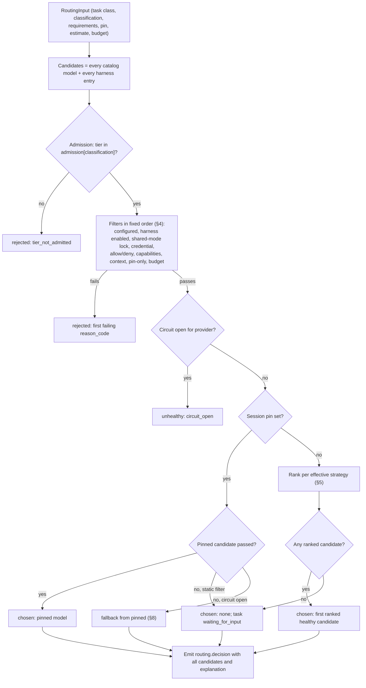
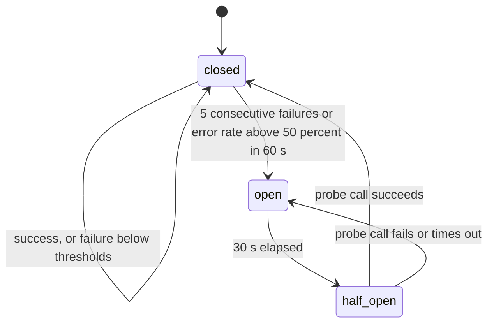
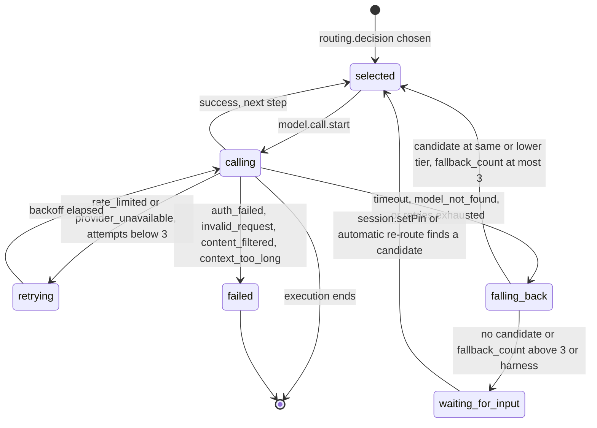

# A09 Model router

Package `internal/router`. The router answers, for every execution of a model-backed task, which provider and model **may** (admission by data classification and trust tier) and **should** (capabilities, strategy, quality, cost, health) handle it; it keeps answering "may" before every model call, retries and falls back without ever widening the tier, and explains every choice to the UI. It never trades "may" for "should" (WRD-06 §1). Names follow `00-DESIGN-CORE.md`; conflict resolutions are cited as CF-xx.

Scope in the PoC: tiers T0 to T4, strategies `prefer-internal` (default), `quality-first`, `cost-first`, `latency-first`, per-session pin, tier-bounded fallback, per-provider circuit breaker (WRD-16 §2.1, §5.1, §6.3). Out of scope: WRD-06 `exceptions` and `data_agreement` admission (CF-04), `restricted` (CF-02), path-level classification overrides and taint-driven re-routing (WRD-16 §2.3), quota budgets for harnesses (`daily_premium_requests`).

## 1. Inputs

### 1.1 Catalog (`~/.warden/models.yaml`, WRD-16 §6.1)

The router reads the catalog loaded by the daemon (A11 owns parsing and `provider.add/remove/test`). Fields used:

| Entry | Fields used by the router |
|---|---|
| `providers[]` | `id`, `protocol`, `base_url`, `auth.mode` (+ `kind`, `secret`), `tier` |
| `harnesses[]` | `id`, `kind`, `billing`, `vendor_terms`, `tier`, `enabled`, `quality_prior` (NEW, optional map, display only) |
| `models[]` | `id`, `provider`, `capabilities{tool_calling, structured_output, streaming, max_context, max_output}`, `pricing{input_per_mtok, output_per_mtok, currency}` or null, `quality_prior{plan, implement, verify, summarize}` |

Effective capabilities = the last successful `provider.test` probe result for that model where present (tool calling native/emulated/none, structured output, max context), else the catalog values (WRD-05 §2, §7).

Catalog checks that affect routing (evaluated at load and on `provider.configured`):

- A provider declared `tier: T0` whose `base_url` host is not a loopback address (`127.0.0.0/8`, `::1`, `localhost`) is treated as unconfigured for routing, reason "T0 providers must listen on loopback (WRD-05 §10); declare this endpoint as T1". This prevents a remote endpoint from being admitted to `confidential` data by mislabeling.
- A harness must be `tier: T4` (CF-42); otherwise it is unconfigured for routing.
- A harness is addressable as a model id equal to its harness id (`copilot`), core §2.

### 1.2 Routing configuration (from the policy snapshot, A08 §3)

| Key | Source | PoC value |
|---|---|---|
| `admission` | user `routing.admission`, validated as a subset of the platform ceiling (A08 §3.3) | `confidential: [T0,T1,T2]`, `internal: [T0..T4]`, `public: [T0..T4]` (CF-03, CF-04) |
| `strategy.default` | user, else platform | `prefer-internal` |
| `strategy.by_task_class` | user | `{verify: cost-first, summarize: cost-first}` |
| `strategy.quality_threshold` (θ) | user, else platform | `0.5` (CF-05) |
| `pins.allow_user_pin` | user, else platform | `true` |
| Budgets | user `budgets` | `session_usd: 5`, `daily_usd: 15` (CF-07) |

The router takes a new configuration on every successful `policy.reload`; running executions keep their chosen model but the next `Recheck` (§9) uses the new admission table.

### 1.3 Routing input object

Built by the agent loop (A10) at the start of each execution, and by the router itself for fallback, recheck and preview.

```json
{
  "$schema": "https://json-schema.org/draft/2020-12/schema",
  "$id": "https://schemas.warden.dev/poc/router/routing-input.json",
  "title": "RoutingInput",
  "type": "object",
  "additionalProperties": false,
  "required": ["routing_id", "purpose", "session_id", "task_class", "classification", "agent", "model_requirements", "pin", "estimate", "budget", "exclude", "tier_ceiling", "runtime_mode"],
  "properties": {
    "routing_id": { "type": "string", "pattern": "^rt_" },
    "purpose": { "enum": ["initial", "fallback", "recheck", "preview"] },
    "session_id": { "type": "string" },
    "run_id": { "type": ["string", "null"] },
    "task_id": { "type": ["string", "null"] },
    "task_key": { "type": ["string", "null"] },
    "execution_id": { "type": ["string", "null"] },
    "task_class": { "enum": ["plan", "implement", "verify", "summarize"], "description": "repair routes as implement" },
    "classification": { "enum": ["public", "internal", "confidential"] },
    "agent": {
      "type": "object", "additionalProperties": false, "required": ["name", "version"],
      "properties": { "name": { "type": "string" }, "version": { "type": "string" } }
    },
    "model_requirements": {
      "type": "object", "additionalProperties": false,
      "required": ["required_capabilities", "min_context_tokens", "allow_models", "deny_models", "strategy", "max_output_tokens"],
      "properties": {
        "required_capabilities": { "type": "array", "items": { "enum": ["tool_calling", "structured_output", "vision", "reasoning", "long_context"] } },
        "min_context_tokens": { "type": "integer", "minimum": 0 },
        "allow_models": { "type": "array", "items": { "type": "string" } },
        "deny_models": { "type": "array", "items": { "type": "string" } },
        "strategy": { "enum": ["prefer-internal", "quality-first", "cost-first", "latency-first", null] },
        "max_output_tokens": { "type": "integer", "minimum": 1, "description": "manifest generation.max_output_tokens, default 4096" }
      }
    },
    "pin": { "type": ["string", "null"], "description": "Session pin (model id or harness id)" },
    "estimate": {
      "type": "object", "additionalProperties": false, "required": ["input_tokens"],
      "properties": { "input_tokens": { "type": "integer", "minimum": 0 } }
    },
    "budget": {
      "type": "object", "additionalProperties": false,
      "required": ["task_remaining_usd", "session_remaining_usd", "daily_remaining_usd"],
      "properties": {
        "task_remaining_usd": { "type": "number" },
        "session_remaining_usd": { "type": "number" },
        "daily_remaining_usd": { "type": "number" }
      }
    },
    "exclude": {
      "type": "array",
      "items": {
        "type": "object", "additionalProperties": false, "required": ["model_id", "provider_id", "scope"],
        "properties": {
          "model_id": { "type": "string" },
          "provider_id": { "type": "string" },
          "scope": { "enum": ["model", "provider"] },
          "cause": { "type": "string" }
        }
      }
    },
    "tier_ceiling": { "enum": ["T0", "T1", "T2", "T3", "T4", null], "description": "Fallback only: tier of the failed candidate" },
    "harness_rejected": { "type": "array", "items": { "type": "string" }, "description": "Harness ids whose start the user rejected in this session" },
    "runtime_mode": { "enum": ["personal", "shared"] }
  }
}
```

The task classification equals the workspace classification in the PoC (no path overrides, WRD-16 §2.3). Budgets remaining are computed by the session (A10/A13) from recorded `model.call.end` costs: task = manifest `limits.max_cost_usd` minus the execution's spend; session = `budgets.session_usd` (or the raised value, `budget.changed`) minus the session's spend; daily = `budgets.daily_usd` minus today's spend (local day of the daemon).

## 2. Pipeline



The router evaluates every catalog entry, not only the ones that could win, so that the `routing.decision` event and the UI can say why each other model was not used. Admission is always first and is never bypassed: a pin skips ranking, not admission (WRD-16 §6.3). A pinned model that fails a static filter (for example it is not admitted any more, or a credential is missing) is not silently replaced: the task pauses and the user decides. A pinned model whose provider circuit is open is treated like a failed call and goes through the tier-bounded fallback (core §13.7). Health is evaluated after the static filters, so an unhealthy but otherwise admissible model is reported as `unhealthy`, not `rejected`.

## 3. Admission by tier and classification

| Classification | Admitted tiers (PoC) | Source |
|---|---|---|
| `confidential` (default) | T0, T1, T2 | WRD-16 §6.3; CF-04: no `data_agreement` exception, the field is parsed and ignored |
| `internal` | T0, T1, T2, T3, T4 | WRD-16 §6.3; CF-03 (T4 admitted; `tolerated` harnesses additionally need `user.harness-tolerated` approval at start, A08) |
| `public` | T0, T1, T2, T3, T4 | WRD-16 §6.3 |
| `restricted` | not accepted (`unsupported_in_poc`, CF-02) | |

Rule: `admitted(c) = tier(c) ∈ admission[classification]`, where `tier(c)` is the provider's tier for a model and the harness entry's tier for a harness. Failing candidates get `status: rejected`, `reason_code: tier_not_admitted`. This is the enforcement point of BI-7 for model calls; §9 repeats it before every call so that a classification change takes effect mid-task.

## 4. Filters

Each admitted candidate passes the filters in this order; the first failing filter sets `reason_code` and `reason` (strings in §11.3). The order puts administrative and security reasons before fitness reasons so that the UI shows the real blocker (for example a disabled harness is reported as disabled, not as "not pinned").

| # | Filter | Rejection code | Rule |
|---|---|---|---|
| 1 | Provider configured | `provider_unconfigured` | The model's provider exists in `providers[]`, is enabled, and passes the catalog checks of §1.1; for a harness, the entry exists and its binary was found by `system.doctor` |
| 2 | Harness enabled | `harness_disabled` | Harness `enabled: true` and `vendor_terms ≠ prohibited` (INV-7; `prohibited` cannot be enabled) |
| 3 | Shared-mode lock | `harness_locked_shared_mode` | Not (`vendor_terms == personal_use_only` and `billing == subscription_personal` and runtime mode `shared`) (CF-21) |
| 4 | Credential present | `credential_missing` | `auth.mode none`: always present. `api_key` / `gateway bearer`: the keychain entry named by `auth.secret` exists. `gateway mtls`: client certificate file and keychain key exist. Harness: the vendor login file exists (path known to A12). Checked through `secrets.Exists(ref)`, which never returns the value; the result is cached per provider and refreshed on daemon start, `provider.add`, `provider.remove` and `provider.test` |
| 5 | Allow and deny lists | `denied_by_policy` | Manifest `deny_models` globs do not match the id; if `allow_models` is non-empty, one of its globs matches; the harness is not in `harness_rejected` (the user rejected its start in this session, A08 `user.harness-tolerated`) |
| 6 | Capabilities | `capability_missing` | Every `required_capabilities` flag is satisfied: `tool_calling` needs `native` or `emulated` (WRD-05 §7); `structured_output`, `vision`, `reasoning` need `true`; `long_context` needs `max_context ≥ 100000`. Harnesses satisfy `tool_calling` (runtime tools are registered through the SDK or hooks, A12) and nothing else |
| 7 | Context size | `context_too_small` | `max_context ≥ min_context_tokens` (WRD-05 §10). Skipped for harnesses, which manage their own context (ASM) |
| 8 | Pin-only harnesses | `harness_not_pinned` | A harness is a candidate only when it is the session pin (core §13.7). Not applied in preview (§11.4) |
| 9 | Budget | `over_budget` | `est_cost_usd ≤ min(task_remaining_usd, session_remaining_usd, daily_remaining_usd)`. Candidates with cost class `zero`, `unknown` or `quota` (§5.3) always pass |
| 10 | Health | `circuit_open` (status `unhealthy`) | The provider's breaker is `closed`, or `half_open` and this routing acquires the single probe token (§7) |

Candidates that pass 1 to 10 have status `admitted` (and one of them becomes `chosen`). The count of `admitted` plus `chosen` is the "N candidates" in the explanation (§11.2).

## 5. Ranking

### 5.1 Effective strategy (CF-06)

```
strategy = routing.strategy.by_task_class[task_class]      if set
        else manifest spec.model.strategy                  if set
        else routing.strategy.default
```

PoC result: `plan`, `implement` (and `repair`, which routes as `implement`) → `prefer-internal` (coder manifest); `verify` → `cost-first` (policy `by_task_class`; the verifier manifest agrees); `summarize` → `cost-first`.

`verify` is routed only when a model is actually needed (ID-09): the runtime runs the build and test profiles first; if the build exits 0 and `failed == 0`, `test-report.analysis` is generated deterministically and **no `routing.decision` and no `model.call.*` events** are emitted for that `verify` execution. The router is called (with `task_class: verify`) only when there are failures to analyse. WRD-06 §5 says the workspace default is `prefer-internal` "when a T0/T1 provider exists, else quality-first"; with no T0/T1 candidate the prefer-internal ordering below degenerates to exactly the quality-first ordering, so no separate switch is needed.

### 5.2 Quality priors

| Case | Prior used |
|---|---|
| Model with `quality_prior[task_class]` | That value (`repair` uses `implement`) |
| Model without `quality_prior`, or without the task class key | **0.4** (ASM): below θ = 0.5, so an unevaluated model is never preferred by `prefer-internal` group A or by the `cost-first` threshold, but it remains usable when nothing else qualifies |
| Harness with `quality_prior[task_class]` (NEW optional field) | That value, display only |
| Harness without it | 0.7, display only (harnesses are pin-only and never ranked) |

Priors are static numbers in the PoC (WRD-16 §2.3); they are shown in the candidate list and the ModelPicker.

### 5.3 Estimated cost

```
est_input_tokens  = RoutingInput.estimate.input_tokens
                    (agent loop estimate of the next request: system prompt + tool definitions + task input
                     + injected artifact summaries on the first call, the current transcript afterwards;
                     ceil(utf8_bytes / 4) unless the adapter's CountTokens is exact, ASM)
est_output_tokens = min(model.capabilities.max_output, model_requirements.max_output_tokens)   # default 4096
est_cost_usd      = round4((est_input_tokens * pricing.input_per_mtok
                           + est_output_tokens * pricing.output_per_mtok) / 1e6)
```

| Cost class | Condition | `est_cost_usd` | Rank key `cost_key` | UI text |
|---|---|---|---|---|
| `zero` | `pricing: null` and tier T0 or T1 | `0.0` | 0 | `0.00 (local)` or `0.00 (company-hosted; infrastructure cost not tracked)` |
| `priced` | `pricing` present, currency USD | computed | the value | `$0.09 est.` |
| `unknown` | `pricing: null` and tier T2 or T3 | `null` | +∞ − 1 | `cost unknown` |
| `quota` | harness | `null` | +∞ | `quota (premium requests)` |

Example: T1 plan with `est_input_tokens = 9,800` on `anthropic/claude-sonnet` (3.00 / 15.00 per MTok, `max_output` 64,000, manifest default 4,096): (9,800 × 3.00 + 4,096 × 15.00) / 10⁶ = 0.0294 + 0.0614 = **0.0908 USD**. Cached-input pricing is ignored in the estimate. Actual costs come from `model.call.end.usage.estimated_cost` (A10, A11).

### 5.4 Ordering keys per strategy (core §13.7)

Sorting is lexicographic on the tuple; θ = `quality_threshold` (0.5); `prior` is the §5.2 value for the task class; ties always end with `tier` ascending (more internal first) and `model_id` ascending, so ranking is deterministic.

| Strategy | Sort tuple | Notes |
|---|---|---|
| `prefer-internal` | (`group` asc, `prior` desc, `cost_key` asc, `tier` asc, `model_id` asc) with `group = 0` if `tier ∈ {T0, T1}` and `prior ≥ θ`, else `1` | Group 0: internal models good enough for the task class; group 1: everything else, still by prior then cost (WRD-06 §6 step 3) |
| `quality-first` | (`prior` desc, `cost_key` asc, `tier` asc, `model_id` asc) | |
| `cost-first` | (`below` asc, `bucket` asc, `est_cost_usd` asc, `prior` desc, `tier` asc, `model_id` asc) with `below = 1` if `prior < θ` and at least one candidate has `prior ≥ θ`, else `0`; `bucket`: zero 0, priced 1, unknown 2, quota 3 | "Known-zero first, then priced ascending, quota-billed last"; candidates below θ sink to the end and are used only if nothing else remains (WRD-06 §6) |
| `latency-first` | (`p50_ttft_ms` asc with unknown = +∞, `prior` desc, `tier` asc, `model_id` asc) | p50 from the health window (§7); not used by the PoC defaults |

Candidates keep `status: admitted` with a `reason` that states their rank ("Ranked 2 of 3: …").

## 6. Selection and pin semantics

### 6.1 Selection

- **No pin:** the first ranked candidate whose provider is healthy (breaker `closed`, or `half_open` with the probe token acquired) is `chosen`. Harnesses never appear in the ranked list (filter 8).
- **Pin set:** the pinned id is looked up among all candidates.
  - It passed admission and filters 1 to 9 and its breaker allows a call → `chosen`, reason "Pinned by you".
  - It failed admission or a static filter (1 to 7, 9) → no model is chosen; `routing.decision` has `chosen: null` and the explanation of §11.2; the task goes to `waiting_for_input` with reason `no_admissible_model`. The router never substitutes another model for a pin on its own (figure `routing_decision`: "never silent downgrade").
  - Its breaker is open → treated as a failure of the pinned model with cause `provider_unavailable`: tier-bounded fallback (§8), and the routing line says the pin could not be honored.
- **Stickiness:** one model per execution unless a fallback happens (core §13.7). A new execution (the next task, a retry attempt, a repair round) routes again from scratch.
- **No candidate** (nothing admitted and passing filters) → `chosen: null`, task `waiting_for_input` (`no_admissible_model`), UI state ST-3 with the constraint that eliminated everything (WRD-06 §6 step 6).

### 6.2 Per-session pin

| Aspect | Rule |
|---|---|
| Set | `session.request {pin_model: "<model or harness id>"}` (`warden run --pin <id>`) or `session.setPin {session_id, pin_model}` (NEW, ID-04; `warden pin <model-id>`, ModelPicker, the "Continue on …" action) |
| Persistence | Stored on the session record (the value is visible in `session.request.pin_model` when set there; A05 defines how `session.setPin` is recorded); applies to later requests of the session that omit `pin_model` |
| Clear | `session.request {pin_model: null}` or `session.setPin {pin_model: null}` (`warden pin --clear`) |
| Applies to | Every model-backed task of every run in the session: `plan`, `implement`, `repair`, `verify`, `summarize`. A harness pin makes these tasks harness tasks (A12) |
| Allowed | Only if `routing.pins.allow_user_pin` is true; otherwise `session.request` with a pin and `session.setPin` fail with `-32004 policy_denied` |
| Validation at request time (both methods) | Unknown id → `-32002 not_found`. The pinned candidate is evaluated with the current classification: `harness_locked_shared_mode`, or `harness_disabled` because of `prohibited` terms → `-32012 vendor_terms`; `over_budget` → `-32008 budget_exhausted`; `tier_not_admitted` or any other static filter failure → `-32007 no_admissible_model`. The error message is the §11.3 reason string. The run is not started, or for `session.setPin` the pin is unchanged ("pin within admission only", core §6) |
| Later changes | A pin that becomes inadmissible later (classification tightened) is handled by `Recheck` (§9) and by the next task's routing (§6.1) |
| Effect on paused tasks | `session.setPin` immediately re-routes every task of the session in `waiting_for_input` with reason `no_admissible_model` or `provider` (§9.1, ID-04) and returns `rerouted_task_ids[]` |

The pin never widens admission: pinning `anthropic/claude-sonnet` on a `confidential` workspace is refused at request time, and a pinned T3 model in a workspace that becomes `confidential` pauses at its next model call.

## 7. Health and circuit breaker

One breaker per provider id (and per harness id), shared by all sessions of the daemon (WRD-06 §8, WRD-16 §5.1).

| Parameter | Value |
|---|---|
| Counted as failure | Normalized errors `provider_unavailable`, `timeout`, `rate_limited` (every attempt, including retries) |
| Not counted | `auth_failed`, `invalid_request`, `context_too_long`, `content_filtered`, `tool_format_unsupported`, `model_not_found`, `cancelled` (caller or configuration problems, not provider health). `auth_failed` instead marks the provider's credential as invalid, which makes filter 4 fail until `provider.test` succeeds |
| Counted as success | A call that ends with a `message_end` (any stop reason) |
| Open condition | 5 consecutive failures, **or** error rate > 50 % over the last 60 s with at least 4 outcomes in the window (minimum sample, ASM) |
| Open duration | 30 s, then `half_open` (evaluated lazily when the next routing asks) |
| Half-open | Exactly one probe: the next real routed call acquires a probe token; other routings see the provider as `unhealthy` until the probe reports. A token not reported within the call's own timeout counts as a failure |
| Probe success | `closed`; consecutive count and window reset |
| Probe failure | `open` for another 30 s |
| Rate-limit hints | `retry_after_ms` from the adapter (WRD-05 §4) is used by the retry policy (§8.2); it is not a routing filter |
| Latency | p50 of `ttft_ms` over the last 50 successful calls, for `latency-first` |



The breaker starts `closed`; every counted outcome updates the consecutive-failure counter and the 60-second window. When a threshold is crossed it opens and all routings report the provider's models as `unhealthy` with `reason_code: circuit_open`. After 30 seconds the next routing that selects one of its models receives the single probe token and makes a real call; its outcome closes or re-opens the breaker. Breaker transitions are not events of their own (the event registry has none, ASM); they are visible in `routing.decision` candidates (`unhealthy`), in `routing.fallback` causes, and in `provider.list` status (A05).

## 8. Retry and fallback

### 8.1 Error handling table

The adapter normalizes errors to WRD-05 §4 codes (A11); the agent loop hands every failed call to `Router.HandleError`, which returns the next action.

| Code | Retry the same model | Fallback | If neither |
|---|---|---|---|
| `rate_limited` | Up to 3, honoring `retry_after_ms` | Yes, after retries are exhausted (WRD-06 §7) | |
| `provider_unavailable` | Up to 3 | Yes, after retries | |
| `timeout` | No | Yes | |
| `model_not_found` | No | Yes; the model is excluded for the rest of the session | |
| `auth_failed` | No | No | Task `failed(provider)`; message "credentials for {provider} were rejected; run warden provider test {provider}" |
| `context_too_long` | No (the agent loop compacts and retries once, A10) | No | Task `failed(provider)` |
| `content_filtered`, `invalid_request` | No | No | Task `failed(provider)` |
| `tool_format_unsupported` | No (the adapter switches to emulated tool calling once, A10/A11) | No | Task `failed(provider)` |
| `cancelled` | No | No | Cancellation path (A13) |

Each attempt is its own model call (`model.call.start` / `model.call.end` with `error{code, retryable}`), so retries are visible in the timeline and counted by the breaker.

### 8.2 Backoff

```
attempt n = 1..3:
  base   = min(20 s, 1 s * 2^(n-1))                 # 1 s, 2 s, 4 s
  jitter = uniform(0, base)                          # full jitter
  delay  = jitter
  if retry_after_ms present:
      if retry_after_ms > 60 000: skip remaining retries, go to fallback
      delay = retry_after_ms + uniform(0, 250 ms)
```

Retries consume execution wall-clock time (they are not a waiting state) and stop immediately on cancellation. Partial output streamed during a failed attempt is discarded by the agent loop before the retry (A10).

### 8.3 Fallback candidate selection

On a fallback trigger for an execution whose current model is `m` (tier `t_m`):

1. `exclude` += `m` (scope `model` for `model_not_found`, `timeout`; scope `provider` for `provider_unavailable` and `rate_limited`, which excludes every model of the same provider for this execution).
2. `tier_ceiling = t_m`: only candidates with tier **≤ t_m** in the order T0 < T1 < T2 < T3 < T4 are considered. Fallback never widens the tier (brief §2, figure `routing_decision`, WRD-02 §11 "fallback within tier").
3. Re-run admission with the **current** classification, then filters 1 to 7, 9, 10 (never 8: harnesses are not fallback targets), then the ranking of the execution's effective strategy.
4. If the execution was pinned, the pin is not required for the fallback candidate (core §13.7), and the explanation says so.
5. Harness executions do not fall back: the harness owns the transcript and cannot hand it over. A failing harness execution goes to `waiting_for_input` (reason `provider`) with the option to choose another model.
6. `fallback_count` (per task, across its executions) += 1. If a candidate exists and `fallback_count ≤ 3`, it becomes the execution's model; otherwise `to: null` and the task goes to `waiting_for_input` with reason `provider` (WRD-06 §7: three fallbacks stop the task).

When no same-or-lower-tier candidate exists but a higher-tier one is admitted (for example the local T0 model failed on an `internal` workspace and only `anthropic/claude-sonnet` T3 remains), the router does not use it automatically (CF-44, ID-16). The paused task offers a one-click **Continue on anthropic/claude-sonnet (T3)**, which calls `session.setPin {session_id, pin_model: "anthropic/claude-sonnet"}` and thereby re-routes the paused task (§9.1).

### 8.4 Mid-task switch

When a fallback selects a new model within a running execution (A10 performs these steps):

- The transcript is kept; tool call ids (`call_…`) and `provider_call_id`s are preserved.
- Opaque `reasoning` blocks from the previous provider are dropped (WRD-05 §3).
- A runtime note is appended as the next context item (`context.note`, WRD-06 §7), text: `Runtime note: this task continues on a different model ({to}) after {from} failed ({cause}). Earlier reasoning from the previous model is not available.`
- Tool definitions are re-rendered for the new adapter; if the new model uses emulated tool calling, the tool-call history is re-rendered in the emulated format.
- The next `model.call.start` carries the same `routing_id` and the new `model_id`.

### 8.5 Fallback state machine (per execution)



An execution alternates between `selected` and `calling` for every step of the agent loop. Retryable errors loop through `retrying` with backoff; triggers or exhausted retries move to `falling_back`, which either selects a new model at the same or a lower tier (emitting `routing.fallback` with `to`) or pauses the task (`routing.fallback` with `to: null`, task `waiting_for_input`, reason `provider`). Errors that no other model would fix end the task as `failed(provider)`. From the paused state the task re-enters `selected` when the user calls `session.setPin` (for example through "Continue on …") or when an automatic re-route trigger finds a candidate (§9.1).

## 9. Re-check before each model call

`Router.Recheck(exec)` is called by the agent loop before **every** model call (core §13.7), and by harness adapters at every turn or hook boundary (A12). It checks, for the execution's current model:

1. `tier ∈ admission[current workspace classification]` (the classification is read live from the workspace record).
2. The provider (or harness) is still configured and enabled; for harnesses, the shared-mode lock.

Budgets are enforced by the agent loop after each call (A10), not by `Recheck`.

| Situation | Behavior |
|---|---|
| Check passes | No event; the call proceeds |
| Classification **tightened** so the current model is no longer admitted (for example `internal` → `confidential` while the task runs on `anthropic/claude-sonnet`) | No call is made. The router emits a new `routing.decision` (`purpose: recheck`, new `routing_id`) with `chosen: null`, candidates recomputed for the new classification, and the explanation `Paused: workspace is now confidential; anthropic/claude-sonnet (T3) is not admitted. Continue on local/qwen-coder-32b or cancel.` The agent loop moves the task to `waiting_for_input` with reason `no_admissible_model`; a harness session is stopped (A12). The transcript already sent stays where it was; nothing more is sent |
| Classification **loosened** | Nothing changes for the running execution; the next execution's routing uses the new admission (core §13.7) |
| Provider removed or disabled mid-task | Same pause as above, with the explanation naming the provider |

What the UI sees: the `workspace.classification` event (system chain) updates the header badge and triggers a refetch of `provider.models`, so the ModelPicker greys out the models that became inadmissible; the running task card shows `waiting_for_input` with the recheck explanation as its routing line and two actions, **Continue on {suggested}** (the first ranked candidate of the recheck decision; calls `session.setPin`, ID-04) and **Cancel**. If the recheck found no admissible model at all, the card shows ST-3 with "Add a provider" instead; adding one that tests ok re-routes the task automatically (§9.1).

### 9.1 Unblocking a paused task (ID-04, ID-16)

A task in `waiting_for_input` with reason `no_admissible_model` (no candidate, pin not usable, failed recheck) or `provider` (fallback exhausted, harness failure) is re-routed, without a separate "continue" method, by these triggers:

| Trigger | Source |
|---|---|
| `session.setPin {session_id, pin_model}` (explicit; "Continue on …" in the UI, `warden pin <id>` in the CLI) | Re-routes every such task of that session immediately; result `rerouted_task_ids[]` |
| `provider.configured` with an ok result (`add`, `enable`, or `test` succeeded) | Re-routes such tasks in all sessions |
| `workspace.classification` (any change) | Re-routes such tasks of that workspace's sessions |
| A provider breaker closing (a successful probe, including a successful `provider.test`, which resets the breaker to `closed`) | Re-routes such tasks whose previous candidates were `unhealthy` or excluded for that provider |

Re-route behavior:

1. The router runs a routing with `purpose: initial` semantics for the paused execution, using the current classification, pin, budgets and health, and the execution's `exclude` list for `model`-scoped exclusions (provider-scoped exclusions are dropped when the trigger is that provider's recovery).
2. If a candidate is chosen, a `routing.decision` is emitted, the task goes `waiting_for_input` → `running` with reason `input_provided`, and the execution continues on the chosen model with the transcript kept (the mid-task switch steps of §8.4 apply when the model changes). `fallback_count` is not incremented by a user-triggered or automatic re-route.
3. If still no candidate is found, nothing is emitted for automatic triggers (to avoid event noise) and the task stays paused; for `session.setPin` the call itself fails validation first (§6.2), so the pin and the task are unchanged.
4. The fallback tier bound is not carried over to a re-route: widening the tier is exactly what the user's explicit pin expresses (CF-44), while admission is always applied.

## 10. `routing.decision` payload

### 10.1 Schema

Fields are fixed by core §5; the constraints below are this design's.

```json
{
  "$schema": "https://json-schema.org/draft/2020-12/schema",
  "$id": "https://schemas.warden.dev/poc/events/routing.decision.json",
  "title": "routing.decision payload",
  "type": "object",
  "additionalProperties": false,
  "required": ["routing_id", "task_class", "classification", "strategy", "pin", "candidates", "chosen", "explanation", "budget_remaining_usd"],
  "properties": {
    "routing_id": { "type": "string", "pattern": "^rt_" },
    "task_class": { "enum": ["plan", "implement", "verify", "summarize"] },
    "classification": { "enum": ["public", "internal", "confidential"] },
    "strategy": { "enum": ["prefer-internal", "quality-first", "cost-first", "latency-first"] },
    "pin": { "type": ["string", "null"] },
    "candidates": {
      "type": "array",
      "items": {
        "type": "object",
        "additionalProperties": false,
        "required": ["model_id", "provider_id", "tier", "status", "reason_code", "reason", "quality_prior", "est_cost_usd"],
        "properties": {
          "model_id": { "type": "string" },
          "provider_id": { "type": "string" },
          "tier": { "enum": ["T0", "T1", "T2", "T3", "T4"] },
          "status": { "enum": ["chosen", "admitted", "rejected", "unhealthy"] },
          "reason_code": {
            "type": ["string", "null"],
            "enum": [null, "tier_not_admitted", "capability_missing", "context_too_small", "denied_by_policy", "over_budget", "circuit_open", "harness_not_pinned", "harness_disabled", "harness_locked_shared_mode", "provider_unconfigured", "credential_missing"]
          },
          "reason": { "type": "string" },
          "quality_prior": { "type": "number", "minimum": 0, "maximum": 1 },
          "est_cost_usd": { "type": ["number", "null"], "minimum": 0 }
        }
      }
    },
    "chosen": {
      "type": ["object", "null"],
      "additionalProperties": false,
      "required": ["model_id", "provider_id", "tier"],
      "properties": {
        "model_id": { "type": "string" },
        "provider_id": { "type": "string" },
        "tier": { "enum": ["T0", "T1", "T2", "T3", "T4"] }
      }
    },
    "explanation": { "type": "string", "maxLength": 300 },
    "budget_remaining_usd": { "type": "number" }
  }
}
```

Conventions: `reason_code` is null for `chosen` and `admitted`; `unhealthy` uses `circuit_open`. Candidates are ordered: ranked ones first in rank order (`chosen` is the first healthy one, or the pinned one), then `unhealthy`, then `rejected` ordered by filter number and `model_id`. For a harness candidate, `provider_id` is the harness id. `budget_remaining_usd` = `min(task_remaining_usd, session_remaining_usd, daily_remaining_usd)`, the amount that constrains this execution. The event is on the session chain with `task_id` and `execution_id` in the envelope; `purpose` is not in the payload (its value is implied: the first decision of an execution is `initial`, a decision with `chosen: null` after a successful one in the same execution is `recheck`).

### 10.2 Worked example: task T1, `plan`, `internal` (demo step 3)

Setup: providers as in demo step 1 (`anthropic` with key, `ollama` with `local/qwen-coder-32b` and `local/qwen-coder-7b`, `copilot` enabled, `codex` and `claude-code` present but disabled); `company-vllm` not yet added; no pin; `est_input_tokens = 9,800`; session spend 0.00.

```json
{
  "routing_id": "rt_01JAXR9B3KQ2W8M5T7C4D6E1FA",
  "task_class": "plan",
  "classification": "internal",
  "strategy": "prefer-internal",
  "pin": null,
  "candidates": [
    { "model_id": "local/qwen-coder-32b", "provider_id": "ollama", "tier": "T0", "status": "chosen", "reason_code": null,
      "reason": "Ranked 1 of 3: T0 model meeting quality 0.5 for plan (prior 0.60); est. 0.00 (local)", "quality_prior": 0.6, "est_cost_usd": 0.0 },
    { "model_id": "anthropic/claude-sonnet", "provider_id": "anthropic", "tier": "T3", "status": "admitted", "reason_code": null,
      "reason": "Ranked 2 of 3: prefer-internal puts T0/T1 models meeting quality 0.5 first (prior 0.90; est. $0.0908)", "quality_prior": 0.9, "est_cost_usd": 0.0908 },
    { "model_id": "local/qwen-coder-7b", "provider_id": "ollama", "tier": "T0", "status": "admitted", "reason_code": null,
      "reason": "Ranked 3 of 3: prior 0.30 is below quality threshold 0.5 for plan", "quality_prior": 0.3, "est_cost_usd": 0.0 },
    { "model_id": "company/qwen-coder-32b", "provider_id": "company-vllm", "tier": "T1", "status": "rejected", "reason_code": "provider_unconfigured",
      "reason": "Provider company-vllm is not configured", "quality_prior": 0.6, "est_cost_usd": 0.0 },
    { "model_id": "codex", "provider_id": "codex", "tier": "T4", "status": "rejected", "reason_code": "harness_disabled",
      "reason": "Harness codex is disabled; enable it in Settings (vendor terms: tolerated)", "quality_prior": 0.7, "est_cost_usd": null },
    { "model_id": "claude-code", "provider_id": "claude-code", "tier": "T4", "status": "rejected", "reason_code": "harness_disabled",
      "reason": "Harness claude-code is disabled; enable it in Settings (vendor terms: personal use only)", "quality_prior": 0.7, "est_cost_usd": null },
    { "model_id": "copilot", "provider_id": "copilot", "tier": "T4", "status": "rejected", "reason_code": "harness_not_pinned",
      "reason": "Harnesses run only when pinned for the session", "quality_prior": 0.7, "est_cost_usd": null }
  ],
  "chosen": { "model_id": "local/qwen-coder-32b", "provider_id": "ollama", "tier": "T0" },
  "explanation": "Chosen: local/qwen-coder-32b (prefer-internal; internal data; 3 candidates)",
  "budget_remaining_usd": 2.0
}
```

`budget_remaining_usd` is 2.00 because the coder's `limits.max_cost_usd` (2.00) is lower than the session's 5.00 and the day's 15.00. The explanation matches the WRD-16 §3 demo text.

### 10.3 Worked example: switch to `confidential`, session pinned to the company-hosted model (demo step 7)

Setup: `company-vllm` configured (T1, bearer token in the keychain); session pin `company/qwen-coder-32b`; classification switched to `confidential`; task `plan`.

```json
{
  "routing_id": "rt_01JAXS2F8N4P6R1T3V5X7Z9B2C",
  "task_class": "plan",
  "classification": "confidential",
  "strategy": "prefer-internal",
  "pin": "company/qwen-coder-32b",
  "candidates": [
    { "model_id": "company/qwen-coder-32b", "provider_id": "company-vllm", "tier": "T1", "status": "chosen", "reason_code": null,
      "reason": "Pinned by you; admissible for confidential data (T1 company-hosted); est. 0.00 (infrastructure cost not tracked)", "quality_prior": 0.6, "est_cost_usd": 0.0 },
    { "model_id": "local/qwen-coder-32b", "provider_id": "ollama", "tier": "T0", "status": "admitted", "reason_code": null,
      "reason": "Admissible; not used because the session is pinned", "quality_prior": 0.6, "est_cost_usd": 0.0 },
    { "model_id": "local/qwen-coder-7b", "provider_id": "ollama", "tier": "T0", "status": "admitted", "reason_code": null,
      "reason": "Admissible; not used because the session is pinned", "quality_prior": 0.3, "est_cost_usd": 0.0 },
    { "model_id": "anthropic/claude-sonnet", "provider_id": "anthropic", "tier": "T3", "status": "rejected", "reason_code": "tier_not_admitted",
      "reason": "Confidential data is not sent to T3 providers (allowed: T0, T1, T2)", "quality_prior": 0.9, "est_cost_usd": 0.0908 },
    { "model_id": "claude-code", "provider_id": "claude-code", "tier": "T4", "status": "rejected", "reason_code": "tier_not_admitted",
      "reason": "Confidential data is not sent to T4 providers (allowed: T0, T1, T2)", "quality_prior": 0.7, "est_cost_usd": null },
    { "model_id": "codex", "provider_id": "codex", "tier": "T4", "status": "rejected", "reason_code": "tier_not_admitted",
      "reason": "Confidential data is not sent to T4 providers (allowed: T0, T1, T2)", "quality_prior": 0.7, "est_cost_usd": null },
    { "model_id": "copilot", "provider_id": "copilot", "tier": "T4", "status": "rejected", "reason_code": "tier_not_admitted",
      "reason": "Confidential data is not sent to T4 providers (allowed: T0, T1, T2)", "quality_prior": 0.7, "est_cost_usd": null }
  ],
  "chosen": { "model_id": "company/qwen-coder-32b", "provider_id": "company-vllm", "tier": "T1" },
  "explanation": "Chosen: company/qwen-coder-32b (pinned; confidential data; 3 candidates)",
  "budget_remaining_usd": 2.0
}
```

`tier_not_admitted` is evaluated before every filter, so `codex` and `claude-code` show the classification reason rather than "disabled": on a confidential workspace the tier is the reason they can never be used. Without the pin the same request would choose `local/qwen-coder-32b` (T0 ranks before T1 on a tie of prior and cost).

### 10.4 Worked example: fallback event

The pinned `company/qwen-coder-32b` fails during `implement` with `provider_unavailable` three times after the first attempt (4 attempts, 4 breaker failures):

```json
{
  "routing_id": "rt_01JAXS2F8N4P6R1T3V5X7Z9B2C",
  "from": { "model_id": "company/qwen-coder-32b", "tier": "T1" },
  "to": { "model_id": "local/qwen-coder-32b", "tier": "T0" },
  "cause": "provider_unavailable",
  "fallback_count": 1
}
```

Routing line: `Fell back: company/qwen-coder-32b → local/qwen-coder-32b (provider unavailable; pinned model failed; same or lower tier)`.

## 11. How the UI explains routing

### 11.1 Data sources

| UI element (B04) | Data source | Field |
|---|---|---|
| `RoutingLine` in the timeline and on the `TaskCard` | `routing.decision` event, then `routing.fallback` events of the same `routing_id` | `explanation`; fallback line from §11.2 |
| Routing details disclosure (context panel) | `routing.decision` event | `candidates[]` with `status`, `tier`, `quality_prior`, `est_cost_usd`, `reason` |
| `PlanCard` "model used and why" | `routing.decision` of the `plan` task's execution | `explanation` |
| `ModelPicker` (admissible models, greyed-out reasons) | `provider.models {session_id, task_class}` | `models[{model_id, provider_id, tier, admissible, reason_code, reason, capabilities, pricing, quality_prior}]` |
| ST-3 "no admissible model" state | `routing.decision` with `chosen: null` | `explanation` and rejected `candidates` |
| Refresh of the picker | Events `workspace.classification`, `provider.configured`, `policy.reload`, `budget.changed` | refetch `provider.models` |
| "Continue on {model} ({tier})" button on a paused task | the paused task's latest `routing.decision` (first admitted candidate) or `routing.fallback` exhausted line | action calls `session.setPin` (ID-04, ID-16) |
| Verify task card when tests are green | no routing data: `verify` made no model call (ID-09); the card shows "No model needed: all tests passed" | `task.state`, `test-report` artifact |

### 11.2 Explanation templates (`routing.decision.explanation`, `routing.fallback` line)

| Case | Template | Example |
|---|---|---|
| Ranked choice | `Chosen: {model_id} ({strategy}; {classification} data; {n} candidates)` | `Chosen: local/qwen-coder-32b (prefer-internal; internal data; 3 candidates)` |
| Ranked choice, prefer-internal with empty group 0 | `Chosen: {model_id} ({strategy}; no internal model meets quality {θ} for {task_class}; {classification} data; {n} candidates)` | `Chosen: anthropic/claude-sonnet (prefer-internal; no internal model meets quality 0.5 for plan; internal data; 2 candidates)` |
| Pinned | `Chosen: {model_id} (pinned; {classification} data; {n} candidates)` | `Chosen: company/qwen-coder-32b (pinned; confidential data; 3 candidates)` |
| Pinned, not usable | `Not started: pinned {model_id} is not usable. {reason}. Clear the pin or choose {suggested}.` | `Not started: pinned anthropic/claude-sonnet is not usable. Confidential data is not sent to T3 providers (allowed: T0, T1, T2). Clear the pin or choose company/qwen-coder-32b.` |
| No candidate | `No admissible model: {constraint}` where `{constraint}` names what eliminated everything | `No admissible model: confidential data; no T0–T2 provider configured` (WRD-06 §6) |
| Recheck pause | `Paused: workspace is now {classification}; {model_id} ({tier}) is not admitted. Continue on {suggested} or cancel.` | see §9 |
| Fallback | `Fell back: {from} → {to} ({cause_text}; same or lower tier)`; with `pinned model failed; ` inserted before `same` when the execution was pinned | `Fell back: local/qwen-coder-32b → local/qwen-coder-7b (timeout; same or lower tier)` |
| Fallback exhausted | `Paused: {from} failed ({cause_text}); no other model at {tier} or lower is available.` + ` Continue on {higher} ({higher_tier})?` when a higher-tier admitted model exists | `Paused: local/qwen-coder-32b failed (provider unavailable); no other model at T0 or lower is available. Continue on anthropic/claude-sonnet (T3)?` |

`{n}` = number of candidates with status `chosen` or `admitted`. `{cause_text}` = the error code with underscores replaced by spaces. `{constraint}` is derived from the rejection counts: if every candidate was rejected by `tier_not_admitted` or `provider_unconfigured` and none of the configured providers has an admitted tier, `"{classification} data; no {tiers} provider configured"`; otherwise the most frequent rejection reason among admitted-tier candidates, for example `"confidential data; company-vllm credential missing"`.

### 11.3 Reason strings ("why not that one")

Used in `routing.decision.candidates[].reason` and in `provider.models[].reason` (same function, so the ModelPicker and the timeline never disagree). B07 owns the final wording; these are the default English strings.

| `reason_code` | Reason string template | Example |
|---|---|---|
| `tier_not_admitted` | `{Classification} data is not sent to {tier} providers (allowed: {admitted_tiers})` | `Confidential data is not sent to T3 providers (allowed: T0, T1, T2)` |
| `provider_unconfigured` | `Provider {provider_id} is not configured` / `… is disabled` / `T0 providers must listen on loopback; declare this endpoint as T1` | `Provider company-vllm is not configured` |
| `harness_disabled` | `Harness {id} is disabled; enable it in Settings (vendor terms: {terms_text})` / `The vendor's terms prohibit harness {id}` | `Harness codex is disabled; enable it in Settings (vendor terms: tolerated)` |
| `harness_locked_shared_mode` | `{id} uses a personal subscription and is locked in shared mode; use the anthropic API-key provider` | |
| `credential_missing` | `No credential for {provider_id} in the keychain` / `{harness} is not logged in` / `Credential for {provider_id} was rejected; run warden provider test {provider_id}` | `No credential for anthropic in the keychain` |
| `denied_by_policy` | `Excluded by {agent}'s manifest ({pattern})` / `You rejected starting {harness} in this session` | `Excluded by coder's manifest (deny_models: openai/*)` |
| `capability_missing` | `Lacks {capability}, required by {agent}` | `Lacks tool calling, required by coder` |
| `context_too_small` | `Context window {max_context} tokens is below the {min} required by {agent}` | `Context window 8192 tokens is below the 24000 required by coder` |
| `harness_not_pinned` | `Harnesses run only when pinned for the session` | |
| `over_budget` | `Estimated ${est} exceeds the remaining budget ${remaining}` | `Estimated $0.09 exceeds the remaining budget $0.05` |
| `circuit_open` | `{provider_id} is temporarily unavailable ({failures} recent failures); retrying after {hh:mm:ss}` | `ollama is temporarily unavailable (5 recent failures); retrying after 14:02:31` |
| (admitted, ranked) | `Ranked {k} of {n}: {why}` where `{why}` is one of `T0/T1 model meeting quality {θ} for {task_class} (prior {p})`, `prefer-internal puts T0/T1 models meeting quality {θ} first (prior {p}; est. {cost})`, `prior {p} is below quality threshold {θ} for {task_class}`, `lowest estimated cost ({cost})`, `highest quality prior ({p})` | |
| (admitted, pinned session) | `Admissible; not used because the session is pinned` | |
| (chosen, pinned) | `Pinned by you; admissible for {classification} data ({tier} {tier_label})` | |

Tier labels (for `{tier_label}`): T0 local, T1 company-hosted, T2 company cloud tenant, T3 vendor API, T4 subscription harness.

### 11.4 `provider.models` (ModelPicker)

`provider.models {session_id?, task_class?}` runs the router in **preview** mode (`purpose: preview`, no event):

- Classification from the session's workspace (default `confidential` when no session is given); `task_class` default `implement`.
- Every catalog model and harness is evaluated through admission and filters 1 to 7 and 9 **as if it were pinned** (filter 8 is skipped, so harnesses can be offered as pins).
- `admissible = true` when admission and filters 1 to 7 and 9 pass. An open breaker does not make a model inadmissible: it stays selectable with `reason_code: circuit_open` and the unavailability reason shown as a warning.
- Result order: admissible first, by tier then `model_id`; then inadmissible by tier.
- The ModelPicker offers only `admissible` entries as selectable, shows the tier label and cost class, and lists the others greyed out with `reason` (the "why not that one" text of §11.3). BI-7 is visible here: on a `confidential` workspace, `anthropic/claude-sonnet` and `copilot` appear greyed with "Confidential data is not sent to T3 providers (allowed: T0, T1, T2)" and "… T4 providers …".

The CLI parity command `warden models --session <id>` prints the same list with a `STATUS` column (`ok`, `unavailable`, or the reason code).

## 12. Go interface sketches

```go
package router

type Tier int // 0..4 for T0..T4; ordering used for tier ceilings

type Status string // "chosen" | "admitted" | "rejected" | "unhealthy"

type Candidate struct {
    ModelID      string
    ProviderID   string   // harness id for harnesses
    Tier         Tier
    IsHarness    bool
    Status       Status
    ReasonCode   string   // "" for chosen/admitted
    Reason       string
    QualityPrior float64
    CostClass    CostClass // zero | priced | unknown | quota
    EstCostUSD   *float64
    Group        int      // prefer-internal group
    Rank         int      // 1-based among ranked candidates; 0 if not ranked
}

type Decision struct {
    RoutingID      string
    Input          Input       // the RoutingInput of §1.3
    Strategy       string
    Candidates     []Candidate
    Chosen         *Candidate
    Explanation    string
    BudgetRemainingUSD float64
}

type NextAction struct {
    Kind     ActionKind      // Retry | Fallback | Fail | Pause
    Delay    time.Duration   // Retry
    Decision *Decision       // Fallback: new chosen candidate (routing.fallback already emitted)
    Reason   string          // Fail/Pause: task reason code (provider, no_admissible_model)
}

type Router interface {
    // Route selects a model for a new execution and emits routing.decision.
    Route(ctx context.Context, in Input) (*Decision, error)
    // Recheck runs before every model call; a non-nil Pause means do not call (routing.decision already emitted).
    Recheck(ctx context.Context, exec ExecRef) (*NextAction, error)
    // HandleError maps a failed call to retry, fallback (emits routing.fallback), fail or pause.
    HandleError(ctx context.Context, exec ExecRef, attempt int, err *model.Error) (NextAction, error)
    // Preview powers provider.models; no events.
    Preview(ctx context.Context, sessionID, taskClass string) ([]ModelView, error)
    // ValidatePin is called by session.request before a run starts.
    ValidatePin(ctx context.Context, sessionID, modelID string) error
}

type BreakerState string // "closed" | "open" | "half_open"

type Health interface {
    State(providerID string) BreakerState
    // Acquire returns ok=true when a call may be made: always when closed, once when half-open.
    Acquire(providerID string) (probe bool, ok bool)
    Record(providerID string, o Outcome)          // success or failure code, latency, ttft
    P50TTFT(providerID string) (time.Duration, bool)
    RetryAt(providerID string) time.Time          // for circuit_open reason text
}

type Catalog interface {
    Models() []CatalogModel                       // models[] with effective (probed) capabilities
    Harnesses() []CatalogHarness
    Provider(id string) (CatalogProvider, bool)
    CredentialPresent(providerOrHarnessID string) bool
}

type ConfigSource interface {                     // implemented by internal/policy (A08 Engine.Routing/Budgets)
    Routing() RoutingConfig
    Budgets() Budgets
}
```

`internal/router` depends on `internal/model` (error codes, capability types) and on the interfaces above; `internal/policy`, the catalog loader and the health tracker are injected by `internal/api` at startup, which keeps the import graph acyclic (A02).

## 13. Worked examples

Catalog as WRD-16 §6.1; "demo providers" = `anthropic`, `ollama` (32b, 7b), `copilot` enabled, `codex`/`claude-code` disabled; examples 4 onward also have `company-vllm` configured.

| # | Situation | Candidates after admission and filters | Outcome | Routing line / UI |
|---|---|---|---|---|
| 1 | Demo step 3, `plan`, `internal`, no pin | sonnet (T3, 0.9), local-32b (T0, 0.6), local-7b (T0, 0.3) | prefer-internal: group 0 = [local-32b] → **local/qwen-coder-32b** | `Chosen: local/qwen-coder-32b (prefer-internal; internal data; 3 candidates)` |
| 2 | Demo step 4, `implement` | same | local-32b prior 0.55 ≥ 0.5 → group 0 → **local/qwen-coder-32b** | `Chosen: local/qwen-coder-32b (prefer-internal; internal data; 3 candidates)` |
| 3 | Demo step 5, first `verify` (one test fails; cost-first) | same | zero-cost bucket: local-32b (0.7), local-7b (0.5, not below θ) → prior desc → **local/qwen-coder-32b**; sonnet priced, last | `Chosen: local/qwen-coder-32b (cost-first; internal data; 3 candidates)` |
| 3b | Demo step 5, `verify-2` after repair (43 passed, 0 failed) | none evaluated | No routing: build exit 0 and `failed == 0` → deterministic `analysis`, no `routing.decision`, no `model.call.*` (ID-09) | Task card: "No model needed: all tests passed" |
| 4 | Demo step 7, new session pinned `anthropic/claude-sonnet` | sonnet, local-32b, company-32b, local-7b | pin admitted (`internal` admits T3) → **anthropic/claude-sonnet**, est. $0.0908 per call | `Chosen: anthropic/claude-sonnet (pinned; internal data; 4 candidates)` |
| 5 | Demo step 7, pinned `copilot` | pinned harness passes filters (enabled, permitted, login present) | **copilot** (T4 admitted for `internal`, CF-03); cost class quota; PDP `harness.start` allow (A08 G038) | `Chosen: copilot (pinned; internal data; 5 candidates)` |
| 6 | Demo step 7, pinned `company/qwen-coder-32b` | as 4 | **company/qwen-coder-32b** | `Chosen: company/qwen-coder-32b (pinned; internal data; 4 candidates)` |
| 7 | Demo step 7 end: classification → `confidential`, pin company | company-32b, local-32b, local-7b; sonnet and harnesses `tier_not_admitted` | **company/qwen-coder-32b** (§10.3); ModelPicker greys sonnet and copilot | `Chosen: company/qwen-coder-32b (pinned; confidential data; 3 candidates)` |
| 8 | `confidential`, no pin, `plan` | company-32b (T1, 0.6), local-32b (T0, 0.6), local-7b | group 0 tie on prior and cost → tier asc → **local/qwen-coder-32b** | `Chosen: local/qwen-coder-32b (prefer-internal; confidential data; 3 candidates)` |
| 9 | `confidential`, only `anthropic` and `copilot` configured | none (both `tier_not_admitted`) | `chosen: null`; task `waiting_for_input` (`no_admissible_model`); ST-3 | `No admissible model: confidential data; no T0–T2 provider configured` |
| 10 | Pinned sonnet, `internal` → `confidential` during `implement` | recheck fails | No call; `routing.decision` with `chosen: null`; task `waiting_for_input` (`no_admissible_model`) | `Paused: workspace is now confidential; anthropic/claude-sonnet (T3) is not admitted. Continue on local/qwen-coder-32b or cancel.` |
| 11 | `internal`, no pin, `ollama` down during `plan` | local-32b fails `provider_unavailable` (1 + 3 attempts) | Fallback: exclude provider `ollama`; tier ≤ T0 → no candidate (sonnet is T3) → `routing.fallback {to: null}`; task `waiting_for_input` (`provider`). "Continue on anthropic/claude-sonnet (T3)" → `session.setPin` → re-route → running on sonnet (CF-44). If instead `ollama` recovers and `provider.test` succeeds, the task re-routes automatically back to local-32b | `Paused: local/qwen-coder-32b failed (provider unavailable); no other model at T0 or lower is available. Continue on anthropic/claude-sonnet (T3)?` |
| 12 | Pinned company, `company-vllm` down | as 11 | Fallback within ≤ T1 → **local/qwen-coder-32b** (§10.4), `fallback_count 1` | `Fell back: company/qwen-coder-32b → local/qwen-coder-32b (provider unavailable; pinned model failed; same or lower tier)` |
| 13 | Anthropic returns `rate_limited` with `retry_after_ms: 2000` | | Retry after 2.0 to 2.25 s; succeeds; no routing event, two `model.call.*` pairs | Timeline shows the retried call |
| 14 | Session remaining $0.05; pinned sonnet (est. $0.0908) | sonnet `over_budget` | A new request with this pin is refused with `-32008 budget_exhausted`; if the budget runs low between tasks of a run, the next task pauses in `waiting_for_input`; ST-4 offers `session.setBudget` | `Not started: pinned anthropic/claude-sonnet is not usable. Estimated $0.09 exceeds the remaining budget $0.05. Clear the pin or choose local/qwen-coder-32b.` |
| 15 | Same budget, no pin | sonnet `over_budget`; local models zero-cost | **local/qwen-coder-32b** | sonnet greyed with the over-budget reason |
| 16 | Shared mode, `warden run --pin claude-code` | claude-code `harness_locked_shared_mode` | `session.request` fails `-32012 vendor_terms` | CLI prints the §11.3 reason |
| 17 | Pinned `codex` (enabled, tolerated) on `internal` | codex passes | **codex** chosen; PDP `harness.start` → `approval_required` (`user.harness-tolerated`, scope ≤ session). Reject → codex added to `harness_rejected`; task `waiting_for_input` | After reject: `Not started: pinned codex is not usable. You rejected starting codex in this session. Clear the pin or choose local/qwen-coder-32b.` |
| 18 | T6 `summarize` (cost-first) on `internal` | sonnet, local-32b (0.8), local-7b (0.7) | zero-cost bucket, prior desc → **local/qwen-coder-32b**; 7B is chosen only if the 32B model is absent | `Chosen: local/qwen-coder-32b (cost-first; internal data; 3 candidates)` |
| 19 | `public`, pinned sonnet; every call times out | sonnet, local-32b, company-32b, local-7b | `timeout` on sonnet → fallback 1 to local-32b (ceiling T3, prefer-internal); `timeout` on local-32b → ceiling T0 → fallback 2 to local-7b (scope `model`, so ollama is not excluded); `timeout` on local-7b → no T0 candidate → `to: null`, task `waiting_for_input` (`provider`). A task that has already fallen back 3 times pauses on the next trigger even if candidates remain | `Fell back: anthropic/claude-sonnet → local/qwen-coder-32b (timeout; pinned model failed; same or lower tier)`, then `… → local/qwen-coder-7b (timeout; …)`, then the exhausted line |

## Traceability

| Design element | WRD source (doc §) | Requirement / invariant satisfied |
|---|---|---|
| Catalog fields and probe override (§1.1) | WRD-16 §6.1; WRD-05 §2, §7 | H1 (same manifests, different modes) |
| T0 loopback check (§1.1) | WRD-05 §10; WRD-06 §3 | BI-7 (no mislabeled remote T0) |
| Routing configuration merge (§1.2) | WRD-16 §6.3, §10.6; WRD-06 §4, §9 | CF-03, CF-04, CF-05, CF-07 |
| Routing input object (§1.3) | WRD-06 §5; WRD-03 §3.5 | Router inputs complete |
| Pipeline (§2) | WRD-06 §6; figure `routing_decision` | BI-7, D-18, D-19 |
| Admission (§3) | WRD-16 §6.3; WRD-06 §4 | BI-7, CF-02, CF-03, CF-04, T-05 |
| Filters (§4) | WRD-06 §6 step 2; WRD-03 §3.5; WRD-05 §7, §10; WRD-16 §6.1, §6.2 | CF-21 (shared-mode lock), INV-7, core §13.7 pin-only harnesses |
| Effective strategy (§5.1) | WRD-06 §5, §9; WRD-03 §3.5; WRD-16 §6.3 | CF-06 |
| Quality priors (§5.2) | WRD-16 §2.3, §6.1; WRD-06 §5 | Static priors |
| Cost estimate (§5.3) | WRD-05 §8; WRD-16 §6.1; WRD-06 §8 | core §13.13 budgets |
| Ordering keys (§5.4) | WRD-06 §6 step 3; core §13.7 | CF-05 |
| Selection and pin (§6) | WRD-16 §6.3, §13 screen 2, §14; WRD-06 §9 `pins` | BI-7 (pin never widens admission) |
| Circuit breaker (§7) | WRD-06 §8; WRD-16 §5.1 | T-22 |
| Retry, backoff, fallback (§8) | WRD-06 §7; WRD-05 §3, §4; WRD-02 §11 | D-19, T-22 (tier-bounded fallback), CF-44 |
| Recheck before each call (§9) | core §13.7; WRD-06 §2, §10 | BI-7 (enforced mid-task) |
| Unblocking paused tasks, `session.setPin`, automatic re-route (§6.2, §8.3, §9.1) | core ID-04, ID-16; CF-44; WRD-06 §6 step 6 | BI-7 (user choice explicit; admission always applied), H6 |
| No routing for green verify (§5.1, §13 row 3b) | core ID-09; WRD-16 §7.2 | H4, cost |
| `routing.decision` payload and examples (§10) | WRD-06 §11; WRD-09 §3; WRD-16 §3 steps 3, 7 | H1, H5 |
| UI explanation templates and reasons (§11) | WRD-06 §11; WRD-11 §1 principle 3; WRD-16 §13 screens 2, 3, 6 | BI-7 (visible), H6 |
| `provider.models` preview (§11.4) | WRD-16 §13 screen 2, §14 `warden models` | BI-6 (CLI parity), BI-7 |
| Go interfaces (§12) | WRD-16 §5.1; WRD-02 §9 | A02 import rules |
| Worked examples (§13) | WRD-16 §3, §4.2, §15 item 8 | H1, acceptance item 8 |

## Deviations and assumptions

- Fallback is bounded by the failed candidate's tier (tier ≤ t_m) per CF-44 and ID-16 (resolved conflict with WRD-16 §6.2, which named Anthropic as the fallback target for local failures); the paused task offers "Continue on …", which calls `session.setPin`.
- DEV: A pinned model that fails a static filter pauses the task instead of being ignored; the router never substitutes a model for a pin on its own (figure `routing_decision`, "never silent downgrade").
- DEV: Harness executions do not fall back (the harness owns the transcript).
- DEV: `session.request` validates the pin and fails fast (`-32007`, `-32012`, `-32004`) rather than starting a run that would pause immediately.
- NEW: Routing input object and its schema `https://schemas.warden.dev/poc/router/routing-input.json`.
- NEW: Optional `quality_prior` map on `harnesses[]` entries in `models.yaml` (display only).
- NEW: Catalog routing checks (T0 must be loopback; harness must be T4).
- NEW: A `routing.decision` with `chosen: null` is emitted on a failed recheck (no new event type; the payload is unchanged).
- NEW: Explanation templates and reason strings (§11.2, §11.3) as the daemon-side defaults; B07 may reword them keyed by `reason_code`.
- NEW: Go interfaces `Router`, `Health`, `Catalog`, `ConfigSource`; cost classes `zero`, `priced`, `unknown`, `quota`.
- ASM: Default quality prior for a model without an entry for the task class is 0.4; harness prior default 0.7 (display only).
- ASM: `est_input_tokens` = `ceil(utf8_bytes / 4)` unless the adapter's `CountTokens` is exact; `est_output_tokens = min(max_output, max_output_tokens)` with a default of 4,096.
- ASM: The error-rate rule of the breaker needs at least 4 outcomes in the 60 s window; a half-open probe token that is not reported within the call timeout counts as a failure; breaker transitions have no event of their own.
- ASM: Harnesses satisfy `tool_calling` and skip the `min_context_tokens` filter.
- ASM: `budget_remaining_usd` in `routing.decision` is the minimum of task, session and daily remaining amounts.
- ASM: The daily budget day is the daemon host's local calendar day.
- ASM (A05): `provider.models` defaults `task_class` to `implement` (and accepts `classification` without a session, ID-13); `session.request` and `session.setPin` perform pin validation as in §6.2; `session.setPin` returns `rerouted_task_ids[]` (ID-04).
- ASM: a successful `provider.test` resets that provider's breaker to `closed` and therefore counts as "a circuit closing" re-route trigger (§9.1); automatic re-routes that find no candidate emit no event.
- ASM (A13): `verify` calls the router only when there are failures to analyse (ID-09); a re-routed task returns to `running` with reason `input_provided`.
- ASM (A10): The agent loop supplies `estimate.input_tokens`, calls `Recheck` before every model call and `HandleError` after every failed call, discards partial output before a retry, and performs the mid-task switch steps of §8.4.
- ASM (A11): Adapters normalize errors to WRD-05 §4 codes with `retry_after_ms` and report outcomes to `Health.Record`; `provider.test` probe results override catalog capabilities.
- ASM (A12): Harness adapters call `Recheck` at turn or hook boundaries and report harness failures with normalized codes.
