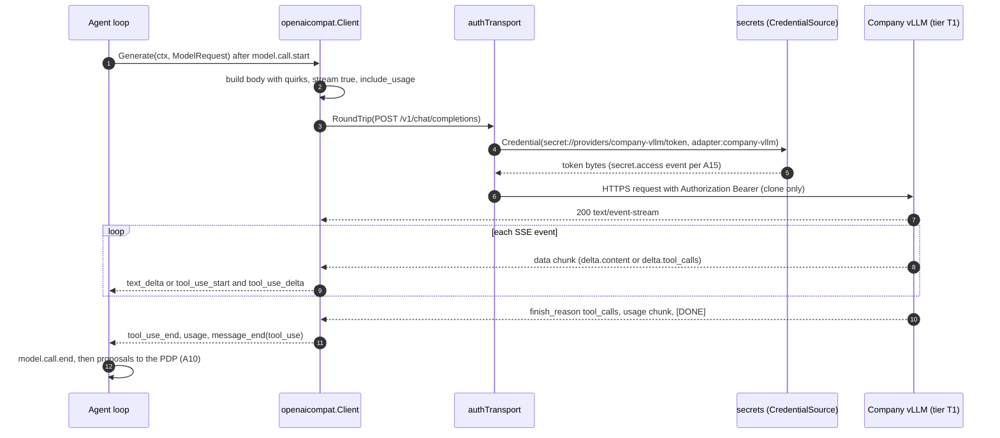
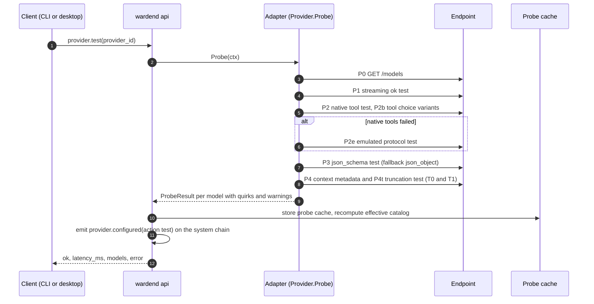

# A11 Provider adapters

Status: design, implementation-ready. Packages: `internal/model` (canonical types, interfaces), `internal/providers/anthropic`, `internal/providers/openaicompat` (A02). Authoritative for: canonical ↔ Anthropic Messages and canonical ↔ OpenAI-compatible mappings, the auth-mode matrix and host-side credential injection, stream parsing, timeouts and retry metadata, error normalization to WRD-05 §4 codes, the capability probe behind `provider.test`, and deployment notes for the five `openai-compatible` deployments.

Not authoritative for (referenced only): routing, retries and fallback policy (A09), the agent loop's use of tools and structured output (A10), keychain access and `secret.access` events (A15), `provider.*` API schemas (A05), harness adapters (A12).

Import rule (A02, WRD-16 §5.2): `internal/providers/*` import only `internal/model`, the standard library and their SDK (`github.com/anthropics/anthropic-sdk-go` for `anthropic`; nothing for `openaicompat`). Credentials, probe cache and health reporting are reached through interfaces declared in `internal/model`.

Conflicts and decisions applied: CF-10, CF-11, core §3 (auth modes, error codes, stop reasons), core §10 (keychain accounts), core §13.13 (costs), core §13.16 (redaction happens before the adapter).

## 1. Principles

1. All model calls originate in `wardend` (WRD-05 §1 goal 4). No adapter code runs in a sandbox; no endpoint, header or credential of a provider is visible to a sandbox (BI-3).
2. Adapters translate, stream, normalize errors and report usage. They do not retry, fall back, compact, estimate cost or apply tool emulation: the router (A09) retries and falls back; the agent loop (A10) compacts and emulates; cost is computed from usage and catalog prices by the router's pricing helper (A09).
3. Adapters never log request or response bodies above debug level; at debug level bodies are redacted and credentials headers (`Authorization`, `api-key`, `x-api-key`) are always replaced by `[REDACTED:credential]` (WRD-05 §5).
4. One code path for all five `openai-compatible` deployments; differences are data (auth mode, base URL, quirk flags learned by the probe), never branches on vendor names in request building.

## 2. Canonical types (`internal/model`)

A02 §4.1 holds the Go sketch of the canonical types (`ModelRequest`, `Message`, `ContentBlock` with nested `ToolUse`, `ToolResult` and `Reasoning`, `StreamEvent`, `Usage`, `Error`, the `Provider` interface including `Probe`, and `CredentialSource`/`Credential`). The mapping tables below use the WRD-05 §3 and §4 field names; Go identifiers follow A02. This document adds the following (NEW, listed in Deviations):

```go
package model

// Additions to A02 §4.1 types.
type ModelRequest struct {
	// ... A02 fields ...
	ParallelToolCalls *bool // false when max_parallel_tools == 1 (A10 §5.1); mapped in §3.4 and §4.4
}

type ToolUse struct {
	ID, Name string
	Input    json.RawMessage // a JSON object
	RawInput string          // arguments that failed to parse; Input is nil (A10 answers invalid_arguments)
}

type Usage struct {
	// ... A02 fields; adapters fill only the token counts. BillingMode, Quota and EstimatedCost are
	// filled by the host from the provider entry and catalog prices (A09 pricing helper).
	Estimated bool // true when the provider did not report usage (§6.5)
}

type ModelCapabilities struct {
	ToolCalling      string // native | emulated | none
	StructuredOutput bool
	StructuredMode   string // json_schema | json_object | tool_forcing | none
	ToolChoiceNamed  bool   // provider honors a named tool choice (A10 §7.3, §10.3)
	Streaming, Vision, Reasoning, PromptCaching bool
	MaxContext, MaxOutput int // effective values (declared ∧ probed, §9.3)
}

// Error.Details (A02: json.RawMessage) carries, as JSON: status, provider error type and code,
// request id, redacted raw body truncated to 8 KiB, and notes such as "stream ended early".

// Provider configuration handed to adapter constructors (parsed from models.yaml by the daemon).
type ProviderConfig struct {
	ID, Protocol, BaseURL string
	Tier                  Tier
	Auth                  AuthConfig
	Timeouts              TimeoutConfig // connect_ms, first_byte_ms, idle_ms (§7.2)
	Models                []ModelConfig // catalog entries of this provider
}

type AuthConfig struct {
	Mode     string // none | api_key | gateway
	Kind     string // bearer | mtls (gateway only)
	Header   string // "" | "api-key"
	Secret   string // secret://providers/<id>/<name>
	CertFile string // optional: mtls client certificate chain as a PEM file; default is keychain providers/<id>/client_cert (A15 §2.1)
	CAFile   string // extra trusted roots (PEM)
}

// ProbeCache is implemented by the daemon (file-backed, §9.4).
type ProbeCache interface {
	Load(providerID string) (*ProbeResult, error)
	Store(r ProbeResult) error
	LearnQuirk(providerID, modelID, flag string, value any) error
}
```

## 3. Canonical ↔ Anthropic Messages (`anthropic-messages`)

Endpoint: `POST {base_url}/v1/messages` (`base_url: https://api.anthropic.com`, WRD-16 §6.1). Headers: `x-api-key: <key>` (injected host-side, §5), `anthropic-version: 2023-06-01`, `content-type: application/json`, `accept: text/event-stream` when streaming. No `anthropic-beta` header in the PoC. Implementation: `anthropic-sdk-go` with `option.WithMaxRetries(0)` (router owns retries), `option.WithBaseURL`, `option.WithHTTPClient` (the adapter's client with the auth transport and timeouts, §5, §7). Exact SDK type names are pinned in week 1 (the SDK is pre-1.0 and renames types between minor versions); the mapping below is at the wire level, which the SDK mirrors.

### 3.1 Request fields

| Canonical | Anthropic | Notes |
|---|---|---|
| `ModelID` | `model` = catalog `models[].model` (for example `claude-sonnet-<version>`) | Catalog lookup in the adapter |
| First `system` message | top-level `system`: array of `{type: "text", text}` blocks, one per canonical text block | Only one system message allowed; a second is `invalid_request` (loop never sends one) |
| `Cache.hint = system_prefix` | `cache_control: {type: "ephemeral"}` on the last system block and on the last tool definition | Only when catalog `prompt_caching: true` |
| `Generation.MaxOutputTokens` | `max_tokens` (required by Anthropic) | Default when unset: `min(model.max_output, 8192)` |
| `Generation.Temperature`, `TopP` | `temperature`, `top_p` | Omitted when unset |
| `Generation.Stop` | `stop_sequences` | |
| `Generation.Seed` | not supported | Dropped silently |
| `Generation.ReasoningEffort` | `thinking: {type: "enabled", budget_tokens}` with low 2,048 / medium 8,192 / high 24,576, only if catalog `reasoning: true` | Not used by the PoC agents; when enabled, forced `tool_choice` is not allowed by Anthropic, so the adapter downgrades `tool` and `required` to `auto` |
| `Tools` | `tools: [{name, description, input_schema}]` | §3.4 |
| `ToolChoice` + `ParallelToolCalls` | `tool_choice` | §3.4 |
| `ResponseFormat` | emulated by tool forcing | §3.5 |
| `Trace` | not sent (`metadata.user_id` is not used) | Trace ids stay in Warden events |
| `ProviderOptions["anthropic-messages"]` | merged into the request body last | Escape hatch, unused in the PoC |

### 3.2 Messages and roles

| Canonical | Anthropic | Rule |
|---|---|---|
| `system` | top-level `system` | See 3.1 |
| `user` | `{role: "user", content: [blocks]}` | |
| `assistant` | `{role: "assistant", content: [blocks]}` | Reasoning blocks first, then text, then `tool_use` blocks, in canonical order |
| `tool` | merged into a `user` message whose content starts with the `tool_result` blocks | Anthropic requires tool results to be the first blocks of the next user turn |
| `tool` followed by `user` | one `user` message: `tool_result` blocks, then the text blocks of the `user` message | A10 §3.1 parts 11 and 12 |
| Two consecutive messages with the same role (any other case) | merged into one message, blocks concatenated | Anthropic would merge them too; merging keeps the request explicit |

### 3.3 Content blocks

| Canonical block | Anthropic block | Direction | Notes |
|---|---|---|---|
| `text` | `{type: "text", text}` | both | Empty text blocks are dropped (Anthropic rejects them) |
| `image` (data) | `{type: "image", source: {type: "base64", media_type, data}}` | request | `media_type` ∈ `image/jpeg`, `image/png`, `image/gif`, `image/webp`; else replaced by text `[image omitted: unsupported type]` |
| `image` (URI) | `{type: "image", source: {type: "url", url}}` | request | Only `https` URIs; the PoC never produces image blocks |
| `document` | `{type: "document", source: {type: "base64", media_type: "application/pdf", data}, title}`; text documents as `source: {type: "text", media_type: "text/plain", data}` | request | PoC does not produce documents |
| `tool_use` | `{type: "tool_use", id, name, input}` | both | `input` must be a JSON object; `RawInput` blocks are sent as `input: {}` with the original text kept in Warden only |
| `tool_result` | `{type: "tool_result", tool_use_id, content: [text or image blocks], is_error}` | request | `is_error` = canonical `IsError` |
| `reasoning` | `{type: "thinking", thinking, signature}` or `{type: "redacted_thinking", data}` | both | `Opaque` = base64 of the JCS JSON of the original block; replayed byte-for-byte only when `Provider == "anthropic"`; dropped otherwise |

### 3.4 Tools and tool choice

| Canonical | Anthropic |
|---|---|
| `ToolDefinition{Name, Description, InputSchema}` | `{name, description, input_schema}`; schema passed through unchanged (Anthropic requires `type: "object"` at the root, which every Warden tool schema has) |
| `ToolChoice` nil or `auto` | `{type: "auto"}` |
| `none` | `{type: "none"}` |
| `required` | `{type: "any"}` |
| `tool` + name | `{type: "tool", name}` |
| `ParallelToolCalls == false` | `disable_parallel_tool_use: true` inside the `tool_choice` object (with any type except `none`) |

The SDK's typed tool schema carries `properties` and `required` as fields and all other keywords (`additionalProperties`, `description`) in its extra-fields map; the adapter builds it from the decoded JSON Schema so that no keyword is lost. If the pinned SDK version cannot round-trip a keyword, the week-1 fallback is to send the request body as raw JSON through the SDK's raw-request option or through the SSE client of §6 (the Messages protocol is small); the decision is recorded in A17.

### 3.5 `response_format` (decision: tool forcing)

Anthropic has no `response_format`. Decision: **emulate by tool forcing**. The adapter adds a tool `warden_json_output` with `input_schema` = the requested schema, sets `tool_choice: {type: "tool", name: "warden_json_output"}`, and converts the resulting `tool_use.input` into the canonical output as one `text` block containing the JSON (compact JCS form), with `stop_reason: end_turn`. Consumers see a normal JSON text answer. Rationale: works on every Claude model with tool use, needs no beta header, and the schema is enforced by the model's tool-use training; post-validation remains the consumer's job (A10 §7). Combining `ResponseFormat` with `Tools` is rejected as `invalid_request` (no caller does it: the agent loop uses `result__submit` instead, A10 §7). Capability reported: `structured_output: true`, `StructuredMode: tool_forcing`.

### 3.6 Streaming events → `StreamEvent`

| Anthropic SSE `event:` / payload | Canonical |
|---|---|
| `message_start {message: {id, model, usage}}` | `message_start{Model, Provider: "anthropic", RequestID: header request-id or message.id}`; initial usage held |
| `content_block_start {index, content_block: {type: "text"}}` | none |
| `content_block_start {type: "tool_use", id, name}` | `tool_use_start{Index, ID, Name}` |
| `content_block_start {type: "thinking"}` / `redacted_thinking` | reasoning block opened (accumulated) |
| `content_block_delta {delta: {type: "text_delta", text}}` | `text_delta{Index, Text}` |
| `content_block_delta {delta: {type: "input_json_delta", partial_json}}` | `tool_use_delta{Index, PartialJSON}` |
| `content_block_delta {delta: {type: "thinking_delta"}}`, `signature_delta` | accumulated into the reasoning block; `reasoning_delta{Index, Opaque}` emitted at block stop |
| `content_block_delta {delta: {type: "citations_delta"}}` | ignored |
| `content_block_stop {index}` | `tool_use_end{Index}` for tool blocks; reasoning block finalized |
| `message_delta {delta: {stop_reason}, usage: {output_tokens}}` | stop reason held; output tokens updated (cumulative) |
| `message_stop` | `usage{…}` then `message_end{StopReason}` |
| `ping` | ignored (resets the idle timer) |
| `error {error: {type, message}}` | `error{Err}` normalized (§8) |

Canonical `Index` = Anthropic content block index. Tool arguments are accumulated from `partial_json`; at `content_block_stop` the concatenation must parse as a JSON object; an empty string means `{}`; a parse failure yields a `tool_use` block with `RawInput` set (A10 answers `invalid_arguments`).

### 3.7 Usage

| Canonical | Anthropic |
|---|---|
| `InputTokens` | `input_tokens + cache_creation_input_tokens + cache_read_input_tokens` (Anthropic's `input_tokens` excludes cached tokens; the canonical value includes them, as in WRD-09 §7) |
| `CachedInputTokens` | `cache_read_input_tokens` |
| `OutputTokens` | final `message_delta.usage.output_tokens` |
| `ReasoningTokens` | not reported separately (included in output tokens); 0 |

Cost (computed by A09's pricing helper, shown here for completeness): `(input − cached) × input_per_mtok/1e6 + cached × (cached_input_per_mtok or input_per_mtok)/1e6 + output × output_per_mtok/1e6`; cache writes are priced as normal input in the PoC (a small underestimate, noted as `basis: "catalog; cache writes at input price"`).

### 3.8 Stop reasons

| Anthropic `stop_reason` | Canonical |
|---|---|
| `end_turn` | `end_turn` |
| `tool_use` | `tool_use` |
| `max_tokens` | `max_tokens` |
| `stop_sequence` | `stop_sequence` |
| `refusal` | `content_filter` |
| `pause_turn` (server tools only; not used) | `end_turn`, logged at warn |
| `model_context_window_exceeded` (newer models) | `max_tokens`, with `Details.note = "context window exceeded"` so the loop compacts before the next step |
| anything else | `end_turn`, logged at warn |

## 4. Canonical ↔ OpenAI-compatible (`openai-compatible`)

Endpoint: `POST {base_url}/chat/completions`, where `base_url` already ends in `/v1` (WRD-16 §6.1: `http://127.0.0.1:11434/v1`, `https://llm.your-vps.example/v1`, `https://<resource>.openai.azure.com/openai/v1`). Implementation: a hand-rolled `net/http` client (WRD-16 §5.1), because servers differ in details that a strict SDK rejects. Headers: `content-type: application/json`, `accept: text/event-stream` when streaming, and the auth header of §5.

### 4.1 Request fields

| Canonical | Chat Completions | Notes and quirk flags (§4.7) |
|---|---|---|
| `ModelID` | `model` = catalog `models[].model` (Ollama tag, vLLM served name, Azure deployment name) | |
| `system` message | `messages[0] = {role: "system", content: "<text blocks joined with \n\n>"}` | Quirk `system_role: developer` sends `role: "developer"` (OpenAI reasoning models) |
| `Generation.MaxOutputTokens` | `max_tokens` | Quirk `max_tokens_field: max_completion_tokens` for OpenAI/Azure reasoning models |
| `Temperature`, `TopP`, `Stop`, `Seed` | `temperature`, `top_p`, `stop`, `seed` | Quirk `omit_temperature` for models that accept only the default |
| streaming | `stream: true`, `stream_options: {include_usage: true}` | Quirk `stream_usage: false` omits `stream_options` |
| `Tools` | `tools: [{type: "function", function: {name, description, parameters}}]` | Omitted for emulated models (A10 §6) and when quirk `tools: false` |
| `ToolChoice` | `tool_choice` | §4.4 |
| `ParallelToolCalls == false` | `parallel_tool_calls: false` | Only when quirk `parallel_tool_calls_param: true` |
| `ResponseFormat` | `response_format` | §4.5 |
| `Cache`, `ReasoningEffort` | not sent | `reasoning_effort` only via `ProviderOptions` (unused) |
| `ProviderOptions["openai-compatible"]` | merged into the body last | Escape hatch (for example `{"keep_alive": "30m"}` for Ollama), unused by default |

### 4.2 Messages and roles

| Canonical | Chat Completions | Rule |
|---|---|---|
| `system` | `{role: "system", content: string}` | Single, first |
| `user` with text only | `{role: "user", content: string}` | Text blocks joined with `\n\n` |
| `user` with images | `{role: "user", content: [{type: "text", text}, {type: "image_url", image_url: {url: "data:<media>;base64,<data>"}}]}` | Only if catalog `vision: true`, else replaced by `[image omitted]` |
| `assistant` | `{role: "assistant", content: string or null, tool_calls: [{id, type: "function", function: {name, arguments: "<JSON string>"}}]}` | `content: null` when there is no text; reasoning blocks dropped |
| `tool` (one per `tool_result`) | `{role: "tool", tool_call_id, content: string}` | One message per result, in canonical order, immediately after the assistant message |
| `tool` then `user` notes | `tool` messages, then `{role: "user", content}` | Accepted by every server in §10; quirk-free |

### 4.3 Content blocks

| Canonical | Chat Completions | Notes |
|---|---|---|
| `text` | string content or `{type: "text", text}` part | |
| `image` | `image_url` part (data URL) | Vision only |
| `document` (text/plain) | appended to the text content as `[document: {title}]\n{text}` | PDFs not supported: `[document omitted]` |
| `tool_use` | `tool_calls[i]` with `arguments` = compact JSON string of `Input` | `RawInput` blocks send their raw string unchanged |
| `tool_result` | `role: "tool"` message; content = concatenated text blocks | Chat Completions has no `is_error`; the Warden observation header carries `"ok": false` (A10 §3.7), which is sufficient |
| `reasoning` | not sent | Received `delta.reasoning_content` (vLLM reasoning parsers, some gateways) or `delta.reasoning` (Ollama thinking models) is surfaced as `reasoning_delta` with `Provider` set and never replayed |

### 4.4 Tools and tool choice

| Canonical | Chat Completions | Fallback when unsupported |
|---|---|---|
| `ToolDefinition` | `{type: "function", function: {name, description, parameters: <schema>}}`; `strict` not sent | Schema keywords are the portable subset (A10 §4.2) |
| `ToolChoice` nil / `auto` | `"auto"` (or omitted) | |
| `none` | `"none"` | Omit `tools` entirely when quirk `tool_choice_none: false` |
| `required` | `"required"` | Quirk `tool_choice_required: false` → `"auto"` |
| `tool` + name | `{type: "function", function: {name}}` | Quirk `tool_choice_named: false` → `"required"` if supported, else `"auto"`; `ModelCapabilities.ToolChoiceNamed` tells the loop (A10 §7.3) |

### 4.5 `response_format`

| Canonical | Sent | Fallback chain (per quirk `response_format`) |
|---|---|---|
| `{type: "json_schema", schema, strict}` | `{type: "json_schema", json_schema: {name: "warden_output", schema, strict}}` | `json_object`: `{type: "json_object"}` plus the schema appended to the system text as `Respond with one JSON object matching this JSON Schema: <schema>`; `none`: prompt only. The consumer always post-validates (WRD-05 §7). |
| `{type: "text"}` | omitted | |

Known variations (to confirm by the probe, not by code branches): vLLM, LM Studio, Ollama (0.5+) and Azure accept `json_schema`; TGI uses a non-standard grammar parameter and is treated as `none` unless the probe proves otherwise.

### 4.6 Stream parsing and usage

Chunk shape: `{id, model, choices: [{index: 0, delta: {role?, content?, tool_calls?: [{index, id?, type?, function: {name?, arguments?}}], reasoning_content?}, finish_reason}], usage?}`.

| Chunk content | Canonical |
|---|---|
| First chunk with non-empty `choices` | `message_start{Model: chunk.model, Provider, RequestID: header x-request-id or chunk.id}` |
| Chunk with empty `choices` and no `usage` (Azure `prompt_filter_results` chunk) | ignored |
| `delta.content` | `text_delta` on canonical index 0 (allocated at first text) |
| `delta.tool_calls[k]` with new `index` | allocate the next canonical index; buffer until `id` and `function.name` are known, then `tool_use_start{Index, ID, Name}` followed by buffered `tool_use_delta` |
| `delta.tool_calls[k].function.arguments` | `tool_use_delta{Index, PartialJSON}` |
| `finish_reason` non-null | `tool_use_end` for every open tool block in index order; stop reason held |
| final chunk with `usage` (and `choices: []`) | `usage{…}` |
| `data: [DONE]` or end of body after `finish_reason` | `message_end{StopReason}` (usage emitted first; estimated if absent, §6.5) |
| `data: {"error": {…}}` | `error{Err}` normalized (§8) |

Tolerances (all observed across servers; none is keyed on a vendor name):

- `tool_calls[k].index` missing: use the position in the array, and a chunk that carries a new `id` starts a new call.
- `id` missing on every chunk: synthesize `call_<n>` and set `Details.note = "synthesized tool call id"`.
- `function.name` repeated on later chunks: ignored after the first.
- `arguments` delivered as a JSON object instead of a string: re-marshaled compactly.
- Whole arguments in one chunk: works unchanged.
- `finish_reason: "stop"` while tool calls were streamed: the stop reason becomes `tool_use`.
- `finish_reason: "function_call"` (legacy): `tool_use`.
- No `finish_reason` before `[DONE]`: `end_turn` if no tool calls, else `tool_use`; logged at warn.

Usage mapping: `prompt_tokens` → `InputTokens`; `completion_tokens` → `OutputTokens`; `prompt_tokens_details.cached_tokens` → `CachedInputTokens`; `completion_tokens_details.reasoning_tokens` → `ReasoningTokens`.

Finish reasons: `stop` → `end_turn` (or `tool_use`, see above); `tool_calls` → `tool_use`; `length` → `max_tokens`; `content_filter` → `content_filter`; `function_call` → `tool_use`; any other → `end_turn` with warn. `stop_sequence` cannot be distinguished from `stop` in Chat Completions and is reported as `end_turn`.

Non-streaming fallback: when quirk `stream_tools: false` (a server that cannot stream tool calls), requests with `tools` are sent with `stream: false`, and the adapter synthesizes the canonical event sequence from the full response (WRD-05 §5: "buffered for non-streaming providers"). The UI then sees no live deltas for that step.

### 4.7 Quirk flags (per model, learned by the probe, cached)

| Flag | Default | Effect |
|---|---|---|
| `tools` | true | false → model cannot receive `tools`; catalog `tool_calling` becomes `emulated` or `none` |
| `stream_tools` | true | false → non-streaming requests when tools are present |
| `tool_choice_required` | true | see §4.4 |
| `tool_choice_named` | true | see §4.4 |
| `tool_choice_none` | true | see §4.4 |
| `parallel_tool_calls_param` | true | false → the field is never sent |
| `stream_usage` | true | false → `stream_options` not sent; usage estimated when missing |
| `response_format` | `json_schema` | `json_object` or `none` (§4.5) |
| `max_tokens_field` | `max_tokens` | or `max_completion_tokens` |
| `omit_temperature` | false | true → never send `temperature`/`top_p` |
| `system_role` | `system` | or `developer` |

**Shape retry.** When a request fails with 400/422 and the body names one of the optional fields above (`stream_options`, `parallel_tool_calls`, `max_tokens`, `temperature`, `tool_choice`, `response_format`) as unsupported or unknown, the adapter flips the corresponding quirk, persists it to the probe cache, and re-sends once immediately. This is the only retry an adapter performs; it happens before any output is produced and is logged at info level (`quirk learned: stream_usage=false`).

## 5. Authentication and host-side credential injection

### 5.1 Auth-mode matrix

| Protocol and mode (`models.yaml` `auth`) | Wire effect | Secret reference (keychain account, service `warden`) | Other files | Typical tier |
|---|---|---|---|---|
| `openai-compatible`, `{mode: none}` | no auth header | none | none | T0 (loopback), T1 (LAN without auth; discouraged) |
| `openai-compatible`, `{mode: api_key, secret}` | `Authorization: Bearer <key>` | `secret://providers/<id>/api_key` → account `providers/<id>/api_key` | none | T3 (`openai`), T3 other SaaS |
| `openai-compatible`, `{mode: api_key, header: api-key, secret}` | `api-key: <key>` (no `Authorization`) | `secret://providers/<id>/api_key` | none | T2 (Azure OpenAI) |
| `openai-compatible`, `{mode: gateway, kind: bearer, secret}` | `Authorization: Bearer <token>` | `secret://providers/<id>/token` → account `providers/<id>/token` | optional `ca_file` | T1 (VPS, internal gateway) |
| `openai-compatible`, `{mode: gateway, kind: mtls, secret}` | TLS client certificate; no auth header | Private key: `secret://providers/<id>/client_key` → account `providers/<id>/client_key` (keychain only, never a file). Certificate chain: account `providers/<id>/client_cert` (default, A15 §2.1) | optional `cert_file` (certificate only, instead of `client_cert`, NEW field); optional `ca_file` | T1 |
| `anthropic-messages`, `{mode: api_key, secret}` | `x-api-key: <key>` plus `anthropic-version` | `secret://providers/anthropic/api_key` | none | T3 |

YAML forms (consistent with WRD-16 §6.1; `cert_file`, `ca_file` and `timeouts` are NEW optional fields). The mTLS form normally needs only `secret`; the certificate is found in `providers/<id>/client_cert`:

```yaml
  - id: company-vllm
    protocol: openai-compatible
    base_url: https://llm.your-vps.example/v1
    auth: { mode: gateway, kind: bearer, secret: "secret://providers/company-vllm/token", ca_file: "~/.warden/certs/company-vllm-ca.pem" }
    tier: T1
  - id: company-vllm-mtls
    protocol: openai-compatible
    base_url: https://llm.your-vps.example/v1
    auth: { mode: gateway, kind: mtls, secret: "secret://providers/company-vllm-mtls/client_key", ca_file: "~/.warden/certs/company-vllm-ca.pem" }   # certificate from keychain providers/company-vllm-mtls/client_cert
    # alternative for a chain too large for the keychain: add cert_file: "~/.warden/certs/company-vllm-mtls/client.crt" (certificate only)
    tier: T1
    timeouts: { connect_ms: 10000, first_byte_ms: 120000, idle_ms: 60000 }
```

`provider.add` with `secret_files{cert, key}` (A05) stores both in the keychain: the key under `providers/<id>/client_key` and the certificate chain under `providers/<id>/client_cert` (A15 §2.1). Warden never copies the key file the user pointed at, and a file path is never accepted for the private key; encrypted keys are refused. A file path is accepted only for the certificate (`cert_file`, when the chain exceeds the keychain value limit) and for extra CA roots (`ca_file`).

### 5.2 Load-time validation (at daemon start and on `provider.add`)

1. `protocol` ∈ {`anthropic-messages`, `openai-compatible`}; `auth.mode` ∈ {`none`, `api_key`, `gateway`}; `gateway.kind` ∈ {`bearer`, `mtls`}; other values → `unsupported_in_poc` (for example `cloud_iam`, `sso-oidc`).
2. `tier: T0` requires a loopback host (`127.0.0.0/8`, `::1`, `localhost`) after resolution (WRD-05 §10); otherwise the entry is rejected with a hint to declare T1.
3. `http://` is accepted only for loopback hosts. A non-loopback `http://` URL is rejected for every tier, because a bearer token or API key would travel in clear text and the T1 promise ("the model lives where the company decides") includes transport security. (OQ candidate for LAN endpoints without TLS.)
4. `secret` must be a `secret://providers/<id>/<name>` reference whose `<id>` equals the entry id; the value is never accepted inline (WRD-16 §10.5).
5. `ca_file` and `cert_file` (when set) must exist, be readable by the owner only, and parse as PEM certificates; a PEM private key in either file is rejected. The certificate (from `client_cert` or `cert_file`) must match the keychain key (checked lazily at first handshake, §5.4, because reading the key emits `secret.access`). Any `auth` field pointing at a private-key file is a load error.
6. The daemon removes `ANTHROPIC_API_KEY`, `OPENAI_API_KEY`, `AZURE_OPENAI_API_KEY` from its own environment at startup, so neither the SDK nor any child process can pick up an ambient key.

### 5.3 Injection point

A single `http.RoundTripper` wrapper in each adapter package (the two copies are identical by design; the import rule prevents a shared package outside `internal/model`):

```go
// authTransport adds the credential to a clone of each outgoing request.
type authTransport struct {
	base       http.RoundTripper
	providerID string
	ref        string // secret://providers/<id>/<name>; "" for auth mode none
	creds      model.CredentialSource
}

func (t *authTransport) RoundTrip(r *http.Request) (*http.Response, error) {
	if t.ref == "" {
		return t.base.RoundTrip(r)
	}
	c, err := t.creds.Credential(r.Context(), t.ref, "adapter:"+t.providerID)
	if err != nil {
		return nil, &model.Error{Code: model.ErrAuthFailed, Message: "credential unavailable (keychain locked or entry missing)"}
	}
	defer c.Wipe()
	if c.Header == "" { // gateway mtls: the certificate is used by the TLS layer (§5.4), no header
		return t.base.RoundTrip(r)
	}
	r2 := r.Clone(r.Context())
	v := string(c.Value)
	if c.Scheme != "" {
		v = c.Scheme + " " + v
	}
	r2.Header.Set(c.Header, v) // Authorization: Bearer …, api-key: …, or x-api-key: …
	return t.base.RoundTrip(r2)
}
```

- `model.CredentialSource` is implemented by `internal/secrets` (A15); it resolves from the keychain, sets `Header` and `Scheme` from the provider's `auth` entry (§5.1), caches per process with a short TTL, and emits `secret.access{ref, consumer: "adapter:<id>", purpose: "model_call"}` according to A15's rate rule. The adapter never stores the value in a struct field, never logs it, and never puts it in an error.
- The Anthropic SDK is given no key; the transport sets `x-api-key`. Because the SDK may add its own `x-api-key` from the environment, the transport uses `Header.Set` (overwrite), and the environment is cleared (§5.2 item 6).
- The auth transport sits under the timeout logic (§7) and above the `http.Transport`, so redirects (disabled, `CheckRedirect` returns an error) and retries never re-send credentials to another host.

### 5.4 mTLS

```go
tlsCfg := &tls.Config{
	MinVersion: tls.VersionTLS12,
	RootCAs:    pool, // system roots plus ca_file when set
	GetClientCertificate: func(*tls.CertificateRequestInfo) (*tls.Certificate, error) {
		return a.clientCert(ctx) // creds.Credential(secret).Cert: key from client_key + chain from client_cert (or cert_file), parsed once, kept in memory for the provider instance
	},
}
```

- `InsecureSkipVerify` is never set; there is no configuration option for it.
- The parsed `tls.Certificate` stays in daemon memory until `provider.remove`, a new `provider.add` for the same id, or daemon exit.
- Key and certificate mismatch → `auth_failed` with message `client certificate and key do not match`.
- Server certificate not trusted → `provider_unavailable` (non-retryable, `Details.tls = "server_certificate_untrusted"`, fix hint: set `ca_file`).
- Server rejects the client certificate (TLS alert `bad_certificate`, `certificate_required`, `unknown_ca`) → `auth_failed`.

### 5.5 Proxies

Provider traffic never traverses the sandbox egress proxy (WRD-10 §7). The daemon's own `http.Transport` uses `http.ProxyFromEnvironment` only for non-loopback hosts (a corporate HTTPS proxy on the workstation keeps working); loopback providers always connect directly.

## 6. Streaming transport

### 6.1 Always streaming

`Provider.Generate` always returns a `Stream` (WRD-05 §5). Both adapters request `stream: true` except in the non-streaming fallback of §4.6, where the stream is synthesized from a buffered response.

### 6.2 SSE line protocol (shared reader, `openaicompat/sse.go`; the Anthropic SDK has its own)

Before parsing, the adapter checks the HTTP status and `content-type`. A non-2xx status, or a 2xx with `application/json` instead of `text/event-stream`, is read as a JSON body (≤ 64 KiB) and normalized as an error (§8).

Reader rules (WHATWG server-sent events, restricted to what model servers send):

1. Lines end with `\n`, `\r\n` or `\r`. Maximum line length 8 MiB (a server that sends a whole `fs__write` argument in one chunk can exceed 1 MiB after JSON escaping); longer → `provider_unavailable`, non-retryable, `Details.note = "sse line too long"`.
2. A line starting with `:` is a comment (keep-alive, for example `: ping` or `: PROCESSING`). It is ignored but resets the idle timer (§7).
3. `field: value` with at most one leading space stripped from the value; `data:value` without a space is accepted. Fields: `data` (appended to the event data with `\n` between lines), `event` (event type; used by Anthropic, ignored by OpenAI-compatible parsing), `id` and `retry` (ignored).
4. A blank line dispatches the event if its data is non-empty.
5. OpenAI-compatible: data `[DONE]` ends the stream. Anthropic: `message_stop` ends the stream.
6. End of body before the terminal event → `provider_unavailable`, retryable, `Details.note = "stream ended early"` (§8 row 27).
7. Data that is not valid JSON → skipped once with a warn log; a second invalid data line in the same stream → `provider_unavailable`, retryable.
8. Anything after the terminal event is ignored.

### 6.3 Partial JSON accumulation for tool arguments

The adapter emits `tool_use_delta` fragments as they arrive (the UI shows them, A10 §9) and keeps one `strings.Builder` per tool block. At `tool_use_end`:

- empty → `Input = {}`;
- valid JSON object → `Input` set (compact form);
- valid JSON that is not an object, or invalid JSON → `Input = nil`, `RawInput` = the text (the loop answers `invalid_arguments`, A10 §5.1 step 3).

The adapter never tries to repair JSON; repairs are the loop's decision.

### 6.4 Ordering guarantees to the consumer

`message_start` first; for each block, `*_start` before its deltas and `*_end` after them; `usage` (possibly estimated) immediately before `message_end`; `message_end` or `error` last, exactly once. The agent loop relies on these guarantees to flush deltas and to pair tool calls.

### 6.5 Missing usage

If a stream ends without usage (server ignores `stream_options`, or quirk `stream_usage: false`), the adapter emits `usage` with `Estimated: true`: `InputTokens = ceil(bytes(serialized request messages and tools) / 3.2)`, `OutputTokens = ceil(bytes(text + tool arguments + reasoning) / 3.2)`. The loop does not calibrate its estimator from estimated usage (A10 §3.5), and `model.call.end.usage.estimated: true` lets the cost panel show "≈".

## 7. Cancellation, timeouts and retry metadata

### 7.1 Cancellation

`Generate(ctx, …)` binds the HTTP request to `ctx`. Cancelling `ctx` (user cancel, execution deadline) aborts the connection; the stream's next `Recv` returns an `error` event with `Code: cancelled`, `Retryable: false`, then `io.EOF`. `Stream.Close()` is idempotent and always closes the response body. Target: the socket is closed within 100 ms of cancellation (the 5 s cancellation budget is dominated by sandbox teardown, core §13.10).

### 7.2 Timeouts

| Timeout | Default | Scope | Result |
|---|---|---|---|
| `connect_ms` | 10,000 | TCP dial (`net.Dialer.Timeout`) plus TLS handshake (`TLSHandshakeTimeout`) | `provider_unavailable`, retryable |
| `first_byte_ms` | 120,000 for T0 and T1; 60,000 for T2 and T3 | From request written to the first SSE event (not just headers; some servers send headers only when generation starts) | `timeout`, retryable |
| `idle_ms` | 60,000 | Between two SSE lines (comments count) after the first event | `timeout`, retryable |
| Total | none in the adapter | Bounded by the execution's wall clock through `ctx` (A10 §10) | `cancelled` or the loop's `timed_out` |

The long T0/T1 first-byte default covers model loading on first use (Ollama and LM Studio load a 32B model in tens of seconds). All four values are overridable per provider with `timeouts` (NEW optional field). Implementation: one watchdog timer per request, armed with `first_byte_ms` after the request is written and re-armed with `idle_ms` on every line; on fire it cancels an internal context and the adapter reports `timeout` (distinguished from caller cancellation by checking which context fired).

### 7.3 Retry metadata

Adapters do not retry (except the shape retry of §4.7). Every error carries `Retryable` and, when known, `RetryAfter`, parsed in this order: `retry-after-ms` (milliseconds; Azure and OpenAI), `retry-after` (seconds or HTTP date), `anthropic-ratelimit-requests-reset` / `anthropic-ratelimit-tokens-reset` (RFC 3339, whichever is later), `x-ratelimit-reset-requests` / `x-ratelimit-reset-tokens` (Go-duration-like strings such as `1s`, `6m0s`, `20ms`). The router applies WRD-06 §7 (up to 3 retries for `rate_limited` and `provider_unavailable`, exponential backoff with jitter, honoring `RetryAfter`), then falls back. A retry after partial output is safe: the loop discards the partial turn and nothing was executed (tools run only after `message_end`, A10 §5).

`Health()` reports the last seen rate-limit headers (`RequestsRemaining`, `TokensRemaining`, `ResetAt`) and the last error code; the circuit breaker itself lives in the router (A09, WRD-16 §5.1).

## 8. Error normalization (WRD-05 §4)

"Fallback class" marks the codes that WRD-06 §7 allows the router to fall back on after its retries; the router falls back only within the same or a lower tier and otherwise pauses the task for a one-click `session.setPin` (CF-44, core ID-16). Body patterns are case-insensitive regular expressions applied to the provider's error message (`error.message`) and code (`error.code`, `error.type`).

| # | Protocol | Condition (status, body pattern) | Code | Retryable | Fallback class |
|---|---|---|---|---|---|
| 1 | both | caller `ctx` cancelled | `cancelled` | no | no |
| 2 | both | dial refused, DNS failure, connect or TLS handshake timeout, connection reset before response | `provider_unavailable` | yes | yes |
| 3 | both | server certificate not trusted, hostname mismatch | `provider_unavailable` (`Details.tls`) | no | yes |
| 4 | both | TLS alert `bad_certificate`, `certificate_required`, `unknown_ca`, `certificate_unknown` from the server; client key and cert mismatch | `auth_failed` | no | no |
| 5 | both | `first_byte_ms` or `idle_ms` watchdog fired | `timeout` | yes | yes |
| 6 | anthropic | 400 `invalid_request_error` and message matches `prompt is too long\|too many tokens\|exceed.*context\|context window` | `context_too_long` | no | no |
| 7 | anthropic | 400 `invalid_request_error`, other | `invalid_request` | no | no |
| 8 | anthropic | 401 `authentication_error`; 403 `permission_error` | `auth_failed` | no | no |
| 9 | anthropic | 404 `not_found_error` | `model_not_found` | no | yes |
| 10 | anthropic | 413 `request_too_large` | `context_too_long` | no | no |
| 11 | anthropic | 429 `rate_limit_error` | `rate_limited` | yes | yes |
| 12 | anthropic | 500 `api_error`; 502, 503, 504 | `provider_unavailable` | yes | yes |
| 13 | anthropic | 529 `overloaded_error`, or SSE `error` event with `overloaded_error` | `provider_unavailable` | yes | yes |
| 14 | anthropic | SSE `error` event, other type | mapped by type as rows 7 to 13; unknown → `provider_unavailable` | per row | per row |
| 15 | openai-compatible | 400 or 422, code `context_length_exceeded` or message matches `maximum context length\|context length\|context window\|too many tokens\|prompt is too long\|input is too long\|exceeds the model` | `context_too_long` | no | no |
| 16 | openai-compatible | 400 or 422, message matches `does not support tools\|tools? (are\|is) not supported\|tool calling is not supported\|tool_choice.*not supported\|does not support function` (after the shape retry of §4.7 did not apply) | `tool_format_unsupported` | no | no (A10 §6.1 switches to emulated once) |
| 17 | openai-compatible | 400 with `error.code` `content_filter` or inner code `ResponsibleAIPolicyViolation` (Azure) | `content_filtered` | no | no |
| 18 | openai-compatible | 400 or 422, other | `invalid_request` | no | no |
| 19 | openai-compatible | 401, 403 | `auth_failed` | no | no |
| 20 | openai-compatible | 404 and (`error.code` `model_not_found` or `DeploymentNotFound`, or message matches `model .*(not found\|does not exist)\|no such model`) | `model_not_found` | no | yes |
| 21 | openai-compatible | 404, other (wrong `base_url` path) | `provider_unavailable` (`Details.note = "endpoint not found; check base_url ends with /v1"`) | no | yes |
| 22 | openai-compatible | 408 | `timeout` | yes | yes |
| 23 | openai-compatible | 429 with code `insufficient_quota` | `rate_limited` | no | yes |
| 24 | openai-compatible | 429, other | `rate_limited` | yes | yes |
| 25 | openai-compatible | 500, 502, 503, 504 (includes Ollama "server busy") | `provider_unavailable` | yes | yes |
| 26 | openai-compatible | SSE `data: {"error": …}` | mapped by code and message as rows 15 to 25 without a status; unknown → `provider_unavailable`, retryable | per row | per row |
| 27 | both | body ended before the terminal event | `provider_unavailable` | yes | yes |
| 28 | both | two invalid SSE data lines | `provider_unavailable` | yes | yes |
| 29 | both | credential unavailable (keychain locked, entry missing) | `auth_failed` (`Details.note = "keychain"`) | no | no |
| 30 | both | `finish_reason: content_filter` / `stop_reason: refusal` | not an error: stop reason `content_filter` | | |

`Error.Message` is a short fixed sentence per code (for the UI, B07). `Error.Details` keeps the status, provider error type and code, `request-id`/`x-request-id`, and the raw body truncated to 8 KiB after redaction; it is stored in `model.call.end.error.details` (NEW field, WRD-05 §4 requires the raw error in the event) and is never placed in model context.

## 9. Capability probe (`provider.test`)

### 9.1 Purpose and trigger

`provider.test {provider_id}` (A05), `warden provider test <id>`, and automatically after `provider.add`. It verifies connectivity and auth, and measures per model: native tool calling, emulated tool calling, structured output, streaming, usage in streams, the named and required tool choice, and the effective context size. Results are written to the probe cache and change the effective catalog. Probe calls are made outside any session: they produce no `model.call.*` events (those belong to session chains); the outcome is one `provider.configured{action: "test"}` event on the system chain.

### 9.2 Steps (per provider, then per catalog model of that provider)

| Step | Request | Pass criterion | Recorded |
|---|---|---|---|
| P0 List | OpenAI-compatible: `GET {base_url}/models`. Anthropic: `GET {base_url}/v1/models` | 200 with a list. 401/403 → stop, `auth_failed`. 404 → continue (some gateways do not list) | `models_listed[]`, `latency_ms` |
| P1 Stream | user `Reply with exactly: ok`, `max_tokens: 16`, streaming with `stream_options.include_usage` | ≥ 1 text delta and a terminal event | `streaming`, `ttft_ms`, quirk `stream_usage` (usage present?) |
| P2 Native tools | tool `probe_add {a: integer, b: integer}` (both required); user `Use the probe_add tool to add 2 and 3. Do not answer in text.`; `tool_choice: auto`; non-streaming then streaming | a call to `probe_add` with `{"a":2,"b":3}` in both variants | `tools`, `stream_tools` |
| P2b Tool choice | same with named choice `probe_add`, then `required`, then `parallel_tool_calls: false` | request accepted and a call returned | `tool_choice_named`, `tool_choice_required`, `parallel_tool_calls_param` |
| P2e Emulated tools | only if P2 failed: system text = A10 §6.2 protocol with `probe_add`; same user text | A10 §6.3 parser yields `probe_add {"a":2,"b":3}` within 2 attempts | `tool_calling: emulated` if passed, else `none` |
| P3 Structured output | `response_format` json_schema with `{"type":"object","properties":{"answer":{"type":"integer"},"unit":{"type":"string","enum":["apples","pears"]}},"required":["answer","unit"],"additionalProperties":false}`; user `I have 2 apples and buy 3 more apples. Answer as JSON.` Anthropic: via tool forcing (§3.5) | the answer parses and validates (`answer: 5`, `unit: apples`) | `structured_output`, `StructuredMode`, quirk `response_format` (falls back to `json_object`, then `none`) |
| P4 Context | metadata first: vLLM `/v1/models` `max_model_len`; LM Studio `/api/v0/models/<id>` `max_context_length`/`loaded_context_length`; Ollama native `/api/show` (host root of `base_url`) `model_info.*.context_length` and `parameters num_ctx`; else the catalog value | value known | `max_context_meta` |
| P4t Truncation test | T0 and T1 only, when the declared `max_context ≥ 16384`: a prompt of about 12,000 tokens of numbered filler lines with `The code word is WARDEN-<random>` on line 1, asking for the code word | reported `prompt_tokens ≥ 0.8 ×` the estimate and the code word returned | if failed: `max_context_effective = floor(prompt_tokens / 1024) × 1024` and warning `server truncates prompts; configure the context length (Ollama OLLAMA_CONTEXT_LENGTH or num_ctx, vLLM --max-model-len)` |

The probe spends a few hundred tokens on paid APIs (P1 to P3, about 0.001 USD on `anthropic/claude-sonnet`) and skips P4t for T2 and T3. Each step has a 60 s timeout (120 s for the first request to a T0/T1 model, to absorb model loading). Probing a harness is A12's (`provider.test` on a harness id).

### 9.3 Effective catalog

Declared values in `models.yaml` are the ceiling; probe results can only lower them: `tool_calling` order `none < emulated < native` takes the minimum of declared and probed; `structured_output` is `declared && probed`; `max_context` is `min(declared, max_context_meta, max_context_effective)`. When a declared field is absent (for example a model added from the listing), the probed value is used. Every downgrade adds a `warn` check to `system.doctor` (A16) with the reason. The router (A09) and the agent loop (A10 §3.5) read only the effective catalog.

### 9.4 Probe cache (NEW path `~/.warden/cache/providers/<provider_id>.json`, 0600)

```json
{
  "$schema": "https://json-schema.org/draft/2020-12/schema",
  "$id": "https://schemas.warden.dev/poc/providers/probe-cache.json",
  "type": "object",
  "additionalProperties": false,
  "required": ["provider_id", "probed_at", "runtime_version", "endpoint_hash", "ok", "models"],
  "properties": {
    "provider_id": { "type": "string" },
    "probed_at": { "type": "string", "format": "date-time" },
    "runtime_version": { "type": "string" },
    "endpoint_hash": { "type": "string", "description": "sha256 of protocol + base_url + auth.mode/kind; a change invalidates the cache" },
    "ok": { "type": "boolean" },
    "latency_ms": { "type": "integer" },
    "models_listed": { "type": "array", "items": { "type": "string" }, "maxItems": 500 },
    "error": { "type": ["object", "null"], "properties": { "code": { "type": "string" }, "message": { "type": "string" } } },
    "models": {
      "type": "array",
      "items": {
        "type": "object",
        "additionalProperties": false,
        "required": ["model_id", "tool_calling", "structured_output", "streaming", "max_context"],
        "properties": {
          "model_id": { "type": "string" },
          "tool_calling": { "enum": ["native", "emulated", "none"] },
          "structured_output": { "type": "boolean" },
          "structured_mode": { "enum": ["json_schema", "json_object", "tool_forcing", "none"] },
          "streaming": { "type": "boolean" },
          "max_context": { "type": "integer" },
          "max_context_meta": { "type": ["integer", "null"] },
          "max_context_effective": { "type": ["integer", "null"] },
          "ttft_ms": { "type": "integer" },
          "quirks": {
            "type": "object",
            "additionalProperties": false,
            "properties": {
              "tools": { "type": "boolean" }, "stream_tools": { "type": "boolean" },
              "tool_choice_required": { "type": "boolean" }, "tool_choice_named": { "type": "boolean" }, "tool_choice_none": { "type": "boolean" },
              "parallel_tool_calls_param": { "type": "boolean" }, "stream_usage": { "type": "boolean" },
              "response_format": { "enum": ["json_schema", "json_object", "none"] },
              "max_tokens_field": { "enum": ["max_tokens", "max_completion_tokens"] },
              "omit_temperature": { "type": "boolean" }, "system_role": { "enum": ["system", "developer"] }
            }
          },
          "warnings": { "type": "array", "items": { "type": "string" } }
        }
      }
    }
  }
}
```

After writing the cache the daemon emits `provider.configured{provider_id, action: "test", tier, protocol, auth_mode, secret_ref, result: {ok, latency_ms, models: [{model_id, tool_calling, structured_output, streaming, max_context}], warnings_count, error}}` and returns the `provider.test` result (A05 shape: `ok`, `latency_ms`, `models[]`, `error?`).

## 10. Deployment notes for the five `openai-compatible` deployments

All five use the same adapter; only `base_url`, `auth` and the probed quirks differ. Server-side commands are guidance for the week-1 setup (WRD-16 §16) and must be re-checked against the installed versions.

### 10.1 Ollama on the workstation (tier T0)

```yaml
  - id: ollama
    protocol: openai-compatible
    base_url: http://127.0.0.1:11434/v1
    auth: { mode: none }
    tier: T0
```

- Context length: Ollama's OpenAI-compatible endpoint does not accept a per-request context size, and its default context window is much smaller than the model's maximum. Start the server with `OLLAMA_CONTEXT_LENGTH=32768` or create a model variant with `PARAMETER num_ctx 32768`; otherwise prompts are truncated silently. The P4t probe detects this and lowers `max_context`.
- First request after idle loads the model (tens of seconds for 32B): covered by `first_byte_ms` 120 s. `OLLAMA_KEEP_ALIVE=30m` avoids reloads during a demo.
- Tool calling depends on the model's chat template; `qwen2.5-coder:32b` supports native tools; the 7B variant is catalogued as `emulated` (WRD-16 §6.1). Streaming of tool calls and `stream_options.include_usage` depend on the Ollama version; the probe sets `stream_tools` and `stream_usage`.
- `/v1/models` lists pulled models; `/api/show` gives the context metadata.

### 10.2 LM Studio on the workstation (tier T0)

```yaml
  - id: lmstudio
    protocol: openai-compatible
    base_url: http://127.0.0.1:1234/v1
    auth: { mode: none }
    tier: T0
```

- Enable the local server in LM Studio; set the model's context length in the load settings (the loaded context, not the model's maximum, is what counts; the probe reads `loaded_context_length` when available).
- Tools: models with a native tool template get native tool calls; LM Studio can also apply its own default tool format for other models, which the probe classifies empirically.
- `response_format` `json_schema` is supported; just-in-time model loading can make the first request slow.

### 10.3 Company-hosted model on a VPS, LAN or VPC (tier T1): vLLM, TGI or Ollama behind TLS

```yaml
  - id: company-vllm
    protocol: openai-compatible
    base_url: https://llm.your-vps.example/v1
    auth: { mode: gateway, kind: bearer, secret: "secret://providers/company-vllm/token" }   # or kind: mtls (§5.1)
    tier: T1
```

vLLM (recommended for the T1 demo; GPU host):

```
vllm serve Qwen/Qwen2.5-Coder-32B-Instruct \
  --host 127.0.0.1 --port 8000 \
  --max-model-len 32768 \
  --enable-auto-tool-choice --tool-call-parser hermes \
  --api-key "$VLLM_API_KEY"          # optional second check; the reverse proxy is the primary one
```

The served model name equals the catalog `model` (`Qwen/Qwen2.5-Coder-32B-Instruct`). `/v1/models` reports `max_model_len`. Named and required tool choice use guided decoding.

Reverse proxy with TLS and bearer check (nginx; the same host terminates mTLS in the variant):

```nginx
map $http_authorization $warden_ok { default 0; "Bearer <long-random-token>" 1; }
server {
  listen 443 ssl;
  http2 on;
  server_name llm.your-vps.example;
  ssl_certificate     /etc/letsencrypt/live/llm.your-vps.example/fullchain.pem;
  ssl_certificate_key /etc/letsencrypt/live/llm.your-vps.example/privkey.pem;
  # mTLS variant (auth kind: mtls): uncomment and drop the bearer check
  # ssl_client_certificate /etc/nginx/warden-client-ca.pem;
  # ssl_verify_client on;
  location /v1/ {
    if ($warden_ok = 0) { return 401; }
    proxy_pass http://127.0.0.1:8000/v1/;
    proxy_http_version 1.1;
    proxy_buffering off;            # SSE must not be buffered
    proxy_read_timeout 600s;
    proxy_set_header Authorization "";   # do not forward the token upstream (Ollama, TGI)
  }
}
```

- Ollama on the VPS: `OLLAMA_HOST=127.0.0.1:11434 OLLAMA_CONTEXT_LENGTH=32768 ollama serve`, same nginx block with `proxy_pass http://127.0.0.1:11434/v1/`. Ollama has no authentication of its own; the proxy is the only gate, so it must listen on loopback.
- TGI: `text-generation-launcher --model-id Qwen/Qwen2.5-Coder-32B-Instruct --max-total-tokens 32768 --max-input-tokens 30000`; its `/v1/chat/completions` supports tools through its grammar engine with different `tool_choice` semantics, and structured output through a non-standard parameter; expect the probe to set `response_format: none` and possibly `tool_choice_named: false`. Context metadata from `GET /info` (`max_total_tokens`) is not read by the PoC probe; set `max_context` in the catalog.
- The bearer token is generated once (`openssl rand -hex 32`), stored with `warden provider add company-vllm --token` (keychain) and configured on the server. The sandbox never sees the endpoint or the token (BI-3); DNS for the endpoint is resolved by the daemon.
- The tier is a declaration by the user: T1 is correct only if the host is operated by the organization (WRD-05 §10).

### 10.4 Internal LLM gateway (tier T1, sometimes T2)

```yaml
  - id: corp-gateway
    protocol: openai-compatible
    base_url: https://llm-gateway.corp.example/v1
    auth: { mode: gateway, kind: bearer, secret: "secret://providers/corp-gateway/token" }   # or kind: mtls (key and certificate in the keychain), optional ca_file
    tier: T1
```

- Gateways (LiteLLM, Kong, Portkey, in-house) expose model aliases; the catalog `model` is the alias. Corporate CAs are common: set `ca_file`.
- Tier rule: a gateway entry may be declared T1 only if **every** model reachable with that credential is company-hosted. If the gateway can route to vendor APIs, declare those aliases as a separate provider entry with tier T3 (or T2 for a company cloud tenant). Otherwise a `confidential` task could be admitted to a T1 entry that forwards to a vendor, defeating BI-7; Warden cannot see behind the gateway.
- Gateways often strip or rewrite `stream_options` and `parallel_tool_calls`; the shape retry (§4.7) handles this.

### 10.5 Azure OpenAI in a company tenant (tier T2)

```yaml
  - id: azure-openai
    protocol: openai-compatible
    base_url: https://<resource>.openai.azure.com/openai/v1
    auth: { mode: api_key, header: api-key, secret: "secret://providers/azure-openai/api_key" }
    tier: T2
```

- The v1 endpoint takes the **deployment name** in `model`; the catalog `model` must be the deployment name, not the base model name. Whether an `api-version` query parameter is still required depends on the endpoint generation and is checked in week 1 (the PoC sends none; if needed, it will be a NEW `query` map on the provider entry).
- The first stream chunk may have empty `choices` with `prompt_filter_results`; ignored (§4.6). Content-filter blocks arrive as 400 with code `content_filter` (row 17) or as `finish_reason: content_filter` (row 30).
- 429 responses carry `retry-after-ms`/`retry-after` (§7.3). Reasoning-model deployments need quirks `max_tokens_field: max_completion_tokens` and `omit_temperature`, learned by the shape retry.
- Entra ID (`cloud_iam`) is Phase 2 (WRD-16 §6.1).

## 11. Go sketches

### 11.1 `internal/model` interfaces (as fixed in A02 §4.1)

```go
package model

// Provider is the adapter contract (WRD-05 §5 plus Probe, A02 §4.1).
type Provider interface {
	ID() string
	Capabilities(modelID string) (ModelCapabilities, error) // effective catalog (declared ∧ probed, §9.3)
	Generate(ctx context.Context, req ModelRequest) (Stream, error)
	CountTokens(ctx context.Context, req ModelRequest) (int, error) // exact for Anthropic (count_tokens endpoint), estimate otherwise
	Health() ProviderHealth
	Probe(ctx context.Context) (ProbeResult, error)                 // provider.test (§9)
}

type Stream interface {
	Recv() (StreamEvent, error) // io.EOF after message_end or error
	Close() error
}

// CredentialSource is implemented by internal/secrets (A15) and injected by cmd/wardend.
type CredentialSource interface {
	Credential(ctx context.Context, ref string, consumer string) (*Credential, error)
}

// Credential: Header ("Authorization", "x-api-key", "api-key"), Scheme ("Bearer" or ""),
// Value (wiped by Wipe), Cert (*tls.Certificate for gateway kind mtls).

type ProviderHealth struct {
	RequestsRemaining, TokensRemaining int
	ResetAt   time.Time
	LastError ErrorCode
	LastErrAt time.Time
}

// Constructor used by cmd/wardend wiring (the only importer of the adapter packages).
type ProviderFactory func(cfg ProviderConfig, creds CredentialSource, cache ProbeCache) (Provider, error)
```

### 11.2 `internal/providers/openaicompat`

```go
package openaicompat

type Client struct {
	cfg    model.ProviderConfig
	hc     *http.Client       // authTransport → watchdog → http.Transport{TLS, dialer, proxy rule}
	cache  model.ProbeCache
	quirks sync.Map           // modelID → *Quirks (loaded from cache, updated by shape retries)
	health healthTracker
}

type Quirks struct {
	Tools, StreamTools, ToolChoiceRequired, ToolChoiceNamed, ToolChoiceNone bool
	ParallelToolCallsParam, StreamUsage, OmitTemperature                   bool
	ResponseFormat string // json_schema | json_object | none
	MaxTokensField string // max_tokens | max_completion_tokens
	SystemRole     string // system | developer
}

func New(cfg model.ProviderConfig, creds model.CredentialSource, cache model.ProbeCache) (model.Provider, error)

func (c *Client) Generate(ctx context.Context, req model.ModelRequest) (model.Stream, error) {
	q := c.quirksFor(req.ModelID)
	body, err := buildChatRequest(req, c.modelName(req.ModelID), q) // §4.1–§4.5
	if err != nil { return nil, invalidRequest(err) }
	resp, err := c.do(ctx, body)                                     // shape retry once on 400/422 naming an optional field
	if err != nil { return nil, normalize(err) }                     // §8
	if !q.StreamTools && len(req.Tools) > 0 {
		return bufferedStream(resp), nil                              // §4.6 non-streaming fallback
	}
	return newChunkStream(ctx, resp, q, c.cfg.ID, estimateInput(body)), nil // §4.6, §6
}

// chunkStream turns SSE chunks into canonical events.
type chunkStream struct {
	sse       *sseReader
	textIdx   int                 // -1 until first text
	calls     map[int]*toolAcc    // provider index → accumulator
	nextIdx   int
	pending   []model.StreamEvent
	usage     *model.Usage
	stop      model.StopReason
	sawTools  bool
	estInput  int
}

type toolAcc struct {
	canonIdx int
	id, name string
	args     strings.Builder
	started  bool
}
```

### 11.3 `internal/providers/anthropic`

```go
package anthropic

import sdk "github.com/anthropics/anthropic-sdk-go" // pinned in week 1; names below are illustrative

type Adapter struct {
	cfg    model.ProviderConfig
	client sdk.Client // NewClient(option.WithBaseURL(cfg.BaseURL), option.WithHTTPClient(hc), option.WithMaxRetries(0))
	health healthTracker
}

func New(cfg model.ProviderConfig, creds model.CredentialSource, cache model.ProbeCache) (model.Provider, error)

func (a *Adapter) Generate(ctx context.Context, req model.ModelRequest) (model.Stream, error) {
	params, err := toMessageParams(req, a.modelName(req.ModelID)) // §3.1–§3.5
	if err != nil { return nil, invalidRequest(err) }
	s := a.client.Messages.NewStreaming(ctx, params)            // SSE handled by the SDK
	return &eventStream{sdk: s, provider: a.cfg.ID}, nil        // §3.6 mapping in Recv
}

func (a *Adapter) CountTokens(ctx context.Context, req model.ModelRequest) (int, error) // POST /v1/messages/count_tokens
```

## 12. Diagrams

### 12.1 One streamed call through `openai-compatible` with gateway bearer auth



The diagram shows the only place a credential exists during a model call: resolved from the keychain by the secrets broker into the auth transport, set on a cloned request, and zeroed after the round trip. The adapter converts each SSE chunk into canonical events immediately; the agent loop emits `model.call.start` before and `model.call.end` after, and only then hands tool proposals to the PDP. No part of this path runs in or is visible to a sandbox.

### 12.2 Capability probe



The probe runs the steps of §9.2 in order per model; failures in one step only lower that capability. The daemon persists the result, recomputes the effective catalog used by the router, and records exactly one `provider.configured` event; no session events are produced.

## Traceability

| Design element | WRD source (doc §) | Requirement / invariant satisfied |
|---|---|---|
| Host-side calls, no sandbox exposure (§1) | WRD-05 §1 goal 4; WRD-10 §7; WRD-16 §6.2 | BI-3; S-3 |
| Canonical types (§2) | WRD-05 §3, §4; WRD-16 §5.1 `internal/model` | One interface for all providers (WRD-05 §1 goal 1) |
| Anthropic mapping (§3) | WRD-05 §3, §6; WRD-16 §6.1, §6.2 | H1 (a) |
| `response_format` by tool forcing (§3.5) | WRD-05 §7 | Structured output with post-validation |
| OpenAI-compatible mapping and quirks (§4) | WRD-05 §6 (`openai-compatible` = relaxed feature detection); WRD-16 §5.1 | H1 (b), (d); optional T2 run |
| Auth-mode matrix (§5.1) | WRD-16 §2.1 Models, §6.1; WRD-05 §2, §8 | Provider = protocol × auth × tier |
| Credential injection transport (§5.3) | WRD-10 §7; WRD-16 §6.2, §10.5; WRD-02 §5 runtime ↔ provider | BI-3; S-3; T-18 |
| mTLS with key and certificate in the keychain (§5.1, §5.4) | WRD-16 §6.1 `kind: mtls`; WRD-05 §8 gateway; A15 §2.1 | Tier T1 enterprise case; BI-3 (private key never on disk) |
| `http://` only on loopback; T0 loopback check (§5.2) | WRD-05 §10 | BI-7 (tier honesty), BI-3 |
| Stream parsing (§6) | WRD-05 §4, §5 | Streaming always; buffered fallback |
| Missing usage estimate (§6.5) | WRD-09 §7; WRD-16 §13 cost panel | Cost panel accuracy flag |
| Cancellation and timeouts (§7) | WRD-05 §5; WRD-07 §8; WRD-16 §8 | S-8 (5 s cancel) |
| Retry metadata (§7.3) | WRD-06 §7 | Router retries and fallback |
| Error normalization (§8) | WRD-05 §4; WRD-02 §11 | Fixed error codes for UI (B07) and A16 |
| Capability probe (§9) | WRD-05 §2, §7, §10; WRD-16 §6.1, §16 week 1 | `warden provider test` definition of done |
| Truncation test (§9.2 P4t) | WRD-05 §10 context budgets; WRD-16 §16.1 risk 2 | Correct budgets for local models |
| Deployment notes (§10) | WRD-16 §6.1, §6.2, §16 preparation | H1 (b), (d); acceptance item 2 |
| Gateway tier rule (§10.4) | WRD-06 §4 admission; WRD-16 §6.3 | BI-7; T-22 |

## Deviations and assumptions

- NEW: `ModelRequest.ParallelToolCalls`; `ToolUse.RawInput` (internal only); `Usage.Estimated`; `ModelCapabilities.StructuredMode` and `ToolChoiceNamed`; `model.ProviderConfig`, `AuthConfig`, `ProbeCache` (A02 §4.1 already defines `Provider.Probe` and `CredentialSource`).
- NEW: `models.yaml` provider fields `auth.cert_file` (certificate only, optional), `auth.ca_file`, `timeouts{connect_ms, first_byte_ms, idle_ms}`; probe cache `~/.warden/cache/providers/<provider_id>.json`. Keychain accounts `providers/<id>/client_key` and `providers/<id>/client_cert` are defined in A15 §2.
- NEW: `model.call.end.error.details` (redacted raw provider error, ≤ 8 KiB), required by WRD-05 §4 but absent from the core payload list.
- DEV: For `gateway kind: mtls`, `auth.secret` refers to the client private key (`providers/<id>/client_key`, keychain only); the certificate comes from `providers/<id>/client_cert` or, optionally, `cert_file` (A15 §2.1). A gateway that requires both mTLS and a bearer token is not supported in the PoC.
- DEV: A non-loopback `http://` base URL is rejected for every tier (WRD-05 does not forbid it). OQ candidate: allow `insecure_http: true` for LAN T1 endpoints; recommended answer: no in the PoC, TLS with a private CA (`ca_file`) instead.
- DEV: Adapters perform one "shape retry" when a server rejects an optional request field; all other retries belong to the router (WRD-06 §7).
- DEV: Anthropic `response_format` is emulated by tool forcing, not by a native structured-output feature (none is used in the PoC; if Anthropic's native structured outputs are available on the pinned SDK and model, they can replace tool forcing without changing the canonical contract).
- ASM: Cost is computed outside the adapters (A09 pricing helper) from `Usage` and catalog prices; cache writes are priced as input.
- ASM: Probe calls produce no `model.call.*` events (they are not part of a session); only `provider.configured(test)`.
- ASM: `anthropic-sdk-go` type and option names are pinned and verified in week 1; the wire-level mapping is authoritative. If the SDK blocks a needed keyword or header, the Anthropic adapter falls back to the §6 SSE reader with hand-built requests.
- ASM: The server behaviors listed in §4.5 and §10 (Ollama context default, TGI grammar, Azure `api-version`, LM Studio loaded context) are version-dependent and are confirmed by the probe, never by vendor-name branches.
- ASM: `secret.access` emission frequency for adapter credentials is A15's rule (per process cache with TTL); the adapter calls `Credential` per request.
