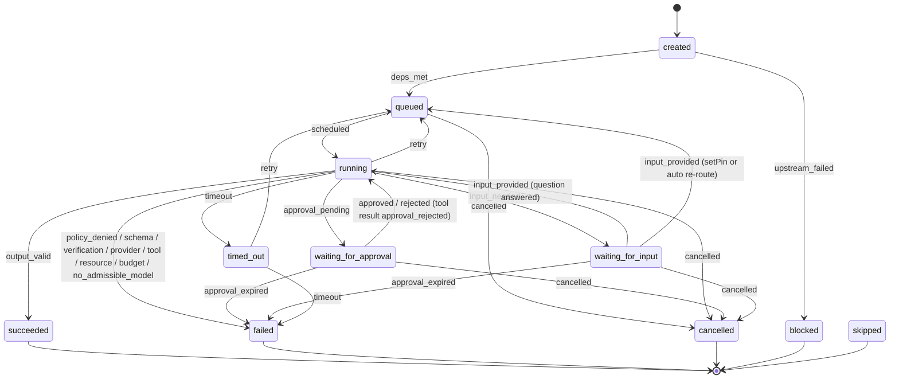

# A13 Workflow runner

The workflow runner is `internal/orchestrator`. It loads a workflow template, instantiates it for one request into a workflow run, drives the task state machine, presents gates, runs the single repair round, persists everything as `task.state` and `workflow.*` events, resumes after restart, propagates cancellation, and delivers the result. It also owns the verifier result parsers (a leaf sub-package `internal/orchestrator/verify`). This file is the authority for template loading, instantiation, the state machine and transition table, gates, repair, retries, persistence, resume, cancellation, delivery, and the verifier parsers. Names are from `00-DESIGN-CORE.md`; conflicts cite `CF-xx`.

## 1. Template loading

Two templates ship inside the binary (embedded via `go:embed workflows/*.yaml`) and are also present in `workflows/` in the repo. The runner never accepts a user-supplied template in the PoC (no dynamic planning; WRD-16 §2.2).

| Template file | `metadata.name` | Selected when | Gates |
|---|---|---|---|
| `workflows/poc-coding.yaml` | `poc-coding` | `session.request.kind == "change"` (default) | G1 `gate-plan`, G2 `gate-final` |
| `workflows/poc-readonly.yaml` | `poc-readonly` | `session.request.kind == "readonly"` (CF-43, T6) | none |

### 1.1 `workflows/poc-coding.yaml` (verbatim from WRD-16 §8)

```yaml
apiVersion: warden.dev/v1alpha1
kind: Workflow
metadata: { name: poc-coding, version: 0.1.0 }
spec:
  inputs: { request: string }
  concurrency: { max_parallel: 1 }
  tasks:
    - id: plan
      agent: coder@1
      input: { mode: plan, request: "${inputs.request}" }
      produces: [plan]
    - id: gate-plan
      type: approval_gate
      depends_on: [plan]
      present: ["${artifact(plan.plan)}"]
      approvers: [session-owner]
      timeout_seconds: 86400
    - id: implement
      agent: coder@1
      depends_on: [gate-plan]
      input: { mode: implement, request: "${inputs.request}", plan: "${artifact(plan.plan)}" }
      worktree: session
      produces: [code-diff]
      retry: { max_attempts: 2 }
    - id: verify
      agent: verifier@1
      depends_on: [implement]
      input: { profiles: [build, test] }
      produces: [test-report]
      on_failure: repair
    - id: gate-final
      type: approval_gate
      depends_on: [verify]
      present: ["${artifact(implement.code-diff)}", "${artifact(verify.test-report)}"]
      approvers: [session-owner]
  repair:
    agent: coder@1
    input: { mode: repair, test_report: "${artifact(verify.test-report)}", plan: "${artifact(plan.plan)}" }
    max_rounds: 1
    rerun: [verify]
  outputs: [implement.code-diff, verify.test-report]
```

### 1.2 `workflows/poc-readonly.yaml` (NEW, CF-43, T6)

One task, no gates, no writes. `summarize` runs `coder@1` in the new `summarize` mode (task class `summarize`, cost-first, filesystem read-only because the write capability's `when: 'task.input.mode != "plan"'` is extended to `when: 'task.input.mode != "plan" && task.input.mode != "summarize"'`; see A10 and CF-43).

```yaml
apiVersion: warden.dev/v1alpha1
kind: Workflow
metadata: { name: poc-readonly, version: 0.1.0 }
spec:
  inputs: { request: string }
  concurrency: { max_parallel: 1 }
  tasks:
    - id: summarize
      agent: coder@1
      input: { mode: summarize, request: "${inputs.request}" }
      produces: [repo-map]
  outputs: [summarize.repo-map]
```

### 1.3 Load and validate

At daemon start the runner parses both templates once and caches the compiled form. Validation (fails daemon start with a `runtime.start` `errors[]` entry and `system.doctor` fail row `workflow.templates`):

1. `apiVersion == warden.dev/v1alpha1`, `kind == Workflow`.
2. Task ids unique; `depends_on` acyclic; each `depends_on` id exists.
3. Every `agent` reference (`coder@1`, `verifier@1`) resolves to a loaded manifest whose major version matches (A02, agents from `agents/`).
4. Every `${artifact(task.type)}` and `${inputs.field}` expression parses (§2.1) and its referenced task and artifact type are declared (`produces`).
5. `type: approval_gate` tasks have `present`, `approvers`, and, for `gate-plan`, `timeout_seconds`.
6. `repair.max_rounds == 1` (CF-24; the PoC does not support more), `repair.rerun` lists existing tasks.
7. Every `produces` type is a registered artifact type (`plan`, `code-diff`, `test-report`, `repo-map`; core §3).

A template that fails validation is not selectable; the daemon still starts if the other template is valid, and `system.doctor` reports which.

## 2. Instantiation

`session.request` creates a `workflow_run` row and emits `workflow.start` (`template`, `template_version`, `inputs_hash = sha256(JCS(inputs))`, `resumed_from: null`). The runner then materializes concrete tasks (`tsk_<ULID>`, `task_key` = template id) in state `created`, each with `attempts: 0`.

### 2.1 Expression resolution

Expressions appear only in `input` and `present`. They are resolved lazily, when a task is scheduled (for `input`) or a gate is presented (for `present`), so an expression can reference an artifact produced by an already-succeeded upstream task.

| Form | Resolves to | Notes |
|---|---|---|
| `${inputs.request}` | the run's `inputs.request` string | request text (already redacted at persistence; the raw text is held in memory for the run only, never re-persisted) |
| `${inputs.<field>}` | the named run input | only `request` exists in the PoC templates |
| `${artifact(<task_key>.<type>)}` | the artifact id of the latest version of that type produced by that task | resolution defined in §2.2 |

Resolution algorithm for `${artifact(task_key.type)}`:

1. Find all `artifact.created`/`artifact.edited` events in this run with `task_id` matching `task_key` and `type` matching.
2. If none exist yet, resolution fails: the depending task cannot be scheduled and stays `created`; this is a template bug caught at validation (§1.3), so at runtime it only happens transiently before the upstream succeeds.
3. Otherwise follow the `supersedes` chain to its head: pick the artifact that is not superseded by any other artifact of that type in this run. That is the "latest version" (CF-26). Concretely: build the set S of artifacts (task_key,type); the head is the unique member not appearing in any other member's transitive `supersedes` ancestry. Ties cannot occur because each new version records exactly one `supersedes` and the chain is linear in the PoC (implement's `code-diff` → repair's `code-diff`).

Worked example (canonical demo, CF-26): `gate-final.present = ["${artifact(implement.code-diff)}", "${artifact(verify.test-report)}"]`. After a repair round, `implement` produced `art_diff_1` and the repair task (materialized as attempt semantics of `implement`; see §5) produced `art_diff_2` with `supersedes: art_diff_1`. `${artifact(implement.code-diff)}` resolves to `art_diff_2` (the head), so G2 shows the cumulative diff from the session base commit, not the first implement diff. `${artifact(verify.test-report)}` resolves to the report from `verify-2` (the head of the `test-report` chain), which shows 43 passed.

Note on `task_key` for the repair round: the repair task's events carry `task_key: repair-1` and its `code-diff` records `supersedes` pointing at implement's `code-diff`. Because `${artifact(implement.code-diff)}` walks the `supersedes` head of the `code-diff` type produced anywhere in the run, it still finds `art_diff_2`. The runner scopes the `${artifact(implement.code-diff)}` lookup to the artifact **type** `code-diff` across the run when a repair round exists, which is why the head walk (not a strict task-id match) is the resolution rule. This is DEV:artifact-resolution (below).

## 3. Task state machine

States and reason codes are from core §3. The PoC keeps all eleven states in the schema; `skipped` and `blocked` are unused by `poc-coding` (no `on_failure: skip`, no fan-in) but retained (CF-27). `timed_out` is reachable from gate timeout and execution `timeout_seconds`.



This diagram is the task lifecycle: a task starts `created`, becomes `queued` when its dependencies are satisfied, and runs. From `running` it can pause for an approval or a clarifying question, complete, retry on a transient error, fail, time out, or be cancelled. Inline approvals live in the `waiting_for_approval` branch; approving or rejecting both return the task to `running` (a rejection reaches the model as a failed tool result, ID-10), and only expiry or cancel ends it there. A model question (ID-05), a router with no admissible model, or a tier-bounded fallback that ran out of candidates (ID-16) lives in `waiting_for_input`; it is left by an answer, by `session.setPin`, or by an automatic re-route (ID-04). Gate tasks follow the reduced path described under the table. Terminal states (`succeeded`, `failed`, `cancelled`, `blocked`, `skipped`) end the task; `timed_out` re-queues only if attempts remain.

### 3.1 Transition table

Every row emits a `task.state` event (`from`, `to`, `reason`, `attempt`, `detail`). Reason codes are core §3.

| # | From | To | Trigger | Guard | Reason | Events emitted (besides `task.state`) | Side effects |
|---|---|---|---|---|---|---|---|
| 1 | created | queued | all `depends_on` reached a `join`-accepted terminal state | default join = all `succeeded` | `deps_met` | n/a | task enters scheduler ready set |
| 2 | created | blocked | an upstream task terminated `failed`/`cancelled` and `on_failure` is `fail` (default) | n/a | `upstream_failed` | n/a | run status recomputed (§9) |
| 3 | queued | running | scheduler picks it (`max_parallel: 1`, so at most one non-gate task runs) | sandbox + worktree ready | `scheduled` | `sandbox.create`, `worktree.*` (implement only), `context.assembled` | `attempt += 1`; execution row created (`exe_<ULID>`) |
| 4 | running | waiting_for_approval | PDP returned `approval_required` for a tool call | rule allows the scope | `approval_pending` | `policy.decision(approval_required)`, `approval.requested` | wall-clock budget pauses (CF-38); sandbox kept alive |
| 5 | waiting_for_approval | running | `approval.resolve(approve)` within 24 h | scope ≤ `scope_max` | `approved` | `approval.resolved(approve)`, `policy.decision(allow, resolved_by_approval)` | wall-clock resumes; tool call proceeds to `tool.exec.start` |
| 6a | waiting_for_approval | running | `approval.resolve(reject)` (ID-10) | n/a | `rejected` | `approval.resolved(reject)`, `tool.exec` not started; the model gets `{ok:false, error:{code:"approval_rejected"}}` as the tool result | wall-clock resumes; the model may adapt; three identical rejections/denials end the step per WRD-04 §7.4 (the agent loop, A10, then fails the task `policy_denied` if it cannot complete) |
| 6b | waiting_for_approval | failed | 24 h elapsed with the prompt open | n/a | `approval_expired` | `approval.resolved(expire)` | sandbox destroyed; partial `code-diff` stored `partial: true` |
| 7a | running | waiting_for_input | agent called `approval.request` (R0 host tool, ID-05) | `policy.decision(allow)` | `input_needed` | `policy.decision(allow)`, `tool.exec.start(executor: host)`, `approval.requested(kind: question)` | wall-clock pauses |
| 7b | running | waiting_for_input | router has no admissible candidate at a model call, or tier-bounded fallback exhausted with only higher tiers left (ID-16, CF-44) | n/a | `no_admissible_model` / `provider` | `routing.decision(chosen: null)` or `routing.fallback(to: null)` | wall-clock pauses; UI offers "Continue on <model> (<tier>)" = `session.setPin` |
| 8a | waiting_for_input | running | question answered: `approval.resolve {approval_id, decision, answer}` (ID-05) | answer ≤ 4,000 chars, redacted | `input_provided` | `approval.resolved`, `tool.exec.end` (output = answer, untrusted-tagged as user input) | wall-clock resumes |
| 8b | waiting_for_input | queued | re-route succeeds after `session.setPin`, `provider.configured(result ok)`, a `workspace.classification` change, or a circuit closing (ID-04) | reason was `no_admissible_model` or `provider`; new candidate admissible | `input_provided` | then `queued → running (scheduled)` and a new `routing.decision {pin}` when the task resumes (A05 `session.setPin`) | the orchestrator calls `Reroute` for every paused task of the session; this `queued → running` does **not** increment `attempt` (same execution, same sandbox and transcript; ASM below); wall-clock resumes |
| 8c | waiting_for_input | failed | question unanswered for 24 h | n/a | `approval_expired` | `approval.resolved(expire)` | sandbox destroyed |
| 9 | running | succeeded | agent produced schema-valid output; artifacts stored | verify: build exit 0 and `failed == 0` (§8) | `output_valid` | `artifact.created`, `model.call.end`, `worktree.checkpoint` (implement/repair) | outputs available to dependents; scheduler re-scans |
| 10 | running | queued | retryable error and `attempt < max_attempts` | error retryable (§6) | `retry` | `model.call.end(error)` or `tool.exec.end(error)` | backoff timer; worktree preserved; `context.note` added next attempt |
| 11 | running | failed | non-retryable error, or attempts exhausted, or schema-invalid after one repair turn, or verify failed after repair | n/a | `policy_denied`/`schema`/`verification`/`provider`/`tool`/`resource` | matching error event | sandbox destroyed; `checkpoint` artifact on budget; run status recomputed |
| 12 | running | failed | execution budget exhausted (manifest `max_cost_usd`, `max_tokens`, `max_steps`); a session or daily budget instead pauses the task (see side effects) | n/a | `budget` | `model.call.end`, `artifact.created(checkpoint)` | session or daily budget: the task pauses `waiting_for_input(budget)` and the run shows `waiting` (ST-4) until `session.setBudget` (§9.2); only the execution budget fails the task |
| 13 | running | timed_out | execution `timeout_seconds` elapsed (wall-clock, minus paused time) | n/a | `timeout` | `tool.exec.end`(if a proc was running) | process group killed via `exec.proc.signal` |
| 14 | timed_out | queued | `attempt < max_attempts` and task idempotent (all PoC tasks are) | n/a | `retry` | n/a | re-queued after backoff |
| 15 | timed_out | failed | no attempts left | n/a | `timeout` | n/a | sandbox destroyed |
| 16 | any non-terminal | cancelled | `session.cancel` | n/a | `cancelled` | `sandbox.destroy`, `worktree.checkpoint(partial)` | see §7 |
| 17 | created | skipped | (unused in PoC; `on_failure: skip`) | n/a | n/a | n/a | n/a |

Gate tasks (`gate-plan`, `gate-final`) use a reduced set: `created → queued (deps_met) → waiting_for_approval (approval_pending, on presentation) → succeeded (approved) | failed (rejected) | timed_out (timeout 86400) | cancelled`. A gate never enters `running`; its "work" is the presentation (§4).

## 4. Gates

A gate is an approval with scope `once` (core §13.2; WRD-07 §7). When all `depends_on` succeed, the runner resolves `present` expressions (§2.1), sets the gate task to `waiting_for_approval`, and emits `workflow.gate.presented` (`gate_id`, `gate_key`, `artifacts[]`). The run status becomes `waiting`. The gate is resolved by `workflow.resolveGate` (`decision`, optional `edited_artifact`, optional `comment`), which emits `workflow.gate.resolved` and moves the gate to `succeeded` (approve) or `failed` (reject).

### 4.1 Presentation

| Gate | `gate_key` | Artifacts presented | UI screen |
|---|---|---|---|
| G1 | `gate-plan` | `plan` (latest version) | SCR-3 Plan review |
| G2 | `gate-final` | `code-diff` head, `test-report` head | SCR-5 Result review |

### 4.2 `resolveGate` semantics: approve / reject / edit

- **approve at G1** (`decision: approve`, no `edited_artifact`): gate `succeeded`; `implement` becomes `queued`. `workflow.gate.resolved(decision: approve, edited_artifact: null)`.
- **edit at G1** (`decision: approve`, `edited_artifact`: full plan JSON): the runner validates the edited plan against `schemas/artifacts/plan.json`, stores it as a new `plan` artifact version with `supersedes` = the presented plan and `artifact.edited(edited_by: user)`, then treats the gate as approved. `implement` resolves `${artifact(plan.plan)}` to the edited head. There is no separate `workflow.editPlan` method (CF-12). Editing at G2 is not offered (G2 presents diff and report, not an editable artifact).
- **approve at G2** ("Accept result", ID-01): gate `succeeded`, then immediately and in this order: `chain.checkpoint(trigger: workflow_end)` (ID-14), `artifact.created(final-result)` (§10.3; its `chain_checkpoint` field cites the checkpoint just written), `workflow.end(status: succeeded, reason: output_valid, final_result: <art>)`. The run is over; deliveries happen afterwards on the succeeded run (§10).
- **reject** (G1 or G2): gate `failed(rejected)`, `workflow.gate.resolved(decision: reject)`; the run ends `cancelled`, reason `rejected` (§4.3, §4.4).

A delivery action pressed in the UI while G2 is still open (`Apply to branch`, `Commit`, `Export patch`, `Push`) first calls `workflow.resolveGate(approve)` and then `workflow.deliver` (ID-01). The CLI does the same for `warden deliver <run>` when the run's G2 is open. `workflow.deliver` itself never resolves a gate.

### 4.3 Reject at G1 → run cancelled

**Decision (ID-01): reject at G1 ends the run with status `cancelled`, reason `rejected`.** At G1 nothing has been implemented (the worktree holds only the base checkpoint), so there is nothing to keep; the user decided not to proceed, which is a user stop rather than a machine fault (`failed` reason codes are reserved for machine and verification faults and drive error surfaces). `implement` and every downstream task move `created → blocked (upstream_failed)`; the runner emits `workflow.end(status: cancelled, reason: rejected, final_result: null)`. The session stays open; `Iterate` starts a new run.

### 4.4 Reject at G2 → run cancelled

**Decision (ID-01): reject at G2 ("Discard result") ends the run with status `cancelled`, reason `rejected`.** Nothing is delivered and no `final-result` artifact is created. `gate-final` goes `waiting_for_approval → failed(rejected)`; the runner emits `workflow.end(status: cancelled, reason: rejected, final_result: null)`. The verified evidence (code-diff head, test-report head, all events) stays readable in SCR-5 and in `warden diff` / `warden report`; the session worktree and branch are kept until session cleanup, so `Iterate` can start a new run. `workflow.deliver` on this run returns `-32003 invalid_state` for every action (only `succeeded` runs, and `export_patch` on `failed(verification)` runs, accept deliveries; ID-02). `warden audit verify --strict` is unaffected.

Distinction from CF-24: CF-24 is `verify-2` failing, which never reaches G2 and ends the run `failed(verification)`. §4.4 is the user discarding a passing result at G2 (`cancelled(rejected)`). Distinction from push rejection: rejecting the `git.push` approval after G2 approval does not change the run, which is already `succeeded` (§10.2).

## 5. Repair round

`verify` carries `on_failure: repair`. When `verify` fails (build non-zero or `failed > 0`; §8) and the round budget allows (`repair.max_rounds: 1`, so only if no repair has run yet), the runner:

1. Materializes the repair task `repair-1` (`task_key: repair-1`, `coder@1`, mode `repair`), input resolved from `repair.input`: `test_report = ${artifact(verify.test-report)}` (the failing report head), `plan = ${artifact(plan.plan)}` (the approved plan head). No `request` is passed in repair mode; the coder works from the plan and the failure analysis in the report (CF-25: the failure analysis is `test-report.analysis`, not a separate artifact).
2. `repair-1` runs in the same session worktree (`worktree: session`), on the session branch, from the end-of-implement checkpoint. It produces a `code-diff` with `supersedes` = implement's `code-diff` (cumulative from the session base commit, CF-26).
3. On `repair-1` success, the runner re-runs the tasks in `repair.rerun` = `[verify]`, materialized as `verify-2` (`task_key: verify-2`). `verify-2` produces a `test-report` with `supersedes` = the first report.
4. `verify-2` success → `gate-final` becomes `queued` → G2 presented. `verify-2` failure → **no G2**; run ends `failed(verification)` (CF-24). The session view shows a read-only result (diff head, failing report head) with `Iterate` and `Export patch`; `Apply`, `Commit`, `Push` are unavailable (CF-24; B03 SCR-5 ST-6-like read-only variant).

There is exactly one repair round. If `repair-1` itself fails (its own retries exhausted; §6), the run ends `failed` with the repair task's reason (e.g. `provider`, `budget`), no G2.

## 6. Retries and backoff

`implement` declares `retry: { max_attempts: 2 }` (WRD-16 §8). The runner implements this at the **execution** level: a task attempt is one execution (`exe_<ULID>`), `attempt` counts up on each `queued → running`. `plan`, `verify`, `verify-2`, `repair-1`, `summarize` have no `retry` block, so `max_attempts` defaults to 1 (WRD-07 §5: verification failure is a repair round, not a retry; planning failure fails the run).

Backoff (WRD-06 §7 values, since WRD-16 §8 omits them): exponential with jitter, `initial_ms: 2000`, `multiplier: 2`, full jitter, capped at 30 s. Between `running → queued (retry)` and the next `queued → running`, the runner waits `min(30000, initial_ms * multiplier^(attempt-1)) * rand(0.5,1.0)` ms. The re-queued attempt resumes from the task's worktree state; a `context.note` summarizes the previous attempt's failure (WRD-07 §5 idempotency), added as the first assembled context source next attempt.

### 6.1 Which errors are retryable (WRD-07 §5, WRD-05 §4, WRD-06 §7)

Two layers. **Within one execution**, the router handles provider-transient errors first (up to 3 retries, then fallback within the same or a lower tier; A09). Provider errors never consume a task attempt: when in-tier fallback is exhausted, the task pauses in `waiting_for_input` instead (ID-16, CF-44, WRD-02 §11 "otherwise `waiting_for_input`"). A task attempt is consumed (`running → queued (retry)`) only when the execution fails with a tool-transient error:

| Error class (WRD-05 code / source) | Task-level retryable? | Handling |
|---|---|---|
| `provider_unavailable`, `rate_limited`, `timeout` (model) | No (handled in the execution) | router retries, then falls back within the same or a lower tier; if nothing admissible remains in that bound, `running → waiting_for_input` with reason `provider` (a higher tier exists: UI offers "Continue on <model> (<tier>)", which calls `session.setPin`) or `no_admissible_model` (nothing configured); unblocked per row 8b |
| Tool transient: sandbox creation failure, `warden-exec` crash | Yes | new sandbox, worktree preserved (WRD-07 §5); `reason: tool` on the failing attempt, `retry` on re-queue |
| `context_too_long` | No | agent loop compacts within the execution (A10); if it still overflows, fail `schema`/`provider`; not a fresh attempt |
| `auth_failed`, `model_not_found`, `invalid_request`, `content_filtered`, `tool_format_unsupported` | No | fail immediately, reason `provider` |
| `policy_denied` | No | the agent may adapt within the execution; the task fails only if the agent cannot complete (reason `policy_denied`) |
| Output schema invalid | No (one in-execution repair turn only) | one repair turn inside the execution (A10), then fail `schema` |
| Verification failed | No (repair round, not retry) | §5 |
| Budget exhausted | No | `checkpoint` artifact; fail `budget` (execution) or run `waiting` (session/daily) |
| `cancelled` | No | terminal `cancelled` |
| `no_admissible_model` | No | `waiting_for_input`, not a retry; unblocked by `session.setPin` or automatic re-route (ID-04) |

`implement` therefore gets at most 2 attempts, consumed only by tool-transient failures (sandbox creation, executor crash, and a daemon restart per §9.1); each attempt may internally retry and fall back model calls. `verify` gets 1 attempt but its failure spawns the repair round.

## 7. Cancellation propagation (core §13.10)

`session.cancel(session_id, task_id?)` cancels one task or the whole run. Sequence (hard deadline 5 s from request to `task.state(cancelled)`, S-8):

1. Runner marks the target(s) `cancelled` intent; children first, then parents (WRD-07 §8). For a run cancel, all non-terminal tasks are targeted.
2. Context cancellation to the agent loop and the provider adapter (Go `context.Context`), stopping the in-flight model call.
3. `exec.proc.signal TERM` to the process group of any running proc; after 3 s, `exec.proc.signal KILL`; then `exec.shutdown` to `warden-exec`.
4. `sandbox.destroy(reason: cancelled, killed_pids, duration_ms)`.
5. Partial `code-diff` stored with `partial: true`; a checkpoint commit `warden: checkpoint partial` is kept on `refs/warden/partial/<task_key>`; the worktree is preserved for inspection (core §13.10).
6. `task.state(→ cancelled, reason: cancelled)` for each target; run status → `cancelled` if the whole run was cancelled, else recomputed (§9).

`session.cancel` returns `cancelled_task_ids[]` and `run_status` within 5 s.

### 7.1 `workflow.resume`

`workflow.resume(run_id, from: "last_gate")` creates a **new** run (`wfr_<ULID>`) that resumes from the last approved gate (core §13.10). For `poc-coding` the last approved gate is `gate-plan` (G1): the new run copies the approved plan artifact (G1 already resolved, so it is not re-presented) and starts `implement` from the `gate-plan` checkpoint commit. `workflow.start` carries `resumed_from: {run_id: <old>, gate_key: gate-plan}`. If cancellation happened before G1 approval, resume restarts from `plan`. Only `last_gate` is supported in the PoC (the method rejects other `from` values with `invalid_state`).

## 8. Verifier and result parsers

`verify` (and `verify-2`) is mostly deterministic (WRD-16 §7.2, core §13.12). The runner, acting as the `verifier` agent's execution, resolves the profile classes to concrete profiles by stack detection, runs each as a normal policy-checked `proc.exec` (actor `verifier`) and parses the results into the `test-report` schema. `verify` succeeds only if the build profile exits 0 and tests `failed == 0` (core §13.12).

**Model call only on failure (ID-09).** If the build exit is 0 and `failed == 0`, `analysis` is generated deterministically (template: `"Build <build_profile> passed; <passed> tests passed, <skipped> skipped, 0 failed in <duration>."`) and no `routing.decision` and no `model.call.*` event is emitted for this task. Only when the report has failures does the runner route the verifier (task class `verify`, cost-first) and let the model read files and write the two-sentence `analysis` (≤ 20 steps). If that routing pauses (`waiting_for_input`, ID-16) or the model call fails, the report is still stored with `analysis: ""` once the task leaves the pause, because the pass/fail outcome does not depend on the analysis.

### 8.1 Stack detection (CF-29)

The verifier input `{profiles: [build, test]}` uses profile **classes** `build` and `test`. They resolve per workspace by detecting the stack at the worktree root:

| Marker file at worktree root | Stack | `build` class → concrete profile | `test` class → concrete profile |
|---|---|---|---|
| `package.json` present | node | `node-build` | `node-test` |
| `go.mod` present | go | `go-build` | `go-test` |
| `pyproject.toml` or `requirements.txt` present | python | (none; build is a no-op success) | `python-test` |

If several markers exist, precedence is `go.mod` > `package.json` > python markers (a Go repo with a helper `package.json` verifies as Go); a repo with none fails `verify` with `reason: verification`, detail `no_stack_detected`. The concrete profile expands to the exact commands in `policy/platform-defaults.yaml` (CF-30, WRD-16 §9 table verbatim). The verifier runs the first command of each profile that the stack provides; for tests it runs the command variant that emits machine-readable output (§8.3–8.5).

### 8.2 Exact commands per stack

The verifier runs build then test. Commands are the machine-readable variants; each is a `proc.exec` matched to its profile (allowed by `user.profile-commands`, no approval).

| Stack | Build command (profile) | Test command (profile) | Reporter flag added |
|---|---|---|---|
| node | `npm run build` (`node-build`); if absent, `npx tsc --noEmit` | `npm test -- --reporter=json --outputFile=<scratch>/vitest.json` (`node-test`) | Vitest JSON reporter to a scratch file |
| go | `go build ./...` (`go-build`) | `go test -json ./...` (`go-test`) | streams JSON events on stdout |
| python | none (build success) | `pytest --json-report --json-report-file=<scratch>/pytest.json -q` if `pytest-json-report` present, else `pytest -q --junitxml=<scratch>/pytest.xml` (`python-test`, CF-31) | JSON plugin or JUnit XML |

`<scratch>` is `~/.warden/sessions/<ulid>/scratch/<task_key>/` mounted into the sandbox (core §10). The reporter output file is read back with `exec.fs.read` after the process exits; for `go test -json` the parser consumes stdout directly. The build exit code and the test process exit code are captured from `exec.proc.wait`.

### 8.3 Vitest JSON reporter fields used

Vitest `--reporter=json` writes a JSON object. Fields consumed:

| test-report field | Vitest JSON source |
|---|---|
| `passed` | `numPassedTests` |
| `failed` | `numFailedTests` |
| `skipped` | `numPendingTests + numTodoTests` |
| `duration_ms` | `testResults[].perfStats` summed, or top-level `startTime`/end if present; fallback to wall-clock of the proc |
| `failures[].name` | for each `testResults[].assertionResults[]` with `status == "failed"`: `ancestorTitles.join(" > ") + " > " + title` |
| `failures[].message` | `assertionResults[].failureMessages[]` joined, truncated (§8.7) |
| `exit_code` | proc exit code |

If `--outputFile` produced no file (older Vitest), the parser falls back to parsing stdout as JSON; if that fails, `verify` fails `reason: verification`, detail `reporter_unavailable` and the raw stderr excerpt is stored.

### 8.4 `go test -json` event stream aggregation

`go test -json ./...` emits one JSON object per line (`{Time, Action, Package, Test, Elapsed, Output}`). The parser aggregates:

- Track per-`Test` (keyed by `Package` + `Test`) the last `Action`: `pass`, `fail`, or `skip`. A line with a `Test` field and `Action` in {`pass`,`fail`,`skip`} is a terminal per-test result. Lines with `Action: output` accumulate output for that test (for failure messages) and for the package.
- `passed` = count of tests whose terminal action is `pass`; `failed` = `fail`; `skipped` = `skip`. Subtests (`Test` containing `/`) are counted individually.
- **Package-level failures**: a line with a `Package` but no `Test` and `Action: fail` denotes a package that failed to compile or a `TestMain`/panic failure with no per-test result. Each such package adds one synthetic entry to `failures[]` named `<package> (package)` and increments `failed` by 1 if no per-test failure was recorded for it (avoids double counting when tests also failed).
- **Build failures**: `go build ./...` non-zero exit, or `go test` emitting a `Action: fail` at package level with output containing `build failed`/`cannot find package`/compile errors, sets `exit_code != 0`; the report's `build` portion fails and `verify` fails regardless of test counts. The compile error text (first 4 KiB) goes into `failures[].message` for the synthetic package entry.
- `duration_ms` = sum of package `Elapsed` (seconds → ms), or wall-clock fallback.
- `failures[].message` = concatenated `Output` lines for that test, truncated (§8.7).

### 8.5 pytest (CF-31)

Preferred: `pytest-json-report` plugin, file `<scratch>/pytest.json`. Fields:

| test-report field | pytest-json-report source |
|---|---|
| `passed` | `summary.passed` |
| `failed` | `summary.failed + summary.error` |
| `skipped` | `summary.skipped + summary.xfailed` |
| `duration_ms` | `duration` (s → ms) |
| `failures[].name` | for each `tests[]` with `outcome` in {`failed`,`error`}: `nodeid` |
| `failures[].message` | `call.longrepr` (or `setup.longrepr` for errors), truncated |
| `exit_code` | proc exit code |

Fallback (plugin absent): `pytest -q --junitxml=<scratch>/pytest.xml`, parse JUnit XML. Map: `passed` = total testcases − failures − errors − skipped; `failed` = `<testsuite failures> + <testsuite errors>`; `skipped` = `<testsuite skipped>`; `duration_ms` from `<testsuite time>`; each `<testcase>` with a child `<failure>`/`<error>` → `failures[]` with `name = classname + "." + name`, `message = failure/@message + text`, truncated. Detection: the parser checks for `pytest-json-report` by running the JSON variant first; on a plugin-missing error (exit code 4 / "unrecognized arguments: --json-report") it re-runs the JUnit variant (recorded as one extra `proc.exec`).

### 8.6 Mapping to the `test-report` schema

All parsers produce the same record (WRD-16 §7.4, core §3 artifact type `test-report`):

```json
{
  "$schema": "https://json-schema.org/draft/2020-12/schema",
  "$id": "https://schemas.warden.dev/poc/artifacts/test-report.json",
  "type": "object",
  "required": ["profile", "exit_code", "passed", "failed", "skipped", "failures", "duration_ms"],
  "properties": {
    "profile": { "type": "string", "description": "concrete test profile, e.g. node-test" },
    "build_profile": { "type": "string" },
    "build_exit_code": { "type": "integer" },
    "exit_code": { "type": "integer", "description": "test process exit code" },
    "passed": { "type": "integer", "minimum": 0 },
    "failed": { "type": "integer", "minimum": 0 },
    "skipped": { "type": "integer", "minimum": 0 },
    "failures": {
      "type": "array",
      "items": {
        "type": "object",
        "required": ["name", "message"],
        "properties": {
          "name": { "type": "string" },
          "message": { "type": "string", "description": "truncated failure text" },
          "truncated": { "type": "boolean", "default": false }
        }
      }
    },
    "duration_ms": { "type": "integer", "minimum": 0 },
    "analysis": {
      "type": "string",
      "description": "failures: two-sentence analysis written by the verifier model; green run: deterministic one-line summary, no model call (ID-09)"
    }
  }
}
```

`profile` = the concrete test profile; `build_profile`/`build_exit_code` record the build step (absent for python where build is a no-op). `verify` success guard: `build_exit_code == 0` (or no build step) AND `failed == 0` AND `exit_code == 0`. The verifier model writes `analysis` only when there are failures (root cause + likely files, two sentences; WRD-16 §7.3); a green report gets the deterministic summary (ID-09).

### 8.7 Truncation of failure messages

Each `failures[].message` is truncated to 4 KiB (4096 bytes, UTF-8 safe: cut at a rune boundary). If cut, append `\n… [truncated N bytes]` and set `failures[].truncated: true`. The total `failures[]` array is capped at 50 entries; beyond that, a final synthetic entry `{name: "… and N more failures", message: ""}` is added. The full untruncated output is available via the execution's `tool.exec.end.output_ref` blob for audit, never inlined into model context (BI-4: it enters as untrusted, and only the truncated report reaches the verifier model).

### 8.8 Parser interface (Go sketch)

```go
package verify

// Report is the parsed, schema-shaped result (before the model's analysis).
type Report struct {
    Profile      string
    BuildProfile string
    BuildExit    int
    ExitCode     int
    Passed       int
    Failed       int
    Skipped      int
    Failures     []Failure
    DurationMS   int64
}

type Failure struct {
    Name      string
    Message   string
    Truncated bool
}

// Parser turns raw verifier output into a Report. One implementation per reporter format.
type Parser interface {
    // Stack returns the stack this parser serves ("node","go","python").
    Stack() string
    // Parse consumes the process result. For go test -json, stdout is the event
    // stream; for Vitest/pytest-json it is the reporter file bytes; junit is XML.
    // buildExit is the build profile's exit code (0 or "no build" via ok=false).
    Parse(in ParseInput) (Report, error)
}

type ParseInput struct {
    ConcreteProfile string   // "node-test" | "go-test" | "python-test"
    BuildProfile    string   // "" when none
    BuildExit       int
    HasBuild        bool
    TestExit        int
    Stdout          []byte   // go test -json stream
    ReporterFile    []byte   // vitest.json / pytest.json / pytest.xml
    ReporterKind    string   // "vitest-json" | "gotest-json" | "pytest-json" | "junit-xml"
    WallClockMS     int64
}

// Detect picks the stack and concrete profiles for a worktree (CF-29).
func Detect(worktreeRoot string) (stack string, build, test string, err error)

// Registry resolves a Parser by reporter kind.
func ParserFor(kind string) (Parser, error)
```

The verifier execution flow: `Detect` → run build proc → run test proc (with reporter flag) → read reporter file / capture stdout → `ParserFor(kind).Parse` → if green: deterministic `analysis`, store `test-report`, task `succeeded` with no model call (ID-09); if failing: route the verifier model, which writes `analysis`, then store `test-report` and move the task to `failed(verification)`. `verify` state is derived from `Report` per §8.6, never from the model.

## 9. Persistence and the tasks table as a projection

The event log is the source of truth (WRD-16 §5.1: "state transitions persisted as `task.state` events; resumable from events"). The `tasks`, `workflow_runs` and `executions` SQLite tables are **projections** maintained by the store as events are appended, never authoritative:

- Every state change is a `task.state` event (append-only, hash-chained, session chain). The store, on writing a `task.state` event, updates the `tasks` row (`state`, `attempts`, `reason`) in the same transaction (A04). If the projection update and the event append ever disagree (e.g. after a crash mid-transaction), the event log wins: the projection is rebuilt by replay (§9.1).
- `workflow.start`/`workflow.end` maintain `workflow_runs.status`; `sandbox.create`/`model.call.*` maintain `executions`.
- Run status (§9.2) is recomputed from task states and written to `workflow_runs.status`; `workflow.end` is emitted once, at the terminal run outcome. Deliveries after `workflow.end` (§10) add `workflow.delivered` events to the same session chain but never change the run status.

### 9.1 Resume after restart (core §13.11)

On `wardend` start, for each non-terminal run:

1. Replay `task.state` events per run to rebuild task states (projection rebuild).
2. Any task left in `running` (its execution died with the daemon): if `attempt < max_attempts`, emit `task.state(running → queued, reason: retry, detail: "interrupted")`; otherwise emit `task.state(running → failed, reason: interrupted)`. The interrupted attempt counts as consumed. Tasks left in `waiting_for_input` stay there and are re-routed automatically (ID-04) once the daemon is up.
3. Open inline approvals belonging to interrupted executions → `approval.resolved(cancel)`.
4. Gate tasks in `waiting_for_approval` stay open (the presentation persists; the gate is re-shown to clients on reconnect).
5. Sandboxes from the previous process are killed by pid file / cgroup; `sandbox.destroy(reason: orphan)` recorded (core §13.11).
6. Re-derive and persist run status.

### 9.2 Run status derivation rules (core §3 workflow run status)

Run status is a pure function of its tasks and gates, recomputed on every task state change:

| Run status | Condition |
|---|---|
| `running` | at least one task `running`/`queued`, and no gate/approval currently open |
| `waiting` | a gate task is `waiting_for_approval`, or any task is `waiting_for_approval`/`waiting_for_input`, and no task is actively `running` |
| `succeeded` | `gate-final` approved (ID-01; `final_result` set at that moment, before any delivery), OR (readonly) `summarize` succeeded |
| `failed` | a task terminal `failed`/`timed_out`/`blocked` on the critical path with no recovery (e.g. `plan` failed, `implement` attempts exhausted, `verify-2` failed per CF-24, a gate timed out) |
| `cancelled` | the run was cancelled (§7), or G1 was rejected (§4.3), or G2 was rejected (§4.4); reason `cancelled` or `rejected` |

Priority when several could apply: `cancelled` > `failed` > `waiting` > `running` > `succeeded`. `succeeded`, `failed` and `cancelled` are terminal: once `workflow.end` is written, later events (deliveries, `approval.revoked`) never change the status. A run in `waiting` due to session-budget exhaustion (ST-4) is resolved by `session.setBudget`; a run in `waiting` because a task paused with `no_admissible_model`/`provider` is resolved by `session.setPin` or an automatic re-route (ID-04, ID-16).

## 10. Delivery after the run (ID-01, ID-02, ID-03)

G2 approval ends the run (§4.2): `chain.checkpoint(trigger: workflow_end)` → `artifact.created(final-result)` → `workflow.end(status: succeeded)`. Delivery is a separate, post-run step driven by `workflow.deliver(run_id, action, ...)`. A14 owns the git mechanics; this section owns the state rules and the event sequence.

### 10.1 Preconditions

| Run status | Allowed `action` | Otherwise |
|---|---|---|
| `succeeded` (G2 approved) | `apply_branch`, `commit`, `export_patch`, `push` | n/a |
| `failed(verification)` (CF-24) | `export_patch` only | `-32003 invalid_state` |
| `cancelled`, `failed` (other reasons), `running`, `waiting` | none | `-32003 invalid_state` |

`push` additionally requires a prior successful `commit` or `apply_branch` in the same session (ID-03; else `-32003 invalid_state`), because only a published branch can be pushed. While G2 is still open, the UI and CLI first call `workflow.resolveGate(approve)` and then `workflow.deliver` (ID-01); `workflow.deliver` on a run whose G2 is open returns `invalid_state`.

### 10.2 Each delivery is a policy-checked host tool call

Every action is an ActionRequest with `actor.kind: user`, dispatched through the same Dispatcher as agent tool calls (A02, A08), so `audit verify --strict` covers it (BI-1):

| `action` | Host tool (risk) | Rule that decides | Effect | What it does (A14) |
|---|---|---|---|---|
| `apply_branch` | `git.apply_branch` (NEW, R1) | `platform.user-delivery` (NEW) | allow | publishes the session branch into the user's repository without squashing (default name `warden/<ulid>`, editable via `branch_name`) |
| `commit` | `git.commit` (R1, session branch) | `user.git-commit-session-branch` | allow | squashes the session diff into one commit on the session branch with the user's `message`, then publishes the branch as for `apply_branch` (ID-03); `worktree.checkpoint(label: delivery-commit)` |
| `export_patch` | `git.export_patch` (NEW, R1) | `platform.user-delivery` | allow | `git format-patch` into `~/.warden/exports/` |
| `push` | `git.push` (R5, host) | `user.git-push` | `approval_required`, scope `once` | pushes the published branch with the user's credential helper on the host |

Event sequence for an allowed action: `policy.decision(allow)` → `tool.exec.start(executor: host)` → `tool.exec.end` → `workflow.delivered {run_id, action, commit, branch, remote, patch_path, approval_id}` (NEW, ID-02). `workflow.deliver` returns `status: done` with `commit`/`branch`/`patch_path`.

For `push`: `policy.decision(approval_required)` → `approval.requested(kind: action, scope_max: once)`; `workflow.deliver` returns `status: approval_pending, approval_id`. On `approval.resolve(approve)`: `approval.resolved(approve, scope: once)` → `policy.decision(allow, resolved_by_approval)` → `tool.exec.start(executor: host)` → `tool.exec.end` → `workflow.delivered(action: push, remote, approval_id)`. On reject (demo step 6): `approval.resolved(reject)`, **no** `tool.exec.start`, nothing is sent to the remote, no `workflow.delivered`; the run stays `succeeded` and the branch already published by `commit` stays in the user's repository.

A failed host operation (for example the remote refuses the push) emits `tool.exec.end(ok: false, error)` and no `workflow.delivered`; the run stays `succeeded` and the action can be retried. Deliveries never create a new `final-result` version and never re-open the run.

### 10.3 `final-result` artifact

Created at G2 approval, before any delivery (ID-01; WRD-16 §7.4). Shape (core §3 type `final-result`; A04 owns the canonical schema):

```json
{
  "$schema": "https://json-schema.org/draft/2020-12/schema",
  "$id": "https://schemas.warden.dev/poc/artifacts/final-result.json",
  "type": "object",
  "required": ["summary", "changed_files", "verification", "cost", "chain_checkpoint"],
  "properties": {
    "summary": { "type": "string" },
    "changed_files": { "type": "array", "items": { "type": "string" } },
    "verification": { "enum": ["pass", "fail"] },
    "cost": {
      "type": "object",
      "properties": {
        "tokens": { "type": "object", "properties": { "input": {"type":"integer"}, "output": {"type":"integer"} } },
        "quota_units": { "type": "integer" },
        "amount": { "type": "number" }, "currency": { "type": "string" }
      }
    },
    "chain_checkpoint": {
      "type": "object",
      "properties": { "last_seq": {"type":"integer"}, "last_hash": {"type":"string"} }
    }
  }
}
```

`verification` is always `pass` (G2 is reachable only after a green `verify`/`verify-2`, H4). `chain_checkpoint` records the head of the session chain at the moment the artifact is built; the signed `chain.checkpoint(trigger: workflow_end)` written right after it covers the artifact's own `artifact.created` event (ID-14). `cost` is aggregated from the run's `model.call.end` events. Delivery outcomes are read from `workflow.delivered` events, not from this artifact.

## Traceability

| Design element | WRD source (doc §) | Requirement / invariant satisfied |
|---|---|---|
| Template loading, both templates | WRD-16 §8, §5.2; CF-43 | one fixed workflow; readonly path for T6 |
| `poc-coding.yaml` verbatim | WRD-16 §8 | workflow template |
| `poc-readonly.yaml` NEW | WRD-16 §4.2 T6; CF-43 | T6 read-only summarize, no gates |
| Expression resolution, `${artifact}` supersedes head | WRD-16 §8; WRD-07 §11; CF-26 | latest version in a supersedes chain |
| Task state machine + transition table | WRD-07 §4; WRD-16 §8; core §3 | resumable task states, reason codes |
| Gates, resolveGate approve/reject/edit | WRD-16 §8 §13; WRD-07 §7; CF-12 | G1/G2, plan edit as `edited_artifact` |
| G1 reject → cancelled; G2 approve ends run; G2 reject → cancelled | core ID-01; WRD-07 §7 | run lifecycle at gates |
| Repair round (repair-1 → verify-2, no G2 on second failure) | WRD-16 §8; CF-24, CF-25, CF-26 | H4; verify must succeed before G2 |
| Retries max_attempts 2, backoff, retryable classes | WRD-16 §8; WRD-07 §5; WRD-06 §7 | D-12 retry semantics |
| Provider exhaustion pauses, never widens tier | core ID-16; CF-44; WRD-02 §11 | BI-7, T-22 |
| Rejected inline approval returns to running | core ID-10; WRD-04 §7 | S1 "continues or stops" |
| Questions (`approval.request` kind question) and answers | core ID-05; WRD-16 §9 | BI-1, BI-4 |
| Unblocking via `session.setPin` and automatic re-route | core ID-04 | never trap the user (WRD-11 §1) |
| Green verify without a model call | core ID-09 | H4 cheap and reliable |
| Persistence as `task.state` events; tables as projection | WRD-16 §5.1 §11; WRD-09 §1 | events are source of truth |
| Resume after restart | WRD-16 §8; core §13.11; WRD-02 §11 | daemon crash recovery |
| Cancellation propagation, resume from last_gate | WRD-07 §8; core §13.10; WRD-16 §15 item 10 | S-8 5 s cancel; resume from G1 |
| Verifier stack detection, commands, parsers | WRD-16 §7.2 §9; CF-29, CF-30, CF-31; core §13.12 | H4; deterministic verification |
| test-report schema mapping, truncation | WRD-16 §7.4; WRD-09 §6; BI-4 | structured report; untrusted output |
| Post-run delivery via PDP, `workflow.delivered`, push after publish | core ID-02, ID-03; §13.9 | BI-1, S-7 (R5 `once`), H2 |
| final-result at G2 approval + `chain.checkpoint(workflow_end)` | core ID-01, ID-14; WRD-16 §7.4 | H5 provenance |
| Run status derivation | core §3 workflow run status | consistent run status |

## Deviations and assumptions

- DEV:gate-reject-cancelled: WRD-16 does not state the run status on gate rejection. Per core ID-01, reject at G1 or at G2 ends the run `cancelled(rejected)` (§4.3, §4.4).
- DEV:post-run-delivery: WRD-16 §8 draws "G2 → deliver" as one workflow. Per core ID-01/ID-02, G2 approval ends the run and deliveries are post-run policy-checked host tool calls followed by `workflow.delivered` (§10). The template file stays verbatim; delivery is not a template task.
- ASM:reroute-no-attempt: the `queued → running` step after a re-route (row 8b) continues the same execution and does not consume an attempt; only row 3 from a fresh `created`/retry increments `attempt`.
- DEV:provider-errors-pause: model transient errors never consume a task attempt; when in-tier fallback is exhausted the task pauses in `waiting_for_input` (ID-16, CF-44) instead of the WRD-07 §5 "counts toward task attempts".
- NEW (from core §15, used here): `session.setPin`, `workflow.delivered`, host tools `git.apply_branch` and `git.export_patch`, rule `platform.user-delivery`, `approval.requested.kind`, `approval.resolve.answer`, `chain.checkpoint.trigger: workflow_end`.
- DEV:artifact-resolution: `${artifact(implement.code-diff)}` after a repair round resolves by walking the `code-diff` `supersedes` head across the run (repair's diff supersedes implement's), not by strict task-id match (§2.2, CF-26). Without this G2 would show the pre-repair diff.
- DEV:backoff-values: WRD-16 §8 `retry: {max_attempts: 2}` omits backoff; adopted WRD-06 §7 values (initial 2000 ms, ×2, jitter, 30 s cap) (§6).
- DEV:build-noop-python: python `build` class resolves to a no-op success (no python build profile in WRD-16 §9); `verify` then gates on tests only (§8.1, §8.2).
- ASM:go-package-failure-counting: a package-level `fail` with no per-test failure adds one synthetic `failures[]` entry and +1 to `failed`; when per-test failures exist for that package the synthetic entry is omitted to avoid double counting (§8.4).
- ASM:stack-precedence: multi-marker repos resolve `go.mod` > `package.json` > python (§8.1); WRD-16 does not specify precedence.
- ASM:vitest-reporter: assumes Vitest with a JSON reporter writing `numPassedTests`/`numFailedTests`/`assertionResults` (Jest-compatible shape). If a project pins a Vitest version with a different JSON shape, the week-4 parser tests catch it (OQ-06).
- OQ-05: WRD-16 does not say how T6 is started; the readonly template is instantiated via `kind: readonly` on `session.request` (`--readonly` / UI toggle). Recommended answer in OPEN-QUESTIONS.
- OQ-06: pytest JSON strategy (plugin vs JUnit fallback) per CF-31.
- NEW `verify-2` and `repair-1` are `task_key` values already in core §2; used here as the materialized repair/rerun task keys.
