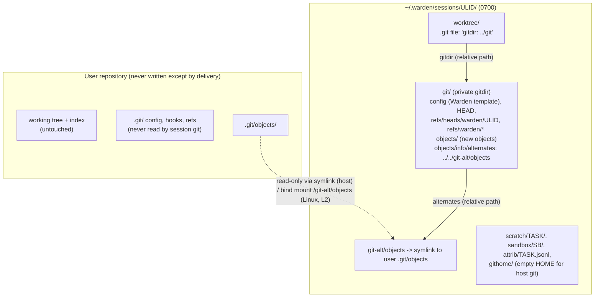
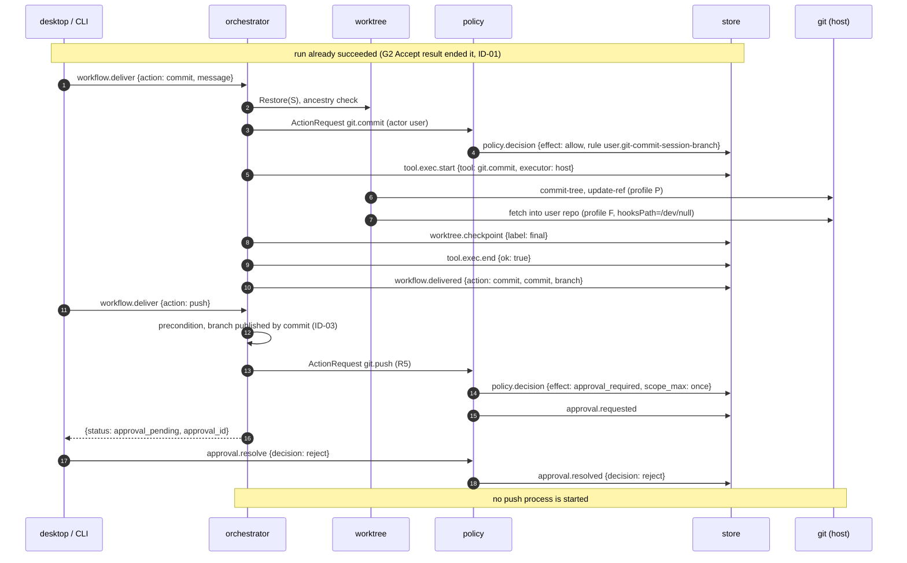

# A14 Worktree and git handling

`internal/worktree` owns everything git: the session's private repository and worktree, hook and configuration neutralization, checkpoint commits, the code-diff source, the in-sandbox git operations (through `exec.git.run`, A06), host-side delivery (apply branch, commit, push, export patch), and cleanup. It implements core §13.9 and CF-18 in full.

Principles:

1. **The user's working tree and index are never written.** The session starts from the `HEAD` commit; uncommitted changes are reported, not copied.
2. **No repository-controlled git configuration or hook is ever honored**, in the sandbox or on the host. The only configuration git sees for session operations is a file Warden writes, plus command-line overrides.
3. **The main repository's `.git` is never mounted.** Only its `objects/` directory is visible to sandboxes, read-only (CF-18).
4. **Host-side git never runs while a sandbox process of the session is alive**, and always re-sanitizes the private gitdir first (§5).
5. Host-side operations use ids recorded in events (`base_commit`, checkpoint commits), never refs that a sandbox could have moved.

Minimum git version: 2.34 (doctor check; Ubuntu 22.04 ships 2.34.1, macOS Command Line Tools ship newer). Features used: `GIT_CONFIG_COUNT` (2.31), `--no-write-fetch-head` and `--no-auto-maintenance` (2.29), `--initial-branch` (2.28), `rev-parse --path-format` (2.31), command-line `safe.directory` (2.34.2 / distro backports).

## 1. Layout



The session has its own repository whose working tree is `worktree/` and whose gitdir is `git/`. It borrows the user's objects through a **relative** alternates entry `../../git-alt/objects`, resolved from `git/objects/`. On the host that resolves to `S/git-alt/objects`, a symlink to the user's object store; inside a Linux or L2 sandbox, where `S/git` is mounted at `/git` and the user's objects at `/git-alt/objects`, the same relative path resolves to `/git-alt/objects`. The worktree's `.git` file also uses a relative path (`gitdir: ../git`), valid both at `S/worktree` and at `/work`. No absolute host path appears in any git file the sandbox reads, and nothing is registered in the user's repository (no `git worktree add`, so nothing to prune later).

## 2. Git invocation profiles

All git processes are built by one function (`worktree.gitCmd`) from one of four profiles. Every profile clears the environment first and sets `LC_ALL=C`, `GIT_TERMINAL_PROMPT=0`.

| Profile | Used for | Repository | Environment | Command-line overrides |
|---|---|---|---|---|
| `P` private | Session creation, checkpoints, diffs, delivery `commit`, `export_patch`, reset | `--git-dir=S/git --work-tree=S/worktree` | `HOME=S/githome` (empty), `GIT_CONFIG_NOSYSTEM=1`, `GIT_CONFIG_SYSTEM=/dev/null`, `GIT_CONFIG_GLOBAL=/dev/null`, `GIT_OPTIONAL_LOCKS=0`, `GIT_AUTHOR_NAME=warden`, `GIT_AUTHOR_EMAIL=<ses_…>`, `GIT_COMMITTER_NAME=warden`, `GIT_COMMITTER_EMAIL=<ses_…>`, `PATH` = daemon's | `-c core.hooksPath=/dev/null -c core.fsmonitor=false -c core.untrackedCache=false -c commit.gpgSign=false -c tag.gpgSign=false -c gc.auto=0 -c maintenance.auto=false -c core.pager=cat -c protocol.allow=never` |
| `R` user read | Probing the user repository at session open | `-C <repo top>` | as `P` without author vars, `HOME=S/githome` | `-c core.hooksPath=/dev/null -c core.fsmonitor=false` |
| `F` user fetch | Delivery into the user repository (`apply_branch`, publish after `commit`) | `-C <repo top>` | as `R` | `R` overrides plus `-c fetch.fsckObjects=true -c transfer.fsckObjects=true -c gc.auto=0 -c maintenance.auto=false -c fetch.writeCommitGraph=false -c core.alternateRefsCommand=true -c protocol.file.allow=always` |
| `U` push | Delivery `push` only, after R5 approval | `--git-dir=S/git` | The daemon's own user environment (so `HOME`, `SSH_AUTH_SOCK`, system and global config, and the user's credential helper apply), with every `GIT_*` variable removed and `GIT_TERMINAL_PROMPT=0` | `-c core.hooksPath=/dev/null -c core.fsmonitor=false -c protocol.allow=never -c protocol.https.allow=always -c protocol.ssh.allow=always -c push.recurseSubmodules=no -c push.gpgSign=false` |

Why this works: command-line configuration has the highest precedence, so `core.hooksPath=/dev/null` wins over any global, system or repository value; `/dev/null` is not a directory, so no hook file can be found under it (valid on the host, in Linux sandboxes and on macOS). Profile `P` never reads user configuration at all. Profiles `R` and `F` read the user repository's own `.git/config` (unavoidable for a git command in that repository), so they only run commands that do not execute configurable programs, with the program-executing keys that such commands could touch overridden. Profile `U` intentionally uses the user's global and system configuration, because that is where the credential helper and SSH settings live; it runs in the private repository, whose local configuration is Warden's.

## 3. Session creation

Called from `session.open` for a new session (A05). Steps and exact commands (`$R`, `$P` = the profiles above):

1. **Probe** (all read-only):
   ```
   top    = $R rev-parse --show-toplevel                         # must equal the canonical workspace root (F-WS-1)
   common = $R rev-parse --path-format=absolute --git-common-dir # handles linked worktrees of the user
   fmt    = $R rev-parse --show-object-format                    # sha1 | sha256
   base   = $R rev-parse --verify --end-of-options 'HEAD^{commit}'
   head   = $R symbolic-ref -q HEAD                              # refs/heads/<name>, or empty when detached
   shallow= $R rev-parse --is-shallow-repository
   ```
   Refusals (`invalid_state`, message in B07): not a git repository; `HEAD` unborn (no commits); partial clone (`$R config --get extensions.partialClone` non-empty or any `remote.*.promisor=true`), because objects may be missing locally.
2. **Choose the object mode.** `alternates` (default) when the repository is not shallow and `common/objects/info/alternates` is absent or empty. `fetched` otherwise (shallow repositories and repositories that themselves borrow objects): objects are copied instead of borrowed (step 5b), because a chained alternate would point at host paths that are not mounted in the sandbox.
3. **Create the private repository.**
   ```
   mkdir -m 0700 S S/worktree S/git-alt S/scratch S/sandbox S/githome S/tmp S/attrib
   $P init --quiet --template=~/.warden/empty --object-format=<fmt> --initial-branch=warden/<ulid> \
        --separate-git-dir=S/git S/worktree
   ```
   `--template` points at Warden's empty directory, so no sample hooks and no `info/exclude` are created. `init` probes the filesystem and writes `core.ignorecase`, `core.precomposeunicode`, `core.filemode`, `core.symlinks`; those four values are read back and carried into the template in step 4.
4. **Write Warden's configuration** to `S/git/config` (replacing what `init` wrote) and record its sha256 as `config_digest`:
   ```ini
   [core]
   	repositoryformatversion = 0      ; 1 when objectFormat is sha256
   	filemode = <probed>
   	bare = false
   	logallrefupdates = true
   	symlinks = <probed>
   	ignorecase = <probed>
   	precomposeunicode = <probed>     ; macOS only
   	hooksPath = /dev/null
   	fsmonitor = false
   	untrackedCache = false
   	autocrlf = false
   [extensions]                       ; only when sha256
   	objectFormat = sha256
   [user]
   	name = warden
   	email = ses_01JAXR8Q7M2V9KTC3F6YH5N0PB
   [commit]
   	gpgSign = false
   [tag]
   	gpgSign = false
   [gc]
   	auto = 0
   [maintenance]
   	auto = false
   [protocol]
   	allow = never
   [advice]
   	detachedHead = false
   ```
   Then: `S/worktree/.git` ← `gitdir: ../git\n`; `S/git/info/exclude` ← copy of `common/info/exclude` if present (≤ 1 MiB; user-owned ignore patterns, so untracked reporting and `add -A` behave as in the user's clone).
5. **Objects.**
   - a. `alternates` mode: `ln -s <common>/objects S/git-alt/objects` (canonical target); `S/git/objects/info/alternates` ← `../../git-alt/objects\n`.
   - b. `fetched` mode: `$P fetch --no-tags --no-recurse-submodules --no-write-fetch-head --no-auto-maintenance --quiet <top> +HEAD:refs/warden/fetched-base` with `-c protocol.file.allow=always`, then require `rev-parse refs/warden/fetched-base == base` (retry once if the user moved `HEAD` meanwhile). The shallow boundary is copied by `fetch` itself. `S/git-alt/objects` is not created and nothing is mounted at `/git-alt/objects`.
6. **Branch and checkout.**
   ```
   $P update-ref refs/warden/base <base>
   $P update-ref refs/heads/warden/<ulid> <base>        # HEAD already points here (init --initial-branch)
   $P read-tree --reset -u <base>                        # populate index and worktree
   $P update-ref refs/warden/checkpoints/base <base>
   ```
   `read-tree -u` runs no hooks; smudge filters would need drivers from configuration, and Warden's configuration defines none, so Git LFS files stay as pointer files and submodules are empty directories (see Deviations).
7. **Uncommitted changes report** (read-only against the user's tree, using Warden's configuration and a throwaway index):
   ```
   GIT_INDEX_FILE=S/tmp/status.index $P --work-tree=<top> read-tree <base>
   GIT_INDEX_FILE=S/tmp/status.index $P --work-tree=<top> status --porcelain=v2 -z --untracked-files=normal --ignore-submodules=all
   ```
   `status` only reads the user's files (with `GIT_OPTIONAL_LOCKS=0` it does not even write the throwaway index back), never runs repository-configured filters or `fsmonitor`, and honors the user's `.gitignore`. Budget 10 s; on timeout the report is `{state: "unknown"}`. The result is summarized as:
   ```json
   { "state": "clean|dirty|unknown", "modified": 3, "untracked": 1, "sample": ["src/app.ts", "notes.txt"] }
   ```
   (`sample` ≤ 20 paths, deny-listed paths shown by name only). It is returned in the `session.open` result as `uncommitted` and stored in `worktree.create` (both NEW fields), and the UI shows: "The session starts from commit `3f9c2e1` on `main`. 3 modified and 1 untracked file in your working tree are not included." Nothing is stashed or refused: the user's working tree remains exactly as it was.
8. **Event.** `worktree.create{path_hash, branch: "warden/<ulid>", base_commit, object_format, object_mode, uncommitted}` (last three NEW). `path_hash` = sha256 of the canonical worktree path.

A typical user `.env` is untracked and gitignored, so it never enters the worktree at all; only committed deny-listed files (as in `injection-lab`) reach the worktree, where the three-layer deny-list applies (A15 §5).

## 4. Hook neutralization and configuration isolation

| Place | Hooks | Repository config | Global / system config | `safe.directory` |
|---|---|---|---|---|
| In-sandbox git (agent `git.*` tools, and any git a build script runs) | `GIT_CONFIG_COUNT` env sets `core.hooksPath` to the read-only empty directory (`/warden/empty`, macOS `~/.warden/empty`); `exec.git.run commit` adds `--no-verify` | Warden's `S/git/config` (sandbox may modify it; changes affect only the sandbox and are reverted before host use, §5) | `GIT_CONFIG_GLOBAL=/dev/null`, `GIT_CONFIG_SYSTEM=/dev/null`, `GIT_CONFIG_NOSYSTEM=1` (A06 §8) | Env config `safe.directory=/work` (macOS: worktree path) |
| Host profile `P` | `-c core.hooksPath=/dev/null`; plumbing commands (`commit-tree`, `update-ref`, `read-tree`) that run no hooks except `reference-transaction`, which is also looked up under `hooksPath` | Warden's config, restored and digest-checked before every use | disabled | not needed (same owner) |
| Host profile `R` / `F` in the user repository | `-c core.hooksPath=/dev/null` (covers `reference-transaction`, `post-index-change` and every other hook) | User's `.git/config` is read by git but only for commands that do not execute configurable programs; `fsmonitor`, `alternateRefsCommand`, auto-maintenance, commit-graph writes overridden | disabled | not needed |
| Host profile `U` (push) | `-c core.hooksPath=/dev/null`, `--no-verify` (skips `pre-push`) | Warden's config (push runs in the private repository) | **enabled** on purpose (credential helper, SSH, `url.*.insteadOf`) | not needed |

Also neutralized: the user repository's `.git/hooks/` and its `core.hooksPath` (the S4 setup) are never read by session git because the session never uses the user's gitdir; `.gitattributes` in the worktree can name `filter`, `diff` or `merge` drivers, but drivers are defined only in configuration, and Warden's configuration defines none; `diff` commands additionally pass `--no-ext-diff --no-textconv`.

## 5. Gitdir restore before host use

The private gitdir is mounted read-write into sandboxes (git inside the sandbox must commit, and package scripts such as `husky` write `core.hooksPath` into it). Anything a sandbox wrote there must not influence host-side git. `Restore(S)` runs before every host-side profile `P` or `U` command sequence and at every `sandbox.destroy` of the session:

1. Require that the sandbox manager reports no live sandbox for the session (A06 §13.3 verified teardown); otherwise fail `invalid_state`.
2. If `sha256(S/git/config) != config_digest`, rewrite it from the template; set `config_restored = true` for the next checkpoint event.
3. Remove, if present: `S/git/hooks/`, `S/git/info/attributes`, `S/git/config.worktree`, `S/git/commondir`, `S/git/worktrees/`, `S/git/modules/`, `S/git/info/grafts`, `S/git/objects/info/http-alternates`.
4. Rewrite `S/git/objects/info/alternates` to its recorded content (`alternates` mode) or remove it (`fetched` mode). Verify `S/git-alt/objects` is still a symlink to the recorded target (sandboxes cannot write `S/git-alt`: not mounted on Linux/L2, read-only on macOS).
5. Rewrite `S/worktree/.git` to `gitdir: ../git\n` if it differs (host commands pass `--git-dir` anyway).
6. `symbolic-ref HEAD refs/heads/warden/<ulid>` if `HEAD` was moved (for example by a `git checkout` an approved command ran).

Host-side code reads worktree files only through git (`add -A`, which stores symlinks as links and refuses FIFOs and devices) and only while no sandbox process is alive, so a sandbox cannot swap a path for a symlink under the host's feet. macOS residual risk R-MAC-1 (A06 §10.7) applies to a process that escaped the tracker.

## 6. In-sandbox git (`exec.git.run`, tools `git.status`, `git.diff`, `git.commit`)

The executor builds argv; the model never supplies git arguments. `DENY` below is the pathspec list `':(exclude,glob,icase)<g>'` for every deny-list glob `g` (A15 §4), which keeps masked files (A06 §11.3) and denied paths out of every status, diff and commit.

| Tool (risk) | `exec.git.run` op | Exact argv (inside the sandbox) |
|---|---|---|
| `git.status` (R0) | `status` | `git status --porcelain=v2 --branch -z --untracked-files=all --ignore-submodules=all -- . DENY` |
| `git.diff` (R0) | `diff` | `git diff --no-ext-diff --no-textconv --no-color -U<n> [--stat] <against> -- <paths or .> DENY` where `against` = the `--base-commit` id for `base`, `HEAD`, or an explicit commit id |
| `git.commit` (R1 on `warden/*`) | `head`, then `commit` | Precondition `git symbolic-ref -q HEAD` = `refs/heads/warden/<ulid>` (else `branch_mismatch`). Then `git add -A -- <paths or .> DENY` and `git commit --no-verify --no-gpg-sign -m <message>` with `GIT_AUTHOR_NAME=warden`, `GIT_AUTHOR_EMAIL=<ses_…>`, `GIT_COMMITTER_NAME=warden`, `GIT_COMMITTER_EMAIL=<ses_…>` |
| (branch lookup for the PDP) | `head` | `git rev-parse --verify HEAD` and `git symbolic-ref -q --short HEAD` |

- The PDP evaluates `git.commit` with `action.resource.branch` from the `head` op: `user.git-commit-session-branch` allows `warden/*`; `platform.protected-branches` denies `main`, `master`, `release/*`.
- "Nothing to commit" returns `ok: false` with git's message; no empty commits.
- Commit messages are ≤ 4096 bytes; the message is part of the repository content and is redacted in events and artifacts like any other text (A15).
- Output is capped and redacted like any tool output and enters context as untrusted data.

## 7. Checkpoints

### 7.1 Labels, refs and timing

| Label | When | Commit created? | Refs updated |
|---|---|---|---|
| `base` | Session creation | No (the base commit itself) | `refs/warden/checkpoints/base` |
| `gate-plan` | G1 approved | Only if the worktree differs from the branch tip (normally not: plan mode cannot write) | `refs/warden/checkpoints/gate-plan` (and the session branch if a commit was made) |
| `implement` | `implement` task ends (success or failure, after its sandbox is destroyed) | If the tree changed | session branch, `refs/warden/checkpoints/implement` |
| `repair-1` | `repair-1` task ends | If the tree changed | session branch, `refs/warden/checkpoints/repair-1` |
| `partial` | Cancel, timeout or interrupt of an agent task | If the tree changed | `refs/warden/partial/<task_key>/<attempt>` only (the session branch does not move) |
| `final` | Delivery `commit` (squash) | Yes | session branch, `refs/warden/checkpoints/final`, old tip kept at `refs/warden/pre-squash/<n>` |

Commit message: `warden: checkpoint <label>`; author and committer `warden <ses_…>` (core §13.9), timestamps = now. Every checkpoint emits `worktree.checkpoint{path_hash, branch, base_commit, commit, label, ref, config_restored}` (`ref`, `config_restored` NEW). Checkpoint commit ids from events (not refs) are the inputs for reset, diff and delivery.

### 7.2 Procedure (host side, profile `P`)

```
Checkpoint(label, targetRef):
  Restore(S)
  tip   = rev-parse --verify refs/heads/warden/<ulid>
  require merge-base --is-ancestor <base> <tip>             # else tip := last recorded checkpoint; record anomaly in detail
  export GIT_INDEX_FILE=S/tmp/ckpt.index ; rm -f it
  read-tree <tip>
  add -A -- . DENY
  tree  = write-tree
  if tree == rev-parse <tip>^{tree}: commit = tip
  else: commit = commit-tree <tree> -p <tip> -m "warden: checkpoint <label>"
  update-ref -m "warden: checkpoint <label>" <targetRef> <commit> [<tip>]    # compare-and-swap when targetRef is the branch
  update-ref refs/warden/checkpoints/<label> <commit>                         # not for partial
  if targetRef is the session branch: unset GIT_INDEX_FILE ; read-tree <commit>   # session index = new HEAD, worktree untouched
```

Plumbing is used instead of `git commit` so that no commit hooks are even looked up, and a throwaway index keeps the sandbox-visible index consistent.

### 7.3 Code-diff source

The `code-diff` artifacts (A13 owns the artifact records) are computed tree-to-tree, never from the live worktree:

```
$P diff --no-ext-diff --no-textconv --no-color --binary --full-index --find-renames <from> <to> -- . DENY
$P diff --numstat -z --find-renames <from> <to> -- . DENY
```

| Artifact | `from` | `to` |
|---|---|---|
| `implement.code-diff` | `gate-plan` checkpoint | `implement` checkpoint |
| `repair-1.code-diff` (supersedes, cumulative per CF-26) | `base` | `repair-1` checkpoint |
| G2 presentation | `base` | latest checkpoint |
| Partial `code-diff` after cancel (`partial: true`) | `base` | partial commit |

The per-task diffs (`gate-plan..implement`, `implement..repair-1`) are also stored so the diff viewer can link hunks to the task that produced them (B04). The artifact content passes redaction (A15 §6).

**Hunk attribution (core ID-11).** Each hunk of a `code-diff` carries `provenance{task_key, task_id, execution_id, step, call_id, tool, model_call_id, attribution: call|task, contributors[]}`. The inputs are the per-call write log that the agent loop (A10) appends for every `fs.write`, `fs.patch`, `git.commit` and `proc.exec` of an agent task, persisted at `S/attrib/<task_key>.jsonl` (one JSON object per line: `{call_id, execution_id, step, tool, model_call_id, rel_paths[], ts}`, with `rel_paths` from the executor's `Resolved` results; `proc.exec` lines list the paths whose content hash changed across the call, computed host-side with `git diff --name-only` between two throwaway-index snapshots). Because the log is on disk, attribution survives a daemon restart. When the checkpoint diff is computed, each hunk is attributed to the last logged call that wrote its file within the task (`attribution: call`); hunks in files that no logged call touched (for example files written by a co-located harness process or by a build script) get `attribution: task` with `contributors[]` listing the `proc.exec` calls of that task. The log lives in `S/attrib/` (0700), contains paths and ids only (no content), and is removed with the session directory at retention (§10).

## 8. Delivery (host side, `workflow.deliver`)

Delivery is **post-run** (core ID-01, ID-02). Approving G2 ("Accept result") ends the run `succeeded` (`artifact.created(final-result)`, `chain.checkpoint(trigger: workflow_end)`, `workflow.end`); `workflow.deliver` is then valid on that run. For a run that ended `failed(verification)` only `export_patch` is valid (CF-24). If a delivery action arrives while `gate-final` is still open, the orchestrator first resolves the gate with `approve` (ending the run as above) and then delivers (A05). A G2 reject ("Discard result") cancels the run and nothing can be delivered.

Preconditions checked by `internal/worktree` for every action: no sandbox of the session is alive; `Restore(S)` done; `tip = refs/heads/warden/<ulid>` descends from `base`.

Each action is a host tool call with this exact event sequence (ID-02):

`policy.decision` → [`approval.requested` → `approval.resolved` → second `policy.decision(allow, resolved_by_approval)` for push] → `tool.exec.start{executor: host}` → [`worktree.checkpoint{label: final}` for commit] → `tool.exec.end` → `workflow.delivered{run_id, action, commit, branch, remote, patch_path, approval_id}` (NEW event; fields not relevant to the action are null).

| Action | Tool id (host, not model-facing) | Risk | Rule | Approval |
|---|---|---|---|---|
| `apply_branch` | `git.apply_branch` (NEW) | R1 | `platform.user-delivery` (NEW, allow for `actor.kind == "user"`) | none |
| `commit` | `git.commit` (`executor: host`) | R1 | `user.git-commit-session-branch` (the squash lands on `warden/<ulid>`) | none |
| `push` | `git.push` | R5 | `user.git-push` | `once` (never persistable, S-7) |
| `export_patch` | `git.export_patch` (NEW) | R1 | `platform.user-delivery` | none |

The ActionRequest has `actor.kind: user`, `action.tool: git`, `action.operation` = the action, `resource.branch` = the target branch name. A failed action ends with `tool.exec.end{ok: false}` and no `workflow.delivered`.

### 8.1 `apply_branch`

Create a branch in the user's repository at the session branch tip.

1. `name` = `branch_name` or `warden/<ulid>`; `git check-ref-format --branch <name>` must succeed; names matching `^(main|master|release/.*)$` are refused.
2. Authorship check: every commit in `base..tip` must have author and committer `warden <ses_…>` (`$P log --format='%an <%ae>%x00%cn <%ce>' base..tip`). Commits made by approved commands with other identities cause a refusal with the hint "use Commit (squash) instead", so the user never receives commits with forged authors.
3. If `refs/heads/<name>` exists in the user's repository (`$R show-ref --verify --quiet`), refuse (`invalid_state`, "branch exists") unless it points at a commit this session published earlier (recorded), in which case a forced update is allowed.
4. Fetch (profile `F`, in the user's repository):
   ```
   git -C <top> <F overrides> fetch --no-tags --no-recurse-submodules --no-write-fetch-head --no-auto-maintenance --quiet \
       S/git [+]refs/heads/warden/<ulid>:refs/heads/<name>
   ```
   `fetch.fsckObjects` rejects malformed objects created in the sandbox (for example tree entries named `.git` or a symlinked `.gitmodules`); git itself refuses to fetch into the branch that is currently checked out. The only hook that could run is `reference-transaction`, neutralized by `core.hooksPath=/dev/null`.
5. Record `published = {name, commit: tip}` for the session (used by §8.3 and by the forced-update rule in step 3). Result `{status: "done", branch: name, commit: tip}`; `workflow.delivered{action: apply_branch, branch: name, commit: tip}`.

### 8.2 `commit`

Squash the session into one commit on the session branch **and** publish the branch into the user's repository (core ID-03). The branch name defaults to `warden/<ulid>` and is editable (`branch_name`).

```
tree = $P rev-parse <tip>^{tree}
C    = $P commit-tree <tree> -p <base> -F S/tmp/msg.txt              # message = user's text; author/committer warden <ses_…>
$P update-ref refs/warden/pre-squash/<n> <tip>
$P update-ref -m "warden: deliver commit" refs/heads/warden/<ulid> <C> <tip>
$P read-tree <C>
```

Then steps 1, 3, 4 and 5 of §8.1 with `name` = `branch_name` or `warden/<ulid>` (the authorship check passes by construction; a branch published earlier by `apply_branch` in this session is force-updated to the squash commit). Emits `worktree.checkpoint{label: "final", commit: C}` before `tool.exec.end`. Result `{status: "done", commit: C, branch: name}`; `workflow.delivered{action: commit, commit: C, branch: name}`.

### 8.3 `push`

0. **Precondition (ID-03):** a prior successful `commit` or `apply_branch` in the same session (a recorded `published`); otherwise `-32003 invalid_state` ("Commit or apply the branch before pushing"). The pushed branch is `published.name` and the pushed commit is `published.commit`, so what is pushed is exactly what the user already has locally.
1. Resolve the remote: `remote` parameter, else the upstream remote of the user's current branch, else `origin`; `url = $R remote get-url --push <remote>`.
2. Allowed URL forms: `https://…`, `ssh://…`, scp-like `user@host:path`. Refused: `file://`, local paths, `ext::`, `fd::`, `git://`, `http://` (`invalid_state`, message "only https and ssh remotes can be pushed from Warden"). The URL shown in the approval prompt and stored in events has userinfo removed.
3. PDP: ActionRequest `{tool: git, operation: push, risk_class: R5, resource: {kind: remote, remote, url (sanitized), branch: <name>}}` → `user.git-push` → `approval_required`, `scope_max: once`. `workflow.deliver` returns `{status: "approval_pending", approval_id}`. After `approval.resolved(approve, once)` the PDP emits the second `policy.decision(allow, resolved_by_approval)` (core §13.1).
4. Push (profile `U`, timeout 120 s, process group killed on cancel):
   ```
   git --git-dir=S/git <U overrides> push --no-verify --porcelain --no-follow-tags <url> <published.commit>:refs/heads/<published.name>
   ```
   No `+`: a non-fast-forward is rejected by the remote. This is the only host process that sees user credentials (through the user's own credential helper or SSH agent); the sandbox never does. Warden does not resolve any secret for push, so no `secret.access` event is written.
5. `tool.exec.end{ok, exit_code}`; the porcelain output and stderr are redacted (a URL with an embedded token is caught by `conn_string_password`, A15 §6.1). Result `{status: "done", branch, commit}`; `workflow.delivered{action: push, remote, branch, commit, approval_id}`. A rejected approval ends with `approval.resolved(reject)`, no `tool.exec.start`, no push and no `workflow.delivered` (demo step 6).

### 8.4 `export_patch`

```
$P format-patch --stdout --no-signature --binary --full-index <base>..<tip> -- . DENY  >  <path>
```

`path` = the `path` parameter (absolute, parent must exist, created with `O_EXCL`, mode 0600, must not be inside the session directory) or `~/.warden/exports/<ses_ulid>-<wfr_ulid>.patch`. The patch is the user's code and is not redacted (it must apply); deny-listed paths are excluded. For `failed(verification)` runs, `<tip>` is the latest checkpoint. Result `{status: "done", patch_path}`; `workflow.delivered{action: export_patch, patch_path}`.

### 8.5 Sequence



The diagram shows demo step 6 after the user accepted the result at G2 (the run is already `succeeded`, ID-01): "Commit" is allowed and executed host-side with profile `P` (squash) and profile `F` (publish into the user's repository with hooks disabled), recorded as `policy.decision`, `tool.exec.start`, `worktree.checkpoint(final)`, `tool.exec.end`, `workflow.delivered`. "Push" passes its precondition (the branch was published by the commit, ID-03) and is R5: the PDP records `approval_required` with scope `once`, the user rejects, and no git process runs.

## 9. Cancel, retry, resume and restart

| Situation | Worktree handling |
|---|---|
| Cancel during an agent task (core §13.10) | After the sandbox is destroyed: `Checkpoint("partial", refs/warden/partial/<task_key>/<attempt>)`; the partial `code-diff` (`partial: true`) is computed from it; the worktree is left as is for inspection; the session branch does not move |
| Retry of an agent task (`implement` attempt 2, core §13.11 re-queue) | Before the new attempt: store a `partial` checkpoint of the failed attempt, then `ResetTo(<predecessor checkpoint>)`: `implement` resets to `gate-plan`, `repair-1` resets to `implement` |
| `workflow.resume {from: last_gate}` | New run; `ResetTo(gate-plan checkpoint)`; the approved plan is copied (A13) |
| Daemon restart with `running` executions | Treated as interrupt: orphan sandboxes are killed (A06 §13.5), then `partial` checkpoint, then retry or `failed(interrupted)` per A13 |

```
ResetTo(commit):
  Restore(S)
  $P read-tree --reset -u <commit>          # tracked files = commit; tracked files not in commit removed
  $P clean -ffd -q                          # untracked, non-ignored files removed; ignored files (node_modules, build output) kept as caches
  $P update-ref refs/heads/warden/<ulid> <commit>
  $P symbolic-ref HEAD refs/heads/warden/<ulid>
```

Every attempt of an agent task therefore starts from the recorded checkpoint of its predecessor, so a half-written attempt cannot leak into the next one; its work stays reachable under `refs/warden/partial/…`.

## 10. Cleanup and retention

- `session.close` destroys sandboxes and marks the session closed; the worktree and private repository stay for inspection.
- A janitor (at daemon start and hourly) removes `S/worktree`, `S/git`, `S/git-alt`, `S/scratch`, `S/sandbox`, `S/githome`, `S/tmp`, `S/attrib` 24 hours after `session.close` (`config.yaml retention.worktree_hours: 24`, WRD-09 §9) and emits `worktree.remove{path_hash, reason: "retention"}` on the closed session chain, followed by a new `chain.checkpoint` (a closed chain accepts only `worktree.remove`, `sandbox.destroy` and `approval.revoked`, core ID-14, A04). Events, artifacts and blobs follow the 90-day store retention (A04).
- Removal: first `chmod u+w` on directories (Go module and some build caches create read-only trees), then `os.RemoveAll`, which unlinks symlinks without following them, so `S/git-alt/objects` removes the link and never touches the user's objects.
- Nothing needs cleaning in the user's repository: the session registered no worktree and created no refs there; delivered branches belong to the user.
- Sessions that are never closed are not removed automatically in the PoC.

## 11. S4: hooks never run

Setup (`injection-lab`, WRD-16 §4.3): a `pre-commit` file in the user repository's `.git/hooks/`, `core.hooksPath = scripts/hooks` in its `.git/config`, and a tracked `scripts/hooks/pre-commit`. Each hook writes a marker file to `$HOME`, to the current directory and to `/tmp`.

Why no hook can run:

| Path to a hook | Blocked by |
|---|---|
| User `.git/hooks/pre-commit` | The session never uses the user's gitdir; the private repository was created from an empty template |
| User `core.hooksPath` | The user's `.git/config` is never read by session git (profile `P` and in-sandbox git use Warden's config) |
| `core.hooksPath` written into Warden's config by a sandboxed script | In-sandbox: env config `core.hooksPath` has higher precedence; host: `-c core.hooksPath=/dev/null` plus `Restore(S)` |
| `git.commit` tool | `--no-verify` and empty read-only hooks directory |
| Checkpoints | Plumbing (`commit-tree`, `update-ref`) with `hooksPath=/dev/null` |
| Delivery fetch / push | `hooksPath=/dev/null` (covers `reference-transaction`), `--no-verify` on push |

Verification (A16 owns the escape-check script; A17 wires the tests):

1. Escape-check row "commit with a pre-commit hook; core.hooksPath set": run `git.commit` in the sandbox, a checkpoint, `apply_branch` and `export_patch`; assert no marker in the real `$HOME`, the sandbox `HOME` (`scratch/home`), the worktree, the user repository and `/tmp`.
2. Trace test (unit, `internal/worktree` and `internal/exec`): run every host-side and in-sandbox git command sequence against a repository with hooks at all three locations, with `GIT_TRACE=<file>`; assert the trace contains no `run_command` line for any hook path.
3. Drift test: a sandboxed approved command runs `git config core.hooksPath scripts/hooks`, `git config core.fsmonitor ./evil.sh` and `git config diff.external ./evil.sh`; the next checkpoint reports `config_restored: true`, the digest matches again, and no marker exists.
4. Compatibility test: `npm install` in a fixture with `husky` (a `prepare` script that sets `core.hooksPath`) succeeds, and no husky hook runs on `git.commit`.

## 12. Go sketch

```go
package worktree

type ObjectMode string // "alternates" | "fetched"

type Session struct {
    ID, Dir, GitDir, Worktree string
    RepoTop, CommonDir        string
    ObjectFormat              string // "sha1" | "sha256"
    Mode                      ObjectMode
    BaseCommit                string
    Branch                    string // "warden/<ulid>"
    ConfigDigest              string
    Checkpoints               map[string]string // label -> commit (from events)
    Published                 *Published        // set by apply_branch/commit; required by push (ID-03)
}

type Published struct{ Branch, Commit string }

type Uncommitted struct {
    State     string   `json:"state"` // clean | dirty | unknown
    Modified  int      `json:"modified"`
    Untracked int      `json:"untracked"`
    Sample    []string `json:"sample"`
}

type Profile int // ProfilePrivate, ProfileUserRead, ProfileUserFetch, ProfilePush

type GitSpec struct {
    Profile Profile
    Args    []string
    Env     map[string]string // only GIT_INDEX_FILE may be added per call
    Stdin   io.Reader
    Timeout time.Duration
}

type Git interface {
    Run(ctx context.Context, s *Session, spec GitSpec) (stdout, stderr []byte, err error)
}

type DeliverRequest struct {
    Action     string // apply_branch | commit | push | export_patch
    BranchName string
    Message    string
    Remote     string
    Path       string
}

type DeliverResult struct {
    Status, Commit, Branch, PatchPath, ApprovalID string
}

type Manager interface {
    Create(ctx context.Context, workspaceRoot, sessionID string) (*Session, Uncommitted, error)
    Restore(ctx context.Context, s *Session) (configRestored bool, err error)
    Checkpoint(ctx context.Context, s *Session, label, targetRef string) (commit string, err error)
    ResetTo(ctx context.Context, s *Session, commit string) error
    Diff(ctx context.Context, s *Session, from, to string) (patch []byte, numstat []FileStat, err error)
    Deliver(ctx context.Context, s *Session, req DeliverRequest) (DeliverResult, error) // run must be succeeded (ID-02); PDP, tool.exec.* and workflow.delivered emitted by the caller (orchestrator)
    Remove(ctx context.Context, s *Session, reason string) error
}
```

## Traceability

| Design element | WRD source (doc §) | Requirement / invariant satisfied |
|---|---|---|
| Private gitdir with relative alternates; user `.git` never mounted (§1, §3) | WRD-10 §5.1 Git row; WRD-16 §10.1; CF-18; core §13.9 | BI-2, INV-3, F-TL-7, T-01 |
| Session starts from `HEAD`, user tree never written, uncommitted report (§3 step 7) | WRD-07 §10 item 1 (runtime never modifies the user's working tree) | F-WS-1, BI-5 |
| Four git invocation profiles with command-line overrides (§2, §4) | WRD-16 §5.1 (executor git env), §10.1; WRD-10 §5.1 | INV-3, F-TL-7, S4, T-01 |
| Gitdir restore before host use (§5) | WRD-10 §8 T-01, T-07; WRD-16 §10.1 | INV-3, BI-5 (sandbox writes cannot widen host behavior) |
| In-sandbox `git.status/diff/commit` argv, session-branch precondition (§6) | WRD-16 §9; WRD-04 §6; WRD-08 §6 `protected-branches` | BI-1, R1 semantics, INV-1 (deny pathspecs) |
| Checkpoints and labels (§7) | core §13.9, §13.10; WRD-07 §10 item 3; WRD-09 §6 `checkpoint` | F-WS-3, H5 provenance |
| Tree-to-tree code-diff, per-task and cumulative (§7.3) | WRD-16 §7.4, §13 screen 5; CF-26 | H4, H5 (hunk provenance) |
| Delivery actions host-side with hooks disabled, fsck, authorship check (§8) | WRD-07 §10 item 5; WRD-16 §3 step 6, §9 (`git.push` host, R5); core §13.9 | INV-3, S-7 (push once), BI-3 (credentials only in the user's helper) |
| Post-run delivery, `platform.user-delivery`, event sequence ending in `workflow.delivered` (§8) | core ID-01, ID-02; WRD-16 §13 screen 5 | BI-1 (allow decision before every host `tool.exec.start`), H2, H5 |
| Commit publishes the branch; push requires a prior commit or apply_branch (§8.2, §8.3) | core ID-03; WRD-16 §3 step 6 | S-7, user sees exactly what is pushed |
| Hunk attribution from the persisted write log `S/attrib/<task_key>.jsonl` (§7.3) | core ID-11; WRD-16 §13 (hunk → task/step provenance) | H5, F-WS-3 (survives restart) |
| Push through the user's credential helper after R5 approval (§8.3) | WRD-16 §9; WRD-04 §3 R5; WRD-08 §7 | S-7, BI-1, BI-3 |
| Cancel partial refs, retry reset, resume from gate (§9) | WRD-16 §8, §15 item 10; WRD-07 §8; core §13.10, §13.11 | F-WS-4, acceptance item 10 |
| Retention 24 h after close (§10) | WRD-09 §9; WRD-07 §10 item 6 | N-5 |
| S4 verification (§11) | WRD-16 §4.3 S4, §10.7; WRD-10 §8 T-01, §11 | INV-3, H3 |

## Deviations and assumptions

- DEV: no `git worktree add` (WRD-16 §5.1, WRD-07 §10 item 2). The session repository is a separate repository whose own working tree is the session worktree; this is what CF-18 requires and it leaves nothing to prune in the user's repository.
- DEV: WRD-07 §10 item 1 says dirty working trees are stashed on request or the session is refused. The PoC neither stashes nor refuses: it starts from `HEAD` and reports uncommitted changes (the user's tree is never touched).
- DEV: partial clones are refused at session open (objects may be missing locally); shallow repositories and repositories with their own alternates use the `fetched` object mode.
- DEV: Git LFS content is not smudged and submodules are not populated in the session worktree (no filter drivers, no submodule operations in the PoC).
- DEV: `apply_branch` refuses session branches containing commits whose author or committer is not `warden <ses_…>` (forged identities from approved commands); the user can use `commit` (squash) instead.
- DEV: user-level global hooks (for example a company `pre-push` secret scanner configured in `~/.gitconfig`) do not run on Warden pushes, because `core.hooksPath=/dev/null` overrides them. Recommended MVP option: opt-in to user global hooks on push.
- NEW: event fields `worktree.create.{object_format, object_mode, uncommitted}`, `worktree.checkpoint.{ref, config_restored}`; `session.open` result field `uncommitted`; checkpoint labels `final` and `partial`; refs `refs/warden/base`, `refs/warden/checkpoints/<label>`, `refs/warden/partial/<task_key>/<attempt>`, `refs/warden/pre-squash/<n>`, `refs/warden/fetched-base`; host tool ids for delivery (`git.apply_branch`, `git.export_patch`, per core ID-02; `git.commit` with `executor: host`); event `workflow.delivered` (core ID-02); per-session `published` record; directory `S/attrib/` (core ID-11); `config.yaml retention.worktree_hours`; launch flag `--base-commit` (A06 §3.1).
- ASM: A08 implements `platform.user-delivery` (core ID-02: allow `git.apply_branch` and `git.export_patch` for `actor.kind == "user"`) and lets `user.git-commit-session-branch` match the host-side squash commit, so every delivery satisfies the "allow decision before `tool.exec.start`" check of `audit verify --strict`.
- ASM: the agent loop (A10) writes `S/attrib/<task_key>.jsonl` as described in §7.3; A14 only reads it.
- ASM: A13 calls `Checkpoint` and `ResetTo` at the points in §7.1 and §9 and computes `code-diff` artifacts from §7.3; A05 adds `uncommitted` to the `session.open` result.
- ASM: `git rev-parse`, `symbolic-ref`, `show-ref`, `remote get-url` and `fetch` from a local path (profiles `R`, `F`) execute no program named in repository configuration other than those overridden in §2; the S4 drift and trace tests (§11) verify this against a hostile `.git/config`.
- ASM: `core.alternateRefsCommand=true` makes git run the `true` utility (no output) instead of a repository-configured command during fetch negotiation.
- Settled by core ID-03 (no longer open): `commit` squashes and publishes the branch (default `warden/<ulid>`, editable); `push` requires a prior `commit` or `apply_branch`.
