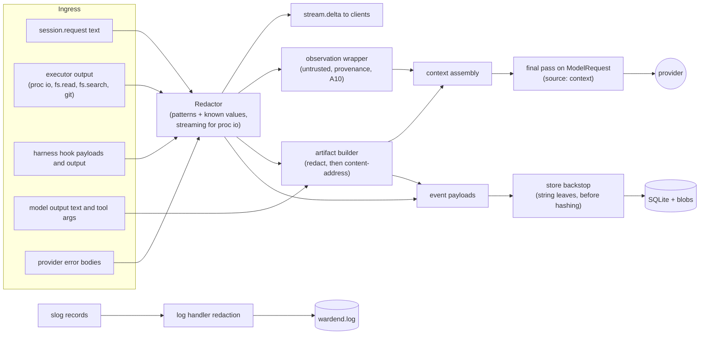

# A15 Secrets broker and redaction pipeline

`internal/secrets` keeps credentials in the OS keychain, resolves `secret://` references for host-side consumers only, records every access, owns the platform deny-list (enforced at three layers), and redacts secret-shaped content before anything is persisted, streamed to a client or sent to a model. It implements BI-3 and N-4 ("no secret value ever appears in events, artifacts, logs or model context") and is the data source for INV-1 and INV-6 checks.

Pattern data and the deny-list matcher live in `internal/execproto` (leaf package) so the executor, the policy engine and the redactor use one implementation (A06 §6, §5.1); `internal/secrets` owns their content and the redaction engine.

## 1. Where secrets may exist

| Location | Holds secret values? | Notes |
|---|---|---|
| OS keychain, service `warden` | yes | Only store at rest |
| `wardend` process memory | yes, transiently | Resolution cache (§3.4), known-value redaction set (§6.1), HTTP client TLS state |
| HTTP requests from `wardend` to providers | yes | Injected at the transport (§4) |
| `models.yaml`, `config.yaml`, policy files | no | `secret://` references only |
| SQLite, blobs, logs, exports | no | Redaction before persistence; canary test (§8) |
| Sandbox (files, env, argv, proxy traffic) | no | Nothing mounted, env allowlist, INV-6 check, no injection in the PoC |
| Model context | no | Redaction pass on every request |
| Harness login (HX-1, CF-22, A12 §4.2) | vendor's own credential | HX-1a: the vendor login file mounted read-only into harness sandboxes only. HX-1b: a vendor token stored in the Warden keychain (`harnesses/<id>/token`) and set as one environment variable of the harness engine process only. Outputs redacted (harness token shapes in §6.1; HX-1b values also through the known-value set) |
| User's git credential helper | user's credential, not a Warden secret | Used only by the host `push` process (A14 §8.3) |

## 2. Keychain integration

### 2.1 Library and entries

`github.com/zalando/go-keyring` (`Set`, `Get`, `Delete`, `ErrNotFound`); macOS Keychain and the freedesktop Secret Service on Linux. Service name `warden`; account = the path of the reference (core §10).

| Account | Reference | Consumer | Value format | Written by |
|---|---|---|---|---|
| `providers/<id>/api_key` | `secret://providers/<id>/api_key` | `adapter:<id>` | opaque string | `provider.add` (`warden provider add <id> --api-key`, prompt without echo) |
| `providers/<id>/token` | `secret://providers/<id>/token` | `adapter:<id>` | opaque string | `provider.add` (gateway bearer) |
| `providers/<id>/client_key` | `secret://providers/<id>/client_key` | `adapter:<id>` | unencrypted PEM private key (PKCS#8, PKCS#1 or SEC1) | `provider.add` with `secret_files.key` |
| `providers/<id>/client_cert` (NEW) | `secret://providers/<id>/client_cert` | `adapter:<id>` | PEM certificate chain (leaf first) | `provider.add` with `secret_files.cert` |
| `harnesses/<id>/token` (NEW, A12 HX-1b) | `secret://harnesses/<id>/token` | `harness:<id>` | opaque vendor token (for example the output of `claude setup-token`, or a fine-grained GitHub token with Copilot access) | `warden harness enable <id> --token` (prompt without echo) through `provider.enable` / `provider.add` (A05) |
| `keys/checkpoint/ed25519` | `secret://keys/checkpoint/ed25519` | `checkpoint` | base64 of the 32-byte Ed25519 seed | first `wardend` start |

**mTLS certificate location rule.** The keychain account `providers/<id>/client_cert` is the preferred and default location: `provider.add` with `secret_files{cert, key}` stores both in the keychain, and `models.yaml` needs only `auth.secret: secret://providers/<id>/client_key`. A11's `auth.cert_file` (a PEM file, for example `~/.warden/certs/<id>/client.crt`) is also accepted, **for the certificate only**: a file path is never accepted for the private key, which exists only in the keychain. Resolution: if `auth.cert_file` is set, the certificate comes from that file (owner-only, parsed as PEM); otherwise from `providers/<id>/client_cert`. A chain larger than the keychain value limit (size assumption in Deviations) is the reason to use `cert_file`. Certificates are public; reading `client_cert` still emits `secret.access` because it goes through the keychain.

The checkpoint public key is written to `~/.warden/keys/checkpoint.pub` as `ed25519:<base64>`; `key_id` = first 16 hex characters of `sha256(public key)`.

`provider.add` never echoes the value, validates it before storing (non-empty, no NUL or newline for tokens; parseable PEM key without encryption for `client_key`), stores it, immediately reads it back to confirm, adds it to the known-value set (§6.1), and records `provider.configured{secret_ref}` with the reference only. `provider.remove` deletes the keychain item and drops it from the cache (the known-value set keeps it until restart, so late log lines stay redacted).

### 2.2 Platform behavior

| Topic | macOS | Linux |
|---|---|---|
| Backend | go-keyring drives `/usr/bin/security` (login keychain) | go-keyring talks D-Bus to `org.freedesktop.secrets` (gnome-keyring, KeePassXC, KWallet's Secret Service), default collection |
| Item access control | Items created through `security` trust `/usr/bin/security`, so any process of the user that can run `security` can read them without a prompt. On the host this is the "local attacker" case (WRD-10 §3, T-23, out of scope). In the sandbox it is blocked: `exec` of `/usr/bin/security` and the `com.apple.SecurityServer` / `securityd` Mach services are denied (A06 §10.1 section 8) | Any process on the user's session bus can query the Secret Service; the sandbox has no session bus (no `DBUS_SESSION_BUS_ADDRESS`, `/run/user` not mounted, abstract sockets isolated by the network namespace, A06 §11.1) |
| Locked keychain | `security` fails with "User interaction is not allowed" (or shows the unlock dialog when the daemon runs in the GUI session) | The collection is locked; go-keyring asks the service to unlock, which shows a prompt, or fails without a GUI |
| No keychain at all | n/a | Headless host without a Secret Service provider: every call fails |

### 2.3 Calls, timeouts and error mapping

All keychain calls go through one serialized worker (one call at a time, so the user never sees two unlock prompts) with a 30 s timeout (go-keyring calls are not cancellable; on timeout the worker returns an error and the stuck call is abandoned). Errors map as follows:

| Keychain result | Broker error | Where it surfaces |
|---|---|---|
| `keyring.ErrNotFound` | `credential_missing` | Router rejects candidates of that provider with reason code `credential_missing` (core §3); `provider.test` → `error: credential_missing` |
| Locked / interaction not allowed / prompt dismissed | `keychain_locked` | Model call fails with WRD-05 code `auth_failed` (`retryable: false`, detail `keychain_locked`), per WRD-02 §11; UI tells the user to unlock the keychain (B07); the router does not fall back to another tier because of it (it is not a provider outage) |
| Secret Service or `security` unavailable | `keychain_unavailable` | `auth_failed` (detail `keychain_unavailable`); doctor check `keychain` fails with fix hints |
| Timeout (30 s) | `keychain_timeout` | `auth_failed` (detail `keychain_timeout`) |

Doctor check `keychain` (blocking only when a configured provider needs a secret): writes, reads and deletes `warden` / `doctor/probe` with a random value. No plaintext or encrypted-file fallback exists in the PoC (Deviations).

## 3. `secret://` references

### 3.1 Grammar

```
secret-ref   = "secret://" provider-ref / "secret://" harness-ref / "secret://" key-ref
provider-ref = "providers/" provider-id "/" ( "api_key" / "token" / "client_key" / "client_cert" )
harness-ref  = "harnesses/" harness-id "/token"            ; harness-id ∈ copilot, codex, claude-code (catalog ids)
key-ref      = "keys/checkpoint/ed25519"
provider-id  = lower-alnum *62( lower-alnum / "-" )        ; ^[a-z0-9][a-z0-9-]{0,62}$, the models.yaml provider id
lower-alnum  = %x61-7A / DIGIT
```

No query, fragment, percent-encoding, `.` or `..` segments, or trailing slash. Parsing is strict; anything else is a configuration error at `models.yaml` load.

### 3.2 Authorization of a resolution

A reference resolves only when all hold:

1. The consumer is bound to it: `adapter:<id>` may resolve only `secret://providers/<id>/*` (a catalog entry for `ollama` cannot borrow the `anthropic` key and send it to an arbitrary `base_url`); `harness:<id>` may resolve only `secret://harnesses/<id>/token`, and only when the harness is enabled and its launch uses HX-1b (A12 §4.2); `checkpoint` may resolve only `secret://keys/checkpoint/ed25519`; `proxy` and `delivery` may resolve nothing in the PoC.
2. The reference matches the policy's `secrets.allow_refs` (WRD-08 §6); platform default `["secret://providers/*", "secret://harnesses/*", "secret://keys/checkpoint/*"]`.
3. The caller runs in the daemon. There is no API method that returns a secret value and no executor method that accepts one (BI-6: clients can store secrets through `provider.add` but never read them).

### 3.3 Resolution algorithm

```
Resolve(ctx, ref, consumer, purpose, chain):
  r   := Parse(ref)                                   # §3.1
  Authorize(r, consumer)                              # §3.2, else error not_permitted
  s, hit := cache.Get(r)                              # §3.4
  if !hit: s = keychainWorker.Get("warden", r.Account)   # §2.3 errors
           cache.Put(r, s)
  redactor.AddKnown(s)                                # before the value can reach any caller
  maybeEmitAccess(chain, r, consumer, purpose, hit)   # §3.5
  return s
```

### 3.4 In-memory handling

- Cache: per reference, idle TTL 10 minutes; flushed on `provider.add`, `provider.remove`, `policy.reload` and `system.shutdown`.
- Type `Secret` wraps a `[]byte`; its `String`, `GoString`, `Format`, `LogValue` return `[secret]`, `MarshalJSON` and `MarshalText` return an error, and `Wipe` zeroes the buffer on cache eviction. Values handed to `net/http` become Go strings that cannot be wiped; the design accepts this (the daemon is in the TCB, WRD-10 §4).
- At startup `wardend` removes from its own environment every variable that SDKs read implicitly (`ANTHROPIC_API_KEY`, `ANTHROPIC_AUTH_TOKEN`, `ANTHROPIC_BASE_URL`, `OPENAI_API_KEY`, `OPENAI_BASE_URL`, `OPENAI_ORG_ID`, `AZURE_OPENAI_API_KEY`, `AZURE_OPENAI_ENDPOINT`), so an adapter can only use the keychain value it was given, and a key present in the user's shell is never picked up by accident.

### 3.5 `secret.access` events

Payload (core §5): `ref`, `consumer` (`adapter:<provider>`, `harness:<id>` (NEW, A12), `checkpoint`; `proxy` and `delivery` are reserved and never emitted in the PoC), `purpose` (`model_call`, `provider_test`, `checkpoint_sign`, `provider_add_verify`, `harness_login` (NEW)), plus NEW `cache` (`hit`/`miss`) and `result` (`ok`, `not_found`, `locked`, `unavailable`, `timeout`).

- Chain: the session chain when the resolution serves a session (model calls of a task, the session's checkpoint signature); the system chain otherwise (`provider.test`, `provider.add` read-back, the system chain's own checkpoints).
- Frequency: one event per keychain read (cache miss or failure), and one event the first time a reference is used on a given chain even when served from the cache. A session's chain therefore always lists every secret it used, without one event per model call.
- Never contains the value, its length, a hash or a prefix.

## 4. Deny-list

### 4.1 Patterns (WRD-16 §10.5, the PoC subset of WRD-10 §6)

```
**/.env
**/.env.*
**/*.pem
**/*.key
**/id_rsa*
**/id_ed25519*
**/.netrc
**/.npmrc
**/.git-credentials
**/credentials.json
**/.aws/**
**/.ssh/**
**/.config/gcloud/**
**/.warden/**
```

Compiled into the binary (`execproto.DenyList`, version `denylist/v1`), not configurable, not shortenable (WRD-10 §6). The version string appears in `sandbox.create.limits` and in `policy.reload`.

### 4.2 Glob semantics

- Paths are slash-separated. `**/` at the start matches zero or more leading segments; `/**` at the end matches the named directory itself and everything below it; `*` matches any run of characters except `/`; `?` matches one character except `/`. No character classes, braces or escapes.
- Matching is ASCII case-insensitive (APFS and NTFS-style case-insensitive volumes make `.ENV` and `.env` the same file).
- **Match target (CF-17):** for a path inside a mounted root (worktree, scratch, cache), the glob is matched against the path relative to that root; for any other path, against the canonical absolute host path. So `**/.warden/**` denies a repository's own `.warden/` directory without denying the worktree, which itself lives under `~/.warden`, while an absolute `~/.warden/run/token` is denied.
- Both the requested (lexically cleaned) path and the canonical (symlink-resolved) path are checked; a match on either denies (A06 §5.1 step 6).

| Path | Target | Result |
|---|---|---|
| worktree `.env` | `.env` | denied (`**/.env`) |
| worktree `config/.env.production` | `config/.env.production` | denied (`**/.env.*`) |
| worktree `.env.example` | `.env.example` | denied (`**/.env.*`; accepted false positive) |
| worktree `test/fixtures/server.key` | `test/fixtures/server.key` | denied |
| worktree `docs/keys.md` | `docs/keys.md` | allowed |
| worktree `.warden/policy.yaml` | `.warden/policy.yaml` | denied (`**/.warden/**`) |
| worktree `src/app.ts` (host path under `~/.warden/sessions/…`) | `src/app.ts` | allowed (CF-17) |
| `/Users/ana/.ssh/id_ed25519` | absolute path | denied (`**/.ssh/**`, `**/id_ed25519*`) |
| worktree symlink `notes.txt -> .env` | requested `notes.txt`, canonical `.env` | denied (canonical) |

The same list is rendered as git pathspecs `:(exclude,glob,icase)<glob>` for every git status, diff, commit and patch export (A14 §6), and as Seatbelt regexes (A06 §10.3).

### 4.3 Three layers (S-4, INV-1)

| Layer | Component | Mechanism | Scope | Evidence |
|---|---|---|---|---|
| 1. Policy | PDP L0 (`internal/policy`, calls `execproto.DenyListMatch`) | `deny`, risk R6, rule `invariant.INV-1`, not overridable by any layer or grant | `fs.*` targets (read, list, search, write, patch, stat); `proc.exec` cwd; `proc.exec` argv path heuristic (below); `git.diff`/`git.commit` paths | `policy.decision{effect: deny, matched_rules: [invariant.INV-1]}` |
| 2. Executor | `warden-exec` (`Resolve`, A06 §5.1) | `deny_list` error on requested or canonical path; `fs.list` marks entries `denied: true` without size or time; `fs.search` skips denied files; `fs.patch` checks every target | Every executor file operation, independent of the daemon | `sandbox.violation{kind: deny_list}` |
| 3. Mount / profile | Sandbox backend | Linux/L2: `$HOME` and other host secret locations are never mounted; existing matches in the worktree are masked (`--ro-bind /dev/null` for files, read-only tmpfs for directories); credential-like files inside toolchain directories masked. macOS: `$HOME` denied, regex deny on `file-read-data` and `file-write*` for the patterns inside every rw root, toolchain masks (A06 §10.3, §11.3) | Every process in the sandbox, including package scripts and test code | Linux: none (file reads as empty or ENOENT); macOS: best-effort `sandbox.violation{kind: seatbelt_deny}` |

Argv path heuristic (layer 1, `secrets.DenyListArgv(argv, cwd)`): each argv element after `argv[0]` (and the value part of `--flag=value`) that has no whitespace, is at most 4096 bytes and, taken as a path relative to `cwd` or as an absolute path, matches the deny-list makes the call `deny` under INV-1. `["cat", ".env"]` is denied before approval is even asked. The heuristic cannot see paths a program computes; layer 3 is the boundary for processes.

Known consequences: committed `.env.*` files (for example `.env.test` used by a test suite) are masked in the sandbox and tests depending on them fail; a user's untracked `.env` never enters the worktree at all (A14 §3). Certificate-only PEM bundles outside the task roots are not masked at layer 3 (A06 Deviations), so TLS trust stores keep working.

## 5. Injection points

All injection happens host-side in `wardend`, at the last moment, inside an `http.RoundTripper` wrapper that clones the request (`req.Clone(ctx)`) and sets the header, so request objects visible to logging, retries and error paths never carry credentials.

| Consumer | Auth mode (`models.yaml`) | Injection | Notes |
|---|---|---|---|
| `anthropic-messages` adapter | `api_key` | `x-api-key: <key>` (with `anthropic-version`) via `option.WithAPIKey`, base URL set explicitly | SDK environment defaults neutralized (§3.4) |
| `openai-compatible` adapter | `api_key` | `Authorization: Bearer <key>` | vendor API (T3) |
| `openai-compatible` adapter | `api_key` with `header: api-key` | `api-key: <key>`, no `Authorization` | Azure OpenAI (T2) |
| `openai-compatible` adapter | `gateway`, `kind: bearer` | `Authorization: Bearer <token>` | company-hosted (T1) |
| `openai-compatible` adapter | `gateway`, `kind: mtls` | `tls.Config{Certificates: [tls.X509KeyPair(certPEM, keyPEM)], MinVersion: TLS 1.2}` built in memory at client creation; `keyPEM` from `providers/<id>/client_key`, `certPEM` from `providers/<id>/client_cert` or `auth.cert_file` (§2.1 rule); the key never touches disk; encrypted keys are refused at `provider.add` | company-hosted (T1) |
| `openai-compatible` adapter | `none` | nothing; any configured secret is ignored | local (T0) |
| Checkpoint signer (`internal/store`) | n/a | `ed25519.NewKeyFromSeed(seed)` per signing; seed copy wiped | `secret.access{consumer: checkpoint}` |
| Egress proxy | n/a | `CredentialInjector` hook with `noInjector` only (A07 §11) | never used in the PoC |
| Harness engine (Copilot, Codex, Claude Code) | n/a | HX-1a: none (vendor login file mounted read-only). HX-1b: the host resolves `secret://harnesses/<id>/token` (`secret.access{consumer: "harness:<id>", purpose: harness_login}`) and passes it in memory as `exec.proc.spawn.secret_env` (A06 §4.3), which sets one variable (for example `CLAUDE_CODE_OAUTH_TOKEN`) in the engine process only; `sandbox.create.env_keys` lists the name, never the value | Documented HX-1 exception (CF-22, A12 §4.2); never in tool sandboxes; the value is in the known-value set, so any echo in output is redacted |
| `git push` | n/a | none; the user's credential helper runs in the host `push` process | A14 §8.3 |

Transport rules for every authenticated client: redirects are not followed (`CheckRedirect` returns `http.ErrUseLastResponse`), because Go strips `Authorization` on cross-host redirects but not `x-api-key` or `api-key`; `base_url` must not contain userinfo; an authenticated mode requires `https` unless the host is a loopback address; debug request logging (off by default) logs method, host, path and status only.

Adapter error bodies can echo parts of a key; they pass the redactor (including the known-value set) before they are stored in `model.call.end.error` or logged.

## 6. Redaction

### 6.1 Pattern set

Applied in this order (earlier types win on overlapping text). Go RE2 syntax. "Group" means only capture group 1 is replaced, keeping the surrounding syntax readable; otherwise the whole match is replaced. Replacement: `[REDACTED:<type>]` (core §13.16).

| # | Type | Regular expression | Replace | Validator (all must pass) |
|---|---|---|---|---|
| 1 | `private_key` | `(?s)-----BEGIN [A-Z0-9 ]*PRIVATE KEY(?: BLOCK)?-----.*?-----END [A-Z0-9 ]*PRIVATE KEY(?: BLOCK)?-----` | whole | none (unterminated blocks: §6.2) |
| 2 | `known_secret` | exact byte match of every value resolved by the broker in this daemon's lifetime (≥ 8 bytes) and its standard base64 encoding | whole | none |
| 3 | `jwt` | `\beyJ[A-Za-z0-9_-]{10,}\.eyJ[A-Za-z0-9_-]{10,}\.[A-Za-z0-9_-]*` | whole | none |
| 4 | `anthropic_key` | `\bsk-ant-[a-z]{2,8}[0-9]{2}-[A-Za-z0-9_-]{32,}` | whole | none (covers `api03`, `admin01`, and the `oat01`/`ort01` OAuth tokens of Claude Code logins) |
| 5 | `openai_key` | `\bsk-(?:proj-\|svcacct-\|admin-)?[A-Za-z0-9_-]{32,}` | whole | body does not start with `ant-`; contains at least one digit, one uppercase and one lowercase letter |
| 6 | `github_token` | `\b(?:ghp\|gho\|ghu\|ghs\|ghr)_[A-Za-z0-9]{36,255}\b` and `\bgithub_pat_[A-Za-z0-9_]{22,255}\b` | whole | none |
| 7 | `gitlab_token` | `\bglpat-[A-Za-z0-9_-]{20,}` | whole | none |
| 8 | `aws_access_key_id` | `\b(?:AKIA\|ASIA\|ABIA\|ACCA)[A-Z0-9]{16}\b` | whole | none |
| 9 | `aws_secret_access_key` | `(?i)\baws_?secret_?access_?key\b["']?\s*[:=]\s*["']?([A-Za-z0-9/+=]{40})` | group | none |
| 10 | `google_api_key` | `\bAIza[0-9A-Za-z_-]{35}\b` | whole | none |
| 11 | `slack_token` | `\bxox[abprs]-[A-Za-z0-9-]{10,}` | whole | none |
| 12 | `stripe_key` | `\b(?:sk\|rk)_(?:live\|test)_[A-Za-z0-9]{16,}\b` | whole | none |
| 13 | `npm_token` | `\bnpm_[A-Za-z0-9]{36}\b` | whole | none |
| 14 | `auth_header` | `(?i)\b(?:proxy-)?authorization\s*:\s*(?:bearer\|basic\|token)\s+([A-Za-z0-9._~+/=-]{8,})` and `(?i)\b(?:x-api-key\|api-key)\s*:\s*([A-Za-z0-9._~+/=-]{8,})` | group | not a placeholder (below) |
| 15 | `conn_string_password` | `\b[a-zA-Z][a-zA-Z0-9+.-]{1,20}://[^\s:/@'"]{1,256}:([^\s@/'"]{1,256})@` and `(?i)(?:^\|;)\s*(?:password\|pwd)=([^;'"\s]{1,256})(?:;\|$)` | group | not a placeholder |
| 16 | `generic_assignment` | ``(?i)\b[A-Za-z0-9_.-]*(?:api[_-]?key\|apikey\|secret\|token\|passwd\|password\|access[_-]?key\|private[_-]?key\|client[_-]?secret\|auth[_-]?key)["']?\s*[:=]\s*["'`]?([^\s"'`,;)}\]]{16,})`` | group | see below |

(`\|` in the table stands for the regex alternation `|`.)

Validators:

- **Placeholder** (types 14 to 16): value is not `${…}`, `$(…)`, `{{…}}`, `<…>`, `%(…)s`, all `*` or all `x`, and does not match `(?i)^(changeme|your[_-].*|example.*|dummy.*|fake.*|placeholder.*|redacted.*|none|null|undefined)$`.
- **Generic assignment** (type 16), in addition: contains at least one digit and one letter; Shannon entropy ≥ 3.0 bits per character; is not an expression (`process.env.`, `os.environ`, `env.`, contains `(`); is not a dotted identifier chain (`^[A-Za-z_$][\w$]*(\.[A-Za-z_$][\w$]*)+$`); is not already a `[REDACTED:` marker. The keyword must end right before the optional quote and `:`/`=`, so `tokenizer = …` and `secretsManager.get(…)` do not match.

These cover the WRD-16 §10.5 list (AWS key ids, GitHub `ghp_`/`gho_`/`github_pat_` and the other GitHub prefixes, OpenAI and Anthropic keys, JWTs, private key blocks, connection strings with passwords, the generic assignment) and the WRD-10 §6 families (GCP key, GitLab, Slack, Stripe, npm, authorization headers).

### 6.2 Streaming redaction

Tool output arrives as `exec.proc.io` chunks (A06 §7.2). Per stream:

1. `buf = carry + chunk`.
2. If `buf` contains a `-----BEGIN … PRIVATE KEY` line without a matching `END`, hold everything from `BEGIN` onward (up to 64 KiB; beyond that, redact from `BEGIN` to the end of `buf` as `private_key` and suppress output until the `END` line is seen).
3. Run the pattern set over `buf`. Emit redacted text for positions before `cut = len(buf) − 4096`, moving `cut` back to the start of any match that crosses it; keep `buf[cut:]` (original bytes) as `carry`. Every single-line pattern above is shorter than 4096 bytes, so a match that starts before `cut` is always complete.
4. Boundaries (end of stream, the truncation marker between head and tail, and an idle flush after 500 ms without data so the UI is not delayed): run the pattern set over the whole `carry`, then the **prefix patterns** anchored at the end (`\z`): `(?:ghp|gho|ghu|ghs|ghr)_[A-Za-z0-9]{4,}`, `github_pat_[A-Za-z0-9_]{4,}`, `sk-ant-[A-Za-z0-9_-]{4,}`, `sk-[A-Za-z0-9_-]{16,}`, `(?:AKIA|ASIA|ABIA|ACCA)[A-Z0-9]{4,}`, `eyJ[A-Za-z0-9_-]{10,}(?:\.[A-Za-z0-9_-]*){0,2}`, `glpat-[A-Za-z0-9_-]{4,}`, `npm_[A-Za-z0-9]{4,}`, `xox[abprs]-[A-Za-z0-9-]{4,}`, `AIza[0-9A-Za-z_-]{4,}`, `(?s)-----BEGIN [A-Z0-9 ]*PRIVATE KEY.*`, and any suffix of at least 8 bytes that is a prefix of a known secret. A secret cut by truncation or by a flush is therefore replaced as a partial `[REDACTED:<type>]`.
5. Counts per type accumulate for the whole tool call.

Residual: the first bytes of the tail segment after a truncation marker may be the end of a token whose recognizable prefix was discarded; such a fragment carries no prefix and cannot be recognized. It is at most one partial token per truncated call.

Whole values (file reads, search results, git output, request text, artifacts, context) use the same engine in one pass (step 3 with `cut = len`, then step 4).

### 6.3 Pipeline order



Everything that enters Warden from outside the TCB passes the redactor once at ingress (tool output is redacted chunk by chunk before it is streamed or persisted), so clients, artifacts and events only ever see redacted text. Artifacts are redacted before hashing, so the content address is of the redacted content. Two more passes are defense in depth: every `ModelRequest` gets a final pass immediately before the adapter serializes it (BI-3 for model context), and the store scans the string leaves of every event payload before computing the hash (a hit there means an upstream path missed redaction; it is fixed in place, counted in the envelope `redactions`, and logged as `redaction_backstop_hit`). Log records are redacted by the `slog` handler. Sandbox-bound data is not redacted but checked: argv and environment values that contain a known secret or match patterns 1 to 13 make the call `deny` under INV-6 (policy layer) and fail `invalid_argument` in the executor (A06 §6 step 7).

Relative order for one tool call: executor truncation (head/tail, A06 §7.5) → daemon streaming redaction → `stream.delta` → accumulate → `redaction` event (if count > 0) → `tool.exec.end` with `output_ref` to the redacted blob → untrusted observation into context.

### 6.4 False positives

- Validators (§6.1) keep identifiers, expressions, placeholders and low-entropy values out of `generic_assignment`, `auth_header` and `conn_string_password`.
- A redaction marker is never re-redacted.
- The model is told (A10 system prompt) that `[REDACTED:<type>]` is a placeholder for a value it cannot see and must not be written back. The executor enforces it: `exec.fs.write` and `exec.fs.patch` refuse content that contains `[REDACTED:` (A06 error `redaction_marker`), and the tool error tells the model to edit around that line with a patch instead of rewriting the file.
- The UI shows a per-call chip ("2 values redacted", from the `redaction` event), so a user can see when redaction affected what the model saw.
- CI false-positive corpus: reading every file of the fixtures `ts-express-api`, `go-cli-tool`, `py-fastapi-service` (including `package-lock.json`, `go.sum`, lockfile integrity hashes) must produce zero redactions; `injection-lab` produces exactly its planted canaries.

### 6.5 Performance

- Each pattern has a literal prefilter (`-----BEGIN`, `eyJ`, `sk-`, `gh`, `github_pat_`, `glpat-`, `AKIA`/`ASIA`/`ABIA`/`ACCA`, `AIza`, `xox`, `_live_`/`_test_`, `npm_`, `uthorization`/`api-key`, `://`, `pwd=`/`password=`, and for type 16 the keyword list, case-insensitive); the regex runs only on buffers where its prefilter hits. Known values use `bytes.Index` per value (a few dozen values at most).
- Budgets (benchmarks in CI, A17): ≥ 100 MB/s on text without hits, ≥ 20 MB/s on adversarial text; a 256 KiB tool output under 10 ms and a 2 MiB file read under 50 ms on the CI runners. RE2 guarantees linear time, so hostile output cannot cause catastrophic backtracking.

### 6.6 Redaction events

`redaction{source, count, types[]}` (core §5), only when `count > 0`, never with values, hashes, lengths or positions:

| Source | Emitted | Chain and ids |
|---|---|---|
| `tool_output` | once per tool call, after the last chunk and before `tool.exec.end` | session, with task and execution ids |
| `artifact` | before `artifact.created` / `artifact.edited` | session |
| `request_text` | before `session.request` | session |
| `context` | with `context.assembled` for the step, when the final pass changed anything | session |
| `log` | aggregated, at most once per minute | system |

The event whose payload contains redacted text also carries `redactions{count, types}` in its envelope. S2 expectation: `fs.read .env` is denied before anything is read, so the redaction count for that call stays 0 (WRD-16 §4.3).

## 7. Go sketches

```go
package secrets

type Ref struct {
    Scheme  string // "secret"
    Account string // "providers/anthropic/api_key"
    Kind    string // "provider" | "harness" | "checkpoint_key"
    Provider, Name string
}

func Parse(s string) (Ref, error)

type Secret struct{ b []byte }

func (s *Secret) Use(fn func(v []byte) error) error
func (s *Secret) Wipe()
func (Secret) String() string                    { return "[secret]" }
func (Secret) LogValue() slog.Value              { return slog.StringValue("[secret]") }
func (Secret) MarshalJSON() ([]byte, error)      { return nil, errors.New("secret: not serializable") }

type Consumer string // "adapter:<id>" | "harness:<id>" | "checkpoint" | "proxy" | "delivery"

type Broker interface {
    Store(ctx context.Context, ref Ref, value []byte) error // provider.add only
    Delete(ctx context.Context, ref Ref) error
    Resolve(ctx context.Context, ref Ref, c Consumer, purpose string, chain string) (*Secret, error)
    Check(ctx context.Context) DoctorResult // keychain probe
}

type Keychain interface { // go-keyring behind a serialized worker with a 30 s timeout
    Get(service, account string) (string, error)
    Set(service, account, value string) error
    Delete(service, account string) error
}

type Match struct{ Start, End int; Type string }

type Redactor interface {
    AddKnown(v []byte)
    Redact(src Source, in []byte) (out []byte, counts map[string]int)
    NewStream(src Source) Stream // §6.2
}

type Stream interface {
    Write(chunk []byte) (redacted []byte) // may return less than written (carry)
    Boundary() (redacted []byte)          // truncation marker or idle flush
    Close() (redacted []byte, counts map[string]int)
}

type Source string // tool_output | artifact | context | request_text | log

// DenyListArgv implements the layer-1 argv heuristic (§4.3).
func DenyListArgv(argv []string, cwdRel string) (pattern string, denied bool)
```

## 8. Tests that prove N-4 and BI-3

### 8.1 Unit tests

- Pattern table: positive and negative samples per type, including every GitHub prefix, `sk-ant-oat01-…`, JWT without signature, PGP and OpenSSH private keys, URL passwords, `.NET` connection strings.
- Streaming: each canary split across two chunks at every byte offset; truncation boundary with the prefix patterns; unterminated private key block; idle flush.
- Validators: identifiers, expressions, placeholders and lockfile hashes produce no redaction.
- `Secret` formatting: `fmt` verbs, `slog`, `encoding/json` never reveal the value.
- Deny-list: the §4.2 table, case variants, symlink cases, CF-17 cases; the same inputs give identical results in the PDP, the executor, the mask generator and the pathspec renderer.
- Transport: no redirect is followed; `x-api-key` and `api-key` never sent to a second host; `base_url` with userinfo refused.

### 8.2 Canary end-to-end test (CI job `secrets-canary`, macOS and Linux)

Setup, with a per-run random nonce `N` (16 hex characters) embedded in every canary:

| Canary | Planted in | Expected path through the system |
|---|---|---|
| `sk-ant-api03-…N…` | keychain `providers/anthropic/api_key` (provider pointed at a loopback mock Messages server) | Only in the mock server's `x-api-key` header |
| `WRDN-CANARY-N-bearer` (shapeless) | keychain `providers/company-vllm/token` (mock OpenAI-compatible server) | Only in the mock server's `Authorization` header; caught by `known_secret` anywhere else |
| `ANTHROPIC_API_KEY`, `OPENAI_API_KEY`, `GITHUB_TOKEN` with `N` | environment of the process that starts `wardend` | Removed at daemon start; never in the sandbox `env` output |
| `WRDN-HARNESS-N` (HX-1b) | keychain `harnesses/claude-code/token` (mock engine in a co-located harness sandbox that prints its environment) | Present only in the engine process environment; its printed `env` output shows `[REDACTED:known_secret]`; absent from every searched location |
| OpenSSH private key block with `N` | test `$HOME/.ssh/id_ed25519` | Unreadable (not mounted or denied) |
| `npm_…N…` | test `$HOME/.npmrc` | Unreadable |
| `AKIA…N…` | committed `injection-lab/.env` and non-deny-listed `config/settings.yaml` | `.env` denied at three layers; `settings.yaml` read by the agent appears as `[REDACTED:aws_access_key_id]` |
| JWT with `N` in the payload | printed by a fixture test script to stdout | `[REDACTED:jwt]` in the tool output |
| `postgres://app:N@db/x` | fixture file read by the agent and printed by a failing test | `[REDACTED:conn_string_password]` |

Run: a scripted demo session against the mock models: task T1 with scripted tool calls (`fs.read .env`, `fs.read config/settings.yaml`, approved `proc.exec` of `env`, `cat ~/.ssh/id_ed25519`, the JWT script, `npm test` with the failing connection-string test), scenarios S1 to S3, G2 with `commit` and `export_patch`, `audit export`, `session.close` (checkpoint signing), `wardend` stop.

Search (raw bytes; each of `N`, its hex, its URL-encoded form and its base64 encoding at all three alignments; also the complete canary values):

- `~/.warden/db/warden.sqlite`, `-wal`, `-shm`, and a `sqlite3 .dump` of the database;
- `~/.warden/blobs/**`, decompressed if A04 stores compressed blobs;
- `~/.warden/logs/**`, `~/.warden/exports/**`, `~/.warden/sessions/*/scratch/**`, `~/.warden/sessions/*/sandbox/**`;
- `wardend` stdout and stderr;
- every request body received by the mock model servers (this is the model context);
- the stream of `event` and `stream.delta` notifications captured by the test client.

Assertions: zero hits everywhere (the only allowed occurrence is the auth header received by each mock server, which the test checks positively); `secret.access` events exist for both provider references with `result: ok`; `redaction` events include `aws_access_key_id`, `jwt` and `conn_string_password`; the `env` tool output contains exactly the A06 §8 keys; `policy.decision(deny, invariant.INV-1)` and `sandbox.violation(deny_list)` exist for `.env`. The same job runs once with the keychain locked (Linux: locked collection; macOS: a separate locked test keychain) and asserts `model.call.end.error.code = auth_failed` with no secret-related output.

## Traceability

| Design element | WRD source (doc §) | Requirement / invariant satisfied |
|---|---|---|
| Keychain via go-keyring, service `warden`, accounts (§2) | WRD-16 §5.1, §10.5; WRD-05 §8; WRD-02 §2.3 | BI-3, S-3 |
| Locked or missing keychain → `auth_failed` / `credential_missing` (§2.3) | WRD-02 §11; WRD-05 §4 | BI-3, WRD-02 failure domain |
| `secret://` grammar, consumer binding, no API returns values (§3) | WRD-16 §6.1, §10.5; WRD-08 §6 `secrets.allow_refs`; WRD-02 §5 (runtime ↔ secrets) | BI-3, BI-6 |
| `client_cert` account and certificate-only file rule (§2.1) | WRD-16 §6.1 (`kind: mtls`); A11 §5 auth matrix; A04, A05 `provider.add` | BI-3 (the key only in the keychain) |
| `harnesses/<id>/token` and HX-1b injection (§2.1, §5) | WRD-16 §6.2; WRD-05 §9 item 4; CF-22; A12 §4.2 | BI-3 with the documented HX-1 exception, T-14 |
| `secret.access` events with references only (§3.5) | WRD-09 §3; WRD-16 §11; WRD-02 §5 | H5, BI-3 |
| Deny-list patterns and CF-17 matching (§4.1, §4.2) | WRD-16 §10.5; WRD-10 §6; CF-17 | INV-1, F-TL-5 |
| Three-layer enforcement (§4.3) | WRD-16 §4.3 S2, §10.1; WRD-10 §10 S-4 | INV-1, S-4, T-06 |
| Host-side injection, no redirects, SDK env neutralized (§5) | WRD-05 §8; WRD-16 §6.2; WRD-10 §7 | BI-3, INV-6, S-3 |
| Proxy injection hook unused (§5) | WRD-16 §10.4; WRD-10 §7 | BI-3 |
| Redaction pattern set (§6.1) | WRD-16 §10.5; WRD-10 §6 | N-4, BI-3, T-18 |
| Pipeline order, final model-context pass, store backstop (§6.3) | WRD-10 §10 S-9; WRD-02 §10; WRD-04 §7 item 2; WRD-09 §10 | N-4, BI-3, BI-4 (redaction before observation wrapping) |
| INV-6 argv/env check at spawn (§6.3) | WRD-08 §5 INV-6; WRD-10 §10 S-3 | INV-6 |
| Redaction events and envelope counts (§6.6) | WRD-09 §2, §3; WRD-16 §10.5 | H5 |
| Canary test (§8.2) | WRD-01 N-4 (verified by tests); WRD-10 §8 T-18, §11 (environment dump) | N-4, BI-3, H3 |

## Deviations and assumptions

- DEV: no encrypted-file fallback when no keychain exists (WRD-02 §2.3 lists one). Linux hosts without a Secret Service provider can use only providers with `auth: none` in the PoC; doctor explains how to install one.
- DEV: `generic_assignment` is stricter than WRD-16 §10.5's `(api[_-]?key|secret|token)\s*[:=]\s*\S{16,}` (more keywords, value validators) to keep false positives from corrupting code the model reads and writes.
- DEV: the redaction set adds GCP, GitLab, Slack, Stripe, npm and authorization-header patterns from the WRD-10 §6 families, and a known-value matcher for secrets without a recognizable shape (the company-hosted bearer token).
- DEV (HX-1b, A12 §4.2, CF-22): a harness token from `harnesses/<id>/token` may be set as one environment variable of a harness engine process. This is the only secret value that ever enters a sandbox; it never enters tool sandboxes or model context, and co-located harnesses are never admissible for `confidential` data.
- Alignment with A11: A11 §5 copies the mTLS certificate to `~/.warden/certs/<id>/client.crt` and references it with `auth.cert_file`. This design prefers the keychain account `providers/<id>/client_cert` (as A04 and A05 assume) and accepts `cert_file` for the certificate only; if A11 keeps the file copy, it is valid under the §2.1 rule, and the private key is never accepted as a file.
- NEW: keychain accounts `providers/<id>/client_cert` and `harnesses/<id>/token`, references `secret://providers/<id>/client_cert` and `secret://harnesses/<id>/token`, consumer `harness:<id>`, purpose `harness_login`; `secret.access` fields `cache` and `result`; `purpose` values; consumer binding rule; `execproto.DenyList` version `denylist/v1`; `wardend` environment scrub list; executor error `redaction_marker` (A06); redaction types beyond the brief's list (`known_secret`, `aws_secret_access_key`, `gitlab_token`, `google_api_key`, `slack_token`, `stripe_key`, `npm_token`, `auth_header`).
- ASM: zalando/go-keyring on macOS drives `/usr/bin/security` and passes the value on stdin, not as an argument; verify in week 2. If it passes argv, the value is briefly visible to same-user `ps` on the host (T-23, out of scope) but not to sandboxes (macOS `process-info` limited to the sandbox; Linux PID namespace).
- ASM: go-keyring stores values up to at least 4 KiB on both platforms (RSA-2048 and EC private keys fit); larger keys are refused at `provider.add` with a clear message; a certificate chain that does not fit is stored as `auth.cert_file` instead (§2.1).
- ASM: A08 implements layer 1 of the deny-list as an L0 check calling `execproto.DenyListMatch` and `secrets.DenyListArgv`, and the INV-6 check with the redactor's known-value set and patterns 1 to 13.
- ASM: A04 signs `chain.checkpoint` with the key from §2.1; if the keychain is locked at signing time, A04 decides whether the checkpoint is written unsigned (flagged by `audit verify`) or retried.
- ASM: A10's system prompt explains `[REDACTED:<type>]` placeholders, and A10 applies the final context pass through `Redactor.Redact(context)`.
- OQ candidate: committed `.env.*` files needed by test suites are masked (non-overridable deny-list). Recommended: keep for the PoC and show the masked paths in the session header's sandbox details; revisit with an explicit, audited per-workspace exception in the MVP only if organizations ask for it.
- OQ candidate: native Keychain access (Security.framework via cgo) would bind item access to the signed `wardend` binary instead of `/usr/bin/security`. Recommended: MVP, together with code signing.
