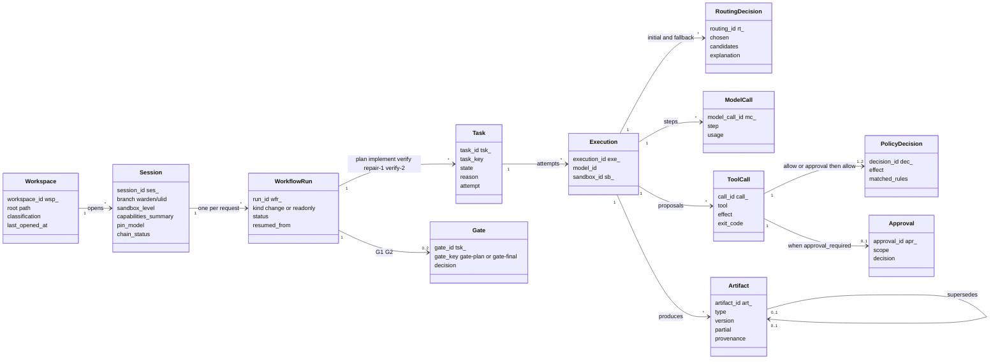
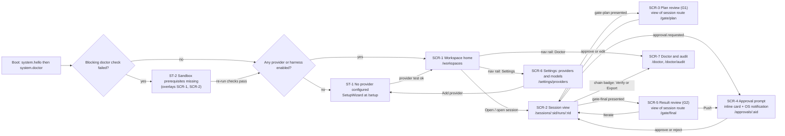

# B01 Information architecture

This deliverable defines what the Warden PoC desktop app contains and how it is organized: the object model the UI exposes, the seven screens (SCR-1 to SCR-7) and six states (ST-1 to ST-6) of WRD-16 §13, the app shell and its routes, which states overlay which screens, deep links from OS notifications, and the rule that decides what lives in the timeline and what lives in the context panel. Names of screens, states, components, keyboard keys, tokens, API methods and events are those of `00-DESIGN-CORE.md` (§5, §6, §11). Flows are in B02, layouts and sizes in B03, component internals in B04, interaction timing in B05, token values in B06 and final wording in B07 (keys referenced here are listed in the B03 §15 registry).

## 1. Principles applied to the structure

| WRD-11 §1 principle | Structural consequence in this IA |
|---|---|
| Show the decision before the effect | Every effect-bearing object (tool call, approval, gate, delivery) has a timeline entry that appears when its `policy.decision` or `workflow.gate.presented` arrives, before any `tool.exec.start` or delivery result. The context panel always shows the decision (effect, rule ids, reason) above the effect (exit code, output, commit). |
| One request, one timeline | A request creates exactly one workflow run; a run is one contiguous group in the session timeline. Gates G1 and G2 are views of the session route, never separate windows (§5). |
| Explain the machine | Every routing, policy and cost element has a one-line explanation in the timeline and a details disclosure in the context panel or `ExplainDrawer`, each with a named data source (§8). |
| Never trap the user | `Mod+.` and the Cancel control are present on every session route while a run is active; the nav rail is always reachable, including in ST-2; history and audit stay readable in every state. |
| Same power in the CLI | Every context panel view shows its CLI equivalent (§10); the UI calls only the JSON-RPC methods of core §6 (BI-6). |

The app is a job console, not a chat client: there are no message bubbles, avatars or "assistant says" constructs. Model text appears only as structured artifacts (plan, test-report analysis, final summary) or as the live activity line of a task.

## 2. Object model shown by the UI



The diagram shows the hierarchy the UI renders, from the workspace list down to individual tool calls. A workspace owns sessions; a session owns runs (one per request, one more per resume); a run owns tasks and at most two gates; a task has one or more executions (retry attempts); an execution is where routing, model calls, tool calls and artifacts attach. A tool call carries one policy decision, or two when an approval sits between them (core §13.1, CF-40). Artifacts form version chains through `supersedes` (CF-26), which is how the G2 diff shows the repair version.

| Object | Where the UI shows it | Primary data source | Identity in routes |
|---|---|---|---|
| Workspace | SCR-1 `WorkspaceRow`; session header name and `StatusBadge classification` | `workspace.list`; `workspace.classification` event (`to`) | `wsp_` (SCR-1 query `?ws=`) |
| Session | SCR-1 expanded row; SCR-2 whole screen | `session.list`, `session.open` result, `session.open` / `session.resume` events | `:sessionId` |
| Workflow run | Run group in the timeline (`RunHeader`, NEW sub-component of `Timeline`) | `session.request` result `run_id`; `workflow.start` / `workflow.end` events; `workflow.get` (polling fallback) | `:runId` |
| Task | `TaskCard` in the timeline | `task.state` events (`task_key`, `from`, `to`, `reason`, `attempt`) | `?sel=tsk_…` |
| Gate | `PlanCard` (G1) or result entry (G2) in the timeline; `GateBar` | `workflow.gate.presented` / `workflow.gate.resolved` | `/gate/plan`, `/gate/final` |
| Execution | Context panel of a task (attempt switcher when `attempt > 1`) | envelope `execution_id` of `model.call.*`, `tool.exec.*` | not routable |
| Routing decision | `RoutingLine` inside the `TaskCard` | `routing.decision` (`chosen`, `candidates[]`, `explanation`, `strategy`, `pin`), `routing.fallback` | `?sel=rt_…` |
| Model call | Task counters (step, tokens, cost); Model calls tab of the context panel | `model.call.start` (`step`, `model_id`, `tier`), `model.call.end` (`usage`, `latency_ms`, `error`) | not routable |
| Tool call | `ToolCallRow` inside a task | `policy.decision` (`call_id`, `effect`, `matched_rules`, `reason`), `tool.exec.start` / `tool.exec.end` joined on `call_id` | `?sel=call_…` |
| Approval | `ApprovalCard` inline in its task; `PendingApprovalBadge` | `approval.requested`, `approval.resolved`, `approval.revoked`; `approval.list` on load | `/approvals/:approvalId` |
| Artifact | Chips on task cards; `PlanCard`, `DiffViewer`, `TestReport`, final result | `artifact.created` / `artifact.edited`; `artifact.get`, `artifact.read` | `?sel=art_…` |

## 3. Screen map



The screen map shows the seven screens and the two boot-time states as destinations. Boot always performs `system.hello` and `system.doctor` first; a blocking doctor failure leads to ST-2 before anything else, and an empty provider list leads to ST-1 (the setup wizard) before the workspace home. SCR-3, SCR-4 and SCR-5 are not separate windows: they are views of the session route (G1 and G2 as panel modes, the approval prompt as an inline card plus an OS notification), so every arrow from SCR-2 into them and back keeps the same timeline on screen. SCR-6 and SCR-7 are reachable from the nav rail at any time, including while ST-2 blocks work, so the user is never trapped.

## 4. Navigation model

### 4.1 App shell regions

```
+--------------------------------------------------------------------------------------------+
| TopBar (48 px): wordmark | breadcrumb | connection indicator | shared-mode chip | menu      |
+------+-------------------------------------------------------------------------------------+
| Nav  | Banner stack (0..n, 40 px each): ST-2, ST-6, connection lost, ST-1 reminder          |
| Rail +-------------------------------------------------------------------------------------+
| 56px | Route outlet                                                                        |
|      |   SCR-1 / SCR-6 / SCR-7: single column page, max content width 1200 px              |
| Home |   SCR-2..SCR-5: SessionHeader (56 px) + Timeline column + ContextPanel               |
| Sett.|                                                                                     |
| Doct.|                                                                                     |
+------+-------------------------------------------------------------------------------------+
```

| Region | Component | Content | Data source | Present on |
|---|---|---|---|---|
| TopBar | `AppShell` (first header row) | Wordmark "Warden" (text only, no logo animation); breadcrumb `Workspaces › ts-express-api › Session 01JAXR8Q`; connection indicator with text label; "Shared mode" chip when `mode: shared`; overflow menu (theme: system, light, dark; About with `system.version`) | `system.hello` → `daemon_version`, `mode`; `system.version`; transport state | all routes |
| NavRail | `AppShell` | Three destinations with icon and tooltip label: Workspaces (SCR-1), Settings (SCR-6), Doctor and audit (SCR-7). A dot on Doctor when any `system.doctor` check is `fail`. | `system.doctor` | all routes |
| Banner stack | `Banner` | Global, non-dismissable while the condition holds: ST-2 (blocking), ST-6 (session scoped, shown on that session's routes and on SCR-7), connection lost. Order top to bottom: connection, ST-2, ST-6. At most three; each 40 px. | see §6 | all routes |
| SessionHeader | second header row of `AppShell` (B04 C-01 `SessionHeaderView`) on SCR-2 to SCR-5 | Workspace name, session branch, `StatusBadge` (classification, sandbox, chain), `CapabilitySummaryChip`, `PendingApprovalBadge`, `CostPanel` (compact), Cancel control | `session.open` result, `workspace.classification`, `audit.verify`, `model.call.end` aggregate, approval and gate events | session routes |
| Timeline column | `Timeline` | Run groups and entries (§8); dock at the bottom: `RequestComposer` (idle), run status strip (run active) or `ResumeBar` (ST-5) | `event.subscribe {session_id}` + `stream.delta` | session routes |
| Context panel | `ContextPanel` | Detail view of the selected entry; plan mode (SCR-3) and review mode (SCR-5) | per entry type (§8) | session routes |

### 4.2 Routes

A global subscription `event.subscribe {session_id: "*", types: [approval.*, workflow.gate.*, task.state, workspace.classification, provider.configured]}` feeds OS notifications, the per-workspace pending markers on SCR-1 and cross-session refreshes; each open session additionally has its own full subscription.

The desktop uses in-app logical routes (history-based, handled by the React router inside the Tauri webview; B08 picks the router). No custom URL scheme is registered in the PoC, so no other application can drive navigation (deep links come only from the app's own notifications, §7).

| Route | Screen / view | Loads on entry | Back behavior |
|---|---|---|---|
| `/` | redirect | `system.hello`, `system.doctor`, `provider.list` | redirects to `/setup` (ST-1), else `/workspaces` |
| `/setup` and `/setup/:path` (`api-key`, `local`, `company`, `harness`) | ST-1 `SetupWizard` | `provider.list` | to the previous route; first run: none (wizard is the root) |
| `/workspaces` (`?ws=wsp_…` expands a row) | SCR-1 | `workspace.list`, `session.list {workspace_id}` on expand, `provider.list`, `system.doctor` | browser-style back |
| `/sessions/:sessionId` | SCR-2, latest run selected | `session.open {workspace}` (resume) or cached result, `event.subscribe {session_id, after_seq: 0}`, `approval.list {session_id, status: pending}`, `provider.models {session_id}` | to `/workspaces?ws=` |
| `/sessions/:sessionId/runs/:runId` | SCR-2, that run scrolled into view | as above, plus `workflow.get {run_id}` if the run is not yet in the replay | to previous |
| `/sessions/:sessionId/runs/:runId?sel=<id>` | SCR-2 with an entry selected (`tsk_`, `call_`, `rt_`, `art_`, `evt_`) | same | selection changes replace history (no back per selection) |
| `/sessions/:sessionId/runs/:runId/gate/plan` | SCR-3 (context panel in plan mode) | `artifact.get`, `artifact.read` for the plan id in `workflow.gate.presented.artifacts[0]` | to the run route |
| `/sessions/:sessionId/runs/:runId/approvals/:approvalId` | SCR-4 (card focused, panel shows approval detail) | `approval.list {session_id, status: all}` if the approval is not in memory | to the run route |
| `/sessions/:sessionId/runs/:runId/gate/final` | SCR-5 (review layout) | `artifact.read` for `code-diff` and `test-report` from `workflow.gate.presented.artifacts[]`; `audit.verify {session_id, strict: true}` | to the run route |
| `/sessions/:sessionId/runs/:runId/result` | SCR-5 read-only variant (run ended `failed(verification)`, CF-24), or the accepted (`succeeded`) or discarded result after G2 | `workflow.get`, `artifact.list {run_id}` | to the run route |
| `/settings/providers`, `/settings/providers/:providerId`, `/settings/models` | SCR-6 | `provider.list`, `provider.models` | browser-style back |
| `/doctor`, `/doctor/audit`, `/doctor/audit/:sessionId` | SCR-7 (tabs Doctor, Audit) | `system.doctor`; `session.list`, `event.query`, `audit.verify` on demand | browser-style back |

Route rules:

1. `/gate/final` on a run that has no open or resolved G2 redirects to `/result`; `/gate/plan` on a run whose G1 is resolved shows the resolved plan read-only.
2. A route to a session that does not exist (`not_found`, -32002) renders the SCR-2 frame with an error state and a link to `/workspaces`.
3. Selection (`?sel=`) is replace-state; route changes between screens are push-state. `Esc` closes a drawer before it navigates.
4. Window title: `<workspace name> · Warden` on session routes, `Warden` elsewhere.

### 4.3 Route guards

| Guard | Condition (source) | Effect |
|---|---|---|
| Connection | no successful `system.hello` (error `unauthorized` -32001 or socket closed) | Shell renders a connecting state; after 10 s the connection Banner shows `error.daemon_disconnected` with Retry. `protocol_mismatch` (-32011) is a blocking full-page error `boot.protocol_mismatch`. |
| Sandbox (ST-2) | `system.doctor` returns a check with `status: fail` and `blocking: true` | Actions that need a sandbox are disabled with a reason: Open directory (SCR-1), `RequestComposer` submit, Resume, G1 Approve. Everything else stays navigable: history, settings, doctor, audit, export. |
| Provider (ST-1) | `provider.list` has no provider with `status` other than `unconfigured`/`disabled` and no enabled harness | First run: `/` redirects to `/setup`. Later: SCR-1 shows the wizard in place of the list with "Skip for now"; `RequestComposer` is disabled with `composer.disabled.no_provider`. |

## 5. Decision: where G1 and G2 appear

**Decision.** SCR-3 (Plan review, G1) and SCR-5 (Result review, G2) are views of the session route, not separate windows or modal dialogs. G1 appears as the full `PlanCard` rendered inline as the body of the gate entry in the timeline, with inline editing, and a sticky `GateBar` at the bottom of the timeline column holding Approve plan (`A`), Edit plan (`Mod+E`), Reject (`R`, inline confirmation) and Cancel run (B04 C-13, B05 §7.1); selecting the gate entry shows the plan's provenance (routing, artifact versions) in the context panel (route `/gate/plan`). Focus does not move when a gate is presented; the user reaches it with `G` then `A`, the badge, a click or a notification. G2 appears as a result entry in the timeline; opening it ("Review result", route `/gate/final`) switches the session route into a review layout in which the context panel widens and the timeline narrows to a compact column, and the G2 `GateBar` with the `DeliveryBar` sits at the bottom of the review panel (widths in B03 §13.1). Per ID-01 and ID-02, Accept result ends the run as `succeeded`, Discard result ends it `cancelled` (reason `rejected`), and delivery (commit, apply to branch, push, export patch) happens after the run on the same view; a delivery pressed while G2 is open accepts first. SCR-4 is an inline `ApprovalCard` inside the task that raised it, mirrored in the context panel when selected (route `/approvals/:id`), plus an OS notification when the window is not focused.

**Justification.**

1. *One request, one timeline* (WRD-11 §1.2): the gate is a step of the run; showing it in place keeps the preceding evidence (routing lines, tool calls, test reports) one keystroke away (`J`/`K`).
2. *Never trap the user* (WRD-11 §1.4): the Cancel control, the nav rail and the pending badge stay visible during review; a modal would hide them.
3. *Approvals never auto-dismiss* (WRD-11 §2.3): an inline card cannot be dismissed by a click outside, focus loss or window switch; a modal or separate window could be closed without a decision.
4. *Deep links and CLI parity*: gates are resolvable from the CLI (`warden approve <gate-id>`); a route per gate lets an OS notification or a CLI-resolved event land on the same view, and the view updates in place when `workflow.gate.resolved` arrives from another client.
5. *Diff width*: G2 needs width for a side-by-side diff; the review layout gives it by narrowing the timeline instead of opening a second window, which Tauri would have to manage (focus, position, multiple monitors) for no gain.

## 6. State map

```mermaid
flowchart TB
  subgraph TRIG["Triggers (API result or event)"]
    T1["provider.list: no enabled provider or harness"]
    T2["system.doctor: check fail with blocking true<br/>or error sandbox_unavailable -32006"]
    T3["task.state to waiting_for_input, reason no_admissible_model<br/>+ routing.decision with no chosen candidate"]
    T4["task.state to failed, reason budget<br/>+ artifact.created type checkpoint<br/>or error budget_exhausted -32008"]
    T5["task.state to cancelled + workflow.end status cancelled"]
    T6["audit.verify result ok false"]
  end
  T1 --> ST1["ST-1 No provider configured"]
  T2 --> ST2["ST-2 Sandbox prerequisites missing"]
  T3 --> ST3["ST-3 No admissible model"]
  T4 --> ST4["ST-4 Budget exhausted"]
  T5 --> ST5["ST-5 Cancelled"]
  T6 --> ST6["ST-6 Chain verification failed"]
  ST1 -- "replaces content of" --> S1["SCR-1 list area, SCR-6 empty list"]
  ST1 -- "disables" --> S2C["SCR-2 RequestComposer"]
  ST2 -- "global blocking Banner on" --> ALL["all routes"]
  ST2 -- "main region of" --> S1B["SCR-1 and first-run wizard step 0"]
  ST3 -- "TaskCard waiting variant in" --> S2A["SCR-2 timeline"]
  ST3 -- "empty state of" --> MP["ModelPicker"]
  ST4 -- "BudgetCard in" --> S2B["SCR-2 timeline"]
  ST5 -- "greys run group, ResumeBar in" --> S2D["SCR-2 timeline"]
  ST6 -- "red Banner on" --> S2E["SCR-2 to SCR-5 of that session and SCR-7 Audit"]
  ST1 -- "exit: provider.test ok or provider.enable ok" --> OK1["normal"]
  ST2 -- "exit: system.doctor has no blocking fail" --> OK1
  ST3 -- "exit: task.state to running, reason input_provided" --> OK1
  ST4 -- "exit: session.setBudget ok then resume" --> OK1
  ST5 -- "exit: workflow.resume new run" --> OK1
  ST6 -- "exit: none within the session; export allowed with warning" --> OK1
```



The state map lists, for each of the six states, the exact API result or event that enters it, the screens it overlays and how it is left. ST-1 and ST-2 are application-level (they gate what the user can start), ST-3, ST-4 and ST-5 are run-level (they appear as timeline entries inside the affected run and never block other sessions), and ST-6 is session-level (a red banner on every route of that session). ST-6 has no in-session exit because a broken chain cannot be repaired from the UI; the user can still export with a warning.

| State | Trigger (source) | Presentation | Overlays | Actions offered (API) | Exit |
|---|---|---|---|---|---|
| ST-1 No provider configured | `provider.list` (no provider with `status` in `ok`, `untested`, `failed`; no harness `enabled: true`) | `SetupWizard` with four paths (CF-36) | replaces SCR-1 list area and SCR-6 empty list; disables composer on SCR-2 | API key, local model, company-hosted endpoint, subscription harness (B02 F1) via `provider.add`, `provider.test`, `provider.enable` | a provider with `test.ok` or an enabled harness |
| ST-2 Sandbox prerequisites missing | `system.doctor` check with `status: fail`, `blocking: true`; or any call returning `sandbox_unavailable` (-32006) | Blocking `Banner` on every route + `DoctorChecklist` with fix hints in the main region of SCR-1 and as step 0 of first run | all routes (banner); SCR-1 main region | Re-run checks (`system.doctor`), copy fix command, open SCR-7 | no blocking failure on re-run |
| ST-3 No admissible model | `task.state` `to: waiting_for_input`, `reason: no_admissible_model`, with the preceding `routing.decision` (all `candidates[].status` ≠ `chosen`); or reason `provider` when the model failed and only higher tiers remain (fallback pause, ID-16); or `session.request` error `no_admissible_model` (-32007) | `TaskCard` blocked variant with the eliminating constraint and actions; `ModelPicker` empty admissible section | SCR-2 timeline (inside the run) | Configure provider (to `/setup/company` or `/setup/local`), Continue on an admissible model, including "Continue on anthropic/claude-sonnet (T3)" in the fallback pause (`session.setPin`, ID-04, ID-16), Change classification (`workspace.setClassification`, loosening needs `confirm`), Cancel run (`session.cancel`) | `task.state` back to `running` (`reason: input_provided`); the runtime also re-routes automatically after a successful `provider.configured`, a classification change or a circuit closing (ID-04) |
| ST-4 Budget exhausted | `task.state` `to: failed`, `reason: budget` + `artifact.created` (`type: checkpoint`); run `status: waiting`; or `budget_exhausted` (-32008) on a call | `BudgetCard` entry: spend, limit, max allowed | SCR-2 timeline | Raise session limit (`session.setBudget {session_usd}` bounded by `max_allowed_usd`), then Resume from last gate (`workflow.resume`); Cancel | `budget.changed` then new run started |
| ST-5 Cancelled | `task.state` `to: cancelled` + `workflow.end` `status: cancelled` (reason `cancelled`, or `rejected` after G1 Reject or G2 Discard result, ID-01) | Run group greyed; `CancelledEntry` with partial diff link; `ResumeBar` | SCR-2 timeline | Resume from last gate (`workflow.resume {run_id, from: last_gate}`) when G1 was approved in that run; else Run request again (`session.request` with the same text) | `workflow.start` of the new run with `resumed_from` |
| ST-6 Chain verification failed | `audit.verify` result `ok: false` (any of `chain_ok`, `strict_ok`, `checkpoint_ok` false) | Red `Banner` + `StatusBadge chain` `failed`; violations list in SCR-7 Audit | SCR-2 to SCR-5 of that session; SCR-7 Audit | View violations (`event.query` around each `seq`), Export anyway (`audit.export`, with warning), copy CLI command | none in session |

States combine: ST-2 and ST-6 banners stack; ST-3, ST-4 and ST-5 are mutually exclusive per run (a run is in exactly one of them at a time). ST-5 after ST-4 is the normal path when the user cancels instead of raising the budget.

## 7. Deep links from OS notifications

OS notifications (Tauri notification plugin) are sent only when the app window is not focused, or when it is focused but the target session is not the one on screen. Clicking a notification focuses the main window and navigates to the route in the notification's payload. Notifications carry no action buttons: approving requires the in-app card, where the scope selector and the Explain link are available (show the decision before the effect). Notification bodies contain no secret values (the command is taken from `approval.requested.display.what`, which is built from redacted args, BI-3).

| Notification | Trigger event | Route | Focus on arrival | Microcopy |
|---|---|---|---|---|
| Approval needed | `approval.requested` | `/sessions/:sid/runs/:rid/approvals/:approval_id` | The `ApprovalCard` region (B05 §3.2); scope preselected `once` | `notify.approval.title`, `notify.approval.body` |
| Plan ready for review (G1) | `workflow.gate.presented` with `gate_key: gate-plan` | `/sessions/:sid/runs/:rid/gate/plan` | The gate entry (B05 §3.2) | `notify.gate.title`, `notify.gate.body` |
| Result ready for review (G2) | `workflow.gate.presented` with `gate_key: gate-final` | `/sessions/:sid/runs/:rid/gate/final` | The G2 gate entry; review layout open | `notify.gate.title`, `notify.gate.body` |
| Run needs input | `task.state` `to: waiting_for_input` (ST-3, model question) or ST-4 | `/sessions/:sid/runs/:rid?sel=<task_id>` | Primary action of the blocked card | `notify.run_blocked` |
| Run failed | `workflow.end` `status: failed` | `/sessions/:sid/runs/:rid/result` if a `code-diff` exists, else `?sel=<failed task_id>` | Failed card | `notify.failed.title`, `notify.failed.body` |

Rules: one notification per pending item; a notification whose item is resolved (by UI or CLI) is withdrawn where the OS allows it, and clicking a stale notification lands on the route, which then shows the resolved state (never a phantom prompt). No notification is sent for denials (a denial needs no decision), for running progress or for successful tasks other than gates.

## 8. Timeline versus context panel

Rule: **the timeline shows what happened and what is waiting, in order, one line of explanation each; the context panel shows everything needed to judge one selected entry.** The timeline never holds a detail that is needed only after selecting, and the context panel never holds a decision control that is not also reachable from the timeline (except plan editing and diff review, which need the panel's width). Ordering in the timeline is by event `seq`; nesting is by `task_id` (entries of a task are inside its `TaskCard`) and `call_id` (decisions, approvals and exec events of one call form one `ToolCallRow`).

| Entry type | Created by (event) | Timeline presentation | Context panel on selection | Live updates from |
|---|---|---|---|---|
| Request | `session.request` (`text`, `kind`, `pin_model`, `run_id`) | `TimelineEntry` variant request at the top of the run group: request text (3-line clamp), chips: classification (envelope `classification`), kind (`change`/`readonly`), pin if set | Full text, `text_hash`, run id, pin, classification at submission, CLI `warden run "<text>" [--pin <id>]` | none (immutable) |
| Session and system lines | `session.open`, `worktree.create`, `session.resume`, `workspace.classification`, `budget.changed`, `chain.checkpoint` | One muted line each: "Session branch warden/01jaxr8q… created from 7c1e9b2", "Classification changed to confidential", "Session limit raised to $10.00" | Payload fields (branch, base commit, sandbox level, capability summary, from/to, signature) | none |
| Routing line | `routing.decision`; `routing.fallback` adds a second line | `RoutingLine` as the first row inside the `TaskCard` (separately focusable by `J`/`K`): "Chosen: local/qwen-coder-32b (T0) because prefer-internal; internal data; 3 candidates" | Candidates table from `candidates[]` (model, tier, status, `reason_code`, reason, `quality_prior`, `est_cost_usd`), strategy, pin, `budget_remaining_usd`; fallback cause and count | `routing.fallback` |
| Task card | first `task.state` of a task (`to: queued` or `running`) | `TaskCard`: task key, agent and mode, `StatusBadge taskState`, step counter, elapsed, tokens, cost, collapsed tool call summary, live activity line, artifact chips | Tabs: Overview (state history from `task.state`), Tool calls, Model calls (`model.call.*`), Context (`context.assembled.sources[]` with trust tags, `context.compacted`), Artifacts, Events (`EventLog` filtered by `task_id`) | `task.state`, `model.call.start.step`, `model.call.end.usage`, `tool.exec.*`, `stream.delta` |
| Tool call | `policy.decision` with a `call_id` (+ `tool.exec.start`/`end`) | `ToolCallRow` inside the task, collapsed into the summary "23 tool calls · 1 approval · 0 denied"; denied rows and rows with a pending approval are always visible | Action (tool, operation, resource, risk class, redacted args), decision(s) (effect, reason, `matched_rules`, obligations, `resolved_by_approval`), execution (executor, sandbox id, exit code, duration, bytes, `truncated`), output marked untrusted (`artifact.read` on `output_ref`), related `proxy.connect`/`proxy.denied` and `sandbox.violation` | `tool.exec.end`, `stream.delta kind: tool_output` |
| Policy denial | `policy.decision` `effect: deny` (no exec follows) | `ToolCallRow` deny variant: "Denied · platform.no-shell-strings" in `color-effect-deny`; no prompt | Rule id, reason, layer, the enforcement layers for invariants (for INV-1: policy, executor, sandbox mount) | none |
| Egress | `proxy.connect`, `proxy.denied` | Sub-row under the tool call whose sandbox made the connection: "egress registry.npmjs.org:443 allowed" or "egress collector.example.net:443 denied" | Host, port, method, rule, decision id, bytes, `held_ms` | `proxy.connect` close (bytes) |
| Approval (SCR-4) | `approval.requested` (after `policy.decision` `approval_required`) | `ApprovalCard` expanded inline in its `TaskCard`, not collapsible while pending; after resolution a one-line status row | Full card, Explain (`policy.explain`), grant details, Revoke for `session`/`workspace` grants (`approval.revoke`) | `approval.resolved`, `approval.revoked` |
| Gate G1 (SCR-3) | `workflow.gate.presented` `gate_key: gate-plan` | Gate entry whose body is the full `PlanCard` (summary, steps with files, expected files, risks, estimate, model line), editable in place; sticky `GateBar` at the bottom of the timeline | Plan provenance: plan task routing view, artifact metadata, v1/v2 comparison after an edit (route `/gate/plan`) | `workflow.gate.resolved`, `artifact.edited` |
| Verification | tasks `verify`, `verify-2` | `TaskCard` verification variant with `TestReport` summary line: "node-test · 42 passed · 1 failed"; a `RoutingLine` only when the model is called to analyse failures, else "No model call: build and tests passed" (ID-09) | Full `TestReport` (failures, messages, analysis), build profile result | `artifact.created` `type: test-report` |
| Repair | task `repair-1` | `TaskCard` repair variant: "Repair round 1 of 1 · 1 failing test" + analysis excerpt (from `test-report.analysis`) | Analysis, input test report link, tool calls, resulting `code-diff` version | as task card |
| Gate G2 (SCR-5) | `workflow.gate.presented` `gate_key: gate-final` | Result entry: "4 files +86 −3 · 43 passed · $0.00 · chain verified", "Review result" | Review layout: `DiffViewer`, `TestReport`, `CostPanel`, chain status, `GateBar` with Accept result (ends the run `succeeded`), Discard result (run `cancelled`, reason `rejected`) and the `DeliveryBar` (route `/gate/final`, ID-01) | `audit.verify` result, `workflow.gate.resolved`, `workflow.end` |
| Result and delivery | `workflow.end {status: succeeded}` after Accept (with `artifact.created` `type: final-result`, `chain.checkpoint`); then per delivery `policy.decision` (`actor.kind: user`), `tool.exec.start {executor: host}`, `tool.exec.end`, `workflow.delivered` (ID-02); push approval events | "Result accepted · run succeeded", then one line per delivery: "Committed 3f9c2a1, branch warden/01jaxr8q… published", "Push rejected (apr_14). Nothing was pushed." | `final-result` artifact, commit, published branch, patch path | `workflow.delivered` |
| Failed result (CF-24) | `task.state` `verify-2` `to: failed`, `reason: verification` + `workflow.end` `status: failed` | Result entry failed variant: "Verification failed after 1 repair round · 42 passed · 1 failed", "View result" | Read-only review at `/result`: diff, failing report, Iterate, Export patch; no Apply, Commit, Push | none |
| Cancelled (ST-5) | `task.state` `to: cancelled` + `workflow.end` `status: cancelled` | `CancelledEntry`: "Cancelled by you at implement step 14 · partial diff kept"; whole run group greyed; `ResumeBar` | Partial `code-diff` (`partial: true`), checkpoint ref, killed processes (`sandbox.destroy.killed_pids`) | none |
| Resume | `workflow.start` with `resumed_from` | New run group header "Run 2 · resumed from G1 of Run 1" | Link to the source run and approved plan | as a run |
| Provider error and fallback | `model.call.end` with `error`; `routing.fallback` | Notice row inside the task: "Timed out on local/qwen-coder-32b; continued on company/qwen-coder-32b (T1, same or lower tier)" | Error code, retryable, retries, fallback count | none |
| No admissible model (ST-3) | `task.state` `waiting_for_input` `no_admissible_model` | `TaskCard` blocked variant with actions | Rejected candidates with reasons (from `routing.decision`) | `task.state` |
| Budget exhausted (ST-4) | `task.state` `failed` `budget` + `checkpoint` artifact | `BudgetCard` with spend, limit and actions | Checkpoint artifact (state summary, next steps), cost breakdown | `budget.changed` |
| Model question | `approval.requested` with `kind: question` (tool `approval.request`, R0 host, ID-05) + `task.state` `waiting_for_input` `input_needed` | `ApprovalCard` question variant (`approval.title.question`) | Question text (model-written, shown as such) and answer field; Answer calls `approval.resolve {approval_id, decision, answer}` (ID-05); `approval.requested.kind: question` | `approval.resolved`, `task.state` |
| Task failure | `task.state` `to: failed` (reasons `tool`, `provider`, `timeout`, `schema`, `resource`, `interrupted`, `approval_expired`) | `TaskCard` failed variant with reason line and next step (retrying attempt n of m, or run failed) | Reason, attempt history, last error | `task.state` |
| Sandbox violation | `sandbox.violation` | Deny-style sub-row in the task: "Sandbox blocked path_escape" | Kind, detail, sandbox id | none |
| Redaction | `redaction`; envelope `redactions.count` | Chip on the affected row: "2 redacted" (never the value) | Source, count, types | none |

Events that never create timeline rows (panel or audit only): `sandbox.create`, `sandbox.destroy` (except killed pids on cancel), `secret.access`, `context.assembled`, `model.call.start` / `model.call.end` (aggregated into counters), `harness.hook`, `policy.reload`, `provider.configured`, `runtime.start` / `runtime.stop`. They remain visible in the task's Events tab and in SCR-7 `EventLog`.

## 9. Global indicators

| Indicator | Component | Meaning | Source |
|---|---|---|---|
| Pending decisions | `PendingApprovalBadge` (SessionHeader; compact marker per workspace on SCR-1) | Segments: pending inline approvals ("1 pending"), open gate ("G1 open"), tasks needing input; `G` then `A` focuses the oldest pending item and cycles | `approval.requested`/`approval.resolved`, `workflow.gate.presented`/`workflow.gate.resolved`, `task.state`; `approval.list {session_id, status: pending}` on load; SCR-1 markers from the global subscription |
| Classification | `StatusBadge classification` | `public`, `internal`, `confidential` with `color-class-*`; clickable menu to change | `session.open.classification`, `workspace.classification.to` |
| Sandbox | `StatusBadge sandbox` | "L1 · Seatbelt", "L1 · bubblewrap", "L2 · Docker" | `session.open.sandbox_level`; backend from `sandbox.create.backend` once a task ran, else the doctor sandbox check |
| Chain | `StatusBadge chain` | `unverified`, `verifying`, `verified`, `failed` | `audit.verify` |
| Session cost | `CostPanel` compact | "$0.00 of $5.00" plus quota units when a harness ran | sum of `model.call.end.usage.estimated_cost.amount`; limit from `workflow.get.budget.session_usd` (ID-13) and `budget.changed.to_usd`; quota from `usage.quota` and `harness.session.end.quota` |
| Capabilities | `CapabilitySummaryChip` | "Agents can: read/write this repo, run build and test profiles · Need approval: installs, other commands, new network destinations, push" | `session.open.capabilities_summary{text, can[], needs_approval[]}` |

## 10. CLI parity by screen

| Screen / view | Desktop action | CLI equivalent (shown in the panel's "CLI" disclosure) |
|---|---|---|
| SCR-1 | Open directory; change classification | `warden open <dir> [--classification internal]` |
| SCR-2 | Submit request; pin; cancel | `warden run "<text>" [--pin <model-id>] [--readonly]`; `warden cancel [<task-id>]`; `warden status --follow` |
| SCR-3 | Approve, edit, reject plan | `warden approve <gate-id>` / `warden reject <gate-id>` (plan edits: `warden approve <gate-id> --plan <file.json>`, ASM for A05 CLI flag) |
| SCR-4 | Approve with scope, reject, explain, revoke | `warden approve apr_9 --scope workspace`; `warden reject apr_9`; `warden policy explain --tool proc --argv "npm install"`; `warden approvals revoke apr_9` |
| SCR-5 | Commit, apply, push, export patch, iterate | `warden deliver <run> --commit | --apply-branch | --push | --patch`; `warden run "<text>"` |
| SCR-6 | Add, test, remove, enable | `warden provider add …`, `warden provider test <id>`, `warden provider remove <id>`, `warden harness enable copilot`, `warden models` |
| SCR-7 | Doctor, verify, export | `warden doctor`, `warden audit verify --session <id> --strict`, `warden audit export --session <id>` |
| ST-4 | Raise session limit | `warden budget --session <usd>` |
| ST-5 | Resume from last gate | `warden resume <run>` |

## 11. Accessibility landmarks

`TopBar` is `banner`; `NavRail` is `navigation` ("Main"); the Banner stack is a `region` with `aria-live="assertive"` for ST-2 and ST-6 and `polite` for connection; the timeline is a `feed` of `article` entries (each `TaskCard` is an article with nested articles for tool rows); the context panel is a `complementary` region labeled by the selected entry; the `ApprovalCard` is a `group` labeled by its title; its arrival is announced politely ("Press G then A to review") and never moves focus (ID-15). B05 specifies focus order and announcements.

## 12. Open-question candidates raised by this IA

- Lock-screen privacy of notifications for `confidential` workspaces: recommended to omit the command text from the OS notification body when the session classification is `confidential` (body becomes "Approval needed in <workspace>").

## Traceability

| Design element | WRD source (doc §) | Requirement / invariant satisfied |
|---|---|---|
| Seven screens as routes, six states as overlays (§3, §6) | WRD-16 §13; WRD-11 §2, §3 | WRD-16 §13 screen and state list; H6 |
| G1 and G2 as views of the session route (§5) | WRD-11 §1 (principles 2, 4), §2.2; WRD-16 §13 | One request one timeline; never trap the user |
| Approval prompt inline + OS notification without actions (§7) | WRD-11 §2.3; WRD-16 §13 screen 4 | Prompts never auto-dismiss; show the decision before the effect |
| Tool call row joins `policy.decision` and `tool.exec.*` by `call_id`; decision shown above effect | WRD-09 §3; WRD-08 §3; core §13.1 (CF-40) | BI-1 visible per call; F-TL-2 |
| Untrusted output labeling in the context panel; Context tab with trust tags | WRD-16 §7.3; WRD-10 | BI-4 |
| Notification bodies from redacted display strings; no secret fields anywhere in the IA | WRD-16 §10.5; WRD-09 §1 | BI-3 |
| Every panel shows its CLI equivalent (§10) | WRD-11 §1.5, §4; WRD-16 §14 | BI-6 |
| Classification badge, ModelPicker admissibility, ST-3 | WRD-06 §6 step 6, §11; WRD-16 §6.3 | BI-7; F-MD-5 |
| Routing line and candidates table | WRD-06 §11; WRD-11 §2.2 | F-MD-3, F-MD-5 |
| Cost indicators and per-task counters | WRD-01 F-AU-3; WRD-09 §7 | F-AU-3 |
| ST-2 blocks sandbox-needing actions, no unsandboxed fallback | WRD-11 §3; WRD-10 | BI-2 |
| ST-5 Resume from last gate | WRD-11 §3; WRD-16 §15 item 10 | F-WS-4 |
| ST-6 chain banner and export with warning | WRD-11 §3; WRD-09 §4 | H5 |
| CF-24 read-only result route `/result` | WRD-16 H4; CF-24 | H4 |
| Object model with artifact version chain | WRD-09 §5; CF-26 | F-AU-2; H5 provenance |
| Gate outcomes and post-run delivery entries (§5, §8) | core §15 ID-01, ID-02, ID-03 | BI-1 (deliveries pass the PDP) |
| ST-3 exits via `session.setPin` and automatic re-route; fallback pause (§6) | core §15 ID-04, ID-16 | BI-7 |
| Model question answered through `approval.resolve.answer` (§8) | core §15 ID-05 | BI-4 |

## Deviations and assumptions

- DEV: WRD-11 §2.2 lists an "Explore" timeline entry and an "Integration" entry; the PoC has neither (CF-43: read-only requests produce a `summarize` task shown as a normal `TaskCard`; no integrator in WRD-16).
- DEV: WRD-11 §2.4 per-file accept/revert is not offered (CF-37).
- DEV: the WRD-16 §13 G1 action "Cancel" is labeled "Reject plan" (key `R`), because its effect is `workflow.resolveGate {decision: reject}`; the run-wide Cancel (`Mod+.`) remains separately available.
- NEW: `RunHeader` (sub-component of `Timeline`), `CancelledEntry`, `BudgetCard`, `ResumeBar` (variants of `TimelineEntry`); `SessionHeader` is the second header row of `AppShell` (B04 C-01 `SessionHeaderView`).
- NEW: routes `/setup`, `/setup/:path`, `/sessions/:sid/runs/:rid/gate/plan|final`, `/approvals/:aid`, `/result`, `/settings/providers|models`, `/doctor`, `/doctor/audit/:sid`.
- Integration decisions applied (core §15): ID-01 (gate outcomes), ID-02 (post-run delivery, `workflow.delivered`), ID-04 and ID-16 (`session.setPin`, fallback pause), ID-05 (question answers), ID-09 (no verify model call when green), ID-13 (`workflow.get.budget`, `provider.models {classification}`, `workspace.list.capabilities_summary` and `sandbox_level`), ID-15 (polite announcements).
- ASM: `artifact.read` accepts a `tool.exec.end.output_ref` to show tool output (A05).
- ASM: the global subscription `event.subscribe {session_id: "*", types: […]}` delivers approval and gate events of all sessions for the pending badge.
- ASM: `approval.requested.display` may carry `taint_sources[]` (WRD-11 §2.3 "taint sources if any"); if absent, the card shows the reason text only (A04/A08).
- ASM: a CLI flag `warden approve <gate-id> --plan <file.json>` exists for plan edits (A05 CLI table).
- OQ-candidate: notification privacy for `confidential` (§12).
