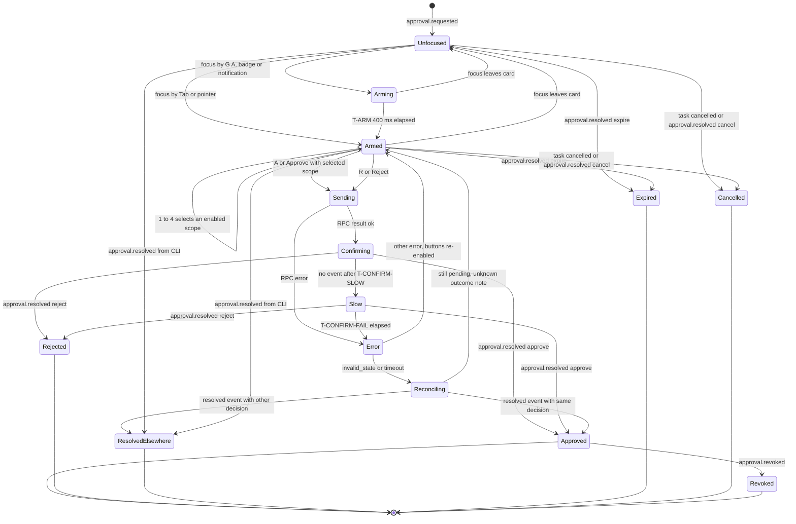
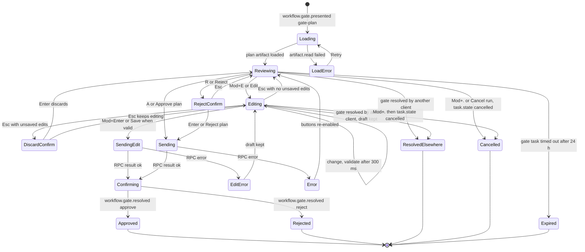
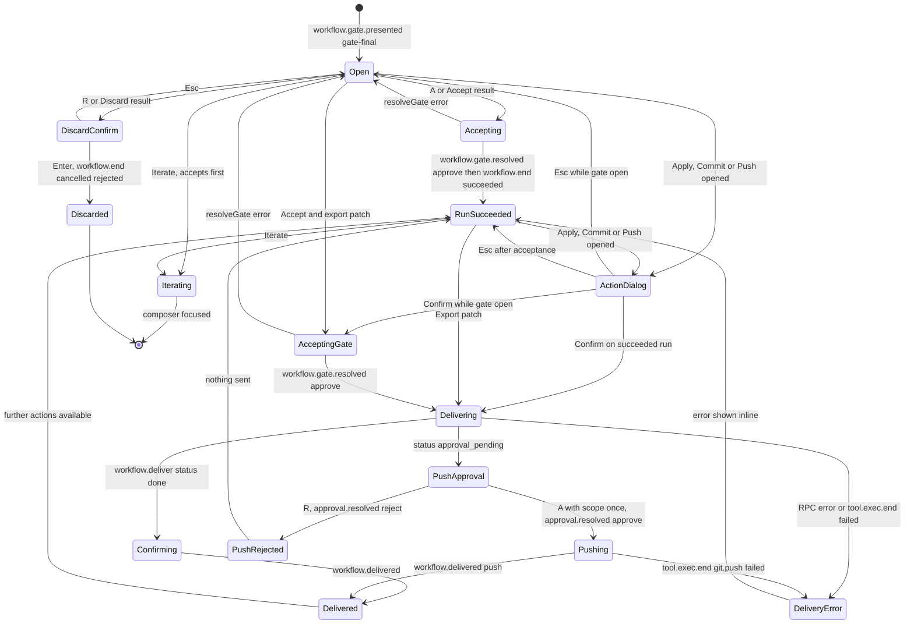
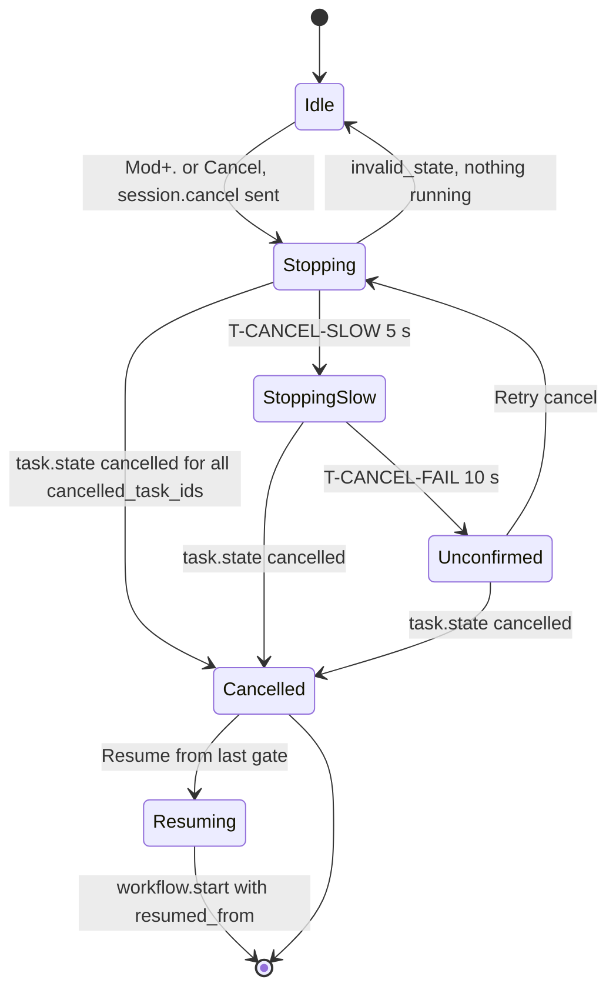

# B05 Interaction specification

This file specifies how the Warden PoC desktop app behaves: the keyboard model, focus management, streaming updates without layout jumps, optimistic versus confirmed states, approvals and the pending-approval badge, gates G1 and G2, cancel and resume, timing rules, OS notifications, error surfaces, and accessibility to WCAG 2.2 AA. Component names, props and data sources are in B04; token names and visual values in B06; strings in B07 (this file references message keys only); store and transport in B08. Where this file and another B-deliverable disagree on behaviour, this file is authoritative.

## 1. Interaction rules

Every section below implements one or more of these rules. They are cited as IR-n.

| Id | Rule | Source |
|---|---|---|
| IR-1 | The app never moves keyboard focus in response to a runtime event. Focus moves only on a user action (key, click, notification click). New items are announced, not focused. | Brief; WRD-11 principle 4 |
| IR-2 | Approval and gate keys (`A`, `R`, `1` to `4`) act only when focus is inside that approval card or gate. There is no "frontmost pending approval" shortcut. | Brief; accidental-approval prevention |
| IR-3 | Nothing is shown as done before the confirming event arrives. The only unconfirmed state is a progress label on the pressed control ("Sending…", or B07's action-specific form such as "Approving…"). | WRD-11 principle 1 |
| IR-4 | Approval prompts and open gates never auto-dismiss and cannot be closed, hidden or collapsed by the user; only `approval.resolved` / `workflow.gate.resolved` (or task cancellation) ends them. | WRD-11 §2.3 |
| IR-5 | Cancel is reachable from every screen and every focus position, including text fields (`Mod+.`), and needs no confirmation. | WRD-11 principle 4; WRD-16 §8 |
| IR-6 | Friction matches consequence: narrowing actions (reject an inline approval, cancel, revoke) are one step; ending a run without a resume path (reject at a gate) needs an inline one-step confirmation; host effects (apply, commit, push) need a dialog; push additionally needs an R5 approval with scope `once`. Scope defaults to `once`. | WRD-08 §7; core §13.2 |
| IR-7 | The timeline is append-only. Content above the user's reading position never moves; height changes happen only at the tail or are compensated by scroll anchoring. | WRD-11 principle 2 |
| IR-8 | Every action names its CLI equivalent (tooltip or ExplainDrawer). | WRD-11 principle 5; BI-6 |
| IR-9 | No meaning by colour alone; every state has icon + text. | WCAG 1.4.1; B06 §1 |
| IR-10 | Motion follows `prefers-reduced-motion` and the in-app setting; no animation is required to understand state. | WCAG 2.3.3; B06 §9.4 |

## 2. Keyboard model

### 2.1 Notation

`Mod` is `⌘` on macOS and `Ctrl` on Linux. Letter keys are case-insensitive unless `Shift+` is written. "Chord" `G` then `A` means press and release `G`, then press `A` within T-CHORD (1,000 ms). Keys marked NEW are additions to the fixed set in core §11.

### 2.2 Dispatch model

One `keydown` listener on `document` (bubbling phase) resolves each key against a stack of **key contexts**, innermost first:

1. Modal dialog (confirmation dialogs, delivery dialogs): only its own keys (Tab cycling, Enter, Esc).
2. Inline confirmation (gate reject confirm, discard-edits confirm): Enter, Esc.
3. Focus context: the region that contains `document.activeElement`: ApprovalCard, GateBar + its gate entry (PlanCard or G2 summary), plan editor, DiffViewer, ModelPicker listbox, ExplainDrawer, Timeline, EventLog, ContextPanel.
4. Global context.

The innermost context that defines the key handles it and calls `preventDefault()`; otherwise the key falls through to the next context, then to the browser. Chord state (`G` pressed, waiting for the second key) is global and shown as a small "G…" indicator in the header status area; any other key, Esc, a pointer click or T-CHORD expiry clears it.

### 2.3 Editable-field rule

A **single-key shortcut** is any shortcut without `Mod`, `Ctrl` or `Alt` (letters, digits, `?`, `[`, `]`, and the `G` chord). Single-key shortcuts are ignored when any of these holds:

- `document.activeElement` is editable: `input` of a text-entry type (`text`, `search`, `password`, `url`, `email`, `number`, `tel`), `textarea`, `select`, any element with `contenteditable` other than `false`, or an element with `role` `textbox`, `searchbox`, `combobox` or `spinbutton`. Radio buttons, checkboxes and buttons are not editable.
- `event.isComposing` is true (IME composition), or `event.key` is `Process`.
- `event.repeat` is true (held key).
- Any of `ctrlKey`, `metaKey`, `altKey` is set (those keys belong to chords like `Mod+.`).

Modifier shortcuts (`Mod+Enter`, `Mod+.`, `Mod+E`, `Mod+,`, `Alt+Shift+Arrow`) work in editable fields, because they cannot be typed as text. `Esc` in an editable field is handled by the field's context first (e.g. discard in the plan editor), then closes the innermost overlay.

### 2.4 Global keys

| Keys | Action | Condition | Notes |
|---|---|---|---|
| `Mod+.` | Cancel (§8) | A run is `running` or `waiting` | Works everywhere, including text fields and dialogs (a dialog closes first, then cancel is sent) |
| `Mod+Enter` | Submit request | Focus in RequestComposer | In the plan editor, `Mod+Enter` means Save (§2.6) |
| `G` then `A` | Focus the oldest pending approval or open gate; repeat to cycle | At least one pending item | IR-1 exception: it is a user action. Arming applies (§2.5) |
| `G` then `T` (NEW) | Focus the latest timeline entry and resume follow mode | SCR-2 | |
| `G` then `C` (NEW) | Focus the RequestComposer | SCR-2 | |
| `G` then `D` (NEW) | Focus the DiffViewer | A `code-diff` is open in the ContextPanel or G2 | |
| `G` then `P` (NEW) | Focus the ContextPanel | ContextPanel open | |
| `E` | Explain the focused item | Focus on an item with an explanation (approval, tool call, routing line, plan, gate) | Opens ExplainDrawer; focus moves to its heading |
| `Esc` | Close the innermost overlay: chord, drawer, inline confirmation, dialog, ContextPanel (in that order); in an approval card or gate, return focus to where `G A` came from | | Never dismisses an approval or gate (IR-4) |
| `?` (Shift+/) (NEW) | Open the shortcut help sheet | Not in an editable field | Lists the keys of the current focus context first |
| `Mod+,` (NEW) | Open Settings (SCR-6) | | |

When the user presses `A`, `R` or `1` to `4` outside any approval or gate while an approval is pending, nothing is approved; the header shows the hint `approval.hint.focusFirst` ("Press G then A to review the pending approval first") for 4 s, at most once per T-HINT (10 s), and the same text is announced politely once.

### 2.5 ApprovalCard keys

Active only when all of these hold (IR-2):

1. `document.activeElement` is the card region or one of its descendants (scope radios and buttons included);
2. §2.3 does not suppress the key;
3. the card phase is `pending` or `error`;
4. the card is **armed** (below).

| Key | Action |
|---|---|
| `A` | Approve with the selected scope → `approval.resolve {approval_id, decision: 'approve', scope}` |
| `R` | Reject → `approval.resolve {approval_id, decision: 'reject', scope: 'once'}`; no confirmation (IR-6) |
| `1` `2` `3` `4` | Select scope `once`, `task`, `session`, `workspace`. A disabled scope is not selected; its reason is announced (`scope.disabled.*`) |
| `←` `→` / `↑` `↓` | Native radio-group movement between enabled scopes (when focus is on the scope group) |
| `E` | Explain (ExplainDrawer with the decision, matched rules, layers, follow-up evidence) |
| `Tab` / `Shift+Tab` | Move between scope group, Approve, Reject, Explain, Copy CLI |
| `Esc` | Return focus to the element focused before `G A` (focus-return stack, §3.3), else to the owning TimelineEntry. Does not dismiss |

**Arming guard.** When focus enters a card programmatically (`G A`, badge activation, notification click), the card is unarmed for T-ARM (400 ms): `A`, `R` and digit keys are ignored and the key hint row shows "Ready in a moment". A user who was pressing `A` for another purpose at the moment of the jump cannot approve by accident. Focus entering by `Tab`, `Shift+Tab` or a pointer click arms the card immediately (deliberate navigation). A card that loses focus and regains it is re-evaluated by the same rule.

**Late-insertion pointer guard.** For T-ARM after a card is inserted into the DOM, its Approve and Reject buttons ignore pointer activation (`pointer-events: none` on the button row), so a click aimed at something that was at that position a moment earlier cannot approve. Keyboard is unaffected by this guard (keyboard needs focus first).

**Double-submit guard.** After `A` or `R` (or a click), both buttons become `aria-disabled` and further keys are ignored until the phase returns to `pending` (error) or the card resolves (§5).

**Key hints.** When focus is within the card, a hint row shows "A Approve · R Reject · 1-4 Scope · E Explain" (`approval.kbd_hint`). When focus is elsewhere, the card shows "Press G then A to review" (`approval.hint.unfocused`). Buttons display their key in a kbd chip.

**Question variant.** A model's clarifying question renders as an ApprovalCard with an answer text field (B07 §3.3). Because the field is editable, `A`, `R` and digits do not apply (§2.3); `Mod+Enter` in the field sends the answer (`approval.resolve {approval_id, decision: 'approve', answer}`, ≤ 4,000 characters, ID-05), `Tab` reaches "Answer" and "Cancel run". Arming still applies to the buttons. The answer becomes the tool result of `approval.request`, tagged untrusted user input.

### 2.6 Gate keys

Gate context = focus inside the gate's TimelineEntry body (PlanCard for G1, result summary for G2) or its GateBar. Same conditions as §2.5 (focus within, §2.3, phase open, armed; arming rules identical).

**G1 review.**

| Key | Action |
|---|---|
| `A` | Approve plan → `workflow.resolveGate {run_id, gate_id, decision: 'approve'}` |
| `Mod+E` (NEW) | Enter edit mode; focus moves to the Summary field |
| `R` | Open the inline reject confirmation (focus moves to its "Reject plan" button) |
| `E` | Explain (plan task routing and the plan's model-written status) |
| `Mod+.` | Cancel run (global) |
| `Esc` | Return focus (focus-return stack); never dismisses |

`Mod+E` is used because `E` is fixed to Explain (core §11).

**G1 reject confirmation (inline, not modal).** `Enter` confirms → `workflow.resolveGate {…, decision: 'reject', comment}`; `Esc` cancels and returns focus to Reject; `Tab` reaches the optional comment field.

**G1 edit mode (plan editor context).**

| Key | Action |
|---|---|
| `Mod+Enter` | Save and approve (only if valid) → `workflow.resolveGate {…, decision: 'approve', edited_artifact}` |
| `Esc` | If no unsaved edits: leave edit mode, focus Edit. If unsaved edits: inline confirmation "Discard your edits?" (`Enter` discards, `Esc` keeps editing) |
| `Alt+Shift+↑` / `Alt+Shift+↓` (NEW) | Move the step containing focus up or down (also available as buttons; no dragging, SC 2.5.7) |
| `Tab` / `Shift+Tab` | Summary → per step: title, files, rationale, Move up, Move down, Remove → Add step → Save → Discard |

Single-letter gate keys are inactive inside the editor (fields are editable). `A` never approves an edited plan: saving an edit is `Mod+Enter` or the Save button.

**G2.**

| Key | Action |
|---|---|
| `A` | Accept result (`workflow.resolveGate {decision: 'approve'}`). The run ends `succeeded` (ID-01); delivery actions are then available on the finished run (§7.5) |
| `R` | Open inline confirmation "Discard this result?"; `Enter` → `workflow.resolveGate {decision: 'reject', comment}`; the run ends `cancelled(rejected)` and nothing can be delivered (ID-01) |
| `E` | Explain (routing of implement and repair, cost) |
| `G` then `D` | Focus the DiffViewer |

Delivery actions (Apply to branch, Commit, Push, Export patch, Iterate) have no single-key shortcuts: they are reached with `Tab` in the DeliveryBar toolbar (arrow keys move between buttons) and open dialogs (IR-6). The push approval card inside the DeliveryBar uses §2.5 keys with only `1` (`once`) enabled.

### 2.7 Timeline keys

The timeline is one tab stop (roving `tabindex`); the focused entry keeps `tabindex="0"`.

| Key | Action |
|---|---|
| `J` / `K` | Focus next / previous entry (top level) |
| `Page Down` / `Page Up` | Same as `J` / `K` (ARIA feed pattern) |
| `Home` / `End` | First entry / last entry; `End` also resumes follow mode |
| `Enter` | Open the focused entry in the ContextPanel (selection follows only on Enter or click, never on focus alone) |
| `Space` | Expand or collapse the focused entry's disclosure (TaskCard tool calls, RoutingLine details, resolved-approval details) |
| `→` | On a TaskCard: expand tool calls if collapsed and move focus to the first nested row (pending ApprovalCards come first) |
| `←` | On a nested row: return focus to its TaskCard entry |
| `J` / `K` on nested rows | Next / previous row within the TaskCard; past the last row, `J` moves to the next top-level entry |
| `Ctrl+End` / `Ctrl+Home` | Leave the feed: focus the first element after / before the timeline (ARIA feed pattern) |
| `E` | Explain the focused row or entry |

Pending ApprovalCards and denied rows are always rendered (pinned) and reachable by `→` even when the group is collapsed (IR-4).

### 2.8 DiffViewer keys

Focus context = the diff region or the file list.

| Key | Action |
|---|---|
| `J` / `K` | Next / previous hunk (across files in the current grouping) |
| `]` / `[` (NEW) | Next / previous file |
| `Enter` | On a hunk: show its provenance in the ContextPanel (the producing tool call, decision, model call, routing); focus stays in the diff |
| `P` (NEW) | Go to provenance: focus the producing ToolCallRow in the timeline (expands the TaskCard) |
| `U` (NEW) | Toggle unified / split layout (split only when available) |
| `Space` | Expand a collapsed file (lockfile, large, binary) |
| `↑` / `↓` | Line by line within the focused hunk (for screen-reader reading of lines) |
| `Tab` | Moves between file list, diff, layout control, version selector |

### 2.9 ModelPicker keys

ARIA select-only combobox. `Enter`, `Space`, `Alt+↓` open; `↑`/`↓` move through all options including disabled ones (disabled options are focusable and announced "not available: {reason}"); `Home`/`End`; type-ahead by model id; `Enter` selects an enabled option and closes; `Enter` on a disabled option does nothing and re-announces the reason; `Esc` closes and restores the previous value; `Tab` selects nothing and closes.

### 2.10 Other contexts

| Context | Keys |
|---|---|
| ContextPanel | Tabs pattern for task tabs (`←`/`→`, `Home`/`End`); `Esc` closes the panel and returns focus to the invoking entry; splitter: focus it and use `←`/`→` (16 px steps), `Home`/`End` (min/max) |
| ExplainDrawer | `Esc` closes and returns focus to the invoker; `Tab` moves through content; no trap (non-modal) |
| EventLog | Grid: `↑`/`↓` or `J`/`K` rows, `←`/`→` cells, `Enter` opens the envelope in the ContextPanel, `Home`/`End` |
| Dialogs (modal) | Focus trapped; `Tab` cycles; `Enter` activates the default button (never a destructive default); `Esc` closes and returns focus to the invoker |
| SetupWizard | `Enter` submits the step when valid; path cards are a radio group (`↑`/`↓`) |

### 2.11 Shortcut help and turning single-key shortcuts off (SC 2.1.4)

`?` opens a non-modal sheet listing keys for the current context, then global keys. Settings → Keyboard (NEW) has "Single-key shortcuts" (default On). When Off, every shortcut in §2.4, §2.7, §2.8 without a modifier is disabled except those inside a focused approval card or gate (`A`, `R`, `1` to `4`, which are active only on focus and therefore satisfy SC 2.1.4 without the toggle); the `G` chords get `Alt+G` equivalents so the jump to a pending approval stays available.

### 2.12 Conflict resolution table

| Key | Contexts that use it | Resolution |
|---|---|---|
| `A` | ApprovalCard, G1 gate, G2 gate | Only with focus inside that item and armed (IR-2); outside: hint only |
| `R` | ApprovalCard, G1, G2 | Inline approval: immediate reject; gates: inline confirmation |
| `E` | Explain everywhere | Plan edit uses `Mod+E` |
| `Mod+Enter` | Composer submit, plan editor save | Focus context decides |
| `Enter` | Timeline open, diff provenance, confirmations, dialogs | Focus context decides |
| `Esc` | Overlays, focus return | Innermost first; never dismisses approvals or gates |
| `J` / `K` | Timeline, nested rows, diff hunks, event log | "Next / previous item in the focused region" |
| `G` | Chord prefix | Never a standalone action |
| `1` to `4` | Scope | Only in an ApprovalCard |
| `P`, `U`, `[`, `]` | DiffViewer only | |
| `Space` | Disclosure toggle, radio, buttons, combobox open | Native element semantics first |

## 3. Focus management

### 3.1 Rules

- **F-1 (IR-1).** No runtime event moves focus: not `approval.requested`, `workflow.gate.presented`, `task.state`, `workflow.end`, errors, banners or toasts. They are announced (§12.4) and signalled visually (badge, stripe, pulse).
- **F-2 Focus preservation.** Components render with stable ids (`approval:apr_…`, `task:tsk_…`, `call:call_…`). When an update re-renders or replaces the focused element, focus is restored to the element with the same id. When the element disappears (a resolved ApprovalCard collapsing into its resolved row; a virtualized row), focus goes to the element with the same id if it still exists (the resolved row keeps the card's id), otherwise to its nearest surviving ancestor entry. Focus never falls to `body`.
- **F-3 Typing is sacred.** While an editable field has focus, nothing (including `G` chords, arriving approvals, banners) changes focus or selection. `Mod+.` is the only global action that works there, and it does not move focus.
- **F-4 After resolve, focus stays on the item.** When an approval or gate the user resolved from the keyboard reaches its confirming event, focus remains on the same id, now the resolved row (approval) or the resolved gate entry header (gate). Focus never jumps to the next pending item; the announcement tells the user how many remain and that `G A` reaches the next one.
- **F-5 Focus return stack.** `G A`, `G T`, `G C`, `G D`, `G P`, notification clicks and badge activation push the previously focused element onto a return stack (depth 5). `Esc` inside an approval card or gate (not editing, no overlay open) pops it and restores focus if the element still exists.

### 3.2 Focus targets on user actions

| User action | Focus moves to |
|---|---|
| `G A` / badge activation / notification click for an approval | The ApprovalCard region (`tabindex="-1"`), scrolled so the card's top is visible below the header and above the GateBar (`scroll-margin`) |
| `G A` / notification click for a gate | G1: the PlanCard region; G2: the result summary region |
| Enter on a timeline entry | Stays on the entry; ContextPanel content updates (use `G P` to move into the panel) |
| Open ExplainDrawer (`E` or Explain) | Drawer heading |
| Close drawer, dialog, ContextPanel (`Esc` or Close) | The invoking element (by id); if gone, its entry |
| `Mod+E` (G1 edit) | Summary field |
| Save edit (confirmed) or Discard | The gate entry header (approved) or the Edit button (discarded) |
| `R` at a gate | "Reject plan" / "Discard result" button in the inline confirmation |
| Delivery dialog open | First field of the dialog (commit message, branch name, remote) |
| Delivery dialog confirmed | The action button that opened it (its status line shows progress) |
| Push → approval card appears in DeliveryBar | No move (F-1); announcement says "Push needs approval. Press G then A." |
| Submit request (confirmed) | Stays in the composer (cleared); the new run is announced |
| Resume (confirmed) | The new run's header entry (the user asked for it) |
| Iterate | RequestComposer text area |
| Cancel (`Mod+.` or button) | No move |
| Navigate to SCR-2 | Latest timeline entry if a run exists, else the composer. Pending items are announced, not focused |
| SetupWizard step change | Step heading |

### 3.3 Focus order on SCR-2

DOM order (and therefore Tab order): header toolbar (workspace, badges, PendingApprovalBadge, Cancel) → banner actions → Timeline (one tab stop) → sticky GateBar (when a gate is open) → RequestComposer → ContextPanel. The sticky GateBar precedes the composer in DOM order so that `Tab` from the gate entry reaches the gate actions next. Sticky elements set `scroll-padding` on the timeline scroller (B06 §6.3) so a focused row is never hidden behind them (SC 2.4.11).

### 3.4 Drafts

The composer draft and the plan-editor draft are kept per session in memory only (never in `localStorage` or on disk): request text may contain secrets that the runtime redacts only on submit (core §13.16, BI-3). Drafts survive screen changes and reconnects, not app restarts.

## 4. Streaming updates without layout jumps

### 4.1 Reserved space

Every element whose content arrives later is rendered at its final minimum height from the start (B06 §6.2 metrics):

| Element | Reserved from | Reservation |
|---|---|---|
| App header badge slots (classification, sandbox, chain, pending badge, Cancel) | Session open | Fixed width per slot while the session has an active run; zero-count badge segments are not rendered but the slot keeps its width (B03 §12) |
| Banner slot | App start | Zero height until the first banner, then fixed per banner; banners appear only above the timeline, never inside it |
| TaskCard header | First `task.state` | 32 px; step counter slot sized for "Step 999/999" with tabular numerals; elapsed slot for "00:00:00"; cost slot for "999.99" |
| RoutingLine | First `task.state` of the task | 24 px with "Choosing a model…" until `routing.decision` |
| Tool call group summary | First `policy.decision` of the task | 28 px |
| Live output region | `task.state → running` | Fixed height: 6 lines of `mono-sm` (6 × 16 px + 16 px padding = 112 px); internal scroll |
| ApprovalCard | `approval.requested` | Full card height computed from its fixed sections; buttons 32 px |
| PlanCard / result summary | `workflow.gate.presented` | Skeleton at the measured height of the previous plan, else 320 px |
| Skeletons | Any loading state | Same height as the loaded content's minimum |

### 4.2 Append-only timeline

1. Entries are ordered by `anchorSeq` and only appended (B04 C-06). Existing entries update in place.
2. Height changes of existing entries are allowed when the entry is the tail of the timeline, or when it is fully outside the viewport; otherwise they are deferred until either condition holds or are compensated by scroll anchoring (§4.3).
3. A resolved ApprovalCard collapses into its 28 px resolved row immediately if it is the tail of its TaskCard and the TaskCard is the tail entry; otherwise it keeps its height until it leaves the viewport, then collapses (compensated).
4. The live output region collapses to zero height when the task reaches a terminal state, at the tail only (tasks are sequential, so the running task is the tail).
5. New entries fade in over `motion-base` with no slide (B06 §9.2).

### 4.3 Follow mode and scroll anchoring

- **Follow on**: the scroller is within T-FOLLOW (48 px) of the bottom. Appended content keeps the view pinned to the bottom (instant scroll; never smooth while streaming).
- **Follow off**: the user scrolled up, or focus is on an entry that auto-scrolling would push out of view. The view is anchored on the first fully visible entry (id + pixel offset); after each applied batch the offset is restored (virtualizer re-measure, B08). CSS `overflow-anchor` is not relied on because the list is virtualized.
- **Jump pill**: while follow is off and entries were appended, a pill "Jump to latest · n new" (`timeline.jumpToLatest`) appears at the bottom edge of the timeline, above the GateBar. Click, `End` or `G T` re-enables follow. The pill is a button in the tab order after the timeline.
- Auto-scroll never moves the focused element out of the viewport (SC 2.4.11).

### 4.4 Token and output streams

- `stream.delta` notifications (`model_text`, `model_tool_args`, `tool_output`) are appended to a per-task tail buffer (max 64 KiB; older text dropped with a "… earlier output not shown" marker) and rendered at most every T-STREAM (80 ms), on `requestAnimationFrame`.
- The live output region scrolls to its own bottom unless the user scrolled up inside it; its height never changes while streaming.
- `tool_output` deltas carry the untrusted treatment (B06 §3.1) and appear only in an expanded ToolCallRow or the ContextPanel, never in the model text region.
- The region is `role="log"` with `aria-live="off"`: streamed text is never announced (it would drown other announcements). "Hide live output" (`task.live.hide`) stops rendering the stream (SC 2.2.2); the preference is per user (`localStorage`, convenience only).
- On `model.call.end` the end marker is removed; on `task.state` terminal the region collapses (§4.2 rule 4). Full text remains available from the ContextPanel (model output is not persisted as an artifact in the PoC; the ContextPanel shows the tail buffer while the session is open. ASM in Deviations).

### 4.5 Batching

- Incoming events are queued and applied once per animation frame; one frame applies at most 200 events (the remainder waits for the next frame) so a burst cannot freeze input.
- Replay after reconnect (`event.subscribe {after_seq}`) applies in chunks of 500 with the timeline `aria-busy="true"` and **no announcements and no notifications** for replayed events, except a single summary announcement at the end ("Caught up. 1 approval pending.").
- Numbers (step, elapsed, tokens, cost) change in place with tabular figures; no counting animation (B06 §9.2).

### 4.6 Artifact version swaps

When a newer `code-diff` supersedes the one open in the DiffViewer (repair after verify, CF-26): if the user has not scrolled or focused inside the diff, the viewer switches to the new version; otherwise a chip "Newer version available (v2)" appears and switching is the user's choice. G2 always opens on the latest version.

## 5. Optimistic versus confirmed states

### 5.1 Principle

The UI never predicts the runtime's answer (IR-3). A user action has four visible phases (B04 `ActionPhase`): **sending** (request written, no RPC result), **confirming** (RPC result ok, confirming event not yet received), **slow** (confirming longer than T-CONFIRM-SLOW), **error**. "Sending…" (or B07's action-specific progress label, e.g. "Approving…", as drawn in B03 §12.4) covers sending and confirming; "Waiting for the runtime to confirm…" for slow. Success is shown only when the confirming event arrives; read-only calls without an event (`audit.verify`, `audit.export`, `system.doctor`, `provider.test`) show their RPC result. Deliveries always wait for `workflow.delivered` (ID-02).

### 5.2 Per-action table

| Action | RPC | Confirming event (success shown when) | Double-submit guard | On error / timeout |
|---|---|---|---|---|
| Submit request | `session.request` with a fresh `client_request_id` (A05 idempotency key) | `session.request` with `payload.run_id` = result, then `workflow.start` | Start disabled until confirmed | Inline in composer; draft kept; Retry reuses the same `client_request_id`, so a lost response cannot start two runs |
| Approve / reject inline | `approval.resolve` | `approval.resolved` with same `approval_id` (and for approve, the follow-up `policy.decision(allow, resolved_by_approval)` is shown in details, CF-40) | Buttons and keys disabled | Inline under buttons; §5.4 reconcile |
| Approve G1 | `workflow.resolveGate` | `workflow.gate.resolved` (decision approve) | Gate buttons disabled | Inline in GateBar |
| Save G1 edit | `workflow.resolveGate` with `edited_artifact` | `artifact.edited` and `workflow.gate.resolved` with `edited_artifact` set | Save disabled | Inline at top of editor; draft kept; field errors mapped if the runtime returns a schema pointer |
| Reject G1 / Discard G2 | `workflow.resolveGate` (reject) | `workflow.gate.resolved` (reject), then `workflow.end(cancelled, rejected)` (ID-01) | Confirm button disabled | Inline |
| Accept G2 | `workflow.resolveGate` (approve) | `workflow.gate.resolved`, then `workflow.end(succeeded)` (ID-01) | | Inline |
| Apply to branch / Commit / Export patch | `workflow.deliver` | `workflow.delivered` with that `action` (ID-02); the RPC result `done` only moves the control to confirming | Action disabled; dialog Confirm disabled | Inline status line in DeliveryBar |
| Push | `workflow.deliver {action: push}` | Result `approval_pending` → `approval.requested` → user approves → `approval.resolved` → `tool.exec.end` (`git.push`) → `workflow.delivered(push)` | Push disabled until the push flow ends | Inline; rejected push is a normal outcome, not an error |
| Answer a model question | `approval.resolve {approval_id, decision: 'approve', answer}` (ID-05, ≤ 4,000 chars) | `approval.resolved`, then `task.state → running (input_provided)` | Answer disabled | Inline under the field; text kept |
| Continue on another model / change pin | `session.setPin {session_id, pin_model}` (ID-04) | RPC result, then a `routing.decision` with `pin` = that model for the paused task and `task.state → running` | Button disabled | Inline on the TaskCard / banner BN-11 |
| Cancel | `session.cancel` | `task.state → cancelled` for every id in `cancelled_task_ids` | Repeated `Mod+.` is a no-op while stopping | §8 timings; BN-10 |
| Resume | `workflow.resume` | `workflow.start` with `resumed_from` | Button disabled | Inline on the result entry |
| Raise budget | `session.setBudget` | `budget.changed` | Button disabled | Inline; `policy_denied` shows the maximum |
| Change classification | `workspace.setClassification` | `workspace.classification` | Control disabled | Inline under the control |
| Add / test / enable / remove provider | `provider.add` / `provider.test` / `provider.enable` / `provider.remove` | `provider.configured` with matching `provider_id` and `action` | Control disabled | Inline on ProviderCard / SetupWizard |
| Revoke grant | `approval.revoke` | `approval.revoked` | | Inline |
| Verify chain | `audit.verify` | RPC result (verification is a read) | Button disabled | Inline + BN-03 on failure |
| Export audit | `audit.export` | RPC result | Button disabled | Inline |
| Run doctor | `system.doctor` | RPC result | Button disabled | Inline |

### 5.3 Timing

After the RPC result, if the confirming event has not arrived within T-CONFIRM-SLOW (3 s), the phase becomes slow. After T-CONFIRM-FAIL (30 s) the phase becomes error with `common.confirmTimeout` and the UI reconciles (§5.4). Pending decisions are never auto-resent.

### 5.4 Reconciliation and idempotency

- **Reconnect.** B08 re-subscribes with `after_seq` = last applied seq; replayed events resolve any sending or confirming phase whose event is found. Afterwards the UI calls `approval.list {session_id, status: 'pending'}` and `workflow.get {run_id}` for the active run and replaces its pending sets if they differ.
- **Unknown outcome.** If a decision was in `sending` when the connection dropped and the approval is still pending after reconciliation, the card returns to `pending` with the inline note `approval.unknownOutcome` ("Your decision may not have reached the runtime. Press A or R again."). The UI never resends on its own.
- **Idempotent retries.** `approval.resolve` or `workflow.resolveGate` on an already-resolved item returns `-32003 invalid_state`. The UI treats it as success if a matching resolved event with the **same** decision exists or arrives within T-CONFIRM-FAIL; if the event shows a different decision (resolved from the CLI), the card shows "Resolved from the CLI by {approver}: {decision}" (`approval.resolvedElsewhere`) and nothing else happens.
- **Cancel** is idempotent: a second `session.cancel` while stopping is not sent.
- `-32003` responses caused by a concurrent winner carry the winning state in `error.data` (A05 §3, e.g. `data.decision`, `data.scope` for `approval_resolved`); the UI uses it to settle the card immediately instead of waiting for the event, and still reconciles with the event when it arrives.

## 6. Approvals and the pending-approval badge

### 6.1 Non-dismissable prompts (IR-4)

- An ApprovalCard has no close control; `Esc` only returns focus (§2.5); navigation to another screen does not affect it; collapsing its TaskCard's tool-call group does not hide it (pending cards are pinned outside the group).
- It leaves the pending state only on `approval.resolved` (approve, reject, expire, cancel) for its id or on its task reaching `cancelled`.
- A task waiting for approval shows the waiting pulse (B06 §9.3), the header badge counts it, and an OS notification is sent if the window is unfocused (§10).

### 6.2 Scope selection

- Default selection is `once` (least privilege), with one exception: approvals from rule `user.package-install` (profile `install`) default to `workspace` when it is allowed, because WRD-04 specifies installs as "one approval per workspace" and B09 §4 relies on it to avoid a repeat prompt in repair and later sessions (B07 §3.2). The consequence text for the selected scope is always visible before approving. The previous choice is never remembered, so any other widening is deliberate.
- Each scope option shows its consequence (`scope.<scope>.explain`), naming the resource pattern the grant will cover (e.g. "This workspace: allows `proc exec, install profile` in ts-express-api until you revoke it").
- Disabled scopes stay visible with the reason (B04 C-11 rules). For R5 (push) only `once` is enabled.
- In the demo (WRD-16 §3 step 4) the user presses `G A`, waits for the card to arm (400 ms), checks that `workspace` is selected (or presses `4`), then presses `A`.

### 6.3 Multiple pending approvals

Tasks are sequential, but one task can have several pending approvals (a command approval and an egress approval held by the proxy). They render in `seq` order inside the TaskCard; `G A` focuses the oldest pending one and repeated `G A` cycles through all pending approvals and open gates in `seq` order, wrapping.

### 6.4 Expiry and held connections

- Pending inline approvals expire after 24 h (core §13.3). The card shows "Expires at {time}" only in the last hour (T-EXPIRY-SHOW); expiry produces `approval.resolved(expire)` and the task fails with `approval_expired` (inline on the TaskCard).
- Egress approvals (`pattern.tool = proxy`): the proxy holds the connection for up to 120 s (core §13.4). The card shows the static text "Connection held until {time}" (no ticking countdown, to avoid live-region noise and motion). After `proxy.denied` for that decision, the card stays pending and adds `approval.proxy_refused_pending`. Approving it then with scope `once` creates a one-shot grant valid for the next identical connection in the same task within 10 minutes (ID-07; the resolved row shows `grant_expires_at`); wider scopes behave as usual.
- **Rejected inline approval** (ID-10): the task returns to `running`; the model receives `approval_rejected` as the tool result and may adapt or stop. The resolved row says so (`approval.resolved.reject`); the TaskCard shows no failure.

### 6.5 Harness start approval (CF-03)

A `tolerated` harness (Codex) produces an approval with pattern `harness`/`start` and title `approval.what.harness` at the start of the harness task, with scopes up to `session` (rule `user.harness-tolerated`). The card shows the vendor-terms notice text from the ProviderCard.

### 6.6 Revocation

Resolved rows of granted approvals (scope ≥ task) show "Revoke" (`undo-2`). Revoking needs no confirmation (it narrows, IR-6); it calls `approval.revoke` and shows "Revoked" on `approval.revoked`. It takes effect on the next decision (WRD-08 §7); a call already running is not interrupted, and the row says so (`approval.revoke.nextDecision`).

### 6.7 Pending-approval badge

- Count = set of `approval.requested.approval_id` minus set of `approval.resolved.approval_id` in the session (B04 C-12). Gates are shown as a separate segment ("G1 open"). Tasks waiting for input are a third segment.
- The badge is always in the header on SCR-2 to SCR-5 and on SCR-1 next to the workspace that has pending items (via `approval.list` on load).
- Activating the badge (click or Enter) does exactly what `G A` does. The badge never approves anything.

### 6.8 ApprovalCard state diagram

The card starts `Unfocused` when `approval.requested` arrives (IR-1: focus is never moved to it). Keyboard approval requires `Armed`: focus inside the card, entered deliberately or after the 400 ms arming delay that follows a programmatic jump. `Sending` and `Confirming` both display "Sending…"; the card becomes `Approved` or `Rejected` only on the `approval.resolved` event. Errors re-enable the buttons, except `invalid_state` and timeouts, which reconcile against the event stream and `approval.list` and never resend. Resolution from the CLI, expiry after 24 h and task cancellation are terminal from any pending state. A granted approval can later be revoked (`approval.revoked`), which the resolved row displays.

## 7. Gates

Gates are approvals with scope `once` (core §13.2). They differ from inline approvals in three ways: they present artifacts to review, they are resolved with `workflow.resolveGate`, and rejecting one ends the run, so reject has an inline confirmation (IR-6). G2 exists only if the latest `verify` succeeded (H4, CF-24).

### 7.1 G1 review (SCR-3)

1. `workflow.gate.presented(gate-plan)` appends the gate entry with the PlanCard skeleton and the plan task's RoutingLine; the plan loads via `artifact.read`. The entry is announced (`live.gate_presented`) and, if the window is unfocused, notified (§10). Focus does not move.
2. The user reaches it with `G A`, the badge, a click, or `J`/`K`. After arming, `A` approves, `Mod+E` edits, `R` opens the reject confirmation, `Mod+.` cancels the run.
3. Approve → "Sending…" on the GateBar → `workflow.gate.resolved(approve)` → GateBar collapses into the header line "Plan approved by {approver}" → `implement` starts (new TaskCard appended).

### 7.2 G1 edit mode

Editing is inline in the PlanCard (WRD-16 §13 screen 3: "inline text edit of the plan JSON's summary and steps"). Editable: `summary`, and per step `title`, `files`, `rationale`; steps can be added, removed and reordered. Read-only: `risks`, `estimate`. `expected_files` is recomputed as the sorted, de-duplicated union of all step `files` and shown live (CF-32), which also satisfies A04's rule that every step file appears in `expected_files`; `estimate.cost_usd` is recomputed by the runtime regardless (A04 §7.3).

The editor validates on change (debounced T-VALIDATE, 300 ms) and on save against the same JSON Schema the runtime uses for `plan` artifacts (bundled at build from A13 `schemas/plan.json`) plus these UI rules:

| Field | Rule | Error code (`plan.error.<code>`) | Blocking |
|---|---|---|---|
| `summary` | Required after trimming; 1 to 2,000 characters | `required`, `too_long` | yes |
| `steps` | 1 to 20 steps | `min_items`, `max_items` | yes |
| `steps[i].title` | Required; 1 to 200 characters | `required`, `too_long` | yes |
| `steps[i].files` | One path per line; 0 to 50 paths; each relative to the worktree root: no leading `/` or `~`, no `..` segment, no `\`, no control characters, no glob characters (`*`, `?`, `[`), at most 512 characters; normalized (no `./`, no `//`, no trailing `/`); unique within the step | `path_absolute`, `path_traversal`, `path_invalid`, `duplicate_path`, `max_items` | yes |
| `steps[i].files` | Path matches the platform deny-list (A04 §7.3 plan validation, A15; e.g. `**/.env`, `**/*.pem`) | `path_denied` | yes |
| `steps[i].files` | Path under `.git/` or `.github/` (not writable by the coder manifest, WRD-16 §7.1) | `path_not_writable` (warning) | no |
| `steps[i].rationale` | 0 to 1,000 characters (required if the schema requires it) | `too_long`, `required` | yes |
| Whole document | Validates against `schemas/plan.json` | `schema` (with JSON pointer) | yes |

The editor shows an info note (`plan.intentNote`): the plan's file lists describe intent; they do not grant or change permissions (BI-5). Errors are shown at the field (`aria-invalid`, `aria-describedby`) and summarized at the top of the editor ("2 problems", each a link that focuses the field). Save (`Mod+Enter` or button) is `aria-disabled` while blocking errors exist; pressing `Mod+Enter` then moves focus to the first invalid field and announces the count.

Save sends `workflow.resolveGate {run_id, gate_id, decision: 'approve', edited_artifact: <full plan JSON>}` where the full plan is the edited `summary` and `steps`, the recomputed `expected_files`, and the unchanged `risks` and `estimate`. The runtime records `artifact.edited` and `workflow.gate.resolved` with `edited_artifact`; the gate entry shows "Plan approved with edits" and links both versions. If the runtime rejects the edit (`-32602` or `invalid_state`), the error appears at the top of the editor, the draft is kept, and a schema pointer in `error.data` is mapped to the field.

### 7.3 Concurrency: resolved elsewhere

If `workflow.gate.resolved` arrives from another client (the CLI's `warden approve <gate-id>`) while the user is reviewing, the GateBar collapses with "Resolved from the CLI by {approver}". If the user is editing, the editor closes with `plan.edit.resolvedElsewhere`, and the unsaved draft is kept in a collapsible "Your unsaved edits" block (read-only, copyable) until the user dismisses it or leaves the session.

### 7.4 Confirmations outside gates

- **Classification change** (SCR-1 WorkspaceRow, SCR-2 header): tightening (e.g. `internal` → `confidential`) is applied without a dialog and shows a notice that a running task pauses at its next step if its model becomes inadmissible (`waiting_for_input`, reason `no_admissible_model`, core §13.7). Loosening (e.g. `confidential` → `internal`) opens a modal confirmation that states the newly admitted tiers ("Vendor APIs (T3) and subscription harnesses (T4) become admissible") and lists `affected_sessions` after the call; the dialog sends `confirm: true` (core §13.14). `restricted` is not offered (CF-02).
- **Pin invalidated by tightening**: if the session pin (latest `session.request.payload.pin_model`) becomes inadmissible (`provider.models → admissible: false`), the ModelPicker shows `routing.picker.pinInvalidated` and the composer's Start button reads "Start on Auto" until the user either confirms Auto or picks another admissible model. If a task is already paused (`waiting_for_input`, reason `no_admissible_model` or `provider`), choosing a model in the picker, or the one-click "Continue on {model} ({tier})" offered when only higher tiers remain after a failure (ID-16), calls `session.setPin` (ID-04) and the runtime re-routes the paused task. The UI never silently sends an inadmissible pin (the runtime would refuse it with `-32007`), and never silently drops it without saying so.
- **Remove provider**: modal confirmation (sends `confirm: true`).
- **Loosening never happens through a single keypress.**

### 7.5 G2 delivery sequence (SCR-5)

Binding decisions: core §15 ID-01 (run lifecycle at G2), ID-02 (delivery is post-run and policy-checked), ID-03 (commit publishes the branch; push needs a prior commit or apply).

- **Placement.** In the G2 review layout the GateBar (with its DeliveryBar) is sticky at the bottom of the review panel, not the timeline column, because the compact timeline is too narrow for the actions (B03 §13, B04 C-13). Its key context is the same as §2.6.
- **Presentation.** The gate entry presents the DiffViewer, TestReport, CostPanel (compact) and chain status. `audit.verify` runs automatically after `workflow.end` and at session close (core §13.17; checkpoint trigger `workflow_end`, ID-14).
- **Accept result** (`A` or button) → `workflow.resolveGate(approve)` → `workflow.gate.resolved(approve)` → `artifact.created(final-result)` → `chain.checkpoint` → `workflow.end(succeeded)`. The run is finished; the bar switches from "Gate G2" to "Run succeeded · deliver" and keeps the delivery actions.
- **Discard result** (`R` or button, inline confirmation) → `workflow.resolveGate(reject, comment)` → `workflow.end(cancelled, reason: rejected)`. Nothing is delivered; diff, report and cost stay readable; all delivery actions become `aria-disabled` (`delivery.unavailable_discarded`, NEW for B07). Iterate stays available.
- **Delivery while the gate is open** is a composite: the dialog's confirm reads "Accept and {action}" (`delivery.acceptAnd.<action>`), sends `workflow.resolveGate(approve)`, waits for `workflow.gate.resolved` (the run then ends `succeeded`), then sends `workflow.deliver`. If the gate resolution fails, `deliver` is not sent. Export patch has no dialog; while the gate is open its button reads "Accept and export patch".
- **Every delivery is a policy-checked host action** (ID-02): `policy.decision` → `tool.exec.start(executor: host)` → `tool.exec.end` → `workflow.delivered {run_id, action, commit, branch, remote, patch_path, approval_id}`. Each appears in the timeline as a ToolCallRow under a "Delivery" entry, and success is shown **only** on `workflow.delivered` (IR-3). A `workflow.deliver` result of `done` moves the control to "confirming" until that event.
- **Commit** publishes the session branch into the user's repository (ID-03): dialog with commit message (prefilled from `final-result.summary`; required) and branch name (default `warden/<ulid>`, editable, validated with git ref rules) → `workflow.deliver {action: 'commit', message, branch_name}` → `workflow.delivered(commit)` → "Committed {sha} on {branch}".
- **Apply to branch** publishes without squashing: dialog with branch name → `workflow.deliver {action: 'apply_branch', branch_name}` → `workflow.delivered(apply_branch)` → "Branch {name} created in your repository".
- **Push** is enabled only after a `workflow.delivered` with action `commit` or `apply_branch` exists in the same session (ID-03); otherwise it is `aria-disabled` with `delivery.push.needsCommit` ("Commit or apply first"), and a `-32003 invalid_state` from the runtime maps to the same inline text. Dialog with remote (from `workflow.get → repository.remotes[]`, default `origin`) and branch → `workflow.deliver {action: 'push', remote, branch_name}` → result `approval_pending` with `approval_id` → an ApprovalCard `kind: 'push'` appears inside the DeliveryBar (not focused, announced). The user focuses it (`G A` or Tab) and presses `A` (scope `once`, the only enabled scope) or `R`. Approve → `policy.decision(allow, resolved_by_approval)` → `tool.exec.start/end` for `git.push` → `workflow.delivered(push)` → "Pushed to {remote}/{branch}". Reject → "Push rejected; nothing was sent. The commit stays on {branch}." (WRD-16 §3 step 6); Push is enabled again (a new attempt creates a new approval).
- **Export patch** → `workflow.delivered(export_patch)` with `patch_path`; result line with the path and "Reveal in folder".
- **CF-24 read-only result** (`failed(verification)`): no gate, no `A`/`R`; only Export patch (allowed on that run, ID-02) and Iterate are enabled; Apply, Commit and Push are `aria-disabled` with `delivery.unavailable_failed`.

### 7.6 Iterate

Iterate while G2 is open accepts the result first (`workflow.resolveGate {decision: 'approve', comment: 'iterate'}`, which ends the run `succeeded`), then moves focus to the RequestComposer with a context chip "Builds on run {run_id}". After a finished, failed, cancelled or discarded run, Iterate only focuses the composer. The UI never resets or modifies the worktree; which commit the next run starts from is decided by the runtime (A13/A14), and the chip shows the `base_commit` reported by the next `workflow.start`.

### 7.7 G1 state diagram

G1 opens in `Loading` when `workflow.gate.presented` arrives and the plan is fetched. From `Reviewing` the user approves directly, edits (`Editing` validates continuously and saves only when valid, which is an approval with `edited_artifact`), or rejects through a one-step inline confirmation. Every submission passes through `Confirming` and ends only on `workflow.gate.resolved`; RPC errors return to the previous state with the draft intact. Resolution from the CLI, cancellation of the run and expiry after 24 h are terminal from the reviewing and editing states.

### 7.8 G2 delivery state diagram

G2 starts `Open`. Accepting the result ends the run `succeeded` at once (ID-01); delivery is a post-run activity on that succeeded run (ID-02). A delivery confirmed while the gate is still open goes through `AcceptingGate`, so the gate decision always precedes delivery. Every delivery is shown as done only on `workflow.delivered`. Push is reachable only after a commit or applied branch (ID-03) and always passes through `PushApproval`, the R5 card with scope `once`; a rejected push returns to `RunSucceeded` with nothing sent, the demo's step 6 ending. Discarding the result ends the run `cancelled(rejected)` with no delivery possible.

## 8. Cancel and resume

### 8.1 Placement and reach (IR-5)

- Header Cancel button, always rendered on SCR-2 to SCR-5 when the active run is `running` or `waiting` (reserved slot otherwise shows nothing but keeps width).
- TaskCard Cancel button on the running task.
- GateBar "Cancel run" at G1 and G2.
- `Mod+.` everywhere, including text fields and open dialogs.

### 8.2 Target

If a task is `running`, `waiting_for_approval` or `waiting_for_input`: `session.cancel {session_id, task_id}` for that task (CLI `warden cancel <task-id>`). If the run is waiting at a gate with no running task: `session.cancel {session_id}` (cancels the run). The runtime's result `cancelled_task_ids[]` defines which confirming events to wait for.

### 8.3 No confirmation, explicit warning

Cancel has no confirmation dialog: it is always recoverable from the last gate, and a dialog would slow the one action that must be fast. Its tooltip and accessible description carry the undo-free warning `cancel.warning` ("Stops now. Partial changes stay on the session branch; you can resume from the last gate."). The warning is also in the shortcut help.

### 8.4 Stopping states

| Time since request | Display | Source |
|---|---|---|
| 0 | Cancel button → "Stopping…" (`cancel.stopping`, `aria-disabled`); the task header shows "Stopping…"; pending approvals of that task are marked "Cancelling" | local |
| on `task.state → cancelled` for all `cancelled_task_ids` | "Cancelled" (greyed entries, ST-5), result entry with "Resume from last gate", partial artifacts flagged | event |
| T-CANCEL-SLOW (5 s) | "Still stopping… processes are being force-stopped" (`cancel.stoppingSlow`) | local timer |
| T-CANCEL-FAIL (10 s) | Banner BN-10 "Cancel not confirmed" with Retry cancel and Open Doctor; the task keeps "Stopping…" until the event | local timer |
| RPC `invalid_state` (nothing to cancel) | Toast `cancel.nothingRunning`; button returns to idle | RPC |

The 5 s value matches the runtime's hard deadline (WRD-16 §8, core §13.10), so "Still stopping" signals that the runtime is late, not that the UI is impatient.

### 8.5 Resume

The cancelled run's result entry offers "Resume from last gate" when `gate-plan` was approved in that run: `workflow.resume {run_id, from: 'last_gate'}` → new run starting at `implement` from the `gate-plan` checkpoint (core §13.10). If the run was cancelled before G1 was approved, the button is `aria-disabled` with `resume.noGate` ("No approved plan to resume from. Start a new request."). CLI: `warden resume <run>`.

### 8.6 Cancel state diagram

Cancel sends immediately and never asks for confirmation. The control shows "Stopping…" until every task in `cancelled_task_ids` has a `task.state` transition to `cancelled`; the slow and unconfirmed states surface a late runtime at 5 s and 10 s. A cancelled run with an approved plan can be resumed, which creates a new run confirmed by `workflow.start` with `resumed_from`.

## 9. Timing rules

| Id | Value | Rule |
|---|---|---|
| T-ARM | 400 ms | Approval and gate keys ignored after programmatic focus entry; Approve/Reject ignore pointer activation after card insertion |
| T-CHORD | 1,000 ms | Maximum gap between `G` and the second key |
| T-HINT | 10 s | Minimum interval between two "focus first" hints |
| T-SPINNER | 400 ms | A spinner appears only if an operation is still pending after this delay (no flicker) |
| T-PROGRESS | 10 s | A running tool call or model call switches from spinner to a progress message with elapsed time ("Running npm test · 14 s") |
| T-LONG | 60 s | Adds "Still running. Mod+. to cancel." to long tool calls and model calls |
| T-TTFT | 15 s | No first token yet: "Waiting for the model's first token (local models can take longer)" (`task.waitingFirstToken`) |
| T-STREAM | 80 ms | Maximum render cadence for `stream.delta` (within the 50 to 100 ms band) |
| T-BATCH | 1 frame, ≤ 200 events | Event application batch |
| T-FOLLOW | 48 px | Distance from bottom that counts as following |
| T-TICK | 1 s | Elapsed-time refresh for running tasks (paused while waiting, CF-38) |
| T-CONFIRM-SLOW | 3 s | Confirming → "Waiting for the runtime to confirm…" |
| T-CONFIRM-FAIL | 30 s | Confirming → error + reconciliation |
| T-CANCEL-SLOW | 5 s | "Still stopping…" |
| T-CANCEL-FAIL | 10 s | Banner BN-10 |
| T-RECONNECT | 250 ms doubling to 5 s max | Reconnect backoff (B08 owns the transport) |
| T-RECONNECT-BANNER | 2 s | Show BN-04 if still not connected |
| T-TOAST | 6 s | Toast lifetime; paused while hovered or focused; never used for anything requiring action |
| T-NOTIFY-COALESCE | 10 s | OS notifications of the same type for the same session are merged |
| T-ANNOUNCE | 2 s | Polite announcements of the same category are coalesced ("3 tasks updated") |
| T-PICKER | 250 ms | Debounce for ModelPicker refetch after `workspace.classification` / `provider.configured` |
| T-VALIDATE | 300 ms | Plan editor validation debounce |
| T-SEARCH | 200 ms | EventLog text filter debounce |
| T-EXPIRY-SHOW | 1 h | Approval expiry time shown only within the last hour of 24 h |
| Runtime: egress hold | 120 s | Proxy holds a CONNECT while its approval is open (core §13.4) |
| Runtime: approval expiry | 24 h | core §13.3 |
| Runtime: gate timeout | 86,400 s | WRD-16 §8 |

## 10. OS notifications

WRD-11 §2.3 and WRD-16 §13 screen 4 require the approval prompt "also as an OS notification". Notifications are a pointer back to the app, never a place to decide.

### 10.1 When

A notification is sent only if all hold: the app window is not focused (Tauri window focus state false, or minimized), or it is focused but shows a different session or a screen outside that session (B03 §12.5); notification permission is granted; the per-type setting is on (Settings → Notifications, all on by default); the event is live (not replayed after reconnect, §4.5); and the event was not caused by this client (e.g. no "cancelled" notification for the user's own cancel).

| Id | Trigger | Title key | Body contains |
|---|---|---|---|
| N-1 | `approval.requested` | `notify.approval.title` / `notify.approval.body` (B07 §3.5) | what (short), task key, workspace name |
| N-2 | `workflow.gate.presented` | `notify.gate.title` / `notify.gate.body` | workspace name, short request text (non-confidential only, §10.2) |
| N-3 | `workflow.end` with `status` `failed` | `notify.failed.title` / `notify.failed.body` | workspace name, reason text |
| N-3b | `workflow.end` with `status` `succeeded` | `notify.succeeded.title` / `.body` (NEW for B07) | workspace name |
| N-4 | `task.state → waiting_for_input` (reasons `no_admissible_model`, `budget`, `input_needed`) | `notify.input.title` / `.body` (NEW for B07) | workspace name, reason |
| N-5 | `task.state → cancelled` not initiated by this client | `notify.cancelled.title` / `.body` (NEW for B07) | workspace name |

### 10.2 Content limits

- Title ≤ 60 characters, body ≤ 120 characters, truncated at the end with an ellipsis.
- Only already-redacted fields are used: `display.what` or the redacted `argv` (short form, ≤ 60 characters), `task_key`, workspace name, rule id, and for gates the first 40 characters of the redacted request text (`session.request.payload.text`). Never: file content, diff text, command output, test failure messages, model output, secret references, tokens or keys, or full paths outside the worktree (BI-3).
- **Confidential workspaces**: the body omits the what, the request text and the task details ("An action in ts-express-api (confidential) needs approval"; key `notify.approval.body_confidential`, NEW for B07), because notifications can appear on lock screens and in notification history outside the app's control (BI-7 applied to display).
- Notifications carry no action buttons. Approving from a notification would skip the why and the scope (WRD-11 §2.3 content order); clicking the notification is the only interaction.

### 10.3 Click, coalescing, withdrawal

- Click → focus the app window, open the session (SCR-2), and focus the pending item (a user action, so F-1 does not apply; the arming guard does, §2.5).
- Same-type notifications for the same session within T-NOTIFY-COALESCE (10 s) replace the previous one using a stable tag (`warden:<session_id>:<type>`) and show a count ("2 approvals needed in ts-express-api").
- When the item is resolved (event), the app withdraws its notification if the platform supports removal (ASM: Tauri notification plugin removal on macOS and Linux notification daemons that support it); otherwise it expires naturally.
- Permission is requested once, after the user's first `session.request` (a user-gesture context), with an in-app explanation (`notify.permission.explain`, NEW for B07). If denied, Settings shows how to enable it; the app never asks again on its own.

## 11. Error surfaces

### 11.1 Surface types

| Surface | Used for | Persistence | Focus |
|---|---|---|---|
| Inline | Failure of an action or entity the user can see: a button's RPC error, a task failure, a field validation error, a provider test failure | Until retried, resolved or the entity changes | Never moved; message linked by `aria-describedby` and announced politely |
| Banner (B04 C-24) | A condition that blocks or qualifies work beyond one entity: ST-2, ST-4, ST-6, connection lost, store unavailable, cancel not confirmed | Until the condition clears (event or re-check) | Never moved; `role="alert"` for blocking and error |
| Toast | Transient confirmation or non-actionable information about a user action with no visible entity ("Patch exported", "Nothing is running", "Copied") | T-TOAST 6 s, paused on hover/focus; dismissible | Never moved; `role="status"` |
| Full-content blocking state | The UI cannot operate: `unauthorized`, `protocol_mismatch` | Until reconnect | Focus moves to its heading on appearance (the rest of the UI is gone, so there is nothing to steal from) |
| Dialog | Confirmations only (loosen classification, remove provider, delivery dialogs); never for errors | Until closed | Modal |

Every error message has three parts (WRD-11 §5): what happened, what the runtime did (paused, retried, fell back, stopped), and what the user can do. Policy denials include the rule id. Keys: `error.<code>.what`, `error.<code>.did`, `error.<code>.action`.

### 11.2 JSON-RPC application errors (core §6)

| Code | String | Surface | Where / behaviour |
|---|---|---|---|
| -32001 | `unauthorized` | Full-content blocking (BN-06) | Transport resets; desktop-started daemon: offer "Restart runtime"; CLI-started daemon: explain token file `~/.warden/run/token` |
| -32002 | `not_found` | Inline | On the entity (artifact, approval, gate); approvals and gates trigger reconciliation (§5.4) |
| -32003 | `invalid_state` | Inline + reconcile | Treated as success if the matching event shows the same outcome (§5.4); else inline "Already {state}"; for Push without a prior commit or apply, `delivery.push.needsCommit` (ID-03) |
| -32004 | `policy_denied` | Inline | At the control, with rule id (e.g. scope above `scope_max`, budget above `session_usd_max`) |
| -32005 | `confirmation_required` | Toast (developer error) + log | Should never happen: the UI always shows the confirmation and sends `confirm: true` |
| -32006 | `sandbox_unavailable` | Banner BN-01 (blocking) | Composer and run actions `aria-disabled`; DoctorChecklist re-runs |
| -32007 | `no_admissible_model` | Inline | Composer (on submit) or TaskCard `waiting_for_input` (ST-3) with actions: configure a provider, change classification, choose another pin |
| -32008 | `budget_exhausted` | Banner BN-02 + inline | CostPanel raise-limit control; composer blocked with reason |
| -32009 | `store_unavailable` | Banner BN-05 (blocking) | All mutating actions disabled; the runtime fails closed |
| -32010 | `unsupported_in_poc` | Inline | At the control (not reachable from the UI's own controls; shown if the CLI configured something unsupported) |
| -32011 | `protocol_mismatch` | Full-content blocking (BN-06) | Shows desktop and daemon versions |
| -32012 | `vendor_terms` | Inline | ProviderCard enable, ModelPicker pin, composer submit with a locked harness pin |
| -32700, -32600, -32601, -32602, -32603 | JSON-RPC standard | Inline where an action caused it (e.g. plan edit schema error from -32602 with pointer), else toast "Unexpected runtime error" + EventLog note | |

### 11.3 Task reason codes (`task.state.payload.reason`)

| Reason | Typical transition | Surface | Actions |
|---|---|---|---|
| `approval_pending` | → `waiting_for_approval` | ApprovalCard (not an error) | Approve / Reject |
| `input_needed` | → `waiting_for_input` | ApprovalCard `question` variant (approval kind `question`, ID-05) | Answer (`approval.resolve.answer`), Cancel run |
| `no_admissible_model` | → `waiting_for_input` | Inline on TaskCard (ST-3) via RoutingLine no-candidate variant, plus banner BN-11 | Continue on {model} (`session.setPin`, ID-04/ID-16), configure provider, change classification; the runtime also re-routes on its own after `provider.configured` ok, a classification change or a circuit closing |
| `budget` | → `failed` (execution) / run `waiting` | Banner BN-02 + inline TaskCard (ST-4) | Raise limit (`session.setBudget`), Cancel |
| `policy_denied` | → `failed` | Inline TaskCard with rule id | Explain, Iterate |
| `schema` | → `failed` | Inline ("output did not match the schema after one repair turn") | Retry via Iterate |
| `verification` | run `failed` (CF-24) | Inline result entry (read-only result) | Export patch, Iterate |
| `interrupted` | → `failed`, re-queued | Timeline notice ("Runtime restarted; retrying attempt 2 of 2") | none (automatic) |
| `provider` | → `waiting_for_input` when only higher tiers remain (ID-16), else `failed` after fallbacks | Inline TaskCard with the model error (§11.4); BN-11 while waiting | Continue on {model} ({tier}) via `session.setPin`; configure provider; Iterate after failure |
| `tool` | → `failed` | Inline with the failing ToolCallRow pinned | Explain, Iterate |
| `resource` | → `failed` | Inline ("A sandbox limit was hit: {detail}") | Iterate |
| `timeout` | → `timed_out` | Inline | Iterate |
| `cancelled` | → `cancelled` | ST-5 greyed entries + result entry | Resume from last gate |
| `rejected` | G1 reject or G2 discard → run `cancelled(rejected)` (ID-01) | Inline on the gate entry (not greyed as ST-5, not resumable) | Iterate |
| `approval_expired` | → `failed` | Inline on the ApprovalCard and TaskCard | Iterate |
| `upstream_failed` | → `blocked` | Inline muted ("Blocked because {task} failed") | none |
| `retry` | → `queued` | Inline note on TaskCard | none |
| `deps_met`, `scheduled`, `approved`, `input_provided`, `output_valid` | normal progress | Not shown as messages | |

### 11.4 Model error codes (WRD-05 §4, `model.call.end.payload.error.code`)

| Code | Surface | Display |
|---|---|---|
| `rate_limited` | Inline on RoutingLine | "Rate limited by {provider}; retrying ({n}/3)"; fallback line if it falls back |
| `provider_unavailable` | Inline on RoutingLine | "{provider} unavailable; retrying ({n}/3)" then fallback within tier |
| `timeout` | Inline on RoutingLine | "No response from {model} in time; retrying or falling back" |
| `model_not_found` | Inline on RoutingLine | "{model} not found at {provider}"; falls back; Settings link |
| `auth_failed` | Inline on TaskCard + ProviderCard status `failing` | "Credential rejected by {provider}"; action: update credential (SetupWizard path) |
| `context_too_long` | Inline on TaskCard | "Context exceeded {model}'s window; compacted and retried" (or failed) |
| `content_filtered` | Inline on TaskCard | "The provider filtered the response" |
| `invalid_request`, `tool_format_unsupported` | Inline on TaskCard | Developer-oriented text with the provider id; `tool_format_unsupported` suggests a model with native tool calling |
| `cancelled` | Not shown (cancel flow covers it) | |

### 11.5 Transport states

| State | Surface |
|---|---|
| `connecting` (startup) | Neutral splash with "Connecting to the Warden runtime…" |
| `replaying` | Header indicator "Catching up"; no announcements (§4.5) |
| `reconnecting` | Header indicator; BN-04 after T-RECONNECT-BANNER; all mutating actions `aria-disabled` with `common.disconnected`; in-flight actions stay "Sending…" and reconcile (§5.4) |
| `disconnected` (gave up after backoff cap for 60 s) | BN-04 with "Retry now"; data shown as stale |
| `unauthorized`, `protocol_mismatch` | BN-06 full-content blocking |

## 12. Accessibility (WCAG 2.2 AA)

### 12.1 Success criteria and how they are met

| SC | Criterion | How |
|---|---|---|
| 1.3.1 | Info and relationships | Landmarks (`header`, `nav`, `main`, `complementary`), feed/article timeline, tables for CostPanel and EventLog, `dl` for plan, labelled regions for cards (B04 per component) |
| 1.4.1 | Use of colour | Icon + text for effects, tiers, states, classifications; dashed vs solid for tiers; +/− gutter signs in diffs (B06 §1, §3) |
| 1.4.3 / 1.4.11 | Contrast | B06 §4 verified pairs; focus ring 3:1 |
| 1.4.4 | Resize text | 200 % zoom; heights are minimums |
| 1.4.10 | Reflow | ASM: the PoC window minimum is 1024 × 640 CSS px (B06 §6.3); at zoom levels that reduce the viewport below 1024 CSS px, the ContextPanel stacks below the timeline (B03 responsive rules) so no two-dimensional scrolling is needed except for code (diff, output), which is exempt as content requiring two-dimensional layout |
| 1.4.13 | Content on hover or focus | Tooltips appear on hover and focus, are dismissible with Esc, hoverable, and persistent until dismissed or focus moves |
| 2.1.1 | Keyboard | Every action reachable by keyboard (§2); no pointer-only interaction |
| 2.1.2 | No keyboard trap | Only modal dialogs trap focus, with Esc and a Close button; the ExplainDrawer and inline confirmations do not trap |
| 2.1.4 | Character key shortcuts | Single-key shortcuts can be turned off (§2.11); approval keys are active only on focus |
| 2.2.1 | Timing adjustable | No UI time limits on user decisions; approval expiry is 24 h (beyond the 20-hour exception); toasts carry no required action |
| 2.2.2 | Pause, stop, hide | Live output can be hidden; the waiting pulse stops after 3 iterations (B06 §9.3); follow mode can be paused by scrolling |
| 2.3.3 | Animation from interactions | Reduced motion (B06 §9.4) |
| 2.4.3 | Focus order | §3.3 |
| 2.4.6 | Headings and labels | Every region has a heading or label; buttons name their object ("Approve npm install") |
| 2.4.7 | Focus visible | 2 px `color-focus` ring on `:focus-visible` everywhere (B06 §7) |
| 2.4.11 | Focus not obscured (minimum) | `scroll-padding` for sticky header and GateBar; jump pill never covers the focused row; auto-scroll never hides focus (§4.3) |
| 2.4.13 | Focus appearance (AAA, met anyway) | 2 px solid outline with 2 px offset and ≥ 3:1 contrast against adjacent colours |
| 2.5.3 | Label in name | Visible labels are the start of accessible names |
| 2.5.7 | Dragging movements | Step reordering and panel resizing have keyboard and button alternatives |
| 2.5.8 | Target size (minimum) | ≥ 24 × 24 px for every target; approval and gate buttons 32 px (B06 §6.2) |
| 3.2.1 / 3.2.2 | On focus / on input | Focus never changes context; selection follows only Enter or click (§2.7); changing a scope radio never submits |
| 3.3.1 / 3.3.3 | Error identification and suggestion | Inline errors with the three-part message (§11.1) |
| 3.3.4 | Error prevention (legal, financial, data) | Host effects have confirmation dialogs; push has an R5 approval; loosening classification is confirmed |
| 3.3.7 | Redundant entry | Plan edits, commit messages and composer drafts are kept on error |
| 3.3.8 | Accessible authentication (minimum) | API key and token fields allow paste and password managers; no cognitive tests |
| 4.1.2 | Name, role, value | ARIA patterns named per component (B04) |
| 4.1.3 | Status messages | Live regions (§12.4) |

### 12.2 Landmarks and patterns summary

`header` (session toolbar), `nav` (screen rail), `main` (screen), timeline `role="feed"` with `article` entries, ContextPanel `complementary`, ApprovalCard `region` (not `alertdialog`: it is inline and non-modal, and must not seize focus), GateBar and DeliveryBar `toolbar`, ModelPicker select-only combobox, scope `radiogroup`, DiffViewer file list `tree` or `listbox` and diff `table`, EventLog `grid`, dialogs `dialog` with `aria-modal="true"`.

### 12.3 Screen reader behaviour of approvals

When a screen-reader user reaches an ApprovalCard (by `G A`), the reading order is: title ("Needs approval: install, risk R4"), What, Who, Why, the scope group (with the selected scope and each option's consequence as its description), Approve, Reject, Explain. The key hint row is `aria-hidden` (the keys are exposed through `aria-keyshortcuts` on the buttons instead), so it is not read twice.

### 12.4 Live announcements

Two visually hidden live regions exist once in the AppShell: `polite` (`role="status"`) and `assertive` (`role="alert"`, used only for blocking and error banners). Components never make themselves live. Announcements go through a queue that coalesces same-category polite messages within T-ANNOUNCE (2 s) and is silent during replay (§4.5).

Keys are B07 §14 `live.*` keys where B07 defines them; others are NEW for B07. The politeness column is normative (behaviour); B07 owns wording.

| Event | Key | Required content (B07 wording) | Politeness | Coalescing |
|---|---|---|---|---|
| `approval.requested` | `live.approval_needed` | What (short), and the instruction to press G then A to review. Must **not** say "Press A to approve" (IR-2: `A` works only with focus in the card) | polite | several within 2 s → `live.approvals_needed` (NEW) "{n} approvals needed. Press G then A." |
| `approval.resolved` (this client) | `live.approval_resolved` | Decision and scope, plus remaining pending count | polite | none |
| `approval.resolved` (elsewhere, expire, cancel) | `live.approval_resolved` (variants) / `live.approval_resolved_elsewhere` (NEW) | Decision, and "from the CLI by {approver}" when not this client | polite | yes |
| `workflow.gate.presented` | `live.gate_presented` | "The plan (result) is ready for review", plus "Press G then A" | polite | none |
| `workflow.gate.resolved` | `live.gate_resolved` (NEW) | Gate, decision, "with edits" when `edited_artifact` is set | polite | none |
| `task.state` (first `running`, `waiting_for_input`, terminal) | `live.task_state` | Task label and state label (reason for failures and waiting) | polite | yes |
| `policy.decision` with `effect: deny` | `live.denied` | What was denied and the reason (S1 to S3 visibility) | polite | yes (count) |
| verify task ended | `live.tests` / `live.repair` | Counts; "repair round started" | polite | none |
| `workflow.end` | `live.run_end` | Status and reason | polite | none |
| cancel requested / confirmed | `live.cancel_requested` (NEW) / `live.cancelled` | "Stopping {task}" / cancelled, resume available | polite | none |
| `workflow.delivered` and push approval arrival | `live.delivery` (NEW, per action) | Committed sha; "Push needs approval. Press G then A."; pushed; push rejected, nothing sent; patch exported | polite | none |
| blocking or error banner appears (BN-01, 02, 03, 05, 06, 10) | banner title key (`st.2.title`, `st.4.title`, `st.6.title`, …) or `live.error` | Banner title and what the runtime did | assertive | none |
| transport lost / restored | `live.disconnected` / `live.reconnected` | | assertive / polite | none |
| chain verify result | `live.chain` | Verified through event {seq}, or failed (BN-03 is also assertive) | polite | none |
| classification changed | `live.classification` | New classification and number of models no longer admissible | polite | none |
| replay finished | `live.caught_up` (NEW) | "Caught up." plus pending approval count | polite | once |
| `A`/`R` pressed outside a card | `approval.hint.focusFirst` (NEW) | "Press G then A to review the pending approval first." | polite | T-HINT |
| disabled scope key pressed | `scope.disabled.*` | Scope and reason | polite | none |
| more polite messages than the throttle allows | `live.coalesced` | Count of updates | polite | not applicable |

Not announced: stream deltas, step counter increments, elapsed time, allowed tool calls, token counts, cost updates.

### 12.5 Verification

Automated: `axe-core` checks in the Playwright end-to-end suite against the mocked daemon (B08) on SCR-1 to SCR-7 and states ST-1 to ST-6, in both themes and with reduced motion; a keyboard-only T1 script (open, request, `G A`, approve G1, `G A`, `4`, `A` for the install approval, accept G2, commit, push, reject push) that fails if any step needs a pointer. Manual: VoiceOver (macOS) and Orca (Linux) walkthroughs of the same script, recorded as part of the H6 session protocol (B09).

## Microcopy keys referenced

B07 owns the strings. Keys used in this file: `approval.hint.focusFirst`, `approval.kbd_hint`, `approval.hint.unfocused`, `scope.<scope>.explain`, `scope.disabled.{max,risk_r5,agent,taint}`, `approval.unknownOutcome`, `approval.resolvedElsewhere`, `approval.extra.egress_hold`, `approval.proxy_refused_pending`, `approval.what.harness`, `approval.revoke.nextDecision`, `plan.intentNote`, `plan.error.<code>` (`required`, `too_long`, `min_items`, `max_items`, `path_absolute`, `path_traversal`, `path_invalid`, `duplicate_path`, `path_denied`, `path_not_writable`, `schema`), `plan.edit.resolvedElsewhere`, `gate.reject.confirm.<gate_key>`, `confirm.discard_plan_edit`, `delivery.acceptAnd.<action>`, `delivery.unavailable_failed`, `timeline.jumpToLatest`, `task.live.hide`, `task.waitingFirstToken`, `cancel.warning`, `cancel.stopping`, `cancel.stoppingSlow`, `cancel.nothingRunning`, `resume.noGate`, `common.confirmTimeout`, `common.disconnected`, `notify.approval.*`, `notify.gate.*`, `notify.failed.*`, `notify.succeeded.*`, `notify.input.*`, `notify.cancelled.*`, `notify.approval.body_confidential`, `notify.permission.explain`, `error.<code>.{what,did,action}` (B07 §7), `st.1` to `st.6` banner keys (B07 §8) and NEW `banner.BN-04/05/06/07/08/10.*`, `live.*` (table §12.4). Keys not defined in B07 at the time of writing are NEW requests to B07: `approval.hint.focusFirst`, `approval.hint.unfocused`, `approval.unknownOutcome`, `approval.resolvedElsewhere`, `approval.revoke.nextDecision`, `plan.intentNote`, `plan.error.*`, `plan.edit.resolvedElsewhere`, `gate.reject.confirm.<gate_key>`, `delivery.acceptAnd.<action>`, `timeline.jumpToLatest`, `task.live.hide`, `task.waitingFirstToken`, `cancel.*`, `resume.noGate`, `common.confirmTimeout`, the NEW `notify.*` and `live.*` keys marked in §10.1 and §12.4.

## Traceability

| Design element | WRD source (doc §) | Requirement / invariant satisfied |
|---|---|---|
| Fixed keys A, R, 1 to 4, E, J/K, Enter, Esc, Mod+Enter, Mod+., G A (§2) | WRD-11 §2.3, WRD-16 §13 screen 4, core §11 | N-7 keyboard-navigable approvals; H6 |
| Approval keys only with focus + arming guard + pointer guard (§2.5) | WRD-11 §2.3; brief B05 | No accidental approvals; BI-1 (a decision is always a deliberate user act) |
| Editable-field rule and single-key toggle (§2.3, §2.11) | WRD-11 §6 | WCAG 2.1.4 |
| Never moving focus on events; focus preservation and return (§3) | WRD-11 principle 4 | WCAG 2.4.3, 3.2.1; brief |
| Reserved heights, append-only timeline, follow mode, 80 ms stream cadence (§4) | WRD-11 principle 2, WRD-01 N-2 | Streaming without layout jumps |
| Optimistic vs confirmed, reconciliation, no auto-resend (§5) | WRD-11 principle 1, WRD-09 §3 | Events are the single source of truth (WRD-09 §7) |
| Two-decision approval display (§5.2) | core §13.1, CF-40 | BI-1, H2 |
| Non-dismissable approvals, pending badge (§6) | WRD-11 §2.3 | F-PL-3 |
| Default scope `once`, consequence text, R5 only `once` (§6.2) | WRD-08 §7, core §13.2 | R5 never beyond once |
| Egress hold note (§6.4) | core §13.4, CF-20 | BI-2 (no network except via proxy) visible |
| G1 edit validation against plan schema, intent note (§7.2) | WRD-16 §13 screen 3, §7.4, CF-32 | BI-5 |
| G2 accept ends the run; delivery post-run, each delivery a policy-checked host action confirmed by `workflow.delivered`; push only after commit or apply, R5 approval `once` (§7.5, §7.8) | WRD-16 §3 step 6, §9, §13 screen 5; core §13.9, §15 ID-01 to ID-03 | H4 (G2 only after verify), BI-1 |
| "Continue on {model} ({tier})" via `session.setPin`; BN-11 (§7.4, §11.3) | WRD-06 §6 step 6, §7; core §15 ID-04, ID-16 | BI-7 (fallback never widens tier); ST-3 |
| Question approvals answered with `approval.resolve.answer` (§2.5, §5.2) | WRD-16 §9 (`approval.request`), core §15 ID-05 | BI-4 (answer tagged untrusted input) |
| CF-24 read-only result (§7.5) | WRD-16 H4, CF-24 | H4 |
| Classification loosening confirmation (§7.4) | core §13.14, WRD-06 §2 | BI-7 |
| Cancel always reachable, no confirmation, 5 s / 10 s timings, resume (§8) | WRD-16 §8, §15 item 10; WRD-11 §3 | Acceptance item 10 |
| Timing table (§9) | WRD-01 N-2, WRD-16 §8, core §13.3 to §13.4 | |
| OS notifications with content limits, confidential redaction, no action buttons (§10) | WRD-11 §2.3, WRD-16 §13 screen 4 | BI-3, BI-7 |
| Error surfaces and code mappings (§11) | WRD-11 §5, WRD-05 §4, core §6 errors, core §3 reason codes | Explain the machine; F-PL-4 (rule id on denials) |
| ST-2 blocking with no unsandboxed fallback (§11.2 -32006) | WRD-11 §3, WRD-16 §13 states | BI-2 |
| Accessibility table and live announcements (§12) | WRD-01 N-7, WRD-11 §6 | WCAG 2.2 AA |
| CLI equivalents on actions (IR-8) | WRD-11 §4 | BI-6 |

## Deviations and assumptions

- NEW keys: `G T`, `G C`, `G D`, `G P`, `?`, `Mod+,`, `Mod+E` (plan edit), `Alt+Shift+↑/↓` (move plan step), `]`/`[`, `P`, `U` (DiffViewer), `Alt+G` chord equivalents when single-key shortcuts are off.
- NEW settings: "Single-key shortcuts" (Settings → Keyboard) and per-type notification toggles (Settings → Notifications). Both are per-user local preferences.
- NEW identifiers: interaction rules IR-1 to IR-10, focus rules F-1 to F-5, timing ids T-*, notification ids N-1 to N-5.
- DEV (cross-deliverable, B07 §14): `live.approval_needed` and `live.gate_presented` are marked assertive, and `live.approval_needed` reads "Press A to approve, R to reject, 1 to 4 to choose a scope". Both conflict with this file: approvals and gates are announced politely (brief B05; they must not interrupt typing or a screen reader mid-sentence), and `A` approves only with focus inside the card (IR-2), so the announcement must say "Press G then A to review". `live.run_end` and `live.cancelled` are also polite here. B07 should align.
- Alignment note: install approvals default to `workspace` scope (B07 §3.2, B09 §4, WRD-04 "one approval per workspace"); all other approvals default to `once`.
- DEV (cross-deliverable): B06 §9.2 row "ApprovalCard appearance … then focus moves to it (B05)" conflicts with IR-1. This file is authoritative for behaviour: focus does not move; the card is announced and signalled. B06 should change that row to "then it is announced (B05 §12.4)".
- DEV: WRD-11 §2.3 says the approval prompt appears "also as an OS notification"; the notification here carries no Approve/Reject buttons (decision only in the app, with what/who/why/scope visible), and in `confidential` workspaces omits the what/who text.
- DEV: `R` at a gate asks for a one-step inline confirmation, while `R` on an inline approval does not (IR-6). WRD-16 lists "Reject" and "Cancel" without specifying confirmation.
- DEV: WRD-16 §13 screen 3 lists "Cancel" as a G1 action; here it is "Cancel run" (`session.cancel`; not resumable from G1 because no plan was approved yet), distinct from "Reject" (`workflow.resolveGate reject`, which ends the run with a recorded gate decision).
- ASM: Model text streamed through `stream.delta` is not persisted; after the session view is reloaded, the live text of finished model calls is not available (only artifacts and events). A10 may decide otherwise.
- ASM: The Tauri notification plugin can report window focus and send notifications with a tag on macOS and Linux; withdrawal of a delivered notification is best-effort.
- ASM: The runtime returns schema-validation errors for `edited_artifact` as JSON-RPC `-32602` with `error.data.pointer` (A05 alignment).
- ASM: Plan limits (20 steps, 50 files per step, 2,000-character summary, 200-character titles, 1,000-character rationale) are UI limits aligned with A13's `schemas/plan.json`; if the schema sets different bounds, the schema wins.
- Applied binding decisions (core §15): ID-01 (G2 accept ends the run `succeeded`; G1 reject and G2 discard end it `cancelled(rejected)`), ID-02 (delivery post-run, confirmed by NEW `workflow.delivered`), ID-03 (commit publishes the branch; push needs a prior commit or apply), ID-04 and ID-16 (`session.setPin`, "Continue on …"), ID-05 (question approvals with `answer`), ID-07 (late `once` grant), ID-08 (default scope), ID-10 (rejected inline approval returns the task to running), ID-14 (checkpoint at `workflow_end`), ID-15 (focus and polite announcements).
- DEV (cross-deliverable, adopted from B03 §13): in the G2 review layout the GateBar is sticky at the bottom of the review panel rather than the timeline column.
- NEW keys for B07: `delivery.unavailable_discarded`, `delivery.push.needsCommit`, `st.3.action.continue` ("Continue on {model} ({tier})"), banner BN-11 keys.
- OQ candidate (recommendation in the report): whether the pending-badge count should include gates (recommended: no, separate segment as in B03).
