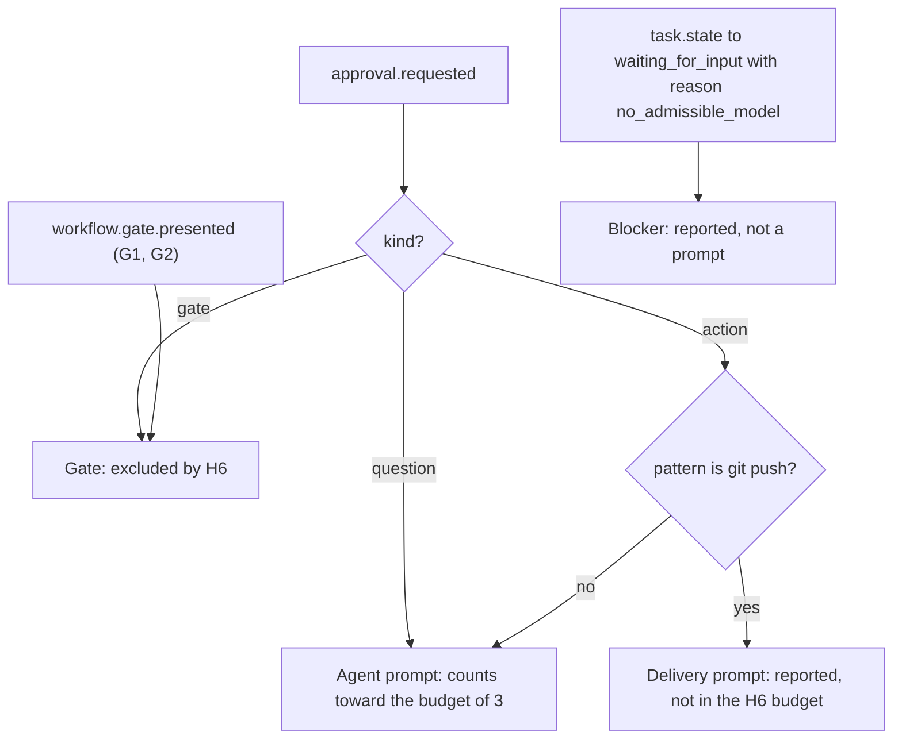

# B09 UX acceptance

This file shows how the design meets hypothesis H6 and how H6 is tested. H6 (WRD-16 §1, §15 item 9): *a developer who is not the author completes task T1 in under 15 minutes with at most three approval prompts beyond the two gates, using the desktop UI*, recorded as a short screen capture. It covers the approval budget of the T1 happy path, the time budget per phase, the design features that keep both budgets, the metrics the product records locally (WRD-11 §7) with exact definitions from events, the usability test script and the pass/fail report template.

## 1. Operational definition of H6

| Term in H6 | Operational definition used in this design |
|---|---|
| "A developer who is not the author" | A participant matching §7.1; not involved in building Warden and not a reader of the WRD documents |
| "completes T1" | The run for T1 reaches G2 with `verify` (or `verify-2`) in state `succeeded` (CF-24), the participant accepts the result at G2 ("Accept result"; the run ends `succeeded`, core §15 ID-01) and commits it: a `workflow.delivered` event with `action: commit` (ID-02) is recorded. Per ID-03 the commit also publishes the branch `warden/<ulid>` into the participant's repository. Pushing is not part of T1 (T1's expected outcome in WRD-16 §4.2 is changed files with passing tests) |
| "under 15 minutes" | From the moderator's start signal, with the app on SCR-1 Workspace home and the fixture listed, to the commit confirmation (`delivery.done.commit`, B07) being visible. Measured on the screen capture; cross-checked with `metrics.get` (§5) |
| "at most three approval prompts beyond the two gates" | At most three **agent-initiated prompts** in the run: every `approval.requested` with `kind: action` except delivery prompts, plus every clarifying question (`approval.requested` with `kind: question`, core §15 ID-05). G1 and G2 (`workflow.gate.presented`, and any `approval.requested` with `kind: gate`) are excluded by H6's wording. The push approval is a delivery prompt (§2.2) |
| "using the desktop UI" | No CLI, no editor, no terminal during the timed task |

## 2. Approval budget of the T1 happy path

### 2.1 Expected prompts

Configuration for the H6 run (§7.2): workspace `ts-express-api` registered as `internal` (CF-01), one provider `anthropic` (T3), no stored grants, `user.yaml` as in WRD-16 §10.6. Automatic routing therefore chooses `anthropic/claude-sonnet` for every task ("Chosen: anthropic/claude-sonnet (prefer-internal; internal data; 1 candidate)").

| Phase | Actions the agents take | Rule and effect | Prompts |
|---|---|---|---|
| `plan` | `fs.read`, `fs.list`, `fs.search` in the worktree; `git.status` | `user.reads-in-worktree` allow; write capability inactive in plan mode (CF-28) | 0 |
| G1 | Plan card | gate (excluded) | (gate) |
| `implement` | `fs.read`, `fs.write`, `fs.patch` under `src/routes`, `src/services`, `test/` | `user.writes-in-worktree` allow | 0 |
| | `proc.exec ["npm","install"]` (WRD-16 §3 step 4) | profile `install` → `user.package-install` approval, `scope_max: workspace`, obligation `egress_allow` registries; `proxy.connect registry.npmjs.org:443` then allowed by the obligation (core §13.5) | **1** (`apr_9`) |
| | `proc.exec ["npm","test"]`, `["npx","tsc","--noEmit"]` | profiles `node-test`, `node-build` → `user.profile-commands` allow | 0 |
| | `git.commit` checkpoint on `warden/<ulid>` | `user.git-commit-session-branch` allow | 0 |
| `verify` | Runtime runs `node-build` and `node-test` deterministically (core §13.12); verifier reads files for the analysis | allow | 0 |
| `repair-1` | Same tools as implement; `npm install` again if the model repeats it | install covered by the grant from `apr_9` when its scope was `task` or wider (`grant.apr_9` in `matched_rules`) | 0 (1 if the participant chose `once`) |
| `verify-2` | as verify | allow | 0 |
| G2 | Result review | gate (excluded) | (gate) |
| Commit (post-run delivery, ID-02) | `workflow.deliver {action: commit}`: squash on the session branch and publish it (ID-03); ActionRequest with `actor.kind: user` → `policy.decision(allow)` → `tool.exec.start(executor: host)` → `tool.exec.end` → `workflow.delivered` | `user.git-commit-session-branch` allow | 0 |
| **Total agent-initiated** | | | **1** expected |

### 2.2 Is the push prompt counted? Decision: no, reported separately

WRD-16 §3 step 6 shows Push as a G2 action that always raises an approval with scope `once`; §15 item 9 limits "approval prompts beyond G1 and G2". The push prompt is **not counted** in the H6 budget and is reported as a separate "delivery prompts" figure, because:

1. T1 ends at a committed, verified change on the session branch (WRD-16 §4.2 expected outcome); pushing to a remote is not part of the task, and the H6 task card (§7.4) asks the participant not to push.
2. The push prompt is initiated by the user's own click after the run has already ended `succeeded` (delivery is post-run, core §15 ID-02), not by an agent. H6 exists to measure agent-induced friction and approval fatigue (WRD-01 §8 risk "Approval fatigue", WRD-10 T-24); a confirmation of the user's own explicit action is not that friction.
3. Push is R5 with a fixed scope `once` (core §13.2); no design choice can reduce it, so counting it would only shift the threshold, not measure the design.

Robustness check: even if it were counted, the expected path has 1 agent prompt + 1 delivery prompt = 2 ≤ 3, so the verdict does not depend on this decision in the expected case. The report template (§8) shows both numbers.

### 2.3 Risks of extra prompts and their mitigations

| Source | When it happens | Rule | Mitigation in the design | Residual expectation |
|---|---|---|---|---|
| Install approved with `once` and repeated in repair | Participant changes the default scope | `user.package-install` | Install prompt defaults to `workspace` (B07 §3.2) with the explanation visible; the default is honoured by keyboard (`A` approves with the selected scope) | 0 to 1 |
| Command outside the profiles (`ls`, `cat`, `node -e`, `npm run <script>`, `git log` via `proc.exec`) | Model habits | `user.other-commands`, `scope_max: task` | A10 renders the profile commands in the `proc__exec` tool description so the model chooses them; `fs.list`/`fs.search` make shell listing unnecessary; the coder prompt says to prefer runtime tools (WRD-16 §7.3); `task` scope covers repeats inside a task | 0 to 1 per task (worst case 2) |
| New network destination | Package postinstall or tooling telemetry | `user.egress-other`, `scope_max: session` | Fixture dependencies come only from `registry.npmjs.org` (WRD-16 §4.1); telemetry env vars are cleared in the sandbox (A06) | 0 |
| Clarifying question (`approval.request`) | Ambiguous request | task → `waiting_for_input` | The H6 request is unambiguous (the canonical T1 text) | 0 |
| Harness session start | Not configured in the H6 run | `user.harness-tolerated` | n/a | 0 |

Worst plausible case: 1 (install) + 1 (other command in implement) + 1 (other command in repair) = 3, still within the budget. Four or more prompts fail H6 for that participant and are listed by rule id in the report so the profile set or tool rendering can be adjusted (WRD-16 §1: "If H6 fails, the UX changes before the MVP, not the architecture").

### 2.4 Classification of prompts



The flowchart is the counting rule implemented by `metrics.get` (§5): each `approval.requested` is classified once by its `kind` (ID-05): gates are excluded, questions count as agent prompts because they interrupt the user in the same way, and actions are either delivery prompts (push) or agent prompts; routing blockers are reported but are not prompts.

## 3. Time budget

Budget for the H6 configuration (Anthropic, `internal`, warm daemon, dependencies cached). Agent phases are wall time of the runtime; human phases are the participant's decisions. Wall clock budgets pause while waiting on the user (CF-38), but H6 time includes everything.

| # | Phase | Who | Target | Ceiling | Main screen |
|---|---|---|---|---|---|
| 1 | Orient, open the workspace, start a session | human | 0:45 | 1:30 | SCR-1 |
| 2 | Read the task card, type and submit the request | human | 1:00 | 1:30 | SCR-2 composer |
| 3 | `plan` | agent | 1:00 | 1:45 | SCR-2 timeline |
| 4 | Review and approve the plan (G1) | human | 1:30 | 2:30 | SCR-3 |
| 5 | `implement` including the install approval (0:20 human) | agent + human | 3:00 | 4:00 | SCR-2, SCR-4 |
| 6 | `verify` (fails as designed) | agent | 0:45 | 1:00 | SCR-2 |
| 7 | `repair-1` | agent | 1:15 | 2:00 | SCR-2 |
| 8 | `verify-2` | agent | 0:45 | 1:00 | SCR-2 |
| 9 | Review the result (G2) | human | 2:00 | 3:00 | SCR-5 |
| 10 | Commit to the session branch | human | 0:30 | 0:45 | SCR-5 DeliveryBar |
| | **Total** | | **12:30** | 15:00 cap | |

Targets sum to 12:30 (human 6:05 including the 0:20 install decision, agent 6:25 excluding it), leaving 2:30 of margin. The ceilings are not additive; they identify which phase is to blame when the total exceeds 15:00. `metrics.get` reports `human_wait_ms` and agent time per run (§5.2), so a failure can be attributed to model speed or to the UX. A local-model run (optional "H6-local", §7.2) is expected to exceed the agent targets; it is reported as information, not as the H6 verdict.

## 4. Design features that reduce prompts and time

| Feature | Where specified | Effect on H6 |
|---|---|---|
| Install approval defaults to `workspace` scope, explanation always visible, revocable in the grants list | B07 §3.2, §3.4; B04 ApprovalCard | Removes the repeat install prompt in repair and in later sessions; keeps the decision informed (T-24) |
| Command profiles allowed without prompts (`node-build`, `node-test`, `lint`) and rendered to the model | WRD-16 §9, §10.6; A10 tool rendering | Tests and builds never prompt |
| Capability summary in the header ("Agents can: … Need approval for: installs, other commands, new network destinations, push") | B07 `capabilities.summary`; WRD-16 §3 step 2 | Sets expectations before the first prompt, shortening the first decision |
| Approval card with what / who / why in fixed order, exact command in mono, rule id, scope explanation inline | B07 §3; B03 SCR-4 | Faster comprehension (`time_to_first_approval_ms`) |
| Keyboard-first decisions: `A`, `R`, `1`–`4`, `G` then `A`, `Mod+Enter` | core §11; B05 | Seconds per decision; no pointer travel |
| New approvals announced politely with "Press G then A to review" (focus is never moved, core §15 ID-15), pulse and PendingApprovalBadge, OS notification when the window is in the background; `G` then `A` jumps to the oldest pending approval | B05 §12.4; B06 §9.3; B07 §3.5, §14 | No time lost waiting on a prompt the participant has not seen, without stealing focus while they type or read |
| Plan card with steps, expected files, risks, estimated cost and the routing line | B03 SCR-3; B07 §4 | G1 decision within 1:30 without opening files |
| Collapsed tool calls with deny/approval rows always expanded | B08 §8; B04 TaskCard | Scanning implement output takes seconds |
| Repair shown as a named step with the failure analysis, not as an error | B07 `timeline.task.repair`, `gate.g2.repair_note` | Prevents the participant from cancelling at the first failing test (protects `cancel_rate`) |
| G2 summary first (tests 43 passed, chain verified, cost), diff below with per-file list and hunk provenance | B03 SCR-5; B08 §10 | G2 decision within 2:00 |
| Commit as the primary delivery action; Push visually secondary and labelled "always asks for approval, once" | B07 §4 `delivery.push_needs_approval` | Avoids an unneeded push prompt |
| No confirmation dialog on Cancel; resume from last gate | B07 §11; core §13.10 | Never trap the user; recovers a mistaken cancel without restarting |
| Explain drawer on every decision | B07 `approval.explain`; `policy.explain` | Answers "why" without leaving the flow |

## 5. Metrics recorded locally

### 5.1 Principle

The UI does not keep its own telemetry. Every metric is computed by the daemon from the hash-chained events on demand (`metrics.get`, core §6; CLI `warden report --ux`). This keeps CLI parity (BI-6), makes the metrics as trustworthy as the audit trail, and means nothing extra is stored. All times use envelope `ts` values (RFC 3339 ms, UTC).

### 5.2 Definitions

Notation: for a workflow run *r*, `E(r)` is the set of events whose envelope `workflow_run_id = r`, plus the `session.request` event whose `payload.run_id = r`. `t(e)` is the event's `ts`. Runs in scope are those whose `session.request` falls in `[since, now]` and, if given, in `session_id`. A **resumed** run (`workflow.start.resumed_from != null`) is a continuation: it is attributed to its origin run *o* (following `resumed_from.run_id` transitively), and its events are counted with *o*.

| Metric (`metrics.get` field) | Exact definition from events |
|---|---|
| `prompts_per_task` | Per origin run *o*: `agent(o)` = count of `approval.requested` in `E(o)` with `kind = "question"`, plus those with `kind = "action"` whose `pattern` is not `{tool: "git", operation: "push"}`; `delivery(o)` = count of `approval.requested` with `kind = "action"` and `pattern {tool: "git", operation: "push"}` (push is post-run, so these are attributed to the run named by the delivery); `kind = "gate"` is never counted; `by_task` = agent prompts grouped by `task_key` (from `task.state`/envelope `task_id`). Summary: mean, median and max of `agent` over runs. "Task" in WRD-11 §7 means the user's job (the run), not a DAG task. |
| `time_to_first_approval_ms` | Per origin run: let `a` be the first `approval.requested` (by `seq`) counted in `agent(o)`; `decided_in_ms = t(approval.resolved with approval_id = a.approval_id and decision ∈ {approve, reject}) − t(a)`; `requested_after_ms = t(a) − t(session.request)`. Null if there is no such prompt or it expired or was cancelled. Summary: median and p90 of `decided_in_ms`. Rationale: the response time to the first prompt measures prompt comprehension, which the UI controls; the delay before the prompt appears is dominated by the model and is reported alongside. |
| `plan_edit_rate` | `edited / resolved`, where `resolved` = count of `workflow.gate.resolved` with `gate_key = "gate-plan"`, and `edited` = those with `decision = "approve"` and `edited_artifact != null`. Also returns `rejected` = those with `decision = "reject"`. Null when `resolved = 0`. |
| `cancel_rate` | `cancelled / started`, where `started` = count of origin runs (`workflow.start` with `resumed_from = null`), and `cancelled` = count of origin runs having at least one `workflow.end` with `status = "cancelled"` in the run or its continuations. Also returns `resumed` = cancelled runs that have a continuation. |
| `time_to_verified_ms` | Per origin run: `t(first workflow.gate.presented with gate_key = "gate-final" in E(o) or its continuations) − t(session.request of o)`. A G2 presentation implies a succeeded `verify` or `verify-2` (CF-24, WRD-16 H4). Null if G2 was never reached. Summary: median and p90. |
| `delivery_prompts` (NEW) | Sum of `delivery(o)` over runs. |
| `approval_latency_ms` (NEW) | Median and p90 of `t(approval.resolved) − t(approval.requested)` over all agent prompts with `decision ∈ {approve, reject}`. |
| `gate_review_ms` (NEW) | For `gate-plan` and `gate-final` separately: median of `t(workflow.gate.resolved) − t(workflow.gate.presented)` for the same `gate_id`. |
| `human_wait_ms` (NEW) | Per origin run: sum of all approval latencies, gate review times, and `waiting_for_input` intervals (`task.state` into `waiting_for_input` until the next `task.state` of that task). |
| `time_to_delivered_ms` (NEW) | Per origin run: `t(first workflow.delivered with action ∈ {commit, apply_branch, push} for the run or its continuations) − t(session.request)` (core §15 ID-02). Null if nothing was delivered. |
| `denials_per_run` (NEW) | Count of `policy.decision` with `effect = "deny"` in `E(o)`; reported with the top rule ids. Friction and safety indicator (WRD-01 §9). |
| `repair_rounds` (NEW) | Count of tasks with `task_key` `repair-1` reaching `running` in `E(o)`. |
| `h6` (NEW, per run) | `{ prompts: agent(o), delivery_prompts: delivery(o), time_to_delivered_ms, pass_prompts: agent(o) ≤ 3 }`; the time criterion is judged on the screen capture (§1). |

Result shape (ASM for A05; core §6 fixes the five first field names):

```json
{
  "since": "2026-10-20T09:00:00.000Z",
  "runs": 1,
  "prompts_per_task": { "mean": 1, "median": 1, "max": 1,
    "per_run": [ { "run_id": "wfr_…", "agent": 1, "delivery": 1, "by_task": { "implement": 1 } } ] },
  "time_to_first_approval_ms": { "median": 14200, "p90": 14200,
    "per_run": [ { "run_id": "wfr_…", "requested_after_ms": 212000, "decided_in_ms": 14200 } ] },
  "plan_edit_rate": { "value": 0, "edited": 0, "rejected": 0, "resolved": 1 },
  "cancel_rate": { "value": 0, "cancelled": 0, "started": 1, "resumed": 0 },
  "time_to_verified_ms": { "median": 571000, "p90": 571000, "per_run": [ { "run_id": "wfr_…", "value": 571000 } ] },
  "delivery_prompts": 1,
  "approval_latency_ms": { "median": 14200, "p90": 14200 },
  "gate_review_ms": { "gate-plan": 83000, "gate-final": 118000 },
  "per_run": [ { "run_id": "wfr_…", "human_wait_ms": 215200, "time_to_delivered_ms": 702000,
                 "denials": 0, "repair_rounds": 1, "h6": { "prompts": 1, "delivery_prompts": 1, "pass_prompts": true } } ]
}
```

### 5.3 Storage and sharing

- **Local only.** Metrics are computed from `~/.warden/db/warden.sqlite` on request; no separate metrics table, no background collection, no network transmission (WRD-16 §2.2 "telemetry beyond the local cost panel" is out of scope; WRD-11 §7 "collected locally").
- **Opt-in sharing.** Sharing is a deliberate export: `warden report --ux --json --out <file>` or the "Export UX metrics" action next to "Export session" in SCR-7 (NEW action, same `metrics.get` call, written to `~/.warden/exports/ux-metrics-<date>.json`). Nothing is sent anywhere; the user decides whether to give the file to anyone. The export contains ids, counts, durations, task keys, rule ids, model ids and tiers only; it contains no request text, no file paths, no code and no workspace root.
- **H6 test use.** The moderator asks the participant's consent to take the export and the screen capture (§7.3).

## 6. What the UI must ensure for the metrics to be valid

The metrics are derived, so the UI's obligation is to cause the right events:

| Requirement | Reason |
|---|---|
| Approvals and gates are resolved only by explicit user action (click or key), never automatically, never on timeout from the UI side | `decided_in_ms` and `gate_review_ms` measure human time |
| G1 "Edit" sends `edited_artifact` only if the plan JSON changed; "Save and approve" with no change sends `edited_artifact: null` | `plan_edit_rate` must not count no-op edits |
| Cancel uses `session.cancel`; "Resume from last gate" uses `workflow.resume` (not a new request) | `cancel_rate` and continuation attribution |
| Iterate uses `session.request` in the same session (a new origin run) | Iterations are counted as new jobs |
| The composer submits the text as typed with a `client_request_id` that is reused on any retry of the same submission (core §15 ID-13, B08 §5.3) | No duplicate origin runs |
| G2 is resolved only by the user's explicit "Accept result" or "Discard result", or by a delivery button that first accepts the gate ("Accept and commit", B05) | `gate_review_ms` for G2 measures a real review; `time_to_delivered_ms` starts a post-run delivery (ID-01, ID-02) |

## 7. Usability test script

### 7.1 Participants

- Professional software developers with at least two years of TypeScript or JavaScript on Node, daily git use, and some use of an AI coding assistant.
- Not involved in Warden, not readers of the WRD documents, not shown the demo beforehand.
- Mix: at least one macOS and one Linux user if both builds are available; at least one keyboard-heavy user (vim or emacs keybindings).
- Number: five sessions are planned. PoC acceptance (§15 item 9) requires one recorded passing session; the design target is at least four of five.

### 7.2 Setup (before each session)

1. Build under test: the same release candidate for all sessions; record `system.version` (version and commit).
2. Machine: 1440 × 900 or larger display, window maximised to 1440 × 900, light or dark theme per participant preference (recorded), OS notifications enabled.
3. Runtime state: run `scripts/h6-reset.sh` (NEW) which stops the daemon, removes `~/.warden/db`, `~/.warden/sessions`, `~/.warden/exports` and stored workspace grants, keeps `models.yaml`, `config.yaml`, `policy/user.yaml` and the keychain entries, re-imports the fixture `ts-express-api` from its bundle, and runs `warden open fixtures/ts-express-api --classification internal` (CF-01).
4. Providers: `anthropic` only (API key with a spend limit). Optional "H6-local" sessions use `ollama` with `local/qwen-coder-32b` only and are reported separately.
5. `warden doctor` green; the desktop app open on SCR-1; screen recording with microphone started; a visible clock in the recording (OS clock) for timestamps.
6. Moderator has the observation sheet (§7.7) and the task card printed.

### 7.3 Introduction (read verbatim, about 3 minutes)

"Thank you for helping. We are testing a desktop tool, not you. There are no wrong answers; if something is confusing, that is what we need to find. Please think aloud: say what you are looking at, what you expect, and what you are trying to do. I will mostly stay quiet and will not be able to answer questions about how the tool works during the task, because we want to see how it works without help. The session is recorded, screen and voice, and used only to improve the tool. At the end I will ask whether you are willing to share a small file with usage numbers from this machine; it contains no code or text you typed. You can stop at any time. Do you have questions before we start?"

Think-aloud practice (1 minute, not timed, unrelated to the task): "Please open the settings and tell me, thinking aloud, which model providers are configured." Return the app to SCR-1 afterwards.

### 7.4 Task card T1 (hand over printed; timed)

> You work on the repository **ts-express-api**. Using Warden, add a `GET /users/:id` endpoint that returns the user or 404, with tests.
> When you are satisfied with the result, commit it to Warden's session branch. Do not push.
> Work as you would at your job. Tell me when you are done.

The moderator says "Please begin" and notes the time (t0). The task ends at the commit confirmation (t1) or at 20:00 (hard stop, recorded as not completed).

### 7.5 Secondary tasks (untimed for H6, after T1)

| Id | Task (read verbatim) | Success | Measures |
|---|---|---|---|
| B | "Your security team says this repository is confidential. Make Warden treat it that way. Then tell me whether Warden could still work on it with the current setup, and why." | Changes classification to `confidential`; states that Anthropic is not admissible for confidential data (T3 Vendor API) and that no admissible model exists (ST-3) or names the reason line | BI-7 visibility; classification UI |
| C | "Earlier Warden asked you before running `npm install`. Find out which rule caused that, and where you could withdraw the permission you gave." | Opens Explain and names `user.package-install`; finds Revoke in the grants list | Explainability; T-24 (informed grants) |
| D | Comprehension questions (verbal): (1) "What did your approval for `npm install` allow, and for how long?" (2) "Could the agent have read files in your home directory?" (3) "What would have happened if you had clicked Push?" | Correct: registries only, for this workspace until revoked; no; an approval prompt for that single push | Mental model of scope, sandbox and R5 |

### 7.6 Moderator rules

The moderator must not:

- name or point at UI elements ("the Approve button", "the scope selector", "look at the right panel");
- explain Warden concepts: approvals, scopes, tiers, gates, classifications, sandbox, repair;
- confirm or deny correctness during the task ("yes, that's right", "good", "almost");
- mention keyboard shortcuts or the time remaining, or hurry the participant;
- refer to the system as "the AI" or attribute intentions to it;
- touch the keyboard or mouse.

The moderator may say only: "What are you thinking now?", "What do you expect to happen?", "What would you do if I were not here?", "Please keep thinking aloud", and, when the participant asks a question, "What do you think?".

Assistance rule: if the participant is stuck with no progress for 3 minutes, or asks to give up, the moderator may give the smallest hint needed. Any assistance marks the session as **not passing H6** (recorded with the time and the hint), and the task continues to collect data.

Stop rule: at 20:00, or if the runtime fails in a way that makes completion impossible (for example provider outage). Runtime failures are classified as "system failure" in the report, separately from UX failures.

### 7.7 Observation sheet (one per participant)

| Column | Content |
|---|---|
| Time (mm:ss from t0) | From the recording |
| Screen | SCR-1 to SCR-7, state ST-x |
| Event | What happened in the product (for example `approval.requested apr_…`, `workflow.gate.presented gate-plan`) |
| Participant action | Click, key, typed text summary |
| Quote | Verbatim think-aloud where relevant |
| Issue | Hesitation > 10 s, wrong click, misreading, question asked, visible confusion, error message seen |
| Severity | 1 cosmetic, 2 minor delay, 3 major delay or wrong decision risk, 4 blocks completion or unsafe decision |
| Design reference | Component or key (B04 component, B07 key) the issue relates to |

Phase timestamps (filled from the recording): t0 start, request submitted, plan presented, G1 resolved, first approval presented, first approval resolved, verify failed, repair started, G2 presented, G2 resolved, commit confirmed (t1).

Post-task questionnaire: Single Ease Question (1 to 7) for T1; five items on a 1 to 5 scale ("I understood why each approval was needed", "I knew what the agents could and could not do", "I trust that the tests really passed", "I knew which model worked on my code and why", "I would use this for real work"); two open questions ("What slowed you down most?", "What would you change first?").

### 7.8 Success criteria

A session **passes H6** when all hold:

1. Completed as defined in §1 (G2 approved after a succeeded verify; commit confirmed).
2. `t1 − t0 < 15:00` on the recording.
3. Agent-initiated prompts ≤ 3 (`metrics.get` `h6.prompts`), gates excluded, push reported separately.
4. No moderator assistance.
5. Desktop UI only (no CLI, editor or terminal).

Supporting targets (not part of the verdict, used to prioritise fixes): SEQ ≥ 5; `time_to_first_approval_ms` median ≤ 30 s; G1 review ≤ 2:30; G2 review ≤ 3:00; all three questions in task D answered correctly; no severity-4 issue.

PoC verdict: H6 **passes** when at least one session passes and is recorded (WRD-16 §15 item 9). The design target is at least four of five passing sessions; below that, the report lists the UX changes to make before the MVP.

## 8. Pass/fail report template

```markdown
# H6 usability report: Warden PoC

Build: <version> (<commit>) · Dates: <yyyy-mm-dd …> · Moderator: <name> · Observer: <name>
Configuration: provider anthropic (T3), workspace ts-express-api (internal), fresh state (h6-reset.sh), OS: <macOS x / Linux y>

## Verdict
H6: PASS | FAIL  (sessions passing: n of N; PoC criterion: ≥ 1 recorded; design target: ≥ 4 of 5)

## Sessions
| P | Profile | OS / theme | Completed | Time (mm:ss) | Agent prompts | Delivery prompts | Assist | UI only | H6 |
|---|---|---|---|---|---|---|---|---|---|
| P1 | 4 y TS, vim | macOS / dark | yes | 11:48 | 1 | 0 | no | yes | PASS |

## Time per phase (median over sessions; target / ceiling from B09 §3)
| Phase | Median | Target | Ceiling | Over? |
|---|---|---|---|---|

## Metrics (from `warden report --ux --json`, one file per session, sha256 listed)
| P | time_to_first_approval_ms | approval_latency median | gate_review G1 / G2 | plan_edit_rate | cancel_rate | time_to_verified_ms | human_wait_ms | denials | repair_rounds |
|---|---|---|---|---|---|---|---|---|---|

## Prompts by rule id (all sessions)
| Rule id | Count | Sessions | Scope chosen (once/task/session/workspace) |
|---|---|---|---|

## Secondary tasks
| P | B (classification) | C (explain / revoke) | D1 | D2 | D3 |
|---|---|---|---|---|---|

## Questionnaire
SEQ median: x · Items 1–5 medians: … · Open answers (grouped): …

## Issues (ranked by severity, then frequency)
| # | Issue | Severity | Sessions | Evidence (time codes) | Design reference | Proposed change |
|---|---|---|---|---|---|---|

## Failures and their class
| P | Class (UX / system / model) | What happened | Counts against H6? |
|---|---|---|---|

## Attachments
Screen captures: <file names, durations> · Metrics exports: <file names, sha256> · Audit exports and `audit verify --strict` results: <file names>
```

## Traceability

| Design element | WRD source (doc §) | Requirement / invariant satisfied |
|---|---|---|
| Operational definition of H6 (§1) | WRD-16 §1 H6, §15 item 9 | H6 measurable and repeatable |
| Approval budget of the T1 happy path (§2.1) | WRD-16 §3 steps 3 to 6, §9, §10.6; core §13.1, §13.5 | ≤ 3 prompts beyond G1 and G2; BI-1 path per prompt |
| Push not counted, reported separately (§2.2) | WRD-16 §3 step 6, §15 item 9; WRD-08 §7; WRD-10 T-24 | R5 once-only preserved; H6 threshold interpreted and justified |
| Extra-prompt risks and mitigations (§2.3) | WRD-01 §8 (approval fatigue), WRD-16 §7.3, §9 | T-24 mitigations: scoped approvals, profiles, clear reasons |
| Time budget per phase (§3) | WRD-16 §3 (demo timings), §1 H6 | Under 15 minutes with margin; CF-38 wait handling |
| Design features that reduce prompts and time (§4) | WRD-11 §1, §2.3; WRD-16 §13 | H6; never trap the user; explain the machine |
| Metric definitions from events (§5.2) | WRD-11 §7; WRD-01 §9; core §5, §6 (`metrics.get`); A05 §8.11 | Prompts per task, time to first approval, plan edit rate, cancel rate, time to verified change |
| Completion and delivery timing from `workflow.delivered`; G2 accept ends the run; push is post-run (§1, §2, §5.2) | core §15 ID-01, ID-02, ID-03 | H6 completion is an audited event; push stays outside the prompt budget |
| Local-only computation, opt-in export (§5.3) | WRD-11 §7; WRD-16 §2.2 | "Collected locally; shared only when the user opts in"; no telemetry |
| Metrics derived from the audit trail, CLI `warden report --ux` | brief invariant 6; WRD-09 | BI-6; metrics as trustworthy as the chain |
| Usability test script, moderator rules, observation sheet (§7) | WRD-16 §15 item 9, §16 week 8 | H6 test with a second developer, screen capture |
| Secondary tasks B, C, D (§7.5) | WRD-16 §3 step 7, §15 item 8; WRD-08 §7, §8 | BI-7 comprehension; explainability; scope understanding |
| Report template (§8) | WRD-16 §15 item 12 | PoC report states pass/fail with numbers |

## Deviations and assumptions

- DEV (interpretation of WRD-16 §15 item 9): the push approval is not counted toward the three-prompt budget and is reported as `delivery_prompts`; the expected path passes either way (§2.2). OQ candidate.
- DEV (interpretation of WRD-11 §7): "time to first approval" is defined as the user's response time to the first agent prompt (`decided_in_ms`), with the delay before the prompt reported as `requested_after_ms`. OQ candidate.
- Clarifying questions count as agent prompts (conservative reading of H6). Integration pass: they are identified by `approval.requested.kind = "question"` (ID-05) instead of the `task.state` reason, so each question is counted once, and `kind = "gate"` requests are excluded explicitly. The quantity measured is unchanged.
- NEW `metrics.get` result fields beyond core §6: `delivery_prompts`, `approval_latency_ms`, `gate_review_ms`, `human_wait_ms`, `time_to_delivered_ms`, `denials_per_run`, `repair_rounds`, `h6`, `per_run`, `runs`, `since`; and the object shapes of the five core fields (§5.2). A05 §8.11 adopts these shapes (integration pass); A05 is authoritative for the schema.
- NEW SCR-7 action "Export UX metrics" (uses `metrics.get`; B07 keys `audit.export_metrics`, `audit.export_metrics_done`); NEW script `scripts/h6-reset.sh`.
- `workflow.delivered {run_id, action, commit, branch, remote, patch_path, approval_id}` is the official delivery event (core §15 ID-02); `time_to_delivered_ms` and the H6 completion definition use it (the first draft's ASM and OQ candidate are withdrawn).
- Per core §15 ID-01, G1 reject and G2 "Discard result" end the run `cancelled` with reason `rejected`. The `cancel_rate` definition is unchanged, so these runs count as cancelled (the user stopped the job); `plan_edit_rate.rejected` shows the G1 share, and the per-run `workflow.end.reason` in the audit export distinguishes them from `session.cancel`.
- ASM: the H6 configuration uses only the `anthropic` provider so that automatic routing is fast and deterministic; the demo's local-model routing is covered by H1 and by optional "H6-local" sessions.
- ASM: the fixture `ts-express-api` makes the naive implementation fail one test (WRD-16 §4.1), so one repair round is part of the expected time budget.
- ASM: the approval card, focus management and notifications behave as B04/B05 specify (written concurrently); the time targets in §3 assume keyboard-first approvals are available.
