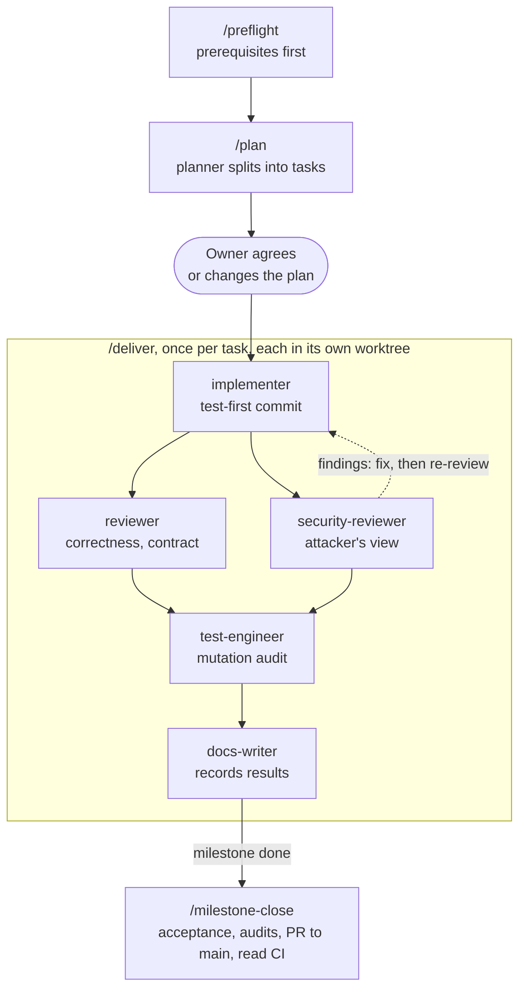

# Warden PoC: M1, the agent team, and the CI fixes

Report dated 2026-10-08 and updated 2026-10-09. It is a fixed record of those sessions; living status is in [../PROGRESS.md](../PROGRESS.md). It started as a claude.ai doc, which is now a view of this file.

## Summary

Milestone M1 of the Warden PoC is built and open as PR #1. A project-specific agent team with guard hooks was built, reviewed and merged into the same branch through PR #2. The three CI failures on PR #1 were fixed by running that team's process end to end.

- **PR #1** (`first-design-poc` → `main`). The first CI run had three failing tests. Two were real bugs in the M1 code; the third was a Windows check that compared text where it should have compared structure. All three are fixed, reviewed and merged into the branch. The second CI run (FX-4) passed on all four jobs.
- **PR #2** (`process/agent-team`, stacked on #1, merged 2026-10-09). It adds eight agents, four skills (`/preflight`, `/plan`, `/deliver`, `/milestone-close`), CLAUDE.md §15, and guard hooks with 56 tests that run in `make check`.
- **The reviews earned their place.** Independent reviewers found four real defects the authors' own tests had missed (see "What the reviews caught").
- **Waiting on the owner:** five open decisions and nine proposed follow-ups (see "Open decisions and follow-ups").

## Milestone M1: what was built

M1 delivered the daemon skeleton, the platform layer, the audit store, both model adapters, the CLI and a Copilot SDK spike, in 25 commits on `first-design-poc`. It is written in Go 1.27.1 against the module `warden.dev/warden`.

| Area | What it does | Coverage |
| --- | --- | --- |
| `internal/model` (+ `wire`, `probe`) | Canonical model API, streaming events, normalised errors, capability probe | 92% / 84% / 95% |
| `providers/anthropic`, `providers/openaicompat` | Hand-rolled adapters with golden tests; one request gives the same tool proposal from both | 90% / 89% |
| `internal/store` (+ `jcs`) | SQLite event ledger, a hash chain per session plus a system chain, signed checkpoints, `audit export` and `verify --strict` | 87% / 92% |
| `internal/secrets` | Keychain, encrypted-file and memory backends, `secret://` references, redaction of 16 secret types | 80% |
| `internal/platform` | Unix socket (mode 0600) or a named pipe with an owner-only ACL, owner-only files, home layout | 59% |
| `internal/api` | JSON-RPC 2.0 with a token handshake, strict schema validation, ordered subscriptions | 80% |
| `cmd/wardend`, `cmd/warden` | Daemon and CLI: `doctor`, `daemon`, `unlock`, `provider`, `models`, `audit`, `events` | n/a |
| `spikes/copilot` | Copilot SDK v1.0.16 spike, compiled but not run | n/a |

Overall statement coverage was 73.8%.

What was verified, on Windows 11 and in WSL2 Ubuntu 24.04:

- `make check`;
- starting and stopping the daemon;
- `warden doctor`;
- the unlock flow;
- `audit verify`: VERIFIED on the clean fixture, NOT VERIFIED on both tampered ones.

What is still blocked:

- Ollama and the Copilot CLI are not installed.
- Docker Desktop is not running.
- `store` and `secrets` are below their 90% coverage floors.

## The agent team and the delivery process

The main session plans and coordinates. Eight specialised agents do the work, each with a fresh context, one job, and only the tools that job needs. They live in `.claude/agents/` of this repository only, because each project gets a team fitted to it. Details are in [../WORKING-WITH-CLAUDE-CODE.md](../WORKING-WITH-CLAUDE-CODE.md).



| Agent | Owner's original role | Job | Can write |
| --- | --- | --- | --- |
| planner | (architect, new) | Turns a problem into tasks, each with acceptance criteria, the test that proves it, references and risks | nothing |
| implementer | Senior Developer | One task: test first, prove it fails, write the code, `make check`, one commit | code and tests |
| reviewer | (new) | Independent review for correctness and against the contract; every finding needs a failure scenario | nothing |
| security-reviewer | (new) | Reviews like an attacker, against the invariants and the threat model | nothing |
| test-engineer | QA and Tester, merged | Mutation checks, edge cases, coverage floors, flaky tests | tests only |
| platform-engineer | DevOps and SysOps, merged | CI on three OSes, WSL2, Docker, prerequisites | build, CI, scripts |
| docs-writer | (new) | Keeps PROGRESS, DECISIONS and CONFLICTS true to what was actually run | Markdown only |
| ui-designer | Senior Designer | Turns the B-series design into specs and reviews the running app (from M6) | nothing |

Why the roles changed:

- **QA and Tester were merged** because the two jobs overlap almost completely. **SysOps and DevOps were merged** because on a PoC they are one job.
- **The security reviewer is new** because Warden is a security product.
- **The docs writer is new** because the contract requires the working files to match what was actually run.

## Guard hooks

Six rules now run before every command and every file edit in this repository. Each one turns an instruction that once failed into a check that can't be skipped. They are in `.claude/hooks/` and are registered in `.claude/settings.json`.

| Rule | Refuses | Incident behind it |
| --- | --- | --- |
| Pull requests only | Pushes to `main`/`master`, bare pushes from them, force pushes | The owner's other project shipped bugs through "one-line" direct pushes |
| No skipped hooks | `--no-verify` on commit, push, merge or rebase | Standard hygiene |
| No commits on main | `git commit` while on `main`/`master` | Same as the first rule |
| Never commit red | A commit whose working tree has not passed `make check`; Markdown-only changes are exempt | `make check` once silently ignored lint failures (D-025) |
| Temp home for the binaries | `warden`/`wardend` runs without `WARDEN_HOME` | One M1 run created the owner's real `%LOCALAPPDATA%\Warden` |
| Read-only specification | Edits to `docs/docs/`, `docs/design/`, `docs/WRD-*`, `docs/PROMPT-*` | A "never" rule in the contract |

`.claude/hooks/test-hooks.sh` runs 56 cases inside `make check` on all three CI runners. Every rule is tested both ways: it must block what it should, and must let honest commands through. Each rule was also disabled in turn, and every time at least one case failed.

The first draft could not run at all: bash refuses `;`, `&` and `|` written directly inside `[[ =~ ]]`, so every command would have been blocked. The tests found it before anything was committed.

The hooks have not yet been seen firing in a live session. To check, from a session started in this repository run `git push --dry-run origin main`; it should be refused.

## The CI fixes, run through the process

The first CI run on PR #1 had three failing tests and no data races, panics or compile errors. macOS passed. The Ubuntu job never ran, because GitHub found no runner for it.

1. **Diagnosis.** A background agent read the CI logs and traced each failure to a line of code. It reproduced two of the three on this machine.
2. **Plan.** The planner checked the diagnosis against the code and turned it into four tasks, FX-1 to FX-4. It also found that the Windows permission check was only ever called by tests, so the real token file had been protected all along.
3. **Implement.** Three implementers worked in parallel, each in its own git worktree. Each wrote its test first and watched it fail before fixing the code.
4. **Review.** Each fix got a code review and a security review: six in total.
5. **Fixes.** Findings went back to the implementer as new commits, which were re-reviewed.
6. **Audit.** A test audit covered all three fixes, and the audit itself was reviewed.
7. **Record and push.** Everything was merged into `first-design-poc`, `make check` passed (23 packages), the docs writer recorded the results, and the branch was pushed.

| Task | CI failure | Root cause | Fix | Review result |
| --- | --- | --- | --- | --- |
| FX-1 | Linux race job: `sandbox.userns fails without a fix hint` | When bubblewrap is missing, the userns check said "not tested" but gave no hint | The verdict is now a pure function, and it points to installing bubblewrap 0.6.0+ | Both reviews approve, no findings |
| FX-2 | Windows: `level L1: unreachable engine status fail` | Docker serving Windows containers was always fatal, even when L2 is not the default | One rule for every unusable engine: fail if L2 is the default, otherwise warn | Approve; one stale comment, fixed. Three low-priority follow-ups |
| FX-3 | Windows: `TestWriteOwnerOnly ... owner-only false` | The owner-only check compared SDDL text, and Windows abbreviates some account ids (Administrator becomes `LA`) | A bounds-checked parser that compares the descriptor's structure | One major test gap, fixed. Parser sound, fuzzed |
| Audit | n/a | 66 deliberate breakages: 38 already caught, 28 slipped through | 23 of the 28 now caught, 5 equivalent mutants documented, a fuzz test added | Its review found a real parser gap; production code tightened, re-reviewed, approved |
| FX-4 | n/a | n/a | Re-run CI on all three OSes | Linux race, Ubuntu, macOS and Windows all pass (run 37825777402); the Ubuntu job ran for the first time |

## What the reviews caught

Independent reviewers found four real defects that the authors' own tests had missed. All four were in tests or test logic, which is exactly where an author's blind spot sits.

1. **A test that passed for the wrong reason (FX-3).** The "DACL absent" case was rejected by an unrelated check that ran first, so deleting the real check left every test green. A descriptor without that flag means "everyone has full access".
2. **A comment that disagreed with the code (FX-2).** It still said "unreachable engine" after the rule changed to "unusable engine".
3. **A fuzz property that was wrong (test audit).** The parser accepted a descriptor whose access list overlaps its own header, which real Windows never produces. The fix tightened the production parser, not just the test.
4. **A test pinning implementation trivia (test audit).** It checked a value no caller uses, so a harmless refactor would have failed it.

The reviewers were wrong once too. The FX-3 reviewer said the "NULL DACL" test could not isolate its check, and the implementer disagreed. Running the deletion settled it: the reviewer was right. That is why the process verifies findings instead of trusting either side.

Lessons:

- **Fresh context is the point.** Reviewers got the diff and the acceptance criteria, never the author's reasoning.
- **"Prove the test bites" needs a second pair of eyes.** Every author ran the revert check, yet three of the four findings were tests that didn't bite as intended.
- **Disagreements are settled by running code,** not by authority.
- **Scope stays narrow.** Nine hardening items became proposals, not part of the CI fix.

## Open decisions and follow-ups

Decisions for the owner (also in [../PROGRESS.md](../PROGRESS.md) and [../CONFLICTS.md](../CONFLICTS.md)):

- [ ] **C-01 / C-42:** is Windows a target? WRD-16 says it is not, but acceptance ran on Linux and Windows rather than macOS and Linux.
- [ ] **C-45:** accept `warden daemon start` as the one process the CLI starts outside a sandbox.
- [ ] Keep `TestProbe_ReportsEveryCheckHonestly` in `make check`, or move it to the integration tests? The planner recommends keeping it for M1.
- [ ] Pin CI to `ubuntu-24.04` before `ubuntu-latest` moves to 26 on 2026-10-19, or decide this with the M2 integration job.
- [x] Merge order: PR #2 was merged into `first-design-poc` on 2026-10-09, so PR #1 now carries everything.

Proposed follow-ups from the security reviews:

- [ ] **Named-pipe squatting:** the client does not check who serves `\\.\pipe\warden-<user>` before sending its token. This is the most serious item and needs its own review.
- [ ] Verify and write the file *owner* in the Windows owner-only check (CWE-283).
- [ ] The token exists before its permissions are tightened. Create it with its permissions already set, use an unpredictable temp name, and lock down the home and run directories (CWE-367/377/276).
- [ ] Production callers of `OwnerOnly`: the daemon after writing the token, and the client before sending it.
- [ ] M2: creating an L2 sandbox must check Docker itself; doctor's status is not a gate (CWE-636).
- [ ] Strip control characters from doctor output, and validate Docker's version and OS strings (CWE-150).
- [ ] Normalise `sandbox.default_level` when config loading arrives (CWE-178).
- [ ] A Windows test that the named pipe's permissions are owner-only (M1 transport tests).
- [ ] Wire the coverage gate into CI, and raise `store` and `secrets` to their 90% floors.

## Where everything lives

The code is in `enterprise-agent-runtime/agent-runtime-poc`, whose default branch is `main`.

- [PR #1](https://github.com/enterprise-agent-runtime/agent-runtime-poc/pull/1): M1, the fixes, and the agent team.
- [PR #2](https://github.com/enterprise-agent-runtime/agent-runtime-poc/pull/2): the agent team itself, merged into PR #1's branch.

| Folder (`D:\Projects\enterprize-agent-runtime\`) | Branch | What it is | After merge |
| --- | --- | --- | --- |
| `agent-runtime-poc` | `first-design-poc` | Main checkout, PR #1 | Keep |
| `agent-runtime-poc-process` | `process/agent-team` | PR #2, now merged | Remove the worktree |
| `agent-runtime-poc-fx1`, `-fx2`, `-fx3` | `fix/fx1-...`, `fix/fx2-...`, `fix/fx3-...` | One per CI fix, merged | Remove |
| `agent-runtime-poc-audit` | `fix/fx-test-audit` | Test audit, merged | Remove |
| `agent-platform-docs` | n/a | Specification and design: the owner's source, copied into `docs/` | Keep |

Documents in this repository:

- `CLAUDE.md`, the contract;
- the working files `docs/PROGRESS.md`, `DECISIONS-poc.md`, `CONFLICTS.md` and `INDEX.md`;
- `docs/GLOSSARY.md`;
- `docs/WORKING-WITH-CLAUDE-CODE.md`;
- the reports in `docs/reports/`.

On the owner's machine, outside the repository:

- Go 1.27.1, user-local on Windows and in WSL2.
- WSL2 copies of the code in `~/src/warden`. `~/src/fx1`, `~/src/audit` and `~/src/audit2` are disposable.
- A stray `%LOCALAPPDATA%\Warden`, created by mistake. Its daemon is stopped, and it can be deleted.
- The `warden:keys/checkpoint/ed25519` entry in Windows Credential Manager.

To remove the merged worktrees (branches and history stay), run this in the main checkout:

```bash
for w in process fx1 fx2 fx3 audit; do git worktree remove ../agent-runtime-poc-$w; done
```
